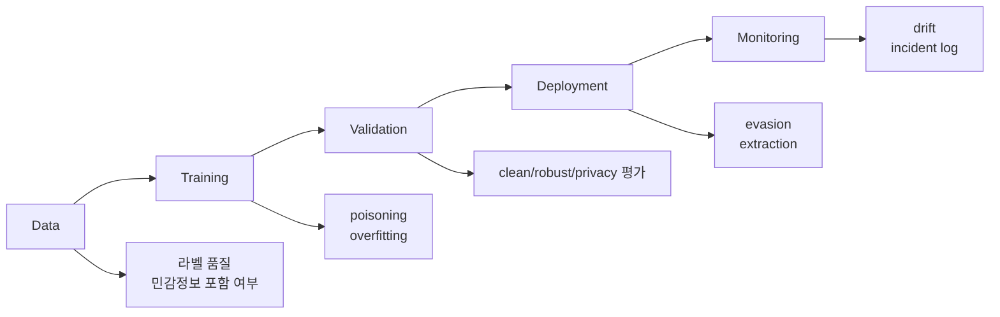

# W01 딥러닝 패러다임 & ML 보안 분류학 통합보고서

## 0. 메타정보

| 항목 | 내용 |
|---|---|
| 주차 | W01 |
| 주제 | 딥러닝 패러다임 & ML 보안 분류학 |
| 문서 상태 | 제출용 최종 초안, 사람 검토 필요 |
| 작성 기준 | 문헌 5편, synthetic 기반 안전 모의실험, AI 활용 기록 |
| 안전 범위 | 실제 개인정보, 운영 서비스, 무단 API 질의, 악성코드 실행 제외 |
| P04 검증 상태 | 강의계획서 지정 IEEE COMST 논문과 동일 여부 확인 필요. 현재 문서는 arXiv P04 기준 |
| 실험 산출물 | `04_experiment/outputs/metrics_summary.csv`, `results.json`, `run_log.md` 존재 확인 |

## 1. 한 문장 요약

W01은 딥러닝을 단일 모델이 아니라 데이터, 학습, 검증, 배포, 모니터링이 연결된 ML 생명주기 시스템으로 보고, 보안성을 clean performance, robust performance, privacy leakage, reproducibility evidence로 분리해 평가하는 기준 주차다.

## 2. 학습 배경과 주차 목표

### 2.1 이번 주 주제의 위치

W01은 전체 AI 보안 세미나의 기준 프레임을 세우는 주차다. 이후 W02 데이터 오염, W03 비전 대적공격, W07 LLM 보안, W08 RAG 프롬프트 인젝션, W11 차등프라이버시, W14 MLOps 공급망 보안은 모두 W01에서 정리한 ML 생명주기, 위협모형, 평가방법, 재현성 기준 위에서 해석된다.

### 2.2 강의계획서상 학습목표

- 딥러닝 핵심 구성요소를 공통 언어로 정리한다.
- ML lifecycle assurance desiderata를 정의한다.
- 대적 공격과 프라이버시 공격 분류학을 연구지도 템플릿으로 고정한다.

### 2.3 이번 주 핵심 질문

1. 딥러닝은 왜 단순 모델이 아니라 생명주기 시스템으로 평가해야 하는가?
2. clean accuracy만으로 ML 보안성을 설명할 수 없는 이유는 무엇인가?
3. 대적 공격, 프라이버시 공격, 침입탐지 오류는 어떤 평가축으로 분리해야 하는가?
4. W01의 문헌과 실습을 기말 KCI 논문 주제로 발전시키려면 어떤 연구문제가 적절한가?

## 3. AI 원리 70% 정리

딥러닝은 원시 입력에서 계층적 표현을 학습하는 방식으로 발전해 왔다[1]. 다층 신경망은 각 층에서 입력을 변환하고, 손실함수의 gradient를 이용해 파라미터를 갱신한다. 보안 관점에서 이 구조는 중요하다. 공격자가 입력이나 데이터 분포를 조작할 때 실제로 흔드는 것은 모델의 내부 표현과 결정 경계이기 때문이다.

학습은 손실을 줄이는 과정이고, 일반화는 학습 데이터 밖에서도 성능이 유지되는지를 뜻한다. 과적합은 성능 저하의 문제가 아니라 학습 데이터 포함 여부나 민감 속성 노출로 이어질 수 있는 privacy leakage의 위험 신호가 될 수 있다[5].

**표 1. 핵심 개념과 보안 연결**

| 핵심 개념 | 의미 | 보안 연결 | 관련 문헌 |
|---|---|---|---|
| 표현학습 | 원시 입력에서 유용한 특징을 모델이 직접 학습 | 대적 입력이 내부 표현을 왜곡할 수 있음 | [1], [4] |
| 역전파 | gradient를 이용한 파라미터 갱신 | gradient 기반 공격과 방어 검증의 배경 | [1], [4] |
| 일반화 | 새 데이터에서도 성능이 유지되는 성질 | clean 성능과 robust 성능 분리 필요 | [1], [2] |
| 과적합 | 학습 데이터에 과도하게 맞는 상태 | membership inference와 confidence leakage 위험 신호 | [5] |
| 생명주기 증거 | 데이터, 설정, 실행 로그, 검토 기록 | 보안 주장의 재현성 검토 조건 | [2] |

## 4. 보안 이슈 30% 정리

ML 시스템 보증은 데이터 수집, 학습, 검증, 배포 전 단계의 증거 관리 문제로 볼 수 있다[2]. 침입탐지에서는 정확도뿐 아니라 오탐과 미탐을 분리해 평가해야 한다[3]. 대적 공격 연구는 clean accuracy와 robust accuracy를 분리해 보고해야 함을 보여준다[4]. 프라이버시 공격 연구는 모델 출력이 학습 데이터 포함 여부나 민감 속성을 노출할 수 있음을 지적한다[5].

CIA 관점으로 보면 confidentiality는 privacy leakage, integrity는 adversarial example과 poisoning, availability는 오탐 폭증과 탐지 실패, accountability는 seed, config, DOI, 실행 로그, 검토 기록 보존 문제로 연결된다.

**그림 1. ML 생명주기 기반 보안 평가 프레임**

## 5. 논문 5편 요약

**표 2. 관련 문헌 5편 요약**

| ID | 논문 | 핵심 기여 | W01 활용 |
|---|---|---|---|
| P01 | Deep learning | 딥러닝의 표현학습과 역전파 원리 정리 | AI 원리의 배경 |
| P02 | Assuring the Machine Learning Lifecycle | ML 생명주기별 보증 요건과 방법 정리 | 위협모형과 재현성 프레임 |
| P03 | A Survey of Data Mining and Machine Learning Methods for Cyber Security Intrusion Detection | 침입탐지 ML 방법과 평가 지표 분류 | 탐지 지표와 보안 데이터 한계 |
| P04 | Adversarial Attacks and Defenses in Machine Learning-Powered Networks: A Contemporary Survey | 대적 공격·방어 taxonomy와 방어 한계 정리 | robust 평가 기준. 강의계획서 지정 IEEE 논문과 동일 여부 확인 필요 |
| P05 | A Survey of Privacy Attacks in Machine Learning | privacy attack taxonomy와 threat model 정리 | leakage risk 평가축 |

주의: 본 W01 보고서의 P04는 강의계획서 지정 IEEE Communications Surveys & Tutorials 논문과 동일 여부를 최종 확인하지 못했거나, 대체 arXiv 논문으로 정리되었다. 최종 제출 전 강의계획서 지정 논문으로 교체하거나, 대체 논문 사용 사유를 교수자에게 설명해야 한다.

## 6. 논문 5편 비교표

P01은 원리 중심, P02는 프로세스 중심, P03은 보안 탐지 응용 중심, P04는 무결성 공격 중심, P05는 기밀성 공격 중심이다. 이들을 하나의 선형 서사로 읽기보다 “원리-생명주기-탐지-대적공격-프라이버시”의 다섯 축으로 배치해야 한다.

| 논문 | 연구문제 | 핵심 방법 | 보안 위협 | 평가 지표 | 한계 |
|---|---|---|---|---|---|
| P01 | 딥러닝은 어떻게 계층적 표현을 학습하는가 | 리뷰, 모델 구조 정리 | 직접 보안 논문은 아니나 gradient 취약성의 배경 | 일반화 성능, 표현 품질 | 보안 위협모형 부재 |
| P02 | ML 시스템 안전성을 어떤 생명주기 증거로 보증할 것인가 | lifecycle 단계화, desiderata 정리 | 데이터/모델/배포 단계 보증 실패 | traceability, evidence coverage | 공격별 정량 프로토콜은 별도 필요 |
| P03 | 침입탐지에 어떤 ML 방법이 적합한가 | 알고리즘·데이터·지표 survey | 오탐, 미탐, drift, 라벨 품질 | detection rate, FAR, precision/recall/F1 | 공개 데이터셋과 실제망 격차 |
| P04 | 대적 공격과 방어를 어떻게 분류하고 검증할 것인가 | attack/defense taxonomy | evasion, physical attack, gradient masking | ASR, robust accuracy, clean accuracy | arXiv 대체 논문 기준, IEEE 지정 논문 동일 여부 확인 필요 |
| P05 | ML 프라이버시 공격은 어떤 지식과 자산을 노리는가 | privacy taxonomy, threat model | membership inference, model inversion | leakage risk, attack advantage | 단일 지표로 privacy risk 요약 어려움 |

## 7. Research Track 분석

### 7.1 연구문제

- RQ1. ML 생명주기 각 단계에서 AI 보안 평가를 위해 필요한 최소 증거는 무엇인가?
- RQ2. clean performance, robust performance, privacy leakage, reproducibility evidence를 통합한 평가 체크리스트는 어떻게 구성할 수 있는가?
- RQ3. synthetic toy evaluation은 실제 AI 보안 평가 프레임워크를 설명하는 데 어떤 장점과 한계를 가지는가?

### 7.2 위협모형

대상 시스템은 딥러닝 또는 일반 ML 모델을 포함한 보안 응용 시스템이다. 보호 자산은 학습 데이터, 모델 파라미터, 입력 데이터, 출력 confidence, 평가셋, 운영 로그다. 공격자 지식은 white-box, gray-box, black-box로 구분하고, 공격자 능력은 입력 조작, 데이터 기여, 반복 질의, 출력 관찰로 제한해 기술한다.

### 7.3 평가축

**표 3. W01 평가축**

| 평가축 | 질문 | 대표 지표 또는 증거 |
|---|---|---|
| Clean performance | 정상 조건에서 잘 맞는가 | accuracy, precision, recall, F1 |
| Robust performance | 교란 조건에서도 유지되는가 | robust accuracy, performance drop |
| Privacy leakage | 데이터 포함 여부나 민감 정보가 새는가 | train-test gap, confidence signal, attack advantage |
| Reproducibility evidence | 같은 결과를 다시 만들 수 있는가 | seed, config, code, logs, DOI/URL 검증 |

### 7.4 재현성

재현성을 위해 DOI/URL 검증표, 로컬 PDF 목록, Dockerfile, `pyproject.toml`, config, seed, 실행 소스, 결과 파일을 보존한다. W01 실습 결과는 `04_experiment/outputs/`에 저장되어 있다.

## 8. 실습 보고서

본 실습은 딥러닝 성능 재현이 아니라 W01의 핵심인 ML 보안 평가축을 안전하게 설명하기 위한 최소 toy protocol이다. 따라서 로지스틱 회귀를 사용하되, 평가 구조는 이후 딥러닝 모델에도 동일하게 확장 가능하도록 clean performance, perturbation impact, privacy-safe audit, reproducibility evidence로 분리하였다.

**표 4. W01 실습 설계**

| 항목 | 내용 |
|---|---|
| 데이터 | Synthetic binary classification data |
| 모델 | Toy logistic regression |
| 조건 1 | Clean baseline |
| 조건 2 | Label-noise training |
| 조건 3 | Toy feature perturbation |
| 조건 4 | Privacy-safe overfitting/confidence audit |
| Seed | 42 |
| Output files | `metrics_summary.csv`, `results.json`, `run_log.md` |

**표 5. W01 실습 결과**

| 조건 | Accuracy | Precision | Recall | F1 | 보안 해석 |
|---|---:|---:|---:|---:|---|
| Clean baseline | 0.869444 | 0.867403 | 0.872222 | 0.869806 | 정상 synthetic test split 기준 |
| Label-noise training | 0.838889 | 0.827957 | 0.855556 | 0.841530 | training label 126개 flip 후 성능 저하 |
| Toy feature perturbation | 0.844444 | 0.848315 | 0.838889 | 0.843575 | Gaussian feature noise 조건에서 성능 저하 |

Privacy-safe audit 결과 train accuracy는 0.857143, test accuracy는 0.869444, train-test gap은 -0.012301이며 risk label은 `low_overfitting_signal`이다. 이 결과는 synthetic data의 과적합 신호 점검이며, 실제 데이터 대상 membership inference 공격 결과로 해석하지 않는다.

## 9. AI 도구 활용 기록

Codex와 ChatGPT 계열 AI 도구를 사용해 W01 산출물의 구조화, 논문별 요약 보강, DOI/URL 검증표 정리, 실습 소스 작성, 제출용 보고서 문장화를 수행했다. AI가 생성한 문장은 제출 전 초안으로만 취급하며, 최종 원고의 사실관계, 인용, 실험결과, 연구윤리 책임은 제출자가 확인해야 한다.

## 10. 토론 질문

1. ML 보안 평가에서 clean accuracy와 robust accuracy 중 어느 쪽을 먼저 보고해야 하는가?
2. synthetic 기반 안전 모의실험 결과를 실제 보안성 주장으로 과도하게 일반화하지 않으려면 어떤 표현이 필요한가?
3. 생명주기 보증 증거 중 최종 제출물에 반드시 포함해야 할 최소 항목은 무엇인가?

## 11. 기말논문 연결

W01은 기말 논문의 상위 프레임을 제공한다. 핵심 주제 후보는 “ML 생명주기 기반 AI 보안 평가 프레임워크 연구”이며, 후속 주차의 poisoning, adversarial vision, LLM security, RAG prompt injection, differential privacy, model stealing, MLOps supply-chain security를 데이터 관리, 모델 학습, 검증, 배포·운영 단계에 매핑할 수 있다.

## 12. KCI 논문 형식 전환

### 12.1 KCI형 제목 후보

**표 6. KCI 논문 제목 후보**

| 번호 | 국문 제목 후보 | 영문 제목 후보 | 대상 시스템 | 보안 위협 | 연구방법 | 예상 기여 |
|---:|---|---|---|---|---|---|
| 1 | ML 생명주기 기반 AI 보안 평가 프레임워크 연구 | A Study on an AI Security Evaluation Framework Based on the ML Lifecycle | ML/딥러닝 시스템 | 보안 평가 누락, 재현성 실패 | 문헌분석 + 체크리스트 | 생명주기 기반 평가 프레임 |
| 2 | 인공지능 보안 평가를 위한 성능·강건성·프라이버시·재현성 통합 체크리스트 연구 | An Integrated Checklist for AI Security Evaluation: Performance, Robustness, Privacy, and Reproducibility | AI 보안 시스템 | 대적 공격, 프라이버시 누출 | 문헌 매트릭스 + toy evaluation | 통합 평가 체크리스트 |
| 3 | 딥러닝 기반 보안 시스템의 생명주기 보증과 평가 지표 연구 | Lifecycle Assurance and Evaluation Metrics for Deep Learning-Based Security Systems | 딥러닝 보안 응용 | 데이터·모델·운영 리스크 | 위협모형 + 평가 프로토콜 | 보안 평가 지표 체계 |

### 12.2 추천 최종 제목

- 국문: ML 생명주기 기반 AI 보안 평가 프레임워크 연구
- 영문: A Study on an AI Security Evaluation Framework Based on the ML Lifecycle

### 12.3 국문초록 초안

본 연구는 딥러닝 기반 AI 시스템의 보안성을 단일 정확도 지표가 아니라 데이터 수집, 학습, 검증, 배포, 모니터링으로 이어지는 ML 생명주기 관점에서 평가하는 프레임워크를 제안한다. 이를 위해 딥러닝 원리, ML 생명주기 보증, 침입탐지, 대적 공격, 프라이버시 공격 관련 선행연구를 비교하고, clean performance, robust performance, privacy leakage, reproducibility evidence의 네 가지 평가축을 도출한다. 또한 synthetic toy evaluation을 통해 정상 성능, 라벨 노이즈, 입력 교란, 과적합 신호를 구분해 기록하는 절차를 제시한다. 본 연구는 AI 보안 평가에서 성능·강건성·프라이버시·재현성을 분리해 관리해야 함을 보이며, 후속 AI 보안 연구의 체크리스트와 기말 논문 주제 확장에 활용될 수 있다.

### 12.4 영문초록 초안

This study proposes a lifecycle-based evaluation framework for AI security. Instead of treating model accuracy as the sole indicator of security, the framework considers the entire machine learning lifecycle, including data collection, training, validation, deployment, and monitoring. By reviewing prior studies on deep learning, ML lifecycle assurance, intrusion detection, adversarial machine learning, and privacy attacks, this report derives four evaluation axes: clean performance, robust performance, privacy leakage, and reproducibility evidence. A safe synthetic toy evaluation is also presented to distinguish baseline performance, label-noise impact, input perturbation impact, and overfitting-related privacy signals. The proposed structure can serve as a checklist for AI security evaluation and as a foundation for further KCI-style research papers.

### 12.5 키워드

| 구분 | 키워드 |
|---|---|
| 국문 | 딥러닝, AI 보안, ML 생명주기, 대적 공격, 프라이버시 공격, 재현성 |
| 영문 | Deep Learning, AI Security, ML Lifecycle, Adversarial Attack, Privacy Attack, Reproducibility |

### 12.6 연구문제

- RQ1. ML 생명주기 각 단계에서 AI 보안 평가를 위해 필요한 최소 증거는 무엇인가?
- RQ2. clean performance, robust performance, privacy leakage, reproducibility evidence를 통합한 평가 체크리스트는 어떻게 구성할 수 있는가?
- RQ3. synthetic toy evaluation은 실제 AI 보안 평가 프레임워크를 설명하는 데 어떤 장점과 한계를 가지는가?

### 12.7 연구방법

- 문헌분석: W01 논문 5편을 원리, 생명주기 보증, 침입탐지, 대적 공격, 프라이버시 공격으로 분류한다.
- 비교분석: 각 논문의 연구문제, 방법론, 평가 지표, 한계를 비교한다.
- 위협모형: 보호 자산, 공격자 지식, 공격자 능력, 공격 경로를 생명주기별로 정리한다.
- 모의실험: synthetic toy data를 사용해 clean baseline, label-noise training, toy feature perturbation, privacy-safe audit을 수행한다.
- 체크리스트 설계: 성능, 강건성, 프라이버시, 재현성 평가 항목을 통합한다.

### 12.8 보안적 함의

- Confidentiality: membership inference, model inversion, confidence leakage 위험과 연결된다.
- Integrity: adversarial example, poisoning, backdoor와 연결된다.
- Availability: 탐지 실패, 오탐 폭증, 운영 피로와 연결된다.
- Privacy: 과적합, 출력 확률 노출, 데이터 포함 여부 추론과 연결된다.
- Accountability: seed, config, DOI, 실행 로그, 검토 기록 보존과 연결된다.

### 12.9 KCI 제출 가능성 점검표

| 점검 항목 | 상태 |
|---|---|
| 국문·영문 제목 후보 작성 | 완료 |
| 국문초록 초안 작성 | 완료 |
| 영문초록 초안 작성 | 완료 |
| 키워드 작성 | 완료 |
| 연구문제 작성 | 완료 |
| 연구방법 작성 | 완료 |
| 표 1개 이상 포함 | 완료 |
| 그림 1개 이상 포함 | 확인 필요 |
| 국내 참고문헌 3편 이상 | 확인 필요 |
| 해외 참고문헌 5편 이상 | W01 기준 완료 |
| AI 활용 고지 | 완료, 사람 검토 필요 |

## 13. SCI 논문 형식 전환

### 13.1 SCI 제목 후보

A Lifecycle-Based Evaluation Framework for AI Security: Integrating Clean Performance, Robustness, Privacy Leakage, and Reproducibility Evidence

### 13.2 Structured Abstract

#### Background

Deep learning systems are increasingly deployed in security-sensitive domains, but their reliability cannot be evaluated solely by clean accuracy.

#### Problem

Existing evaluations often separate model performance, adversarial robustness, privacy leakage, and reproducibility, making it difficult to assess AI security at the system lifecycle level.

#### Method

This study synthesizes five representative studies on deep learning, ML lifecycle assurance, intrusion detection, adversarial machine learning, and privacy attacks. It also designs a safe synthetic toy evaluation to illustrate separate reporting of clean performance, perturbation impact, privacy-safe audit, and reproducibility evidence.

#### Results

The W01 toy evaluation shows that label noise and feature perturbation reduce performance compared with the clean baseline. The result should not be interpreted as real-world security performance, but as an example of structured AI security reporting.

#### Contribution

The main contribution is a lifecycle-based evaluation structure that separates clean performance, robust performance, privacy leakage, and reproducibility evidence.

#### Implications

The framework can be extended to later topics such as data poisoning, adversarial vision, LLM security, RAG prompt injection, differential privacy, model stealing, and MLOps supply-chain security.

### 13.3 Introduction 구성

- AI 보안 평가에서 clean accuracy 중심 접근의 한계
- ML 생명주기 기반 평가 필요성
- 대적 공격과 프라이버시 공격의 평가축 분리 필요성
- 재현성 증거의 중요성
- 본 연구의 contribution

### 13.4 Related Work 축

**표 7. SCI Related Work 축**

| 연구축 | 대표 논문 | 역할 |
|---|---|---|
| Deep learning principles | LeCun et al. | 모델·표현학습 원리 |
| ML lifecycle assurance | Ashmore et al. | 생명주기 보증 |
| ML for intrusion detection | Buczak and Guven | 보안 탐지 평가 |
| Adversarial ML | Wang et al. | 강건성 평가. 강의계획서 지정 논문 동일 여부 확인 필요 |
| Privacy attacks | Rigaki and Garcia | 프라이버시 누출 평가 |

### 13.5 Threat Model

- Target system: ML or deep learning-based security application
- Protected assets: training data, model parameters, input data, output confidence, evaluation set, logs
- Adversary knowledge: white-box, gray-box, black-box
- Adversary capability: input manipulation, data contribution, repeated query, output observation
- Excluded scope: real-world attack execution, unauthorized API query, personal data use, malware execution

### 13.6 Methodology

- Literature matrix construction
- Lifecycle threat mapping
- Evaluation-axis design
- Safe synthetic toy evaluation
- Reproducibility checklist

### 13.7 Experimental Setup

| Item | Description |
|---|---|
| Dataset | Synthetic binary classification data |
| Model | Toy logistic regression |
| Baseline | Clean baseline |
| Security scenario | Label-noise training, toy feature perturbation |
| Privacy audit | Overfitting/confidence signal only |
| Environment | Ubuntu 24.04 / Docker / Python 3.11 |
| Seed | 42 |
| Output files | metrics_summary.csv, results.json, run_log.md |

### 13.8 Results

Outputs 파일 기준 실험 결과는 표 5와 같다. Clean baseline accuracy는 0.869444이고, label-noise training accuracy는 0.838889, toy feature perturbation accuracy는 0.844444이다. Privacy-safe audit의 train-test gap은 -0.012301이며 risk label은 `low_overfitting_signal`이다.

### 13.9 Discussion

- Clean performance와 robust performance는 분리해 기록해야 한다.
- Privacy leakage는 robust accuracy와 다른 평가축이다.
- Synthetic toy evaluation은 평가 구조를 설명하는 데 유용하지만 실제 운영망 보안성으로 일반화할 수 없다.
- 생명주기 evidence는 보안 주장 자체가 아니라 보안 주장을 검토할 수 있게 하는 최소 조건이다.

### 13.10 Limitations and Threats to Validity

- Internal validity: toy logistic regression이 딥러닝 모델을 직접 대표하지 않는다.
- External validity: synthetic data는 실제 보안 데이터의 imbalance, drift, attack diversity를 반영하지 못한다.
- Construct validity: privacy-safe audit은 membership inference 공격이 아니라 overfitting signal 점검이다.
- Reproducibility: outputs 파일, seed, config, Docker 환경의 보존 여부가 필요하다.

### 13.11 Conclusion

W01은 AI 보안 평가를 모델 정확도 중심이 아니라 ML 생명주기 기반 evidence 중심으로 재구성한다. 이 구조는 후속 주차의 공격·방어·프라이버시·운영 보안 주제를 하나의 평가 프레임워크로 연결하는 기반이 된다.

## 14. 발표용 요약

- 핵심 메시지: accuracy가 높아도 AI 시스템이 안전하다고 말할 수 없다.
- 발표 흐름: 딥러닝 원리, ML 생명주기, 대적 공격, 프라이버시 공격, synthetic 기반 안전 모의실험, 기말논문 연결 순서로 설명한다.
- 실습 메시지: label noise와 feature perturbation 조건에서 성능 변화가 나타났지만, 이는 실제 공격 성공률이 아니라 평가축 분리 예시다.
- 최종 강조: W01의 결과물은 후속 주차를 하나의 lifecycle evidence framework로 묶는 기준표다.

## 15. 참고문헌 검증표

| 번호 | 참고문헌 | DOI/URL | 검증 상태 | 비고 |
|---:|---|---|---|---|
| [1] | LeCun, Bengio, Hinton, Deep learning, Nature, 2015 | https://doi.org/10.1038/nature14539 | 확인 | Nature 랜딩 페이지와 로컬 PDF 제목 확인 |
| [2] | Ashmore, Calinescu, Paterson, Assuring the Machine Learning Lifecycle, ACM CSUR, 2021 | https://doi.org/10.1145/3453444 | 부분 확인 | 로컬 PDF/accepted version DOI 확인. 출판사 랜딩 재확인 필요 |
| [3] | Buczak, Guven, A Survey of Data Mining and Machine Learning Methods for Cyber Security Intrusion Detection, IEEE COMST, 2016 | https://doi.org/10.1109/COMST.2015.2494502 | 확인 | 로컬 PDF 메타데이터와 첫 페이지 DOI 확인 |
| [4] | Wang et al., Adversarial Attacks and Defenses in Machine Learning-Powered Networks: A Contemporary Survey, arXiv, 2023 | https://doi.org/10.48550/arXiv.2303.06302 | arXiv 확인, 강의계획서 지정 논문 동일 여부 확인 필요 | IEEE COMST 25(4) 2245-2298 정보와 동일 여부 미확정 |
| [5] | Rigaki, Garcia, A Survey of Privacy Attacks in Machine Learning, ACM CSUR, 2023 | https://doi.org/10.1145/3624010 | 부분 확인 | 로컬 arXiv v3/ACM 양식 PDF 확인. 출판사 랜딩 재확인 필요 |

## 16. 자기 점검표

| 점검 항목 | 상태 | 비고 |
|---|---|---|
| 1장 한 문장 요약 작성 | 완료 |  |
| 2장 학습 배경과 주차 목표 작성 | 완료 |  |
| AI 원리 70% 정리 | 완료 |  |
| 보안 이슈 30% 정리 | 완료 |  |
| 논문 5편 요약 | 완료 | P04 동일 여부 확인 필요 |
| 논문 5편 비교표 | 완료 |  |
| Research Track 5요소 작성 | 완료 | 연구문제, 위협모형, 평가방법, 재현성, 오픈문제 |
| P04 논문 지정 여부 검증 | 확인 필요 | arXiv P04와 강의계획서 IEEE 논문 동일 여부 미확정 |
| 실험 outputs 파일 존재 확인 | 완료 | 세 파일 존재 |
| 실험 결과와 보고서 수치 일치 | 완료 | outputs 기준 반영 |
| KCI 논문 형식 전환 작성 | 완료 |  |
| SCI 논문 형식 전환 작성 | 완료 |  |
| 본문 인용과 참고문헌 대응 | 완료 / 확인 필요 | P04 DOI/출판정보 확인 필요 |
| 표·그림 번호 정리 | 완료 | 표 1-7, 그림 1 |
| AI 활용 고지 작성 | 완료 | 사람 검토 필요 |
| PDF 저작권 위험 점검 | 완료 / 조치 필요 | PDF 원문 5개가 Git 추적 중. 삭제 또는 링크 대체 검토 필요 |
| 최종 사람이 검토할 항목 표시 | 완료 |  |
