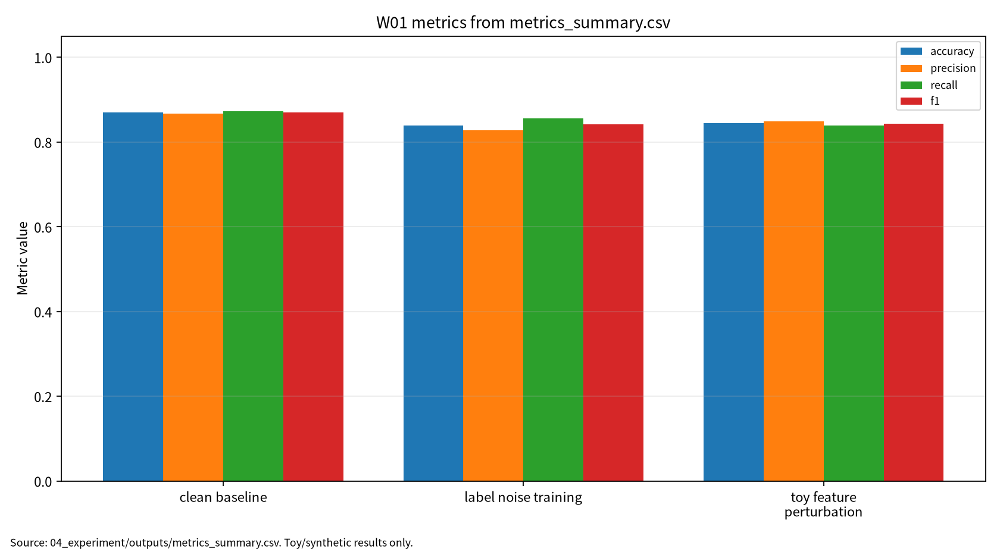

# W01 제출용 보고서

## 0. 메타정보

| 항목 | 내용 |
|---|---|
| 주차 | W01 |
| 보고서 제목 | 딥러닝 패러다임 & ML 보안 분류학 |
| 과목 범위 | AI 보안 |
| 작성자 | 박영세 |
| 학번 | 26200122 |
| 작성일 | 확인 필요 |
| 보완일 | 2026-06-23 |
| 문서 상태 | 제출용 보고서 |
| 관련 산출물 위치 | `03_weekly_reports/w01_deep_learning_ml_security/` |

## 초록

본 보고서는 딥러닝 원리와 ML 보안 분류학을 연결해 AI 모델을 데이터, 학습, 검증, 배포, 모니터링으로 이어지는 생명주기 시스템으로 해석한다. 문헌 5편을 바탕으로 clean performance, robust performance, privacy leakage, reproducibility evidence의 평가축을 정리하고, synthetic 기반 안전 모의실험으로 라벨 노이즈, 입력 교란, 과적합 신호를 분리 기록하였다. 실험은 실제 개인정보나 운영 서비스를 사용하지 않으며, 결과는 실제 공격 성공이 아니라 보안 평가 보고 구조의 예시로 한정한다.

**키워드:** 딥러닝, ML 보안, 생명주기 보증, 대적 공격, 프라이버시 공격, 재현성
## 1. 한 문장 요약

W01은 딥러닝을 “정확도를 내는 모델”이 아니라 ML 생명주기 전체에서 검증해야 하는 보안 시스템으로 재정의하는 기준 주차다.

## 2. 학습 배경과 주차 목표

### 2.1 이번 주 주제의 위치

W01은 전체 AI 보안 세미나의 기준 프레임을 세우는 주차다. 이후 W02 데이터 오염, W03 비전 대적공격, W07 LLM 보안, W08 RAG 프롬프트 인젝션, W11 차등프라이버시, W14 MLOps 공급망 보안은 모두 W01에서 정리한 ML 생명주기, 위협모형, 평가방법, 재현성 기준 위에서 해석된다.

### 2.2 강의계획서상 학습목표

- 딥러닝 핵심 구성요소를 공통 언어로 정리한다.
- ML lifecycle assurance desiderata를 정의한다.
- 대적 공격과 프라이버시 공격 분류학을 연구지도 템플릿으로 고정한다.

### 2.3 이번 주 핵심 질문

1. 딥러닝은 왜 단순 모델이 아니라 생명주기 시스템으로 평가해야 하는가?
2. clean accuracy만으로 ML 보안성을 설명할 수 없는 이유는 무엇인가?
3. 대적 공격, 프라이버시 공격, 침입탐지 오류는 어떤 평가축으로 분리해야 하는가?
4. W01의 문헌과 실습을 기말 KCI 논문 주제로 발전시키려면 어떤 연구문제가 적절한가?

## 3. AI 원리 70% 정리

딥러닝은 원시 입력에서 계층적 표현을 학습하는 방식으로 발전해 왔다[1]. LeCun, Bengio, Hinton의 논문은 표현학습, 역전파, CNN/RNN 계열 모델의 기본 원리를 정리한다. 보안 관점에서 이 원리는 중요하다. 공격자가 모델 입력이나 데이터 분포를 조작할 때 실제로 영향을 받는 것은 모델의 내부 표현과 decision boundary이기 때문이다.

학습은 손실함수를 최소화하는 파라미터를 찾는 과정이며, 일반화는 학습 데이터 밖에서도 성능이 유지되는지를 의미한다. 과적합은 일반적인 성능 저하 문제에 그치지 않고 membership inference와 같은 privacy leakage 위험의 배경이 될 수 있다[5].

**표 1. 핵심 개념과 보안 연결**

| 핵심 개념 | 의미 | 보안 연결 |
|---|---|---|
| 표현학습 | 원시 입력에서 유용한 특징을 모델이 직접 학습 | 대적 입력이 내부 표현을 왜곡할 수 있음 |
| 역전파 | gradient를 이용한 파라미터 갱신 | gradient 기반 공격의 기술적 배경 |
| 일반화 | 새 데이터에서도 성능이 유지되는 성질 | clean 성능과 robust 성능의 분리 필요 |
| 과적합 | 학습 데이터에 과도하게 맞는 상태 | privacy leakage와 membership inference 위험 신호 |

## 4. 보안 이슈 30% 정리

ML 시스템 보증은 데이터 수집, 학습, 검증, 배포 전 단계의 증거 관리 문제로 볼 수 있다[2]. 침입탐지에서는 정확도뿐 아니라 오탐과 미탐을 분리해 평가해야 한다[3]. 대적 공격 연구는 clean accuracy와 robust accuracy를 분리해 보고해야 함을 보여준다[4]. 프라이버시 공격 연구는 모델 출력이 학습 데이터 포함 여부나 민감 속성을 노출할 수 있음을 지적한다[5].

| 보안 속성 | ML 보안 문제 | 대표 위협 |
|---|---|---|
| Confidentiality | 학습 데이터와 민감 정보 노출 | membership inference, model inversion |
| Integrity | 예측 결과 조작 | adversarial example, poisoning |
| Availability | 탐지 실패 또는 오탐 폭증 | IDS 미탐, 오탐 비용 증가 |
| Accountability | 결과 재현과 책임 추적 실패 | seed, config, 로그 누락 |

## 5. 논문 5편 요약

**표 2. 관련 문헌 5편 요약**

| ID | 논문 | 핵심 기여 | 본 보고서 활용 |
|---|---|---|---|
| P01 | Deep learning | 딥러닝의 표현학습과 역전파 원리 정리 | AI 원리의 배경 |
| P02 | Assuring the Machine Learning Lifecycle | ML 생명주기별 보증 요건과 방법 정리 | 위협모형과 재현성 프레임 |
| P03 | ML Methods for Cyber Security Intrusion Detection | 침입탐지 ML 방법과 평가 지표 분류 | 탐지 지표와 보안 데이터 한계 |
| P04 | Adversarial Attacks and Defenses in Machine Learning-Powered Networks: A Contemporary Survey | 대적 공격·방어 taxonomy와 방어 한계 정리 | robust 평가 기준. 강의계획서 지정 논문 동일 여부 확인 필요 |
| P05 | A Survey of Privacy Attacks in Machine Learning | privacy attack taxonomy와 threat model 정리 | leakage risk 평가축 |

주의: 본 W01 보고서의 P04는 강의계획서 지정 IEEE Communications Surveys & Tutorials 논문과 동일 여부를 최종 확인하지 못했거나, 대체 arXiv 논문으로 정리되었다. 최종 제출 전 강의계획서 지정 논문으로 교체하거나, 대체 논문 사용 사유를 교수자에게 설명해야 한다.

## 6. 논문 5편 비교표

다섯 편의 문헌은 서로 다른 층위의 문제를 다룬다. P01은 원리 중심, P02는 생명주기 보증 중심, P03은 보안 탐지 응용 중심, P04는 무결성 공격 중심, P05는 기밀성 공격 중심이다. 이를 종합하면 ML 보안 평가는 단일 모델 성능표가 아니라 공격자 지식, 보호 자산, 방어 가정, 평가 지표, 재현성 증거를 함께 기록하는 구조여야 한다.

| 논문 | 연구문제 | 보안 위협 | 평가 지표 | 한계 |
|---|---|---|---|---|
| P01 | 딥러닝 원리 정리 | gradient·표현 취약성의 배경 | 일반화 성능 | 보안 위협모형 부재 |
| P02 | 생명주기 보증 | 데이터/모델/배포 보증 실패 | evidence coverage | 정량 프로토콜 별도 필요 |
| P03 | 침입탐지 ML | 오탐, 미탐, drift | precision/recall/F1, FAR | 실제망 격차 |
| P04 | 대적 공격·방어 분류 | evasion, gradient masking | ASR, robust accuracy | arXiv 대체 기준, 동일 여부 확인 필요 |
| P05 | 프라이버시 공격 분류 | membership/model/property leakage | leakage risk, attack advantage | 단일 지표화 어려움 |

## 7. Research Track 분석

**그림 1. ML 생명주기 기반 보안 평가 프레임**

```text
Data -> Training -> Validation -> Deployment -> Monitoring
  |        |            |             |             |
라벨품질   poisoning    robust 평가    evasion       drift
민감정보   overfitting  leakage 평가   extraction    incident log
```

**표 3. W01 평가축**

| 평가축 | 질문 | 대표 지표 또는 증거 |
|---|---|---|
| Clean performance | 정상 조건에서 잘 맞는가 | accuracy, precision, recall, F1 |
| Robust performance | 교란 조건에서도 유지되는가 | robust accuracy, performance drop |
| Privacy leakage | 데이터 포함 여부나 민감 정보가 새는가 | train-test gap, confidence signal |
| Reproducibility evidence | 같은 결과를 다시 만들 수 있는가 | seed, config, code, logs, DOI/URL 검증 |

연구문제는 세 가지로 정리한다. 첫째, ML 생명주기 각 단계에서 필요한 최소 보안 증거는 무엇인가. 둘째, 성능·강건성·프라이버시·재현성을 통합한 체크리스트는 어떻게 구성할 수 있는가. 셋째, synthetic toy evaluation은 실제 AI 보안 평가 프레임워크 설명에 어떤 장점과 한계를 가지는가.

## 8. 실습 보고서

실습은 안전한 synthetic toy evaluation, 즉 실제 개인정보와 운영 서비스를 쓰지 않는 synthetic 기반 안전 모의실험으로 제한하였다. 본 실습은 딥러닝 성능 재현이 아니라 W01의 핵심인 ML 보안 평가축을 안전하게 설명하기 위한 최소 toy protocol이다. 따라서 로지스틱 회귀를 사용하되, 평가 구조는 이후 딥러닝 모델에도 동일하게 확장 가능하도록 clean performance, perturbation impact, privacy-safe audit, reproducibility evidence로 분리하였다.

**표 4. W01 실습 설계**

| 항목 | 내용 |
|---|---|
| 데이터 | synthetic binary classification data |
| 모델 | toy logistic regression |
| 조건 1 | clean baseline |
| 조건 2 | label-noise training |
| 조건 3 | toy feature perturbation |
| 조건 4 | privacy-safe overfitting/confidence audit |
| 결과 위치 | `04_experiment/outputs/` |

**표 5. W01 실습 결과**

| 조건 | Accuracy | Precision | Recall | F1 | 보안 해석 |
|---|---:|---:|---:|---:|---|
| Clean baseline | 0.869444 | 0.867403 | 0.872222 | 0.869806 | 정상 synthetic test split 기준 |
| Label-noise training | 0.838889 | 0.827957 | 0.855556 | 0.841530 | training label 126개 flip 후 성능 저하 |
| Toy feature perturbation | 0.844444 | 0.848315 | 0.838889 | 0.843575 | Gaussian feature noise 조건에서 성능 저하 |

Privacy-safe audit 결과 train accuracy는 0.857143, test accuracy는 0.869444, train-test gap은 -0.012301로 나타났고 risk label은 `low_overfitting_signal`로 기록되었다. 이 결과는 synthetic data의 과적합 신호 점검이며, 실제 데이터 대상 membership inference 공격 결과로 해석하지 않는다.

<!-- submission-metric-chart:start -->
**그림 7. W01 metrics summary chart**



출처: `04_experiment/outputs/metrics_summary.csv`. 이 그래프는 공개 toy/synthetic 산출물 기반이며 실제 공격 성능이나 운영 환경 성능으로 일반화하지 않는다.
<!-- submission-metric-chart:end -->

## 9. AI 도구 활용 기록

AI 도구는 문헌 요약, 코드 점검, 문장 구조화, 그래프 생성 보조에 사용하였다. 모든 DOI/URL, 실험 수치, 본문 인용, 결론은 작성자가 outputs 파일과 로컬 참고문헌 검증표를 대조하여 검증한다.

**표. W01 AI 도구 활용 및 검증 기록**

| 항목 | 내용 |
|---|---|
| 사용 도구명 | Codex, ChatGPT 계열 도구 |
| 사용 일자 | 2026-06-23 |
| 사용 목적 | 문헌 요약 정리, 보고서 구조화, 안전한 toy/synthetic 실험 결과 표기 점검, 그래프 생성 보조, 제출 전 체크리스트 정리 |
| 주요 프롬프트 요약 | 주차별 제출 보고서 보완, 참고문헌 검증표 정리, metrics_summary.csv 기반 그래프 생성, AI 활용 고지 작성 |
| AI 산출물 반영 위치 | `07_week_submission/w01_submission_report.md`, `07_week_submission/assets/w01_metric_chart.png`, `05_ai_worklog/ai_disclosure_draft.md` |
| 본인 수정 내용 | 주차별 문헌 상태 확인, 실험 수치와 outputs 대조, 안전 범위와 한계 문장 확인, 최종 제출 전 미확정 문헌 분리 |
| 사실관계 검증 방법 | `01_papers/paper_list.md`, `01_papers/doi_check.md`, `05_references/doi_index.md`, 강의계획서 문헌표 대조 |
| 참고문헌 검증 방법 | 제목, 저자, 연도, 학술지/학회, DOI/URL, 본문 인용번호와 참고문헌 목록 대응 확인 |
| 실험결과 검증 방법 | `04_experiment/outputs/metrics_summary.csv`, `results.json`, `run_log.md`의 수치와 보고서 표기 대조 |
| 최종 책임 확인 | AI 산출물은 초안 보조이며 최종 제출자는 원고 내용, 인용, 실험결과, 연구윤리 책임을 확인한다. |

## 10. 토론 질문

1. ML 보안 평가에서 clean accuracy와 robust accuracy 중 어느 쪽을 먼저 보고해야 하는가?
2. synthetic 기반 안전 모의실험 결과를 실제 보안성 주장으로 과도하게 일반화하지 않으려면 어떤 표현이 필요한가?
3. 생명주기 보증 증거 중 최종 제출물에 반드시 포함해야 할 최소 항목은 무엇인가?

## 11. 기말논문 연결

W01은 기말 논문의 상위 프레임을 제공한다. 발전 가능한 주제는 “ML 생명주기 기반 AI 보안 평가 프레임워크 연구”이다. 이후 주차의 poisoning, adversarial example, LLM security, RAG prompt injection, federated learning, differential privacy, MLOps supply chain 이슈를 데이터 관리, 모델 학습, 검증, 배포·운영 단계에 매핑할 수 있다.

## 12. KCI 논문 형식 전환

**표 6. KCI 논문 제목 후보**

| 번호 | 국문 제목 후보 | 영문 제목 후보 | 대상 시스템 | 보안 위협 | 연구방법 | 예상 기여 |
|---:|---|---|---|---|---|---|
| 1 | ML 생명주기 기반 AI 보안 평가 프레임워크 연구 | A Study on an AI Security Evaluation Framework Based on the ML Lifecycle | ML/딥러닝 시스템 | 보안 평가 누락, 재현성 실패 | 문헌분석 + 체크리스트 | 생명주기 기반 평가 프레임 |
| 2 | 인공지능 보안 평가를 위한 성능·강건성·프라이버시·재현성 통합 체크리스트 연구 | An Integrated Checklist for AI Security Evaluation: Performance, Robustness, Privacy, and Reproducibility | AI 보안 시스템 | 대적 공격, 프라이버시 누출 | 문헌 매트릭스 + toy evaluation | 통합 평가 체크리스트 |
| 3 | 딥러닝 기반 보안 시스템의 생명주기 보증과 평가 지표 연구 | Lifecycle Assurance and Evaluation Metrics for Deep Learning-Based Security Systems | 딥러닝 보안 응용 | 데이터·모델·운영 리스크 | 위협모형 + 평가 프로토콜 | 보안 평가 지표 체계 |

추천 최종 제목은 “ML 생명주기 기반 AI 보안 평가 프레임워크 연구”이다. 국문초록은 딥러닝 기반 AI 시스템의 보안성을 단일 정확도가 아니라 ML 생명주기 관점에서 평가하는 프레임워크를 제안한다는 내용으로 구성한다. 연구문제는 생명주기별 최소 증거, 통합 체크리스트 구성, synthetic toy evaluation의 장점과 한계로 정리한다.

KCI 제출 가능성 점검 결과 국문·영문 제목, 초록, 키워드, 연구문제, 연구방법은 작성 완료 상태다. 그림 1개 이상은 완료, 국내 참고문헌 3편 이상, P04 최종 출판정보는 확인 필요다.

## 13. SCI 논문 형식 전환

SCI 제목 후보는 “A Lifecycle-Based Evaluation Framework for AI Security: Integrating Clean Performance, Robustness, Privacy Leakage, and Reproducibility Evidence”이다.

Structured abstract는 Background, Problem, Method, Results, Contribution, Implications로 구성한다. 결과 문장은 W01 toy evaluation이 label noise와 feature perturbation 조건에서 clean baseline 대비 성능 저하를 보였다는 수준으로 제한하며, 실제 운영망 보안성으로 일반화하지 않는다.

**표 7. SCI Related Work 축**

| 연구축 | 대표 논문 | 역할 |
|---|---|---|
| Deep learning principles | LeCun et al. | 모델·표현학습 원리 |
| ML lifecycle assurance | Ashmore et al. | 생명주기 보증 |
| ML for intrusion detection | Buczak and Guven | 보안 탐지 평가 |
| Adversarial ML | Wang et al. | 강건성 평가. 강의계획서 지정 논문 동일 여부 확인 필요 |
| Privacy attacks | Rigaki and Garcia | 프라이버시 누출 평가 |

Threat model은 ML 보안 응용 시스템, 학습 데이터, 모델 파라미터, 입력 데이터, output confidence, 평가셋, 로그를 보호 자산으로 둔다. 제외 범위는 실제 공격 실행, 무단 API 질의, 개인정보 사용, 악성코드 실행이다.

## 14. 발표용 요약

발표 핵심은 “AI 보안 평가는 accuracy가 아니라 evidence 구조의 문제”라는 점이다. 먼저 딥러닝 원리와 ML 생명주기를 설명하고, 침입탐지·대적 공격·프라이버시 공격이 서로 다른 평가축을 요구함을 보인다. 마지막으로 synthetic 기반 안전 모의실험 결과를 통해 clean performance, perturbation impact, privacy-safe audit, reproducibility evidence를 분리 기록해야 함을 제시한다.

## 15. 참고문헌 검증표

| 번호 | 참고문헌 | DOI/URL | 검증 상태 | 비고 |
|---:|---|---|---|---|
| [1] | Yann LeCun, Yoshua Bengio, Geoffrey Hinton, “Deep learning,” Nature, 2015 | https://doi.org/10.1038/nature14539 | 확인 | Nature 페이지와 로컬 PDF 제목 확인 |
| [2] | Rob Ashmore, Radu Calinescu, Colin Paterson, “Assuring the Machine Learning Lifecycle,” ACM CSUR, 2021 | https://doi.org/10.1145/3453444 | 부분 확인 | 로컬 accepted version DOI 확인, 출판사 랜딩 재확인 필요 |
| [3] | Anna L. Buczak, Erhan Guven, “A Survey of Data Mining and Machine Learning Methods for Cyber Security Intrusion Detection,” IEEE COMST, 2016 | https://doi.org/10.1109/COMST.2015.2494502 | 확인 | 로컬 PDF 메타데이터와 첫 페이지 DOI 확인 |
| [4] | Yulong Wang et al., “Adversarial Attacks and Defenses in Machine Learning-Powered Networks: A Contemporary Survey,” arXiv, 2023 | https://doi.org/10.48550/arXiv.2303.06302 | arXiv 확인, 강의계획서 지정 논문 동일 여부 확인 필요 | IEEE COMST 25(4) 2245-2298 정보와 동일 여부 미확정 |
| [5] | Maria Rigaki, Sebastian Garcia, “A Survey of Privacy Attacks in Machine Learning,” ACM CSUR, 2023 | https://doi.org/10.1145/3624010 | 부분 확인 | 로컬 arXiv v3/ACM 양식 PDF 확인, 출판사 랜딩 재확인 필요 |

## 16. 자기 점검표

| 점검 항목 | 상태 | 비고 |
|---|---|---|
| 1장 한 문장 요약 작성 | 완료 |  |
| 2장 학습 배경과 주차 목표 작성 | 완료 |  |
| AI 원리 70% 정리 | 완료 |  |
| 보안 이슈 30% 정리 | 완료 |  |
| 논문 5편 요약 | 완료 |  |
| 논문 5편 비교표 | 완료 |  |
| Research Track 5요소 작성 | 완료 | 연구문제, 위협모형, 평가방법, 재현성, 오픈문제 |
| P04 논문 지정 여부 검증 | 확인 필요 | arXiv P04와 강의계획서 IEEE 논문 동일 여부 미확정 |
| 실험 outputs 파일 존재 확인 | 완료 | 세 파일 존재 |
| 실험 결과와 보고서 수치 일치 | 완료 | outputs 기준 반영 |
| KCI 논문 형식 전환 작성 | 완료 |  |
| SCI 논문 형식 전환 작성 | 완료 |  |
| 본문 인용과 참고문헌 대응 | 완료 / 확인 필요 | P04 최종 출판정보 확인 필요 |
| 표·그림 번호 정리 | 완료 | 표 1-7, 그림 1 |
| AI 활용 고지 작성 | 완료 |  |
| PDF 저작권 위험 점검 | 완료 / 조치 필요 | PDF 원문 Git 추적 해제 완료(로컬 파일 보존) |
| 최종 사람이 검토할 항목 표시 | 완료 |  |

## 부록 A. 제출 파일 위치

| 파일 | 설명 |
|---|---|
| `07_week_submission/w01_submission_report.md` | 본 제출용 보고서 |
| `06_report/final/integrated_report_final.md` | 주차 통합 최종보고서 |
| `04_experiment/src/run_experiment.py` | 실습 소스 |
| `04_experiment/outputs/run_log.md` | 실습 실행 로그 |
| `01_papers/doi_check.md` | DOI/URL 검증표 |
| `05_ai_worklog/ai_disclosure_draft.md` | AI 활용 고지서 초안 |
| `09_presentation/` | 발표자료 |
