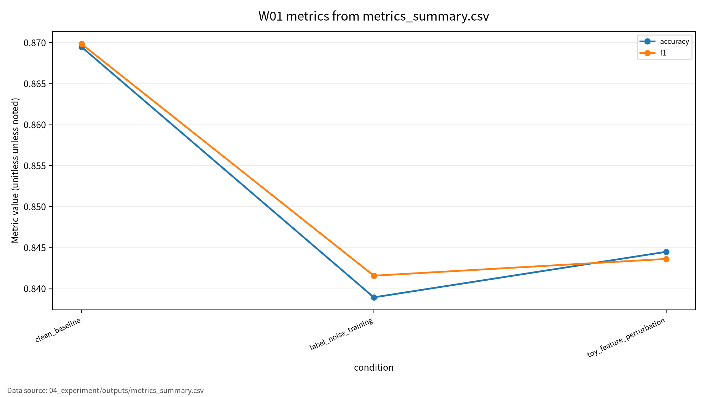

# W01 딥러닝 패러다임 & ML 보안 분류학

## 발표 핵심

딥러닝을 단순한 정확도 모델이 아니라 데이터, 학습, 검증, 배포, 모니터링이 연결된 ML 시스템으로 보고, 보안성을 clean performance, robust performance, privacy leakage, reproducibility evidence로 나누어 평가한다.

---

# 1. 왜 W01이 기준 주차인가

- 딥러닝 원리와 ML 보안 분류학을 연결하는 출발점
- 이후 주차의 poisoning, adversarial example, privacy attack, MLOps supply chain을 해석하는 공통 언어 제공
- 핵심 질문: “모델이 잘 맞는다”는 말은 보안적으로 충분한가?

발표 메시지: W01의 목적은 성능 중심 AI 이해를 보안성 중심 ML 시스템 이해로 확장하는 것이다.

---

# 2. 발표 로드맵

1. 딥러닝 원리 70%
2. 보안 이슈 30%
3. 논문 5편의 역할
4. ML 생명주기 위협모형
5. 평가 프레임과 실습 결과
6. 한계와 기말논문 연결

---

# 3. 딥러닝 원리 70%

- 표현학습: 원시 입력에서 과제에 유용한 특징을 모델이 직접 학습
- 역전파: 손실함수의 gradient를 이용해 파라미터 갱신
- 일반화: 학습 데이터 밖에서도 성능이 유지되는 성질
- 과적합: 성능 문제이면서 privacy leakage 위험 신호

핵심 연결: 공격자는 단순히 입력값을 바꾸는 것이 아니라 모델의 표현과 decision boundary를 흔든다.

---

# 4. 보안 이슈 30%

| 보안 속성 | ML 보안 문제 | 대표 예 |
|---|---|---|
| Confidentiality | 학습 데이터와 민감 정보 노출 | membership inference, model inversion |
| Integrity | 예측 결과 조작 | adversarial example, poisoning |
| Availability | 탐지 실패 또는 오탐 폭증 | IDS 미탐, 오탐 비용 증가 |
| Accountability | 결과 재현과 책임 추적 실패 | seed, config, 로그 누락 |

---

# 5. 논문 5편의 역할

| ID | 중심 역할 | W01 활용 |
|---|---|---|
| P01 | 딥러닝 원리 | 표현학습, 역전파, 일반화 |
| P02 | ML 생명주기 보증 | 데이터-학습-검증-배포 증거 |
| P03 | 침입탐지 ML | 오탐, 미탐, 평가 지표 |
| P04 | 대적 공격과 방어 | robust accuracy, attack success rate |
| P05 | 프라이버시 공격 | leakage risk, 공격자 지식 |

종합 결론: ML 보안 평가는 단일 accuracy 표가 아니라 위협가정, 지표, 재현성 증거를 함께 기록해야 한다.

---

# 6. ML 생명주기 위협모형

```text
Data -> Training -> Validation -> Deployment -> Monitoring
  |        |            |             |             |
품질/라벨  poisoning    robust 평가    evasion       drift
편향/노출  overfit      leakage       extraction    incident log
```

- 보호 자산: 학습 데이터, 모델 파라미터, 입력, 출력, 평가셋, 운영 로그
- 공격자: white-box, gray-box, black-box, data contributor, operator
- 평가 단위: 모델 하나가 아니라 전체 ML 생명주기

---

# 7. 평가 프레임

| 평가축 | 질문 | 대표 지표 |
|---|---|---|
| Clean performance | 정상 조건에서 잘 맞는가 | accuracy, precision, recall, F1 |
| Robust performance | 교란 조건에서도 유지되는가 | robust accuracy, attack impact |
| Privacy leakage | 데이터 포함 여부나 민감 정보가 새는가 | leakage risk, attack advantage |
| Reproducibility | 같은 결과를 다시 만들 수 있는가 | seed, config, code, logs |

핵심: clean accuracy와 security robustness는 분리해서 보고해야 한다.

---

# 8. 실습 설계

- 데이터: synthetic binary classification data
- 모델: 표준 라이브러리 기반 toy logistic regression
- 조건 1: clean baseline
- 조건 2: label-noise training
- 조건 3: toy feature perturbation
- 조건 4: privacy-safe overfitting/confidence audit

안전 범위: 개인정보, 실제 서비스 질의, 무단 접근, 악성코드 실행 없음.

---

# 9. 실습 결과

| 조건 | Accuracy | Precision | Recall | F1 |
|---|---:|---:|---:|---:|
| Clean baseline | 0.869444 | 0.867403 | 0.872222 | 0.869806 |
| Label-noise training | 0.838889 | 0.827957 | 0.855556 | 0.841530 |
| Toy feature perturbation | 0.844444 | 0.848315 | 0.838889 | 0.843575 |

해석: 정상 조건 성능만으로는 라벨 품질 저하나 입력 교란에 대한 취약성을 설명할 수 없다.

---

# 10. Privacy-safe audit

- Train accuracy: 0.857143
- Test accuracy: 0.869444
- Train-test gap: -0.012301
- Risk label: low_overfitting_signal

주의: 이 결과는 synthetic data의 과적합 신호 점검이다. 실제 데이터 대상 membership inference 공격 결과로 해석하지 않는다.

---

# 11. 한계와 오픈 문제

- Synthetic toy evaluation은 실제 운영망의 공격 표면을 대표하지 않는다.
- Survey taxonomy를 실제 시스템 평가로 연결하려면 데이터셋, 공격자 지식, 운영 환경이 추가로 필요하다.
- Privacy risk는 단일 수치로 요약하기 어렵고 utility/privacy trade-off가 남는다.
- 재현성 증거는 보안 주장 자체가 아니라 보안 주장을 검토할 수 있게 하는 최소 조건이다.

---

# 12. 결론과 기말논문 연결

W01 결론:

- 딥러닝 원리는 보안 취약성의 기술적 배경이다.
- ML 보안은 생명주기 전체에서 평가해야 한다.
- clean, robust, privacy, reproducibility를 분리해 기록해야 한다.

기말논문 후보:

ML 생명주기 기반 AI 보안 평가 프레임워크

<!-- formula-visual-supplement:start -->
# 수식·그래프·그림 보강

- 보강 일자: 2026-06-23
- 수식은 표준 정의식 또는 검증 가능한 평가식으로만 작성했다.
- 그래프는 `04_experiment/outputs/metrics_summary.csv`의 기존 수치만 사용했다.
- 다이어그램은 AI-assisted conceptual diagram이며 사실 자료나 실험 결과처럼 해석하지 않는다.

### 핵심 수식: Empirical Risk와 Generalization Gap

$$
\hat{R}(\theta)=\frac{1}{n}\sum_{i=1}^{n}\ell(f_\theta(x_i),y_i),
\qquad
Gap=R_{\mathrm{test}}(\theta)-\hat{R}_{\mathrm{train}}(\theta)
$$

| 기호 | 의미 |
|---|---|
| `\theta` | 모델 파라미터 |
| `n` | 학습 표본 수 |
| `\ell` | 손실 함수 |
| `Gap` | 훈련 손실과 테스트 위험의 차이 |

**직관적 의미:**  
딥러닝 평가는 학습 표본 평균 손실을 낮추는 과정으로 출발한다. Generalization gap은 훈련 성능과 테스트 성능이 얼마나 벌어지는지 보는 기본 렌즈다.

**보안 관점 해석:**  
보안 관점에서는 clean 성능이 높아도 공격·교란·privacy 조건의 위험이 별도로 남을 수 있다. 따라서 lifecycle 평가에서는 데이터, 학습, 검증, 배포 로그를 함께 본다.

**평가 지표 연결:**  
clean accuracy, F1, robust accuracy, leakage score, reproducibility evidence를 서로 다른 축으로 연결한다.

**한계와 가정:**  
W01 실습은 synthetic/toy setting이며 formal robustness나 privacy guarantee를 제공하지 않는다.

### 핵심 수식: Robust Accuracy와 ASR

$$
RA_\epsilon=\Pr_{(x,y)\sim D}\left[f_\theta(x+\delta)=y,\ \forall \delta \in \Delta_\epsilon\right],
\qquad
ASR=\frac{1}{m}\sum_{j=1}^{m}\mathbf{1}[f_\theta(\tilde{x}_j)=y_j^{target}]
$$

| 기호 | 의미 |
|---|---|
| `RA_\epsilon` | 허용 교란 집합 안에서의 강건 정확도 |
| `\Delta_\epsilon` | 크기 epsilon 이하 교란 집합 |
| `\tilde{x}_j` | 평가용 toy 공격 조건 입력 |
| `ASR` | 공격 성공률 |

**직관적 의미:**  
정상 정확도와 강건 정확도는 같은 지표가 아니다. ASR은 공격 조건에서 목표 실패가 얼마나 자주 발생하는지 별도로 본다.

**보안 관점 해석:**  
보안 평가는 clean accuracy 하나로 끝나지 않고 robustness와 privacy leakage를 분리해야 한다.

**평가 지표 연결:**  
robust accuracy, robust drop, ASR, leakage score와 연결한다.

**한계와 가정:**  
여기서는 안전한 평가 개념을 설명하는 표준식이며 실제 시스템 공격 절차를 제공하지 않는다.

### 표 수치 기반 그래프



그래프는 `metrics_summary.csv`의 condition별 accuracy와 F1만 시각화한다. Clean baseline, label-noise training, toy feature perturbation 조건을 같은 축에 두어 정상 성능만으로 보안성을 단정하기 어렵다는 점을 보여준다. synthetic/toy 평가 결과이므로 실제 운영 시스템 보증으로 해석하지 않는다.

### Threat Model / Pipeline Diagram


이 다이어그램은 `ML lifecycle threat model`를 발표용으로 요약한 개념도다. 데이터 흐름, 평가 지표, 한계 표시는 `assets/figure_manifest.md`에도 기록했다.

### 확인 필요

- 원문 논문별 절·쪽·그림 번호와 formal guarantee 여부는 확인 필요.
- 논문별 원문 절·쪽·그림 번호는 최종 제출 전 사람 검토가 필요하다.
<!-- formula-visual-supplement:end -->
