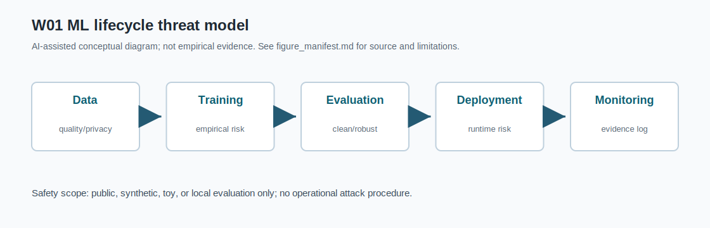
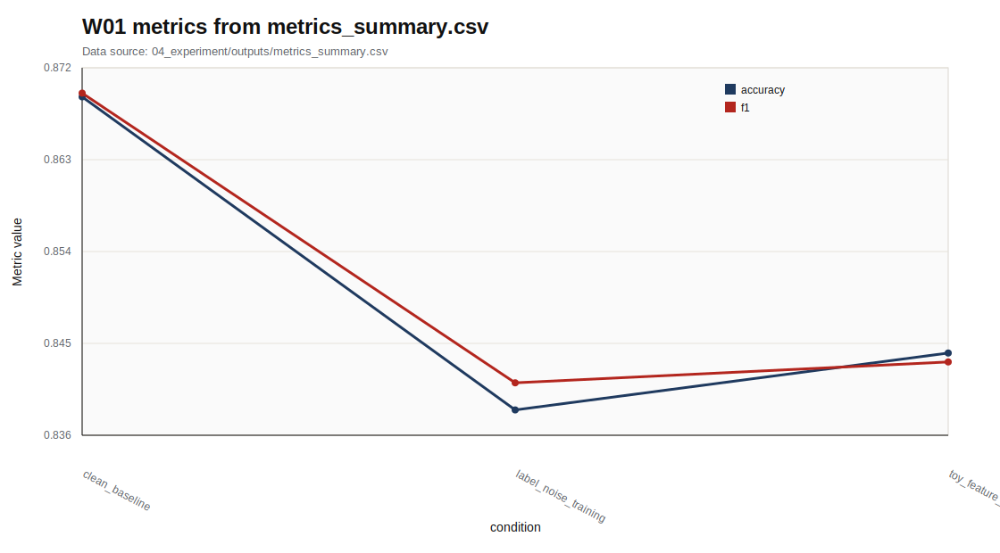

# W01 딥러닝 패러다임 & ML 보안 분류학

Research Question: 딥러닝 패러다임 & ML 보안 분류학에서 성능 지표와 보안 지표를 어떻게 분리해 평가할 수 있는가?

---

## Core Formula

### Empirical Risk와 Generalization Gap

$$
\hat{R}(\theta)=\frac{1}{n}\sum_{i=1}^{n}\ell(f_\theta(x_i),y_i),
\qquad
Gap=R_{\mathrm{test}}(\theta)-\hat{R}_{\mathrm{train}}(\theta)
$$

| 기호 | 의미 |
|---|---|
| `\theta` | 모델 파라미터 |
| `n` | 학습 표본 수 |
| `\ell` | 손실 함수 |
| `Gap` | 훈련 손실과 테스트 위험의 차이 |

- 직관적 의미: 딥러닝 평가는 학습 표본 평균 손실을 낮추는 과정으로 출발한다. Generalization gap은 훈련 성능과 테스트 성능이 얼마나 벌어지는지 보는 기본 렌즈다.
- 보안적 의미: 보안 관점에서는 clean 성능이 높아도 공격·교란·privacy 조건의 위험이 별도로 남을 수 있다. 따라서 lifecycle 평가에서는 데이터, 학습, 검증, 배포 로그를 함께 본다.
- 평가 지표 연결: clean accuracy, F1, robust accuracy, leakage score, reproducibility evidence를 서로 다른 축으로 연결한다.
- 한계: W01 실습은 synthetic/toy setting이며 formal robustness나 privacy guarantee를 제공하지 않는다.

---

## Threat Model

- Diagram: ML lifecycle threat model
- Stages: Data, Training, Evaluation, Deployment, Monitoring
- 안전 범위: public, synthetic, toy, local evaluation

---

## Evaluation Protocol

- Metrics: accuracy, f1
- 데이터 출처: `04_experiment/outputs/metrics_summary.csv`

| condition | accuracy | f1 | security_note |
| --- | --- | --- | --- |
| clean_baseline | 0.869 | 0.87 | normal synthetic test split |
| label_noise_training | 0.839 | 0.842 | 126 training labels flipped in toy data |
| toy_feature_perturbation | 0.844 | 0.844 | gaussian feature noise on synthetic test split |

---

## Figure-first Result

그래프는 `metrics_summary.csv`의 condition별 accuracy와 F1만 시각화한다. Clean baseline, label-noise training, toy feature perturbation 조건을 같은 축에 두어 정상 성능만으로 보안성을 단정하기 어렵다는 점을 보여준다. synthetic/toy 평가 결과이므로 실제 운영 시스템 보증으로 해석하지 않는다.

---

## Paper Map

| ID | 논문 역할 | 발표에서 쓰는 위치 | 기말논문 연결 |
|---|---|---|---|
| P01 | 핵심 이론 | Background / Core Formula | 딥러닝 패러다임 & ML 보안 분류학의 관련연구 뼈대 |
| P02 | 위협 분류 | Threat Model | 공격자·방어자·보호자산 정의 |
| P03 | 평가 지표 | Evaluation Protocol | 정량 지표와 로그 근거 연결 |
| P04 | 공격·방어 사례 | Security Implication | 보안적 함의와 방어 한계 |
| P05 | 재현성·정책 근거 | Limitation | 확인 필요 항목과 제출 전 검증 |

---

## Limitation

- 원문 논문별 절·쪽·그림 번호와 formal guarantee 여부는 확인 필요.
- 원문 DOI/URL과 formal guarantee는 최종 제출 전 확인 필요.
- 실제 운영 시스템 악용 절차나 무단 API 질의 절차는 포함하지 않음.

---

## Final Takeaway

W01의 핵심은 `accuracy, f1`를 성능·보안·재현성 근거로 분리해 기말논문의 평가방법에 연결하는 것이다.
