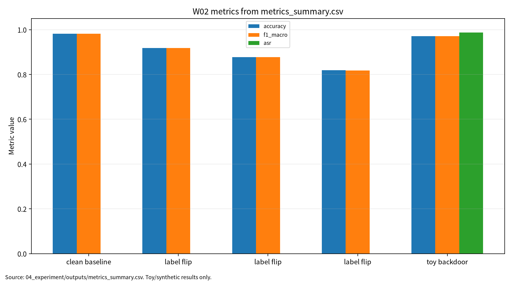

# W02 제출용 단일 보고서

## 대규모 최적화 & 데이터 오염 위협

## 0. 메타정보

| 항목 | 내용 |
|---|---|
| 주차 | W02 |
| 보고서 제목 | 대규모 최적화 & 데이터 오염 위협 |
| 과목 범위 | AI 보안 |
| 작성자 | 박영세 |
| 학번 | 26200122 |
| 작성일 | 2026-06-26 |
| 문서 상태 | 주차별 단일 제출용 보고서 |
| 원본 관리 파일 | `03_weekly_reports/w02_optimization_data_poisoning/07_week_submission/w02_submission_report.md` |
| Word/PDF 제출본 권장 위치 | `03_weekly_reports/w02_optimization_data_poisoning/07_week_submission/exports/` |
| 관련 산출물 위치 | `03_weekly_reports/w02_optimization_data_poisoning/` |
| 안전 범위 | 실제 개인정보, 운영 서비스 로그, 무단 API 질의, 악성코드 실행 제외 |
| 제출 전 주의 | P04는 강의계획서 지정 제목과 현재 ACM CSUR 정식 제목이 다르므로 최종 동일성 확인 필요 |

---

## 초록

본 보고서는 W02 주차의 대규모 최적화 원리와 데이터 오염 위협을 하나의 제출용 보고서로 통합한다. 대규모 머신러닝 학습은 전체 데이터의 경험위험을 최소화하는 최적화 문제로 볼 수 있으며, SGD와 mini-batch update는 대규모 데이터 학습을 가능하게 하는 핵심 절차다. 그러나 학습 데이터와 라벨 일부가 오염되면 gradient 추정, decision boundary, 최종 모델 성능이 함께 왜곡될 수 있다. 본 보고서는 W02 논문 5편을 바탕으로 최적화, 효율적 딥러닝, poisoning taxonomy, training data poisoning, backdoor attack을 연결하고, scikit-learn digits와 logistic regression을 사용한 안전한 toy protocol로 clean accuracy, macro F1, ASR, reproducibility evidence를 분리 기록하였다. 실험 결과는 실제 공격 성능이 아니라 데이터 오염 평가 구조를 설명하기 위한 안전한 예시로 한정한다.

**키워드:** 대규모 최적화, SGD, mini-batch, 데이터 오염, poisoning, backdoor, ASR, macro F1, 재현성

---

## 1. 한 문장 요약

W02는 학습 데이터가 조작될 때 최적화 경로와 최종 모델의 clean accuracy, macro F1, ASR, 재현성 주장이 어떻게 달라지는지를 분석하는 주차다.

---

## 2. 학습 배경과 주차 목표

### 2.1 이번 주 주제의 위치

W02는 W01의 ML 생명주기 보증과 위협모형을 학습 단계로 구체화한다. W01이 ML 시스템 전체를 보안 평가 대상으로 보는 관점을 세웠다면, W02는 그중에서도 학습 데이터와 라벨이 조작될 때 모델의 최적화 경로와 보안성이 어떻게 달라지는지 다룬다. 이후 W03 비전 대적공격, W05 self-supervised/backdoor, W10 연합학습 poisoning, W14 MLOps 공급망 보안과 연결된다.

### 2.2 강의계획서상 학습목표

- 대규모 최적화와 SGD, mini-batch update의 기본 원리를 이해한다.
- 효율적 딥러닝에서 정확도, 비용, 지연시간, 모델 크기의 trade-off를 정리한다.
- poisoning과 backdoor를 학습 단계 공격으로 구분한다.
- clean accuracy, macro F1, ASR, stealthiness, reproducibility evidence를 분리 보고한다.
- 안전한 toy 실험을 통해 데이터 오염률과 평가 지표의 변화를 설명한다.

### 2.3 이번 주 핵심 질문

1. SGD와 mini-batch 학습은 왜 데이터 품질과 라벨 정확도에 민감한가?
2. Label-flipping poisoning과 backdoor attack은 어떤 점에서 다른가?
3. Clean accuracy가 높아도 ASR이 높으면 왜 보안적으로 실패인가?
4. Poisoning/backdoor 평가에서 성능, 공격 성공, 방어 비용, 재현성을 어떻게 함께 기록해야 하는가?

---

## 3. 논문 5편의 서술형 종합 요약

### 3.1 P01. Optimization Methods for Large-Scale Machine Learning

P01은 W02의 AI 원리 기반 문헌이다. 대규모 머신러닝에서는 전체 데이터의 손실을 한 번에 계산하기 어렵기 때문에 SGD와 mini-batch optimization이 중요하다. 이 방식은 일부 샘플을 이용해 gradient를 추정하고, 반복적으로 파라미터를 갱신한다.

보안 관점에서 이 구조는 데이터 오염과 직접 연결된다. 학습 데이터 일부가 공격자에 의해 조작되면 mini-batch gradient가 오염될 수 있고, 반복 업데이트를 통해 결정 경계가 서서히 왜곡될 수 있다. 따라서 poisoning은 단순한 데이터 품질 문제가 아니라 최적화 경로를 공격하는 training-time attack으로 이해해야 한다.

### 3.2 P02. Efficient Deep Learning: A Survey on Making Deep Learning Models Smaller, Faster, and Better

P02는 모델의 효율성과 배포 가능성을 다룬다. Efficient deep learning은 모델 크기, 추론 시간, 메모리 사용량, 에너지 비용, 정확도 사이의 trade-off를 고려한다. pruning, quantization, distillation, architecture search 같은 기법은 모델을 더 작고 빠르게 만들 수 있다.

보안 관점에서는 효율화가 항상 안전성을 보장하지 않는다. 모델 압축이나 pruning은 일부 backdoor 특징을 제거할 수도 있지만, 반대로 방어 검증 없이 압축하면 특정 취약성이 유지되거나 새로 생길 수 있다. 따라서 W02에서는 효율성을 accuracy와 cost만으로 평가하지 않고, 방어 비용과 보안 지표도 함께 기록해야 한다.

### 3.3 P03. A Comprehensive Survey on Poisoning Attacks and Countermeasures in Machine Learning

P03은 poisoning attack과 countermeasure를 폭넓게 정리한다. Poisoning은 학습 데이터, 라벨, feature, 학습 파이프라인을 조작해 모델의 성능 또는 특정 조건의 행동을 왜곡하는 공격이다. 공격 목표에 따라 availability attack, targeted attack, backdoor attack으로 나눌 수 있고, 공격자의 지식과 접근 권한에 따라 threat model이 달라진다.

이 논문은 W02에서 poisoning taxonomy의 중심 근거다. 특히 clean accuracy만 보는 평가는 poisoning의 위험을 과소평가할 수 있다. 공격자가 전체 성능을 크게 낮추는 경우도 있지만, 특정 target class나 trigger 조건에서만 실패하도록 만드는 경우도 있기 때문이다.

### 3.4 P04. Wild Patterns Reloaded: A Survey of Machine Learning Security against Training Data Poisoning

P04는 training data poisoning을 더 직접적으로 다루는 관련 문헌이다. 이 논문은 데이터 오염 공격의 threat model, attack goal, attacker knowledge, defense strategy를 정리한다. 현재 repo 기준으로는 ACM CSUR DOI가 확인된 “Wild Patterns Reloaded” 논문을 사용하고 있으나, 강의계획서 지정 제목인 “Training Data Poisoning Attacks and Defenses: A Systematic Review”와 완전히 동일한 출판판인지는 최종 확인이 필요하다.

보안 관점에서 P04의 핵심은 오염 데이터의 비율만으로 위험을 판단하면 안 된다는 점이다. 낮은 poison rate라도 target attack이나 clean-label poisoning은 높은 은닉성을 가질 수 있다. 따라서 poison rate, clean accuracy, ASR, detection rate, false positive rate, provenance evidence를 함께 보아야 한다.

### 3.5 P05. A survey of backdoor attacks and defences: From deep neural networks to large language models

P05는 backdoor attack과 defence를 DNN에서 LLM까지 확장해 정리한다. Backdoor는 정상 입력에서는 모델이 정상적으로 보이지만, 특정 trigger 조건에서는 공격자 목표 행동을 하도록 만드는 hidden behavior 공격이다. 이 경우 clean accuracy가 높게 유지되더라도 ASR이 높으면 보안적으로 실패한 모델이다.

W02에서 P05는 clean performance와 attack condition performance를 분리해야 하는 핵심 근거다. 특히 foundation model, adapter, fine-tuning data, checkpoint 공급망까지 고려하면 backdoor는 단순 이미지 trigger 문제가 아니라 모델 생명주기 전체의 공급망 보안 문제로 확장된다.

---

## 4. 논문 간 연결 관계

W02 논문 5편은 다음 흐름으로 연결된다.

```text
대규모 최적화 원리
→ 효율적 학습과 배포 trade-off
→ poisoning taxonomy
→ training data poisoning threat model
→ backdoor hidden behavior 평가
```

P01은 최적화 원리, P02는 효율성·비용 관점, P03은 poisoning taxonomy, P04는 training data poisoning의 구체적 threat model, P05는 backdoor와 ASR 분리 평가를 제공한다. 이 다섯 문헌을 종합하면 W02의 핵심 메시지는 “학습 데이터는 단순 입력이 아니라 모델의 최적화 경로를 결정하는 보안 자산”이라는 것이다.

---

## 5. AI 원리 70% 정리

대규모 머신러닝 학습은 전체 데이터의 손실을 최소화하는 최적화 문제다. 전체 데이터를 매번 사용하는 batch gradient descent는 비용이 크기 때문에, 실제 학습에서는 SGD 또는 mini-batch SGD를 사용한다. 이 방식은 확장 가능하지만, 일부 샘플이 gradient 방향을 결정한다는 점에서 데이터 오염에 취약하다.

효율적 딥러닝은 정확도뿐 아니라 모델 크기, latency, memory, FLOPs, 에너지 비용을 함께 줄이는 방향으로 발전한다. 그러나 보안 평가에서는 효율화 이후에도 poisoning과 backdoor가 제거되었는지, clean accuracy와 ASR이 어떻게 변하는지 별도로 확인해야 한다.

### 5.1 핵심 수식

경험위험최소화는 학습 데이터에서 평균 손실을 최소화하는 문제다.

$$
R_{emp}(\theta)=\frac{1}{N}\sum_{i=1}^{N}\ell(f_{\theta}(x_i),y_i)
$$

| 기호 | 의미 |
|---|---|
| $R_{emp}$ | empirical risk |
| $f_{\theta}$ | 학습 모델 |
| $\ell$ | 손실함수 |
| $N$ | 학습 샘플 수 |

Mini-batch SGD는 일부 샘플 집합 $B_t$를 사용해 gradient를 추정한다.

$$
\theta_{t+1}=\theta_t-\eta\frac{1}{|B_t|}\sum_{i\in B_t}\nabla_{\theta}\ell(f_{\theta}(x_i),y_i)
$$

| 기호 | 의미 |
|---|---|
| $B_t$ | $t$번째 mini-batch |
| $\eta$ | learning rate |
| $\nabla_{\theta}\ell$ | 샘플별 손실의 gradient |

오염 데이터가 포함되면 학습 목적함수는 clean data와 poisoned data 손실을 함께 포함한다.

$$
R_{poison}(\theta)=\frac{1}{N_c}\sum_{(x,y)\in D_c}\ell(f_{\theta}(x),y)+\lambda\frac{1}{N_p}\sum_{(\tilde{x},\tilde{y})\in D_p}\ell(f_{\theta}(\tilde{x}),\tilde{y})
$$

| 기호 | 의미 |
|---|---|
| $D_c$ | clean dataset |
| $D_p$ | poisoned dataset |
| $N_c$ | clean sample 수 |
| $N_p$ | poisoned sample 수 |
| $\lambda$ | poisoning 손실의 상대 가중치 |

Poisoning rate는 전체 학습 데이터 중 오염 데이터의 비율이다.

$$
PoisonRate=\frac{N_p}{N_c+N_p}
$$

Backdoor 평가는 trigger 조건에서 target behavior가 나타나는 비율인 ASR을 별도로 본다.

$$
ASR=\frac{N_{atk}}{N_{trig}}
$$

| 기호 | 의미 |
|---|---|
| $N_{trig}$ | trigger가 포함된 평가 입력 수 |
| $N_{atk}$ | 공격 목표 행동이 발생한 입력 수 |

### 5.2 핵심 개념과 보안 연결

| 개념 | 의미 | 보안 연결 |
|---|---|---|
| SGD / mini-batch | 일부 샘플로 업데이트 방향 추정 | 오염 샘플이 gradient 방향에 영향 |
| Generalization | 정상 테스트셋 성능 | clean 성능과 공격 조건 성능 분리 필요 |
| Efficient learning | 비용, 지연시간, 메모리 최적화 | 방어 비용과 배포 가능성 평가 |
| Compression | 모델 크기 축소 | backdoor 잔존/제거 가능성 검토 |
| Poisoning | 학습 데이터·라벨 조작 | decision boundary와 representation 왜곡 |
| Backdoor | trigger 조건 hidden behavior | clean accuracy와 ASR 분리 필요 |

---

## 6. 보안 이슈 30% 정리

Poisoning 공격은 학습 데이터나 라벨을 조작하여 모델 학습 결과를 왜곡하는 training-time attack이다. Training data poisoning은 공격자 지식, 데이터 접근 범위, target 여부에 따라 threat model을 세분화해야 한다. Backdoor 공격은 clean accuracy가 높게 유지되더라도 trigger 조건에서 ASR이 높게 나타날 수 있으므로 별도 평가가 필요하다.

| 보안 속성 | W02에서의 의미 | 대표 위협 | 평가 지표 |
|---|---|---|---|
| Integrity | 학습 데이터·라벨·feature 무결성 훼손 | label-flipping, data poisoning | clean accuracy drop, macro F1 drop |
| Availability | 전체 성능 저하로 서비스 품질 저하 | availability poisoning | accuracy drop |
| Safety | 특정 조건에서 위험한 target behavior 유도 | backdoor, targeted poisoning | ASR |
| Accountability | 학습 config와 오염 조건 추적 필요 | seed/config/log 누락 | reproducibility evidence |
| Supply chain | 외부 데이터·모델·checkpoint 신뢰 문제 | poisoned dataset, malicious checkpoint | provenance coverage |

---

## 7. Research Track 분석

### 7.1 연구문제

- RQ1. 오염률 증가에 따라 clean accuracy와 macro F1은 어떻게 변하는가?
- RQ2. Clean accuracy가 높은 모델도 toy backdoor 조건에서 높은 ASR을 보일 수 있는가?
- RQ3. Poisoning/backdoor 평가에서 clean 성능, attack 성능, 재현성 증거를 어떻게 분리 기록해야 하는가?

### 7.2 위협모형

| 항목 | 내용 |
|---|---|
| 보호 자산 | 학습 데이터, 라벨, feature, 모델 파라미터, checkpoint, 평가셋, 실험 로그 |
| 공격자 목표 | 전체 성능 저하, 특정 target 오분류, trigger 조건 hidden behavior 유도 |
| 공격자 지식 | 데이터 일부 접근, 라벨 조작 가능성, 학습 알고리즘 일부 지식 |
| 공격자 능력 | label flip, poisoned sample 삽입, toy trigger 삽입, target label 지정 |
| 공격 경로 | 데이터/라벨 조작 → 학습 목적함수 왜곡 → 모델 결정 경계 변화 → clean/trigger 평가 |
| 방어자 능력 | data provenance, sanitization, robust training, ASR test, config/log 보존 |
| 제외 범위 | 실제 서비스 공격, 악성코드, 무단 API 질의, 개인정보 포함 데이터 사용 |

### 7.3 평가축

| 평가축 | 질문 | 대표 지표 또는 증거 |
|---|---|---|
| Clean performance | 정상 조건에서 성능이 유지되는가 | clean accuracy, macro F1 |
| Poison impact | 오염률 증가에 따라 성능이 얼마나 하락하는가 | accuracy drop, F1 drop |
| Backdoor behavior | trigger 조건에서 target behavior가 발생하는가 | ASR |
| Stealthiness | clean 성능을 유지하면서 공격 조건만 실패하는가 | clean-ASR gap |
| Reproducibility evidence | 동일 결과를 다시 만들 수 있는가 | seed, config, Docker, outputs, run log |

### 7.4 재현성

재현성을 위해 dataset, seed, poison rate, trigger 위치, target label, model config, Dockerfile, `pyproject.toml`, 실행 명령, CSV/JSON/Markdown 로그를 보존한다. W02 실습은 `sklearn.datasets.load_digits` 공개 toy dataset을 사용하고, 실제 개인정보나 운영망 데이터를 사용하지 않는다.

---

## 8. 실습 보고서 및 그래프 수치 검증

본 실습은 실제 공격 재현이 아니라 W02의 핵심인 데이터 오염 평가축을 안전하게 설명하기 위한 최소 toy protocol이다. 따라서 scikit-learn digits와 logistic regression을 사용하되, 평가 구조는 이후 딥러닝 모델과 대규모 모델에도 확장 가능하도록 clean accuracy, macro F1, ASR, reproducibility evidence로 분리하였다.

### 8.1 실습 설계

| 항목 | 내용 |
|---|---|
| 데이터 | scikit-learn digits 공개 데이터셋 |
| 모델 | logistic regression |
| 조건 1 | clean baseline |
| 조건 2 | label-flip 5% |
| 조건 3 | label-flip 10% |
| 조건 4 | label-flip 20% |
| 조건 5 | safe toy backdoor 5% |
| Seed | 42 |
| 결과 위치 | `04_experiment/outputs/` |

### 8.2 실습 결과 수치

| 조건 | Poisoning Rate | N Poisoned | Clean Accuracy | Macro F1 | ASR | 보안 해석 |
|---|---:|---:|---:|---:|---:|---|
| Clean baseline | 0% | 0 | 0.981481 | 0.981443 | 해당 없음 | 기준 성능 |
| Label-flip | 5% | 63 | 0.918519 | 0.918457 | 해당 없음 | 약한 라벨 오염 |
| Label-flip | 10% | 126 | 0.877778 | 0.877582 | 해당 없음 | 중간 라벨 오염 |
| Label-flip | 20% | 251 | 0.818519 | 0.818134 | 해당 없음 | 강한 라벨 오염 |
| Safe toy backdoor | 5% | 63 | 0.970370 | 0.970359 | 0.987654 | clean 성능과 조건부 오분류 분리 |

Label-flip 조건은 오염률이 높아질수록 clean accuracy와 macro F1이 낮아지는지를 확인한다. Safe toy backdoor 조건은 clean accuracy가 크게 유지되더라도 ASR이 높게 나올 수 있는지를 확인한다. 이 둘을 분리해야 poisoning과 backdoor를 같은 “오염”이라는 이름으로 뭉개지 않고 평가할 수 있다.

### 8.3 그래프 수치 검증

현재 제출 보고서의 그래프는 `assets/w02_metric_chart.png`를 참조한다. 확인 가능한 SVG 그래프에는 `accuracy`, `f1_macro`, `asr` 세 series가 표시되어 있다. 그래프 x축에는 `label_flip`이 3회 반복되므로 보고서 표에서는 poisoning rate를 함께 표기해 해석한다. Precision과 recall은 본 그래프 series에 포함하지 않는다.

| 조건 | Poisoning Rate | 그래프 Accuracy | 표 Accuracy | 그래프 Macro F1 | 표 Macro F1 | 그래프 ASR | 표 ASR | 확인 결과 |
|---|---:|---:|---:|---:|---:|---:|---:|---|
| Clean baseline | 0% | 0.981481 | 0.981481 | 0.981443 | 0.981443 | 해당 없음 | 해당 없음 | 일치 |
| Label-flip | 5% | 0.918519 | 0.918519 | 0.918457 | 0.918457 | 해당 없음 | 해당 없음 | 일치 |
| Label-flip | 10% | 0.877778 | 0.877778 | 0.877582 | 0.877582 | 해당 없음 | 해당 없음 | 일치 |
| Label-flip | 20% | 0.818519 | 0.818519 | 0.818134 | 0.818134 | 해당 없음 | 해당 없음 | 일치 |
| Safe toy backdoor | 5% | 0.970370 | 0.970370 | 0.970359 | 0.970359 | 0.987654 | 0.987654 | 일치 |

<!-- submission-metric-chart:start -->
**그림 1. W02 metrics summary chart**



출처: `04_experiment/outputs/metrics_summary.csv`. 이 그래프는 공개 toy/synthetic 산출물 기반이며 실제 공격 성능이나 운영 환경 성능으로 일반화하지 않는다. 현재 그래프는 accuracy, f1_macro, ASR을 시각화한다.
<!-- submission-metric-chart:end -->

---

## 9. 기말논문 연결

W02는 기말논문에서 “학습 데이터 오염과 backdoor 평가를 위한 다중지표 프레임워크”로 확장할 수 있다. 핵심 기여 후보는 clean accuracy, macro F1, ASR, stealthiness, detection rate, efficiency cost, reproducibility evidence를 함께 기록하는 평가표다.

| 기말논문 장 | W02 반영 내용 |
|---|---|
| 1장 서론 | 학습 데이터 오염이 모델 보안성에 미치는 영향 제시 |
| 2장 관련연구 | 최적화, 효율적 딥러닝, poisoning, backdoor 문헌 정리 |
| 3장 위협모형 | label flip, poisoned sample, trigger, checkpoint risk 정의 |
| 4장 연구방법 | poison rate, clean accuracy, macro F1, ASR, reproducibility evidence 설계 |
| 5장 분석 | 오염률별 성능 변화와 clean-ASR gap 분석 |
| 6장 결론 | poisoning/backdoor 평가는 단일 정확도가 아니라 다중지표로 관리해야 함 |

---

## 10. AI 도구 활용 기록

AI 도구는 문헌 요약, 코드 점검, 문장 구조화, 그래프 생성 보조에 사용하였다. 모든 DOI/URL, 실험 수치, 본문 인용, 결론은 작성자가 outputs 파일과 로컬 참고문헌 검증표를 대조하여 검증한다.

| 항목 | 내용 |
|---|---|
| 사용 도구명 | Codex, ChatGPT 계열 도구 |
| 사용 목적 | 문헌 요약 정리, 보고서 구조화, 안전한 toy/synthetic 실험 결과 표기 점검, 그래프 생성 보조, 제출 전 체크리스트 정리 |
| AI 산출물 반영 위치 | `07_week_submission/w02_submission_report.md`, `07_week_submission/assets/w02_metric_chart.png`, `05_ai_worklog/ai_disclosure_draft.md` |
| 본인 수정 내용 | 주차별 문헌 상태 확인, 실험 수치와 outputs 대조, 안전 범위와 한계 문장 확인, 최종 제출 전 미확정 문헌 분리 |
| 사실관계 검증 방법 | `01_papers/paper_list.md`, `01_papers/doi_check.md`, 강의계획서 문헌표 대조 |
| 실험결과 검증 방법 | `04_experiment/experiment_report.md`, `04_experiment/outputs/metrics_summary.csv`, `results.json`, `run_log.md`의 수치와 보고서 표기 대조 |
| 최종 책임 확인 | AI 산출물은 초안 보조이며 최종 제출자는 원고 내용, 인용, 실험결과, 연구윤리 책임을 확인한다. |

---

## 11. 제출 전 자기 점검표

| 점검 항목 | 상태 | 비고 |
|---|---|---|
| 메타정보 작성 | 완료 | 작성일 2026-06-26 반영 |
| 초록 및 키워드 작성 | 완료 |  |
| AI 원리 70% 정리 | 완료 | 핵심 수식 추가 |
| 보안 이슈 30% 정리 | 완료 |  |
| 논문 5편 서술형 요약 | 완료 |  |
| 논문 간 연결 관계 작성 | 완료 |  |
| Research Track 5요소 작성 | 완료 | 연구문제, 위협모형, 평가방법, 재현성, 한계 |
| 실험 outputs 파일 존재 확인 | 완료 | 실험 보고서 기준 세 파일 존재로 기록 |
| 실험 결과와 보고서 수치 일치 | 완료 | 실험 보고서 수치 기준 반영 |
| 그래프 수치 확인 | 완료 | accuracy/f1_macro/ASR series 기준 표와 일치 |
| P02 Article 번호 | 확인 필요 | DOI는 확인, ACM Article 번호는 최종 확인 메모 |
| P04 논문 지정 여부 검증 | 확인 필요 | 강의계획서 제목과 현재 ACM CSUR 제목 차이 |
| AI 활용 고지 작성 | 완료 |  |
| DOCX/PDF 제출본 생성 | 필요 | `07_week_submission/exports/` 권장 |
| 최종 사람이 검토할 항목 표시 | 완료 | P02 Article 번호, P04 동일성, Word/PDF 렌더링 |

---

## 12. 참고문헌 검증표

| 번호 | 참고문헌 | DOI/URL | 상태 | 비고 |
|---:|---|---|---|---|
| [1] | Leon Bottou, Frank E. Curtis, Jorge Nocedal, “Optimization Methods for Large-Scale Machine Learning,” SIAM Review, 2018 | `https://doi.org/10.1137/16M1080173` | 확인 완료 | 권호/쪽 확인 |
| [2] | Gaurav Menghani, “Efficient Deep Learning: A Survey on Making Deep Learning Models Smaller, Faster, and Better,” ACM Computing Surveys, 2023 | `https://doi.org/10.1145/3578938` | 확인 완료 | Article 번호 최종 확인 필요 |
| [3] | Zhiyi Tian, Lei Cui, Jie Liang, Shui Yu, “A Comprehensive Survey on Poisoning Attacks and Countermeasures in Machine Learning,” ACM Computing Surveys, 2022/2023 | `https://doi.org/10.1145/3551636` | 확인 완료 | 저자명은 출판 정보 기준 `Zhiyi Tian` |
| [4] | Antonio Emanuele Cina et al., “Wild Patterns Reloaded: A Survey of Machine Learning Security against Training Data Poisoning,” ACM Computing Surveys, 2023 | `https://doi.org/10.1145/3585385` | DOI 확인 완료 | 강의계획서 P04 제목과 동일 여부 확인 필요 |
| [5] | Ling-Xin Jin et al., “A survey of backdoor attacks and defences: From deep neural networks to large language models,” Journal of Electronic Science and Technology, 2025 | `https://doi.org/10.1016/j.jnlest.2025.100326` | 확인 완료 | 강의계획서 `Z. Jin` 표기는 약식 표기로 추정 |

---

## 13. 부록 A. KCI 논문 형식 전환 아이디어

### A.1 제목 후보

| 번호 | 국문 제목 후보 | 영문 제목 후보 | 예상 기여 |
|---:|---|---|---|
| 1 | 학습 데이터 오염과 백도어 공격 평가를 위한 다중지표 프레임워크 연구 | A Multi-Metric Evaluation Framework for Training Data Poisoning and Backdoor Attacks | Clean accuracy와 ASR 분리 평가 |
| 2 | 데이터 오염률이 머신러닝 모델의 정상 성능과 공격 성공률에 미치는 영향 분석 | An Analysis of the Impact of Data Poisoning Rates on Clean Performance and Attack Success Rate in Machine Learning Models | 오염률-성능 변화 분석 |
| 3 | AI 보안 평가에서 Clean Accuracy와 ASR 분리 기록의 필요성 연구 | A Study on the Need to Separately Report Clean Accuracy and Attack Success Rate in AI Security Evaluation | 다중지표 평가표 제안 |

추천 제목은 “학습 데이터 오염과 백도어 공격 평가를 위한 다중지표 프레임워크 연구”이다. 연구문제는 오염률 증가에 따른 clean accuracy와 macro F1 변화, toy backdoor 조건에서 clean accuracy와 ASR의 괴리, poisoning/backdoor 평가에 필요한 지표 조합이다.

### A.2 연구문제

- RQ1. 데이터 오염률 증가에 따라 clean accuracy와 macro F1은 어떻게 변하는가?
- RQ2. Backdoor 조건에서 clean accuracy와 ASR은 어떻게 분리되어야 하는가?
- RQ3. 학습 데이터 오염 평가를 위해 필요한 최소 재현성 증거는 무엇인가?

---

## 14. 부록 B. SCI 논문 형식 전환 아이디어

SCI형 제목 후보는 “A Multi-Metric Evaluation Framework for Training Data Poisoning and Backdoor Attacks: Separating Clean Performance, Attack Success Rate, and Reproducibility Evidence”이다.

Structured abstract는 Background, Problem, Method, Results, Contribution, Implications로 구성한다. 결과 문장은 W02 toy evaluation이 label flip 20%에서 clean accuracy와 macro F1 하락을 보였고, safe toy backdoor 5% 조건에서 clean accuracy와 ASR이 분리되어 나타났다는 수준으로 제한한다. 실제 대규모 모델 또는 LLM backdoor 성능으로 일반화하지 않는다.

| 연구축 | 대표 논문 | 역할 |
|---|---|---|
| Large-scale optimization | Bottou et al. | 학습 목적함수와 SGD 기반 최적화 |
| Efficient deep learning | Menghani | 정확도-비용-속도 trade-off |
| Poisoning attacks | Tian et al. | poisoning taxonomy와 대응책 |
| Training data poisoning | Cina et al. | threat model과 systematic review. 강의계획서 지정 제목과 동일성 확인 필요 |
| Backdoor attacks | Jin et al. | clean accuracy와 ASR 분리 평가 |

---

## 15. 부록 C. 제출 파일 위치와 변환 권장

| 파일 | 설명 |
|---|---|
| `07_week_submission/w02_submission_report.md` | 본 제출용 보고서 원본 |
| `07_week_submission/assets/w02_metric_chart.png` | 제출 보고서 그래프 |
| `04_experiment/experiment_report.md` | 실험 근거 보고서 |
| `04_experiment/outputs/` | 실험 결과 근거 파일 위치 |
| `05_ai_worklog/ai_disclosure_draft.md` | AI 활용 고지 근거 |

Word 제출본은 다음 위치에 생성해 관리한다.

```text
03_weekly_reports/w02_optimization_data_poisoning/07_week_submission/exports/w02_submission_report.docx
```

PDF 제출본은 Word에서 최종 육안 검수 후 다음 위치에 저장한다.

```text
03_weekly_reports/w02_optimization_data_poisoning/07_week_submission/exports/w02_submission_report.pdf
```

수식은 GitHub와 Word 변환을 모두 고려하여 Markdown 표 안에 넣지 않고, `$$...$$` block math로 유지한다.
