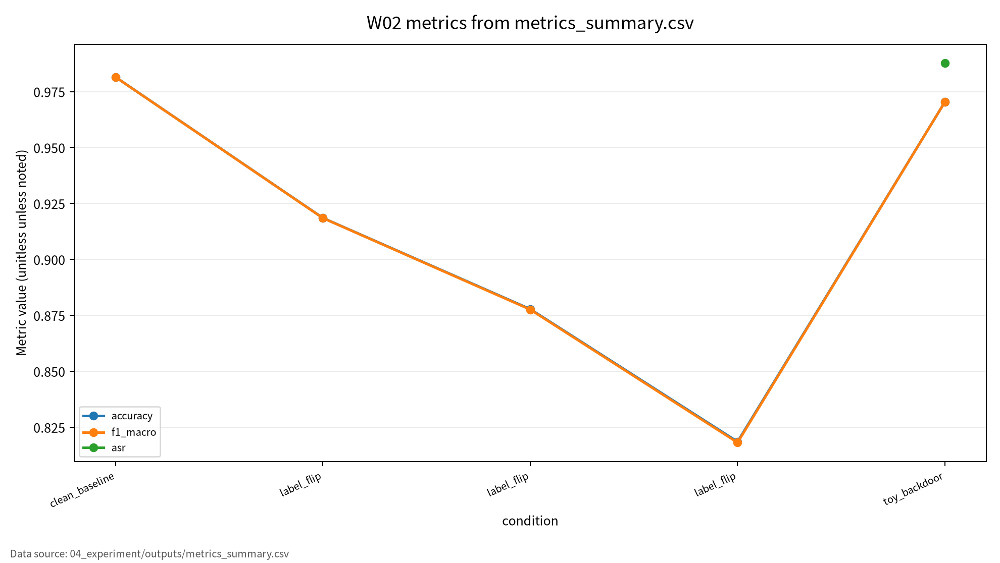

# W02 대규모 최적화 & 데이터 오염 위협

## 발표 핵심

학습은 데이터가 만드는 손실함수를 따라 움직인다. 따라서 데이터가 오염되면 모델의 최적화 경로, clean accuracy, ASR, 재현성 주장이 함께 흔들린다.

---

# 1. 왜 W02가 중요한가

- W01이 ML 보안 평가의 공통 언어였다면, W02는 학습 단계 위협을 다룬다.
- 모델은 학습 데이터와 라벨로부터 gradient를 얻는다.
- 공격자는 입력 하나가 아니라 학습 데이터의 일부를 조작해 최종 모델을 바꿀 수 있다.

핵심 질문: 데이터 일부가 틀리거나 악의적으로 설계되면, 모델은 무엇을 학습하게 되는가?

---

# 2. 발표 로드맵

1. 대규모 최적화 원리
2. 효율적 학습과 비용 지표
3. 데이터 오염과 backdoor
4. 논문 5편의 역할
5. 위협모형과 평가방법
6. 실습 설계와 기말논문 연결

---

# 3. AI 원리 70%: 최적화

- 대규모 ML은 손실함수를 최소화하는 파라미터를 찾는 문제다.
- 전체 데이터의 gradient 계산은 비용이 크다.
- SGD와 mini-batch 학습은 일부 샘플로 방향을 추정한다.
- 데이터가 오염되면 gradient 추정과 decision boundary가 바뀔 수 있다.

핵심 문장: poisoning은 학습 목적함수 자체를 바꾸는 훈련 단계 위협이다.

---

# 4. AI 원리 70%: 효율성

| 개념 | 의미 | 보안 연결 |
|---|---|---|
| 모델 압축 | 모델 크기와 연산량 축소 | 방어 비용과 pruning 효과 |
| 경량화 | 배포 가능한 추론 구조 | edge 환경의 방어 제약 |
| 효율적 학습 | 학습 시간과 자원 절감 | 재학습과 반복 평가 가능성 |
| 비용 지표 | latency, memory, FLOPs | accuracy 외 평가축 |

효율화는 성능 문제가 아니라 보안 검증 예산의 문제이기도 하다.

---

# 5. 보안 이슈 30%

| 위협 | 공격 목표 | 대표 지표 |
|---|---|---|
| Label-flipping | 라벨 조작으로 성능 저하 | accuracy drop |
| Data poisoning | 학습 데이터 조작 | clean accuracy, macro F1 |
| Backdoor | trigger 조건부 오분류 | ASR |
| Provenance failure | 오염 출처 추적 실패 | 로그, 데이터 이력 |

정상 성능이 높아도 trigger 조건에서 실패하면 안전한 모델이 아니다.

---

# 6. Clean Accuracy와 ASR

| 모델 상태 | Clean Accuracy | ASR | 해석 |
|---|---:|---:|---|
| 정상 모델 | 높음 | 낮음 | 정상 |
| 전체 성능 저하형 poisoning | 낮음 | 상황별 | 가용성/무결성 손상 |
| 은닉형 backdoor | 높음 | 높음 | 가장 위험한 조건 |
| 방어 후 모델 | 적정 | 낮음 | 유틸리티와 보안성 균형 |

Backdoor의 위험은 정상 테스트셋에서 잘 보이지 않는다는 점이다.

---

# 7. 논문 5편의 역할

| ID | 중심 역할 | W02 활용 |
|---|---|---|
| P01 | 대규모 최적화 | SGD와 gradient 관점 |
| P02 | 효율적 딥러닝 | 비용, 속도, 압축 |
| P03 | Poisoning survey | 공격/방어 taxonomy |
| P04 | Training data poisoning | threat model과 방어 |
| P05 | Backdoor survey | ASR, 탐지, 제거 |

AI 원리 문헌과 보안 문헌을 분리하지 않고 연결해서 읽는 것이 W02의 핵심이다.

---

# 8. 위협모형

```text
Data Collection -> Labeling -> Preprocessing -> Training -> Validation
      |              |              |             |           |
  source risk     label flip     trigger mix    poisoned     clean-only
  provenance      noisy label    hidden pattern gradient     validation
```

- 보호 자산: 데이터, 라벨, 모델 파라미터, 검증셋, 로그
- 공격자: 데이터 제공자, 악의적 라벨러, 내부 접근자
- 성공 조건: 성능 저하 또는 trigger 조건부 목표 오분류

---

# 9. 평가 프로토콜

| 평가 항목 | 지표 | 기록 방법 |
|---|---|---|
| Clean performance | accuracy, macro F1 | 정상 테스트셋 |
| Poisoning impact | accuracy drop | 오염률별 비교 |
| Backdoor effect | ASR | trigger 테스트셋 |
| Stealthiness | clean accuracy 유지율 | clean과 ASR 동시 비교 |
| Reproducibility | seed, config, logs | Docker와 outputs |
| Efficiency | train time, cost | 실행 로그 |

단일 accuracy 표가 아니라 조건별 평가표가 필요하다.

---

# 10. 실습 설계

- 데이터: scikit-learn digits 공개 데이터셋
- 모델: StandardScaler + Logistic Regression
- 조건 1: clean baseline
- 조건 2: label flip 5%, 10%, 20%
- 조건 3: 안전한 toy backdoor 5%
- 출력: CSV, JSON, Markdown run log

Docker 실행으로 CSV, JSON, Markdown 로그를 생성했다.

---

# 11. 결과 기록 방식

| 조건 | Poisoning Rate | Clean Accuracy | Macro F1 | ASR |
|---|---:|---:|---:|---:|
| Clean baseline | 0% | 0.981481 | 0.981443 | 해당 없음 |
| Label-flip | 5% | 0.918519 | 0.918457 | 해당 없음 |
| Label-flip | 10% | 0.877778 | 0.877582 | 해당 없음 |
| Label-flip | 20% | 0.818519 | 0.818134 | 해당 없음 |
| Safe toy backdoor | 5% | 0.970370 | 0.970359 | 0.987654 |

정량값은 `outputs/run_log.md` 기준으로 반영했다.

---

# 12. 한계와 기말논문 연결

- Digits toy experiment는 실제 대규모 모델을 대표하지 않는다.
- Label-flip은 단순하지만 clean-label poisoning의 은닉성을 충분히 설명하지 못한다.
- LLM backdoor와 데이터 공급망 위협은 최신 문헌 보강이 필요하다.

기말 주제 후보: 학습 데이터 오염과 backdoor 평가를 위한 다중지표 프레임워크

문헌 검증 메모: P02 ACM DOI는 확인 완료, P04는 DOI 확인 완료이나 강의계획서 지정 제목과 동일 여부 확인 필요.

---

# 13. 결론

W02 결론:

- 최적화는 데이터로 움직인다.
- 데이터 오염은 학습 목적함수와 gradient를 흔든다.
- Backdoor 평가는 clean accuracy와 ASR을 분리해야 한다.
- 안전한 실습은 Docker, config, seed, outputs를 남겨야 한다.

실습 코드, Docker 실행 결과, 제출 문서가 모두 정리되었다.

<!-- formula-visual-supplement:start -->
# 수식·그래프·그림 보강

- 보강 일자: 2026-06-23
- 수식은 표준 정의식 또는 검증 가능한 평가식으로만 작성했다.
- 그래프는 `04_experiment/outputs/metrics_summary.csv`의 기존 수치만 사용했다.
- 다이어그램은 AI-assisted conceptual diagram이며 사실 자료나 실험 결과처럼 해석하지 않는다.

### 핵심 수식: ERM, Poisoned Empirical Risk, SGD Update

$$
\hat{R}(\theta)=\frac{1}{n}\sum_{i=1}^{n}\ell(f_\theta(x_i),y_i),
\qquad
\hat{R}_{poison}(\theta)=\frac{1}{n+m}\left(\sum_{i=1}^{n}\ell(f_\theta(x_i),y_i)+\sum_{j=1}^{m}\ell(f_\theta(\tilde{x}_j),\tilde{y}_j)\right)
$$

| 기호 | 의미 |
|---|---|
| `\hat{R}` | 정상 학습 데이터의 empirical risk |
| `\hat{R}_{poison}` | 오염 샘플을 포함한 empirical risk |
| `m` | 오염 또는 toy trigger 샘플 수 |
| `(\tilde{x},\tilde{y})` | 오염 조건의 입력과 라벨 |

**직관적 의미:**  
데이터 오염은 단순히 입력 하나를 바꾸는 문제가 아니라 학습 목적함수 자체를 바꾼다. SGD는 이 목적함수의 gradient를 따라 이동하므로 오염 샘플은 업데이트 방향에 영향을 준다.

**보안 관점 해석:**  
훈련 단계 위협은 모델 파라미터와 decision boundary를 바꾸며, 검증셋이 clean-only이면 위험이 숨을 수 있다.

**평가 지표 연결:**  
accuracy drop, macro F1, ASR, poisoning rate, n_poisoned와 연결한다.

**한계와 가정:**  
오염 조건은 scikit-learn digits toy setting이며 실제 서비스 공격 절차가 아니다.

### 핵심 수식: Accuracy Drop와 ASR

$$
\Delta Acc=Acc_{clean}-Acc_{poison},
\qquad
ASR=\frac{1}{m}\sum_{j=1}^{m}\mathbf{1}[f_\theta(\tilde{x}_j)=y^{target}]
$$

| 기호 | 의미 |
|---|---|
| `\Delta Acc` | 오염 조건에서의 정상 정확도 감소량 |
| `Acc_{clean}` | clean baseline 정확도 |
| `Acc_{poison}` | 오염 조건 정확도 |
| `ASR` | trigger 조건 공격 성공률 |

**직관적 의미:**  
Label flipping은 clean 성능 저하를, backdoor는 clean 성능 유지와 조건부 실패를 함께 볼 때 의미가 분명해진다.

**보안 관점 해석:**  
보안 보고에서는 clean accuracy와 ASR을 같은 표에 두되 같은 의미로 합치지 않는다.

**평가 지표 연결:**  
clean accuracy, macro F1, ASR, stealthiness와 연결한다.

**한계와 가정:**  
ASR은 로컬 toy trigger 테스트셋 기준이며 실제 공격 성공률을 주장하지 않는다.

### 표 수치 기반 그래프



그래프는 `metrics_summary.csv`의 clean accuracy, macro F1, ASR을 조건별로 그린 것이다. Label-flip 조건에서는 오염률 증가와 함께 clean 성능 저하를 비교할 수 있고, toy backdoor 조건은 clean 성능과 ASR을 분리해 보아야 함을 보여준다. 표에 없는 실험 조건이나 수치는 추가하지 않았다.

### Threat Model / Pipeline Diagram


이 다이어그램은 `training-data poisoning evaluation flow`를 발표용으로 요약한 개념도다. 데이터 흐름, 평가 지표, 한계 표시는 `assets/figure_manifest.md`에도 기록했다.

### 확인 필요

- toy backdoor는 공개 toy 데이터 기반 안전 실습이며 실제 시스템 악용 절차로 일반화하지 않는다.
- 논문별 원문 절·쪽·그림 번호는 최종 제출 전 사람 검토가 필요하다.
<!-- formula-visual-supplement:end -->
