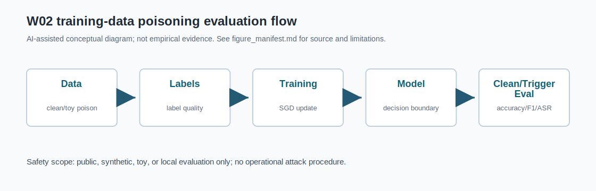
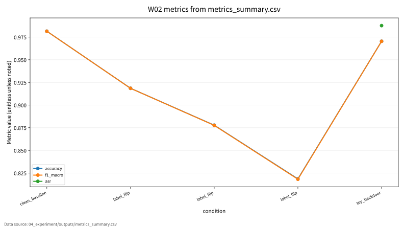

# W02 대규모 최적화 & 데이터 오염 위협

Research Question: 대규모 최적화 & 데이터 오염 위협에서 성능 지표와 보안 지표를 어떻게 분리해 평가할 수 있는가?

---

## Core Formula

### ERM, Poisoned Empirical Risk, SGD Update

$$
\hat{R}(\theta)=\frac{1}{n}\sum_{i=1}^{n}\ell(f_\theta(x_i),y_i),
\qquad
\hat{R}_{poison}(\theta)=\frac{1}{n+m}\left(\sum_{i=1}^{n}\ell(f_\theta(x_i),y_i)+\sum_{j=1}^{m}\ell(f_\theta(\tilde{x}_j),\tilde{y}_j)\right)
$$

| 기호 | 의미 |
|---|---|
| `\hat{R}` | 정상 학습 데이터의 empirical risk |
| `\hat{R}_{poison}` | 오염 샘플을 포함한 empirical risk |
| `m` | 오염 또는 toy trigger 샘플 수 |
| `(\tilde{x},\tilde{y})` | 오염 조건의 입력과 라벨 |

- 직관적 의미: 데이터 오염은 단순히 입력 하나를 바꾸는 문제가 아니라 학습 목적함수 자체를 바꾼다. SGD는 이 목적함수의 gradient를 따라 이동하므로 오염 샘플은 업데이트 방향에 영향을 준다.
- 보안적 의미: 훈련 단계 위협은 모델 파라미터와 decision boundary를 바꾸며, 검증셋이 clean-only이면 위험이 숨을 수 있다.
- 평가 지표 연결: accuracy drop, macro F1, ASR, poisoning rate, n_poisoned와 연결한다.
- 한계: 오염 조건은 scikit-learn digits toy setting이며 실제 서비스 공격 절차가 아니다.

---

## Threat Model

- Diagram: training-data poisoning evaluation flow
- Stages: Data, Labels, Training, Model, Clean/Trigger Eval
- 안전 범위: public, synthetic, toy, local evaluation

---

## Evaluation Protocol

- Metrics: accuracy, f1_macro, asr
- 데이터 출처: `04_experiment/outputs/metrics_summary.csv`

| condition | accuracy | f1_macro | asr |
| --- | --- | --- | --- |
| clean_baseline | 0.981 | 0.981 |  |
| label_flip | 0.919 | 0.918 |  |
| label_flip | 0.878 | 0.878 |  |
| label_flip | 0.819 | 0.818 |  |
| toy_backdoor | 0.97 | 0.97 | 0.988 |

---

## Figure-first Result

그래프는 `metrics_summary.csv`의 clean accuracy, macro F1, ASR을 조건별로 그린 것이다. Label-flip 조건에서는 오염률 증가와 함께 clean 성능 저하를 비교할 수 있고, toy backdoor 조건은 clean 성능과 ASR을 분리해 보아야 함을 보여준다. 표에 없는 실험 조건이나 수치는 추가하지 않았다.

---

## Paper Map

| ID | 논문 역할 | 발표에서 쓰는 위치 | 기말논문 연결 |
|---|---|---|---|
| P01 | 핵심 이론 | Background / Core Formula | 대규모 최적화 & 데이터 오염 위협의 관련연구 뼈대 |
| P02 | 위협 분류 | Threat Model | 공격자·방어자·보호자산 정의 |
| P03 | 평가 지표 | Evaluation Protocol | 정량 지표와 로그 근거 연결 |
| P04 | 공격·방어 사례 | Security Implication | 보안적 함의와 방어 한계 |
| P05 | 재현성·정책 근거 | Limitation | 확인 필요 항목과 제출 전 검증 |

---

## Limitation

- toy backdoor는 공개 toy 데이터 기반 안전 실습이며 실제 시스템 악용 절차로 일반화하지 않는다.
- 원문 DOI/URL과 formal guarantee는 최종 제출 전 확인 필요.
- 실제 운영 시스템 악용 절차나 무단 API 질의 절차는 포함하지 않음.

---

## Final Takeaway

W02의 핵심은 `accuracy, f1_macro, asr`를 성능·보안·재현성 근거로 분리해 기말논문의 평가방법에 연결하는 것이다.
