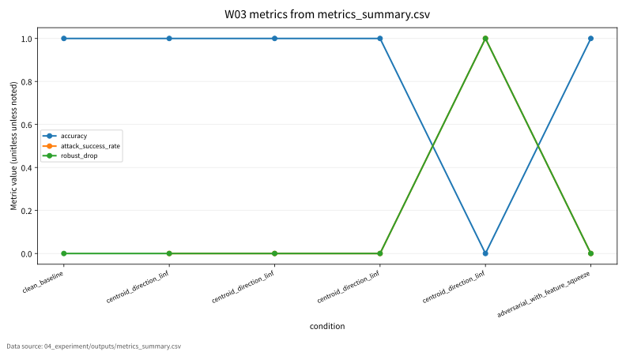
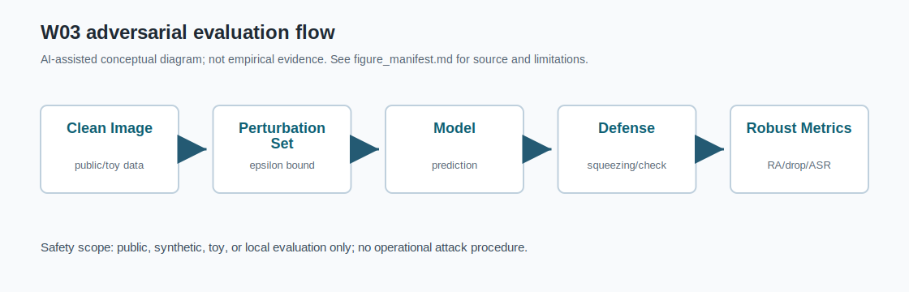

# W03 컴퓨터비전 표현학습 & 비전 대적공격 통합보고서

## 0. 메타정보

| 항목 | 내용 |
|---|---|
| 주차 | W03 |
| 주제 | 컴퓨터비전 표현학습 & 비전 대적공격 |
| 문서 상태 | 제출용 최종 초안, 최종 제출 확정 아님 |
| 작성/보완일 | 2026-06-22 |
| AI 원리 축 | CNN, ViT, 멀티모달 Transformer, 표현학습 |
| 보안 이슈 축 | 비전 대적공격, 2D/3D 강건성, safety, 재현성 |
| 실험 범위 | synthetic 8x8 막대 이미지 기반 safe toy protocol |

## 1. 한 문장 요약

W03는 CNN, Vision Transformer, 멀티모달 Transformer의 표현학습 원리를 정리하고, 비전 대적공격 평가에서 clean accuracy, robust accuracy, ASR, robust drop, confusion matrix, reproducibility evidence를 분리 보고해야 함을 safe toy 실험으로 확인한 주차다.

## 2. 학습 배경과 주차 목표

### 2.1 이번 주 주제의 위치

W03는 W01의 ML 생명주기 보안 평가와 W02의 학습 데이터 오염 위협을 비전 모델의 입력·표현·추론 단계로 확장하는 주차다. W01이 AI 보안 평가의 기본 프레임을 세웠고, W02가 학습 단계 오염을 다루었다면, W03는 이미지 입력과 시각 표현이 공격 조건에서 어떻게 흔들릴 수 있는지를 다룬다. 이후 W04 Transformer/NLP 보안, W05 self-supervised/backdoor, W06 deepfake, W07 multimodal LLM 보안과 연결된다.

### 2.2 강의계획서상 학습목표

- 비전 학습의 inductive bias를 CNN과 ViT 관점에서 이해한다.
- 멀티모달 Transformer의 구조와 학습 규약을 정리한다.
- 비전 대적평가 벤치마크와 지표를 논문 수준으로 재구성한다.

### 2.3 이번 주 핵심 질문

1. CNN과 ViT는 어떤 inductive bias 차이를 가지는가?
2. 이미지 입력의 작은 교란은 모델 표현과 decision boundary에 어떤 영향을 줄 수 있는가?
3. clean accuracy와 robust accuracy, ASR은 왜 분리해 보고해야 하는가?
4. 2D/3D 비전 강건성 평가는 어떤 위협모형과 평가 지표를 요구하는가?
5. W03의 toy 실험을 KCI 또는 SCI 논문 주제로 발전시키려면 어떤 연구문제가 적절한가?

## 3. AI 원리 70% 정리

CNN은 지역 receptive field와 convolution 연산을 통해 이미지의 계층적 표현을 학습한다[1]. 딥러닝 기반 컴퓨터비전은 classification, detection, segmentation, recognition 등 다양한 응용으로 확장되었다[2]. Vision Transformer는 이미지를 patch token으로 변환해 Transformer 구조에 입력하고 self-attention으로 전역 관계를 모델링한다[4]. 멀티모달 Transformer는 이미지, 텍스트, 비디오, 오디오 등 서로 다른 modality를 attention 기반으로 정합한다[3].

표 1. W03 핵심 개념과 보안 연결

| 핵심 개념 | AI 원리 | 보안 연결 |
|---|---|---|
| CNN | 지역성, weight sharing, pooling | gradient 기반 교란과 feature 취약성의 배경 |
| ViT | patch embedding, self-attention | patch/token 교란, attention 취약성 |
| Multimodal Transformer | modality-agnostic token, cross-modal alignment | prompt/image mismatch, modality mismatch |
| Clean accuracy | 정상 입력 기준 성능 | 보안 성능을 대체하지 못함 |
| Robust accuracy/ASR | 공격 조건 성능과 실패율 | adversarial robustness 평가 핵심 |

## 4. 보안 이슈 30% 정리

비전 모델의 보안성 평가는 clean accuracy뿐 아니라 robust accuracy, ASR, 2D/3D 안전성 지표를 함께 고려해야 한다[5]. White-box, gray-box, black-box 조건은 공격자의 지식 수준을 구분하고, digital perturbation, transfer attack, physical attack, 3D point cloud/LiDAR attack은 공격자의 능력을 구분한다. 본 보고서는 실제 서비스 침해, 실제 개인정보 이미지, 무단 API 질의, 악용 가능한 공격 절차를 제외하고 평가 지표 구조만 다룬다.

그림 1. 비전 대적공격 평가 흐름

```text
Clean Image
    ↓
Vision Model / Representation
    ↓
Clean Evaluation ──> Clean Accuracy, Macro F1
    ↓
Perturbed Image
    ↓
Robust Evaluation ──> Robust Accuracy, ASR, Robust Drop, Confusion Matrix
    ↓
Defense/Check ──> Feature Squeezing Result
    ↓
Reproducibility Evidence ──> seed, config, Docker, outputs, PGM examples
```

## 5. 논문 5편 요약

표 2. 관련 문헌 5편 요약

| 번호 | 문헌 | 핵심 역할 | DOI/URL 상태 |
|---:|---|---|---|
| [1] | LeCun et al., 1998 | CNN과 gradient 기반 문자인식의 역사적 출발점 | 확인됨 |
| [2] | Voulodimos et al., 2018 | CV 딥러닝 task와 모델 계열 정리 | 확인됨 |
| [3] | Xu et al., 2023 | 멀티모달 Transformer와 cross-modal alignment 정리 | 확인됨 |
| [4] | Khan et al., 2022 | Vision Transformer 구조와 CNN 대비 inductive bias 정리 | 확인됨 |
| [5] | Li et al., 2024 | 2D/3D 비전 adversarial robustness와 safety 평가 | 확인됨 |

P01-P04는 AI 원리 중심, P05는 보안 평가 중심으로 읽는다. P02의 실제 제1저자는 Athanasios Voulodimos이며, P03의 `Y. Xu et al.` 축약 표기는 Peng Xu et al.과 대응한다. P05는 강의계획서의 2023 표기와 달리 Crossref 기준 최종 출판연도는 2024년이다.

## 6. 논문 5편 비교표

| 논문 | 연구문제 | 핵심 방법 | AI 원리 기여 | 보안 위협 연결 | 한계 |
|---|---|---|---|---|---|
| P01 | CNN/gradient 학습은 OCR을 어떻게 해결하는가 | CNN, subsampling, GTN | CNN inductive bias | gradient 기반 취약성 배경 | 최신 ViT/공격 직접 분석 아님 |
| P02 | 딥러닝은 CV task에 어떻게 적용되는가 | CV review | task별 딥러닝 구조 | 안전 민감 CV 응용 | 보안 위협모형 제한 |
| P03 | Transformer는 멀티모달 학습에 어떻게 쓰이는가 | multimodal Transformer survey | cross-modal attention | modality mismatch | 직접 보안 평가 중심 아님 |
| P04 | ViT는 CNN과 어떻게 다른가 | patch embedding, self-attention | CNN 대비 inductive bias | patch/attention 취약성 | 공격 전문 문헌 아님 |
| P05 | 2D/3D 모델은 대적공격에 얼마나 취약한가 | adversarial robustness survey | 안전성 평가 구조 | white/black/physical/3D attack | 실험 재현은 별도 필요 |

종합하면 CNN은 지역성과 weight sharing을 구조에 내장하고, ViT는 patch token과 attention으로 전역 관계를 학습한다. 멀티모달 Transformer는 이미지와 텍스트 등 modality를 정합하지만, 입력 조작과 정합 실패 위험도 함께 커진다. 따라서 clean accuracy와 robust accuracy는 반드시 분리해 보고해야 하며, W03 synthetic toy 실험은 그 보고 형식을 설명하는 제한적 예시다.

## 7. Research Track 분석

표 3. W03 Research Track 요약

| 항목 | 내용 |
|---|---|
| 연구문제 | 비전 모델의 clean 성능과 공격 조건 성능을 어떻게 분리해 기록할 것인가 |
| 대상 시스템 | 이미지 분류 모델, ViT, 멀티모달 비전 모델, 2D/3D perception 모델 |
| 보호 자산 | 이미지 입력, 표현, 모델, 예측 출력, 평가셋, 로그 |
| 위협모형 | white-box, gray-box, black-box, transfer, physical, 3D attack |
| 평가 지표 | clean accuracy, robust accuracy, ASR, robust drop, confusion matrix |
| 재현성 | seed, config, Docker, CSV/JSON/run_log, PGM examples |
| 제외 범위 | 실제 서비스 침해, 개인정보 이미지, 무단 API, operational attack |

## 8. 실습 보고서

본 실습은 synthetic 8x8 막대 이미지와 nearest-centroid model을 사용했다. 이 선택은 실제 공격 재현이 아니라 안전하고 재현 가능한 지표 설명을 위해서다.

표 4. W03 실습 설계

| 항목 | 내용 |
|---|---|
| Dataset | `synthetic_8x8_bar_images` |
| Model | `nearest_centroid` |
| Attack condition | `centroid_direction_linf` |
| Defense/check | `feature_squeeze_2_levels` |
| Seed | 42 |
| Output files | `metrics_summary.csv`, `results.json`, `run_log.md`, PGM examples |

표 5. W03 실습 결과

| 조건 | Epsilon | Defense | N | Accuracy | Macro F1 | ASR | Robust Drop | Confusion Matrix |
|---|---:|---|---:|---:|---:|---:|---:|---|
| Clean baseline | 0.00 | none | 120 | 1.000000 | 1.000000 | N/A | 0.000000 | `[[60, 0], [0, 60]]` |
| Adversarial perturbation | 0.05 | none | 120 | 1.000000 | 1.000000 | 0.000000 | 0.000000 | `[[60, 0], [0, 60]]` |
| Adversarial perturbation | 0.15 | none | 120 | 1.000000 | 1.000000 | 0.000000 | 0.000000 | `[[60, 0], [0, 60]]` |
| Adversarial perturbation | 0.30 | none | 120 | 1.000000 | 1.000000 | 0.000000 | 0.000000 | `[[60, 0], [0, 60]]` |
| Adversarial perturbation | 0.45 | none | 120 | 0.000000 | 0.000000 | 1.000000 | 1.000000 | `[[0, 60], [60, 0]]` |
| Feature squeezing check | 0.30 | feature_squeeze_2_levels | 120 | 1.000000 | 1.000000 | 0.000000 | 0.000000 | `[[60, 0], [0, 60]]` |

epsilon 0.45 결과는 실제 CNN/ViT 공격 성공이 아니라 synthetic two-class toy decision boundary 전환이다.

그림 2. Clean/adversarial/feature-squeezed toy image 예시

| 예시 | 파일 위치 | 설명 |
|---|---|---|
| Clean | `04_experiment/outputs/clean_example.pgm` | 정상 synthetic 8x8 막대 이미지 |
| Adversarial | `04_experiment/outputs/adversarial_eps_0_30.pgm` | epsilon 0.30 toy perturbation 예시 |
| Feature-squeezed | `04_experiment/outputs/feature_squeezed_eps_0_30.pgm` | 2-level feature squeezing 적용 예시 |

## 9. AI 도구 활용 기록

Codex와 ChatGPT를 사용해 문헌 요약 보강, 문서 구조화, code/config 일치성 점검, safe toy 실험 코드와 보고서 보완, KCI/SCI 전환 섹션 초안 작성을 수행했다. 정량값은 `outputs/metrics_summary.csv`, `outputs/results.json`, `outputs/run_log.md`가 일치하는 값만 반영했다. 최종 제출자는 인용, DOI/URL, PDF 보관 정책, 실험 결과 해석에 대한 책임을 확인해야 한다.

## 10. 토론 질문

1. CNN과 ViT의 inductive bias 차이는 어떤 보안 평가 항목 차이로 이어지는가?
2. clean accuracy가 높아도 robust accuracy와 ASR을 별도로 기록해야 하는 이유는 무엇인가?
3. 멀티모달 Transformer에서 이미지 교란과 텍스트-이미지 정합 실패는 어떻게 다른 위협인가?
4. synthetic toy experiment는 평가 프레임워크를 설명하는 데 어떤 장점과 한계를 갖는가?
5. public GitHub 저장소에서 논문 PDF 원문을 보관할 때 어떤 저작권 위험이 생기는가?

## 11. 기말논문 연결

W03는 기말논문의 관련연구, 위협모형, 평가방법, 분석/실험, 보안적 함의 장에 연결된다. 추천 contribution 문장은 다음과 같다.

> 본 연구는 AI 보안 평가에서 clean performance, attack impact, reproducibility evidence를 분리해 기록하는 제출 가능형 평가 프레임워크를 제시한다.

## 12. KCI 논문 형식 전환

### 12.1 KCI형 제목 후보

표 6. KCI 논문 제목 후보

| 번호 | 국문 제목 후보 | 영문 제목 후보 | 대상 시스템 | 보안 위협 | 연구방법 | 예상 기여 |
|---:|---|---|---|---|---|---|
| 1 | 컴퓨터비전 모델의 대적공격 평가를 위한 다중지표 프레임워크 연구 | A Multi-Metric Evaluation Framework for Adversarial Attacks on Computer Vision Models | 이미지 분류 모델 | 비전 대적공격 | 문헌분석 + toy 실험 | clean/robust/ASR 분리 평가 |
| 2 | CNN과 Vision Transformer 기반 비전 모델의 보안 평가 항목 비교 연구 | A Comparative Study on Security Evaluation Criteria for CNN and Vision Transformer-Based Vision Models | CNN/ViT | 입력 교란, 강건성 저하 | 문헌 비교분석 | inductive bias와 보안 평가 연결 |
| 3 | AI 보안 평가에서 비전 대적공격의 Clean Accuracy와 Robust Accuracy 분리 기록 필요성 연구 | A Study on the Need to Separately Report Clean Accuracy and Robust Accuracy for Vision Adversarial Attacks | 비전 AI 시스템 | White-box/Black-box attack | 평가 프로토콜 설계 | 제출 가능형 평가 체크리스트 |

### 12.2 추천 최종 제목

- 국문: 컴퓨터비전 모델의 대적공격 평가를 위한 다중지표 프레임워크 연구
- 영문: A Multi-Metric Evaluation Framework for Adversarial Attacks on Computer Vision Models

### 12.3 국문초록 초안

본 연구는 컴퓨터비전 표현학습과 비전 대적공격을 연결하여 이미지 모델의 정상 성능과 공격 조건 성능을 분리해 평가하는 다중지표 프레임워크를 제안한다. CNN, Vision Transformer, 멀티모달 Transformer, 2D/3D 비전 강건성 관련 선행연구를 비교하고, clean accuracy, robust accuracy, attack success rate, robust drop, confusion matrix, reproducibility evidence의 평가축을 도출한다. 또한 synthetic 8x8 bar image와 nearest-centroid model을 활용한 안전한 toy experiment를 통해 epsilon별 교란 조건과 feature squeezing 점검 결과를 기록한다. 본 연구는 실제 공격 재현이 아니라 AI 보안 평가에서 정상 성능과 보안 성능을 분리해 보고해야 함을 보이는 데 목적이 있으며, KCI형 모의투고 논문 주제로 확장 가능하다.

### 12.4 영문초록 초안

This study proposes a multi-metric evaluation framework for adversarial attacks on computer vision models. By reviewing studies on convolutional neural networks, Vision Transformers, multimodal Transformers, and robustness and safety of 2D and 3D deep learning models, this report derives evaluation axes such as clean accuracy, robust accuracy, attack success rate, robust drop, confusion matrix, and reproducibility evidence. A safe toy experiment using synthetic 8x8 bar images and a nearest-centroid classifier is used to illustrate how performance changes under different perturbation levels and a feature squeezing check. The purpose is not to reproduce real-world attacks, but to demonstrate the need to separately report clean performance and attack-condition performance in AI security evaluation.

### 12.5 키워드

| 구분 | 키워드 |
|---|---|
| 국문 | 컴퓨터비전, CNN, Vision Transformer, 대적공격, Robust Accuracy, ASR, 재현성 |
| 영문 | Computer Vision, CNN, Vision Transformer, Adversarial Attack, Robust Accuracy, Attack Success Rate, Reproducibility |

### 12.6 연구문제

- RQ1. 컴퓨터비전 모델의 clean accuracy와 robust accuracy는 어떤 조건에서 분리해 보고해야 하는가?
- RQ2. CNN, ViT, 멀티모달 비전 모델의 구조 차이는 보안 평가 항목에 어떤 영향을 주는가?
- RQ3. Synthetic toy experiment는 비전 대적공격 평가 프레임워크를 설명하는 데 어떤 장점과 한계를 가지는가?

### 12.7 연구방법

문헌분석, 위협모형 설계, safe toy 실험, clean/robust metric separation, 한계분석을 결합한다.

### 12.8 보안적 함의

Integrity, Safety, Availability, Accountability, Reproducibility 관점에서 정상 성능과 공격 조건 성능을 분리 기록해야 한다.

### 12.9 KCI 제출 가능성 점검표

| 점검 항목 | 상태 |
|---|---|
| 국문·영문 제목 후보 작성 | 완료 |
| 국문초록 초안 작성 | 완료 |
| 영문초록 초안 작성 | 완료 |
| 키워드 작성 | 완료 |
| 연구문제 작성 | 완료 |
| 표 1개 이상 포함 | 완료 |
| 그림 1개 이상 포함 | 완료 |
| 국내 참고문헌 3편 이상 | 확인 필요 |
| AI 활용 고지 | 완료 |
| PDF 저작권 상태 | 확인 필요 |

## 13. SCI 논문 형식 전환

### 13.1 SCI 제목 후보

A Multi-Metric Evaluation Framework for Vision Adversarial Robustness: Separating Clean Accuracy, Robust Accuracy, Attack Success Rate, and Reproducibility Evidence

### 13.2 Structured Abstract

#### Background

Computer vision models based on CNNs, Vision Transformers, and multimodal Transformers are widely deployed in security-sensitive applications, but clean test accuracy alone is insufficient to assess their robustness under adversarial conditions.

#### Problem

Existing evaluations often conflate clean performance with adversarial robustness and do not consistently report attack success rate, robust drop, confusion matrices, and reproducibility evidence.

#### Method

This study synthesizes five representative studies on CNN-based vision learning, deep learning for computer vision, multimodal Transformers, Vision Transformers, and robustness and safety of 2D and 3D models against adversarial attacks. A safe synthetic toy experiment is also used to illustrate separate reporting of clean baseline, perturbation impact, feature squeezing check, and reproducibility evidence.

#### Results

The W03 toy experiment shows that small centroid-direction perturbations do not change predictions in the synthetic setting, while a larger perturbation crosses the two-class decision boundary and produces a complete label flip. These results should not be interpreted as real-world CNN/ViT attack performance, but as an example of structured adversarial robustness reporting.

#### Contribution

The main contribution is a multi-metric evaluation structure that separates clean accuracy, robust accuracy, attack success rate, robust drop, confusion matrix, and reproducibility evidence.

#### Implications

The framework can be extended to later topics such as multimodal LLM security, deepfake detection, physical adversarial patches, 3D perception robustness, and MLOps monitoring for vision AI systems.

### 13.3 Introduction 구성

- 컴퓨터비전 모델의 보안 중요성
- clean accuracy 중심 평가의 한계
- CNN, ViT, multimodal Transformer의 구조 차이
- 2D/3D adversarial robustness 평가 필요성
- reproducibility evidence의 중요성
- 본 연구의 contribution

### 13.4 Related Work 축

표 7. SCI Related Work 축

| 연구축 | 대표 논문 | 역할 |
|---|---|---|
| CNN and gradient-based learning | LeCun et al. | CNN 구조와 gradient 기반 학습 원리 |
| Deep learning for computer vision | Voulodimos et al. | CV task와 딥러닝 응용 |
| Multimodal Transformers | Xu et al. | 이미지-텍스트/멀티모달 표현학습 |
| Vision Transformers | Khan et al. | ViT 구조와 CNN 대비 특징 |
| Vision adversarial robustness | Li et al. | 2D/3D 비전 대적공격과 안전성 평가 |

### 13.5 Threat Model

Target system은 image classification or multimodal vision model이다. Protected assets는 image input, learned representation, model parameters, prediction output, evaluation set, logs이다. Adversary knowledge는 white-box, gray-box, black-box로 구분한다. Adversary capability는 input perturbation, transfer attack, physical patch, query-based attack을 포함한다. Excluded scope는 real-world system compromise, unauthorized API query, personal image data use, operational attack execution이다.

### 13.6 Methodology

Literature matrix construction, vision threat model design, clean/robust metric separation, safe synthetic toy evaluation, confusion matrix and ASR recording, reproducibility evidence collection을 사용한다.

### 13.7 Experimental Setup

| Item | Description |
|---|---|
| Dataset | Synthetic 8x8 bar images |
| Model | Nearest-centroid classifier |
| Baseline | Clean baseline |
| Attack scenario | Centroid-direction L-infinity perturbation |
| Defense/check | 2-level feature squeezing |
| Metrics | Accuracy, macro F1, ASR, robust drop, confusion matrix |
| Environment | Ubuntu 24.04 / Docker / Python 3.11 |
| Seed | 42 |
| Output files | metrics_summary.csv, results.json, run_log.md, PGM example images |

### 13.8 Results

outputs 파일 기준 small perturbation epsilon 0.05, 0.15, 0.30에서는 accuracy 1.000000, ASR 0.000000이다. epsilon 0.45에서는 accuracy 0.000000, ASR 1.000000이며, 이는 synthetic two-class decision boundary 전환으로 해석한다. feature squeezing epsilon 0.30은 accuracy 1.000000, ASR 0.000000이다.

### 13.9 Discussion

Clean accuracy와 robust accuracy는 분리해 보고해야 한다. ASR은 정상 성능과 다른 공격 조건 지표다. Confusion matrix는 단순 accuracy보다 오류 방향을 더 잘 보여준다. Feature squeezing은 toy check일 뿐 실제 방어 성능으로 일반화할 수 없다. Synthetic 8x8 toy image 결과는 실제 CNN/ViT/3D perception robustness를 대표하지 않는다.

### 13.10 Limitations and Threats to Validity

- Internal validity: nearest-centroid model은 CNN이나 ViT의 학습 dynamics를 대표하지 않는다.
- External validity: synthetic 8x8 bar image는 실제 이미지, 3D point cloud, physical-world attack을 대표하지 않는다.
- Construct validity: centroid-direction perturbation은 FGSM/PGD 같은 표준 공격을 직접 구현한 것이 아니라 평가축 설명용 toy perturbation이다.
- Reproducibility: outputs 파일, seed, config, Docker 환경, PGM 예시 이미지 보존이 필요하다.
- Literature validity: DOI/URL은 확인했지만 최종 PDF 보관 정책은 사람 검토가 필요하다.

### 13.11 Conclusion

W03는 컴퓨터비전 표현학습과 비전 대적공격을 clean performance, robust performance, ASR, confusion matrix, reproducibility evidence로 분리해 평가하는 구조를 제시한다. 이 구조는 후속 주차의 멀티모달 보안, 딥페이크 검출, 피지컬 AI 안전성, MLOps 모니터링으로 확장될 수 있다.

## 14. 발표용 요약

- 핵심 메시지: 비전 모델 보안 평가는 clean accuracy 하나로 끝나지 않으며 공격 조건 성능과 재현성 증거를 분리해야 한다.
- 발표 수치: outputs 기준 clean baseline accuracy 1.000000, epsilon 0.30 accuracy 1.000000/ASR 0.000000, epsilon 0.45 accuracy 0.000000/ASR 1.000000, feature squeezing epsilon 0.30 accuracy 1.000000/ASR 0.000000.
- 주의 문장: epsilon 0.45 결과는 실제 CNN/ViT 공격 성공이 아니라 synthetic two-class toy decision boundary 전환이다.

## 15. 참고문헌 검증표

| 번호 | 참고문헌 | DOI/URL | 상태 |
|---:|---|---|---|
| [1] | Y. LeCun, L. Bottou, Y. Bengio, and P. Haffner, "Gradient-Based Learning Applied to Document Recognition," *Proceedings of the IEEE*, 86(11), 2278-2324, 1998. | https://doi.org/10.1109/5.726791 | 확인됨 |
| [2] | A. Voulodimos, N. Doulamis, A. Doulamis, and E. Protopapadakis, "Deep Learning for Computer Vision: A Brief Review," *Computational Intelligence and Neuroscience*, 2018, Article ID 7068349, 2018. | https://doi.org/10.1155/2018/7068349 | 확인됨 |
| [3] | P. Xu, X. Zhu, and D. A. Clifton, "Multimodal Learning With Transformers: A Survey," *IEEE TPAMI*, 45(10), 12113-12132, 2023. | https://doi.org/10.1109/TPAMI.2023.3275156 | 확인됨 |
| [4] | S. Khan et al., "Transformers in Vision: A Survey," *ACM Computing Surveys*, 54(10s), 1-41, 2022. | https://doi.org/10.1145/3505244 | 확인됨 |
| [5] | Y. Li, B. Xie, S. Guo, Y. Yang, and B. Xiao, "A Survey of Robustness and Safety of 2D and 3D Deep Learning Models against Adversarial Attacks," *ACM Computing Surveys*, 56(6), 1-37, 2024. | https://doi.org/10.1145/3636551 | 확인됨 |

PDF 보관 정책: GitHub API 기준 원격 저장소는 public이며, W03 PDF 5개는 `git ls-files` 기준 추적 중이다. `.gitignore`에 PDF 제외 규칙은 있으나 이미 추적된 파일은 계속 커밋 대상이므로, 최종 제출 전 삭제 또는 URL 대체가 필요하다. 사용자의 명시 승인 없이 PDF는 삭제하지 않았다.

## 16. 자기 점검표

| 점검 항목 | 상태 | 비고 |
|---|---|---|
| 1장 한 문장 요약 작성 | 완료 |  |
| 2장 학습 배경과 주차 목표 작성 | 완료 |  |
| AI 원리 70% 정리 | 완료 |  |
| 보안 이슈 30% 정리 | 완료 |  |
| 논문 5편 요약 | 완료 |  |
| 논문 5편 비교표 보완 | 완료 | P01-P05 차별성 반영 |
| Research Track 5요소 작성 | 완료 | 연구문제, 위협모형, 평가방법, 재현성, 오픈문제 |
| P01 DOI/URL 검증 | 완료 | Crossref/IEEE |
| P02 DOI/URL 검증 | 완료 | Crossref/Hindawi |
| P03 DOI/URL 검증 | 완료 | Crossref/IEEE |
| P04 DOI/URL 검증 | 완료 | Crossref/ACM |
| P05 DOI/URL 검증 | 완료 | Crossref/ACM, 2024 출판 |
| 실험 outputs 파일 존재 확인 | 완료 | CSV/JSON/run_log/PGM |
| 실험 결과와 보고서 수치 일치 | 완료 | outputs 기준 |
| KCI 논문 형식 전환 작성 | 완료 |  |
| SCI 논문 형식 전환 작성 | 완료 |  |
| 본문 인용과 참고문헌 대응 | 완료 | [1]-[5] 대응 |
| 표·그림 번호 정리 | 완료 | 표 1-7, 그림 1-2 |
| AI 활용 고지 작성 | 완료 | `05_ai_worklog/ai_disclosure_draft.md` |
| PDF 저작권 위험 점검 | 완료 | public 저장소에 PDF 추적됨, 삭제 필요 |
| 최종 사람이 검토할 항목 표시 | 완료 | PDF 삭제, 국내 참고문헌, 최종 제출 여부 |

<!-- formula-visual-supplement:start -->
## 수식·그래프·그림 보강

- 보강 일자: 2026-06-23
- 수식은 표준 정의식 또는 검증 가능한 평가식으로만 작성했다.
- 그래프는 `04_experiment/outputs/metrics_summary.csv`의 기존 수치만 사용했다.
- 다이어그램은 AI-assisted conceptual diagram이며 사실 자료나 실험 결과처럼 해석하지 않는다.

### 핵심 수식: Adversarial Perturbation Constraint

$$
x' = x+\delta,
\qquad
\lVert \delta \rVert_p \le \epsilon
$$

| 기호 | 의미 |
|---|---|
| `x` | 원본 입력 |
| `x'` | 교란된 입력 |
| `\delta` | 입력 교란 |
| `\epsilon` | 허용 교란 반경 |

**직관적 의미:**  
대적 예시는 작은 입력 교란이 예측을 바꿀 수 있는지를 보는 평가 개념이다. 핵심은 교란 크기와 모델 실패 여부를 함께 기록하는 것이다.

**보안 관점 해석:**  
보안 관점에서는 입력 검증, 강건성 평가, defense 비용이 연결된다.

**평가 지표 연결:**  
robust accuracy, attack_success_rate, robust_drop, defense 여부와 연결한다.

**한계와 가정:**  
toy image setting이며 실제 운영 비전 시스템을 우회하는 절차가 아니다.

### 핵심 수식: Robust Accuracy와 Robust Drop

$$
RA_\epsilon=\frac{1}{n}\sum_{i=1}^{n}\mathbf{1}\left[f_\theta(x_i+\delta_i)=y_i\right],
\qquad
Drop=Acc_{clean}-RA_\epsilon
$$

| 기호 | 의미 |
|---|---|
| `RA_\epsilon` | 교란 조건에서의 정확도 |
| `Acc_{clean}` | 정상 입력 정확도 |
| `Drop` | 강건성 저하량 |
| `n` | 평가 표본 수 |

**직관적 의미:**  
강건성은 정상 정확도에서 얼마나 유지되는지로 해석한다. Drop이 클수록 clean-only 평가가 위험을 감춘다.

**보안 관점 해석:**  
공격 조건 성능과 방어 후 성능을 같은 표에 연결한다.

**평가 지표 연결:**  
accuracy, attack_success_rate, robust_drop, n_samples와 연결한다.

**한계와 가정:**  
공식 인증 강건성은 아니며 실험적 toy proxy로 표시한다.

### 표 수치 기반 그래프



그래프는 condition별 accuracy, attack_success_rate, robust_drop을 `metrics_summary.csv`에서 읽어 시각화한다. epsilon 또는 defense 조건별 변화는 robust accuracy를 clean accuracy와 분리해 보아야 함을 보여준다. 이미 존재하는 output 수치만 사용했다.

### Threat Model / Pipeline Diagram



이 다이어그램은 `adversarial evaluation flow`를 발표용으로 요약한 개념도다. 데이터 흐름, 평가 지표, 한계 표시는 `../../09_presentation/assets/figure_manifest.md`에도 기록했다.

### 확인 필요

- 대적 교란은 toy evaluation 범위로 설명하며 실제 시스템 우회 절차로 쓰지 않는다.
- 논문별 원문 절·쪽·그림 번호는 최종 제출 전 사람 검토가 필요하다.
<!-- formula-visual-supplement:end -->

<!-- AUTO-WEEKLY-AI-DISCLOSURE-NOTE:start -->
## AI 활용 고지 확인

본 주차 보고서에서 생성형 AI는 영어 논문 요약 초안, 수식 설명, 표 구조화, 문장 교정에 사용하였다. 최종 인용, 수치, 실험 결과, 보안적 해석은 작성자가 직접 검토하였다.
<!-- AUTO-WEEKLY-AI-DISCLOSURE-NOTE:end -->
