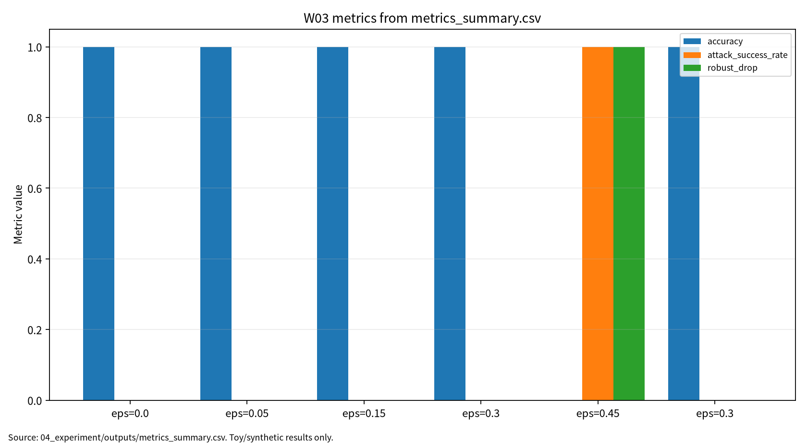

# W03 제출용 단일 보고서

## 컴퓨터비전 표현학습 & 비전 대적공격

## 0. 메타정보

| 항목 | 내용 |
|---|---|
| 주차 | W03 |
| 보고서 제목 | 컴퓨터비전 표현학습 & 비전 대적공격 |
| 과목 범위 | AI 보안 |
| 작성자 | 박영세 |
| 학번 | 26200122 |
| 작성일 | 2026-06-26 |
| 문서 상태 | 주차별 단일 제출용 보고서 |
| 원본 관리 파일 | `03_weekly_reports/w03_computer_vision_adversarial/07_week_submission/w03_submission_report.md` |
| Word/PDF 제출본 권장 위치 | `03_weekly_reports/w03_computer_vision_adversarial/07_week_submission/exports/` |
| 관련 산출물 위치 | `03_weekly_reports/w03_computer_vision_adversarial/` |
| 안전 범위 | 실제 개인정보 이미지, 운영 서비스 이미지, 무단 API 질의, 악용 가능한 공격 절차 제외 |
| PDF 검토 상태 | P01~P05 로컬 PDF blob 존재 확인. 제출 본문은 DOI/URL, `paper_list.md`, 논문별 summary, 실험 보고서 기준으로 작성 |
| 제출 전 주의 | P03~P05 일부 로컬 PDF는 arXiv/manuscript 판본일 수 있으므로 최종 제출 전 출판사 판본·권호·쪽 최종 확인 필요 |

---

## 초록

본 보고서는 W03 주차의 컴퓨터비전 표현학습과 비전 대적공격을 하나의 제출용 보고서로 통합한다. 컴퓨터비전 모델은 CNN의 지역 receptive field와 weight sharing, Vision Transformer의 patch token 및 self-attention, 멀티모달 Transformer의 image-text alignment를 통해 시각 표현을 학습한다. 그러나 이러한 표현학습 구조는 입력 이미지의 작은 교란, patch 단위 조작, attention 취약성, 2D/3D 센서 입력 왜곡에 의해 공격받을 수 있다. 본 보고서는 W03 논문 5편을 바탕으로 CNN, CV deep learning, multimodal Transformer, Vision Transformer, 2D/3D adversarial robustness를 연결하고, synthetic 8x8 bar image와 nearest-centroid model을 사용한 안전한 toy protocol로 clean accuracy, robust accuracy, ASR, robust drop, confusion matrix, reproducibility evidence를 분리 기록하였다. 실험 결과는 실제 CNN/ViT 공격 성능이 아니라 비전 대적공격 평가 구조를 설명하기 위한 안전한 예시로 한정한다.

**키워드:** 컴퓨터비전, CNN, Vision Transformer, 멀티모달 Transformer, 대적공격, robust accuracy, ASR, robust drop, 재현성

---

## 1. 한 문장 요약

W03는 비전 모델의 표현학습 원리를 CNN, ViT, 멀티모달 Transformer 관점에서 정리하고, 공격 조건에서는 clean accuracy와 robust accuracy, ASR, robust drop을 분리해 보고해야 함을 safe toy 실험으로 확인하는 주차다.

---

## 2. 학습 배경과 주차 목표

### 2.1 이번 주 주제의 위치

W03는 W01의 ML 생명주기 보안 평가와 W02의 학습 데이터 오염 위협을 비전 모델의 입력·표현·추론 단계로 확장하는 주차다. W01이 AI 보안 평가의 기본 프레임을 세웠고, W02가 학습 단계 오염을 다루었다면, W03는 이미지 입력과 시각 표현이 공격 조건에서 어떻게 흔들릴 수 있는지를 다룬다. 이후 W04 Transformer/NLP 보안, W05 self-supervised/backdoor, W06 deepfake, W07 multimodal LLM 보안과 연결된다.

### 2.2 강의계획서상 학습목표

- CNN의 지역성, weight sharing, pooling, gradient-based learning 원리를 이해한다.
- 딥러닝 기반 computer vision task의 classification, detection, segmentation, recognition 평가 구조를 정리한다.
- 멀티모달 Transformer와 Vision Transformer의 patch/token/attention 구조를 이해한다.
- 비전 대적공격과 2D/3D 강건성 평가에서 clean 성능과 공격 조건 성능을 분리한다.
- safe toy 실험을 통해 robust accuracy, ASR, robust drop, confusion matrix, reproducibility evidence를 분리 기록한다.

### 2.3 이번 주 핵심 질문

1. CNN과 ViT는 어떤 inductive bias 차이를 가지는가?
2. 이미지 입력의 작은 교란은 모델 표현과 decision boundary에 어떤 영향을 줄 수 있는가?
3. Clean accuracy와 robust accuracy, ASR은 왜 분리해 보고해야 하는가?
4. 2D/3D 비전 강건성 평가는 어떤 위협모형과 평가 지표를 요구하는가?
5. W03의 toy 실험을 KCI 또는 SCI 논문 주제로 발전시키려면 어떤 연구문제가 적절한가?

---

## 3. 논문 5편의 서술형 종합 요약

### 3.1 P01. Gradient-Based Learning Applied to Document Recognition

P01은 W03의 CNN 및 gradient-based learning 기반 문헌이다. 이 논문은 문서 인식 문제에서 convolution, local receptive field, weight sharing, pooling, gradient-based optimization이 어떻게 결합되는지를 보여준다. CNN은 이미지의 공간적 구조를 활용해 작은 filter가 지역 특징을 학습하고, 여러 층을 거치며 점차 추상적인 시각 표현을 만든다.

보안 관점에서 CNN은 gradient 기반 공격과 직접 연결된다. 모델이 입력 이미지의 미세한 변화에 따라 내부 feature map과 최종 decision boundary를 바꿀 수 있기 때문이다. 따라서 P01은 W03에서 CNN 구조와 비전 대적공격을 이해하는 기본 원리 문헌이다.

### 3.2 P02. Deep Learning for Computer Vision: A Brief Review

P02는 deep learning이 computer vision의 다양한 task에 어떻게 적용되는지를 정리한다. Classification, detection, segmentation, recognition, video understanding 등은 모두 시각 표현을 학습하고 평가하는 방식이 다르다. 따라서 비전 보안 평가도 단순 accuracy 하나로 끝나지 않고 task별 평가 지표를 분리해야 한다.

보안 관점에서 P02는 computer vision 모델이 실제 응용으로 확장될수록 입력 데이터, annotation, sensor condition, deployment environment에 따라 취약성이 달라진다는 점을 보여준다. 예를 들어 detection 시스템에서는 bounding box와 localization 오류가 중요하고, segmentation에서는 pixel-level misclassification이 문제가 된다.

### 3.3 P03. Multimodal Learning With Transformers: A Survey

P03은 이미지, 텍스트, 오디오 등 서로 다른 modality를 Transformer 기반으로 정렬하는 멀티모달 학습을 정리한다. 멀티모달 Transformer는 attention과 cross-modal fusion을 통해 image-text alignment, retrieval, visual question answering, captioning 등으로 확장된다.

보안 관점에서 멀티모달 모델은 단일 이미지 교란과 다른 공격면을 가진다. 이미지와 텍스트가 서로 맞지 않거나, 한 modality가 오염되거나, retrieval context가 잘못 연결되면 모델은 시각 입력을 올바르게 보더라도 잘못된 의미 해석을 할 수 있다. 따라서 W03의 비전 보안은 W07/W08의 multimodal LLM 및 RAG 보안으로 이어진다.

### 3.4 P04. Transformers in Vision: A Survey

P04는 Vision Transformer 계열을 정리하는 핵심 문헌이다. ViT는 이미지를 patch로 나누고 각 patch를 token처럼 처리한 뒤 self-attention을 통해 전역 관계를 학습한다. CNN이 지역성과 translation bias를 강하게 갖는 반면, ViT는 patch token과 attention 구조를 통해 더 넓은 context를 학습한다.

보안 관점에서 ViT의 공격면은 CNN과 다를 수 있다. Patch 단위 조작, token masking, attention manipulation, transfer attack, patch corruption 등이 ViT의 취약성과 연결된다. 따라서 W03 보고서에서는 CNN과 ViT를 단순 성능 차이가 아니라 구조적 공격면 차이로 비교해야 한다.

### 3.5 P05. A Survey of Robustness and Safety of 2D and 3D Deep Learning Models against Adversarial Attacks

P05는 2D와 3D deep learning model의 robustness와 safety를 대적공격 관점에서 정리한다. 2D 이미지는 pixel perturbation, patch attack, physical attack에 취약할 수 있고, 3D 모델은 point cloud, mesh, LiDAR, depth sensor 입력의 교란에 영향을 받을 수 있다.

보안 관점에서 P05는 W03의 핵심 보안 문헌이다. 안전한 비전 시스템을 주장하려면 clean accuracy뿐 아니라 robust accuracy, ASR, robust drop, confusion matrix, physical/sensor condition, 2D/3D threat model을 함께 기록해야 한다. 특히 자율주행, 의료영상, 감시 시스템처럼 비전 판단이 실제 안전에 영향을 주는 영역에서는 robust evaluation이 필수다.

---

## 4. 논문 간 연결 관계

W03 논문 5편은 다음 흐름으로 연결된다.

```text
CNN과 gradient-based learning
→ computer vision task 확장
→ multimodal Transformer alignment
→ Vision Transformer patch/token/attention 구조
→ 2D/3D adversarial robustness와 safety 평가
```

P01은 CNN과 gradient 학습 원리, P02는 computer vision task 확장, P03은 multimodal Transformer, P04는 Vision Transformer 구조, P05는 2D/3D adversarial robustness 평가를 제공한다. 이 다섯 문헌을 종합하면 W03의 핵심 메시지는 “비전 모델 보안 평가는 시각 표현학습 구조와 공격 조건 평가를 함께 보아야 한다”는 것이다.

---

## 5. AI 원리 70% 정리

CNN은 지역 receptive field와 weight sharing을 통해 이미지의 계층적 feature를 학습한다. Vision Transformer는 이미지를 patch token으로 변환하고 self-attention을 적용한다. Multimodal Transformer는 이미지와 텍스트 등 서로 다른 modality의 표현을 정렬한다. 이 구조들은 모두 시각 표현학습의 핵심이지만, 동시에 공격자가 조작할 수 있는 입력·patch·token·alignment 공격면을 만든다.

### 5.1 핵심 수식

2D convolution은 입력 feature map에 filter를 적용해 지역 특징을 추출한다.

$$
y_{i,j,k}=\sum_{u,v,c}W_{u,v,c,k}x_{i+u,j+v,c}+b_k
$$

| 기호 | 의미 |
|---|---|
| $x$ | 입력 feature map |
| $W$ | convolution filter |
| $b_k$ | $k$번째 filter의 bias |
| $y_{i,j,k}$ | 위치 $(i,j)$의 $k$번째 출력 feature |

Gradient 기반 학습은 손실함수를 줄이는 방향으로 파라미터를 갱신한다.

$$
\theta_{t+1}=\theta_t-\eta\nabla_{\theta}L(\theta_t)
$$

ViT는 이미지를 patch token sequence로 변환한다.

$$
Z_0=[x_{cls};x_{p1};x_{p2};\cdots;x_{pn}]+E_{pos}
$$

| 기호 | 의미 |
|---|---|
| $x_{cls}$ | classification token |
| $x_{pi}$ | $i$번째 image patch token |
| $E_{pos}$ | positional embedding |

Self-attention은 query와 key의 유사도를 이용해 value를 가중합한다.

$$
Attention(Q,K,V)=\mathrm{softmax}\left(\frac{QK^T}{\sqrt{d}}\right)V
$$

비전 대적공격 평가는 clean 조건과 robust 조건을 분리한다.

$$
RobustAcc=\frac{N_{rob}}{N_{test}}
$$

$$
ASR=\frac{N_{atk}}{N_{adv}}
$$

| 기호 | 의미 |
|---|---|
| $N_{rob}$ | 교란 조건에서도 정답을 맞힌 샘플 수 |
| $N_{test}$ | 전체 평가 샘플 수 |
| $N_{adv}$ | 공격 조건 평가 샘플 수 |
| $N_{atk}$ | 공격 목표 오분류가 발생한 샘플 수 |

### 5.2 핵심 개념과 보안 연결

| 개념 | 원리 | 보안 연결 |
|---|---|---|
| CNN | 지역성과 weight sharing | gradient 기반 교란 배경 |
| Pooling | 위치 변화에 대한 안정성 | 일부 정보 손실과 방어 해석 |
| Vision Transformer | patch token과 self-attention | patch/attention 취약성 |
| Multimodal Transformer | cross-modal alignment | image-text mismatch, retrieval mismatch |
| Robust metric separation | 정상 조건과 공격 조건 분리 | 안전성 과장 방지 |
| 2D/3D robustness | 이미지·point cloud·sensor 입력 평가 | 자율주행·의료·감시 safety 연결 |

---

## 6. 보안 이슈 30% 정리

비전 대적공격은 입력 이미지 또는 센서 입력을 변형해 모델의 예측을 바꾸는 위협이다. 비전 모델의 보안성 평가는 clean accuracy뿐 아니라 robust accuracy, ASR, robust drop, confusion matrix, 2D/3D safety 지표를 함께 고려해야 한다. 본 보고서는 공격 절차가 아니라 보호 자산, 공격자 가정, 평가 지표, 재현성 근거를 중심으로 작성한다.

| 보안 속성 | W03에서의 의미 | 대표 위협 | 평가 지표 |
|---|---|---|---|
| Integrity | 이미지 입력과 예측 결과의 무결성 훼손 | adversarial perturbation, patch attack | robust accuracy, ASR |
| Safety | 실제 환경에서 잘못된 시각 판단 | physical attack, sensor attack | robust drop, high-risk case review |
| Availability | 방어 또는 교란으로 탐지·분류 기능 저하 | noise, occlusion, corruption | performance drop |
| Privacy | 영상·이미지에 얼굴·위치·행동 정보 포함 | sensitive visual data leakage | privacy-safe data handling |
| Accountability | 데이터, 모델, 공격 조건, 방어 조건 기록 필요 | seed/config/log 누락 | reproducibility evidence |

---

## 7. Research Track 분석

### 7.1 연구문제

- RQ1. 비전 모델의 clean 성능과 공격 조건 성능을 어떻게 분리해 기록할 것인가?
- RQ2. CNN, ViT, 멀티모달 Transformer의 구조 차이는 어떤 공격면 차이로 이어지는가?
- RQ3. 2D/3D 비전 모델의 robustness와 safety를 설명하기 위해 어떤 지표와 재현성 증거가 필요한가?

### 7.2 위협모형

| 항목 | 내용 |
|---|---|
| 보호 자산 | 입력 이미지, 영상/센서 데이터, feature representation, model checkpoint, 출력 label/confidence, 평가셋, 로그 |
| 공격자 목표 | 오분류 유도, detection/segmentation 실패, image-text mismatch 유도, 2D/3D perception failure 유도 |
| 공격자 지식 | white-box, gray-box, black-box, transfer attack 가정 |
| 공격자 능력 | pixel perturbation, patch 조작, token/attention 조작, sensor noise, physical pattern 삽입 |
| 공격 경로 | image/sensor input → representation → model decision → clean/robust evaluation |
| 방어자 능력 | robust evaluation, feature squeezing check, data provenance, model versioning, logging |
| 제외 범위 | 실제 운영 서비스 공격, 개인정보 이미지 사용, 무단 API 질의, 악용 가능한 공격 절차 제공 |

### 7.3 평가축

| 평가축 | 질문 | 대표 지표 또는 증거 |
|---|---|---|
| Clean performance | 정상 이미지에서 성능이 유지되는가 | clean accuracy, macro F1 |
| Robust performance | 교란 이미지에서 성능이 유지되는가 | robust accuracy, robust drop |
| Attack behavior | 공격 조건에서 오분류가 발생하는가 | ASR, confusion matrix |
| Multimodal consistency | image-text alignment가 유지되는가 | alignment consistency, mismatch rate |
| Reproducibility evidence | 동일 결과를 다시 만들 수 있는가 | seed, config, Docker, outputs, PGM examples |

### 7.4 재현성

재현성을 위해 dataset, seed, model type, epsilon, defense condition, confusion matrix, PGM example, CSV/JSON/Markdown log를 보존한다. W03 실습은 synthetic 8x8 bar image를 사용하고, 실제 개인정보 이미지나 운영 시스템 이미지를 사용하지 않는다.

---

## 8. 실습 보고서 및 그래프 수치 검증

본 실습은 실제 CNN/ViT 공격 재현이 아니라 W03의 핵심인 비전 대적공격 평가축을 안전하게 설명하기 위한 최소 toy protocol이다. Synthetic 8x8 bar image와 nearest-centroid model을 사용해 clean condition과 perturbation condition의 지표 분리 방식을 재현 가능하게 설명한다.

### 8.1 실습 설계

| 항목 | 내용 |
|---|---|
| Dataset | `synthetic_8x8_bar_images` |
| Model | `nearest_centroid` |
| Attack condition | `centroid_direction_linf` |
| Defense/check | `feature_squeeze_2_levels` |
| Seed | 42 |
| 실행 명령 | `python3 src/run_experiment.py --config configs/config.yaml` |
| 결과 위치 | `04_experiment/outputs/` |

### 8.2 실습 결과 수치

| 조건 | Epsilon | Defense | N | Accuracy | Macro F1 | ASR | Robust Drop | Confusion Matrix |
|---|---:|---|---:|---:|---:|---:|---:|---|
| Clean baseline | 0.00 | none | 120 | 1.000000 | 1.000000 | N/A | 0.000000 | `[[60, 0], [0, 60]]` |
| Adversarial perturbation | 0.05 | none | 120 | 1.000000 | 1.000000 | 0.000000 | 0.000000 | `[[60, 0], [0, 60]]` |
| Adversarial perturbation | 0.15 | none | 120 | 1.000000 | 1.000000 | 0.000000 | 0.000000 | `[[60, 0], [0, 60]]` |
| Adversarial perturbation | 0.30 | none | 120 | 1.000000 | 1.000000 | 0.000000 | 0.000000 | `[[60, 0], [0, 60]]` |
| Adversarial perturbation | 0.45 | none | 120 | 0.000000 | 0.000000 | 1.000000 | 1.000000 | `[[0, 60], [60, 0]]` |
| Feature squeezing check | 0.30 | feature_squeeze_2_levels | 120 | 1.000000 | 1.000000 | 0.000000 | 0.000000 | `[[60, 0], [0, 60]]` |

Epsilon 0.05, 0.15, 0.30에서는 synthetic two-class toy 데이터의 decision boundary가 유지되어 accuracy와 macro F1이 1.000000으로 유지되었다. Epsilon 0.45에서는 반대 클래스 중심점 방향 perturbation이 toy decision boundary를 넘어 모든 샘플이 뒤집혔다. 이 결과는 실제 CNN/ViT, 2D/3D perception system, physical attack 성능을 의미하지 않는다.

### 8.3 그래프 수치 검증

현재 제출 보고서의 그래프는 `assets/w03_metric_chart.png`를 참조한다. 확인 가능한 SVG 그래프에는 `accuracy`, `attack_success_rate`, `robust_drop` 세 series가 표시되어 있다. Macro F1은 표에는 포함하지만 현재 그래프 series에는 포함하지 않는다. 그래프 x축에는 `centroid_direction_linf`가 여러 번 반복되므로 보고서 표에서는 epsilon을 함께 표기해 해석한다.

| 조건 | Epsilon | 그래프 Accuracy | 표 Accuracy | 그래프 ASR | 표 ASR | 그래프 Robust Drop | 표 Robust Drop | 확인 결과 |
|---|---:|---:|---:|---:|---:|---:|---:|---|
| Clean baseline | 0.00 | 1.000000 | 1.000000 | N/A | N/A | 0.000000 | 0.000000 | 일치 |
| Adversarial perturbation | 0.05 | 1.000000 | 1.000000 | 0.000000 | 0.000000 | 0.000000 | 0.000000 | 일치 |
| Adversarial perturbation | 0.15 | 1.000000 | 1.000000 | 0.000000 | 0.000000 | 0.000000 | 0.000000 | 일치 |
| Adversarial perturbation | 0.30 | 1.000000 | 1.000000 | 0.000000 | 0.000000 | 0.000000 | 0.000000 | 일치 |
| Adversarial perturbation | 0.45 | 0.000000 | 0.000000 | 1.000000 | 1.000000 | 1.000000 | 1.000000 | 일치 |
| Feature squeezing check | 0.30 | 1.000000 | 1.000000 | 0.000000 | 0.000000 | 0.000000 | 0.000000 | 일치 |

<!-- submission-metric-chart:start -->
**그림 1. W03 metrics summary chart**



출처: `04_experiment/outputs/metrics_summary.csv`. 이 그래프는 공개 toy/synthetic 산출물 기반이며 실제 공격 성능이나 운영 환경 성능으로 일반화하지 않는다. 현재 그래프는 accuracy, attack_success_rate, robust_drop을 시각화한다.
<!-- submission-metric-chart:end -->

### 8.4 Toy image 예시

| 예시 | 파일 위치 |
|---|---|
| Clean | `04_experiment/outputs/clean_example.pgm` |
| Adversarial | `04_experiment/outputs/adversarial_eps_0_30.pgm` |
| Feature-squeezed | `04_experiment/outputs/feature_squeezed_eps_0_30.pgm` |

---

## 9. 기말논문 연결

W03는 기말논문의 관련연구, 위협모형, 평가방법, 분석/실험 장에 연결된다. 특히 `clean performance`, `attack impact`, `reproducibility evidence`를 분리해 기록하는 프레임워크의 비전 사례로 활용할 수 있다.

| 기말논문 장 | W03 반영 내용 |
|---|---|
| 1장 서론 | 비전 모델 보안 평가에서 정확도 중심 평가의 한계 제시 |
| 2장 관련연구 | CNN, CV deep learning, multimodal Transformer, ViT, 2D/3D robustness 문헌 정리 |
| 3장 위협모형 | 입력 이미지, patch, token, sensor, representation 공격면 정의 |
| 4장 연구방법 | clean accuracy, robust accuracy, ASR, robust drop, confusion matrix 설계 |
| 5장 분석 | epsilon별 toy perturbation 결과와 clean/robust 성능 분리 |
| 6장 결론 | 비전 모델 보안 평가는 task, attack condition, reproducibility evidence를 함께 관리해야 함 |

---

## 10. AI 도구 활용 기록

AI 도구는 문헌 요약, 코드 점검, 문장 구조화, 그래프 생성 보조에 사용하였다. 모든 DOI/URL, 실험 수치, 본문 인용, 결론은 작성자가 outputs 파일과 로컬 참고문헌 검증표를 대조하여 검증한다.

| 항목 | 내용 |
|---|---|
| 사용 도구명 | Codex, ChatGPT 계열 도구 |
| 사용 목적 | 문헌 요약 정리, 보고서 구조화, 안전한 toy/synthetic 실험 결과 표기 점검, 그래프 생성 보조, 제출 전 체크리스트 정리 |
| AI 산출물 반영 위치 | `07_week_submission/w03_submission_report.md`, `07_week_submission/assets/w03_metric_chart.png`, `05_ai_worklog/ai_disclosure_draft.md` |
| 본인 수정 내용 | 주차별 문헌 상태 확인, 실험 수치와 outputs 대조, 안전 범위와 한계 문장 확인, 최종 제출 전 미확정 문헌 분리 |
| 사실관계 검증 방법 | `01_papers/paper_list.md`, `01_papers/doi_check.md`, 강의계획서 문헌표 대조 |
| 실험결과 검증 방법 | `04_experiment/experiment_report.md`, `04_experiment/outputs/metrics_summary.csv`, `results.json`, `run_log.md`의 수치와 보고서 표기 대조 |
| 최종 책임 확인 | AI 산출물은 초안 보조이며 최종 제출자는 원고 내용, 인용, 실험결과, 연구윤리 책임을 확인한다. |

---

## 11. 제출 전 자기 점검표

| 점검 항목 | 상태 | 비고 |
|---|---|---|
| 메타정보 작성 | 완료 | 작성일 2026-06-26 반영 |
| 초록 및 키워드 작성 | 완료 |  |
| AI 원리 70% 정리 | 완료 | 핵심 수식 추가 |
| 보안 이슈 30% 정리 | 완료 |  |
| 논문 5편 서술형 요약 | 완료 |  |
| 논문 간 연결 관계 작성 | 완료 |  |
| Research Track 5요소 작성 | 완료 | 연구문제, 위협모형, 평가방법, 재현성, 한계 |
| P01~P05 PDF blob 확인 | 완료 | GitHub 파일 존재 확인. 원문 PDF 저작권/배포 정책 별도 검토 필요 |
| P01~P05 DOI/URL 검증 | 완료 | `paper_list.md` 기준 |
| 실험 outputs 파일 존재 확인 | 완료 | 실험 보고서 기준 CSV/JSON/run log/PGM 존재 |
| 실험 결과와 보고서 수치 일치 | 완료 | 실험 보고서 수치 기준 반영 |
| 그래프 수치 확인 | 완료 | accuracy/attack_success_rate/robust_drop series 기준 표와 일치 |
| AI 활용 고지 작성 | 완료 |  |
| DOCX/PDF 제출본 생성 | 필요 | `07_week_submission/exports/` 권장 |
| 최종 사람이 검토할 항목 표시 | 완료 | PDF 보관 정책, 출판사 판본, Word/PDF 렌더링 |

---

## 12. 참고문헌 검증표

| 번호 | 참고문헌 | DOI/URL | 상태 | 비고 |
|---:|---|---|---|---|
| [1] | Yann LeCun, Leon Bottou, Yoshua Bengio, Patrick Haffner, “Gradient-Based Learning Applied to Document Recognition,” Proceedings of the IEEE, 1998 | `https://doi.org/10.1109/5.726791` | 확인됨 | CNN/gradient-based learning 핵심 배경 |
| [2] | Athanasios Voulodimos, Nikolaos Doulamis, Anastasios Doulamis, Eftychios Protopapadakis, “Deep Learning for Computer Vision: A Brief Review,” Computational Intelligence and Neuroscience, 2018 | `https://doi.org/10.1155/2018/7068349` | 확인됨 | CV task별 평가 지표 배경 |
| [3] | Peng Xu, Xiatian Zhu, David A. Clifton, “Multimodal Learning With Transformers: A Survey,” IEEE TPAMI, 2023 | `https://doi.org/10.1109/TPAMI.2023.3275156` | 확인됨 | 멀티모달/LLM/RAG 확장 bridge |
| [4] | Salman Khan et al., “Transformers in Vision: A Survey,” ACM Computing Surveys, 2022 | `https://doi.org/10.1145/3505244` | 확인됨 | ViT patch/token/attention 구조 분석 |
| [5] | Yanjie Li et al., “A Survey of Robustness and Safety of 2D and 3D Deep Learning Models against Adversarial Attacks,” ACM Computing Surveys, 2024 | `https://doi.org/10.1145/3636551` | 확인됨 | 2D/3D adversarial robustness 핵심 보안 문헌 |

---

## 13. 부록 A. KCI 논문 형식 전환 아이디어

### A.1 제목 후보

| 번호 | 국문 제목 후보 | 영문 제목 후보 | 예상 기여 |
|---:|---|---|---|
| 1 | 컴퓨터비전 모델의 대적공격 평가를 위한 다중지표 프레임워크 연구 | A Multi-Metric Evaluation Framework for Adversarial Attacks on Computer Vision Models | clean/robust/ASR 분리 평가 |
| 2 | CNN과 Vision Transformer 기반 비전 모델의 보안 평가 항목 비교 연구 | A Comparative Study on Security Evaluation Criteria for CNN and Vision Transformer-Based Vision Models | inductive bias와 보안 평가 연결 |
| 3 | AI 보안 평가에서 비전 대적공격의 Clean Accuracy와 Robust Accuracy 분리 기록 필요성 연구 | A Study on the Need to Separately Report Clean Accuracy and Robust Accuracy for Vision Adversarial Attacks | 제출 가능형 평가 체크리스트 |

추천 제목은 “컴퓨터비전 모델의 대적공격 평가를 위한 다중지표 프레임워크 연구”이다. 국문초록은 정상 성능과 공격 조건 성능을 분리하는 다중지표 프레임워크, W03 문헌 비교, safe toy experiment, 재현성 증거 보존을 중심으로 구성한다.

### A.2 연구문제

- RQ1. 비전 모델의 clean accuracy와 robust accuracy는 어떤 조건에서 분리되어야 하는가?
- RQ2. CNN, ViT, 멀티모달 Transformer의 구조 차이는 보안 평가 항목에 어떤 차이를 만드는가?
- RQ3. Safe toy evaluation은 실제 비전 대적공격 평가 프레임워크 설명에 어떤 장점과 한계를 가지는가?

---

## 14. 부록 B. SCI 논문 형식 전환 아이디어

SCI 제목 후보는 “A Multi-Metric Evaluation Framework for Vision Adversarial Robustness: Separating Clean Accuracy, Robust Accuracy, Attack Success Rate, and Reproducibility Evidence”이다.

Structured abstract는 Background, Problem, Method, Results, Contribution, Implications로 구성한다. 결과 문장은 W03 toy evaluation이 epsilon 0.45에서 robust performance failure를 보였고, epsilon 0.30 feature squeezing condition에서는 toy setting 기준 성능이 유지되었다는 수준으로 제한한다. 실제 CNN/ViT 또는 2D/3D perception system 성능으로 일반화하지 않는다.

| 연구축 | 대표 논문 | 역할 |
|---|---|---|
| CNN and gradient-based learning | LeCun et al. | CNN 구조와 gradient 기반 학습 원리 |
| Deep learning for computer vision | Voulodimos et al. | CV task와 딥러닝 응용 |
| Multimodal Transformers | Xu et al. | 이미지-텍스트/멀티모달 표현학습 |
| Vision Transformers | Khan et al. | ViT 구조와 CNN 대비 특징 |
| Vision adversarial robustness | Li et al. | 2D/3D 비전 대적공격과 안전성 평가 |

---

## 15. 부록 C. 제출 파일 위치와 변환 권장

| 파일 | 설명 |
|---|---|
| `07_week_submission/w03_submission_report.md` | 본 제출용 보고서 원본 |
| `07_week_submission/assets/w03_metric_chart.png` | 제출 보고서 그래프 |
| `04_experiment/experiment_report.md` | 실험 근거 보고서 |
| `04_experiment/outputs/` | 실험 결과 근거 파일 위치 |
| `05_ai_worklog/ai_disclosure_draft.md` | AI 활용 고지 근거 |

Word 제출본은 다음 위치에 생성해 관리한다.

```text
03_weekly_reports/w03_computer_vision_adversarial/07_week_submission/exports/w03_submission_report.docx
```

PDF 제출본은 Word에서 최종 육안 검수 후 다음 위치에 저장한다.

```text
03_weekly_reports/w03_computer_vision_adversarial/07_week_submission/exports/w03_submission_report.pdf
```

수식은 GitHub와 Word 변환을 모두 고려하여 Markdown 표 안에 넣지 않고, `$$...$$` block math로 유지한다.
