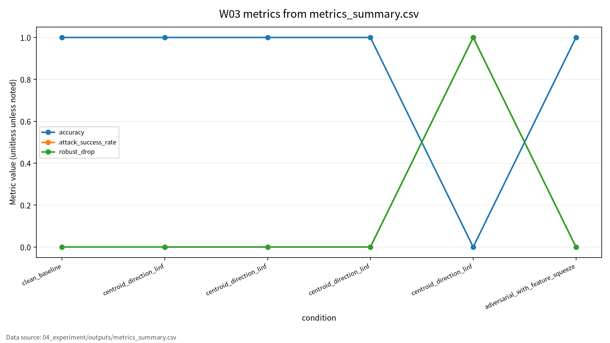

# W03 컴퓨터비전 표현학습 & 비전 대적공격

## 발표 핵심

비전 모델 보안 평가는 clean accuracy 하나로 끝나지 않는다. 정상 조건 성능, 공격 조건 성능, ASR, 재현성 근거를 분리해야 한다.

---

# 1. 왜 W03가 중요한가

- 이미지 모델은 분류, 검색, 인식, 멀티모달 AI의 핵심 구성요소다.
- 정상 테스트셋에서 잘 맞아도 작은 입력 교란에 취약할 수 있다.
- W03의 질문: “모델이 이미지를 잘 본다”는 말은 보안적으로 충분한가?

발표 메시지: 좋은 표현학습이 곧 안전한 모델을 의미하지 않는다.

---

# 2. 발표 로드맵

1. 컴퓨터비전 표현학습 원리
2. CNN과 ViT의 차이
3. 비전 대적공격 위협
4. 논문 5편의 역할
5. Toy 실험과 결과
6. 기말논문 연결

---

# 3. AI 원리 70%: CNN

- CNN은 지역 receptive field와 convolution으로 이미지 특징을 추출한다.
- Pooling은 공간 정보를 압축하고 feature map을 더 안정적으로 만든다.
- 얕은 계층은 edge와 texture, 깊은 계층은 shape와 object-level 표현을 학습한다.

핵심 연결: 입력 픽셀의 작은 변화도 feature map과 decision boundary를 바꿀 수 있다.

---

# 4. AI 원리 70%: ViT와 멀티모달 표현

| 개념 | 핵심 | 보안 연결 |
|---|---|---|
| ViT | 이미지를 patch token으로 처리 | CNN과 다른 취약성 가능 |
| Attention | 장거리 의존성 학습 | 특정 patch 조작 영향 |
| 멀티모달 정합 | 이미지-텍스트 표현공간 정렬 | 입력 조작과 정합 실패 |
| 표현학습 | 과제에 유용한 특징 추출 | 공격자가 특징공간을 흔들 수 있음 |

---

# 5. 보안 이슈 30%

| 위협 | 공격자 가정 | 대표 지표 |
|---|---|---|
| White-box attack | 모델 구조/gradient 접근 | robust accuracy, ASR |
| Black-box attack | 제한된 질의 또는 transfer | attack impact |
| Transfer attack | 다른 모델에서 만든 교란 이전 | transfer success |
| 2D/3D 조작 | 이미지 또는 객체 입력 변화 | safety failure |

정상 성능과 공격 조건 성능은 반드시 분리해서 봐야 한다.

---

# 6. 논문 5편의 역할

| ID | 중심 역할 | W03 활용 |
|---|---|---|
| P01 | CNN과 gradient 학습 | 비전 표현학습 출발점 |
| P02 | 컴퓨터비전 딥러닝 리뷰 | 원리 배경 |
| P03 | 멀티모달 transformer | 이미지-텍스트 표현 연결 |
| P04 | Vision Transformer survey | CNN/ViT 비교 |
| P05 | 2D/3D adversarial robustness | 보안 평가축 |

원리 문헌과 보안 문헌을 연결해야 평가 프레임이 완성된다.

---

# 7. 위협모형

```text
Image/Data -> Model -> Prediction -> Evaluation Log
     |          |          |              |
 input noise  weights   wrong label   unverifiable result
 perturbation access    target class  missing seed/config
```

- 보호 자산: 학습 데이터, 모델 파라미터, 입력 이미지, 출력 라벨, 평가 로그
- 공격 경로: 입력 교란, 일부 데이터 조작, transfer attack
- 방어자 가정: toy/synthetic 평가, seed/config/log 보존, 실제 서비스 공격 제외

---

# 8. 평가 프로토콜

| 평가 항목 | 지표 | 기록 방법 |
|---|---|---|
| Clean performance | accuracy, macro F1 | 정상 입력 |
| Attack impact | ASR, robust drop | 교란 입력 |
| Robust performance | robust accuracy | epsilon별 비교 |
| Reproducibility | seed, config, outputs | CSV/JSON/run log |
| Human review | DOI/URL, 원문 대조 | 체크리스트 |

단일 accuracy 표가 아니라 조건별 평가표가 필요하다.

---

# 9. Toy 실험 설계

- 데이터: synthetic 8x8 vertical/horizontal bar image
- 모델: nearest-centroid classifier
- 공격: 반대 클래스 중심점 방향 L-infinity perturbation
- 방어 점검: 2-level feature squeezing
- 출력: `metrics_summary.csv`, `results.json`, `run_log.md`, PGM 예시 이미지

안전 범위: 개인정보, 운영 서비스 이미지, 무단 API 공격 없음.

---

# 10. Toy 실험 결과

| 조건 | Epsilon | Accuracy | Macro F1 | ASR |
|---|---:|---:|---:|---:|
| Clean baseline | 0.00 | 1.000000 | 1.000000 | 해당 없음 |
| Perturbation | 0.30 | 1.000000 | 1.000000 | 0.000000 |
| Perturbation | 0.45 | 0.000000 | 0.000000 | 1.000000 |
| Feature squeezing | 0.30 | 1.000000 | 1.000000 | 0.000000 |

정량값은 `04_experiment/outputs/run_log.md` 기준이다.

---

# 11. 결과 해석과 한계

- Epsilon 0.45는 toy decision boundary 전환이며 실제 CNN/ViT 공격 성공이 아니다.
- 이는 synthetic 2-class toy 데이터의 경계 전환을 보여준다.
- 실제 CNN/ViT 또는 2D/3D 비전 모델 강건성으로 일반화하지 않는다.
- 핵심은 수치 자체보다 clean 성능, 공격 영향, 재현성 근거를 분리하는 방식이다.

---

# 12. 기말논문 연결

| 기말논문 장 | 연결 내용 |
|---|---|
| 관련연구 | CNN/ViT 원리와 adversarial robustness 문헌 연결 |
| 위협모형 | 보호 자산, 공격자 능력, 평가 로그 |
| 평가방법 | clean, attack impact, reproducibility 분리 |
| 분석/실험 | synthetic toy 평가를 통한 지표 분리 예시 |

Contribution 후보: 제출 가능한 AI 보안 평가 프레임워크.

---

# 13. 결론

W03 결론:

- 비전 모델의 정상 성능은 보안성을 보장하지 않는다.
- 공격 조건 성능과 ASR을 별도로 기록해야 한다.
- 실행 로그, config, seed, CSV/JSON 산출물이 있어야 정량값을 주장할 수 있다.
- W03는 기말논문의 재현성 중심 평가 프레임워크를 보강하는 사례다.

<!-- formula-visual-supplement:start -->
# 수식·그래프·그림 보강

- 보강 일자: 2026-06-23
- 수식은 표준 정의식 또는 검증 가능한 평가식으로만 작성했다.
- 그래프는 `04_experiment/outputs/metrics_summary.csv`의 기존 수치만 사용했다.
- 다이어그램은 AI-assisted conceptual diagram이며 사실 자료나 실험 결과처럼 해석하지 않는다.

### 핵심 수식: Adversarial Perturbation Constraint

$$
x' = x+\delta,
\qquad
\lVert \delta \rVert_p \le \epsilon
$$

| 기호 | 의미 |
|---|---|
| `x` | 원본 입력 |
| `x'` | 교란된 입력 |
| `\delta` | 입력 교란 |
| `\epsilon` | 허용 교란 반경 |

**직관적 의미:**  
대적 예시는 작은 입력 교란이 예측을 바꿀 수 있는지를 보는 평가 개념이다. 핵심은 교란 크기와 모델 실패 여부를 함께 기록하는 것이다.

**보안 관점 해석:**  
보안 관점에서는 입력 검증, 강건성 평가, defense 비용이 연결된다.

**평가 지표 연결:**  
robust accuracy, attack_success_rate, robust_drop, defense 여부와 연결한다.

**한계와 가정:**  
toy image setting이며 실제 운영 비전 시스템을 우회하는 절차가 아니다.

### 핵심 수식: Robust Accuracy와 Robust Drop

$$
RA_\epsilon=\frac{1}{n}\sum_{i=1}^{n}\mathbf{1}\left[f_\theta(x_i+\delta_i)=y_i\right],
\qquad
Drop=Acc_{clean}-RA_\epsilon
$$

| 기호 | 의미 |
|---|---|
| `RA_\epsilon` | 교란 조건에서의 정확도 |
| `Acc_{clean}` | 정상 입력 정확도 |
| `Drop` | 강건성 저하량 |
| `n` | 평가 표본 수 |

**직관적 의미:**  
강건성은 정상 정확도에서 얼마나 유지되는지로 해석한다. Drop이 클수록 clean-only 평가가 위험을 감춘다.

**보안 관점 해석:**  
공격 조건 성능과 방어 후 성능을 같은 표에 연결한다.

**평가 지표 연결:**  
accuracy, attack_success_rate, robust_drop, n_samples와 연결한다.

**한계와 가정:**  
공식 인증 강건성은 아니며 실험적 toy proxy로 표시한다.

### 표 수치 기반 그래프



그래프는 condition별 accuracy, attack_success_rate, robust_drop을 `metrics_summary.csv`에서 읽어 시각화한다. epsilon 또는 defense 조건별 변화는 robust accuracy를 clean accuracy와 분리해 보아야 함을 보여준다. 이미 존재하는 output 수치만 사용했다.

### Threat Model / Pipeline Diagram


이 다이어그램은 `adversarial evaluation flow`를 발표용으로 요약한 개념도다. 데이터 흐름, 평가 지표, 한계 표시는 `assets/figure_manifest.md`에도 기록했다.

### 확인 필요

- 대적 교란은 toy evaluation 범위로 설명하며 실제 시스템 우회 절차로 쓰지 않는다.
- 논문별 원문 절·쪽·그림 번호는 최종 제출 전 사람 검토가 필요하다.
<!-- formula-visual-supplement:end -->
