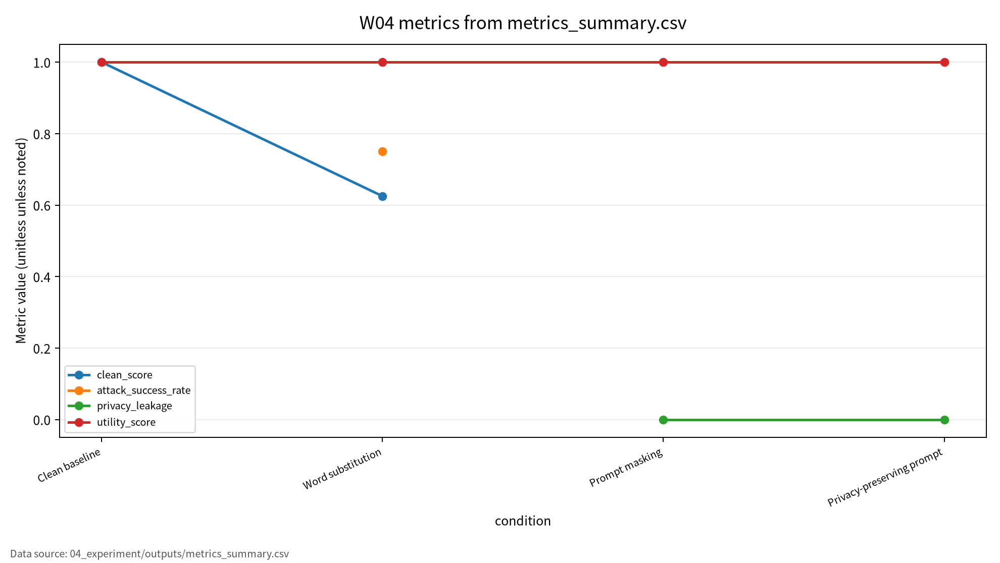
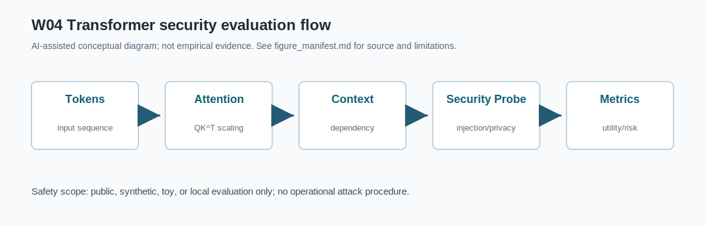

# W04 Transformer 변형 & NLP 대적공격·프라이버시 통합보고서

## 0. 메타정보

| 항목 | 내용 |
|---|---|
| 주차 | W04 |
| 주제 | Transformer 변형 & NLP 대적공격·프라이버시 |
| 제출 상태 | 제출용 최종 초안, 사람 검토 필요 |
| 작성·보완일 | 2026-06-22 |
| 실험 범위 | synthetic 프라이버시 위험 프롬프트 기반 안전 toy 실험 |
| 실험 산출물 | `04_experiment/outputs/metrics_summary.csv`, `results.json`, `run_log.md` |
| 주의 | 실제 개인정보, 실제 운영 서비스, 무단 API 질의, 악용 가능한 공격 절차 없음 |

## 1. 한 문장 요약

W04는 Transformer 효율화 문헌[1][2][3]과 NLP 대적공격·프롬프트 프라이버시 문헌[4][5]을 연결하여, clean score, attack success rate, privacy leakage, utility score, reproducibility evidence를 분리 보고하는 프롬프트 기반 NLP 보안 평가 구조를 정리한다.

## 2. 학습 배경과 주차 목표

### 2.1 이번 주 주제의 위치

W04는 W03의 비전 Transformer와 멀티모달 표현학습을 NLP Transformer와 프롬프트 기반 보안 문제로 확장하는 주차다. W01은 ML 생명주기 보안 평가의 기본 프레임을 세웠고, W02는 학습 데이터 오염을 다루었으며, W03는 비전 입력 교란과 robust evaluation을 다루었다. W04는 Transformer attention 구조, 긴 입력 처리 비용, NLP 대적공격, 프롬프트 프라이버시, in-context learning 환경의 민감정보 노출을 연결한다. 이후 W07 LLM 보안, W08 RAG 프롬프트 인젝션, W11 차등프라이버시, W14 MLOps 공급망 보안과 직접 연결된다.

### 2.2 강의계획서상 학습목표

- Attention 복잡도 병목의 수학적 해소기법을 비교한다.
- NLP 강건성의 공격면과 방어면을 매핑한다.
- 프롬프트 입력의 민감정보 보호기법 평가항목을 정의한다.

### 2.3 이번 주 핵심 질문

1. Self-attention의 계산 복잡도는 왜 긴 입력 처리에서 병목이 되는가?
2. Efficient Transformer 기법은 성능·비용·보안 평가에 어떤 영향을 주는가?
3. 단어 치환 기반 NLP 대적공격은 어떤 방식으로 탐지기를 우회하는가?
4. Prompt privacy와 ICL leakage는 어떤 보호 자산과 연결되는가?
5. W04의 synthetic prompt 실험을 KCI 또는 SCI 논문 주제로 발전시키려면 어떤 연구문제가 적절한가?

## 3. AI 원리 70% 정리

Efficient Transformer 연구는 self-attention의 계산 복잡도와 긴 시퀀스 처리 비용을 줄이는 여러 구조적 접근을 분류한다[1]. Faster and lighter Transformer 연구는 속도, 메모리, latency, 경량화 관점에서 실용적 효율화 전략을 정리한다[2]. Transformer survey는 Transformer 계열 구조와 응용을 taxonomy 관점에서 정리한다[3].

**표 1. W04 핵심 개념과 보안 연결**

| 핵심 개념 | AI 원리 | 보안 연결 |
|---|---|---|
| Self-attention | Q/K/V로 토큰 간 관계를 계산한다. | 긴 프롬프트 처리 비용과 민감정보 관측면이 커진다. |
| Efficient Transformer | sparse, low-rank, kernelized attention으로 비용을 낮춘다. | 보안 필터, 마스킹, 로그 감사의 latency를 줄일 수 있다. |
| Faster/lighter Transformer | distillation, pruning, quantization, inference optimization을 활용한다. | 방어 기능의 배포 가능성과 utility trade-off를 평가해야 한다. |
| Transformer taxonomy | 구조, pre-training, 응용을 분류한다. | 입력·attention·출력·로그 단계별 공격면을 나눌 수 있다. |
| Prompt/ICL | 프롬프트와 예시를 통해 작업 맥락을 제공한다. | 프롬프트, few-shot 예시, 로그에 민감정보가 남을 수 있다. |

## 4. 보안 이슈 30% 정리

NLP 대적공격 연구는 의미를 크게 유지하면서 모델 판단을 바꾸는 단어 치환, 문장 재구성, transfer attack을 다룬다[4]. Prompt privacy 연구는 프롬프트 입력과 ICL 예시에서 민감정보가 노출될 수 있음을 지적한다[5].

W04의 보호 자산은 prompt input, ICL examples, model output, logs, tool-call arguments, user intent이다. 공격자는 단어 치환, paraphrasing, prompt reformatting, sensitive value insertion, output observation을 사용할 수 있다. 방어자는 masking, prompt wrapper, policy control, logging governance, reproducibility evidence를 통해 대응한다.

## 5. 논문 5편 요약

**표 2. 관련 문헌 5편 요약 및 차별성**

| ID | 출판판 | 핵심 초점 | W04에서의 역할 | 검증 상태 |
|---|---|---|---|---|
| P01 | ACM CSUR 55(6), 2022, pp. 1-28 | Efficient Transformer와 X-former 분류 | 긴 입력 처리 비용, latency, 감사 가능성의 배경 | DOI 확인, Article 번호 확인 필요 |
| P02 | ACM CSUR 55(14s), 2023, pp. 1-40 | faster/lighter Transformer 실용 기법 | 방어 비용과 utility trade-off | DOI 확인, Article 번호 확인 필요 |
| P03 | AI Open 3, 2022, pp. 111-132 | Transformer 구조와 응용 taxonomy | 대상 시스템과 공격면 분해 | DOI/권호/쪽 확인 |
| P04 | ACM CSUR 55(14s), 2023, pp. 1-39 | NLP adversarial robustness | word substitution과 ASR 해석 근거 | DOI 확인, P04 강의자료 표기 확인 필요 |
| P05 | ACM CSUR 57(10), 2025, pp. 1-36 | prompt privacy와 ICL privacy | leakage, utility, policy compliance 평가축 | DOI 확인, Article 번호 확인 필요 |

## 6. 논문 5편 비교표

P01-P03은 Transformer 구조·효율화·taxonomy 문헌이다. P04는 NLP adversarial robustness 문헌이다. P05는 prompt privacy와 ICL privacy 문헌이다. Efficient Transformer는 보안 직접 문헌은 아니지만 긴 입력, 로그, 비용, 방어 latency, 감사 가능성과 연결된다. W04 실험은 실제 Transformer 성능 실험이 아니라 privacy-risk detector toy evaluation이다.

| 논문 | 연구문제 | 핵심 방법 | 보안 위협 연결 | 평가 지표 | 내 논문 활용 |
|---|---|---|---|---|---|
| P01 | 긴 시퀀스 attention 병목 완화 | sparse, low-rank, kernelized, memory | 긴 프롬프트·로그 노출면 | complexity, memory, latency | 긴 입력 보안 평가 비용 축 |
| P02 | 빠르고 가벼운 Transformer 구현 | distillation, pruning, quantization | 보안 필터 배포 가능성 | speedup, parameter count, latency | 방어 비용과 utility trade-off |
| P03 | Transformer 계열 taxonomy | 구조·pre-training·응용 survey | 입력·출력·응용별 공격면 | task performance, complexity | 위협모형 대상 시스템 정의 |
| P04 | NLP 공격·방어 분류 | adversarial robustness survey | word substitution, paraphrase, transfer attack | ASR, semantic similarity, robust accuracy | NLP 대적공격 핵심 근거 |
| P05 | 프롬프트 민감정보 보호 | masking, rewriting, policy, ICL privacy | prompt leakage, ICL leakage, logs | leakage, utility, compliance | prompt privacy 핵심 근거 |

## 7. Research Track 분석

**표 3. W04 Research Track 요약**

| 요소 | 내용 |
|---|---|
| 연구문제 | 프롬프트 기반 AI 시스템에서 clean score, ASR, leakage, utility, reproducibility를 어떻게 분리 평가할 것인가 |
| 위협모형 | prompt observer, log observer, black-box/gray-box attacker, word substitution attacker |
| 평가방법 | synthetic prompt dataset, keyword privacy-risk detector, word substitution, regex masking, prompt wrapper |
| 재현성 | seed 42, config.yaml, Dockerfile, pyproject.toml, metrics CSV, JSON, run_log 보존 |
| 오픈문제 | 실제 LLM/RAG/agent 로그로 확장할 때 의미 유사도, 개인정보보호 보증, 복수 seed, 정책 준수 평가가 필요 |

## 8. 실습 보고서

본 실습은 실제 Transformer 또는 LLM 공격 재현이 아니라 W04의 핵심인 프롬프트 프라이버시 평가축을 안전하게 설명하기 위한 최소 toy protocol이다. 따라서 synthetic 프라이버시 위험 프롬프트와 keyword privacy-risk detector를 사용하되, 평가 구조는 이후 LLM, RAG, ICL, 에이전트형 도구 호출 환경에도 확장 가능하도록 clean score, attack success rate, privacy leakage, utility score, reproducibility evidence로 분리하였다.

**그림 1. 프롬프트 기반 NLP 보안 평가 흐름**

```text
User Prompt / ICL Examples
        ↓
Transformer / NLP System
        ↓
Clean Evaluation ──> Clean Score
        ↓
Word Substitution / Paraphrase
        ↓
Adversarial Evaluation ──> Attack Success Rate
        ↓
Masking / Privacy-Preserving Prompt Wrapper
        ↓
Privacy Evaluation ──> Privacy Leakage, Utility Score
        ↓
Reproducibility Evidence ──> seed, config, Docker, outputs, run_log
```

**표 4. W04 실습 설계**

| 항목 | 내용 |
|---|---|
| Dataset | Synthetic privacy-risk prompts |
| Model/checker | Keyword privacy-risk detector |
| Baseline | Clean baseline |
| Attack scenario | Word substitution |
| Defense/check | Regex masking and privacy-preserving prompt wrapper |
| Metrics | Clean score, attack success rate, privacy leakage, utility score |
| Output files | metrics_summary.csv, results.json, run_log.md |

**표 5. W04 실습 결과**

| 조건 | Clean Score | Attack Success Rate | Privacy Leakage | Utility Score | 해석 |
|---|---:|---:|---:|---:|---|
| Clean baseline | 1.000000 | 해당 없음 | 해당 없음 | 1.000000 | 정상 입력에서 keyword detector가 synthetic 라벨을 모두 맞춤 |
| Word substitution | 0.625000 | 0.750000 | 해당 없음 | 1.000000 | 민감 키워드 우회로 일부 privacy-risk 입력이 benign으로 오분류 |
| Prompt masking | 해당 없음 | 해당 없음 | 0.000000 | 1.000000 | 정규식 마스킹 후 synthetic 민감값 노출 없음 |
| Privacy-preserving prompt | 해당 없음 | 해당 없음 | 0.000000 | 1.000000 | 마스킹과 정책 지시를 결합해 입력 의도만 유지 |

이 결과는 synthetic toy 실험의 평가 형식 검증용 수치이며, 실제 Transformer, LLM, 상용 NLP 시스템의 강건성 또는 프라이버시 보호 성능으로 일반화하지 않는다. Prompt masking leakage 0.000000은 synthetic regex check 결과일 뿐 실제 개인정보보호 보증이 아니다.

## 9. AI 도구 활용 기록

Codex와 ChatGPT 등 AI 도구를 사용해 문헌 요약 보강, DOI/URL 검증 보조, 개념 설명, 문장 구조화, synthetic prompt 실험 코드 작성, 발표자료 작성, KCI/SCI 섹션 보완을 수행했다. AI 산출물은 초안으로만 사용하며, 최종 제출자는 원고의 내용, 인용, 실험결과, 연구윤리 책임을 확인해야 한다.

## 10. 토론 질문

1. Efficient Transformer의 latency 개선은 프롬프트 보안 필터를 실제 운영 경로에 넣는 데 어떤 조건을 제공하는가?
2. Word substitution ASR을 보고할 때 semantic similarity와 utility를 함께 보지 않으면 어떤 과장이 생기는가?
3. Prompt masking leakage 0.000000을 실제 프라이버시 보증으로 오해하지 않으려면 어떤 추가 검증이 필요한가?
4. ICL 예시에 포함된 민감정보와 사용자 프롬프트 민감정보는 같은 정책으로 처리할 수 있는가?
5. W04 toy protocol을 실제 LLM/RAG/agent 환경으로 확장할 때 가장 먼저 바꿔야 할 데이터와 지표는 무엇인가?

## 11. 기말논문 연결

추천 주제는 “프롬프트 기반 AI 시스템의 민감정보 보호 평가체계 연구”이다. W04는 관련연구(P01-P05), 위협모형(prompt/ICL/log/tool-call assets), 실험 방법(synthetic prompt toy protocol), 평가 지표(clean score, ASR, leakage, utility, reproducibility evidence)를 제공한다.

## 12. KCI 논문 형식 전환

### 12.1 KCI형 제목 후보

**표 6. KCI 논문 제목 후보**

| 번호 | 국문 제목 후보 | 영문 제목 후보 | 대상 시스템 | 보안 위협 | 연구방법 | 예상 기여 |
|---:|---|---|---|---|---|---|
| 1 | 프롬프트 기반 AI 시스템의 민감정보 보호 평가체계 연구 | A Study on an Evaluation Framework for Sensitive Information Protection in Prompt-Based AI Systems | LLM 프롬프트 시스템 | Prompt privacy, ICL leakage | 문헌분석 + synthetic prompt 실험 | 민감정보 보호 평가표 |
| 2 | NLP 대적공격과 프롬프트 프라이버시 평가를 위한 다중지표 프레임워크 연구 | A Multi-Metric Framework for Evaluating NLP Adversarial Attacks and Prompt Privacy | Transformer 기반 NLP 시스템 | Word substitution, prompt leakage | toy 실험 + 위협모형 | clean/ASR/leakage/utility 분리 |
| 3 | Efficient Transformer 환경에서 프롬프트 민감정보 보호와 유용성의 상충관계 연구 | A Study on the Trade-off Between Prompt Privacy Protection and Utility in Efficient Transformer Settings | 긴 입력 NLP/LLM 시스템 | 긴 프롬프트 민감정보 노출 | 문헌분석 + 체크리스트 | 비용·보안·유용성 평가 |

### 12.2 추천 최종 제목

- 국문: 프롬프트 기반 AI 시스템의 민감정보 보호 평가체계 연구
- 영문: A Study on an Evaluation Framework for Sensitive Information Protection in Prompt-Based AI Systems

### 12.3 국문초록 초안

본 연구는 Transformer 기반 NLP 시스템과 프롬프트 기반 AI 시스템에서 민감정보 보호를 평가하기 위한 다중지표 프레임워크를 제안한다. Efficient Transformer, faster/lighter Transformer, Transformer taxonomy, NLP 대적공격 방어, privacy-preserving prompt engineering 관련 선행연구를 비교하고, clean score, attack success rate, privacy leakage, utility score, reproducibility evidence의 평가축을 도출한다. 또한 synthetic privacy-risk prompts를 활용한 안전한 toy experiment를 통해 단어 치환 공격이 키워드 기반 탐지기를 우회하는 사례와 정규식 마스킹 및 privacy-preserving prompt wrapper 적용 후 민감정보 노출 여부를 기록한다. 본 연구는 실제 LLM 또는 상용 NLP 시스템의 성능을 주장하지 않고, 프롬프트 민감정보 보호 평가를 위한 재현 가능한 구조를 제시하는 데 목적이 있다.

### 12.4 영문초록 초안

This study proposes a multi-metric evaluation framework for sensitive information protection in Transformer-based NLP and prompt-based AI systems. By reviewing studies on Efficient Transformers, faster and lighter Transformers, Transformer taxonomy, adversarial robustness in NLP, and privacy-preserving prompt engineering, this report derives evaluation axes including clean score, attack success rate, privacy leakage, utility score, and reproducibility evidence. A safe toy experiment using synthetic privacy-risk prompts is used to illustrate how word substitution can bypass a keyword-based detector and how regex masking and a privacy-preserving prompt wrapper can reduce synthetic leakage. The goal is not to claim robustness or privacy performance of real LLM systems, but to demonstrate a reproducible evaluation structure for prompt privacy.

### 12.5 키워드

| 구분 | 키워드 |
|---|---|
| 국문 | Transformer, NLP 대적공격, 프롬프트 프라이버시, 민감정보 보호, ICL, 재현성 |
| 영문 | Transformer, NLP Adversarial Attack, Prompt Privacy, Sensitive Information Protection, In-Context Learning, Reproducibility |

### 12.6 연구문제

- RQ1. 프롬프트 기반 AI 시스템에서 민감정보 보호를 평가하기 위한 최소 지표는 무엇인가?
- RQ2. 단어 치환 공격은 키워드 기반 privacy-risk detector의 clean score와 attack success rate에 어떤 영향을 주는가?
- RQ3. Prompt masking과 privacy-preserving prompt wrapper는 privacy leakage와 utility score를 어떻게 변화시키는가?

### 12.7 연구방법

문헌분석, 위협모형, synthetic prompt 기반 모의실험, clean/ASR/leakage/utility/reproducibility 평가, keyword detector와 synthetic prompt의 한계분석을 결합한다.

### 12.8 보안적 함의

Confidentiality, Integrity, Privacy, Utility, Accountability, Reproducibility 관점에서 프롬프트 입력·ICL 예시·응답·로그·도구 호출 인자를 함께 관리해야 한다.

### 12.9 KCI 제출 가능성 점검표

| 점검 항목 | 상태 |
|---|---|
| 국문·영문 제목 후보 작성 | 완료 |
| 국문초록 초안 작성 | 완료 |
| 영문초록 초안 작성 | 완료 |
| 키워드 작성 | 완료 |
| 연구문제 작성 | 완료 |
| 연구방법 작성 | 완료 |
| 표 1개 이상 포함 | 완료 |
| 그림 1개 이상 포함 | 완료 |
| 국내 참고문헌 3편 이상 | 확인 필요 |
| 해외 참고문헌 5편 이상 | 완료, ACM Article 번호 일부 확인 필요 |
| AI 활용 고지 | 완료 |
| 실험 outputs 파일 존재 | 완료 |

## 13. SCI 논문 형식 전환

### 13.1 SCI 제목 후보

A Multi-Metric Evaluation Framework for Prompt Privacy in Transformer-Based NLP Systems: Integrating Clean Score, Attack Success Rate, Privacy Leakage, Utility, and Reproducibility Evidence

### 13.2 Structured Abstract

#### Background

Transformer-based NLP and prompt-based AI systems increasingly process long and sensitive user inputs, but their security and privacy cannot be evaluated solely through task performance.

#### Problem

Existing evaluations often separate model efficiency, adversarial robustness, prompt privacy, utility preservation, and reproducibility, making it difficult to assess prompt-based AI systems under a unified security framework.

#### Method

This study synthesizes five representative studies on Efficient Transformers, faster and lighter Transformers, Transformer taxonomy, adversarial defenses and robustness in NLP, and privacy-preserving prompt engineering. A safe synthetic toy experiment is also used to illustrate separate reporting of clean score, word-substitution attack success rate, privacy leakage after masking, utility score, and reproducibility evidence.

#### Results

The W04 toy experiment records a clean score of 1.000000 for a keyword privacy-risk detector, an attack success rate of 0.750000 under word substitution, and zero synthetic leakage after prompt masking and privacy-preserving prompt wrapping. These results should not be interpreted as real-world Transformer or LLM robustness, but as an example of structured prompt privacy reporting.

#### Contribution

The main contribution is a multi-metric evaluation structure that separates clean score, attack success rate, privacy leakage, utility score, and reproducibility evidence for prompt-based NLP security evaluation.

#### Implications

The framework can be extended to later topics such as LLM security, RAG prompt injection, in-context learning leakage, tool-using agents, differential privacy, and MLOps logging governance.

### 13.3 Introduction 구성

- Transformer 기반 NLP 시스템의 긴 입력 처리와 보안 중요성
- Efficient Transformer와 비용·지연시간·감사 가능성 문제
- NLP 대적공격과 프롬프트 프라이버시의 결합 위험
- Prompt masking, privacy-preserving prompt engineering의 평가 필요성
- clean score, ASR, leakage, utility, reproducibility 분리 필요성
- 본 연구의 contribution

### 13.4 Related Work 축

**표 7. SCI Related Work 축**

| 연구축 | 대표 논문 | 역할 |
|---|---|---|
| Efficient Transformers | Tay et al. | attention 복잡도 완화와 X-former 분류 |
| Faster and lighter Transformers | Fournier et al. | 속도·메모리·경량화 전략 |
| Transformer taxonomy | Lin et al. | Transformer 구조와 응용 전체 지도 |
| NLP adversarial robustness | Goyal et al. | 단어 치환·문장 재구성·semantic-preserving attack |
| Prompt privacy | Edemacu et al. | prompt privacy, ICL leakage, masking/policy control |

### 13.5 Threat Model

- Target system: Transformer-based NLP model, LLM prompt system, keyword privacy-risk detector
- Protected assets: prompt input, ICL examples, model output, logs, tool-call arguments, user intent
- Adversary knowledge: black-box, gray-box, prompt observer, log observer
- Adversary capability: word substitution, paraphrasing, prompt reformatting, sensitive value insertion, output observation
- Attack success condition: privacy-risk prompt classified as benign, sensitive value retained in prompt/output/log
- Excluded scope: real-world system compromise, unauthorized API query, personal data use, operational attack execution

### 13.6 Methodology

Literature matrix construction, prompt privacy threat model design, synthetic prompt dataset construction, keyword detector clean baseline, word substitution attack evaluation, regex masking evaluation, privacy-preserving prompt wrapper evaluation, reproducibility evidence collection으로 구성한다.

### 13.7 Experimental Setup

| Item | Description |
|---|---|
| Dataset | Synthetic privacy-risk prompts |
| Model/checker | Keyword privacy-risk detector |
| Baseline | Clean baseline |
| Attack scenario | Word substitution |
| Defense/check | Regex masking and privacy-preserving prompt wrapper |
| Metrics | Clean score, attack success rate, privacy leakage, utility score |
| Environment | Ubuntu 24.04 / Docker / Python 3.11 |
| Seed | 42 |
| Output files | metrics_summary.csv, results.json, run_log.md |

### 13.8 Results

outputs 파일 기준 결과는 표 5와 같다. Clean baseline은 1.000000, Word substitution 조건의 attack success rate는 0.750000, Prompt masking 및 Privacy-preserving prompt 조건의 synthetic privacy leakage는 0.000000이다.

### 13.9 Discussion

Efficient Transformer 문헌은 직접 보안 논문은 아니지만 긴 입력 처리, 비용, latency, logging, auditability와 연결된다. NLP adversarial attack은 단순 accuracy가 아니라 ASR과 semantic preservation을 함께 봐야 한다. Prompt privacy는 leakage와 utility를 동시에 평가해야 한다. Synthetic toy prompt 결과는 실제 LLM 시스템의 privacy guarantee가 아니다. Reproducibility evidence는 prompt examples, config, seed, outputs, run log 보존으로 확보해야 한다.

### 13.10 Limitations and Threats to Validity

- Internal validity: keyword detector는 실제 Transformer나 LLM의 판단 구조를 대표하지 않는다.
- External validity: synthetic prompts는 실제 사용자 프롬프트, RAG 문서, tool-call 로그를 대표하지 않는다.
- Construct validity: privacy leakage는 regex 기반 synthetic leakage check이며 실제 memorization/privacy attack을 의미하지 않는다.
- Reproducibility: outputs 파일과 보고서 수치의 일치를 유지해야 한다.
- Literature validity: ACM Article 번호와 P04 강의자료 표기 차이는 사람 검토가 필요하다.

### 13.11 Conclusion

W04는 Transformer 효율화, NLP 대적공격, prompt privacy를 clean score, ASR, privacy leakage, utility score, reproducibility evidence로 분리해 평가하는 구조를 제시한다. 이 구조는 후속 W07 LLM 보안, W08 RAG 프롬프트 인젝션, W11 차등프라이버시, W14 MLOps 로그 거버넌스로 확장될 수 있다.

## 14. 발표용 요약

- 핵심 메시지: 좋은 clean score만으로 프롬프트 기반 NLP 보안을 설명할 수 없다.
- 문헌 구조: P01-P03은 Transformer 구조·효율화·taxonomy, P04는 NLP adversarial robustness, P05는 prompt privacy이다.
- 실습 수치: Clean 1.000000, Word substitution ASR 0.750000, Prompt masking leakage 0.000000.
- 발표 시 주의: W04 수치는 synthetic toy 결과이며 실제 LLM 또는 상용 NLP 시스템 성능으로 일반화하지 않는다.

## 15. 참고문헌 검증표

| 번호 | ID | 참고문헌 | DOI/URL | 검증 상태 |
|---:|---|---|---|---|
| [1] | P01 | Yi Tay, Mostafa Dehghani, Dara Bahri, and Donald Metzler. Efficient Transformers: A Survey. ACM Computing Surveys, 55(6), 2022, 1-28. | `10.1145/3530811`; arXiv `10.48550/arXiv.2009.06732` | 출판 DOI 확인, Article 번호 확인 필요 |
| [2] | P02 | Quentin Fournier, Gaetan Marceau Caron, and Daniel Aloise. A Practical Survey on Faster and Lighter Transformers. ACM Computing Surveys, 55(14s), 2023, 1-40. | `10.1145/3586074` | 출판 DOI 확인, Article 번호 확인 필요 |
| [3] | P03 | Tianyang Lin, Yuxin Wang, Xiangyang Liu, and Xipeng Qiu. A survey of transformers. AI Open, 3, 2022, 111-132. | `10.1016/j.aiopen.2022.10.001` | 출판 DOI/URL 확인 |
| [4] | P04 | Shreya Goyal, Sumanth Doddapaneni, Mitesh M. Khapra, and Balaraman Ravindran. A Survey of Adversarial Defenses and Robustness in NLP. ACM Computing Surveys, 55(14s), 2023, 1-39. | `10.1145/3593042`; arXiv `10.48550/arXiv.2203.06414` | 출판 DOI 확인, P04 강의자료 표기 확인 필요 |
| [5] | P05 | Kennedy Edemacu and Xintao Wu. Privacy Preserving Prompt Engineering: A Survey. ACM Computing Surveys, 57(10), 2025, 1-36. | `10.1145/3729219`; arXiv `10.48550/arXiv.2404.06001` | 출판 DOI 확인, Article 번호 확인 필요 |

## 16. 자기 점검표

| 점검 항목 | 상태 | 비고 |
|---|---|---|
| 1장 한 문장 요약 작성 | 완료 |  |
| 2장 학습 배경과 주차 목표 작성 | 완료 |  |
| AI 원리 70% 정리 | 완료 |  |
| 보안 이슈 30% 정리 | 완료 |  |
| 논문 5편 요약 | 완료 |  |
| 논문 5편 비교표 보완 | 완료 | P01-P05 차별성 반영 |
| Research Track 5요소 작성 | 완료 | 연구문제, 위협모형, 평가방법, 재현성, 오픈문제 |
| P01 출판 DOI 검증 | 완료 | Article 번호 확인 필요 |
| P02 출판 DOI 검증 | 완료 | Article 번호 확인 필요 |
| P03 출판 DOI 검증 | 완료 |  |
| P04 출판 DOI 검증 | 완료 | 강의자료의 `N. Goyal` 표기 확인 필요 |
| P05 출판 DOI 검증 | 완료 | Article 번호 확인 필요 |
| 실험 outputs 파일 존재 확인 | 완료 | CSV/JSON/run_log 존재 |
| 실험 결과와 보고서 수치 일치 | 완료 | outputs 기준 |
| KCI 논문 형식 전환 작성 | 완료 |  |
| SCI 논문 형식 전환 작성 | 완료 |  |
| 본문 인용과 참고문헌 대응 | 완료 | [1]-[5] 대응 |
| 표·그림 번호 정리 | 완료 | 표 1-7, 그림 1 |
| AI 활용 고지 작성 | 완료 | `05_ai_worklog/ai_disclosure_draft.md` |
| PDF 저작권 위험 점검 | 완료 | PDF 5개 Git 추적 중, 삭제 검토 필요 |
| 최종 사람이 검토할 항목 표시 | 완료 | 최종 제출 확정 아님 |

<!-- formula-visual-supplement:start -->
## 수식·그래프·그림 보강

- 보강 일자: 2026-06-23
- 수식은 표준 정의식 또는 검증 가능한 평가식으로만 작성했다.
- 그래프는 `04_experiment/outputs/metrics_summary.csv`의 기존 수치만 사용했다.
- 다이어그램은 AI-assisted conceptual diagram이며 사실 자료나 실험 결과처럼 해석하지 않는다.

### 핵심 수식: Scaled Dot-Product Attention

$$
Attention(Q,K,V)=softmax\left(\frac{QK^\top}{\sqrt{d_k}}\right)V
$$

| 기호 | 의미 |
|---|---|
| `Q,K,V` | query, key, value 행렬 |
| `d_k` | key 벡터 차원 |
| `softmax` | 토큰 간 가중치 정규화 |
| `V` | 가중합 대상 값 표현 |

**직관적 의미:**  
Attention은 각 토큰이 다른 토큰을 얼마나 참고할지 계산한다. 보안 평가에서는 이 의존성이 prompt, context, leakage 위험과 연결된다.

**보안 관점 해석:**  
입력 문맥이 길거나 오염되면 정보 흐름과 취약 응답이 달라질 수 있다.

**평가 지표 연결:**  
clean_score, attack_success_rate, privacy_leakage, utility_score와 연결한다.

**한계와 가정:**  
표준 Transformer 수식이며 특정 논문 실험 수치를 새로 주장하지 않는다.

### 핵심 수식: Attention Complexity 비교

$$
C_{full}=O(n^2d),
\qquad
C_{efficient}\in\{O(nd), O(nrd)\}
$$

| 기호 | 의미 |
|---|---|
| `n` | sequence length |
| `d` | hidden dimension |
| `r` | 저랭크 또는 landmark 수 |
| `C` | 계산 복잡도 |

**직관적 의미:**  
Full attention은 토큰 쌍을 모두 비교하므로 길이에 대해 이차 비용이 든다. 효율적 attention은 구조에 따라 선형 또는 저랭크 비용으로 줄일 수 있다.

**보안 관점 해석:**  
비용 절감은 더 넓은 보안 평가를 가능하게 하지만, 근사 구조의 취약성 검토가 필요하다.

**평가 지표 연결:**  
utility_score, latency/cost proxy, attack_success_rate와 연결한다.

**한계와 가정:**  
효율화 방식마다 복잡도가 다르므로 구체 구조 확인이 필요하다.

### 표 수치 기반 그래프



그래프는 clean_score, attack_success_rate, privacy_leakage, utility_score를 조건별로 비교한다. Transformer 평가에서는 유틸리티와 보안 위험이 동시에 움직일 수 있으므로 단일 점수로 결론을 내리지 않는다. 수치는 `metrics_summary.csv`에서만 가져왔다.

### Threat Model / Pipeline Diagram



이 다이어그램은 `Transformer security evaluation flow`를 발표용으로 요약한 개념도다. 데이터 흐름, 평가 지표, 한계 표시는 `../../09_presentation/assets/figure_manifest.md`에도 기록했다.

### 확인 필요

- efficient attention 복잡도는 구조별로 달라 표준 비교식으로만 제시한다.
- 논문별 원문 절·쪽·그림 번호는 최종 제출 전 사람 검토가 필요하다.
<!-- formula-visual-supplement:end -->
