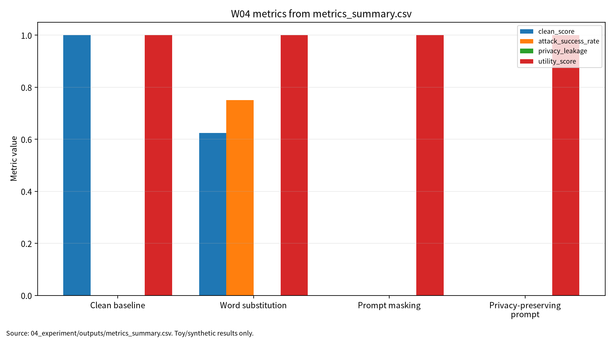

# W04 제출용 보고서

## 0. 메타정보

| 항목 | 내용 |
|---|---|
| 주차 | W04 |
| 주제 | Transformer 변형 & NLP 대적공격·프라이버시 |
| 상태 | 제출용 보고서, 작성자 확인 필요 |
| 보완일 | 2026-06-22 |
| 실험 산출물 | `04_experiment/outputs/metrics_summary.csv`, `results.json`, `run_log.md` |

| 문서 상태 | 제출용 보고서 |
| 학번 | 26200122 |
## 1. 한 문장 요약

W04는 Transformer 효율화, NLP 대적공격, prompt privacy를 연결하여 clean score, attack success rate, privacy leakage, utility score, reproducibility evidence를 분리 보고하는 평가 구조를 제시한다.

## 2. 학습 배경과 주차 목표

W04는 W03의 비전 Transformer와 robust evaluation을 NLP Transformer와 프롬프트 기반 보안 문제로 확장하는 주차이다. W04는 self-attention 구조, 긴 입력 처리 비용, 단어 치환 기반 NLP 대적공격, 프롬프트 프라이버시, ICL leakage를 연결하며, 이후 W07 LLM 보안, W08 RAG 프롬프트 인젝션, W11 차등프라이버시, W14 MLOps 로그 거버넌스와 이어진다.

- Attention 복잡도 병목의 수학적 해소기법을 비교한다.
- NLP 강건성의 공격면과 방어면을 매핑한다.
- 프롬프트 입력의 민감정보 보호기법 평가항목을 정의한다.

## 3. AI 원리 70% 정리

Efficient Transformer 연구는 self-attention의 계산 복잡도와 긴 시퀀스 처리 비용을 줄이는 여러 구조적 접근을 분류한다[1]. Faster and lighter Transformer 연구는 속도, 메모리, latency, 경량화 관점에서 실용적 효율화 전략을 정리한다[2]. Transformer survey는 Transformer 계열 구조와 응용을 taxonomy 관점에서 정리한다[3].

**표 1. W04 핵심 개념과 보안 연결**

| 핵심 개념 | AI 원리 | 보안 연결 |
|---|---|---|
| Self-attention | 토큰 간 관계를 Q/K/V로 계산한다. | 긴 프롬프트와 로그 처리 비용이 커진다. |
| Efficient Transformer | sparse, low-rank, kernelized attention을 활용한다. | 보안 필터 latency와 감사 비용에 영향을 준다. |
| Faster/lighter Transformer | distillation, pruning, quantization을 활용한다. | 방어 기능의 배포 가능성을 높인다. |
| Transformer taxonomy | 구조와 응용을 분류한다. | 입력·출력·로그별 공격면을 분리한다. |

## 4. 보안 이슈 30% 정리

NLP 대적공격 연구는 의미를 크게 유지하면서 모델 판단을 바꾸는 단어 치환, 문장 재구성, transfer attack을 다룬다[4]. Prompt privacy 연구는 프롬프트 입력과 ICL 예시에서 민감정보가 노출될 수 있음을 지적한다[5].

보호 자산은 prompt input, ICL examples, model output, logs, tool-call arguments, user intent이다. 제외 범위는 실제 서비스 침해, 실제 개인정보 사용, 무단 API 질의, 악용 가능한 공격 절차이다.

## 5. 논문 5편 요약

**표 2. 관련 문헌 5편 요약**

| ID | 논문 | 핵심 역할 | 검증 상태 |
|---|---|---|---|
| P01 | Efficient Transformers: A Survey | 긴 입력 attention 비용과 X-former 분류 | ACM DOI `10.1145/3530811` 확인 |
| P02 | A Practical Survey on Faster and Lighter Transformers | speed, memory, latency, 경량화 전략 | ACM DOI `10.1145/3586074` 확인 |
| P03 | A survey of transformers | Transformer 구조와 응용 taxonomy | DOI `10.1016/j.aiopen.2022.10.001` 확인 |
| P04 | A Survey of Adversarial Defenses and Robustness in NLP | NLP adversarial robustness와 ASR | ACM DOI `10.1145/3593042` 확인, 강의자료 표기 확인 필요 |
| P05 | Privacy Preserving Prompt Engineering: A Survey | prompt privacy와 ICL leakage | ACM DOI `10.1145/3729219` 확인 |

## 6. 논문 5편 비교표

| 논문 | 연구문제 | 핵심 방법 | 보안 위협 연결 | 평가 지표 | 내 논문 활용 |
|---|---|---|---|---|---|
| P01 | 긴 시퀀스 attention 병목 완화 | sparse/low-rank/kernelized attention | 긴 프롬프트·로그 노출면 | complexity, memory, latency | 긴 입력 보안 평가 비용 |
| P02 | 더 빠르고 가벼운 Transformer | distillation/pruning/quantization | 보안 필터 배포 가능성 | speedup, latency, parameter count | 방어 비용과 utility |
| P03 | Transformer taxonomy | 구조·pre-training·응용 survey | 공격면 분해 | task performance, complexity | 이론 배경 |
| P04 | NLP 공격·방어 분류 | adversarial robustness survey | word substitution, paraphrase | ASR, robust accuracy | 위협모형 |
| P05 | 프롬프트 민감정보 보호 | masking, rewriting, policy | prompt leakage, ICL leakage | leakage, utility, compliance | prompt privacy |

## 7. Research Track 분석

**표 3. W04 Research Track 요약**

| 요소 | 내용 |
|---|---|
| 연구문제 | 프롬프트 기반 AI 시스템의 민감정보 보호를 어떤 최소 지표로 평가할 것인가 |
| 위협모형 | prompt/log observer, word substitution attacker |
| 평가방법 | synthetic prompt, keyword detector, word substitution, regex masking |
| 재현성 | seed, config, Docker, outputs, run_log 보존 |
| 오픈문제 | 실제 LLM/RAG/agent 환경, 의미 유사도, 복수 seed, 정책 준수 평가 |

## 8. 실습 보고서

본 실습은 실제 Transformer 또는 LLM 공격 재현이 아니라 W04의 핵심인 프롬프트 프라이버시 평가축을 안전하게 설명하기 위한 최소 toy protocol이다. 따라서 synthetic 프라이버시 위험 프롬프트와 keyword privacy-risk detector를 사용하되, 평가 구조는 이후 LLM, RAG, ICL, 에이전트형 도구 호출 환경에도 확장 가능하도록 clean score, attack success rate, privacy leakage, utility score, reproducibility evidence로 분리하였다.

**그림 1. 프롬프트 기반 NLP 보안 평가 흐름**

```text
User Prompt / ICL Examples
        ↓
Transformer / NLP System
        ↓
Clean Evaluation ──> Clean Score
        ↓
Word Substitution / Paraphrase
        ↓
Adversarial Evaluation ──> Attack Success Rate
        ↓
Masking / Privacy-Preserving Prompt Wrapper
        ↓
Privacy Evaluation ──> Privacy Leakage, Utility Score
        ↓
Reproducibility Evidence ──> seed, config, Docker, outputs, run_log
```

**표 4. W04 실습 설계**

| 항목 | 내용 |
|---|---|
| Dataset | Synthetic privacy-risk prompts |
| Model/checker | Keyword privacy-risk detector |
| Baseline | Clean baseline |
| Attack scenario | Word substitution |
| Defense/check | Regex masking and privacy-preserving prompt wrapper |
| Metrics | Clean score, attack success rate, privacy leakage, utility score |

**표 5. W04 실습 결과**

| 조건 | Clean Score | Attack Success Rate | Privacy Leakage | Utility Score | 해석 |
|---|---:|---:|---:|---:|---|
| Clean baseline | 1.000000 | 해당 없음 | 해당 없음 | 1.000000 | 정상 입력에서 keyword detector가 synthetic 라벨을 모두 맞춤 |
| Word substitution | 0.625000 | 0.750000 | 해당 없음 | 1.000000 | 민감 키워드 우회로 일부 privacy-risk 입력이 benign으로 오분류 |
| Prompt masking | 해당 없음 | 해당 없음 | 0.000000 | 1.000000 | 정규식 마스킹 후 synthetic 민감값 노출 없음 |
| Privacy-preserving prompt | 해당 없음 | 해당 없음 | 0.000000 | 1.000000 | 마스킹과 정책 지시를 결합해 입력 의도만 유지 |

이 결과는 synthetic toy 실험의 평가 형식 검증용 수치이며, 실제 Transformer, LLM, 상용 NLP 시스템의 강건성 또는 프라이버시 보호 성능으로 일반화하지 않는다. Word substitution 결과는 실제 NLP adversarial robustness 수치가 아니며, Prompt masking leakage 0.000000은 synthetic regex check 결과일 뿐 실제 개인정보보호 보증이 아니다.

<!-- submission-metric-chart:start -->
**그림 7. W04 metrics summary chart**



출처: `04_experiment/outputs/metrics_summary.csv`. 이 그래프는 공개 toy/synthetic 산출물 기반이며 실제 공격 성능이나 운영 환경 성능으로 일반화하지 않는다.
<!-- submission-metric-chart:end -->

## 9. AI 도구 활용 기록

AI 도구는 문헌 요약, 코드 점검, 문장 구조화, 그래프 생성 보조에 사용하였다. 모든 DOI/URL, 실험 수치, 본문 인용, 결론은 작성자가 outputs 파일과 로컬 참고문헌 검증표를 대조하여 검증한다.

**표. W04 AI 도구 활용 및 검증 기록**

| 항목 | 내용 |
|---|---|
| 사용 도구명 | Codex, ChatGPT 계열 도구 |
| 사용 일자 | 2026-06-23 |
| 사용 목적 | 문헌 요약 정리, 보고서 구조화, 안전한 toy/synthetic 실험 결과 표기 점검, 그래프 생성 보조, 제출 전 체크리스트 정리 |
| 주요 프롬프트 요약 | 주차별 제출 보고서 보완, 참고문헌 검증표 정리, metrics_summary.csv 기반 그래프 생성, AI 활용 고지 작성 |
| AI 산출물 반영 위치 | `07_week_submission/w04_submission_report.md`, `07_week_submission/assets/w04_metric_chart.png`, `05_ai_worklog/ai_disclosure_draft.md` |
| 본인 수정 내용 | 주차별 문헌 상태 확인, 실험 수치와 outputs 대조, 안전 범위와 한계 문장 확인, 최종 제출 전 미확정 문헌 분리 |
| 사실관계 검증 방법 | `01_papers/paper_list.md`, `01_papers/doi_check.md`, `05_references/doi_index.md`, 강의계획서 문헌표 대조 |
| 참고문헌 검증 방법 | 제목, 저자, 연도, 학술지/학회, DOI/URL, 본문 인용번호와 참고문헌 목록 대응 확인 |
| 실험결과 검증 방법 | `04_experiment/outputs/metrics_summary.csv`, `results.json`, `run_log.md`의 수치와 보고서 표기 대조 |
| 최종 책임 확인 | AI 산출물은 초안 보조이며 최종 제출자는 원고 내용, 인용, 실험결과, 연구윤리 책임을 확인한다. |

## 10. 토론 질문

1. Efficient Transformer의 비용 절감은 보안 필터를 실제 운영 경로에 넣는 데 어떤 의미가 있는가?
2. Word substitution ASR을 해석할 때 semantic similarity와 utility를 함께 보아야 하는 이유는 무엇인가?
3. Prompt masking leakage 0.000000을 실제 프라이버시 보증으로 오해하지 않으려면 어떤 검증이 필요한가?

## 11. 기말논문 연결

추천 주제는 “프롬프트 기반 AI 시스템의 민감정보 보호 평가체계 연구”이다. W04는 관련연구, 위협모형, synthetic prompt toy protocol, clean/ASR/leakage/utility/reproducibility 평가축을 제공한다.

## 12. KCI 논문 형식 전환

**표 6. KCI 논문 제목 후보**

| 번호 | 국문 제목 후보 | 영문 제목 후보 | 대상 시스템 | 보안 위협 | 연구방법 | 예상 기여 |
|---:|---|---|---|---|---|---|
| 1 | 프롬프트 기반 AI 시스템의 민감정보 보호 평가체계 연구 | A Study on an Evaluation Framework for Sensitive Information Protection in Prompt-Based AI Systems | LLM 프롬프트 시스템 | Prompt privacy, ICL leakage | 문헌분석 + synthetic prompt 실험 | 민감정보 보호 평가표 |
| 2 | NLP 대적공격과 프롬프트 프라이버시 평가를 위한 다중지표 프레임워크 연구 | A Multi-Metric Framework for Evaluating NLP Adversarial Attacks and Prompt Privacy | Transformer 기반 NLP 시스템 | Word substitution, prompt leakage | toy 실험 + 위협모형 | clean/ASR/leakage/utility 분리 |
| 3 | Efficient Transformer 환경에서 프롬프트 민감정보 보호와 유용성의 상충관계 연구 | A Study on the Trade-off Between Prompt Privacy Protection and Utility in Efficient Transformer Settings | 긴 입력 NLP/LLM 시스템 | 긴 프롬프트 민감정보 노출 | 문헌분석 + 체크리스트 | 비용·보안·유용성 평가 |

추천 제목은 “프롬프트 기반 AI 시스템의 민감정보 보호 평가체계 연구”이다. 연구문제는 프롬프트 기반 AI 시스템에서 민감정보 보호를 평가하기 위한 최소 지표, 단어 치환 공격의 clean score와 ASR 영향, prompt masking과 prompt wrapper의 leakage/utility 영향으로 구성한다. 국내 참고문헌 3편 이상은 추가 확인이 필요하다.

## 13. SCI 논문 형식 전환

### 13.1 SCI 제목 후보

A Multi-Metric Evaluation Framework for Prompt Privacy in Transformer-Based NLP Systems: Integrating Clean Score, Attack Success Rate, Privacy Leakage, Utility, and Reproducibility Evidence

### 13.2 Structured Abstract

Background: Transformer-based NLP and prompt-based AI systems increasingly process long and sensitive user inputs, but their security and privacy cannot be evaluated solely through task performance.

Problem: Existing evaluations often separate model efficiency, adversarial robustness, prompt privacy, utility preservation, and reproducibility.

Method: This study synthesizes five representative studies and uses a safe synthetic toy experiment to illustrate separate reporting of clean score, ASR, privacy leakage, utility score, and reproducibility evidence.

Results: The W04 toy experiment records Clean Score 1.000000, Word substitution ASR 0.750000, and synthetic leakage 0.000000 after masking and prompt wrapping. These results are structured reporting examples, not real-world LLM robustness claims.

Contribution: The main contribution is a multi-metric evaluation structure for prompt-based NLP security evaluation.

### 13.3 Related Work 축

**표 7. SCI Related Work 축**

| 연구축 | 대표 논문 | 역할 |
|---|---|---|
| Efficient Transformers | Tay et al. | attention 복잡도 완화와 X-former 분류 |
| Faster and lighter Transformers | Fournier et al. | 속도·메모리·경량화 전략 |
| Transformer taxonomy | Lin et al. | Transformer 구조와 응용 전체 지도 |
| NLP adversarial robustness | Goyal et al. | 단어 치환·문장 재구성·semantic-preserving attack |
| Prompt privacy | Edemacu et al. | prompt privacy, ICL leakage, masking/policy control |

### 13.4 Limitations

Keyword detector는 실제 Transformer나 LLM의 판단 구조를 대표하지 않는다. Synthetic prompts는 실제 사용자 프롬프트, RAG 문서, tool-call 로그를 대표하지 않는다. Privacy leakage는 regex 기반 synthetic check이며 실제 memorization/privacy attack을 의미하지 않는다. ACM Article 번호와 P04 강의자료 표기 차이는 사람 검토가 필요하다.

## 14. 발표용 요약

- 핵심 메시지: clean score 하나로 프롬프트 기반 NLP 보안을 설명할 수 없다.
- 문헌 구조: P01-P03은 Transformer 구조·효율화·taxonomy, P04는 NLP robustness, P05는 prompt privacy이다.
- 실습 수치: Clean 1.000000, Word substitution ASR 0.750000, Prompt masking leakage 0.000000.
- 주의: 수치는 outputs 기준이며 실제 LLM 보안 성능으로 일반화하지 않는다.

## 15. 참고문헌 검증표

| 번호 | 참고문헌 | DOI/URL | 검증 상태 |
|---:|---|---|---|
| [1] | Tay et al., Efficient Transformers: A Survey. ACM Computing Surveys, 55(6), 2022, 1-28. | `10.1145/3530811`; arXiv `10.48550/arXiv.2009.06732` | 출판 DOI 확인, Article 번호 확인 필요 |
| [2] | Fournier et al., A Practical Survey on Faster and Lighter Transformers. ACM Computing Surveys, 55(14s), 2023, 1-40. | `10.1145/3586074` | 출판 DOI 확인, Article 번호 확인 필요 |
| [3] | Lin et al., A survey of transformers. AI Open, 3, 2022, 111-132. | `10.1016/j.aiopen.2022.10.001` | 출판 DOI 확인 |
| [4] | Goyal et al., A Survey of Adversarial Defenses and Robustness in NLP. ACM Computing Surveys, 55(14s), 2023, 1-39. | `10.1145/3593042`; arXiv `10.48550/arXiv.2203.06414` | 출판 DOI 확인, 강의자료 표기 확인 필요 |
| [5] | Edemacu and Wu, Privacy Preserving Prompt Engineering: A Survey. ACM Computing Surveys, 57(10), 2025, 1-36. | `10.1145/3729219`; arXiv `10.48550/arXiv.2404.06001` | 출판 DOI 확인, Article 번호 확인 필요 |

## 16. 자기 점검표

| 점검 항목 | 상태 | 비고 |
|---|---|---|
| 1장 한 문장 요약 작성 | 완료 |  |
| 2장 학습 배경과 주차 목표 작성 | 완료 |  |
| AI 원리 70% 정리 | 완료 |  |
| 보안 이슈 30% 정리 | 완료 |  |
| 논문 5편 요약 | 완료 |  |
| 논문 5편 비교표 보완 | 완료 | P01-P05 차별성 반영 |
| Research Track 5요소 작성 | 완료 | 연구문제, 위협모형, 평가방법, 재현성, 오픈문제 |
| P01 출판 DOI 검증 | 완료 | Article 번호 확인 필요 |
| P02 출판 DOI 검증 | 완료 | Article 번호 확인 필요 |
| P03 출판 DOI 검증 | 완료 |  |
| P04 출판 DOI 검증 | 완료 | `N. Goyal` 표기 확인 필요 |
| P05 출판 DOI 검증 | 완료 | Article 번호 확인 필요 |
| 실험 outputs 파일 존재 확인 | 완료 | CSV/JSON/run_log 존재 |
| 실험 결과와 보고서 수치 일치 | 완료 | outputs 기준 |
| KCI 논문 형식 전환 작성 | 완료 |  |
| SCI 논문 형식 전환 작성 | 완료 |  |
| 본문 인용과 참고문헌 대응 | 완료 | [1]-[5] 대응 |
| 표·그림 번호 정리 | 완료 | 표 1-7, 그림 1 |
| AI 활용 고지 작성 | 완료 |  |
| PDF 저작권 위험 점검 | 완료 | PDF 원문 Git 추적 해제 완료(로컬 파일 보존) |
| 최종 사람이 검토할 항목 표시 | 완료 | 제출 전 작성자 확인 항목 있음 |
