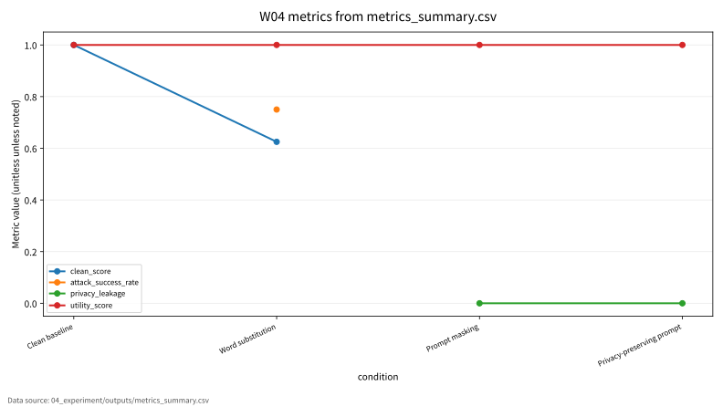

# W04 Transformer/NLP 보안

Research Question: Transformer/NLP 보안에서 성능 지표와 보안 지표를 어떻게 분리해 평가할 수 있는가?

---

## Core Formula

### Scaled Dot-Product Attention

$$
Attention(Q,K,V)=softmax\left(\frac{QK^\top}{\sqrt{d_k}}\right)V
$$

| 기호 | 의미 |
|---|---|
| `Q,K,V` | query, key, value 행렬 |
| `d_k` | key 벡터 차원 |
| `softmax` | 토큰 간 가중치 정규화 |
| `V` | 가중합 대상 값 표현 |

- 직관적 의미: Attention은 각 토큰이 다른 토큰을 얼마나 참고할지 계산한다. 보안 평가에서는 이 의존성이 prompt, context, leakage 위험과 연결된다.
- 보안적 의미: 입력 문맥이 길거나 오염되면 정보 흐름과 취약 응답이 달라질 수 있다.
- 평가 지표 연결: clean_score, attack_success_rate, privacy_leakage, utility_score와 연결한다.
- 한계: 표준 Transformer 수식이며 특정 논문 실험 수치를 새로 주장하지 않는다.

---

## Threat Model

- Diagram: Transformer security evaluation flow
- Stages: Tokens, Attention, Context, Security Probe, Metrics
- 안전 범위: public, synthetic, toy, local evaluation

---

## Evaluation Protocol

- Metrics: clean_score, attack_success_rate, privacy_leakage, utility_score
- 데이터 출처: `04_experiment/outputs/metrics_summary.csv`

| condition | clean_score | attack_success_rate | privacy_leakage | utility_score | notes |
| --- | --- | --- | --- | --- | --- |
| Clean baseline | 1 |  |  | 1 | 정상 입력에서 keyword detector가 synthetic 라벨을 모두 맞춤 |
| Word substitution | 0.625 | 0.75 |  | 1 | 민감 키워드 우회로 일부 privacy-risk 입력이 benign으로 오분류 |
| Prompt masking |  |  | 0 | 1 | 정규식 마스킹 후 synthetic 민감값 노출 없음 |
| Privacy-preserving prompt |  |  | 0 | 1 | 마스킹과 정책 지시를 결합해 입력 의도만 유지 |

---

## Figure-first Result

그래프는 clean_score, attack_success_rate, privacy_leakage, utility_score를 조건별로 비교한다. Transformer 평가에서는 유틸리티와 보안 위험이 동시에 움직일 수 있으므로 단일 점수로 결론을 내리지 않는다. 수치는 `metrics_summary.csv`에서만 가져왔다.

---

## Paper Map

| ID | 논문 역할 | 발표에서 쓰는 위치 | 기말논문 연결 |
|---|---|---|---|
| P01 | 핵심 이론 | Background / Core Formula | Transformer/NLP 보안의 관련연구 뼈대 |
| P02 | 위협 분류 | Threat Model | 공격자·방어자·보호자산 정의 |
| P03 | 평가 지표 | Evaluation Protocol | 정량 지표와 로그 근거 연결 |
| P04 | 공격·방어 사례 | Security Implication | 보안적 함의와 방어 한계 |
| P05 | 재현성·정책 근거 | Limitation | 확인 필요 항목과 제출 전 검증 |

---

## Limitation

- efficient attention 복잡도는 구조별로 달라 표준 비교식으로만 제시한다.
- 원문 DOI/URL과 formal guarantee는 최종 제출 전 확인 필요.
- 실제 운영 시스템 악용 절차나 무단 API 질의 절차는 포함하지 않음.

---

## Final Takeaway

W04의 핵심은 `clean_score, attack_success_rate, privacy_leakage, utility_score`를 성능·보안·재현성 근거로 분리해 기말논문의 평가방법에 연결하는 것이다.
