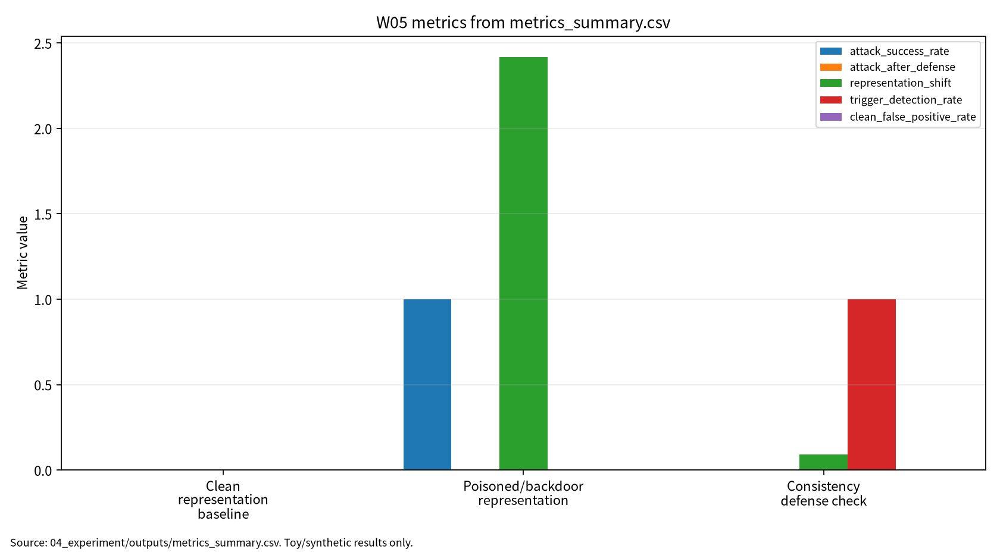

# W05 제출용 단일 보고서

## 자기지도학습·파운데이션 모델 & Poisoning/Backdoor

## 0. 메타정보

| 항목 | 내용 |
|---|---|
| 주차 | W05 |
| 보고서 제목 | 자기지도학습·파운데이션 모델 & Poisoning/Backdoor |
| 과목 범위 | AI 보안 |
| 작성자 | 박영세 |
| 학번 | 26200122 |
| 작성일 | 2026-06-26 |
| 문서 상태 | 주차별 단일 제출용 보고서 |
| 원본 관리 파일 | `03_weekly_reports/w05_ssl_backdoor/07_week_submission/w05_submission_report.md` |
| Word/PDF 제출본 권장 위치 | `03_weekly_reports/w05_ssl_backdoor/07_week_submission/exports/` |
| 관련 산출물 위치 | `03_weekly_reports/w05_ssl_backdoor/` |
| 안전 범위 | 실제 개인정보, 실제 서비스 공격, 악용 가능한 backdoor 제작 절차 제외 |
| PDF 검토 상태 | P01~P05 로컬 PDF blob 존재 확인. 제출 본문은 DOI/URL, `paper_list.md`, 논문별 summary, 실험 보고서 기준으로 작성 |
| 제출 전 주의 | P02는 강의계획서 지정 일반 SSL survey와 동일 여부 확인 필요. P04는 강의계획서 제목·저자 표기와 정식 논문 동일성 확인 필요 |

---

## 초록

본 보고서는 W05 주차의 자기지도학습, 파운데이션 모델 사전학습, poisoning/backdoor 위협을 하나의 제출용 보고서로 통합한다. 자기지도학습은 라벨 없이 contrastive, masked, predictive objective를 통해 표현공간을 학습하며, 이러한 표현은 downstream task로 전이된다. 그러나 pretraining corpus, augmentation rule, positive/negative pair, temporal sampling, checkpoint, downstream classifier는 모두 보안 자산이자 공격면이 될 수 있다. 본 보고서는 W05 논문 5편을 바탕으로 일반 SSL, recommendation SSL, video SSL, poisoning taxonomy, DNN-to-LLM backdoor taxonomy를 연결하고, synthetic 2D representation cluster와 nearest-centroid classifier를 사용한 안전한 toy protocol로 clean accuracy, poisoned clean accuracy, ASR, ASR after defense, mean representation shift, detection rate, clean FPR, reproducibility evidence를 분리 기록하였다. 실험 결과는 실제 SSL encoder, foundation model, 상용 시스템의 보안 성능이 아니라 평가 구조를 설명하기 위한 안전한 예시로 한정한다.

**키워드:** self-supervised learning, representation learning, foundation model, poisoning, backdoor, representation shift, ASR, detection rate, clean FPR, 재현성

---

## 1. 한 문장 요약

W05는 라벨 없는 pretraining 환경에서도 데이터 수집, augmentation, pair 구성, representation space가 공격면이 될 수 있음을 정리하고, clean accuracy와 ASR, representation shift, detection rate를 분리해 보고하는 평가 구조를 제시한다.

---

## 2. 학습 배경과 주차 목표

### 2.1 이번 주 주제의 위치

W05는 W01의 ML 생명주기 보안 평가, W02의 데이터 오염, W03의 표현공간과 입력 교란, W04의 Transformer/NLP 보안 논의를 자기지도학습과 파운데이션 모델의 pretraining 단계로 확장하는 주차다. W05의 핵심은 라벨이 없는 사전학습 환경에서도 데이터 수집, augmentation, positive/negative pair 구성, pretraining corpus, representation space가 보안 자산이 된다는 점이다. 이후 W06 생성모형/딥페이크, W07 LLM 보안, W10 연합학습 poisoning, W13 모델 도난 및 워터마킹과 연결된다.

### 2.2 강의계획서상 학습목표

- Self-supervised learning의 contrastive, masked, predictive 문제정의를 정리한다.
- Recommendation SSL과 video SSL의 도메인별 표현학습 구조를 이해한다.
- Poisoning과 backdoor가 representation space에 미치는 영향을 평가축으로 정리한다.
- Clean accuracy와 ASR, representation shift, detection rate, clean FPR을 분리해 보고한다.
- Safe toy 실험으로 SSL/foundation pretraining pipeline의 보안 평가 형식을 설명한다.

### 2.3 이번 주 핵심 질문

1. 자기지도학습은 라벨 없이 어떤 supervision signal을 만드는가?
2. Pretraining corpus와 augmentation 과정은 어떤 공격면을 만드는가?
3. Poisoning/backdoor는 downstream classifier보다 representation space를 어떻게 먼저 왜곡할 수 있는가?
4. Clean accuracy가 유지되더라도 ASR과 representation shift가 크면 왜 보안적으로 실패인가?
5. W05의 synthetic representation 실험을 KCI 또는 SCI 논문 주제로 발전시키려면 어떤 연구문제가 적절한가?

---

## 3. 논문 5편의 서술형 종합 요약

### 3.1 P01. A Survey on Self-Supervised Learning: Algorithms, Applications, and Future Trends

P01은 W05의 자기지도학습 기본 문헌이다. Self-supervised learning은 명시적 라벨 없이 데이터 내부 구조를 이용해 supervision signal을 만든다. 대표 방식은 같은 샘플의 다른 view를 가깝게 만드는 contrastive learning, 입력 일부를 가리고 복원하는 masked/generative learning, 시계열·문맥·미래 상태를 예측하는 predictive learning이다.

보안 관점에서 P01은 pretraining corpus, augmentation policy, positive/negative pair, mask policy가 모두 공격면이 될 수 있음을 설명하는 기반이 된다. 라벨이 없더라도 표현공간은 데이터 구조를 반영하므로, 오염 데이터나 trigger pattern이 사전학습 단계에 들어가면 downstream task에서 hidden behavior로 나타날 수 있다.

### 3.2 P02. A Comprehensive Survey on Self-Supervised Learning for Recommendation

P02는 추천 시스템 분야의 self-supervised learning을 다루는 관련 보조 문헌이다. 추천 SSL은 user-item interaction, behavior sequence, graph edge, item metadata, content feature를 self-supervised signal로 활용한다. Masked item prediction, graph contrastive learning, sequence augmentation, user-item view alignment 등이 대표적이다.

보안 관점에서 추천 SSL은 fake interaction, graph poisoning, item metadata poisoning, exposure bias, user privacy risk와 연결된다. 다만 현재 로컬 PDF는 recommendation SSL에 특화되어 있어 강의계획서 지정 일반 SSL survey와 동일한지 최종 확인이 필요하다. 제출 보고서에서는 이 문헌을 일반 SSL 대체 문헌이 아니라 recommendation/retrieval SSL 보조 근거로 사용한다.

### 3.3 P03. Self-Supervised Learning for Videos: A Survey

P03은 비디오 자기지도학습을 정리한다. 비디오 SSL은 단일 이미지와 달리 frame order, temporal consistency, motion, clip sampling, audio-text-video alignment를 활용한다. Temporal contrastive learning, future prediction, speed/order prediction, masked video modeling, cross-modal consistency가 핵심이다.

보안 관점에서 video SSL은 temporal trigger, frame-level poisoning, sampling manipulation, modality mismatch라는 새로운 공격면을 만든다. 특정 frame이나 temporal pattern이 trigger로 작동하면 downstream action recognition, retrieval, video understanding 결과가 왜곡될 수 있다. 따라서 W05는 W07/W08의 멀티모달 LLM 및 video-RAG 보안과도 연결된다.

### 3.4 P04. Threats to Training: A Survey of Poisoning Attacks and Defenses on Machine Learning Systems

P04는 training-time poisoning과 defense를 정리하는 보안 문헌이다. Poisoning은 학습 데이터, 라벨, feature, model update, checkpoint를 조작해 모델의 성능 또는 특정 조건의 행동을 왜곡하는 공격이다. Availability attack, targeted poisoning, clean-label poisoning, backdoor poisoning, model poisoning처럼 공격 목표와 공격면이 다양하다.

보안 관점에서 P04는 W05의 pretraining pipeline 위협모형에 직접 연결된다. SSL 환경에서는 라벨이 없더라도 corpus, augmentation, pair construction, checkpoint가 오염될 수 있으므로, poisoning은 supervised learning에만 국한되지 않는다. 단, 강의계획서의 제목·저자 표기와 현재 정식 논문 사이의 동일성은 최종 제출 전 확인해야 한다.

### 3.5 P05. A survey of backdoor attacks and defences: From deep neural networks to large language models

P05는 backdoor attack과 defence를 DNN에서 LLM까지 확장해 정리한다. Backdoor는 정상 입력에서는 모델이 정상적으로 보이지만, trigger 조건에서는 공격자 목표 행동을 하도록 만드는 hidden behavior다. Clean accuracy가 높더라도 trigger 조건의 ASR이 높으면 보안적으로 실패한 모델이다.

W05에서 P05는 representation-level backdoor 평가의 핵심 근거다. SSL encoder나 foundation model은 downstream classifier가 정상이어도 내부 representation에 trigger-sensitive pattern을 가질 수 있다. 따라서 clean accuracy, ASR, ASR after defense, representation shift, detection rate, clean FPR을 분리해 기록해야 한다.

---

## 4. 논문 간 연결 관계

W05 논문 5편은 다음 흐름으로 연결된다.

```text
일반 SSL 알고리즘과 표현학습
→ 추천/검색 도메인의 SSL 확장
→ 비디오/시간축 SSL 확장
→ training-time poisoning taxonomy
→ DNN-to-LLM backdoor hidden behavior 평가
```

P01은 일반 SSL 원리, P02는 recommendation/retrieval SSL, P03은 video SSL, P04는 poisoning taxonomy, P05는 backdoor taxonomy를 제공한다. 이 다섯 문헌을 종합하면 W05의 핵심 메시지는 “표현공간은 성능 향상의 도구일 뿐 아니라 보호해야 할 보안 자산”이라는 것이다.

---

## 5. AI 원리 70% 정리

자기지도학습은 데이터 자체에서 pretext task를 구성해 representation을 학습한다. Contrastive learning은 같은 의미를 가진 view를 가깝게, 다른 view를 멀게 배치하고, masked/generative learning은 가려진 token이나 patch를 복원한다. Video SSL은 temporal order와 motion을 활용하며, recommendation SSL은 user-item interaction과 graph structure를 활용한다. 이러한 표현은 downstream task로 전이되므로 pretraining 단계의 데이터와 objective가 전체 시스템 보안성에 영향을 준다.

### 5.1 핵심 수식

Contrastive SSL의 대표 손실은 anchor와 positive view의 유사도를 높이고 negative view와의 유사도를 낮추는 구조다.

$$
L_{nce}=-\log\frac{\exp(\mathrm{sim}(z,z^+)/\tau)}{\exp(\mathrm{sim}(z,z^+)/\tau)+\sum_{j=1}^{K}\exp(\mathrm{sim}(z,z_j^-)/\tau)}
$$

| 기호 | 의미 |
|---|---|
| $z$ | anchor representation |
| $z^+$ | positive representation |
| $z_j^-$ | negative representation |
| $\mathrm{sim}$ | similarity function |
| $\tau$ | temperature |

Masked reconstruction은 mask된 위치의 원래 representation 또는 token을 복원한다.

$$
L_{mask}=\sum_{i\in M}\ell(\hat{r}_i,r_i)
$$

| 기호 | 의미 |
|---|---|
| $M$ | mask 위치 집합 |
| $r_i$ | 원래 representation 또는 token |
| $\hat{r}_i$ | 복원된 representation 또는 token |

Representation shift는 clean encoder와 test/poisoned encoder 또는 clean/trigger condition의 표현 차이를 측정한다.

$$
RepShift=\frac{1}{N}\sum_{i=1}^{N}\left\|h_{clean}(x_i)-h_{test}(x_i)\right\|_2
$$

Backdoor ASR은 trigger 조건에서 목표 행동이 발생하는 비율이다.

$$
ASR=\frac{N_{atk}}{N_{trig}}
$$

Consistency defense의 detection rate와 clean FPR은 함께 보고해야 한다.

$$
DetectionRate=\frac{TP_b}{TP_b+FN_b}
$$

$$
CleanFPR=\frac{FP_c}{FP_c+TN_c}
$$

| 기호 | 의미 |
|---|---|
| $N_{trig}$ | trigger가 포함된 평가 입력 수 |
| $N_{atk}$ | 공격 목표 행동이 발생한 입력 수 |
| $TP_b$ | backdoor/trigger case를 탐지한 수 |
| $FN_b$ | backdoor/trigger case를 놓친 수 |
| $FP_c$ | clean case를 backdoor로 오탐한 수 |
| $TN_c$ | clean case를 clean으로 판단한 수 |

### 5.2 핵심 개념과 보안 연결

| 개념 | AI 원리 | 보안 연결 |
|---|---|---|
| Contrastive learning | positive/negative pair로 표현공간 구조 형성 | pair 오염, augmentation poisoning |
| Masked/generative learning | 입력 일부를 복원하거나 문맥 예측 | corpus contamination, memorization risk |
| Representation learning | downstream task에 전이 가능한 embedding 생성 | representation shift, hidden behavior |
| Foundation pretraining | 대규모 corpus에서 범용 표현 학습 | data governance, checkpoint lineage |
| Video SSL | temporal consistency와 cross-modal signal 활용 | temporal trigger, frame poisoning |
| Backdoor | trigger 조건에서 target behavior 유도 | clean accuracy와 ASR 분리 필요 |

---

## 6. 보안 이슈 30% 정리

Poisoning 공격은 학습 데이터 조작을 통해 모델의 최적화 경로와 최종 판단을 왜곡한다. Backdoor 공격은 clean accuracy가 유지되더라도 trigger 조건에서 ASR이 높아질 수 있으므로 별도 평가가 필요하다. SSL과 foundation model에서는 라벨 데이터뿐 아니라 pretraining corpus, augmentation rule, pair construction, representation space, checkpoint가 모두 보호 자산이다.

| 보안 속성 | W05에서의 의미 | 대표 위협 | 평가 지표 |
|---|---|---|---|
| Integrity | representation space와 downstream behavior 왜곡 | poisoning, backdoor, trigger injection | ASR, RepShift |
| Confidentiality | pretraining corpus와 user behavior data의 민감정보 노출 | memorization, privacy leakage | leakage test, nearest-neighbor risk |
| Availability | 오염 표현으로 downstream 성능 저하 | availability poisoning | clean accuracy drop |
| Safety | trigger 조건에서 위험한 hidden behavior | backdoor, temporal trigger | ASR after defense |
| Accountability | data lineage, augmentation log, checkpoint hash 기록 필요 | 재현성 실패, provenance gap | reproducibility evidence |

---

## 7. Research Track 분석

### 7.1 연구문제

- RQ1. SSL/foundation pretraining 표현공간에서 poisoning/backdoor 평가를 위한 최소 지표는 무엇인가?
- RQ2. Clean accuracy가 유지될 때도 ASR과 representation shift가 높으면 어떻게 해석해야 하는가?
- RQ3. Consistency defense는 ASR을 낮추면서 clean FPR을 얼마나 낮게 유지할 수 있는가?
- RQ4. P02/P04처럼 강의계획서 표기와 로컬 정식 논문이 다를 때 관련 보조 문헌으로 어떻게 표시해야 하는가?

### 7.2 위협모형

| 항목 | 내용 |
|---|---|
| 보호 자산 | pretraining corpus, augmentation rule, positive/negative pairs, representation space, encoder checkpoint, downstream classifier, run log |
| 공격자 목표 | representation shift, downstream 성능 저하, trigger 조건 target behavior, 특정 user/item/video pattern 왜곡 |
| 공격자 지식 | corpus 일부 접근, augmentation rule 추정, checkpoint 사용 가능성, downstream task 일부 지식 |
| 공격자 능력 | poisoned sample 삽입, trigger vector 삽입, pair construction 조작, temporal sampling 조작, checkpoint 공급 |
| 공격 경로 | pretraining data/augmentation → SSL objective → representation space → downstream classifier → clean/trigger output |
| 방어자 능력 | data lineage, augmentation audit, representation monitoring, trigger test, consistency defense, checkpoint verification |
| 제외 범위 | 실제 서비스 공격, 개인정보 포함 데이터 사용, 악용 가능한 backdoor 제작 절차, 무단 모델 공격 |

### 7.3 평가축

| 평가축 | 질문 | 대표 지표 또는 증거 |
|---|---|---|
| Clean representation quality | 정상 표현공간에서 downstream 성능이 유지되는가 | clean accuracy |
| Poisoned clean utility | 오염 학습 후 정상 입력 성능이 유지되는가 | poisoned clean accuracy |
| Backdoor behavior | trigger 조건에서 target behavior가 발생하는가 | ASR |
| Defense effect | consistency defense 후 ASR이 감소하는가 | ASR after defense |
| Representation shift | trigger/poison 조건에서 embedding이 얼마나 이동하는가 | mean shift |
| Detection quality | trigger case를 잡고 clean case를 오탐하지 않는가 | detection rate, clean FPR |
| Reproducibility evidence | 동일 결과를 다시 만들 수 있는가 | seed, config, Docker, outputs, run log |

### 7.4 재현성

재현성을 위해 dataset generation seed, cluster center, trigger vector, poison rate, defense threshold, model configuration, Dockerfile, CSV/JSON/Markdown log를 보존한다. W05 실습은 synthetic 2D representation clusters를 사용하고, 실제 개인정보·실사용자 행동·상용 foundation model을 사용하지 않는다.

---

## 8. 실습 보고서 및 그래프 수치 검증

본 실습은 실제 SSL encoder 또는 파운데이션 모델 backdoor 공격 재현이 아니라 W05의 핵심인 표현공간 오염 평가축을 안전하게 설명하기 위한 최소 toy protocol이다. Synthetic 2D representation cluster와 nearest-centroid representation classifier를 사용해 clean condition, poisoned/backdoor condition, consistency defense condition을 분리한다.

### 8.1 실습 설계

| 항목 | 내용 |
|---|---|
| 데이터 | synthetic 2D representation clusters |
| 모델/검사기 | nearest-centroid representation classifier |
| 보안 시나리오 | trigger vector가 source embedding을 target centroid 방향으로 이동 |
| 방어 점검 | paired-view consistency distance threshold |
| Seed | 42 |
| 결과 위치 | `04_experiment/outputs/` |
| 산출물 | `metrics_summary.csv`, `results.json`, `run_log.md` |

### 8.2 실습 결과 수치

| 조건 | Clean Acc. | Poisoned Clean Acc. | ASR | ASR after defense | Mean Shift | Detection Rate | Clean FPR |
|---|---:|---:|---:|---:|---:|---:|---:|
| Clean representation baseline | 1.000000 | 해당 없음 | 해당 없음 | 해당 없음 | 해당 없음 | 해당 없음 | 해당 없음 |
| Poisoned/backdoor representation | 해당 없음 | 1.000000 | 1.000000 | 해당 없음 | 2.418677 | 해당 없음 | 해당 없음 |
| Consistency defense check | 해당 없음 | 해당 없음 | 해당 없음 | 0.000000 | 0.090597 | 1.000000 | 0.000000 |

Clean accuracy 1.000000은 toy cluster가 정상 조건에서 분리 가능하다는 뜻이다. ASR 1.000000은 source-class test embedding이 trigger vector 적용 후 target centroid 쪽으로 분류된 toy 관찰값이다. Detection rate 1.000000과 clean FPR 0.000000은 paired-view distance threshold 조건에서 trigger shift가 모두 플래그되고 clean consistency noise는 플래그되지 않았다는 뜻이며, 실제 방어 성능 보증이 아니다.

### 8.3 그래프 수치 검증

현재 제출 보고서의 그래프는 `assets/w05_metric_chart.png`를 참조한다. 확인 가능한 SVG 그래프에는 `clean_accuracy`, `attack_success_rate`, `attack_after_defense`, `representation_shift`, `trigger_detection_rate` 다섯 series가 표시되어 있다. Clean FPR은 표에는 포함하지만 현재 그래프 series에는 포함되어 있지 않다. 그래프의 representation_shift는 poisoned/backdoor condition과 defense check condition 두 지점만 연결되어 있다.

| 조건 | 그래프 Clean Acc. | 표 Clean Acc. | 그래프 ASR | 표 ASR | 그래프 ASR after defense | 표 ASR after defense | 그래프 Mean Shift | 표 Mean Shift | 그래프 Detection Rate | 표 Detection Rate | 확인 결과 |
|---|---:|---:|---:|---:|---:|---:|---:|---:|---:|---:|---|
| Clean representation baseline | 1.000000 | 1.000000 | 해당 없음 | 해당 없음 | 해당 없음 | 해당 없음 | 해당 없음 | 해당 없음 | 해당 없음 | 해당 없음 | 일치 |
| Poisoned/backdoor representation | 해당 없음 | 해당 없음 | 1.000000 | 1.000000 | 해당 없음 | 해당 없음 | 2.418677 | 2.418677 | 해당 없음 | 해당 없음 | 일치 |
| Consistency defense check | 해당 없음 | 해당 없음 | 해당 없음 | 해당 없음 | 0.000000 | 0.000000 | 0.090597 | 0.090597 | 1.000000 | 1.000000 | 일치 |

<!-- submission-metric-chart:start -->
**그림 1. W05 metrics summary chart**



출처: `04_experiment/outputs/metrics_summary.csv`. 이 그래프는 공개 toy/synthetic 산출물 기반이며 실제 공격 성능이나 운영 환경 성능으로 일반화하지 않는다. 현재 그래프는 clean_accuracy, attack_success_rate, attack_after_defense, representation_shift, trigger_detection_rate를 시각화한다.
<!-- submission-metric-chart:end -->

---

## 9. 기말논문 연결

W05는 기말논문에서 “표현학습 기반 AI 시스템의 poisoning/backdoor 평가 프레임워크”로 확장할 수 있다. 핵심 기여 후보는 SSL/foundation pretraining 위협모형, representation shift 기반 toy 평가표, clean performance와 ASR의 분리 기록, seed/config/output 기반 재현성 체크리스트다.

| 기말논문 장 | W05 반영 내용 |
|---|---|
| 1장 서론 | SSL/foundation model의 pretraining 단계가 보안 자산이 된다는 문제의식 |
| 2장 관련연구 | SSL taxonomy, recommendation SSL, video SSL, poisoning, backdoor 문헌 정리 |
| 3장 위협모형 | corpus, augmentation, pair construction, representation, checkpoint 공격면 정의 |
| 4장 연구방법 | clean accuracy, ASR, RepShift, detection rate, clean FPR 설계 |
| 5장 분석 | representation toy experiment와 defense check 결과 분석 |
| 6장 결론 | 표현학습 보안은 clean 성능·hidden behavior·재현성 증거를 함께 관리해야 함 |

---

## 10. AI 도구 활용 기록

AI 도구는 문헌 요약, 코드 점검, 문장 구조화, 그래프 생성 보조에 사용하였다. 모든 DOI/URL, 실험 수치, 본문 인용, 결론은 작성자가 outputs 파일과 로컬 참고문헌 검증표를 대조하여 검증한다.

| 항목 | 내용 |
|---|---|
| 사용 도구명 | Codex, ChatGPT 계열 도구 |
| 사용 목적 | 문헌 요약 정리, 보고서 구조화, 안전한 toy/synthetic 실험 결과 표기 점검, 그래프 생성 보조, 제출 전 체크리스트 정리 |
| AI 산출물 반영 위치 | `07_week_submission/w05_submission_report.md`, `07_week_submission/assets/w05_metric_chart.png`, `05_ai_worklog/ai_disclosure_draft.md` |
| 본인 수정 내용 | 주차별 문헌 상태 확인, 실험 수치와 outputs 대조, 안전 범위와 한계 문장 확인, 최종 제출 전 미확정 문헌 분리 |
| 사실관계 검증 방법 | `01_papers/paper_list.md`, `01_papers/doi_check.md`, 강의계획서 문헌표 대조 |
| 실험결과 검증 방법 | `04_experiment/experiment_report.md`, `04_experiment/outputs/metrics_summary.csv`, `results.json`, `run_log.md`의 수치와 보고서 표기 대조 |
| 최종 책임 확인 | AI 산출물은 초안 보조이며 최종 제출자는 원고 내용, 인용, 실험결과, 연구윤리 책임을 확인한다. |

---

## 11. 제출 전 자기 점검표

| 점검 항목 | 상태 | 비고 |
|---|---|---|
| 메타정보 작성 | 완료 | 작성일 2026-06-26 반영 |
| 초록 및 키워드 작성 | 완료 |  |
| AI 원리 70% 정리 | 완료 | 핵심 수식 추가 |
| 보안 이슈 30% 정리 | 완료 |  |
| 논문 5편 서술형 요약 | 완료 |  |
| 논문 간 연결 관계 작성 | 완료 |  |
| Research Track 5요소 작성 | 완료 | 연구문제, 위협모형, 평가방법, 재현성, 한계 |
| P01~P05 PDF blob 확인 | 완료 | GitHub 파일 존재 확인. 원문 PDF 저작권/배포 정책 별도 검토 필요 |
| P01~P05 DOI/URL 검증 | 완료 / 확인 필요 | P02/P04는 강의계획서 지정 문헌과 동일 여부 확인 필요 |
| P02 지정 논문 동일 여부 | 확인 필요 | 현재 로컬 PDF는 추천 SSL survey |
| P04 강의계획서 표기 동일성 | 확인 필요 | 정식 제목·저자와 강의계획서 표기 차이 |
| 실험 outputs 파일 존재 확인 | 완료 | 실험 보고서 기준 CSV/JSON/run_log 존재 |
| 실험 결과와 보고서 수치 일치 | 완료 | 실험 보고서 수치 기준 반영 |
| 그래프 수치 확인 | 완료 | clean_accuracy/ASR/ASR after defense/mean shift/detection rate 기준 표와 일치 |
| AI 활용 고지 작성 | 완료 |  |
| DOCX/PDF 제출본 생성 | 필요 | `07_week_submission/exports/` 권장 |
| 최종 사람이 검토할 항목 표시 | 완료 | P02/P04 동일성, PDF 보관 정책, Word/PDF 렌더링 |

---

## 12. 참고문헌 검증표

| 번호 | 참고문헌 | DOI/URL | 상태 | 비고 |
|---:|---|---|---|---|
| [1] | Jie Gui et al., “A Survey on Self-Supervised Learning: Algorithms, Applications, and Future Trends,” IEEE TPAMI, 2024 | `https://doi.org/10.1109/TPAMI.2024.3415112`; arXiv `https://arxiv.org/abs/2301.05712` | DOI 확인 | 강의계획서의 `Yan Gui` 표기 확인 필요 |
| [2] | Xubin Ren et al., “A Comprehensive Survey on Self-Supervised Learning for Recommendation,” ACM Computing Surveys, 2025 | `https://doi.org/10.1145/3746280` | DOI 확인 | 지정 일반 SSL survey 동일 여부 확인 필요. 관련 보조 문헌으로 사용 |
| [3] | Madeline C. Schiappa, Yogesh S. Rawat, Mubarak Shah, “Self-Supervised Learning for Videos: A Survey,” ACM Computing Surveys, 2023 | `https://doi.org/10.1145/3577925`; arXiv `https://arxiv.org/abs/2207.00419` | DOI 확인 | 강의계획서 제목은 의미상 축약/변형 가능성 |
| [4] | Zhibo Wang et al., “Threats to Training: A Survey of Poisoning Attacks and Defenses on Machine Learning Systems,” ACM Computing Surveys, 2022 | `https://doi.org/10.1145/3538707` | DOI 확인 | 강의계획서 제목 및 `Y. Wang` 표기와 동일 논문 여부 확인 필요 |
| [5] | Ling-Xin Jin et al., “A survey of backdoor attacks and defences: From deep neural networks to large language models,” Journal of Electronic Science and Technology, 2025 | `https://doi.org/10.1016/j.jnlest.2025.100326` | DOI 확인 | 강의계획서 `Z. Jin` 표기 확인 필요 |

---

## 13. 부록 A. KCI 논문 형식 전환 아이디어

### A.1 제목 후보

| 번호 | 국문 제목 후보 | 영문 제목 후보 | 대상 시스템 | 보안 위협 | 연구방법 | 예상 기여 |
|---:|---|---|---|---|---|---|
| 1 | 자기지도학습 기반 AI 시스템의 Poisoning/Backdoor 평가 프레임워크 연구 | A Study on a Poisoning and Backdoor Evaluation Framework for Self-Supervised AI Systems | SSL/foundation model | Poisoning, Backdoor | 문헌분석 + synthetic representation 실험 | representation shift 기반 평가표 |
| 2 | 표현학습 공간에서 Backdoor Trigger가 공격 성공률과 탐지율에 미치는 영향 분석 | An Analysis of the Impact of Backdoor Triggers on Attack Success Rate and Detection Rate in Representation Space | 표현학습 모델 | Trigger injection, representation shift | toy 실험 + 평가 프로토콜 | ASR·mean shift·detection rate 분리 |
| 3 | 파운데이션 모델 사전학습 단계의 데이터 오염 위협과 재현성 평가 연구 | A Study on Data Poisoning Threats and Reproducibility Evaluation in Foundation Model Pretraining | foundation/pretraining pipeline | corpus poisoning, data governance risk | 문헌분석 + 체크리스트 | pretraining governance 평가 |

추천 최종 제목은 “자기지도학습 기반 AI 시스템의 Poisoning/Backdoor 평가 프레임워크 연구”이다. 국문초록은 W05 문헌분석, synthetic representation toy experiment, clean accuracy/ASR/mean shift/detection rate/clean FPR 분리 보고를 중심으로 구성한다.

### A.2 연구문제

- RQ1. SSL/foundation pretraining 표현공간에서 poisoning/backdoor 평가를 위한 최소 지표는 무엇인가?
- RQ2. Trigger vector는 representation shift와 ASR에 어떤 영향을 주는가?
- RQ3. Consistency defense는 ASR과 clean FPR을 어떻게 함께 평가해야 하는가?

---

## 14. 부록 B. SCI 논문 형식 전환 아이디어

SCI 제목 후보는 “A Multi-Metric Evaluation Framework for Representation-Level Poisoning and Backdoor Threats in Self-Supervised Learning Systems”이다.

Structured abstract는 Background, Problem, Method, Results, Contribution, Implications로 구성한다. 결과 문장은 W05 toy evaluation이 clean accuracy 1.000000, poisoned clean accuracy 1.000000, ASR 1.000000, ASR after defense 0.000000, mean shift 2.418677/0.090597, detection rate 1.000000, clean FPR 0.000000을 기록했다는 수준으로 제한한다. 실제 SSL/foundation model 보안 성능으로 일반화하지 않는다.

| 연구축 | 대표 논문 | 역할 |
|---|---|---|
| Self-supervised learning | Gui et al. | SSL 알고리즘과 응용 taxonomy |
| SSL for recommendation | Ren et al. | 추천/검색 표현학습 및 graph/fake interaction risk |
| Video SSL | Schiappa et al. | temporal/cross-modal representation learning |
| Poisoning attacks | Wang et al. | training-time poisoning threat model |
| Backdoor attacks | Jin et al. | DNN-to-LLM backdoor attack/defense taxonomy |

---

## 15. 부록 C. 제출 파일 위치와 변환 권장

| 파일 | 설명 |
|---|---|
| `07_week_submission/w05_submission_report.md` | 본 제출용 보고서 원본 |
| `07_week_submission/assets/w05_metric_chart.png` | 제출 보고서 그래프 |
| `04_experiment/experiment_report.md` | 실험 근거 보고서 |
| `04_experiment/outputs/` | 실험 결과 근거 파일 위치 |
| `05_ai_worklog/ai_disclosure_draft.md` | AI 활용 고지 근거 |

Word 제출본은 다음 위치에 생성해 관리한다.

```text
03_weekly_reports/w05_ssl_backdoor/07_week_submission/exports/w05_submission_report.docx
```

PDF 제출본은 Word에서 최종 육안 검수 후 다음 위치에 저장한다.

```text
03_weekly_reports/w05_ssl_backdoor/07_week_submission/exports/w05_submission_report.pdf
```

수식은 GitHub와 Word 변환을 모두 고려하여 Markdown 표 안에 넣지 않고, `$$...$$` block math로 유지한다.
