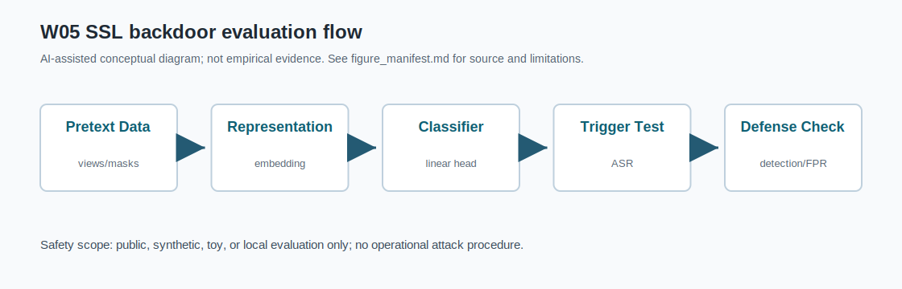
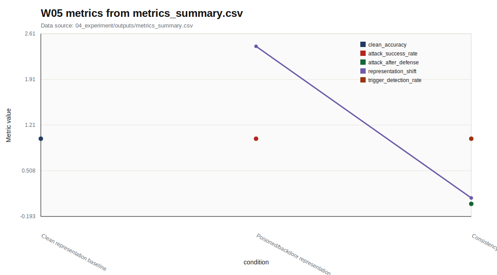

# W05 Self-Supervised Learning & Backdoor

Research Question: Self-Supervised Learning & Backdoor에서 성능 지표와 보안 지표를 어떻게 분리해 평가할 수 있는가?

---

## Core Formula

### Contrastive Loss와 Representation Shift

$$
\mathcal{L}_{NCE}=-\log
\frac{\exp(sim(z_i,z_i^+)/\tau)}
{\sum_{j}\exp(sim(z_i,z_j)/\tau)},
\qquad
\Delta_z=\lVert \mu_{clean}-\mu_{trigger}\rVert_2
$$

| 기호 | 의미 |
|---|---|
| `z_i,z_i^+` | 같은 샘플 또는 양성 쌍의 표현 |
| `sim` | 표현 간 유사도 |
| `\tau` | temperature |
| `\Delta_z` | clean/trigger 표현 중심 차이 |

- 직관적 의미: Contrastive learning은 가까워야 할 표현과 멀어져야 할 표현을 구분한다. Backdoor 평가는 clean 성능뿐 아니라 표현 공간 이동을 함께 확인한다.
- 보안적 의미: 은닉 trigger가 representation에 남으면 downstream classifier에서 조건부 실패가 생길 수 있다.
- 평가 지표 연결: representation_shift, clean_accuracy, attack_success_rate, trigger_detection_rate와 연결한다.
- 한계: 표준 contrastive objective와 proxy shift이며 formal backdoor guarantee가 아니다.

---

## Threat Model

- Diagram: SSL backdoor evaluation flow
- Stages: Pretext Data, Representation, Classifier, Trigger Test, Defense Check
- 안전 범위: public, synthetic, toy, local evaluation

---

## Evaluation Protocol

- Metrics: clean_accuracy, attack_success_rate, attack_after_defense, representation_shift, trigger_detection_rate
- 데이터 출처: `04_experiment/outputs/metrics_summary.csv`

| condition | clean_accuracy | attack_success_rate | attack_after_defense | representation_shift | trigger_detection_rate |
| --- | --- | --- | --- | --- | --- |
| Clean representation baseline | 1 |  |  |  |  |
| Poisoned/backdoor representation |  | 1 |  | 2.419 |  |
| Consistency defense check |  |  | 0 | 0.091 | 1 |

---

## Figure-first Result

그래프는 representation_shift, trigger_detection_rate, attack_success_rate 같은 SSL/backdoor 관련 지표를 한 화면에서 비교한다. Clean accuracy만으로는 representation 내부 변화나 trigger 조건 성능을 설명할 수 없다. 모든 값은 기존 CSV의 수치 열에서 가져왔다.

---

## Paper Map

| ID | 논문 역할 | 발표에서 쓰는 위치 | 기말논문 연결 |
|---|---|---|---|
| P01 | 핵심 이론 | Background / Core Formula | Self-Supervised Learning & Backdoor의 관련연구 뼈대 |
| P02 | 위협 분류 | Threat Model | 공격자·방어자·보호자산 정의 |
| P03 | 평가 지표 | Evaluation Protocol | 정량 지표와 로그 근거 연결 |
| P04 | 공격·방어 사례 | Security Implication | 보안적 함의와 방어 한계 |
| P05 | 재현성·정책 근거 | Limitation | 확인 필요 항목과 제출 전 검증 |

---

## Limitation

- trigger 관련 설명은 공개 toy/synthetic 범위이며 실제 악용 가능한 절차를 제공하지 않는다.
- 원문 DOI/URL과 formal guarantee는 최종 제출 전 확인 필요.
- 실제 운영 시스템 악용 절차나 무단 API 질의 절차는 포함하지 않음.

---

## Final Takeaway

W05의 핵심은 `clean_accuracy, attack_success_rate, attack_after_defense, representation_shift, trigger_detection_rate`를 성능·보안·재현성 근거로 분리해 기말논문의 평가방법에 연결하는 것이다.
