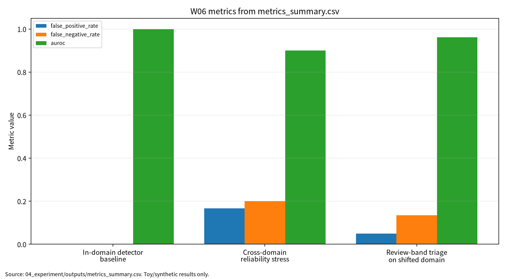

# W06 제출용 보고서

## 0. 메타정보

- 주차: W06
- 보고서 제목: 확률생성모형(Diffusion/GAN) & 딥페이크 검출
- 작성일: 2026-06-22
- 최종 보완 점검일: 2026-06-23 (Asia/Seoul)
- 문서 상태: 제출용 보고서, 작성자 확인 필요
- 최종 제출 확정 여부: 미확정
- 관련 산출물 위치: `03_weekly_reports/w06_diffusion_gan_deepfake/`

## 초록

본 보고서는 diffusion model, video diffusion, GAN의 생성 원리와 딥페이크 탐지 신뢰성 문제를 구분해 분석한다. 문헌 5편을 검토하고, 실제 딥페이크 생성 없이 synthetic real/fake detector score 분포 기반 안전 toy 실험으로 in-domain baseline, cross-domain reliability stress, review-band triage를 비교하였다. In-domain accuracy는 1.000000이었으나 cross-domain accuracy는 0.816667, FNR은 0.200000으로 저하되었다. Review-band triage는 auto coverage 0.641667, review rate 0.358333을 기록하였다. 이 수치는 실제 포렌식 성능이 아니라 평가 형식 검증용이다.

| 학번 | 26200122 |
| 보완일 | 2026-06-23 |
## 1. 한 문장 요약

W06는 생성모형 품질 평가와 딥페이크 탐지기 신뢰성 평가를 분리하고, FPR/FNR·AUROC·ECE·review routing을 함께 기록하는 평가 구조를 제안한다.

## 2. 학습 배경과 주차 목표

W06는 W05의 파운데이션 모델·표현학습 논의를 확률생성모형과 합성미디어 보안으로 확장하는 주차다. W01은 AI 보안 평가의 생명주기 프레임을 세웠고, W02는 학습 데이터 오염, W03는 비전 대적공격, W04는 Transformer/NLP 프라이버시, W05는 표현공간 backdoor를 다루었다. W06는 diffusion, score-based model, GAN, video diffusion, deepfake detection을 연결하여 생성모형의 품질과 포렌식 탐지 신뢰성을 분리해 평가한다.

학습목표는 diffusion model의 수학적 정식화와 sampling 알고리즘 비교, GAN 기반 생성모형과 합성미디어 위협모형 연결, deepfake detection의 데이터 편향·일반화·신뢰성 지표 설계이다.

## 3. AI 원리 70% 정리

Diffusion model은 forward noising과 reverse denoising을 통해 데이터 분포를 복원하는 생성모형 계열이다[1]. Video diffusion model은 이미지 생성과 달리 시간적 일관성과 조건부 생성을 함께 고려해야 한다[2]. GAN은 generator와 discriminator의 경쟁 구조를 통해 사실적인 sample을 생성하지만 품질 지표와 안정성 문제가 반복된다[3].

표 1. W06 핵심 개념과 보안 연결

| 개념 | AI 원리 | 보안 연결 | 관련 문헌 |
|---|---|---|---|
| Diffusion | score-based reverse sampling | 고품질 synthetic media | [1] |
| Video diffusion | temporal consistency | 영상 딥페이크와 플랫폼 shift | [2] |
| GAN | generator-discriminator 경쟁 | 생성 품질과 탐지 지표 분리 | [3] |
| Deepfake detection | 조작 단서 탐지 | FPR/FNR과 포렌식 위험 | [4], [5] |

## 4. 보안 이슈 30% 정리

Deepfake 생성과 탐지는 허위정보, 사칭, 증거 조작 등 사회적·보안적 위험과 연결된다[4]. Deepfake detection reliability는 단순 accuracy가 아니라 transferability, robustness, interpretability, calibration을 함께 고려해야 한다[5]. FPR은 false accusation 위험을 만들고, FNR은 실제 조작물을 놓치는 위험을 만든다.

그림 1. 딥페이크 탐지 신뢰성 평가 흐름

```text
Media Input / Synthetic Media
  -> Detector Score
  -> In-Domain Evaluation: Accuracy, F1, FPR, FNR, AUROC, ECE
  -> Cross-Domain Stress: Score Shift, FPR/FNR Increase
  -> Review-Band Triage: Auto Coverage, Review Rate
  -> Human Review / Forensic Workflow
  -> Reproducibility Evidence: seed, config, threshold, outputs, run_log
```

## 5. 논문 5편 요약

표 2. 관련 문헌 5편 요약

| ID | 문헌 | DOI/URL 상태 | 활용 |
|---|---|---|---|
| P01 | Yang et al., Diffusion Models: A Comprehensive Survey of Methods and Applications | DOI `10.1145/3626235` 검증 | diffusion 원리와 조건부 생성 배경 |
| P02 | Xing et al., A Survey on Video Diffusion Models | DOI `10.1145/3696415`, arXiv `2310.10647` 확인, 강의계획서 동일 여부와 Article 번호 확인 필요 | video diffusion과 temporal consistency |
| P03 | Zhengwei Wang et al., Generative Adversarial Networks in Computer Vision: A Survey and Taxonomy | DOI `10.1145/3439723`, arXiv `1906.01529` 확인, 강의계획서 저자명 차이 확인 필요 | GAN taxonomy와 생성 품질 지표 한계 |
| P04 | Mirsky and Lee, The Creation and Detection of Deepfakes: A Survey | DOI `10.1145/3425780` 검증 | 딥페이크 생성·탐지 위협모형 |
| P05 | Tianyi Wang et al., Deepfake Detection: A Comprehensive Survey from the Reliability Perspective | DOI `10.1145/3699710` 검증 | transferability, interpretability, robustness |

## 6. 논문 5편 비교표

P01-P03은 생성모형 원리와 생성 품질 평가 문헌이고, P04-P05는 deepfake threat model과 detection reliability 문헌이다. W06의 핵심 연결부는 생성 품질 지표가 포렌식 탐지 신뢰성을 보장하지 않는다는 점이다. 딥페이크 탐지 평가는 accuracy 하나가 아니라 FPR, FNR, AUROC, ECE, review rate, auto coverage를 함께 봐야 한다.

주의: W06의 P02는 강의계획서 지정 논문인 Ananya Högele et al., "Video Diffusion Models: A Survey"와 현재 로컬 PDF "A Survey on Video Diffusion Models"의 동일 여부를 최종 확인해야 한다. 동일하지 않다면 현재 P02는 대체 문헌으로 사용한 것이며, 최종 제출 전 교수자 확인이 필요하다.

주의: W06의 P03은 강의계획서 지정 저자명과 현재 로컬 PDF/arXiv 저자명이 다르므로, 동일 논문 여부와 강의계획서 표기 오류 가능성을 확인 필요 상태로 유지한다.

## 7. Research Track 분석

표 3. W06 Research Track 요약

| 항목 | 내용 |
|---|---|
| 연구문제 | 딥페이크 탐지기는 in-domain 성능이 높을 때 cross-domain 조건에서도 신뢰할 수 있는가 |
| 대상 시스템 | synthetic media detector, forensic review workflow |
| 위협 | 압축·미지 생성기·platform shift에 따른 FPR/FNR 증가 |
| 평가 지표 | accuracy, F1, FPR, FNR, AUROC, ECE, auto coverage, review rate |
| 재현성 | seed 42, config, script, CSV/JSON/run log 보존 |
| 제외 범위 | 실제 딥페이크 생성, 실제 개인정보, 무단 서비스 질의 |

## 8. 실습 보고서

본 실습은 실제 딥페이크 생성이나 실제 탐지 모델 평가가 아니라 W06의 핵심인 딥페이크 탐지 신뢰성 평가축을 안전하게 설명하기 위한 최소 toy protocol이다. 따라서 synthetic real/fake detector score 분포와 threshold-based toy detector를 사용하되, 평가 구조는 이후 실제 deepfake benchmark, platform shift, human-in-the-loop forensic workflow에도 확장 가능하도록 accuracy, F1, FPR, FNR, AUROC, ECE, auto coverage, review rate, reproducibility evidence로 분리하였다.

표 4. W06 실습 설계

| 항목 | 설정 |
|---|---|
| Dataset | synthetic real/fake detector score distributions |
| Detector | threshold-based toy deepfake detector |
| In-domain | real mean 0.22, fake mean 0.78, std 0.08 |
| Cross-domain | real mean 0.34, fake mean 0.61, std 0.16 |
| Threshold / review band | 0.50 / 0.40-0.60 |
| Outputs | `metrics_summary.csv`, `results.json`, `run_log.md` |

표 5. W06 실습 결과

| 조건 | Accuracy | F1 | FPR | FNR | AUROC | ECE | Auto coverage | Review rate |
|---|---:|---:|---:|---:|---:|---:|---:|---:|
| In-domain detector baseline | 1.000000 | 1.000000 | 0.000000 | 0.000000 | 1.000000 | 0.216327 | 해당 없음 | 해당 없음 |
| Cross-domain reliability stress | 0.816667 | 0.813559 | 0.166667 | 0.200000 | 0.899722 | 0.147949 | 해당 없음 | 해당 없음 |
| Review-band triage on shifted domain | 0.909091 | 0.901408 | 0.050000 | 0.135135 | 0.962162 | 0.174872 | 0.641667 | 0.358333 |

이 결과는 synthetic detector score toy 실험의 평가 형식 검증용 수치이며, 실제 딥페이크 데이터셋, 실제 탐지 모델, 법적 포렌식 증거능력, 운영 서비스의 보안 성능으로 일반화하지 않는다.

<!-- submission-metric-chart:start -->
**그림 7. W06 metrics summary chart**



출처: `04_experiment/outputs/metrics_summary.csv`. 이 그래프는 공개 toy/synthetic 산출물 기반이며 실제 공격 성능이나 운영 환경 성능으로 일반화하지 않는다.
<!-- submission-metric-chart:end -->

## 9. AI 도구 활용 기록

AI 도구는 문헌 요약, 코드 점검, 문장 구조화, 그래프 생성 보조에 사용하였다. 모든 DOI/URL, 실험 수치, 본문 인용, 결론은 작성자가 outputs 파일과 로컬 참고문헌 검증표를 대조하여 검증한다.

**표. W06 AI 도구 활용 및 검증 기록**

| 항목 | 내용 |
|---|---|
| 사용 도구명 | Codex, ChatGPT 계열 도구 |
| 사용 일자 | 2026-06-23 |
| 사용 목적 | 문헌 요약 정리, 보고서 구조화, 안전한 toy/synthetic 실험 결과 표기 점검, 그래프 생성 보조, 제출 전 체크리스트 정리 |
| 주요 프롬프트 요약 | 주차별 제출 보고서 보완, 참고문헌 검증표 정리, metrics_summary.csv 기반 그래프 생성, AI 활용 고지 작성 |
| AI 산출물 반영 위치 | `07_week_submission/w06_submission_report.md`, `07_week_submission/assets/w06_metric_chart.png`, `05_ai_worklog/ai_disclosure_draft.md` |
| 본인 수정 내용 | 주차별 문헌 상태 확인, 실험 수치와 outputs 대조, 안전 범위와 한계 문장 확인, 최종 제출 전 미확정 문헌 분리 |
| 사실관계 검증 방법 | `01_papers/paper_list.md`, `01_papers/doi_check.md`, `05_references/doi_index.md`, 강의계획서 문헌표 대조 |
| 참고문헌 검증 방법 | 제목, 저자, 연도, 학술지/학회, DOI/URL, 본문 인용번호와 참고문헌 목록 대응 확인 |
| 실험결과 검증 방법 | `04_experiment/outputs/metrics_summary.csv`, `results.json`, `run_log.md`의 수치와 보고서 표기 대조 |
| 최종 책임 확인 | AI 산출물은 초안 보조이며 최종 제출자는 원고 내용, 인용, 실험결과, 연구윤리 책임을 확인한다. |

## 10. 토론 질문

1. In-domain accuracy 1.000000을 실제 포렌식 신뢰성으로 해석하면 왜 위험한가?
2. FPR과 FNR의 사회적 피해는 어떻게 다르게 평가해야 하는가?
3. Review-band triage에서 auto coverage와 review rate의 적정 균형은 무엇인가?
4. P02/P03처럼 강의계획서와 출판사 메타데이터가 다를 때 참고문헌을 어떻게 표기해야 하는가?

## 11. 기말논문 연결

추천 주제는 “딥페이크 탐지기의 cross-domain reliability 평가 프레임워크”이다. 기여 후보는 diffusion/GAN 생성 원리와 딥페이크 탐지 신뢰성의 분리, FPR/FNR 중심 평가표, review-band triage, seed/config/output 기반 재현성 기록이다.

## 12. KCI 논문 형식 전환

표 6. KCI 논문 제목 후보

| 번호 | 국문 제목 후보 | 영문 제목 후보 | 대상 시스템 | 보안 위협 | 연구방법 | 예상 기여 |
|---:|---|---|---|---|---|---|
| 1 | 딥페이크 탐지기의 Cross-Domain Reliability 평가 프레임워크 연구 | A Study on a Cross-Domain Reliability Evaluation Framework for Deepfake Detectors | Synthetic media detector | 미지 생성기, 압축, 플랫폼 shift | 문헌분석 + synthetic score 실험 | FPR/FNR·review routing 평가표 |
| 2 | 생성모형 품질 평가와 딥페이크 포렌식 탐지 신뢰성 평가의 분리 기준 연구 | A Study on Separating Generative Model Quality Evaluation from Deepfake Forensic Detection Reliability Evaluation | Diffusion/GAN 기반 합성미디어 | 탐지기 과신, 포렌식 오류 | 비교분석 + 체크리스트 | 생성 품질·탐지 신뢰성 분리 |
| 3 | Human Review Routing을 포함한 딥페이크 탐지 평가체계 연구 | A Deepfake Detection Evaluation Framework with Human Review Routing | Forensic review workflow | false accusation, missed detection | synthetic score 실험 + review-band triage | 자동판정률과 검토율 동시 평가 |

추천 제목은 “딥페이크 탐지기의 Cross-Domain Reliability 평가 프레임워크 연구”이다. 연구문제는 in-domain/cross-domain 지표 차이, FPR/FNR/AUROC/ECE의 설명력, review-band triage의 자동판정률과 검토율 변화로 구성한다.

## 13. SCI 논문 형식 전환

SCI 제목 후보는 “A Cross-Domain Reliability Evaluation Framework for Deepfake Detectors: Integrating FPR, FNR, Calibration, Review-Band Triage, and Reproducibility Evidence”이다.

표 7. SCI Related Work 축

| 연구축 | 대표 논문 | 역할 |
|---|---|---|
| Diffusion models | Yang et al. | diffusion/score-based model과 조건부 생성 원리 |
| Video diffusion models | Högele et al. 또는 현재 P02 | temporal synthetic media와 video generation |
| GANs in computer vision | Wang et al. 또는 현재 P03 | GAN 생성 구조와 품질 지표 |
| Deepfake creation/detection | Mirsky and Lee | 딥페이크 위협모형과 탐지 기술 |
| Deepfake detection reliability | Tianyi Wang et al. | robustness, transferability, interpretability, reliability |

Structured abstract는 Background, Problem, Method, Results, Contribution, Implications로 구성한다. Limitations는 threshold-based toy detector, synthetic score distributions, 법적 증거능력 미평가, P02/P03 문헌 동일성 검증 필요로 정리한다.

## 14. 발표용 요약

- 생성 품질과 탐지 신뢰성은 다른 평가 문제이다.
- P01-P03은 생성모형 원리, P04-P05는 deepfake threat/reliability를 담당한다.
- In-domain accuracy 1.000000은 cross-domain 신뢰성을 보장하지 않는다.
- Review-band triage는 auto coverage 0.641667, review rate 0.358333을 기록했다.
- 실험 수치는 실제 포렌식 성능 보증이 아니라 평가 형식 설명용이다.

## 15. 참고문헌 검증표

표 8. 참고문헌 검증표

| 번호 | 참고문헌 | DOI/URL | 상태 | 남은 검토 |
|---|---|---|---|---|
| [1] | Yang et al., Diffusion Models: A Comprehensive Survey of Methods and Applications | `10.1145/3626235` | 검증 | arXiv/ACM 세부 인용 위치 |
| [2] | W06 P02, A Survey on Video Diffusion Models | `10.1145/3696415`, arXiv `2310.10647` | 부분 검증 | 강의계획서 지정 P02와 동일 여부, Article 번호 |
| [3] | W06 P03, Generative Adversarial Networks in Computer Vision: A Survey and Taxonomy | `10.1145/3439723`, arXiv `1906.01529` | 부분 검증 | 강의계획서 저자명 차이 |
| [4] | Mirsky and Lee, The Creation and Detection of Deepfakes: A Survey | `10.1145/3425780` | 검증 | Article 번호 |
| [5] | Tianyi Wang et al., Deepfake Detection: A Comprehensive Survey from the Reliability Perspective | `10.1145/3699710` | 검증 | 강의계획서 `J. Wang et al.` 표기 |

## 16. 자기 점검표

표 9. 최종 자기 점검표

| 점검 항목 | 상태 | 비고 |
|---|---|---|
| 1장 한 문장 요약 작성 | 완료 |  |
| 2장 학습 배경과 주차 목표 작성 | 완료 |  |
| AI 원리 70% 정리 | 완료 |  |
| 보안 이슈 30% 정리 | 완료 |  |
| 논문 5편 요약 | 완료 |  |
| 논문 5편 비교표 보완 | 완료 / 확인 필요 | P02/P03 동일 여부 반영 |
| Research Track 5요소 작성 | 완료 | 연구문제, 위협모형, 평가방법, 재현성, 오픈문제 |
| P01 DOI/URL 검증 | 완료 |  |
| P02 지정 논문 동일 여부 검증 | 확인 필요 | ACM DOI는 확인 |
| P03 지정 논문 동일 여부 검증 | 확인 필요 | ACM DOI는 확인 |
| P04 DOI/URL 검증 | 완료 | Article 번호 확인 필요 |
| P05 DOI/URL 검증 | 완료 | 강의계획서 표기 확인 필요 |
| 실험 outputs 파일 존재 확인 | 완료 |  |
| 실험 결과와 보고서 수치 일치 | 완료 |  |
| KCI 논문 형식 전환 작성 | 완료 |  |
| SCI 논문 형식 전환 작성 | 완료 |  |
| 본문 인용과 참고문헌 대응 | 완료 / 확인 필요 | P02/P03 부분 검증 표시 |
| 표·그림 번호 정리 | 완료 |  |
| AI 활용 고지 작성 | 완료 |  |
| PDF 저작권 위험 점검 | 완료 / 확인 필요 | PDF 원문 Git 추적 해제 완료(로컬 파일 보존) |
| 최종 사람이 검토할 항목 표시 | 완료 | 제출 전 작성자 확인 항목 있음 |
