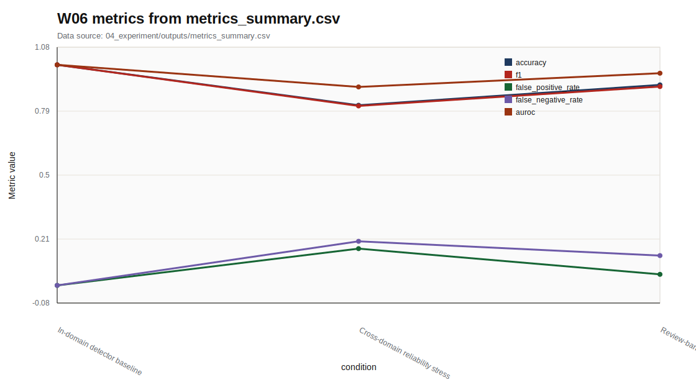

# W06 Diffusion/GAN & Deepfake Detection

Research Question: Diffusion/GAN & Deepfake Detection에서 성능 지표와 보안 지표를 어떻게 분리해 평가할 수 있는가?

---

## Core Formula

### Diffusion Forward Process와 Denoising Objective

$$
q(x_t|x_{t-1})=\mathcal{N}\left(\sqrt{1-\beta_t}x_{t-1},\beta_t I\right),
\qquad
\mathcal{L}_{simple}=\mathbb{E}_{t,x_0,\epsilon}\left[\lVert \epsilon-\epsilon_\theta(x_t,t)\rVert_2^2\right]
$$

| 기호 | 의미 |
|---|---|
| `x_t` | time step t의 noisy sample |
| `\beta_t` | noise schedule |
| `\epsilon` | 주입된 noise |
| `\epsilon_\theta` | denoising model prediction |

- 직관적 의미: Diffusion은 점진적으로 noise를 더하고 이를 되돌리는 학습 문제로 볼 수 있다.
- 보안적 의미: 보안 발표에서는 생성 원리보다 탐지와 검증 지표를 중심에 둔다.
- 평가 지표 연결: AUROC, FPR, FNR, review_rate와 연결한다.
- 한계: 표준식이며 특정 생성 모델의 원문 수치를 새로 주장하지 않는다.

---

## Threat Model

- Diagram: generated-media detection pipeline
- Stages: Media Sample, Detector, Score, Threshold, Review
- 안전 범위: public, synthetic, toy, local evaluation

---

## Evaluation Protocol

- Metrics: accuracy, f1, false_positive_rate, false_negative_rate, auroc
- 데이터 출처: `04_experiment/outputs/metrics_summary.csv`

| condition | accuracy | f1 | false_positive_rate | false_negative_rate | auroc |
| --- | --- | --- | --- | --- | --- |
| In-domain detector baseline | 1 | 1 | 0 | 0 | 1 |
| Cross-domain reliability stress | 0.817 | 0.814 | 0.167 | 0.2 | 0.9 |
| Review-band triage on shifted domain | 0.909 | 0.901 | 0.05 | 0.135 | 0.962 |

---

## Figure-first Result

그래프는 deepfake detector의 accuracy, F1, FPR, FNR, AUROC를 조건별로 비교한다. 탐지 문제에서는 false positive와 false negative의 보안 비용이 다르므로 accuracy만으로 결론을 내리지 않는다. source는 `metrics_summary.csv`이다.

---

## Paper Map

| ID | 논문 역할 | 발표에서 쓰는 위치 | 기말논문 연결 |
|---|---|---|---|
| P01 | 핵심 이론 | Background / Core Formula | Diffusion/GAN & Deepfake Detection의 관련연구 뼈대 |
| P02 | 위협 분류 | Threat Model | 공격자·방어자·보호자산 정의 |
| P03 | 평가 지표 | Evaluation Protocol | 정량 지표와 로그 근거 연결 |
| P04 | 공격·방어 사례 | Security Implication | 보안적 함의와 방어 한계 |
| P05 | 재현성·정책 근거 | Limitation | 확인 필요 항목과 제출 전 검증 |

---

## Limitation

- 생성 모델 수식은 표준 학습 목적 설명이며 deepfake 제작 절차를 안내하지 않는다.
- 원문 DOI/URL과 formal guarantee는 최종 제출 전 확인 필요.
- 실제 운영 시스템 악용 절차나 무단 API 질의 절차는 포함하지 않음.

---

## Final Takeaway

W06의 핵심은 `accuracy, f1, false_positive_rate, false_negative_rate, auroc`를 성능·보안·재현성 근거로 분리해 기말논문의 평가방법에 연결하는 것이다.
