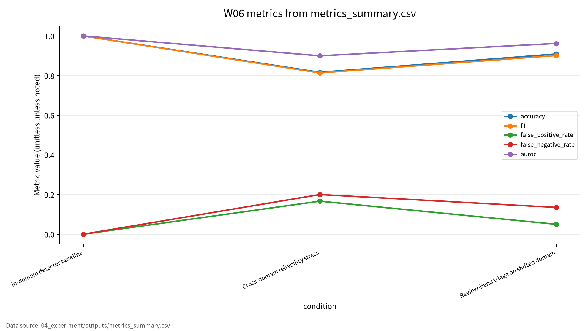
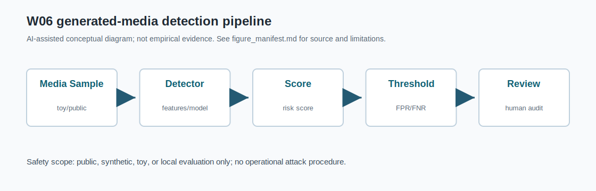

# W06 확률생성모형(Diffusion/GAN) & 딥페이크 검출

## 발표 핵심

딥페이크 탐지 평가는 in-domain accuracy 하나로 끝나지 않는다. Cross-domain FPR/FNR, calibration, human review routing, 재현성 근거를 함께 기록해야 한다.

---

# 1. 왜 W06가 중요한가

- Diffusion/GAN은 고품질 합성미디어 생성을 가능하게 한다.
- 생성 품질이 높아질수록 탐지기의 artifact 의존성이 흔들린다.
- W06의 질문: “잘 맞는 detector”는 미지 도메인에서도 신뢰할 수 있는가?

---

# 2. 발표 로드맵

1. Diffusion과 GAN 원리
2. 딥페이크 탐지 신뢰성 문제
3. 논문 5편의 역할
4. Synthetic toy 실험
5. Cross-domain 결과와 review-band
6. 기말논문 연결

---

# 3. AI 원리 70%: Diffusion

- Forward process: 데이터에 노이즈를 점진적으로 추가한다.
- Reverse process: denoising으로 데이터 분포를 복원한다.
- Score-based sampling: 분포의 score를 이용한다.
- 조건부 생성: text, image, class condition으로 생성 방향을 제어한다.

---

# 4. AI 원리 70%: GAN

| 구성 | 역할 | 보안 연결 |
|---|---|---|
| Generator | synthetic sample 생성 | 딥페이크 생성 원리 |
| Discriminator | real/fake 구분 | detector와 유사하지만 목적은 다름 |
| Minimax training | 경쟁 학습 | 안정성 문제 |
| Mode collapse | 다양성 부족 | 평가 지표 한계 |

---

# 5. 보안 이슈 30%

| 위협 | 실패 조건 | 대표 지표 |
|---|---|---|
| 허위증거 | 합성미디어가 실제처럼 유통 | FPR/FNR |
| 미탐 | 새로운 생성기와 압축 | FNR |
| 오탐 | 낮은 품질 real media | FPR |
| 자동판정 과신 | 불확실 score를 단정 | review rate |

---

# 6. 논문 5편의 역할

| ID | 중심 역할 | W06 활용 |
|---|---|---|
| P01 | diffusion survey | forward/reverse, sampling |
| P02 | video diffusion survey | temporal consistency, 강의계획서 동일 여부 확인 필요 |
| P03 | GAN survey | generator-discriminator, 저자명 표기 확인 필요 |
| P04 | deepfake creation/detection | 위협모형 |
| P05 | detection reliability | transferability, robustness |

---

# 7. 위협모형

```text
Synthetic media -> detector score -> threshold decision -> review workflow
       |                 |                 |                  |
 new generator      score shift        FPR/FNR           human review
```

- 보호 자산: 증거, score, 판단 로그, 검토 기록
- 실패 조건: 압축, 재인코딩, platform shift, unseen generator
- 제외 범위: 실제 딥페이크 생성, 개인정보, 무단 서비스 질의

---

# 8. 평가 프로토콜

| 평가 항목 | 지표 | 기록 방법 |
|---|---|---|
| In-domain | accuracy, F1 | 기준 score 분포 |
| Cross-domain | FPR, FNR, AUROC | shifted score 분포 |
| Calibration | ECE | confidence-correctness 차이 |
| Review routing | auto coverage, review rate | 0.40-0.60 band |
| Reproducibility | seed, config, outputs | CSV/JSON/run log |

---

# 9. Synthetic toy 실험

- 데이터: synthetic real/fake detector score distributions
- 기준 도메인: real mean 0.22, fake mean 0.78
- 이동 도메인: real mean 0.34, fake mean 0.61
- Threshold: 0.50
- Review band: 0.40-0.60

---

# 10. 실험 결과

| 조건 | Accuracy | F1 | FPR | FNR |
|---|---:|---:|---:|---:|
| In-domain | 1.000000 | 1.000000 | 0.000000 | 0.000000 |
| Cross-domain | 0.816667 | 0.813559 | 0.166667 | 0.200000 |
| Review-band | 0.909091 | 0.901408 | 0.050000 | 0.135135 |

정량값은 `04_experiment/outputs/run_log.md` 기준이다.

---

# 11. 결과 해석

- In-domain accuracy 1.000000은 cross-domain 신뢰성을 보장하지 않는다.
- Cross-domain에서 FNR 0.200000은 실제 조작물을 놓치는 위험을 뜻한다.
- Review-band는 35.8333%를 human review로 보내 자동판정 위험을 낮춘다.
- 이 결과는 synthetic toy 수치이며 실제 포렌식 성능이 아니다.

---

# 12. 기말논문 연결

| 기말논문 장 | 연결 내용 |
|---|---|
| 관련연구 | diffusion/GAN과 deepfake reliability 문헌 |
| 위협모형 | synthetic media detector와 domain shift |
| 평가방법 | FPR/FNR, AUROC, ECE, review routing |
| 분석/실험 | synthetic score 기반 재현성 예시 |

Contribution 후보: 딥페이크 탐지기의 cross-domain reliability 평가 프레임워크.

---

# 13. 결론

W06 결론:

- 생성 품질과 탐지 신뢰성은 별도 평가축이다.
- Accuracy 단독 평가는 딥페이크 탐지 위험을 숨긴다.
- FPR/FNR과 review routing이 포렌식 평가의 핵심이다.
- 수치는 실행 로그와 config, CSV/JSON 근거가 있을 때만 주장한다.

<!-- formula-visual-supplement:start -->
# 수식·그래프·그림 보강

- 보강 일자: 2026-06-23
- 수식은 표준 정의식 또는 검증 가능한 평가식으로만 작성했다.
- 그래프는 `04_experiment/outputs/metrics_summary.csv`의 기존 수치만 사용했다.
- 다이어그램은 AI-assisted conceptual diagram이며 사실 자료나 실험 결과처럼 해석하지 않는다.

### 핵심 수식: Diffusion Forward Process와 Denoising Objective

$$
q(x_t|x_{t-1})=\mathcal{N}\left(\sqrt{1-\beta_t}x_{t-1},\beta_t I\right),
\qquad
\mathcal{L}_{simple}=\mathbb{E}_{t,x_0,\epsilon}\left[\lVert \epsilon-\epsilon_\theta(x_t,t)\rVert_2^2\right]
$$

| 기호 | 의미 |
|---|---|
| `x_t` | time step t의 noisy sample |
| `\beta_t` | noise schedule |
| `\epsilon` | 주입된 noise |
| `\epsilon_\theta` | denoising model prediction |

**직관적 의미:**  
Diffusion은 점진적으로 noise를 더하고 이를 되돌리는 학습 문제로 볼 수 있다.

**보안 관점 해석:**  
보안 발표에서는 생성 원리보다 탐지와 검증 지표를 중심에 둔다.

**평가 지표 연결:**  
AUROC, FPR, FNR, review_rate와 연결한다.

**한계와 가정:**  
표준식이며 특정 생성 모델의 원문 수치를 새로 주장하지 않는다.

### 핵심 수식: GAN Min-Max와 FPR/FNR

$$
\min_G\max_D\ \mathbb{E}_{x\sim p_{data}}\log D(x)+\mathbb{E}_{z\sim p_z}\log(1-D(G(z))),
\qquad
FPR=\frac{FP}{FP+TN},\quad FNR=\frac{FN}{FN+TP}
$$

| 기호 | 의미 |
|---|---|
| `G,D` | generator와 discriminator |
| `FP,FN` | 오탐과 미탐 |
| `TP,TN` | 정탐과 정상 판정 |
| `FPR,FNR` | 오탐률과 미탐률 |

**직관적 의미:**  
GAN 목적식은 생성자와 판별자의 경쟁을 표현한다. 탐지 평가는 판별 정확도보다 오탐·미탐의 균형이 중요하다.

**보안 관점 해석:**  
미탐은 악성 생성물을 놓칠 위험이고, 오탐은 정상 콘텐츠 차단 위험이다.

**평가 지표 연결:**  
false_positive_rate, false_negative_rate, AUROC, expected_calibration_error와 연결한다.

**한계와 가정:**  
detector toy evaluation이며 실제 미디어 판별 보증으로 해석하지 않는다.

### 표 수치 기반 그래프



그래프는 deepfake detector의 accuracy, F1, FPR, FNR, AUROC를 조건별로 비교한다. 탐지 문제에서는 false positive와 false negative의 보안 비용이 다르므로 accuracy만으로 결론을 내리지 않는다. source는 `metrics_summary.csv`이다.

### Threat Model / Pipeline Diagram



이 다이어그램은 `generated-media detection pipeline`를 발표용으로 요약한 개념도다. 데이터 흐름, 평가 지표, 한계 표시는 `assets/figure_manifest.md`에도 기록했다.

### 확인 필요

- 생성 모델 수식은 표준 학습 목적 설명이며 deepfake 제작 절차를 안내하지 않는다.
- 논문별 원문 절·쪽·그림 번호는 최종 제출 전 사람 검토가 필요하다.
<!-- formula-visual-supplement:end -->
