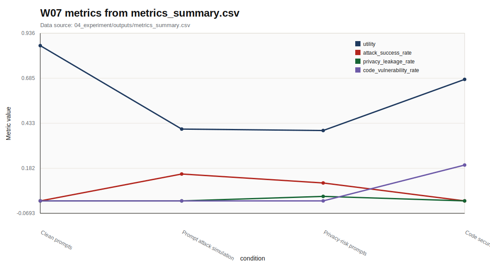
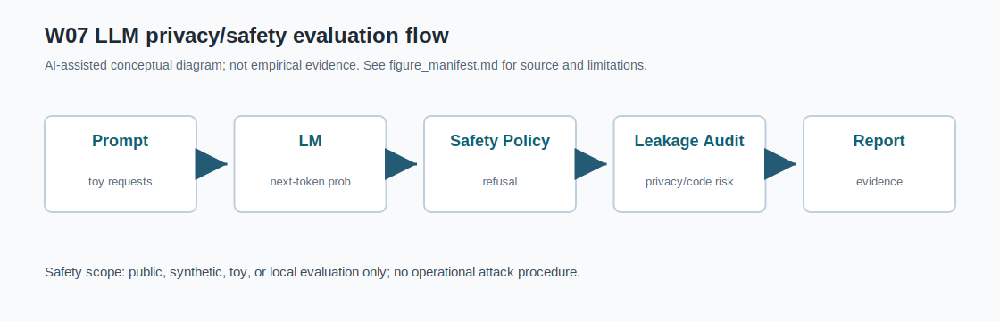

# W07 LLM 학습·정렬·평가 & LLM 보안·프라이버시 통합보고서

## 0. 메타정보

- 주차: W07
- 주제: LLM 학습·정렬·평가 & LLM 보안·프라이버시
- 문서 상태: 제출용 최종 초안
- 실험 상태: 실행 완료. `04_experiment/outputs/metrics_summary.csv`, `results.json`, `run_log.md` 존재
- 안전 범위: 실제 LLM/API 호출, 실제 개인정보, 실제 jailbreak 재현, 무단 서비스 질의, exploit instruction 없음
- 참고문헌 상태: P01-P05 DOI/URL 검증표 갱신. 강의계획서 저자명/출판지 표기 차이는 확인 필요로 유지
- PDF 보관 상태: `01_papers/pdf/` PDF 5개가 git 추적 중. public GitHub 저작권 위험 표시, 삭제는 사용자 승인 필요

## 1. 한 문장 요약

W07는 LLM을 학습 데이터, system/user prompt, retrieval context, output, code artifact, log, benchmark가 결합된 보안 평가 대상 시스템으로 보고, utility, answer rate, ASR, privacy leakage, refusal quality, over-refusal, code vulnerability rate, reproducibility evidence를 함께 기록하는 평가 프레임워크로 정리한다.

## 2. 학습 배경과 주차 목표

### 2.1 이번 주 주제의 위치

W07는 W01-W06에서 정리한 AI 보안 평가축을 LLM 시스템으로 확장하는 핵심 주차다. W01은 ML 생명주기 보안 평가의 기본 프레임을 세웠고, W02-W06은 데이터 오염, 비전 대적공격, NLP 프라이버시, 표현공간 backdoor, 딥페이크 탐지 신뢰성을 다루었다. W07는 LLM의 pretraining, instruction tuning, alignment, benchmark evaluation, context window, multimodal extension, code generation을 통합해 LLM/RAG 기반 AI 시스템의 보안·프라이버시·재현성 평가 프레임워크로 연결한다.

### 2.2 강의계획서상 학습목표

- LLM 학습, 정렬, 평가 프레임워크를 이해한다.
- LLM 보안·프라이버시 위협과 방어 분류체계를 정리한다.
- Multimodal LLM과 code LLM의 추가 공격면을 분석한다.
- Utility, ASR, privacy leakage, refusal quality, over-refusal, code vulnerability rate를 함께 기록하는 최소 평가 프로토콜을 설계한다.

### 2.3 이번 주 핵심 질문

1. LLM 평가는 benchmark score만으로 충분한가?
2. Prompt, context, output, log, benchmark는 어떤 보호 자산으로 볼 수 있는가?
3. LLM 보안 평가에서 ASR과 refusal quality, over-refusal은 어떤 trade-off를 갖는가?
4. Privacy leakage와 code vulnerability risk는 왜 별도 지표로 분리해야 하는가?
5. W07의 synthetic prompt score 실험을 KCI 또는 SCI 논문 주제로 발전시키려면 어떤 연구문제가 적절한가?

## 3. AI 원리 70% 정리

표 1. W07 핵심 개념과 보안 연결

| 핵심 개념 | AI 원리 | 보안·프라이버시 연결 | W07 평가 연결 |
|---|---|---|---|
| Pretraining | 대규모 말뭉치에서 next-token prediction 또는 self-supervised objective로 언어 분포를 학습 | memorization, training data extraction, data contamination | privacy leakage, benchmark contamination |
| Instruction tuning | 명령-응답 데이터로 사용자의 의도에 맞는 응답 양식을 학습 | instruction-following이 공격 지시에도 민감할 수 있음 | prompt attack simulation |
| Alignment/RLHF | 선호도 또는 안전 정책에 맞춰 응답을 조정 | harmful answer 억제와 over-refusal의 균형 필요 | refusal quality, over-refusal |
| Context window | system prompt, user prompt, retrieval context가 하나의 입력으로 결합 | prompt injection, prompt leakage, context manipulation | ASR, leakage flag |
| Benchmark evaluation | task score와 benchmark coverage로 능력 측정 | hidden test leakage, benchmark contamination, capability-risk mismatch | utility, reproducibility evidence |
| Multimodal extension | image/text/audio/video context를 LLM과 결합 | visual prompt injection, multimodal hallucination, context leakage | multimodal risk 확장 |
| Code generation | code artifact를 생성·수정·분석 | insecure code generation, flawed repair, bug triage failure | code vulnerability rate |

LLM 평가는 benchmark score뿐 아니라 task coverage, human evaluation, contamination risk를 함께 고려해야 한다[1]. 따라서 W07는 utility와 answer rate를 기록하되, 이를 보안 성능으로 단독 해석하지 않는다.

## 4. 보안 이슈 30% 정리

LLM 보안·프라이버시 연구는 jailbreak, prompt injection, data leakage, privacy disclosure 등 다양한 위험을 분류한다[2]. LLM은 보안 방어 도구가 될 수도 있지만 공격 자동화와 취약성의 원인이 될 수도 있다[3]. Multimodal LLM은 이미지·텍스트 context가 결합되므로 hallucination과 multimodal prompt risk가 추가된다[4]. Code LLM은 fuzzing, program repair, bug detection, bug triage를 지원하지만 insecure code generation 위험도 함께 평가해야 한다[5].

그림 1. LLM/RAG 보안·프라이버시 평가 흐름

```text
User Prompt / System Prompt / Retrieval Context
        ↓
LLM or RAG System
        ↓
Clean Evaluation -> Utility, Answer Rate
        ↓
Prompt Attack / Privacy-Risk Prompt
        ↓
Security Evaluation -> ASR, Privacy Leakage, Refusal Quality
        ↓
Code Generation Context
        ↓
Code Security Evaluation -> Code Vulnerability Rate, Over-refusal
        ↓
Reproducibility Evidence -> seed, config, prompt categories, outputs, run_log
```

## 5. 논문 5편 요약

표 2. 관련 문헌 5편 요약

| 번호 | 문헌 | 핵심 역할 | 검증 상태 |
|---|---|---|---|
| [1] | Chang et al., *A Survey on Evaluation of Large Language Models* | LLM evaluation taxonomy와 benchmark discipline 제공 | DOI 확인. ACM TIST 15(3), Article 39. 강의계획서의 ACM CSUR 표기 확인 필요 |
| [2] | Das et al., *Security and Privacy Challenges of Large Language Models: A Survey* | LLM 보안·프라이버시 공격과 방어 분류 | ACM CSUR 57(6), DOI 확인. 강의계획서의 Ankur Das 표기 확인 필요 |
| [3] | Yao et al., *A survey on large language model (LLM) security and privacy: The Good, The Bad, and The Ugly* | LLM의 보안 활용·공격 활용·취약성 분류 | HCC DOI 확인. 강의계획서 AI Open 지정 논문과 동일 여부 확인 필요 |
| [4] | Yin et al., *A survey on multimodal large language models* | MLLM architecture, training, evaluation, hallucination 정리 | NSR DOI 확인. 강의계획서 Yongtao Yin 표기 확인 필요 |
| [5] | Zhu et al., *When Software Security Meets Large Language Models: A Survey* | software security workflow와 code LLM 연결 | IEEE/CAA JAS DOI 확인. 강의계획서 Shujun Li 표기 확인 필요 |

## 6. 논문 5편 비교표

표 2-1. 논문 5편 차별성 비교

| 논문 | 차별성 | W07 활용 |
|---|---|---|
| P01 | 공격 논문이 아니라 평가 프레임워크 문헌 | Utility, benchmark coverage, contamination risk를 분리 |
| P02 | LLM 보안·프라이버시 challenge와 defense taxonomy에 집중 | threat model과 방어 가정 설계 |
| P03 | good/bad/ugly 관점으로 LLM의 양면성을 설명 | 공격-방어-평가 연결표 |
| P04 | multimodal context와 hallucination 문제를 정리 | RAG 이후 multimodal prompt risk 확장 |
| P05 | code LLM과 software security task를 연결 | code vulnerability rate와 over-refusal 동시 기록 |

P02/P03/P04/P05는 강의계획서 지정 정보와 로컬 PDF/공식 DOI 기준 정보의 차이가 있으므로 `01_papers/doi_check.md`의 검증표를 함께 제출 전 확인한다.

## 7. Research Track 분석

표 3. W07 Research Track 요약

| 요소 | 내용 |
|---|---|
| 연구문제 | LLM/RAG 기반 AI 시스템에서 utility, ASR, privacy leakage, refusal quality, over-refusal, code risk, reproducibility를 함께 측정하는 최소 프로토콜은 무엇인가 |
| 위협모형 | training data, system prompt, user prompt, retrieval context, model output, code artifact, logs, benchmark set을 보호 자산으로 정의 |
| 평가방법 | synthetic prompt category 기반 안전 toy 실험과 rule-based toy guard score simulator |
| 재현성 | seed 42, config.yaml, outputs CSV/JSON/run log, Docker/pyproject 기록 |
| 오픈문제 | 실제 LLM/RAG/code LLM benchmark 확장, human annotation, multimodal context 평가, 국내 참고문헌 보강 |

## 8. 실습 보고서

본 실습은 실제 LLM/API 호출이나 실제 jailbreak 재현이 아니라 W07의 핵심인 LLM 보안 평가축을 안전하게 설명하기 위한 최소 toy protocol이다. 따라서 synthetic prompt category 기반 안전 toy 실험과 rule-based toy guard score simulator를 사용하되, 평가 구조는 이후 실제 LLM, RAG, code LLM, multimodal LLM 환경에도 확장 가능하도록 utility, answer rate, ASR, privacy leakage, refusal quality, over-refusal, code vulnerability rate, reproducibility evidence로 분리하였다.

표 4. W07 실습 설계

| 항목 | 내용 |
|---|---|
| Dataset | Synthetic prompt categories |
| Model/checker | Rule-based toy guard score simulator |
| Conditions | Clean, prompt attack simulation, privacy-risk, code security |
| Samples | 40 per condition |
| Guard threshold | 0.55 |
| Metrics | Utility, answer rate, ASR, privacy leakage, refusal quality, over-refusal, code vulnerability rate |
| Environment | Ubuntu 24.04 / Python 3.11 / Docker 가능 |
| Seed | 42 |
| Output files | `metrics_summary.csv`, `results.json`, `run_log.md` |

표 5. W07 실습 결과

| 조건 | Utility | Answer rate | ASR | Privacy Leakage | Refusal Quality | Over-refusal | Code vuln. rate | Mean risk |
|---|---:|---:|---:|---:|---:|---:|---:|---:|
| Clean prompts | 0.866746 | 1.000000 | 0.000000 | 0.000000 | 해당 없음 | 0.000000 | 0.000000 | 0.172831 |
| Prompt attack simulation | 0.400908 | 0.150000 | 0.150000 | 0.000000 | 0.850000 | 0.000000 | 0.000000 | 0.718287 |
| Privacy-risk prompts | 0.392926 | 0.100000 | 0.100000 | 0.025000 | 0.900000 | 0.000000 | 0.000000 | 0.678389 |
| Code security prompts | 0.678267 | 0.650000 | 0.000000 | 0.000000 | 해당 없음 | 0.350000 | 0.200000 | 0.514679 |

이 결과는 synthetic prompt category와 rule-based toy guard score simulator를 사용한 평가 형식 검증용 수치이며, 실제 LLM의 보안 성능, 실제 jailbreak 성공률, 실제 개인정보 누출 가능성, 실제 코드 보안 품질로 일반화하지 않는다.

## 9. AI 도구 활용 기록

Codex를 사용해 로컬 파일 점검, W07 문서 구조화, DOI/URL 검증 보조, synthetic 실험 코드와 outputs 대조, 제출본과 발표자료 보완, KCI/SCI 섹션 작성을 수행했다. AI 산출물은 최종 초안으로만 취급하며, 최종 제출 전 사람이 원문·인용·수치·연구윤리를 검토해야 한다.

## 10. 토론 질문

1. LLM 보안 평가는 ASR을 낮추는 것과 over-refusal을 낮추는 것 중 어떤 균형을 우선해야 하는가?
2. Privacy leakage와 prompt leakage는 같은 지표로 묶을 수 있는가, 아니면 분리해야 하는가?
3. Code LLM에서 취약 코드 생성 위험을 줄이면 정상 보안 코딩 지원도 줄어드는가?
4. RAG와 multimodal LLM에서는 prompt injection 평가가 어떤 방식으로 달라지는가?
5. Synthetic toy 평가를 실제 LLM benchmark로 확장하려면 어떤 human review protocol이 필요한가?

## 11. 기말논문 연결

추천 주제는 “LLM/RAG 기반 AI 시스템의 보안·프라이버시·재현성 평가 프레임워크 연구”이다. W07의 문헌 5편은 related work의 핵심 축을 제공하고, toy 실험은 실제 모델 성능 주장이 아니라 reproducible reporting structure의 예시로만 사용한다.

## 12. KCI 논문 형식 전환

### 12.1 KCI형 제목 후보

표 6. KCI 논문 제목 후보

| 번호 | 국문 제목 후보 | 영문 제목 후보 | 대상 시스템 | 보안 위협 | 연구방법 | 예상 기여 |
|---:|---|---|---|---|---|---|
| 1 | LLM/RAG 기반 AI 시스템의 보안·프라이버시·재현성 평가 프레임워크 연구 | A Security, Privacy, and Reproducibility Evaluation Framework for LLM/RAG-Based AI Systems | LLM/RAG 시스템 | prompt injection, privacy leakage, benchmark contamination | 문헌분석 + synthetic prompt 평가 | 통합 평가표 |
| 2 | LLM 보안 평가에서 Utility, ASR, Refusal Quality, Over-refusal의 균형 연구 | A Study on Balancing Utility, Attack Success Rate, Refusal Quality, and Over-Refusal in LLM Security Evaluation | aligned LLM | jailbreak, 과차단, 정상 업무 저해 | toy guard score 실험 + 위협모형 | utility-security trade-off 평가 |
| 3 | Code LLM의 취약 코드 생성 위험과 재현성 평가체계 연구 | A Reproducible Evaluation Framework for Vulnerable Code Generation Risk in Code LLMs | code LLM | insecure code generation, bug triage failure | 문헌분석 + synthetic score 평가 | code vulnerability rate·over-refusal 동시 기록 |

### 12.2 추천 최종 제목

- 국문: LLM/RAG 기반 AI 시스템의 보안·프라이버시·재현성 평가 프레임워크 연구
- 영문: A Security, Privacy, and Reproducibility Evaluation Framework for LLM/RAG-Based AI Systems

### 12.3 국문초록 초안

본 연구는 LLM 및 RAG 기반 AI 시스템의 보안성, 프라이버시, 재현성을 통합적으로 평가하기 위한 다중지표 프레임워크를 제안한다. LLM evaluation, LLM security and privacy, multimodal LLM, software security와 LLM의 접점에 관한 선행연구를 비교하고, utility, answer rate, attack success rate, privacy leakage, refusal quality, over-refusal, code vulnerability rate, reproducibility evidence의 평가축을 도출한다. 또한 실제 LLM/API 호출이나 실제 개인정보를 사용하지 않고, synthetic prompt category와 rule-based toy guard score simulator를 활용하여 clean prompts, prompt attack simulation, privacy-risk prompts, code security prompts 조건을 비교한다. 본 연구는 실제 LLM 보안 성능을 주장하지 않고, LLM/RAG 시스템 보안 평가를 위한 재현 가능한 보고 구조를 제시하는 데 목적이 있다.

### 12.4 영문초록 초안

This study proposes a multi-metric evaluation framework for security, privacy, and reproducibility in LLM/RAG-based AI systems. By reviewing studies on LLM evaluation, LLM security and privacy, multimodal LLMs, and the intersection of software security and LLMs, this report derives evaluation axes including utility, answer rate, attack success rate, privacy leakage, refusal quality, over-refusal, code vulnerability rate, and reproducibility evidence. A safe toy experiment using synthetic prompt categories and a rule-based guard score simulator is used to compare clean prompts, prompt attack simulation, privacy-risk prompts, and code security prompts without calling real LLM APIs or using personal data. The goal is not to claim real-world LLM robustness, but to demonstrate a reproducible reporting structure for LLM security evaluation.

### 12.5 키워드

표 6-1. KCI 키워드

| 구분 | 키워드 |
|---|---|
| 국문 | LLM 보안, RAG, 프롬프트 인젝션, 프라이버시 누출, Refusal Quality, Code LLM, 재현성 |
| 영문 | LLM Security, RAG, Prompt Injection, Privacy Leakage, Refusal Quality, Code LLM, Reproducibility |

### 12.6 연구문제

- RQ1. LLM/RAG 기반 AI 시스템에서 보안·프라이버시·재현성을 함께 평가하기 위한 최소 지표는 무엇인가?
- RQ2. Prompt attack simulation과 privacy-risk prompt 조건에서 ASR, privacy leakage, refusal quality는 어떻게 달라지는가?
- RQ3. Code security prompts에서 code vulnerability rate와 over-refusal을 동시에 기록해야 하는 이유는 무엇인가?

### 12.7 연구방법

- 문헌분석: W07 논문 5편을 LLM evaluation, LLM security/privacy, MLLM, software security 축으로 비교한다.
- 위협모형: 학습데이터, system prompt, 사용자 입력, retrieval context, model output, code output, log, benchmark를 보호 자산으로 설정한다.
- 모의실험: synthetic prompt category 기반 clean prompts, prompt attack simulation, privacy-risk prompts, code security prompts 조건을 평가한다.
- 평가방법: utility, answer rate, ASR, privacy leakage, refusal quality, over-refusal, code vulnerability rate, reproducibility evidence를 기록한다.
- 한계분석: rule-based toy guard score simulator의 외적 타당성 한계를 명시한다.

### 12.8 보안적 함의

- Confidentiality: training data extraction과 prompt leakage는 민감정보 노출 위험을 만든다.
- Integrity: prompt injection과 context manipulation은 모델 판단을 왜곡할 수 있다.
- Privacy: synthetic privacy-risk prompts는 실제 개인정보를 쓰지 않고 privacy leakage 평가축을 설명한다.
- Safety: harmful generation과 insecure code generation은 별도 평가 지표가 필요하다.
- Accountability: seed, config, prompt category, outputs, run log가 보존되어야 한다.
- Reproducibility: 실험 수치는 outputs 파일과 보고서 수치가 일치해야 한다.

### 12.9 KCI 제출 가능성 점검표

표 6-2. KCI 제출 가능성 점검표

| 점검 항목 | 상태 |
|---|---|
| 국문·영문 제목 후보 작성 | 완료 |
| 국문초록 초안 작성 | 완료 |
| 영문초록 초안 작성 | 완료 |
| 키워드 작성 | 완료 |
| 연구문제 작성 | 완료 |
| 연구방법 작성 | 완료 |
| 표 1개 이상 포함 | 완료 |
| 그림 1개 이상 포함 | 완료 |
| 국내 참고문헌 3편 이상 | 확인 필요 |
| 해외 참고문헌 5편 이상 | W07 기준 완료, P02/P03/P04/P05 검증 필요 |
| AI 활용 고지 | 완료 |
| 실험 outputs 파일 존재 | 완료 |

## 13. SCI 논문 형식 전환

### 13.1 SCI 제목 후보

A Multi-Metric Security, Privacy, and Reproducibility Evaluation Framework for LLM/RAG-Based AI Systems

### 13.2 Structured Abstract

#### Background

Large language models and RAG-based AI systems increasingly combine pretraining data, instruction tuning, alignment, prompt context, retrieval content, model outputs, code generation, and audit logs. Their security cannot be evaluated solely by benchmark scores.

#### Problem

Existing evaluations often separate model utility, attack success rate, privacy leakage, refusal quality, over-refusal, code vulnerability risk, and reproducibility evidence. This makes it difficult to assess LLM security and privacy in an integrated way.

#### Method

This study synthesizes five representative studies on LLM evaluation, LLM security and privacy, multimodal LLMs, and software security with LLMs. A safe synthetic toy experiment is used to illustrate separate reporting of utility, attack success rate, privacy leakage, refusal quality, over-refusal, code vulnerability rate, and reproducibility evidence.

#### Results

The W07 toy experiment records high utility for clean prompts, nonzero attack success rate under prompt attack simulation, low synthetic privacy leakage under privacy-risk prompts, and both code vulnerability risk and over-refusal under code security prompts. These results should not be interpreted as real-world LLM security performance.

#### Contribution

The main contribution is a multi-metric evaluation structure that separates utility, answer rate, ASR, privacy leakage, refusal quality, over-refusal, code vulnerability risk, and reproducibility evidence for LLM/RAG security evaluation.

#### Implications

The framework can be extended to RAG prompt injection, multimodal prompt risk, code LLM evaluation, AI agent logging, privacy governance, and MLOps monitoring.

### 13.3 Introduction 구성

- LLM/RAG 시스템의 보안 평가 필요성
- benchmark score 중심 평가의 한계
- prompt, context, output, log, code artifact를 보호 자산으로 보는 관점
- utility-security trade-off
- refusal quality와 over-refusal의 균형
- code LLM 보안 평가 필요성
- 본 연구의 contribution

### 13.4 Related Work 축

표 7. SCI Related Work 축

| 연구축 | 대표 논문 | 역할 |
|---|---|---|
| LLM evaluation | Chang et al. | benchmark, evaluation taxonomy, contamination risk |
| LLM security/privacy challenges | Das et al. | privacy, jailbreak, leakage, defense taxonomy |
| LLM security/privacy taxonomy | Yao et al. | good/bad/ugly taxonomy and attack surface |
| Multimodal LLMs | Yin et al. | MLLM architecture, evaluation, hallucination, multimodal risk |
| Software security and LLMs | Zhu et al. | code generation, fuzzing, repair, bug triage, vulnerability risk |

### 13.5 Threat Model

- Target system: LLM-based QA, RAG system, code generation LLM, multimodal LLM
- Protected assets: training data, system prompt, user prompt, retrieval context, model output, code artifact, logs, benchmark set
- Adversary knowledge: black-box, gray-box, prompt observer, log observer, malicious user
- Adversary capability: prompt manipulation, context injection, repeated queries, sensitive request formulation, unsafe code request
- Attack success condition: unsafe answer, privacy leakage, prompt leakage, insecure code generation, benchmark contamination
- Defense/check: refusal policy, input/output filtering, code review, log audit, evaluation dataset governance
- Excluded scope: actual jailbreak reproduction, personal data extraction, unauthorized service probing, exploit instruction generation

### 13.6 Methodology

- Literature matrix construction
- LLM/RAG threat model design
- Synthetic prompt category construction
- Rule-based toy guard score simulation
- Clean prompt utility evaluation
- Prompt attack simulation evaluation
- Privacy-risk prompt evaluation
- Code security prompt evaluation
- Reproducibility evidence collection

### 13.7 Experimental Setup

표 7-1. SCI Experimental Setup

| Item | Description |
|---|---|
| Dataset | Synthetic prompt categories |
| Model/checker | Rule-based toy guard score simulator |
| Conditions | Clean, prompt attack simulation, privacy-risk, code security |
| Samples | 40 per condition |
| Guard threshold | 0.55 |
| Metrics | Utility, answer rate, ASR, privacy leakage, refusal quality, over-refusal, code vulnerability rate |
| Environment | Ubuntu 24.04 / Docker / Python 3.11 |
| Seed | 42 |
| Output files | metrics_summary.csv, results.json, run_log.md |

### 13.8 Results

Outputs 파일 기준 결과는 표 5와 같다. Clean prompts utility는 0.866746, prompt attack simulation ASR은 0.150000, privacy-risk prompts privacy leakage는 0.025000, code security prompts code vulnerability rate는 0.200000, over-refusal은 0.350000이다. 이 수치는 실제 LLM 보안 성능이 아니라 toy protocol의 기록 구조 검증값이다.

### 13.9 Discussion

- LLM 보안 평가는 ASR 하나로 끝나지 않는다.
- Refusal quality와 over-refusal은 함께 기록해야 한다.
- Privacy leakage와 prompt leakage는 별도 평가축이다.
- Code LLM은 취약 코드 생성 위험과 정상 보안 코딩 지원의 과차단을 함께 평가해야 한다.
- Synthetic toy score 결과는 실제 LLM 성능이 아니라 평가 프로토콜 설명용이다.
- Reproducibility evidence는 seed, config, prompt categories, outputs, run log 보존으로 확보해야 한다.

### 13.10 Limitations and Threats to Validity

- Internal validity: rule-based toy guard score simulator는 실제 aligned LLM의 behavior를 대표하지 않는다.
- External validity: synthetic prompt categories는 실제 RAG 문서, agent tool call, production log를 대표하지 않는다.
- Construct validity: ASR, privacy leakage, refusal quality는 toy score 기반 지표이며 실제 jailbreak 또는 privacy attack 결과가 아니다.
- Reproducibility: outputs 파일과 보고서 수치의 일치가 필요하다.
- Literature validity: P02/P03/P04/P05의 최종 출판정보와 강의계획서 지정 논문 동일 여부 검증이 필요하다.

### 13.11 Conclusion

W07는 LLM/RAG 기반 AI 시스템을 prompt, context, output, code artifact, log, benchmark가 결합된 보안 평가 대상으로 정의한다. 핵심 결론은 utility, answer rate, ASR, privacy leakage, refusal quality, over-refusal, code vulnerability rate, reproducibility evidence를 분리해 기록해야 한다는 것이다. 이 구조는 W08 RAG prompt injection, W11 differential privacy, W13 model IP, W14 MLOps supply-chain security로 확장될 수 있다.

## 14. 발표용 요약

- 핵심 메시지: LLM 보안 평가는 utility, ASR, privacy leakage, refusal quality, over-refusal, code vulnerability rate, reproducibility evidence를 함께 봐야 한다.
- 실험 메시지: W07 수치는 실제 LLM 성능이 아니라 synthetic prompt category와 rule-based toy guard score simulator로 만든 평가 형식 검증값이다.
- 문헌 메시지: P01은 평가, P02/P03은 보안·프라이버시 taxonomy, P04는 multimodal 확장, P05는 code LLM과 software security 접점을 담당한다.
- 검토 메시지: P02/P03/P04/P05는 강의계획서 저자명/출판지 표기 차이를 최종 제출 전 사람이 확인해야 한다.

## 15. 참고문헌 검증표

표 8. 참고문헌 검증표

| 번호 | 참고문헌 | DOI/URL | 상태 |
|---|---|---|---|
| [1] | Yupeng Chang et al., "A Survey on Evaluation of Large Language Models," ACM Transactions on Intelligent Systems and Technology, 15(3), Article 39, pp. 1-45, 2024. | `https://doi.org/10.1145/3641289` | DOI 확인, 강의계획서 venue 표기 확인 필요 |
| [2] | Badhan Chandra Das, M. Hadi Amini, and Yanzhao Wu, "Security and Privacy Challenges of Large Language Models: A Survey," ACM Computing Surveys, 57(6), pp. 1-39, 2025. | `https://doi.org/10.1145/3712001` | DOI 확인, Ankur Das 표기 확인 필요 |
| [3] | Yifan Yao et al., "A survey on large language model (LLM) security and privacy: The Good, The Bad, and The Ugly," High-Confidence Computing, 4(2), Article 100211, 2024. | `https://doi.org/10.1016/j.hcc.2024.100211` | DOI 확인, 강의계획서 AI Open 지정 논문과 동일 여부 확인 필요 |
| [4] | Shukang Yin et al., "A survey on multimodal large language models," National Science Review, 11(12), Article nwae403, 2024. | `https://doi.org/10.1093/nsr/nwae403` | DOI 확인, Yongtao Yin 표기 확인 필요 |
| [5] | Xiaogang Zhu et al., "When Software Security Meets Large Language Models: A Survey," IEEE/CAA Journal of Automatica Sinica, 12(2), pp. 317-334, 2025. | `https://doi.org/10.1109/JAS.2024.124971` | DOI 확인, Shujun Li 표기 확인 필요 |

## 16. 자기 점검표

표 9. 최종 자기 점검표

| 점검 항목 | 상태 | 비고 |
|---|---|---|
| 1장 한 문장 요약 작성 | 완료 |  |
| 2장 학습 배경과 주차 목표 작성 | 완료 |  |
| AI 원리 70% 정리 | 완료 |  |
| 보안 이슈 30% 정리 | 완료 |  |
| 논문 5편 요약 | 완료 |  |
| 논문 5편 비교표 보완 | 완료 / 확인 필요 | P02-P05 동일 여부 반영 |
| Research Track 5요소 작성 | 완료 | 연구문제, 위협모형, 평가방법, 재현성, 오픈문제 |
| P01 DOI/URL 검증 | 완료 / 확인 필요 | DOI 확인, 강의계획서 표기 차이 |
| P02 지정 논문 동일 여부 검증 | 완료 / 확인 필요 | DOI 확인, Ankur Das 표기 확인 필요 |
| P03 지정 논문 동일 여부 검증 | 확인 필요 | AI Open 지정 논문과 현 로컬 PDF 차이 |
| P04 지정 논문 동일 여부 검증 | 완료 / 확인 필요 | DOI 확인, Yongtao Yin 표기 확인 필요 |
| P05 지정 논문 동일 여부 검증 | 완료 / 확인 필요 | DOI 확인, Shujun Li 표기 확인 필요 |
| 실험 outputs 파일 존재 확인 | 완료 |  |
| 실험 결과와 보고서 수치 일치 | 완료 |  |
| KCI 논문 형식 전환 작성 | 완료 |  |
| SCI 논문 형식 전환 작성 | 완료 |  |
| 본문 인용과 참고문헌 대응 | 완료 / 확인 필요 | [1]-[5] 대응 |
| 표·그림 번호 정리 | 완료 |  |
| AI 활용 고지 작성 | 완료 |  |
| PDF 저작권 위험 점검 | 완료 / 조치 필요 | PDF 추적 중, 삭제 미수행 |
| 최종 사람이 검토할 항목 표시 | 완료 | 최종 제출 확정 아님 |

<!-- formula-visual-supplement:start -->
## 수식·그래프·그림 보강

- 보강 일자: 2026-06-23
- 수식은 표준 정의식 또는 검증 가능한 평가식으로만 작성했다.
- 그래프는 `04_experiment/outputs/metrics_summary.csv`의 기존 수치만 사용했다.
- 다이어그램은 AI-assisted conceptual diagram이며 사실 자료나 실험 결과처럼 해석하지 않는다.

### 핵심 수식: Language Modeling Objective와 Perplexity

$$
\mathcal{L}_{LM}=-\sum_{t=1}^{T}\log p_\theta(x_t|x_{<t}),
\qquad
PPL=\exp\left(\frac{1}{T}\mathcal{L}_{LM}\right)
$$

| 기호 | 의미 |
|---|---|
| `x_t` | t번째 토큰 |
| `x_{<t}` | 이전 토큰 문맥 |
| `p_\theta` | 언어모델 확률 |
| `PPL` | perplexity |

**직관적 의미:**  
언어모델은 이전 문맥을 보고 다음 토큰 확률을 높이는 방향으로 학습된다. Perplexity는 언어모델링 품질을 보는 표준 지표다.

**보안 관점 해석:**  
보안 평가에서는 품질 지표와 privacy leakage, unsafe completion을 분리해야 한다.

**평가 지표 연결:**  
utility, answer_rate, privacy_leakage_rate, code_vulnerability_rate와 연결한다.

**한계와 가정:**  
실습 수치는 toy prompt set 기준 proxy이며 실제 서비스 위험률이 아니다.

### 핵심 수식: Privacy Leakage Proxy

$$
LeakageRate=\frac{\#\{\mathrm{responses\ with\ disallowed\ sensitive\ disclosure}\}}{\#\{\mathrm{evaluated\ prompts}\}}
$$

| 기호 | 의미 |
|---|---|
| `LeakageRate` | 평가 prompt 중 민감정보 노출 비율 |
| `\#` | 조건을 만족하는 개수 |
| `responses` | 모델 응답 |
| `prompts` | 평가 입력 |

**직관적 의미:**  
Leakage proxy는 응답 중 금지된 민감정보 노출이 얼마나 발견되는지 세는 방식이다.

**보안 관점 해석:**  
프라이버시 위험은 유용성 점수와 독립적으로 보고해야 한다.

**평가 지표 연결:**  
privacy_leakage_rate, over_refusal_rate, mean_risk_score와 연결한다.

**한계와 가정:**  
실제 개인정보를 사용하지 않는 안전한 toy audit이다.

### 표 수치 기반 그래프



그래프는 LLM 평가의 utility, attack_success_rate, privacy_leakage_rate, code_vulnerability_rate를 비교한다. 유용성 향상과 안전성 저하가 동시에 나타날 수 있으므로 refusal quality와 leakage를 분리해서 해석해야 한다. 수치는 기존 output CSV 기반이다.

### Threat Model / Pipeline Diagram



이 다이어그램은 `LLM privacy/safety evaluation flow`를 발표용으로 요약한 개념도다. 데이터 흐름, 평가 지표, 한계 표시는 `../../09_presentation/assets/figure_manifest.md`에도 기록했다.

### 확인 필요

- privacy leakage는 toy/proxy metric이며 실제 개인정보 추출 실험으로 해석하지 않는다.
- 논문별 원문 절·쪽·그림 번호는 최종 제출 전 사람 검토가 필요하다.
<!-- formula-visual-supplement:end -->

<!-- AUTO-WEEKLY-AI-DISCLOSURE-NOTE:start -->
## AI 활용 고지 확인

본 주차 보고서에서 생성형 AI는 영어 논문 요약 초안, 수식 설명, 표 구조화, 문장 교정에 사용하였다. 최종 인용, 수치, 실험 결과, 보안적 해석은 작성자가 직접 검토하였다.
<!-- AUTO-WEEKLY-AI-DISCLOSURE-NOTE:end -->
