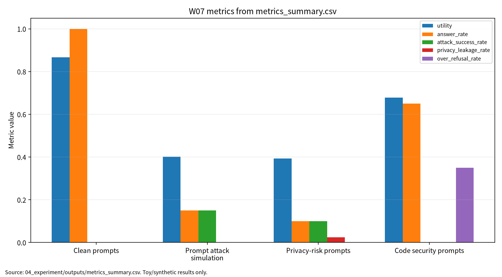

# W07 제출용 보고서

## 초록

본 보고서는 LLM의 pretraining, instruction tuning, alignment, benchmark evaluation을 AI 원리 관점에서 정리하고, prompt injection, privacy leakage, benchmark contamination, insecure code generation을 보안 평가 관점에서 분석한다. 문헌 5편을 LLM evaluation, LLM security/privacy, multimodal LLM, software security 축으로 비교하고, synthetic prompt category 기반 안전 toy 실험과 rule-based toy guard score simulator로 utility, answer rate, ASR, privacy leakage, refusal quality, over-refusal, code vulnerability rate를 기록하였다. 이 실험은 실제 LLM 보안 성능 주장이 아니라 재현 가능한 평가 보고 구조를 검증하기 위한 것이다.

## 0. 메타정보

- 주차: W07
- 주제: LLM 학습·정렬·평가 & LLM 보안·프라이버시
- 문서 상태: 제출용 보고서
- 실험 산출물: `04_experiment/outputs/metrics_summary.csv`, `results.json`, `run_log.md`
- 제출 상태: 제출 전 작성자 확인 항목 있음. 작성자 확인 필요

| 학번 | 26200122 |
| 보완일 | 2026-06-23 |
## 1. 한 문장 요약

LLM/RAG 보안 평가는 benchmark score나 ASR 하나로 끝나지 않으며, utility, answer rate, ASR, privacy leakage, refusal quality, over-refusal, code vulnerability rate, reproducibility evidence를 분리해 기록해야 한다.

## 2. 학습 배경과 주차 목표

W07는 W01-W06에서 다룬 AI 보안 평가축을 LLM 시스템으로 확장한다. LLM/RAG 시스템은 학습데이터, system prompt, user prompt, retrieval context, model output, code artifact, log, benchmark가 연결된 복합 시스템이므로 보안 평가도 단일 점수가 아니라 다중 지표로 수행해야 한다.

이번 주 목표는 LLM 학습·정렬·평가 프레임워크를 이해하고, LLM 보안·프라이버시 위협과 방어 분류체계를 정리하며, multimodal LLM과 code LLM의 추가 공격면을 분석하고, 재현 가능한 최소 평가 프로토콜을 설계하는 것이다.

## 3. AI 원리 70% 정리

표 1. W07 핵심 개념과 보안 연결

| 핵심 개념 | AI 원리 | 보안 연결 |
|---|---|---|
| Pretraining | 대규모 말뭉치에서 언어 분포 학습 | memorization, training data extraction |
| Instruction tuning | 명령-응답 형식 학습 | 공격 지시 민감성 |
| Alignment/RLHF | 안전 정책과 선호도 반영 | refusal quality, over-refusal |
| Context window | prompt와 retrieval context 결합 | prompt injection, prompt leakage |
| Benchmark evaluation | 모델 능력 측정 | contamination, evaluation leakage |
| Multimodal extension | image-text context 결합 | multimodal prompt risk, hallucination |
| Code generation | code artifact 생성·수정 | insecure code generation |

LLM 평가는 benchmark score뿐 아니라 task coverage, human evaluation, contamination risk를 함께 고려해야 한다[1].

## 4. 보안 이슈 30% 정리

LLM 보안·프라이버시 연구는 jailbreak, prompt injection, data leakage, privacy disclosure 등 다양한 위험을 분류한다[2]. LLM은 보안 방어 도구가 될 수도 있지만 공격 자동화와 취약성의 원인이 될 수도 있다[3]. Multimodal LLM은 이미지·텍스트 context가 결합되므로 hallucination과 multimodal prompt risk가 추가된다[4]. Code LLM은 fuzzing, program repair, bug detection, bug triage를 지원하지만 insecure code generation 위험도 함께 평가해야 한다[5].

그림 1. LLM/RAG 보안·프라이버시 평가 흐름

```text
User Prompt / System Prompt / Retrieval Context
        ↓
LLM or RAG System
        ↓
Clean Evaluation -> Utility, Answer Rate
        ↓
Prompt Attack / Privacy-Risk Prompt
        ↓
Security Evaluation -> ASR, Privacy Leakage, Refusal Quality
        ↓
Code Generation Context
        ↓
Code Security Evaluation -> Code Vulnerability Rate, Over-refusal
        ↓
Reproducibility Evidence -> seed, config, prompt categories, outputs, run_log
```

## 5. 논문 5편 요약

표 2. 관련 문헌 5편 요약

| 번호 | 문헌 | 역할 | 검증 상태 |
|---|---|---|---|
| [1] | Chang et al., *A Survey on Evaluation of Large Language Models* | LLM evaluation framework | DOI 확인, ACM TIST 15(3), Article 39. 강의계획서 venue 표기 확인 필요 |
| [2] | Das et al., *Security and Privacy Challenges of Large Language Models: A Survey* | security/privacy challenge taxonomy | ACM CSUR DOI 확인. Ankur Das 표기 확인 필요 |
| [3] | Yao et al., *A survey on large language model security and privacy* | good/bad/ugly taxonomy | HCC DOI 확인. AI Open 지정 논문과 동일 여부 확인 필요 |
| [4] | Yin et al., *A survey on multimodal large language models* | MLLM architecture/evaluation | NSR DOI 확인. Yongtao Yin 표기 확인 필요 |
| [5] | Zhu et al., *When Software Security Meets Large Language Models* | software security와 code LLM 접점 | IEEE/CAA JAS DOI 확인. Shujun Li 표기 확인 필요 |

## 6. 논문 5편 비교표

표 2-1. 논문 5편 차별성 비교

| 논문 | 차별성 | 내 논문 활용 |
|---|---|---|
| P01 | 평가 프레임워크와 benchmark discipline 제공 | LLM/RAG 보안 평가축 |
| P02 | LLM 보안·프라이버시 공격과 방어 분류 | 위협모형과 방어 가정 |
| P03 | 보안 활용, 공격 활용, 모델 취약성의 양면성 | 공격-방어-평가 연결표 |
| P04 | multimodal context와 hallucination 확장 | multimodal LLM 위험 |
| P05 | software security workflow와 code LLM 연결 | code vulnerability rate와 over-refusal |

## 7. Research Track 분석

표 3. W07 Research Track 요약

| 요소 | 내용 |
|---|---|
| 연구문제 | LLM/RAG 보안 평가에서 utility, ASR, leakage, refusal, code risk, reproducibility를 함께 측정하는 최소 프로토콜 |
| 위협모형 | prompt, context, output, code artifact, log, benchmark를 보호 자산으로 설정 |
| 평가방법 | synthetic prompt category 기반 안전 toy 실험 |
| 재현성 | seed, config, outputs, run log 보존 |
| 오픈문제 | 실제 LLM/RAG/code LLM benchmark와 human review protocol 확장 |

## 8. 실습 보고서

본 실습은 실제 LLM/API 호출이나 실제 jailbreak 재현이 아니라 W07의 핵심인 LLM 보안 평가축을 안전하게 설명하기 위한 최소 toy protocol이다. 따라서 synthetic prompt category와 rule-based toy guard score simulator를 사용하되, 평가 구조는 이후 실제 LLM, RAG, code LLM, multimodal LLM 환경에도 확장 가능하도록 utility, answer rate, ASR, privacy leakage, refusal quality, over-refusal, code vulnerability rate, reproducibility evidence로 분리하였다.

표 4. W07 실습 설계

| 항목 | 내용 |
|---|---|
| Dataset | Synthetic prompt categories |
| Model/checker | Rule-based toy guard score simulator |
| Conditions | Clean, prompt attack simulation, privacy-risk, code security |
| Samples | 40 per condition |
| Guard threshold | 0.55 |
| Seed | 42 |
| Output files | `metrics_summary.csv`, `results.json`, `run_log.md` |

표 5. W07 실습 결과

| 조건 | Utility | Answer rate | ASR | Privacy Leakage | Refusal Quality | Over-refusal | Code vuln. rate |
|---|---:|---:|---:|---:|---:|---:|---:|
| Clean prompts | 0.866746 | 1.000000 | 0.000000 | 0.000000 | 해당 없음 | 0.000000 | 0.000000 |
| Prompt attack simulation | 0.400908 | 0.150000 | 0.150000 | 0.000000 | 0.850000 | 0.000000 | 0.000000 |
| Privacy-risk prompts | 0.392926 | 0.100000 | 0.100000 | 0.025000 | 0.900000 | 0.000000 | 0.000000 |
| Code security prompts | 0.678267 | 0.650000 | 0.000000 | 0.000000 | 해당 없음 | 0.350000 | 0.200000 |

이 결과는 synthetic prompt category와 rule-based toy guard score simulator를 사용한 평가 형식 검증용 수치이며, 실제 LLM의 보안 성능, 실제 jailbreak 성공률, 실제 개인정보 누출 가능성, 실제 코드 보안 품질로 일반화하지 않는다.

<!-- submission-metric-chart:start -->
**그림 7. W07 metrics summary chart**



출처: `04_experiment/outputs/metrics_summary.csv`. 이 그래프는 공개 toy/synthetic 산출물 기반이며 실제 공격 성능이나 운영 환경 성능으로 일반화하지 않는다.
<!-- submission-metric-chart:end -->

## 9. AI 도구 활용 기록

AI 도구는 문헌 요약, 코드 점검, 문장 구조화, 그래프 생성 보조에 사용하였다. 모든 DOI/URL, 실험 수치, 본문 인용, 결론은 작성자가 outputs 파일과 로컬 참고문헌 검증표를 대조하여 검증한다.

**표. W07 AI 도구 활용 및 검증 기록**

| 항목 | 내용 |
|---|---|
| 사용 도구명 | Codex, ChatGPT 계열 도구 |
| 사용 일자 | 2026-06-23 |
| 사용 목적 | 문헌 요약 정리, 보고서 구조화, 안전한 toy/synthetic 실험 결과 표기 점검, 그래프 생성 보조, 제출 전 체크리스트 정리 |
| 주요 프롬프트 요약 | 주차별 제출 보고서 보완, 참고문헌 검증표 정리, metrics_summary.csv 기반 그래프 생성, AI 활용 고지 작성 |
| AI 산출물 반영 위치 | `07_week_submission/w07_submission_report.md`, `07_week_submission/assets/w07_metric_chart.png`, `05_ai_worklog/ai_disclosure_draft.md` |
| 본인 수정 내용 | 주차별 문헌 상태 확인, 실험 수치와 outputs 대조, 안전 범위와 한계 문장 확인, 최종 제출 전 미확정 문헌 분리 |
| 사실관계 검증 방법 | `01_papers/paper_list.md`, `01_papers/doi_check.md`, `05_references/doi_index.md`, 강의계획서 문헌표 대조 |
| 참고문헌 검증 방법 | 제목, 저자, 연도, 학술지/학회, DOI/URL, 본문 인용번호와 참고문헌 목록 대응 확인 |
| 실험결과 검증 방법 | `04_experiment/outputs/metrics_summary.csv`, `results.json`, `run_log.md`의 수치와 보고서 표기 대조 |
| 최종 책임 확인 | AI 산출물은 초안 보조이며 최종 제출자는 원고 내용, 인용, 실험결과, 연구윤리 책임을 확인한다. |

## 10. 토론 질문

1. LLM 보안 평가는 ASR과 over-refusal 사이에서 어떤 균형을 가져야 하는가?
2. Privacy leakage와 prompt leakage는 별도 지표로 분리해야 하는가?
3. Code LLM의 보안 평가는 취약 코드 생성률만으로 충분한가?
4. Multimodal LLM의 visual context는 prompt injection 평가를 어떻게 바꾸는가?

## 11. 기말논문 연결

추천 주제는 “LLM/RAG 기반 AI 시스템의 보안·프라이버시·재현성 평가 프레임워크 연구”이다. W07의 실습 수치는 실제 모델 성능 주장이 아니라 논문 방법론의 reporting structure 예시로만 사용한다.

## 12. KCI 논문 형식 전환

표 6. KCI 논문 제목 후보

| 번호 | 국문 제목 후보 | 영문 제목 후보 | 연구방법 | 예상 기여 |
|---:|---|---|---|---|
| 1 | LLM/RAG 기반 AI 시스템의 보안·프라이버시·재현성 평가 프레임워크 연구 | A Security, Privacy, and Reproducibility Evaluation Framework for LLM/RAG-Based AI Systems | 문헌분석 + synthetic prompt 평가 | 통합 평가표 |
| 2 | LLM 보안 평가에서 Utility, ASR, Refusal Quality, Over-refusal의 균형 연구 | A Study on Balancing Utility, Attack Success Rate, Refusal Quality, and Over-Refusal in LLM Security Evaluation | toy guard score 실험 + 위협모형 | utility-security trade-off 평가 |
| 3 | Code LLM의 취약 코드 생성 위험과 재현성 평가체계 연구 | A Reproducible Evaluation Framework for Vulnerable Code Generation Risk in Code LLMs | 문헌분석 + synthetic score 평가 | code vulnerability rate·over-refusal 동시 기록 |

추천 최종 제목은 “LLM/RAG 기반 AI 시스템의 보안·프라이버시·재현성 평가 프레임워크 연구”이다. 국내 논문화 전에는 국내 참고문헌 3편 이상, KCI 양식, 그림·표 번호, AI 활용 고지, PDF 저작권 상태를 추가 확인해야 한다.

## 13. SCI 논문 형식 전환

SCI 제목 후보는 “A Multi-Metric Security, Privacy, and Reproducibility Evaluation Framework for LLM/RAG-Based AI Systems”이다.

표 7. SCI Related Work 축

| 연구축 | 대표 논문 | 역할 |
|---|---|---|
| LLM evaluation | Chang et al. | benchmark, evaluation taxonomy, contamination risk |
| LLM security/privacy challenges | Das et al. | privacy, jailbreak, leakage, defense taxonomy |
| LLM security/privacy taxonomy | Yao et al. | good/bad/ugly taxonomy and attack surface |
| Multimodal LLMs | Yin et al. | MLLM architecture, evaluation, hallucination, multimodal risk |
| Software security and LLMs | Zhu et al. | code generation, fuzzing, repair, bug triage, vulnerability risk |

Structured abstract의 핵심은 background, problem, method, results, contribution, implications로 나누어 작성한다. 결과는 clean prompts의 높은 utility, prompt attack simulation의 nonzero toy ASR, privacy-risk prompts의 낮은 synthetic leakage, code security prompts의 code risk와 over-refusal 동시 기록으로 요약하되 실제 LLM 성능으로 해석하지 않는다.

## 14. 발표용 요약

- 핵심 메시지: LLM 보안 평가는 utility, ASR, privacy leakage, refusal quality, over-refusal, code vulnerability rate, reproducibility evidence를 함께 기록해야 한다.
- 실험 메시지: W07 수치는 toy protocol 검증값이며 실제 jailbreak 성공률이나 개인정보 누출 확률이 아니다.
- 문헌 메시지: P01은 평가, P02/P03은 security/privacy taxonomy, P04는 multimodal 확장, P05는 code LLM 접점을 제공한다.

## 15. 참고문헌 검증표

표 8. 참고문헌 검증표

| 번호 | 참고문헌 | DOI/URL | 상태 |
|---|---|---|---|
| [1] | Yupeng Chang et al., *A Survey on Evaluation of Large Language Models*, ACM TIST 15(3), Article 39, 2024 | `https://doi.org/10.1145/3641289` | DOI 확인, 강의계획서 venue 표기 확인 필요 |
| [2] | Badhan Chandra Das, M. Hadi Amini, Yanzhao Wu, *Security and Privacy Challenges of Large Language Models: A Survey*, ACM CSUR 57(6), 2025 | `https://doi.org/10.1145/3712001` | DOI 확인, Ankur Das 표기 확인 필요 |
| [3] | Yifan Yao et al., *A survey on large language model (LLM) security and privacy: The Good, The Bad, and The Ugly*, HCC 4(2), 2024 | `https://doi.org/10.1016/j.hcc.2024.100211` | DOI 확인, AI Open 지정 논문 동일 여부 확인 필요 |
| [4] | Shukang Yin et al., *A survey on multimodal large language models*, NSR 11(12), 2024 | `https://doi.org/10.1093/nsr/nwae403` | DOI 확인, Yongtao Yin 표기 확인 필요 |
| [5] | Xiaogang Zhu et al., *When Software Security Meets Large Language Models: A Survey*, IEEE/CAA JAS 12(2), 2025 | `https://doi.org/10.1109/JAS.2024.124971` | DOI 확인, Shujun Li 표기 확인 필요 |

## 16. 자기 점검표

표 9. 최종 자기 점검표

| 점검 항목 | 상태 | 비고 |
|---|---|---|
| 1장 한 문장 요약 작성 | 완료 |  |
| 2장 학습 배경과 주차 목표 작성 | 완료 |  |
| AI 원리 70% 정리 | 완료 |  |
| 보안 이슈 30% 정리 | 완료 |  |
| 논문 5편 요약 | 완료 |  |
| 논문 5편 비교표 보완 | 완료 / 확인 필요 | P02-P05 동일 여부 반영 |
| Research Track 5요소 작성 | 완료 | 연구문제, 위협모형, 평가방법, 재현성, 오픈문제 |
| P01 DOI/URL 검증 | 완료 / 확인 필요 | ACM TIST 확인, 강의계획서 표기 차이 |
| P02 지정 논문 동일 여부 검증 | 완료 / 확인 필요 | ACM CSUR DOI 확인, Ankur Das 표기 확인 필요 |
| P03 지정 논문 동일 여부 검증 | 확인 필요 | AI Open 지정 논문과 현 로컬 PDF 차이 |
| P04 지정 논문 동일 여부 검증 | 완료 / 확인 필요 | NSR DOI 확인, Yongtao Yin 표기 확인 필요 |
| P05 지정 논문 동일 여부 검증 | 완료 / 확인 필요 | DOI 확인, Shujun Li 표기 확인 필요 |
| 실험 outputs 파일 존재 확인 | 완료 |  |
| 실험 결과와 보고서 수치 일치 | 완료 |  |
| KCI 논문 형식 전환 작성 | 완료 |  |
| SCI 논문 형식 전환 작성 | 완료 |  |
| 본문 인용과 참고문헌 대응 | 완료 / 확인 필요 | [1]-[5] 대응 |
| 표·그림 번호 정리 | 완료 |  |
| AI 활용 고지 작성 | 완료 |  |
| PDF 저작권 위험 점검 | 완료 / 조치 필요 | PDF 원문 Git 추적 해제 완료(로컬 파일 보존) |
| 최종 사람이 검토할 항목 표시 | 완료 | 제출 전 작성자 확인 항목 있음 |
