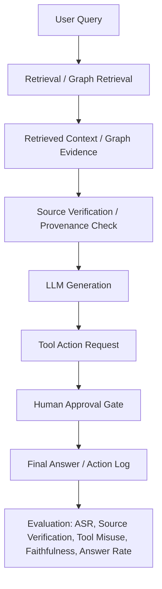
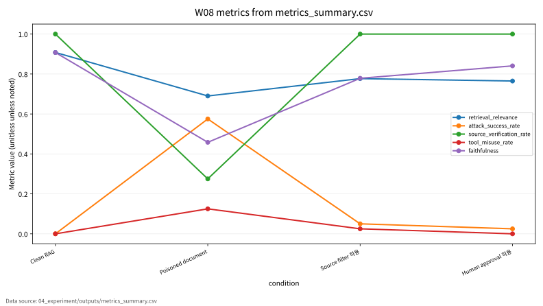
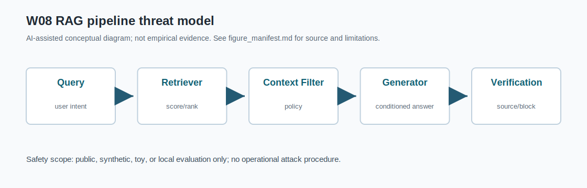

# W08 RAG·프롬프팅 프레임워크 & 프롬프트 인젝션 통합보고서

## 0. 메타정보

| 항목 | 내용 |
|---|---|
| 주차 | W08 |
| 주제 | RAG·프롬프팅 프레임워크 & 프롬프트 인젝션 |
| 문서 상태 | 제출용 최종 초안, 최종 제출 확정 아님 |
| 작성·보완일 | 2026-06-22 ~ 2026-06-23 |
| 실험 근거 | `04_experiment/outputs/metrics_summary.csv`, `results.json`, `run_log.md` |
| 안전 범위 | synthetic RAG 문서 기반 toy 실험. 실제 LLM/API 호출, 실제 외부 시스템 공격, 개인정보 사용, live tool invocation 없음 |

## 1. 한 문장 요약

W08은 RAG/GraphRAG와 prompting framework를 LLM application 구조로 이해하고, retrieved context·graph evidence·tool action에 유입되는 indirect prompt injection을 source verification, provenance check, human approval gate로 평가하는 주차다[1][2][3][4][5].

## 2. 학습 배경과 주차 목표

### 2.1 이번 주 주제의 위치

W08은 W07의 LLM 보안·프라이버시 평가를 RAG와 agentic LLM application으로 확장하는 주차다. W07이 LLM의 prompt, context, output, log, benchmark를 보호 자산으로 보았다면, W08은 여기에 retrieval source, vector DB, graph node/edge, retrieved context, tool permission, human approval gate를 추가한다. W08의 핵심은 LLM이 직접 입력받은 user prompt뿐 아니라 검색된 문서와 graph element, tool result에 포함된 간접 지시에도 영향을 받을 수 있다는 점이다. 이후 W09 agent/DRL 보안, W10 federated learning, W14 MLOps supply chain, 기말논문의 RAG 보안 평가 프레임워크와 연결된다.

### 2.2 강의계획서상 학습목표

- RAG, GraphRAG, retrieval, reranking, generation의 기본 구조를 이해한다.
- Prompting framework의 data/base/execute/service level을 정리한다.
- Direct/indirect prompt injection과 RAG 문서 오염의 위협모형을 정의한다.
- Source verification, tool permission, human approval gate를 포함한 방어 평가 지표를 설계한다.

### 2.3 이번 주 핵심 질문

1. RAG 시스템에서 retrieved context는 왜 새로운 공격면이 되는가?
2. GraphRAG에서는 node, edge, path, subgraph provenance를 어떻게 검증해야 하는가?
3. Source filter는 ASR과 faithfulness, answer rate에 어떤 영향을 주는가?
4. Human approval gate는 tool misuse를 줄이지만 어떤 usability cost를 만드는가?
5. W08의 synthetic RAG 실험을 KCI 또는 SCI 논문 주제로 발전시키려면 어떤 연구문제가 적절한가?

## 3. AI 원리 70% 정리

표 1. W08 핵심 개념과 보안 연결

| 개념 | AI 원리 | 보안 연결 |
|---|---|---|
| RAG | 외부 문서를 검색해 LLM context에 넣고 생성 품질과 최신성을 보완한다. | 검색 문서가 오염되면 indirect prompt injection 경로가 된다. |
| GraphRAG | node, edge, path, subgraph 같은 관계 구조를 검색·생성에 활용한다[1]. | poisoned edge/path, forged provenance, graph source spoofing이 가능하다. |
| Graph-based RAG | graph 기능을 database, algorithm, pipeline, task 수준으로 분해한다[2]. | 검증 대상이 문서 단위에서 graph element 단위로 확장된다. |
| Prompting framework | data/base/execute/service level로 LLM application 생명주기를 설명한다[3]. | data level 오염, execute level tool misuse, service level audit gap을 구분한다. |
| Prompt injection | 명령과 데이터의 경계가 흐릴 때 모델 행동이 조작된다[4]. | direct, indirect, multimodal injection과 방어 지표가 필요하다. |
| Safety-critical LLM | 의료처럼 잘못된 답변이 실제 피해로 이어질 수 있는 영역이다[5]. | human approval, domain review, redacted testing이 필요하다. |

GraphRAG는 검색 대상이 단순 문서에서 graph node, edge, path, subgraph로 확장되기 때문에 provenance 검증이 중요하다[1]. Graph-based RAG는 database, algorithm, pipeline, task 수준에서 graph 기능을 RAG pipeline에 결합한다[2]. Prompting framework는 data, base, execute, service level로 LLM application의 prompt와 tool orchestration을 설명한다[3].

## 4. 보안 이슈 30% 정리

Prompt injection 연구는 direct, indirect, multimodal injection과 방어 전략을 체계화한다[4]. Safety-critical domain에서는 prompt injection이 잘못된 의료 조언과 같은 실제 피해로 연결될 수 있다[5].

그림 1. RAG 간접 프롬프트 인젝션 평가 흐름

W08의 핵심 보안 가정은 retrieved context를 신뢰하기 전에 source, provenance, tool permission, human approval을 검증해야 한다는 것이다. 특히 agentic RAG에서는 응답 생성과 외부 action이 결합되므로 tool permission policy와 audit log가 필요하다.

## 5. 논문 5편 요약

표 2. 관련 문헌 5편 요약

| ID | 문헌 | 핵심 기여 | 검증 상태 |
|---|---|---|---|
| P01 | Peng et al., *Graph Retrieval-Augmented Generation: A Survey* | GraphRAG workflow와 graph-based indexing/retrieval/generation 정리 | arXiv `2408.08921` 확인, DOI 미확정, 강의계획서 Shiyu Chen et al. 표기 동일 여부 확인 필요 |
| P02 | Zhu et al., *Graph-Based Approaches and Functionalities in Retrieval-Augmented Generation: A Comprehensive Survey* | graph 기능을 database, algorithm, pipeline, task로 분류 | DOI `10.1145/3795880` 확인, 강의계획서 Jianxiang Li et al. 표기 확인 필요 |
| P03 | Liu et al., *Prompting Frameworks for Large Language Models: A Survey* | prompting framework의 data/base/execute/service level 정리 | DOI `10.1145/3789253` 확인 |
| P04 | Geng et al., *Prompt Injection Attacks on Large Language Models* | prompt injection 공격·원인·방어 taxonomy | DOI `10.32604/cmc.2025.074081` 확인, Tianlei/Tongcheng 표기 확인 필요 |
| P05 | Lee et al., *Vulnerability of LLMs to Prompt Injection When Providing Medical Advice* | safety-critical medical advice domain의 취약성 사례 | DOI `10.1001/jamanetworkopen.2025.49963` 확인, 강의계획서 제목 동일 여부 확인 필요 |

주의: W08의 P01은 arXiv:2408.08921 기준으로 확인했으나, PDF 내부 DOI가 placeholder이므로 DOI를 확정하지 않는다. 강의계획서의 Shiyu Chen et al. / ACM Computing Surveys 2025 표기와 현재 로컬 PDF의 Boci Peng et al. 표기가 동일 논문을 가리키는지 최종 확인이 필요하다.

주의: W08의 P05는 현재 로컬 PDF 기준 제목과 강의계획서 지정 제목이 다르므로, 동일 논문 여부와 최종 JAMA Network Open 서지정보를 확인 필요 상태로 유지한다.

## 6. 논문 5편 비교표

| 논문 | 연구문제 | 핵심 방법 | 데이터/실험 | AI 원리 기여 | 보안 위협 연결 | 평가 지표 | 한계 | 내 논문 활용 |
|---|---|---|---|---|---|---|---|---|
| P01 | GraphRAG는 어떤 workflow와 기술 요소로 구성되는가 | GraphRAG workflow survey | arXiv/PDF 기준 문헌조사 | graph-based retrieval, node/edge/path/subgraph reasoning | graph node/edge poisoning, context manipulation | downstream task, retrieval/generation evaluation, graph provenance | DOI placeholder, ACM 출판정보 확인 필요 | GraphRAG 단계별 공격면 정의 |
| P02 | Graph 기능은 RAG pipeline에서 어떤 역할을 하는가 | graph functionality taxonomy | ACM CSUR survey | graph-based augmentation과 provenance 확장 | poisoned edge/path, source spoofing, provenance failure | graph function category, retrieval quality, source verification | 강의계획서 저자명 차이 확인 필요 | source verification 범위를 graph element까지 확장 |
| P03 | Prompting framework는 LLM application 생명주기를 어떻게 설명하는가 | data/base/execute/service level taxonomy | ACM CSUR survey | prompt, tool, service orchestration 구조 | tool instruction pollution, prompt boundary failure, service-level audit gap | framework layer, lifecycle component, audit point | 공격 성공률 직접 실험은 아님 | agentic RAG trust boundary 설계 |
| P04 | Prompt injection의 공격 유형, 원인, 방어는 무엇인가 | systematic review | 2022-2025년 연구 종합 | instruction/data boundary 실패 설명 | direct/indirect/multimodal injection, tool misuse | ASR, detection rate, protection rate | 연구별 환경 차이로 수치 직접 비교 제한 | ASR/source/tool 지표의 보안 근거 |
| P05 | Safety-critical domain에서 prompt injection은 어떤 피해를 만들 수 있는가 | medical advice vulnerability study | patient-LLM dialogue 또는 의료 조언 시나리오 | 안전중요 도메인에서 LLM application 평가 | unsafe medical advice, persistence, harm potential | injection success, persistence, harm level | 의료 도메인 중심, 강의계획서 제목 차이 확인 필요 | approval gate와 domain review 필요성 근거 |

종합하면 P01/P02는 GraphRAG와 graph-based RAG 구조 문헌, P03은 prompting framework와 agentic LLM application layer 문헌, P04는 prompt injection taxonomy와 방어전략 문헌, P05는 safety-critical medical advice 사례 문헌이다.

## 7. Research Track 분석

표 3. W08 Research Track 요약

| 항목 | 내용 |
|---|---|
| 연구문제 | RAG/GraphRAG에서 indirect prompt injection을 source verification과 human approval gate로 얼마나 줄일 수 있는가 |
| 대상 시스템 | RAG 기반 LLM system, GraphRAG system, tool-using agent |
| 보호 자산 | retrieved documents, graph nodes/edges, vector DB, system prompt, generated answer, tool permissions, audit logs |
| 공격자 능력 | document poisoning, source spoofing, indirect instruction injection, graph edge/path manipulation, tool action manipulation |
| 방어 | source filter, provenance metadata validation, tool permission policy, human approval gate |
| 평가 지표 | Retrieval relevance, ASR, source verification, tool misuse rate, faithfulness, answer rate, source block rate, human block rate |
| 제외 범위 | 실제 외부 시스템 공격, live tool invocation, 개인정보 사용, 안전중요 실서비스 조작 |

## 8. 실습 보고서

표 4. W08 실습 설계

| 항목 | 설명 |
|---|---|
| Dataset | Synthetic RAG documents |
| Evaluator | Rule-based toy RAG prompt-injection evaluator |
| Conditions | Clean RAG, poisoned document, source filter, human approval |
| Samples | 40 per condition |
| Risk threshold | 0.55 |
| Seed | 42 |
| Output files | `metrics_summary.csv`, `results.json`, `run_log.md` |

표 5. W08 실습 결과

| 조건 | Retrieval Relevance | ASR | Source Verification | Tool Misuse Rate | Faithfulness | Answer Rate | Source Block Rate | Human Block Rate |
|---|---:|---:|---:|---:|---:|---:|---:|---:|
| Clean RAG | 0.907887 | 0.000000 | 1.000000 | 0.000000 | 0.907613 | 0.950000 | 0.000000 | 0.000000 |
| Poisoned document | 0.690091 | 0.575000 | 0.275000 | 0.125000 | 0.458069 | 0.875000 | 0.000000 | 0.000000 |
| Source filter 적용 | 0.776926 | 0.050000 | 1.000000 | 0.025000 | 0.778693 | 0.800000 | 0.892857 | 0.000000 |
| Human approval 적용 | 0.764926 | 0.025000 | 1.000000 | 0.000000 | 0.840805 | 0.575000 | 0.814815 | 1.000000 |

Poisoned document 조건에서는 ASR이 0.575000, tool misuse rate가 0.125000으로 나타났다. Source filter 적용 후 ASR은 0.050000으로 낮아졌고, source verification은 1.000000으로 올라갔다. Human approval 적용 조건에서는 ASR이 0.025000, tool misuse rate가 0.000000이었으나 answer rate는 0.575000으로 낮아졌다.

이 결과는 synthetic RAG document와 rule-based toy evaluator를 사용한 평가 형식 검증용 수치이며, 실제 LLM 보안 성능이나 실제 RAG 제품의 안전성으로 일반화하지 않는다.

## 9. AI 도구 활용 기록

AI는 논문 요약 보강, DOI/URL 검증 보조, 개념 설명, 문장 구조화, synthetic RAG 실험 코드 작성, 발표자료 작성, KCI/SCI 섹션 보완에 사용되었다. AI 산출물 반영 위치는 W08 하위 Markdown, Python, HTML, 실험 보고서 파일이다. 최종 제출자는 원고의 내용, 인용, 실험결과, 연구윤리 책임을 확인해야 한다.

세부 고지는 `05_ai_worklog/ai_disclosure_draft.md`에 작성했다.

## 10. 토론 질문

1. RAG 보안에서 ASR 감소와 answer rate 유지 중 어느 쪽을 우선해야 하는가?
2. GraphRAG에서 source verification은 문서 단위, node 단위, edge 단위 중 어디까지 확장해야 하는가?
3. Human approval gate는 어떤 risk threshold에서 자동화와 사람 검토의 균형을 잡아야 하는가?
4. Safety-critical domain에서 RAG 시스템은 어떤 action을 반드시 사람 승인 대상으로 분류해야 하는가?

## 11. 기말논문 연결

추천 주제는 "RAG 기반 생성형 AI 시스템에서 간접 프롬프트 인젝션 대응을 위한 출처 검증·승인 게이트 평가 프레임워크"다. 관련연구는 GraphRAG workflow[1], graph-based RAG functionality[2], prompting framework[3], prompt injection taxonomy[4], medical prompt injection vulnerability[5]를 축으로 구성한다.

기여는 다음 세 가지로 정리할 수 있다.

1. RAG/GraphRAG의 source/provenance 검증 대상을 문서, node, edge, path, subgraph로 확장한다.
2. ASR, source verification, tool misuse, faithfulness, answer rate를 분리해 보고하는 multi-metric 평가표를 제안한다.
3. Source filter와 human approval gate의 security-usability trade-off를 toy protocol로 설명한다.

## 12. KCI 논문 형식 전환

### 12.1 KCI형 제목 후보

표 6. KCI 논문 제목 후보

| 번호 | 국문 제목 후보 | 영문 제목 후보 | 대상 시스템 | 보안 위협 | 연구방법 | 예상 기여 |
|---:|---|---|---|---|---|---|
| 1 | RAG 기반 생성형 AI 시스템에서 간접 프롬프트 인젝션 대응을 위한 출처 검증·승인 게이트 평가 프레임워크 연구 | An Evaluation Framework for Source Verification and Human Approval Gates Against Indirect Prompt Injection in RAG-Based Generative AI Systems | RAG/GraphRAG 시스템 | Indirect prompt injection, document poisoning | 문헌분석 + synthetic RAG 실험 | ASR·source verification·tool misuse 통합 평가표 |
| 2 | 보안형 RAG 시스템의 문서·Graph 출처 검증 메타데이터 설계 연구 | A Study on Document and Graph Provenance Metadata for Secure RAG Systems | RAG + Vector DB + Graph DB | source spoofing, poisoned edge/path | 프레임워크 설계 + 체크리스트 | source/provenance 평가 기준 |
| 3 | LLM 에이전트의 Tool 권한 오남용 방지를 위한 Human Approval Gate 연구 | A Study on Human Approval Gates for Preventing Tool Misuse in LLM Agents | Agentic RAG | tool misuse, context hijacking | toy 실험 + 정책 설계 | approval gate와 answer rate trade-off 분석 |

### 12.2 추천 최종 제목

- 국문: RAG 기반 생성형 AI 시스템에서 간접 프롬프트 인젝션 대응을 위한 출처 검증·승인 게이트 평가 프레임워크 연구
- 영문: An Evaluation Framework for Source Verification and Human Approval Gates Against Indirect Prompt Injection in RAG-Based Generative AI Systems

### 12.3 국문초록 초안

본 연구는 RAG 기반 생성형 AI 시스템에서 검색 문서와 graph element를 통해 유입되는 간접 프롬프트 인젝션에 대응하기 위한 출처 검증 및 승인 게이트 평가 프레임워크를 제안한다. GraphRAG, graph-based RAG, prompting framework, prompt injection taxonomy, safety-critical LLM 취약성 관련 선행연구를 비교하고, retrieval relevance, attack success rate, source verification rate, tool misuse rate, faithfulness, answer rate, reproducibility evidence의 평가축을 도출한다. 또한 실제 LLM/API 호출이나 실제 외부 시스템 조작 없이 synthetic RAG document와 rule-based toy evaluator를 활용하여 clean RAG, poisoned document, source filter, human approval gate 조건을 비교한다. 본 연구는 실제 RAG 제품의 보안성을 주장하지 않고, RAG 보안 평가를 위한 재현 가능한 보고 구조와 출처 검증·승인 게이트 체크리스트를 제시하는 데 목적이 있다.

### 12.4 영문초록 초안

This study proposes an evaluation framework for source verification and human approval gates against indirect prompt injection in RAG-based generative AI systems. By reviewing studies on GraphRAG, graph-based RAG, prompting frameworks, prompt injection attacks, and safety-critical LLM vulnerabilities, this report derives evaluation axes including retrieval relevance, attack success rate, source verification rate, tool misuse rate, faithfulness, answer rate, and reproducibility evidence. A safe toy experiment using synthetic RAG documents and a rule-based evaluator is used to compare clean RAG, poisoned document, source filter, and human approval gate conditions without calling real LLM APIs or invoking live tools. The goal is not to claim real-world RAG security performance, but to demonstrate a reproducible evaluation structure for RAG prompt-injection defense.

### 12.5 키워드

| 구분 | 키워드 |
|---|---|
| 국문 | RAG, GraphRAG, 프롬프트 인젝션, 간접 인젝션, 출처 검증, Tool 오남용, Human Approval |
| 영문 | RAG, GraphRAG, Prompt Injection, Indirect Injection, Source Verification, Tool Misuse, Human Approval |

### 12.6 연구문제

- RQ1. RAG 시스템에서 간접 프롬프트 인젝션은 retrieval, context construction, generation, tool action 중 어느 단계에서 가장 큰 위험을 유발하는가?
- RQ2. Source filter는 ASR, source verification, faithfulness, answer rate에 어떤 영향을 주는가?
- RQ3. Human approval gate는 tool misuse rate를 줄이는 대신 answer rate에 어떤 비용을 만드는가?

### 12.7 연구방법

- 문헌분석: W08 논문 5편을 GraphRAG, graph-based RAG, prompting framework, prompt injection taxonomy, safety-critical LLM 취약성 축으로 비교한다.
- 위협모형: 검색 문서, graph node/edge, vector DB, system prompt, retrieved context, tool permission, audit log를 보호 자산으로 설정한다.
- 모의실험: synthetic RAG document 기반 clean RAG, poisoned document, source filter, human approval gate 조건을 평가한다.
- 평가방법: retrieval relevance, ASR, source verification rate, tool misuse rate, faithfulness, answer rate, source block rate, human block rate, reproducibility evidence를 기록한다.
- 한계분석: rule-based toy evaluator와 synthetic document의 외적 타당성 한계를 명시한다.

### 12.8 보안적 함의

- Confidentiality: retrieved context와 system prompt가 노출될 수 있다.
- Integrity: 오염 문서와 graph element는 답변과 tool action을 왜곡할 수 있다.
- Safety: 의료·금융·법률 등 안전중요 영역에서는 자동 답변보다 승인 게이트가 필요할 수 있다.
- Accountability: source metadata, graph provenance, tool permission, run log가 보존되어야 한다.
- Usability: human approval gate는 tool misuse를 줄이지만 answer rate를 낮출 수 있다.
- Reproducibility: 실험 수치는 outputs 파일과 보고서 수치가 일치해야 한다.

### 12.9 KCI 제출 가능성 점검표

| 점검 항목 | 상태 |
|---|---|
| 국문·영문 제목 후보 작성 | 완료 |
| 국문초록 초안 작성 | 완료 |
| 영문초록 초안 작성 | 완료 |
| 키워드 작성 | 완료 |
| 연구문제 작성 | 완료 |
| 연구방법 작성 | 완료 |
| 표 1개 이상 포함 | 완료 |
| 그림 1개 이상 포함 | 완료 |
| 국내 참고문헌 3편 이상 | 확인 필요 |
| 해외 참고문헌 5편 이상 | W08 기준 완료, P01/P02/P04/P05 동일 여부 검증 필요 |
| AI 활용 고지 | 완료 |
| 실험 outputs 파일 존재 | 완료 |

## 13. SCI 논문 형식 전환

### 13.1 SCI 제목 후보

A Multi-Metric Evaluation Framework for Source Verification and Human Approval Gates Against Indirect Prompt Injection in RAG-Based LLM Systems

### 13.2 Structured Abstract

#### Background

Retrieval-augmented generation systems extend LLM behavior by injecting external documents, graph elements, and tool outputs into the model context. This creates a new attack surface in which untrusted retrieved content can influence generation and tool actions.

#### Problem

Existing evaluations often focus on retrieval relevance or answer quality, while underreporting indirect prompt injection, document poisoning, source spoofing, tool misuse, faithfulness degradation, and approval-gate trade-offs.

#### Method

This study synthesizes five representative studies on GraphRAG, graph-based RAG functionality, prompting frameworks, prompt injection attacks, and safety-critical prompt injection vulnerabilities. A safe synthetic toy experiment is used to illustrate separate reporting of retrieval relevance, attack success rate, source verification, tool misuse rate, faithfulness, answer rate, source block rate, and human block rate.

#### Results

The W08 toy experiment shows that poisoned retrieved documents increase ASR and tool misuse rate, while source filtering substantially reduces ASR. Human approval gates further reduce tool misuse but lower answer rate, showing a usability-security trade-off. These results should not be interpreted as real-world RAG security performance.

#### Contribution

The main contribution is a multi-metric evaluation structure that integrates source verification, tool permission, human approval, faithfulness, ASR, and reproducibility evidence for RAG prompt-injection defense.

#### Implications

The framework can be extended to GraphRAG provenance, agentic tool-use governance, safety-critical RAG applications, enterprise AI search, MLOps audit logging, and human-in-the-loop AI security.

### 13.3 Introduction 구성

- RAG/GraphRAG 시스템의 확산
- retrieved context가 새로운 공격면이 되는 이유
- direct prompt injection과 indirect prompt injection의 차이
- source verification과 provenance의 필요성
- tool misuse와 human approval gate의 필요성
- 본 연구의 contribution

### 13.4 Related Work 축

표 7. SCI Related Work 축

| 연구축 | 대표 논문 | 역할 |
|---|---|---|
| GraphRAG workflow | Peng et al. 또는 현재 P01 | GraphRAG indexing, retrieval, generation workflow |
| Graph-based RAG functionality | Zhu et al. | database, algorithm, pipeline, task 수준의 graph 기능 |
| Prompting framework | Liu et al. | data/base/execute/service level prompt orchestration |
| Prompt injection taxonomy | Geng et al. | attack methods, root causes, defense strategies |
| Safety-critical prompt injection | Lee et al. | medical advice domain vulnerability and harm potential |

### 13.5 Threat Model

- Target system: RAG-based LLM system, GraphRAG system, tool-using agent
- Protected assets: retrieved documents, graph nodes/edges, vector DB, system prompt, user context, generated answer, tool permissions, audit logs
- Adversary knowledge: black-box, content provider, malicious document author, compromised graph source
- Adversary capability: document poisoning, source spoofing, indirect instruction injection, graph edge/path manipulation, tool action manipulation
- Attack success condition: malicious instruction reflected in answer, untrusted source used as evidence, unauthorized tool action executed
- Defense/check: source filter, provenance metadata validation, tool permission policy, human approval gate
- Excluded scope: real external system attack, live tool invocation, personal data use, safety-critical live system manipulation

### 13.6 Methodology

- Literature matrix construction
- RAG threat model design
- Synthetic RAG document condition construction
- Clean RAG baseline
- Poisoned document simulation
- Source filter evaluation
- Human approval gate evaluation
- Reproducibility evidence collection

### 13.7 Experimental Setup

| Item | Description |
|---|---|
| Dataset | Synthetic RAG documents |
| Evaluator | Rule-based toy RAG prompt-injection evaluator |
| Conditions | Clean RAG, poisoned document, source filter, human approval |
| Samples | 40 per condition |
| Risk threshold | 0.55 |
| Metrics | Retrieval relevance, ASR, source verification rate, tool misuse rate, faithfulness, answer rate, source block rate, human block rate |
| Environment | Ubuntu 24.04 / Docker / Python 3.11 target, local Python 3.12 check |
| Seed | 42 |
| Output files | metrics_summary.csv, results.json, run_log.md |

### 13.8 Results

결과는 표 5와 같다. outputs 파일이 존재하며 CSV, JSON, run log의 조건별 수치가 일치한다.

### 13.9 Discussion

- RAG 보안은 answer quality만으로 평가할 수 없다.
- Poisoned document 조건은 ASR과 tool misuse를 증가시킬 수 있다.
- Source filter는 ASR을 낮추지만 retrieval relevance와 answer rate에 영향을 줄 수 있다.
- Human approval gate는 tool misuse를 줄이지만 answer rate를 낮출 수 있다.
- Faithfulness는 source verification과 함께 봐야 한다.
- Synthetic toy evaluator 결과는 실제 RAG 제품 보안성을 의미하지 않는다.

### 13.10 Limitations and Threats to Validity

- Internal validity: rule-based toy evaluator는 실제 LLM/RAG behavior를 대표하지 않는다.
- External validity: synthetic documents는 실제 웹페이지, PDF, vector DB, graph DB, tool results를 대표하지 않는다.
- Construct validity: ASR, source verification, tool misuse rate는 toy score 기반 지표이며 실제 prompt injection 성공률이 아니다.
- Reproducibility: outputs 파일과 보고서 수치의 일치가 필요하다.
- Literature validity: P01~P05의 강의계획서 지정 정보와 현재 PDF 기준 정보 차이 검증이 필요하다.

### 13.11 Conclusion

W08는 RAG 기반 LLM 시스템을 retrieved context, graph provenance, prompt boundary, tool permission, human approval gate가 결합된 보안 평가 대상으로 정의한다. 핵심 결론은 retrieval relevance, ASR, source verification, tool misuse rate, faithfulness, answer rate, source block rate, human block rate, reproducibility evidence를 분리해 기록해야 한다는 것이다. 이 구조는 enterprise RAG, GraphRAG, agentic AI, MLOps audit governance로 확장될 수 있다.

## 14. 발표용 요약

- 핵심 메시지: RAG 보안은 검색 정확도만의 문제가 아니라 source, provenance, prompt boundary, tool permission, human approval을 함께 설계하는 문제다.
- 실험 메시지: poisoned document 조건에서는 ASR과 tool misuse가 증가했고, source filter와 human approval은 이를 줄였지만 answer rate trade-off가 나타났다.
- 안전 메시지: W08 실험은 synthetic toy protocol이며 실제 공격 절차, 개인정보, live API, 실제 tool 호출을 포함하지 않는다.
- 발표자료 위치: `09_presentation/presentation_slides.md`, `presentation_report.md`, `one_page_handout.md`

## 15. 참고문헌 검증표

| 번호 | 문헌 | DOI/URL | 상태 | 남은 검토 사항 |
|---|---|---|---|---|
| [1] | Boci Peng et al., *Graph Retrieval-Augmented Generation: A Survey* | https://arxiv.org/abs/2408.08921 | 부분 검증 | P01 DOI, ACM CSUR 2025 출판정보, Shiyu Chen et al. 표기 확인 필요 |
| [2] | Zulun Zhu et al., *Graph-Based Approaches and Functionalities in Retrieval-Augmented Generation: A Comprehensive Survey* | https://doi.org/10.1145/3795880 | DOI 확인 | 강의계획서 Jianxiang Li et al. 표기 확인 필요 |
| [3] | Xiaoxia Liu et al., *Prompting Frameworks for Large Language Models: A Survey* | https://doi.org/10.1145/3789253 | DOI 확인 | 제목의 ": A Survey" 포함을 공식 서지로 사용 |
| [4] | Tongcheng Geng et al., *Prompt Injection Attacks on Large Language Models: A Survey of Attack Methods, Root Causes, and Defense Strategies* | https://doi.org/10.32604/cmc.2025.074081 | DOI 확인 | Tianlei/Tongcheng Geng 표기 확인 필요 |
| [5] | Ro Woon Lee et al., *Vulnerability of Large Language Models to Prompt Injection When Providing Medical Advice* | https://doi.org/10.1001/jamanetworkopen.2025.49963 | DOI 확인 | 강의계획서 지정 제목과 동일 여부 확인 필요 |

PDF 보관 정책 점검: `01_papers/pdf/`에 PDF 5개가 존재하며 `git ls-files` 기준 추적 중이다. `.gitignore`에는 `03_weekly_reports/**/01_papers/pdf/*.pdf` 규칙이 이미 있으나, 기존 커밋 추적 파일에는 적용되지 않는다. public GitHub 저장소에는 원칙적으로 PDF 원문 대신 DOI/URL, 서지정보, 요약만 남기는 것이 안전하다. 사용자 승인 없이 PDF는 삭제하지 않는다.

## 16. 자기 점검표

| 점검 항목 | 상태 | 비고 |
|---|---|---|
| 1장 한 문장 요약 작성 | 완료 |  |
| 2장 학습 배경과 주차 목표 작성 | 완료 |  |
| AI 원리 70% 정리 | 완료 |  |
| 보안 이슈 30% 정리 | 완료 |  |
| 논문 5편 요약 | 완료 |  |
| 논문 5편 비교표 보완 | 완료 / 확인 필요 | P01~P05 동일 여부 반영 |
| Research Track 5요소 작성 | 완료 | 연구문제, 위협모형, 평가방법, 재현성, 오픈문제 |
| P01 DOI/URL 검증 | 부분 완료 | arXiv 확인, DOI 미확정 |
| P02 지정 논문 동일 여부 검증 | 확인 필요 |  |
| P03 지정 논문 동일 여부 검증 | 부분 완료 |  |
| P04 지정 논문 동일 여부 검증 | 확인 필요 |  |
| P05 지정 논문 동일 여부 검증 | 확인 필요 |  |
| 실험 outputs 파일 존재 확인 | 완료 | CSV/JSON/run log 존재 |
| 실험 결과와 보고서 수치 일치 | 완료 | outputs 기준 통일 |
| KCI 논문 형식 전환 작성 | 완료 |  |
| SCI 논문 형식 전환 작성 | 완료 |  |
| 본문 인용과 참고문헌 대응 | 완료 / 확인 필요 | 서지 표기 차이 항목 확인 필요 |
| 표·그림 번호 정리 | 완료 | 표 1~7, 그림 1 |
| AI 활용 고지 작성 | 완료 |  |
| PDF 저작권 위험 점검 | 완료 / 확인 필요 | PDF 삭제는 사용자 승인 필요 |
| 최종 사람이 검토할 항목 표시 | 완료 | 최종 제출 확정 아님 |

<!-- formula-visual-supplement:start -->
## 수식·그래프·그림 보강

- 보강 일자: 2026-06-23
- 수식은 표준 정의식 또는 검증 가능한 평가식으로만 작성했다.
- 그래프는 `04_experiment/outputs/metrics_summary.csv`의 기존 수치만 사용했다.
- 다이어그램은 AI-assisted conceptual diagram이며 사실 자료나 실험 결과처럼 해석하지 않는다.

### 핵심 수식: Retrieval Score와 Context-Conditioned Generation

$$
s(q,d)=\frac{e(q)^\top e(d)}{\lVert e(q)\rVert_2\lVert e(d)\rVert_2},
\qquad
p(y|q,C)=\prod_{t=1}^{T}p_\theta(y_t|y_{<t},q,C)
$$

| 기호 | 의미 |
|---|---|
| `q,d` | query와 retrieved document |
| `e(\cdot)` | embedding function |
| `C` | retrieved context set |
| `y_t` | 생성 응답의 t번째 토큰 |

**직관적 의미:**  
RAG는 query와 문서의 유사도로 context를 고르고, 그 context에 조건화해 답을 생성한다.

**보안 관점 해석:**  
검색된 context가 오염되면 생성 단계가 공격 문맥에 영향을 받을 수 있다.

**평가 지표 연결:**  
retrieval_relevance, faithfulness, source_verification_rate와 연결한다.

**한계와 가정:**  
표준 RAG 구조 설명이며 특정 벤치마크 수치를 새로 만들지 않는다.

### 핵심 수식: Injection Success와 Contamination Rate

$$
PISR=\frac{\#\{\mathrm{policy\ violating\ injected\ outputs}\}}{\#\{\mathrm{injection\ test\ prompts}\}},
\qquad
RCR=\frac{\#\{\mathrm{retrieved\ contaminated\ contexts}\}}{\#\{\mathrm{retrieved\ contexts}\}}
$$

| 기호 | 의미 |
|---|---|
| `PISR` | prompt injection success rate |
| `RCR` | retrieval contamination rate |
| `\#` | 해당 조건 개수 |
| `contexts` | 검색된 문맥 |

**직관적 의미:**  
Injection success와 retrieval contamination은 검색 품질과 다른 위험축이다.

**보안 관점 해석:**  
방어 평가는 source verification, block rate, tool misuse를 함께 본다.

**평가 지표 연결:**  
attack_success_rate, tool_misuse_rate, source_block_rate, human_block_rate와 연결한다.

**한계와 가정:**  
toy/synthetic prompt set 기준 proxy이며 실제 시스템 침투 절차가 아니다.

### 표 수치 기반 그래프

그래프는 RAG 조건별 retrieval_relevance, attack_success_rate, source_verification_rate, tool_misuse_rate, faithfulness를 비교한다. 검색 품질이 좋아도 injection이나 contamination 위험이 별도로 존재할 수 있다. 차트는 output CSV의 수치만 사용한다.

### Threat Model / Pipeline Diagram

이 다이어그램은 `RAG pipeline threat model`를 발표용으로 요약한 개념도다. 데이터 흐름, 평가 지표, 한계 표시는 `../../09_presentation/assets/figure_manifest.md`에도 기록했다.

### 확인 필요

- prompt injection은 방어 평가 관점으로만 설명하고 실제 우회 절차는 제공하지 않는다.
- 논문별 원문 절·쪽·그림 번호는 최종 제출 전 사람 검토가 필요하다.
<!-- formula-visual-supplement:end -->

<!-- AUTO-WEEKLY-AI-DISCLOSURE-NOTE:start -->
## AI 활용 고지 확인

본 주차 보고서에서 생성형 AI는 영어 논문 요약 초안, 수식 설명, 표 구조화, 문장 교정에 사용하였다. 최종 인용, 수치, 실험 결과, 보안적 해석은 작성자가 직접 검토하였다.
<!-- AUTO-WEEKLY-AI-DISCLOSURE-NOTE:end -->
