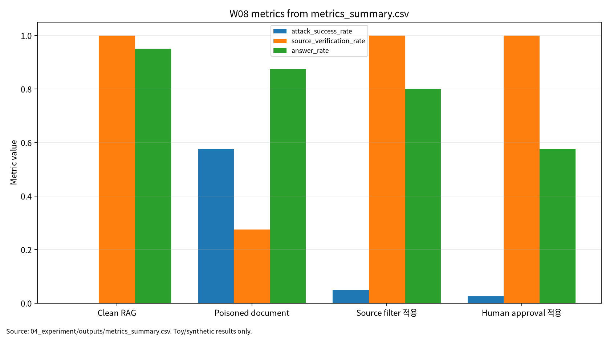

# W08 제출용 단일 보고서

## RAG·프롬프팅 프레임워크 & 프롬프트 인젝션

## 0. 메타정보

| 항목 | 내용 |
|---|---|
| 주차 | W08 |
| 보고서 제목 | RAG·프롬프팅 프레임워크 & 프롬프트 인젝션 |
| 과목 범위 | AI 보안 |
| 작성자 | 박영세 |
| 학번 | 26200122 |
| 작성일 | 2026-06-26 |
| 문서 상태 | 주차별 단일 제출용 보고서 |
| 원본 관리 파일 | `03_weekly_reports/w08_rag_prompt_injection/07_week_submission/w08_submission_report.md` |
| Word/PDF 제출본 권장 위치 | `03_weekly_reports/w08_rag_prompt_injection/07_week_submission/exports/` |
| 관련 산출물 위치 | `03_weekly_reports/w08_rag_prompt_injection/` |
| 안전 범위 | 실제 LLM/API 호출, 실제 prompt injection 공격 재현, 실제 개인정보, live tool invocation, exploit instruction 제외 |
| PDF 검토 상태 | P01~P05 로컬 PDF blob 존재 확인. 제출 본문은 DOI/URL, `paper_list.md`, 논문별 summary, 실험 보고서 기준으로 작성 |
| 제출 전 주의 | P01/P02/P05는 강의계획서 표기와 공식 DOI 기준 서지에 차이가 있어 관련 보조 문헌 여부 확인 필요. P04는 Tianlei/Tongcheng 저자명 차이 확인 필요 |

---

## 초록

본 보고서는 W08 주차의 RAG, GraphRAG, prompting framework, prompt injection을 하나의 제출용 보고서로 통합한다. RAG 시스템은 외부 문서, graph node/edge/path, retrieval context, tool permission, approval log를 LLM generation 과정에 결합한다. 이 구조는 답변 근거를 강화할 수 있지만, retrieved context와 graph evidence가 오염되면 indirect prompt injection, source spoofing, graph edge poisoning, tool misuse로 이어질 수 있다. 본 보고서는 W08 논문 5편을 바탕으로 GraphRAG workflow, graph-based RAG functionality, prompting framework, prompt injection taxonomy, safety-critical medical prompt injection 사례를 연결하고, synthetic RAG document와 rule-based toy evaluator를 사용한 안전한 toy protocol로 retrieval relevance, ASR, source verification, tool misuse rate, faithfulness, answer rate, source block rate, human block rate, reproducibility evidence를 분리 기록하였다. 실험 결과는 실제 RAG 제품 성능이나 실제 LLM 보안 성능이 아니라 평가 구조를 설명하기 위한 안전한 예시로 한정한다.

**키워드:** RAG, GraphRAG, prompting framework, prompt injection, indirect prompt injection, source verification, provenance, tool misuse, human approval, faithfulness, 재현성

---

## 1. 한 문장 요약

W08은 RAG 보안이 좋은 검색 성능만의 문제가 아니라, retrieved context를 신뢰하기 전에 source, provenance, graph evidence, tool permission, human approval을 검증해야 하는 LLM application 보안 문제임을 보여주는 주차다.

---

## 2. 학습 배경과 주차 목표

### 2.1 이번 주 주제의 위치

W08은 W07의 LLM 보안·프라이버시 평가를 RAG와 agentic LLM application으로 확장한다. W07이 prompt, context, output, log, benchmark를 보호 자산으로 보았다면, W08은 retrieval source, vector DB, graph node/edge, retrieved context, tool permission, human approval gate를 추가한다. RAG/GraphRAG 시스템은 LLM 자체가 안전하더라도 외부 근거가 오염되면 답변과 action이 조작될 수 있으므로, retrieval pipeline과 provenance chain까지 보안 평가 대상에 포함해야 한다.

### 2.2 강의계획서상 학습목표

- RAG와 GraphRAG의 retrieval, indexing, evidence path, generation workflow를 이해한다.
- Graph-based RAG에서 database, algorithm, pipeline, task 수준의 기능을 구분한다.
- Prompting framework를 system/user/retrieved/tool prompt 경계와 실행 계층으로 정리한다.
- Direct/indirect prompt injection, source spoofing, tool misuse, medical advice risk를 위협모형화한다.
- Source filter와 human approval gate가 ASR, tool misuse, answer rate, faithfulness에 미치는 영향을 분리 기록한다.

### 2.3 이번 주 핵심 질문

1. RAG 시스템에서 retrieved context는 왜 새로운 공격면이 되는가?
2. GraphRAG에서는 node, edge, path, subgraph provenance를 어떻게 검증해야 하는가?
3. Prompting framework에서 system/user/retrieved/tool prompt의 신뢰 경계는 어떻게 설정해야 하는가?
4. Source filter와 human approval gate는 ASR과 tool misuse를 줄이면서 answer rate에 어떤 비용을 만드는가?
5. Safety-critical domain에서 prompt injection은 어떤 실제 피해로 확장될 수 있는가?

---

## 3. 논문 5편의 서술형 종합 요약

### 3.1 P01. Graph Retrieval-Augmented Generation: A Survey

P01은 GraphRAG의 workflow를 정리하는 관련 문헌이다. GraphRAG는 일반 RAG처럼 문서 chunk를 검색하는 데 그치지 않고, entity, relation, node, edge, path, subgraph를 활용해 근거를 구성한다. 이러한 방식은 복잡한 관계형 지식을 더 잘 추적할 수 있고, citation support와 evidence path를 명시할 수 있다는 장점이 있다.

보안 관점에서 GraphRAG는 보호해야 할 단위가 문서에서 graph element로 확장된다. Node가 오염되거나 edge가 잘못 연결되거나 path가 조작되면 LLM은 출처가 있는 것처럼 보이는 잘못된 근거를 사용한다. 따라서 graph node/edge provenance, evidence path score, citation support, source freshness를 함께 검증해야 한다. 현재 P01은 공식 DOI 기준 Boci Peng et al. 논문으로 확인되었으나 강의계획서의 Shiyu Chen 표기와는 차이가 있어 관련 문헌 메모를 유지한다.

### 3.2 P02. Graph-Based Approaches and Functionalities in Retrieval-Augmented Generation: A Comprehensive Survey

P02는 graph-based RAG의 기능을 더 세분화해 정리한다. Graph는 knowledge base, document graph, entity-relation graph, citation graph, reasoning graph, user interaction graph 등으로 활용될 수 있다. Graph-based RAG는 database 구성, retrieval algorithm, pipeline orchestration, downstream task 지원이라는 여러 층에서 기능을 수행한다.

보안 관점에서 P02는 RAG 보안 평가 범위를 source document에서 graph database와 update pipeline까지 확장한다. Graph update가 잘못되거나 edge poisoning이 발생하면 retrieval relevance와 faithfulness가 동시에 흔들릴 수 있다. 따라서 graph integrity score, edge provenance, update audit, stale node detection이 중요하다. 강의계획서의 Jianxiang Li 표기와 공식 Zulun Zhu et al. DOI 기준 서지가 달라 최종 확인 메모를 유지한다.

### 3.3 P03. Prompting Frameworks for Large Language Models: A Survey

P03은 LLM prompting framework를 정리한다. Prompting은 단순 user instruction이 아니라 system prompt, developer instruction, user prompt, retrieved context, tool instruction, output format, memory, service layer를 포함하는 application-level orchestration 문제다. Prompting framework는 data/base/execute/service level에서 LLM application을 구성하고 제어한다.

보안 관점에서 P03은 prompt boundary와 trust hierarchy를 정리하는 데 중요하다. System prompt와 user prompt, retrieved document, tool result가 같은 context window 안에 들어갈 때 LLM은 이들 사이의 권한 차이를 명확히 구분하지 못할 수 있다. 따라서 prompt boundary, source trust label, context segmentation, tool permission policy가 필요하다.

### 3.4 P04. Prompt Injection Attacks on Large Language Models: A Survey of Attack Methods, Root Causes, and Defense Strategies

P04는 prompt injection attack의 공격 방법, 원인, 방어 전략을 정리한다. Prompt injection은 사용자가 직접 악성 지시를 넣는 direct injection과, 웹페이지·문서·검색 결과·이미지 OCR 등 외부 context에 지시가 숨어 있는 indirect injection으로 나눌 수 있다. RAG에서는 특히 indirect injection이 중요하다. 사용자가 정상 질문을 하더라도 검색된 문서 안의 악성 instruction이 LLM의 응답과 tool action을 바꿀 수 있기 때문이다.

보안 관점에서 P04는 W08의 핵심 보안 문헌이다. 방어는 input filtering, context isolation, instruction hierarchy, output monitoring, tool permission, human approval, provenance validation으로 나눌 수 있다. 다만 강의계획서의 Tianlei Geng 표기와 공식 DOI 기준 Tongcheng Geng 표기는 차이가 있어 검증 메모를 유지한다.

### 3.5 P05. Vulnerability of Large Language Models to Prompt Injection When Providing Medical Advice

P05는 safety-critical domain에서 prompt injection이 어떤 위험을 만들 수 있는지를 보여주는 관련 문헌이다. 의료 조언 환경에서 LLM이 외부 문맥이나 사용자의 조작된 instruction에 영향을 받으면 부정확하거나 위험한 조언이 생성될 수 있다. 이때 문제는 단순 답변 품질 저하가 아니라 환자 안전, escalated care, 전문의 상담 필요성, harm potential과 연결된다.

보안 관점에서 P05는 W08의 high-stakes 사례 문헌이다. RAG와 agentic LLM을 의료, 법률, 금융, 보안 관제에 적용할 때는 source verification과 human approval이 선택 사항이 아니라 필수 통제 장치가 될 수 있다. 다만 강의계획서 지정 제목과 현재 JAMA Network Open DOI 기준 제목이 달라 최종 제출 전 동일성 확인이 필요하다.

---

## 4. 논문 간 연결 관계

W08 논문 5편은 다음 흐름으로 연결된다.

```text
GraphRAG workflow
→ Graph-based RAG 기능과 provenance
→ Prompting framework와 prompt boundary
→ Prompt injection taxonomy와 방어 전략
→ Safety-critical medical prompt injection 사례
```

P01/P02는 GraphRAG와 graph-based RAG 구조 문헌이고, P03은 prompting framework와 LLM application layer 문헌이다. P04는 prompt injection taxonomy와 방어 전략을 제공하며, P05는 medical advice domain에서 prompt injection의 high-stakes 위험을 보여준다. 이 다섯 문헌을 종합하면 W08의 핵심 메시지는 “RAG 보안은 검색 정확도, 출처 검증, prompt boundary, tool permission, approval log를 함께 설계하는 문제”라는 것이다.

---

## 5. AI 원리 70% 정리

RAG는 외부 근거를 검색해 LLM context에 넣고 답변을 생성한다. GraphRAG는 retrieved document뿐 아니라 node, edge, path, subgraph를 근거로 사용한다. Prompting framework는 system/user/retrieved/tool prompt가 어떻게 결합되어 LLM application을 구성하는지 설명한다. 이 구조는 answer quality를 높일 수 있지만, retrieved context와 graph evidence가 공격자가 삽입한 instruction을 포함하면 LLM이 외부 데이터를 높은 권한의 명령처럼 해석할 위험이 있다.

### 5.1 핵심 수식

RAG의 retrieval 단계는 query와 document embedding의 유사도로 top-k 근거를 선택한다.

$$
S(q,d_i)=\mathrm{sim}(e_q,e_{d_i})
$$

$$
D_k=\mathrm{TopK}_{d_i\in D}S(q,d_i)
$$

GraphRAG에서는 graph path 또는 subgraph evidence의 신뢰도를 함께 고려할 수 있다.

$$
EvidenceScore(p)=\alpha\,Rel(p,q)+\beta\,Prov(p)+\gamma\,Fresh(p)
$$

| 기호 | 의미 |
|---|---|
| $q$ | user query |
| $d_i$ | candidate document |
| $e_q$ | query embedding |
| $e_{d_i}$ | document embedding |
| $p$ | graph evidence path |
| $Rel$ | query와 근거 path의 관련성 |
| $Prov$ | provenance score |
| $Fresh$ | freshness score |

Indirect prompt injection의 ASR은 오염 문서 또는 오염 graph evidence가 사용된 조건에서 공격 목표가 발생한 비율이다.

$$
ASR=\frac{N_{atk}}{N_{poison}}
$$

Source verification rate는 사용된 근거 중 출처 검증을 통과한 비율이다.

$$
SourceVerif=\frac{N_{verified}}{N_{retrieved}}
$$

Tool misuse rate는 tool action 요청 중 정책 위반 또는 불필요한 action이 발생한 비율이다.

$$
ToolMisuse=\frac{N_{misuse}}{N_{tool}}
$$

Faithfulness는 답변이 검색 근거에 의해 지지되는 정도로 기록한다.

$$
Faithfulness=\frac{N_{supported}}{N_{answer}}
$$

| 기호 | 의미 |
|---|---|
| $N_{poison}$ | 오염 context 조건 평가 수 |
| $N_{atk}$ | 공격 목표가 발생한 수 |
| $N_{retrieved}$ | 검색된 근거 수 |
| $N_{verified}$ | 출처 검증을 통과한 근거 수 |
| $N_{tool}$ | tool action 요청 수 |
| $N_{misuse}$ | 오남용 또는 정책 위반 tool action 수 |
| $N_{answer}$ | 생성 답변 수 |
| $N_{supported}$ | 근거로 지지되는 답변 수 |

### 5.2 핵심 개념과 보안 연결

| 개념 | AI 원리 | 보안 연결 |
|---|---|---|
| RAG | 외부 근거를 검색해 LLM context에 삽입 | 오염 문서가 indirect injection 경로가 됨 |
| GraphRAG | node, edge, path, subgraph를 검색·생성에 활용 | graph provenance와 edge integrity 필요 |
| Graph-based RAG | database, algorithm, pipeline, task 수준 graph 기능 | source verification 범위가 graph element로 확장 |
| Prompting framework | system/user/retrieved/tool prompt를 계층화 | prompt boundary와 tool 권한 점검 필요 |
| Prompt injection | 외부 또는 내부 instruction이 정책을 우회 | direct/indirect/multimodal injection 위험 |
| Human approval gate | 위험 action을 사람 검토로 전환 | tool misuse 감소, answer rate 감소 가능 |

---

## 6. 보안 이슈 30% 정리

Prompt injection 연구는 direct, indirect, multimodal injection과 방어 전략을 체계화한다. Safety-critical domain에서는 prompt injection이 잘못된 의료 조언과 같은 실제 피해로 연결될 수 있다. RAG와 GraphRAG에서는 retrieved document, graph node, edge, path, citation, tool action이 모두 보호 자산이다. 따라서 W08의 보안 분석은 answer quality만이 아니라 ASR, source verification, tool misuse rate, faithfulness, answer rate, approval log를 분리해 기록한다.

| 보안 속성 | W08에서의 의미 | 대표 위협 | 평가 지표 |
|---|---|---|---|
| Integrity | retrieved context와 graph evidence의 무결성 | document poisoning, edge poisoning | ASR, faithfulness |
| Confidentiality | prompt, context, tool argument, log 노출 | prompt leakage, source leakage | leakage audit |
| Safety | 위험 action 또는 잘못된 domain advice | indirect injection, medical advice manipulation | human block rate, safe escalation |
| Accountability | source/provenance/action log 필요 | 출처 불명 근거, 승인 기록 누락 | source verification, approval log |
| Availability | 방어로 답변률이 낮아지는 비용 | over-blocking, human review overload | answer rate, source block rate |

---

## 7. Research Track 분석

### 7.1 연구문제

- RQ1. Source verification과 human approval gate가 RAG indirect injection과 tool misuse를 줄일 수 있는가?
- RQ2. Source filter 적용 시 ASR, source verification, faithfulness, answer rate는 어떻게 달라지는가?
- RQ3. Human approval gate는 tool misuse를 줄이면서 usability cost를 얼마나 만드는가?
- RQ4. GraphRAG에서 node, edge, path provenance는 어떻게 평가 지표로 설계할 수 있는가?

### 7.2 위협모형

| 항목 | 내용 |
|---|---|
| 보호 자산 | user query, retrieved document, graph node/edge/path, source metadata, tool permission, action log, final answer |
| 공격자 목표 | indirect prompt injection, source spoofing, graph edge manipulation, tool misuse, unsafe domain advice 유도 |
| 공격자 지식 | RAG pipeline 일부 지식, retrieval query pattern, source filter rule 추정 가능성 |
| 공격자 능력 | 오염 문서 삽입, source metadata 위조, graph edge/path 조작, tool action 유도 instruction 삽입 |
| 공격 경로 | user query → retrieval/GraphRAG → retrieved context/evidence → LLM generation → tool request → approval gate → final answer/action |
| 방어자 능력 | source filter, provenance validation, tool permission policy, human approval gate, answer grounding check |
| 제외 범위 | 실제 LLM/API 호출, 실제 prompt injection 공격 재현, exploit instruction, live tool invocation, 실제 개인정보 사용 |

### 7.3 평가축

| 평가축 | 질문 | 대표 지표 또는 증거 |
|---|---|---|
| Retrieval quality | 관련 근거를 검색하는가 | retrieval relevance |
| Attack behavior | 오염 context가 공격 목표를 유도하는가 | ASR |
| Source verification | 출처 검증이 작동하는가 | source verification rate |
| Tool safety | tool action 오남용이 발생하는가 | tool misuse rate |
| Groundedness | 답변이 근거에 충실한가 | faithfulness |
| Usability | 방어 후 답변률이 유지되는가 | answer rate |
| Defense blocking | source filter와 human approval이 얼마나 차단하는가 | source block rate, human block rate |
| Reproducibility evidence | 동일 결과를 다시 만들 수 있는가 | seed, config, outputs, run log |

### 7.4 재현성

재현성을 위해 synthetic RAG documents, condition별 sample 수, seed, risk threshold, source filter block rate, human approval block rate, config, CSV/JSON/Markdown log를 보존한다. W08 실습은 실제 LLM, API, 외부 시스템, 실제 개인정보, live tool invocation을 사용하지 않는다.

---

## 8. 실습 보고서 및 그래프 수치 검증

본 실습은 실제 LLM/API 호출이나 실제 prompt injection 공격 재현이 아니라 W08의 핵심인 RAG 보안 평가축을 안전하게 설명하기 위한 최소 toy protocol이다. Synthetic RAG document와 rule-based toy evaluator를 사용해 Clean RAG, Poisoned document, Source filter, Human approval 조건을 분리하였다.

### 8.1 실습 설계

| 항목 | 내용 |
|---|---|
| Dataset | Synthetic RAG documents |
| Evaluator | Rule-based toy RAG prompt-injection evaluator |
| Conditions | Clean RAG, poisoned document, source filter, human approval |
| Samples | 40 per condition |
| Seed | 42 |
| Outputs | `metrics_summary.csv`, `results.json`, `run_log.md` |

### 8.2 실습 결과 수치

| 조건 | Retrieval Relevance | ASR | Source Verification | Tool Misuse Rate | Faithfulness | Answer Rate | Source Block Rate | Human Block Rate | 해석 |
|---|---:|---:|---:|---:|---:|---:|---:|---:|---|
| Clean RAG | 0.907887 | 0.000000 | 1.000000 | 0.000000 | 0.907613 | 0.950000 | 0.000000 | 0.000000 | 정상 문서만 검색되는 기준 조건 |
| Poisoned document | 0.690091 | 0.575000 | 0.275000 | 0.125000 | 0.458069 | 0.875000 | 0.000000 | 0.000000 | 오염 문서가 context에 들어오는 취약 조건 |
| Source filter 적용 | 0.776926 | 0.050000 | 1.000000 | 0.025000 | 0.778693 | 0.800000 | 0.892857 | 0.000000 | 출처 검증으로 ASR이 크게 낮아짐 |
| Human approval 적용 | 0.764926 | 0.025000 | 1.000000 | 0.000000 | 0.840805 | 0.575000 | 0.814815 | 1.000000 | 승인 게이트가 tool misuse를 0으로 낮추지만 answer rate도 감소 |

Poisoned document 조건에서는 ASR이 0.575000, tool misuse rate가 0.125000으로 나타났다. Source filter 적용 후 ASR은 0.050000으로 낮아졌고, source verification은 1.000000으로 올라갔다. Human approval 적용 조건에서는 ASR이 0.025000, tool misuse rate가 0.000000이었으나 answer rate는 0.575000으로 낮아졌다. 이 해석은 안전한 toy evaluator 산출물에 한정된다.

### 8.3 그래프 수치 검증

현재 제출 보고서의 그래프는 `assets/w08_metric_chart.png`를 참조한다. 확인 가능한 SVG 그래프에는 `retrieval_relevance`, `attack_success_rate`, `source_verification_rate`, `tool_misuse_rate`, `faithfulness` 다섯 series가 표시되어 있다. Answer rate, source block rate, human block rate는 표에는 포함하지만 현재 그래프 series에는 포함되어 있지 않다.

| 조건 | 그래프 Retrieval | 표 Retrieval | 그래프 ASR | 표 ASR | 그래프 Source Verification | 표 Source Verification | 그래프 Tool Misuse | 표 Tool Misuse | 그래프 Faithfulness | 표 Faithfulness | 확인 결과 |
|---|---:|---:|---:|---:|---:|---:|---:|---:|---:|---:|---|
| Clean RAG | 0.907887 | 0.907887 | 0.000000 | 0.000000 | 1.000000 | 1.000000 | 0.000000 | 0.000000 | 0.907613 | 0.907613 | 일치 |
| Poisoned document | 0.690091 | 0.690091 | 0.575000 | 0.575000 | 0.275000 | 0.275000 | 0.125000 | 0.125000 | 0.458069 | 0.458069 | 일치 |
| Source filter 적용 | 0.776926 | 0.776926 | 0.050000 | 0.050000 | 1.000000 | 1.000000 | 0.025000 | 0.025000 | 0.778693 | 0.778693 | 일치 |
| Human approval 적용 | 0.764926 | 0.764926 | 0.025000 | 0.025000 | 1.000000 | 1.000000 | 0.000000 | 0.000000 | 0.840805 | 0.840805 | 일치 |

<!-- submission-metric-chart:start -->
**그림 1. W08 metrics summary chart**



출처: `04_experiment/outputs/metrics_summary.csv`. 이 그래프는 공개 toy/synthetic 산출물 기반이며 실제 공격 성능이나 운영 환경 성능으로 일반화하지 않는다. 현재 그래프는 retrieval_relevance, attack_success_rate, source_verification_rate, tool_misuse_rate, faithfulness를 시각화한다.
<!-- submission-metric-chart:end -->

---

## 9. 기말논문 연결

W08은 기말논문에서 “RAG 기반 생성형 AI 시스템에서 간접 프롬프트 인젝션 대응을 위한 출처 검증·승인 게이트 평가 프레임워크”로 확장할 수 있다. 핵심 기여 후보는 source/provenance metadata schema, indirect prompt injection threat model, source filter와 human approval gate 평가표, tool misuse와 answer rate의 trade-off 분석이다.

| 기말논문 장 | W08 반영 내용 |
|---|---|
| 1장 서론 | RAG/RAG-agent 시스템에서 retrieved context가 새로운 공격면이 된다는 문제의식 |
| 2장 관련연구 | GraphRAG, graph-based RAG, prompting framework, prompt injection, medical safety 사례 정리 |
| 3장 위협모형 | 문서, graph node/edge/path, source metadata, tool permission, approval log 보호 자산 정의 |
| 4장 연구방법 | retrieval relevance, ASR, source verification, tool misuse, faithfulness, answer rate 설계 |
| 5장 분석 | clean/poisoned/source filter/human approval 조건 비교 |
| 6장 결론 | RAG 보안은 출처 검증과 승인 게이트를 포함한 application security 문제임 |

---

## 10. AI 도구 활용 기록

AI 도구는 문헌 요약, 코드 점검, 문장 구조화, 그래프 생성 보조에 사용하였다. 모든 DOI/URL, 실험 수치, 본문 인용, 결론은 작성자가 outputs 파일과 로컬 참고문헌 검증표를 대조하여 검증한다.

| 항목 | 내용 |
|---|---|
| 사용 도구명 | Codex, ChatGPT 계열 도구 |
| 사용 목적 | 문헌 요약 정리, 보고서 구조화, 안전한 toy/synthetic 실험 결과 표기 점검, 그래프 생성 보조, 제출 전 체크리스트 정리 |
| AI 산출물 반영 위치 | `07_week_submission/w08_submission_report.md`, `07_week_submission/assets/w08_metric_chart.png`, `05_ai_worklog/ai_disclosure_draft.md` |
| 본인 수정 내용 | 주차별 문헌 상태 확인, 실험 수치와 outputs 대조, 안전 범위와 한계 문장 확인, 최종 제출 전 미확정 문헌 분리 |
| 사실관계 검증 방법 | `01_papers/paper_list.md`, `01_papers/doi_check.md`, 강의계획서 문헌표 대조 |
| 실험결과 검증 방법 | `04_experiment/experiment_report.md`, `04_experiment/outputs/metrics_summary.csv`, `results.json`, `run_log.md`의 수치와 보고서 표기 대조 |
| 최종 책임 확인 | AI 산출물은 초안 보조이며 최종 제출자는 원고 내용, 인용, 실험결과, 연구윤리 책임을 확인한다. |

---

## 11. 제출 전 자기 점검표

| 점검 항목 | 상태 | 비고 |
|---|---|---|
| 메타정보 작성 | 완료 | 작성일 2026-06-26 반영 |
| 초록 및 키워드 작성 | 완료 |  |
| AI 원리 70% 정리 | 완료 | 핵심 수식 추가 |
| 보안 이슈 30% 정리 | 완료 |  |
| 논문 5편 서술형 요약 | 완료 |  |
| 논문 간 연결 관계 작성 | 완료 |  |
| Research Track 5요소 작성 | 완료 | 연구문제, 위협모형, 평가방법, 재현성, 한계 |
| P01~P05 PDF blob 확인 | 완료 | GitHub 파일 존재 확인. 원문 PDF 저작권/배포 정책 별도 검토 필요 |
| P01~P05 DOI/URL 검증 | 완료 / 확인 필요 | P01/P02/P05는 관련 문헌 표기 차이 확인 필요 |
| P01 강의계획서 표기 | 확인 필요 | Shiyu Chen/ACM CSUR 표기와 공식 Peng/ACM TOIS 차이 |
| P02 강의계획서 표기 | 확인 필요 | Jianxiang Li 표기와 공식 Zulun Zhu et al. 차이 |
| P04 저자 표기 | 확인 필요 | Tianlei/Tongcheng Geng 차이 |
| P05 제목 동일성 | 확인 필요 | 강의계획서 제목과 JAMA 논문 제목 차이 |
| 실험 outputs 파일 존재 확인 | 완료 | 실험 보고서 기준 CSV/JSON/run_log 존재 |
| 실험 결과와 보고서 수치 일치 | 완료 | 실험 보고서 수치 기준 반영 |
| 그래프 수치 확인 | 완료 | retrieval/ASR/source verification/tool misuse/faithfulness 기준 표와 일치 |
| AI 활용 고지 작성 | 완료 |  |
| DOCX/PDF 제출본 생성 | 필요 | `07_week_submission/exports/` 권장 |
| 최종 사람이 검토할 항목 표시 | 완료 | 문헌 동일성, PDF 보관 정책, Word/PDF 렌더링 |

---

## 12. 참고문헌 검증표

| 번호 | 참고문헌 | DOI/URL | 상태 | 비고 |
|---:|---|---|---|---|
| [1] | Boci Peng et al., “Graph Retrieval-Augmented Generation: A Survey,” ACM Transactions on Information Systems, 2025/2026 | `https://doi.org/10.1145/3777378`; arXiv `https://arxiv.org/abs/2408.08921` | DOI/PDF 확인 | 강의계획서 Shiyu Chen/ACM CSUR 표기와 차이. 관련 보조 문헌으로 사용 |
| [2] | Zulun Zhu et al., “Graph-Based Approaches and Functionalities in Retrieval-Augmented Generation: A Comprehensive Survey,” ACM Computing Surveys, 2026 | `https://doi.org/10.1145/3795880` | DOI/PDF 확인 | 강의계획서 Jianxiang Li 표기 차이 확인 필요 |
| [3] | Xiaoxia Liu et al., “Prompting Frameworks for Large Language Models: A Survey,” ACM Computing Surveys, 2026 | `https://doi.org/10.1145/3789253` | DOI/PDF 확인 | 공식 서지 기준으로 사용 |
| [4] | Tongcheng Geng et al., “Prompt Injection Attacks on Large Language Models: A Survey of Attack Methods, Root Causes, and Defense Strategies,” Computers, Materials & Continua, 2026 | `https://doi.org/10.32604/cmc.2025.074081` | DOI/PDF 확인 | Tianlei/Tongcheng 저자명 차이 확인 필요 |
| [5] | Ro Woon Lee et al., “Vulnerability of Large Language Models to Prompt Injection When Providing Medical Advice,” JAMA Network Open, 2025 | `https://doi.org/10.1001/jamanetworkopen.2025.49963` | DOI/PDF 확인 | 강의계획서 제목과 동일 논문 여부 확인 필요. 관련 보조 문헌으로 사용 |

---

## 13. 부록 A. KCI 논문 형식 전환 아이디어

### A.1 제목 후보

| 번호 | 국문 제목 후보 | 영문 제목 후보 | 연구방법 | 예상 기여 |
|---:|---|---|---|---|
| 1 | RAG 기반 생성형 AI 시스템에서 간접 프롬프트 인젝션 대응을 위한 출처 검증·승인 게이트 평가 프레임워크 연구 | An Evaluation Framework for Source Verification and Human Approval Gates Against Indirect Prompt Injection in RAG-Based Generative AI Systems | 문헌분석 + synthetic RAG 실험 | ASR·source verification·tool misuse 통합 평가표 |
| 2 | 보안형 RAG 시스템의 문서·Graph 출처 검증 메타데이터 설계 연구 | A Study on Document and Graph Provenance Metadata for Secure RAG Systems | 프레임워크 설계 + 체크리스트 | source/provenance 평가 기준 |
| 3 | LLM 에이전트의 Tool 권한 오남용 방지를 위한 Human Approval Gate 연구 | A Study on Human Approval Gates for Preventing Tool Misuse in LLM Agents | toy 실험 + 정책 설계 | approval gate와 answer rate trade-off 분석 |

추천 최종 제목은 “RAG 기반 생성형 AI 시스템에서 간접 프롬프트 인젝션 대응을 위한 출처 검증·승인 게이트 평가 프레임워크 연구”이다. 연구문제는 source filter의 ASR·faithfulness·answer rate 영향과 human approval gate의 tool misuse 감소 및 usability cost 분석으로 설정한다.

### A.2 연구문제

- RQ1. Source filter는 indirect prompt injection ASR과 faithfulness를 어떻게 변화시키는가?
- RQ2. Human approval gate는 tool misuse를 줄이면서 answer rate를 얼마나 낮추는가?
- RQ3. GraphRAG에서 node, edge, path provenance metadata는 어떤 최소 항목을 가져야 하는가?

---

## 14. 부록 B. SCI 논문 형식 전환 아이디어

SCI 제목 후보는 “A Multi-Metric Evaluation Framework for Source Verification and Human Approval Gates Against Indirect Prompt Injection in RAG-Based LLM Systems”이다.

Structured abstract는 Background, Problem, Method, Results, Contribution, Implications로 구성한다. 결과 문장은 W08 toy evaluation이 poisoned document ASR 0.575000, source filter 후 ASR 0.050000, human approval 후 tool misuse rate 0.000000과 answer rate 0.575000을 기록했다는 수준으로 제한한다. 실제 RAG 제품 보안 성능으로 일반화하지 않는다.

| 연구축 | 대표 논문 | 역할 |
|---|---|---|
| GraphRAG workflow | Peng et al. | GraphRAG indexing, retrieval, generation workflow |
| Graph-based RAG functionality | Zhu et al. | database, algorithm, pipeline, task 수준의 graph 기능 |
| Prompting framework | Liu et al. | data/base/execute/service level prompt orchestration |
| Prompt injection taxonomy | Geng et al. | attack methods, root causes, defense strategies |
| Safety-critical prompt injection | Lee et al. | medical advice domain vulnerability and harm potential |

---

## 15. 부록 C. 제출 파일 위치와 변환 권장

| 파일 | 설명 |
|---|---|
| `07_week_submission/w08_submission_report.md` | 본 제출용 보고서 원본 |
| `07_week_submission/assets/w08_metric_chart.png` | 제출 보고서 그래프 |
| `04_experiment/experiment_report.md` | 실험 근거 보고서 |
| `04_experiment/outputs/` | 실험 결과 근거 파일 위치 |
| `05_ai_worklog/ai_disclosure_draft.md` | AI 활용 고지 근거 |

Word 제출본은 다음 위치에 생성해 관리한다.

```text
03_weekly_reports/w08_rag_prompt_injection/07_week_submission/exports/w08_submission_report.docx
```

PDF 제출본은 Word에서 최종 육안 검수 후 다음 위치에 저장한다.

```text
03_weekly_reports/w08_rag_prompt_injection/07_week_submission/exports/w08_submission_report.pdf
```

수식은 GitHub와 Word 변환을 모두 고려하여 Markdown 표 안에 넣지 않고, `$$...$$` block math로 유지한다.
