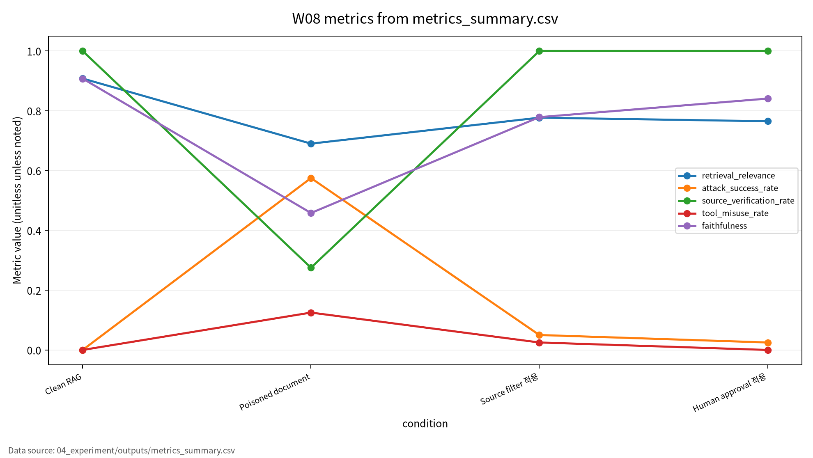

# W08 RAG·프롬프팅 프레임워크 & 프롬프트 인젝션

LLM이 검색 문서를 읽는 순간, 문서는 근거이면서 동시에 공격면이 된다.

---

## 1. 핵심 질문

- RAG에서 indirect prompt injection은 어디서 들어오는가
- Source verification은 ASR을 낮출 수 있는가
- Human approval gate는 tool misuse를 막을 수 있는가

---

## 2. AI 원리 70%

| 단계 | 역할 | 보안 연결 |
|---|---|---|
| Retrieval | 관련 문서 검색 | 오염 문서 유입 |
| Reranking | 후보 재정렬 | trust score 필요 |
| Generation | context 기반 답변 | context hijacking |
| Tool action | 외부 행동 | approval gate |

---

## 3. 문헌의 역할

P01/P02는 GraphRAG와 graph 기능, P03은 prompting framework, P04는 prompt injection taxonomy, P05는 safety-critical 취약성 사례를 제공한다.

---

## 4. 위협모형

```text
Poisoned document -> Retrieved context -> LLM answer -> Tool action
```

보호 자산은 검색 문서, vector DB, graph DB, system prompt, user context, tool 권한, audit log다.

---

## 5. 실험 설계

- Synthetic RAG documents
- 조건별 40개, 총 160개 sample
- 실제 LLM/API 호출 없음
- Seed 42
- 지표: Retrieval Relevance, ASR, Source Verification, Tool Misuse Rate, Faithfulness, Answer Rate

---

## 6. 실험 결과

| 조건 | ASR | Source Verification | Tool Misuse |
|---|---:|---:|---:|
| Clean RAG | 0.000000 | 1.000000 | 0.000000 |
| Poisoned document | 0.575000 | 0.275000 | 0.125000 |
| Source filter 적용 | 0.050000 | 1.000000 | 0.025000 |
| Human approval 적용 | 0.025000 | 1.000000 | 0.000000 |

---

## 7. 해석

- Source filter는 ASR을 크게 낮춘다.
- Human approval은 tool misuse를 차단한다.
- 단, answer rate가 낮아질 수 있어 사용성 비용을 함께 봐야 한다.

---

## 8. 기말논문 연결

RAG 기반 생성형 AI 시스템에서 간접 프롬프트 인젝션 대응을 위한 출처 검증·승인 게이트 평가 프레임워크.

---

## 9. 결론

RAG 보안은 “좋은 검색”만의 문제가 아니다. 출처, prompt boundary, tool 권한, 승인 로그를 함께 설계해야 한다.

<!-- formula-visual-supplement:start -->
# 수식·그래프·그림 보강

- 보강 일자: 2026-06-23
- 수식은 표준 정의식 또는 검증 가능한 평가식으로만 작성했다.
- 그래프는 `04_experiment/outputs/metrics_summary.csv`의 기존 수치만 사용했다.
- 다이어그램은 AI-assisted conceptual diagram이며 사실 자료나 실험 결과처럼 해석하지 않는다.

### 핵심 수식: Retrieval Score와 Context-Conditioned Generation

$$
s(q,d)=\frac{e(q)^\top e(d)}{\lVert e(q)\rVert_2\lVert e(d)\rVert_2},
\qquad
p(y|q,C)=\prod_{t=1}^{T}p_\theta(y_t|y_{<t},q,C)
$$

| 기호 | 의미 |
|---|---|
| `q,d` | query와 retrieved document |
| `e(\cdot)` | embedding function |
| `C` | retrieved context set |
| `y_t` | 생성 응답의 t번째 토큰 |

**직관적 의미:**  
RAG는 query와 문서의 유사도로 context를 고르고, 그 context에 조건화해 답을 생성한다.

**보안 관점 해석:**  
검색된 context가 오염되면 생성 단계가 공격 문맥에 영향을 받을 수 있다.

**평가 지표 연결:**  
retrieval_relevance, faithfulness, source_verification_rate와 연결한다.

**한계와 가정:**  
표준 RAG 구조 설명이며 특정 벤치마크 수치를 새로 만들지 않는다.

### 핵심 수식: Injection Success와 Contamination Rate

$$
PISR=\frac{\#\{\mathrm{policy\ violating\ injected\ outputs}\}}{\#\{\mathrm{injection\ test\ prompts}\}},
\qquad
RCR=\frac{\#\{\mathrm{retrieved\ contaminated\ contexts}\}}{\#\{\mathrm{retrieved\ contexts}\}}
$$

| 기호 | 의미 |
|---|---|
| `PISR` | prompt injection success rate |
| `RCR` | retrieval contamination rate |
| `\#` | 해당 조건 개수 |
| `contexts` | 검색된 문맥 |

**직관적 의미:**  
Injection success와 retrieval contamination은 검색 품질과 다른 위험축이다.

**보안 관점 해석:**  
방어 평가는 source verification, block rate, tool misuse를 함께 본다.

**평가 지표 연결:**  
attack_success_rate, tool_misuse_rate, source_block_rate, human_block_rate와 연결한다.

**한계와 가정:**  
toy/synthetic prompt set 기준 proxy이며 실제 시스템 침투 절차가 아니다.

### 표 수치 기반 그래프



그래프는 RAG 조건별 retrieval_relevance, attack_success_rate, source_verification_rate, tool_misuse_rate, faithfulness를 비교한다. 검색 품질이 좋아도 injection이나 contamination 위험이 별도로 존재할 수 있다. 차트는 output CSV의 수치만 사용한다.

### Threat Model / Pipeline Diagram


이 다이어그램은 `RAG pipeline threat model`를 발표용으로 요약한 개념도다. 데이터 흐름, 평가 지표, 한계 표시는 `assets/figure_manifest.md`에도 기록했다.

### 확인 필요

- prompt injection은 방어 평가 관점으로만 설명하고 실제 우회 절차는 제공하지 않는다.
- 논문별 원문 절·쪽·그림 번호는 최종 제출 전 사람 검토가 필요하다.
<!-- formula-visual-supplement:end -->
