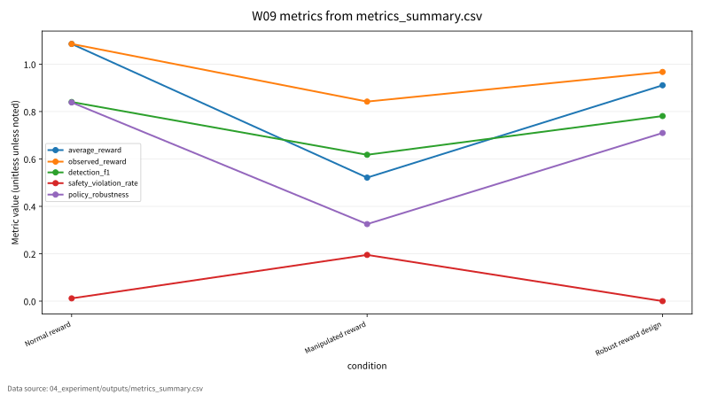
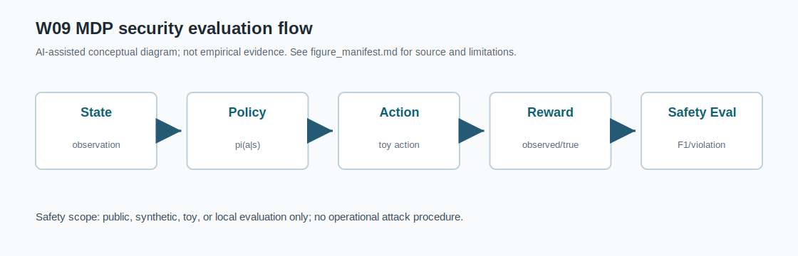

# W09 심층강화학습(DRL) & 사이버보안 적용·보상조작 통합보고서

## 0. 메타정보

| 항목 | 내용 |
|---|---|
| 주차 | W09 |
| 주제 | 심층강화학습(DRL) & 사이버보안 적용·보상조작 |
| 작성/보완일 | 2026-06-22 초안, 2026-06-23 최종 보완 |
| 문서 상태 | 제출용 최종 초안, 사람 검토 전 |
| 사용 AI 도구 | Codex, ChatGPT 계열 AI 도구 |
| 실습 환경 | Python 3.11 표준 라이브러리, Docker compose |
| 실험 근거 | `04_experiment/outputs/run_log.md`, `metrics_summary.csv`, `results.json` |
| 주의 | P03/P04/P05는 강의계획서 저자명과 DOI/PDF 저자명 차이가 있어 확인 필요 |

## 1. 한 문장 요약

DRL 기반 사이버 방어 에이전트는 state, action, reward, policy 설계에 따라 방어 성능과 안전성이 달라지며, 높은 observed reward가 높은 실제 보안성을 뜻하지 않을 수 있다.

## 2. 학습 배경과 주차 목표

### 2.1 이번 주 주제의 위치

W09는 W01~W08에서 다룬 AI 보안 평가축을 순차 의사결정형 보안 에이전트로 확장하는 주차다. W08까지는 주로 데이터, prompt, context, model output, tool action의 위험을 다루었다면, W09는 agent가 state를 관측하고 action을 선택하며 reward를 통해 policy를 업데이트하는 구조를 다룬다. 사이버보안에서는 DRL agent가 IDS/IPS, patching, isolation, escalation 같은 자동 대응을 수행할 수 있지만, reward manipulation이나 reward misspecification이 발생하면 높은 observed reward가 실제 보안성을 의미하지 않을 수 있다.

### 2.2 강의계획서상 학습목표

- DQN, policy gradient, actor-critic, DRL verification의 기본 개념을 정리한다.
- DRL for cyber defense의 상태·행동·보상 설계 문제를 이해한다.
- Reward manipulation과 reward misspecification을 구분한다.
- Detection F1, safety violation rate, policy robustness를 포함한 최소 평가 프로토콜을 설계한다.

### 2.3 이번 주 핵심 질문

1. DRL 기반 사이버 방어 에이전트에서 state, action, reward는 어떻게 정의되는가?
2. Reward manipulation은 observed reward와 true reward 사이에 어떤 괴리를 만드는가?
3. 높은 average reward가 낮은 safety violation을 보장하지 않는 이유는 무엇인가?
4. Robust reward design은 안전 위반을 줄이지만 어떤 비용을 만드는가?
5. W09의 toy cyber-defense 실험을 KCI 또는 SCI 논문 주제로 발전시키려면 어떤 연구문제가 적절한가?

## 3. AI 원리 70% 정리

DRL은 MDP, value function, policy optimization을 통해 순차 의사결정 문제를 학습하는 접근이다[1]. Agent는 state를 관측하고 action을 선택한 뒤 reward를 받아 policy를 개선한다. DQN은 Q-function을 deep neural network로 근사하고, policy gradient는 policy 자체를 최적화하며, actor-critic은 행동 선택과 가치 평가를 결합한다[1].

표 1. W09 핵심 개념과 보안 연결

| 개념 | AI 원리 | 보안 연결 |
|---|---|---|
| MDP | state, action, transition, reward, discount로 순차 의사결정을 표현 | alert level, asset criticality, vulnerability를 state로 모델링 |
| Q-learning | TD error로 Q-value를 갱신 | tabular toy cyber-defense policy 학습 |
| DQN | 큰 상태공간에서 Q-function을 신경망으로 근사 | 향후 neural cyber-defense agent 확장 |
| Policy gradient | 직접 policy parameter를 최적화 | 자동 대응 action의 확률적 선택 |
| Actor-critic | actor와 critic을 결합 | policy 성능과 value estimation 분리 |
| DRL verification | safety specification, robustness, reachability 확인 | 높은 reward와 safety 만족을 분리 평가[5] |

## 4. 보안 이슈 30% 정리

안전중요 자율 시스템에서 DRL은 시뮬레이션과 실제 배포 사이의 검증 문제가 중요하다[2]. 사이버보안 DRL 연구는 IDS, cyber-physical systems, game-theoretic defense 등 다양한 적용 영역을 포함한다[3]. RL 기반 cybersecurity 연구에서는 detection rate, precision, recall, F1 등 표준 탐지 지표를 함께 보고해야 한다[4]. DRL verification 연구는 높은 reward와 safety specification 만족이 별개임을 보여준다[5].

| 보안 관점 | 관련 위협 | W09 평가 연결 |
|---|---|---|
| Confidentiality | 보안 로그와 state observation 노출 | 개인정보 미사용, synthetic state |
| Integrity | reward manipulation, state poisoning | observed reward와 true reward 비교 |
| Availability | 정상 이벤트 과잉 격리 | safety violation rate |
| Safety | 공격 이벤트 미대응, unsafe automated response | Detection F1, violation rate |
| Accountability | 설명 불가능한 자동 대응 | seed/config/run log 보존 |

Reward manipulation은 공격자 또는 환경 조작자가 보상 신호를 의도적으로 왜곡하는 경우다. Reward misspecification은 설계자가 실제 보안 목표를 잘못 반영한 보상함수 설계 오류다. W09는 두 개념을 구분하되, 실험은 manipulation 조건과 robust reward design 조건을 비교하는 toy protocol로 제한한다.

## 5. 논문 5편 요약

표 2. 관련 문헌 5편 요약

| 번호 | 문헌 | 공식 출판정보 | W09 활용 | 검증 상태 |
|---:|---|---|---|---|
| [1] | Arulkumaran et al., *Deep Reinforcement Learning: A Brief Survey* | IEEE Signal Processing Magazine, 34(6), 26-38, 2017 | DRL 기본 원리 | 부분 검증: 로컬 PDF는 arXiv extended version |
| [2] | Kiran et al., *Deep Reinforcement Learning for Autonomous Driving: A Survey* | IEEE TITS, 23(6), 4909-4926, 2022 | 안전중요 자동화, sim-to-real gap | 부분 검증: 로컬 PDF는 arXiv v2 |
| [3] | Nguyen and Reddi, *Deep Reinforcement Learning for Cyber Security* | IEEE TNNLS, 34(8), 3779-3795, 2023 | cyber-defense DRL | 확인 필요: 강의계획서 저자명 차이 |
| [4] | Adawadkar and Kulkarni, *Cyber-security and reinforcement learning -- A brief survey* | Engineering Applications of Artificial Intelligence, 114, Article 105116, 2022 | IDS/IPS, IoT, IAM 평가 | 확인 필요: 강의계획서 저자명 차이 |
| [5] | Landers and Doryab, *Deep Reinforcement Learning Verification: A Survey* | ACM Computing Surveys, 55(14s), Article 330, 31 pages, 2023 | safety specification, robustness | 확인 필요: 강의계획서 `H. Yan et al.`과 불일치 |

주의: W09의 P05는 강의계획서 지정 저자명 `H. Yan et al.`과 현재 로컬 PDF 기준 `Matthew Landers; Afsaneh Doryab`가 다르므로, 동일 논문 여부와 최종 ACM 출판정보를 확인 필요 상태로 유지한다.

## 6. 논문 5편 비교표

| 논문 | 차별성 | W09 연결 |
|---|---|---|
| P01 | DRL 기본 알고리즘과 학습 원리를 정리 | MDP, Q-learning, DQN 배경 |
| P02 | 안전중요 자동화와 sim-to-real gap을 다룸 | 자동 사이버 대응의 배포 위험 |
| P03 | DRL을 cyber security task로 직접 연결 | alert state, response action, defense reward |
| P04 | IDS/IPS, IoT, IAM RL 연구와 지표를 정리 | Detection F1와 표준 탐지 지표 근거 |
| P05 | DRL policy verification과 safety specification 중심 | safety violation, robustness 평가 근거 |

W09의 핵심 연결부는 “높은 observed reward가 높은 실제 보안성을 의미하지 않는다”는 점이다. 따라서 true reward, observed reward, detection F1, safety violation rate, policy robustness를 함께 기록한다.

## 7. Research Track 분석

표 3. W09 Research Track 요약

| 항목 | 내용 |
|---|---|
| 연구문제 | DRL 기반 사이버 방어 에이전트의 reward manipulation은 방어 성능과 안전성에 어떤 영향을 주는가 |
| 대상 시스템 | DRL-based cyber defense agent |
| 보호 자산 | state observation, reward function, policy, response action, security logs |
| 위협 | reward signal manipulation, alert observation perturbation, log pollution, state poisoning |
| 공격 성공 조건 | high observed reward with low true utility, missed attack response, over-isolation of benign events |
| 평가방법 | average reward, observed reward, detection F1, safety violation rate, policy robustness, perturbed F1 |
| 제외 범위 | live network attack, real IDS/IPS deployment, exploit execution, unauthorized scanning, personal data use |

그림 1. DRL 기반 사이버 방어 에이전트 보상조작 평가 흐름

```text
Synthetic Cyber State
(alert level, asset criticality, vulnerable)
        ↓
DRL Agent / Q-learning Policy
        ↓
Action Selection
(monitor, isolate, patch, escalate)
        ↓
Reward Signal
(normal / manipulated / robust reward)
        ↓
Policy Update
        ↓
Evaluation
Average Reward, Detection F1, Safety Violation Rate, Policy Robustness
        ↓
Reproducibility Evidence
seed, config, Q-table, outputs, run_log
```

## 8. 실습 보고서

본 실습은 실제 IDS/IPS 제품이나 실제 네트워크 트래픽 기반 DRL 학습이 아니라 W09의 핵심인 보상조작 평가축을 안전하게 설명하기 위한 최소 toy protocol이다. 따라서 synthetic cyber-defense state/action/reward 환경과 tabular Q-learning을 사용하되, 평가 구조는 이후 DQN, actor-critic, safe RL, cyber-defense agent에도 확장 가능하도록 average reward, observed reward, detection F1, safety violation rate, policy robustness, perturbed performance, reproducibility evidence로 분리하였다.

표 4. W09 실습 설계

| 항목 | 내용 |
|---|---|
| Environment | Synthetic toy cyber-defense states |
| State | alert level, asset criticality, vulnerability |
| Actions | monitor, isolate, patch, escalate |
| Algorithm | Tabular Q-learning |
| Conditions | Normal reward, manipulated reward, robust reward design |
| Train steps | 5000 |
| Eval steps | 600 |
| Seed | 42 |
| Output files | `metrics_summary.csv`, `results.json`, `run_log.md` |
| Docker check | `docker compose build` 및 compose run 성공 |

표 5. W09 실습 결과

| 조건 | N | Average Reward | Observed Reward | Detection F1 | Safety Violation Rate | Policy Robustness |
|---|---:|---:|---:|---:|---:|---:|
| Normal reward | 600 | 1.085250 | 1.085250 | 0.840206 | 0.011667 | 0.838417 |
| Manipulated reward | 600 | 0.521167 | 0.842000 | 0.617512 | 0.195000 | 0.325000 |
| Robust reward design | 600 | 0.910833 | 0.967083 | 0.780952 | 0.000000 | 0.709583 |

이 결과는 synthetic toy cyber-defense state/action/reward simulation의 평가 형식 검증용 수치이며, 실제 IDS/IPS 제품, 실제 운영망, 실제 neural DRL policy의 보안 성능으로 일반화하지 않는다.

## 9. AI 도구 활용 기록

| 항목 | 내용 |
|---|---|
| 사용 도구 | Codex, ChatGPT 계열 AI 도구 |
| 사용 목적 | 문헌 요약 보강, DOI/URL 검증 보조, 실험 코드/보고서/발표자료 작성 보조, KCI/SCI 섹션 보완 |
| 검증 방식 | DOI/Crossref 메타데이터, 로컬 PDF 첫 페이지, `pdftotext`, CSV/JSON/run log 대조 |
| 사람 검토 필요 | P03/P04/P05 저자명 차이, PDF 저작권 보관 상태, 최종 제출 문체와 인용 |

## 10. 토론 질문

1. 자동 사이버 대응에서 Detection F1과 Safety Violation Rate 중 어떤 지표를 우선해야 하는가?
2. Reward manipulation과 reward misspecification은 관측 로그만으로 어떻게 구분할 수 있는가?
3. Robust reward design은 safety violation을 줄이지만 어떤 운영 비용을 만들 수 있는가?
4. Toy simulation을 실제 cyber-defense benchmark로 확장하려면 어떤 공개 데이터와 안전 장치가 필요한가?

## 11. 기말논문 연결

| 논문 장 | 반영 가능 내용 |
|---|---|
| 서론 | AI 기반 자동 방어 시스템의 필요성과 reward integrity 위험 |
| 관련연구 | DRL fundamentals, safety-critical automation, cyber-defense DRL, RL for cybersecurity, DRL verification |
| 연구문제 | reward manipulation과 safe cyber-defense policy |
| 연구방법 | synthetic state/action/reward 기반 위협모형 및 평가설계 |
| 분석/실험 | reward integrity, safety violation, detection score, perturbation robustness 비교 |
| 보안적 함의 | integrity, availability, safety, accountability, reproducibility |
| 결론 | 안전한 DRL 보안 에이전트 평가체계 제안 |

## 12. KCI 논문 형식 전환

### 12.1 KCI형 제목 후보

표 6. KCI 논문 제목 후보

| 번호 | 국문 제목 후보 | 영문 제목 후보 | 대상 시스템 | 보안 위협 | 연구방법 | 예상 기여 |
|---:|---|---|---|---|---|---|
| 1 | DRL 기반 사이버 방어 에이전트의 보상조작 위협과 안전성 평가 프레임워크 연구 | A Safety Evaluation Framework for Reward Manipulation Threats in DRL-Based Cyber Defense Agents | DRL cyber-defense agent | Reward manipulation, unsafe response | 문헌분석 + toy Q-learning 실험 | reward integrity·safety 평가표 |
| 2 | 강화학습 기반 자동 보안 대응에서 보상함수 설계와 안전 위반율의 관계 분석 | An Analysis of Reward Design and Safety Violation Rate in Reinforcement Learning-Based Automated Security Response | automated cyber response | reward misspecification, over-isolation | synthetic simulation | reward-safety trade-off 분석 |
| 3 | 사이버보안 DRL 정책의 Detection F1, Safety Violation, Policy Robustness 통합 평가 연구 | A Multi-Metric Evaluation of Detection F1, Safety Violation, and Policy Robustness in Cybersecurity DRL Policies | IDS/IPS DRL policy | state poisoning, reward manipulation | tabular Q-learning toy evaluation | 다중지표 평가 프로토콜 |

### 12.2 추천 최종 제목

- 국문: DRL 기반 사이버 방어 에이전트의 보상조작 위협과 안전성 평가 프레임워크 연구
- 영문: A Safety Evaluation Framework for Reward Manipulation Threats in DRL-Based Cyber Defense Agents

### 12.3 국문초록 초안

본 연구는 DRL 기반 사이버 방어 에이전트에서 보상조작이 정책 성능과 안전성에 미치는 영향을 평가하기 위한 다중지표 프레임워크를 제안한다. DRL 기본 원리, 안전중요 자동화, 사이버보안 DRL 적용, RL 기반 IDS/IPS, DRL verification 관련 선행연구를 비교하고, average reward, observed reward, detection F1, safety violation rate, policy robustness, perturbed F1, reproducibility evidence의 평가축을 도출한다. 또한 실제 네트워크 공격이나 운영망 데이터를 사용하지 않고, synthetic toy cyber-defense state/action/reward 환경에서 tabular Q-learning을 실행하여 normal reward, manipulated reward, robust reward design 조건을 비교한다. 본 연구는 실제 IDS/IPS 또는 neural DRL policy 성능을 주장하지 않고, reward integrity와 safety evaluation을 위한 재현 가능한 보고 구조를 제시하는 데 목적이 있다.

### 12.4 영문초록 초안

This study proposes a multi-metric safety evaluation framework for reward manipulation threats in DRL-based cyber defense agents. By reviewing studies on deep reinforcement learning, safety-critical automation, DRL for cybersecurity, reinforcement learning for cyber defense, and DRL verification, this report derives evaluation axes including average reward, observed reward, detection F1, safety violation rate, policy robustness, perturbed F1, and reproducibility evidence. A safe toy experiment using synthetic cyber-defense states, actions, and rewards is used to compare normal reward, manipulated reward, and robust reward design conditions with a tabular Q-learning agent. The goal is not to claim real-world IDS/IPS or neural DRL performance, but to demonstrate a reproducible reporting structure for reward integrity and safety evaluation.

### 12.5 키워드

| 구분 | 키워드 |
|---|---|
| 국문 | 심층강화학습, 사이버 방어, 보상조작, 보상설계, 안전 위반율, 정책 강건성 |
| 영문 | Deep Reinforcement Learning, Cyber Defense, Reward Manipulation, Reward Design, Safety Violation Rate, Policy Robustness |

### 12.6 연구문제

- RQ1. DRL 기반 사이버 방어 에이전트에서 reward manipulation은 true reward, detection F1, safety violation rate에 어떤 영향을 주는가?
- RQ2. Robust reward design은 safety violation rate를 낮추는 대신 detection F1과 average reward에 어떤 비용을 만드는가?
- RQ3. DRL cyber-defense policy를 평가할 때 average reward, observed reward, detection F1, safety violation rate, policy robustness를 어떻게 함께 기록해야 하는가?

### 12.7 연구방법

- 문헌분석: W09 논문 5편을 DRL 원리, 안전중요 자동화, cyber-defense 적용, RL 기반 IDS/IPS, DRL verification 축으로 비교한다.
- 위협모형: state observation, reward function, policy, action, security log를 보호 자산으로 설정한다.
- 모의실험: synthetic toy cyber-defense state/action/reward 환경에서 tabular Q-learning을 실행한다.
- 평가조건: normal reward, manipulated reward, robust reward design을 비교한다.
- 평가방법: average reward, observed reward, detection F1, safety violation rate, policy robustness, perturbed detection F1, perturbed safety violation rate, reproducibility evidence를 기록한다.
- 한계분석: tabular Q-learning과 synthetic state의 외적 타당성 한계를 명시한다.

### 12.8 보안적 함의

- Integrity: reward signal과 state observation이 조작되면 policy가 왜곡될 수 있다.
- Availability: 정상 이벤트를 과잉 격리하면 업무 가용성이 떨어진다.
- Safety: 공격 이벤트를 monitor로 방치하면 실제 피해가 커질 수 있다.
- Accountability: state, action, true reward, observed reward, policy, run log가 보존되어야 한다.
- Robustness: 관측 alert 교란 상황에서 policy robustness를 별도로 측정해야 한다.
- Reproducibility: 실험 수치는 outputs 파일과 보고서 수치가 일치해야 한다.

### 12.9 KCI 제출 가능성 점검표

| 점검 항목 | 상태 |
|---|---|
| 국문·영문 제목 후보 작성 | 완료 |
| 국문초록 초안 작성 | 완료 |
| 영문초록 초안 작성 | 완료 |
| 키워드 작성 | 완료 |
| 연구문제 작성 | 완료 |
| 연구방법 작성 | 완료 |
| 표 1개 이상 포함 | 완료 |
| 그림 1개 이상 포함 | 완료 |
| 국내 참고문헌 3편 이상 | 확인 필요 |
| 해외 참고문헌 5편 이상 | W09 기준 완료, P05 동일 여부 확인 필요 |
| AI 활용 고지 | 완료 |
| 실험 outputs 파일 존재 | 완료 |

## 13. SCI 논문 형식 전환

### 13.1 SCI 제목 후보

A Multi-Metric Safety Evaluation Framework for Reward Manipulation in DRL-Based Cyber Defense Agents

### 13.2 Structured Abstract

#### Background

Deep reinforcement learning has been increasingly studied for cyber defense tasks such as intrusion response, automated mitigation, patching, and escalation. However, learned policies depend critically on state observations and reward signals.

#### Problem

High observed reward does not necessarily imply high security. Reward manipulation or reward misspecification can lead a cyber-defense agent to ignore attacks, over-isolate normal events, or select unsafe responses while appearing successful under the manipulated objective.

#### Method

This study synthesizes five representative studies on DRL fundamentals, safety-critical DRL automation, DRL for cybersecurity, reinforcement learning in cybersecurity, and DRL verification. A safe synthetic toy experiment is used to compare normal reward, manipulated reward, and robust reward design conditions using a tabular Q-learning agent.

#### Results

The W09 toy experiment shows that manipulated reward reduces true average reward, detection F1, and policy robustness while increasing safety violation rate. Robust reward design eliminates safety violations in the toy setting but reduces average reward and detection F1 compared with the normal reward condition. These results should not be interpreted as real-world IDS/IPS or neural DRL performance.

#### Contribution

The main contribution is a multi-metric evaluation structure that separates true reward, observed reward, detection F1, safety violation rate, policy robustness, perturbed performance, and reproducibility evidence.

#### Implications

The framework can be extended to safe cyber-defense agents, autonomous incident response, IDS/IPS policy evaluation, MLOps monitoring, adversarial RL, and safety verification of automated security systems.

### 13.3 Introduction 구성

- DRL 기반 사이버 방어 연구의 배경
- 자동 대응 시스템에서 reward design의 중요성
- reward manipulation과 reward misspecification의 차이
- true reward와 observed reward 분리 필요성
- safety violation rate와 policy robustness의 필요성
- 본 연구의 contribution

### 13.4 Related Work 축

표 7. SCI Related Work 축

| 연구축 | 대표 논문 | 역할 |
|---|---|---|
| DRL fundamentals | Arulkumaran et al. | MDP, Q-learning, DQN, policy gradient, actor-critic |
| Safety-critical DRL automation | Kiran et al. | safe RL, validation, sim-to-real risk |
| DRL for cybersecurity | Nguyen and Reddi | cyber defense, IDS, game-theoretic defense |
| RL for cybersecurity applications | Adawadkar and Kulkarni | IDS/IPS, IoT, IAM, standard metrics |
| DRL verification | Landers and Doryab 또는 강의계획서 P05 | safety specification, robustness, policy verification |

### 13.5 Threat Model

- Target system: DRL-based cyber defense agent
- Protected assets: state observation, reward function, policy, response action, security logs
- Adversary knowledge: black-box, gray-box, white-box, environment manipulator
- Adversary capability: reward signal manipulation, alert observation perturbation, log pollution, state poisoning
- Attack success condition: missed attack response, over-isolation of benign events, unsafe automated response, high observed reward with low true utility
- Defense/check: robust reward design, safety penalty, escalation for uncertain states, perturbed-state evaluation
- Excluded scope: live network attack, real IDS/IPS deployment, exploit execution, unauthorized scanning, personal data use

### 13.6 Methodology

- Literature matrix construction
- DRL cyber-defense threat model design
- Synthetic state/action/reward environment construction
- Tabular Q-learning training
- Normal reward evaluation
- Manipulated reward evaluation
- Robust reward design evaluation
- Perturbed-state robustness evaluation
- Reproducibility evidence collection

### 13.7 Experimental Setup

| Item | Description |
|---|---|
| Environment | Synthetic toy cyber-defense states |
| State | alert level, asset criticality, vulnerability |
| Actions | monitor, isolate, patch, escalate |
| Algorithm | Tabular Q-learning |
| Conditions | Normal reward, manipulated reward, robust reward design |
| Train steps | 5000 |
| Eval steps | 600 |
| Metrics | Average reward, observed reward, detection F1, safety violation rate, policy robustness, perturbed F1 |
| Seed | 42 |
| Output files | metrics_summary.csv, results.json, run_log.md |

### 13.8 Results

Outputs 파일 기준 결과는 표 5와 같다. Manipulated reward 조건은 Average Reward 0.521167, Detection F1 0.617512, Safety Violation Rate 0.195000, Policy Robustness 0.325000으로 기준 조건보다 악화되었다. Robust reward design은 Safety Violation Rate를 0.000000으로 낮췄지만 Average Reward와 Detection F1은 normal reward보다 낮았다.

### 13.9 Discussion

- Average reward는 observed reward와 true reward를 분리해 기록해야 한다.
- Manipulated reward는 policy가 실제 보안 목표와 다른 방향으로 학습되도록 만들 수 있다.
- Robust reward design은 safety violation을 낮출 수 있지만 detection F1 또는 operating cost에 영향을 줄 수 있다.
- Perturbed-state evaluation은 alert observation manipulation에 대한 policy robustness를 점검하는 최소 장치다.
- Toy simulation 결과는 실제 cyber-defense agent 안전성을 의미하지 않는다.

### 13.10 Limitations and Threats to Validity

- Internal validity: tabular Q-learning은 DQN, actor-critic 등 neural DRL policy를 대표하지 않는다.
- External validity: synthetic toy state는 실제 IDS/IPS 로그, 네트워크 토폴로지, 공격자 적응성을 대표하지 않는다.
- Construct validity: safety violation rule은 단순화된 정의이며 실제 보안 운영 정책과 다를 수 있다.
- Reproducibility: outputs 파일과 보고서 수치의 일치를 계속 유지해야 한다.
- Literature validity: P03/P04/P05의 강의계획서 지정 저자명과 현재 로컬 PDF/DOI 저자명 차이 검증이 필요하다.

### 13.11 Conclusion

W09는 DRL 기반 사이버 방어 에이전트를 state, action, reward, policy, safety specification이 결합된 보안 평가 대상으로 정의한다. 핵심 결론은 observed reward만으로 보안성을 주장할 수 없으며, true reward, detection F1, safety violation rate, policy robustness, perturbed performance, reproducibility evidence를 함께 기록해야 한다는 것이다. 이 구조는 안전한 자율 보안 에이전트, MLOps 보안 운영, adversarial RL, policy verification 연구로 확장될 수 있다.

## 14. 발표용 요약

- 핵심 메시지: DRL cyber-defense agent는 reward를 잘못 믿으면 위험하다.
- 한 문장 결론: 높은 observed reward는 높은 실제 보안성을 보장하지 않는다.
- 실험 요약: manipulated reward는 Average Reward 0.521167, Detection F1 0.617512, Safety Violation Rate 0.195000으로 기준 조건보다 악화되었다.
- 안전 해석: robust reward design은 toy setting에서 safety violation을 0.000000으로 낮췄지만 F1과 보상 비용을 만들었다.
- 주의: 수치는 toy protocol 결과이며 실제 IDS/IPS 또는 neural DRL policy 성능이 아니다.

## 15. 참고문헌 검증표

| 번호 | 참고문헌 | DOI/URL | 상태 | 남은 검토 사항 |
|---:|---|---|---|---|
| [1] | Kai Arulkumaran, Marc Peter Deisenroth, Miles Brundage, and Anil Anthony Bharath. 2017. *Deep Reinforcement Learning: A Brief Survey*. IEEE Signal Processing Magazine, 34(6), 26-38. | https://doi.org/10.1109/MSP.2017.2743240 | 부분 검증 | 로컬 arXiv extended version과 출판판 차이 |
| [2] | B. Ravi Kiran et al. 2022. *Deep Reinforcement Learning for Autonomous Driving: A Survey*. IEEE Transactions on Intelligent Transportation Systems, 23(6), 4909-4926. | https://doi.org/10.1109/TITS.2021.3054625 | 부분 검증 | arXiv v2와 최종 IEEE판 차이 |
| [3] | Thanh Thi Nguyen and Vijay Janapa Reddi. 2023. *Deep Reinforcement Learning for Cyber Security*. IEEE TNNLS, 34(8), 3779-3795. | https://doi.org/10.1109/TNNLS.2021.3121870 | 확인 필요 | 강의계획서 `Ngoc-Tinh Nguyen et al.` 표기 |
| [4] | Amrin Maria Khan Adawadkar and Nilima Kulkarni. 2022. *Cyber-security and reinforcement learning -- A brief survey*. Engineering Applications of Artificial Intelligence, 114, Article 105116. | https://doi.org/10.1016/j.engappai.2022.105116 | 확인 필요 | 강의계획서 `Aditya Adawadkar et al.` 표기 |
| [5] | Matthew Landers and Afsaneh Doryab. 2023. *Deep Reinforcement Learning Verification: A Survey*. ACM Computing Surveys, 55(14s), Article 330, 31 pages. | https://doi.org/10.1145/3596444 | 확인 필요 | 강의계획서 `H. Yan et al.` 동일 여부 |

PDF 보관 정책: `01_papers/pdf/`의 IEEE/ACM/Elsevier PDF 5개는 `git ls-files` 기준 추적 대상이다. public GitHub 저장소에는 DOI/URL, 서지정보, 요약만 남기고 PDF 원문은 삭제 또는 비공개 보관으로 전환해야 한다. 사용자 승인 없이 PDF를 삭제하지 않았다.

## 16. 자기 점검표

| 점검 항목 | 상태 | 비고 |
|---|---|---|
| 1장 한 문장 요약 작성 | 완료 |  |
| 2장 학습 배경과 주차 목표 작성 | 완료 |  |
| AI 원리 70% 정리 | 완료 |  |
| 보안 이슈 30% 정리 | 완료 |  |
| 논문 5편 요약 | 완료 |  |
| 논문 5편 비교표 보완 | 완료 / 확인 필요 | P03/P04/P05 저자명 차이 반영 |
| Research Track 5요소 작성 | 완료 | 연구문제, 위협모형, 평가방법, 재현성, 오픈문제 |
| P01 DOI/URL 검증 | 완료 | arXiv extended version 메모 |
| P02 DOI/URL 검증 | 완료 | arXiv v2/출판판 차이 메모 |
| P03 DOI/URL 검증 | 완료 / 확인 필요 | 저자명 표기 차이 확인 |
| P04 DOI/URL 검증 | 완료 / 확인 필요 | 저자명 표기 차이 확인 |
| P05 지정 논문 동일 여부 검증 | 확인 필요 | H. Yan et al. vs Landers/Doryab |
| 실험 outputs 파일 존재 확인 | 완료 | 세 파일 존재 |
| 실험 결과와 보고서 수치 일치 | 완료 | Python/Docker 재실행 확인 |
| KCI 논문 형식 전환 작성 | 완료 |  |
| SCI 논문 형식 전환 작성 | 완료 |  |
| 본문 인용과 참고문헌 대응 | 완료 / 확인 필요 | P03/P04/P05 저자명 차이 |
| 표·그림 번호 정리 | 완료 | 표 1-7, 그림 1 |
| AI 활용 고지 작성 | 완료 |  |
| PDF 저작권 위험 점검 | 완료 / 확인 필요 | PDF 원문 추적 중, 삭제 필요 |
| 최종 사람이 검토할 항목 표시 | 완료 | 제출 확정 아님 |

<!-- formula-visual-supplement:start -->
## 수식·그래프·그림 보강

- 보강 일자: 2026-06-23
- 수식은 표준 정의식 또는 검증 가능한 평가식으로만 작성했다.
- 그래프는 `04_experiment/outputs/metrics_summary.csv`의 기존 수치만 사용했다.
- 다이어그램은 AI-assisted conceptual diagram이며 사실 자료나 실험 결과처럼 해석하지 않는다.

### 핵심 수식: MDP Tuple, Return, Bellman Equation

$$
\mathcal{M}=(\mathcal{S},\mathcal{A},P,R,\gamma),
\qquad
G_t=\sum_{k=0}^{\infty}\gamma^k r_{t+k},
\qquad
V^\pi(s)=\mathbb{E}_{a\sim\pi}\left[R(s,a)+\gamma\sum_{s'}P(s'|s,a)V^\pi(s')\right]
$$

| 기호 | 의미 |
|---|---|
| `\mathcal{S},\mathcal{A}` | 상태 공간과 행동 공간 |
| `P,R` | 전이확률과 보상 함수 |
| `\gamma` | 할인율 |
| `V^\pi` | 정책 pi의 상태 가치 |

**직관적 의미:**  
DRL은 상태, 행동, 전이, 보상으로 정책을 학습한다. Bellman 식은 현재 가치가 즉시 보상과 미래 가치로 구성됨을 보여준다.

**보안 관점 해석:**  
보상이 잘못 설계되면 정책이 보안 목표와 다른 방향으로 최적화될 수 있다.

**평가 지표 연결:**  
average_reward, observed_reward, detection_f1, policy_robustness와 연결한다.

**한계와 가정:**  
toy environment 기준이며 실제 사이버 작전 자동화를 다루지 않는다.

### 핵심 수식: Reward Manipulation Proxy

$$
\Delta R=\mathbb{E}[R_{observed}-R_{intended}],
\qquad
ViolationRate=\frac{\#\{\mathrm{safety\ violating\ episodes}\}}{\#\{\mathrm{episodes}\}}
$$

| 기호 | 의미 |
|---|---|
| `\Delta R` | 관측 보상과 의도 보상의 차이 |
| `R_{observed}` | 환경에서 관측된 보상 |
| `R_{intended}` | 보안 목적에 맞는 의도 보상 |
| `ViolationRate` | 안전 위반 에피소드 비율 |

**직관적 의미:**  
Reward manipulation은 숫자 보상은 높지만 보안 목적에는 어긋나는 상황을 설명한다.

**보안 관점 해석:**  
정책 평가는 reward와 safety violation을 동시에 확인해야 한다.

**평가 지표 연결:**  
safety_violation_rate, reward_variance, perturbed_detection_f1와 연결한다.

**한계와 가정:**  
proxy metric이며 formal safety proof가 아니다.

### 표 수치 기반 그래프



그래프는 reward, detection_f1, safety_violation_rate, policy_robustness를 조건별로 함께 보여준다. 보상 점수가 좋아 보여도 safety violation이 높으면 보안 정책으로는 실패할 수 있다. 수치는 `metrics_summary.csv`에서 읽었다.

### Threat Model / Pipeline Diagram



이 다이어그램은 `MDP security evaluation flow`를 발표용으로 요약한 개념도다. 데이터 흐름, 평가 지표, 한계 표시는 `../../09_presentation/assets/figure_manifest.md`에도 기록했다.

### 확인 필요

- DRL 환경은 toy simulation이며 실제 네트워크 공격 자동화 절차를 제공하지 않는다.
- 논문별 원문 절·쪽·그림 번호는 최종 제출 전 사람 검토가 필요하다.
<!-- formula-visual-supplement:end -->
