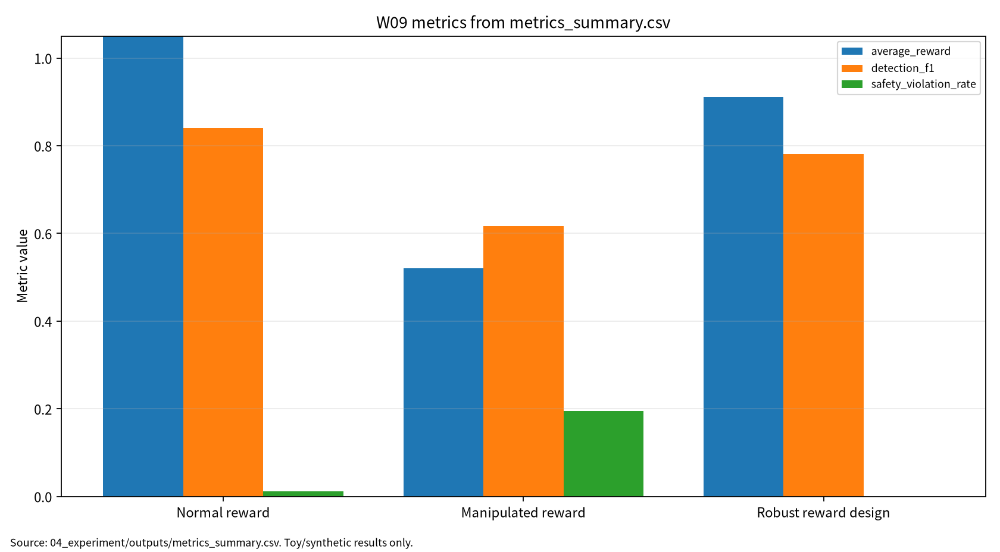

# W09 제출용 단일 보고서

## 심층강화학습(DRL) & 사이버보안 적용·보상조작

## 0. 메타정보

| 항목 | 내용 |
|---|---|
| 주차 | W09 |
| 보고서 제목 | 심층강화학습(DRL) & 사이버보안 적용·보상조작 |
| 과목 범위 | AI 보안 |
| 작성자 | 박영세 |
| 학번 | 26200122 |
| 작성일 | 2026-06-26 |
| 문서 상태 | 주차별 단일 제출용 보고서 |
| 원본 관리 파일 | `03_weekly_reports/w09_drl_cybersecurity/07_week_submission/w09_submission_report.md` |
| Word/PDF 제출본 권장 위치 | `03_weekly_reports/w09_drl_cybersecurity/07_week_submission/exports/` |
| 관련 산출물 위치 | `03_weekly_reports/w09_drl_cybersecurity/` |
| 안전 범위 | 실제 시스템 침해, 실제 네트워크 공격, 개인정보, exploit 실행, 무단 스캔 제외 |
| PDF 검토 상태 | P01~P05 로컬 PDF blob 존재 확인. 제출 본문은 DOI/URL, `paper_list.md`, 논문별 summary, 실험 보고서 기준으로 작성 |
| 제출 전 주의 | P01/P02는 로컬 PDF가 arXiv 판본이고 공식 DOI 출판판과 세부 대조 필요. P03/P04/P05는 강의계획서 저자 표기와 공식 DOI 메타데이터 차이 확인 필요 |

---

## 초록

본 보고서는 W09 주차의 심층강화학습(DRL) 원리와 사이버보안 적용, 보상조작 위협을 하나의 제출용 보고서로 통합한다. DRL은 MDP, value function, Q-learning, policy gradient, actor-critic을 통해 순차 의사결정 policy를 학습한다. 사이버보안 환경에서는 DRL agent가 IDS/IPS, patching, isolation, escalation, moving target defense 같은 자동 대응을 수행할 수 있지만, reward signal이 조작되거나 reward function이 실제 보안 목표를 잘못 반영하면 높은 observed reward가 낮은 실제 보안성으로 이어질 수 있다. 본 보고서는 W09 논문 5편을 바탕으로 DRL 원리, 안전중요 자동화, cyber-defense DRL, RL cybersecurity survey, DRL verification을 연결하고, synthetic cyber-defense state/action/reward와 tabular Q-learning을 사용한 안전한 toy protocol로 average reward, observed reward, detection F1, safety violation rate, policy robustness, reproducibility evidence를 분리 기록하였다. 실험 결과는 실제 IDS/IPS 제품, 실제 운영망, 실제 neural DRL policy의 성능이 아니라 평가 구조를 설명하기 위한 안전한 예시로 한정한다.

**키워드:** DRL, MDP, Q-learning, cyber defense, reward manipulation, reward misspecification, safety violation, policy robustness, verification, reproducibility

---

## 1. 한 문장 요약

W09는 DRL 기반 사이버 방어 에이전트에서 높은 observed reward가 실제 보안성, 낮은 safety violation, 높은 detection F1, 높은 policy robustness를 보장하지 않음을 보여주는 주차다.

---

## 2. 학습 배경과 주차 목표

### 2.1 이번 주 주제의 위치

W09는 W01~W08에서 다룬 AI 보안 평가축을 순차 의사결정형 보안 에이전트로 확장한다. W08까지는 데이터, prompt, context, model output, tool action의 위험을 주로 다루었다면, W09는 agent가 state를 관측하고 action을 선택하며 reward를 통해 policy를 업데이트하는 구조를 다룬다. 사이버보안에서는 DRL agent가 IDS/IPS, patching, isolation, escalation 같은 자동 대응을 수행할 수 있지만, reward manipulation이나 reward misspecification이 발생하면 높은 observed reward가 실제 보안성을 의미하지 않을 수 있다.

### 2.2 강의계획서상 학습목표

- MDP, return, value function, Q-learning, policy optimization의 기본 원리를 이해한다.
- DQN, policy gradient, actor-critic이 tabular Q-learning에서 어떻게 확장되는지 정리한다.
- DRL for cybersecurity의 state, action, reward, policy, log 설계 문제를 이해한다.
- Reward manipulation과 reward misspecification을 구분하고, observed reward와 true reward를 분리한다.
- Detection F1, safety violation rate, policy robustness, reproducibility evidence를 함께 보고한다.

### 2.3 이번 주 핵심 질문

1. DRL agent의 reward가 실제 보안 목표와 어긋나면 어떤 문제가 생기는가?
2. Observed reward와 true average reward는 왜 분리해 기록해야 하는가?
3. 사이버 방어 자동화에서 Detection F1과 Safety Violation Rate는 어떤 trade-off를 가지는가?
4. DRL verification과 runtime monitoring은 reward 기반 평가의 한계를 어떻게 보완하는가?
5. W09의 synthetic toy protocol을 기말논문의 DRL cyber-defense safety evaluation으로 확장하려면 어떤 지표가 필요한가?

---

## 3. 논문 5편의 서술형 종합 요약

### 3.1 P01. Deep Reinforcement Learning: A Brief Survey

P01은 DRL의 기본 원리를 정리하는 핵심 문헌이다. 강화학습은 agent가 environment의 state를 관측하고 action을 선택하며 reward를 받아 policy를 개선하는 순차 의사결정 문제다. DRL은 value function, Q-learning, policy gradient, actor-critic 같은 강화학습 방법에 deep neural network를 결합해 고차원 관측과 복잡한 action space를 다룰 수 있게 한다.

보안 관점에서 P01은 W09의 이론 기반이다. 사이버 방어 agent도 alert level, asset criticality, vulnerability, attack signal을 state로 보고, monitor, isolate, patch, escalate 같은 action을 선택한다. 따라서 보안 평가에서는 reward만 보는 것이 아니라 policy가 실제 보안 목표를 만족하는지 별도 safety metric으로 검증해야 한다. 현재 로컬 PDF는 arXiv extended version이고 제출 서지는 IEEE Signal Processing Magazine DOI 출판판을 우선한다.

### 3.2 P02. Deep Reinforcement Learning for Autonomous Driving: A Survey

P02는 DRL을 안전중요 자율 시스템에 적용할 때의 위험을 보여주는 문헌이다. 자율주행은 simulation training, validation, safe exploration, constrained reward, sim-to-real gap, rare event evaluation이 중요하다. 높은 시뮬레이션 reward가 실제 도로 안전성을 보장하지 않기 때문이다.

W09에서는 P02를 사이버 방어 자동화의 안전성 유추 근거로 사용한다. 사이버 방어도 실제 운영망에서 잘못된 isolation이나 patching, false blocking이 서비스 중단을 만들 수 있다. 따라서 DRL 기반 자동 보안 대응은 reward maximization뿐 아니라 safety violation, human override, runtime monitoring, verification을 함께 고려해야 한다. 현재 로컬 PDF는 arXiv v2이며 공식 출판판과 세부 차이는 최종 제출 전 확인이 필요하다.

### 3.3 P03. Deep Reinforcement Learning for Cyber Security

P03은 DRL을 사이버보안에 적용한 대표 문헌이다. DRL은 intrusion detection, malware analysis, moving target defense, cyber-physical defense, game-theoretic defense, autonomous response 등에 적용될 수 있다. 이때 cyber-defense problem은 state, action, reward, transition, policy를 어떻게 정의하느냐에 따라 성능과 안전성이 크게 달라진다.

보안 관점에서 P03은 W09의 핵심 관련연구다. DRL cyber-defense agent는 탐지 성능, 대응 비용, false positive, false negative, attack containment, service availability를 함께 고려해야 한다. 강의계획서의 `Ngoc-Tinh Nguyen et al.` 표기와 공식 DOI 기준 `Thanh Thi Nguyen; Vijay Janapa Reddi` 표기가 달라 검증 메모를 유지한다.

### 3.4 P04. Cyber-security and reinforcement learning — A brief survey

P04는 cyber-security와 reinforcement learning의 적용 영역을 넓게 정리한다. RL은 IDS/IPS, IoT security, access control, malware response, cyber-physical systems, resource allocation, attack-defense game에 적용될 수 있다. 사이버보안 task에서는 탐지율, precision, recall, F1, response cost, false blocking, latency, operational risk를 함께 평가해야 한다.

보안 관점에서 P04는 W09의 평가 지표 근거다. 보안 자동 대응은 단순히 공격을 막는 것만이 아니라 정상 사용자의 서비스 접근을 과도하게 차단하지 않아야 한다. 따라서 false blocking, safety violation, response cost를 포함한 다중지표가 필요하다. 강의계획서의 `Aditya Adawadkar et al.` 표기와 공식 DOI 저자 표기 차이는 최종 확인 메모로 남긴다.

### 3.5 P05. Deep Reinforcement Learning Verification: A Survey

P05는 DRL policy verification과 safety specification을 정리한다. DRL agent는 학습 과정에서 높은 reward를 달성하더라도 특정 state에서 unsafe action을 선택할 수 있다. Verification은 policy가 안전 명세를 만족하는지 분석하고, runtime monitoring은 배포 후 위험 action을 감시한다.

W09에서 P05는 reward와 safety를 분리해야 하는 직접 근거다. DRL cyber-defense agent가 reward를 높이더라도, 중요 자산을 잘못 isolate하거나 공격 이벤트를 monitor로 방치하면 safety violation이 발생한다. 따라서 safety property, violation rate, robustness, runtime monitor, reproducibility evidence를 함께 기록해야 한다. 단, 강의계획서의 `H. Yan et al.` 지정 문헌과 현재 Landers/Doryab DOI 문헌이 동일한지는 최종 확인이 필요하다.

---

## 4. 논문 간 연결 관계

W09 논문 5편은 다음 흐름으로 연결된다.

```text
DRL 기본 원리
→ 안전중요 자동화와 sim-to-real gap
→ DRL for cybersecurity
→ RL cybersecurity 적용과 탐지 지표
→ DRL verification과 safety specification
```

P01은 MDP, Q-learning, DQN, policy gradient, actor-critic 기본 원리를 제공한다. P02는 안전중요 자동화에서 reward와 safety를 분리해야 함을 보여준다. P03/P04는 DRL과 RL이 사이버보안에 적용되는 영역과 지표를 정리한다. P05는 높은 reward와 safety specification 만족이 별개임을 보여준다. 이 다섯 문헌을 종합하면 W09의 핵심 메시지는 “DRL cyber-defense policy는 reward, detection, safety, robustness, verification을 함께 평가해야 한다”는 것이다.

---

## 5. AI 원리 70% 정리

DRL은 MDP를 기반으로 state, action, reward, transition, policy를 정의한다. Agent는 장기 return을 최대화하는 policy를 학습한다. Q-learning은 action-value function을 temporal difference update로 갱신하고, DQN은 Q-function을 neural network로 근사한다. Policy gradient는 policy parameter를 직접 최적화하며, actor-critic은 policy를 담당하는 actor와 value estimation을 담당하는 critic을 결합한다.

### 5.1 핵심 수식

Discounted return은 장기 보상을 누적해 정의한다.

$$
G_t=\sum_{k=0}^{\infty}\gamma^k r_{t+k+1}
$$

Q-learning의 기본 update는 다음과 같다.

$$
Q(s_t,a_t)\leftarrow Q(s_t,a_t)+\alpha\left[r_{t+1}+\gamma\max_a Q(s_{t+1},a)-Q(s_t,a_t)\right]
$$

Policy objective는 기대 return을 최대화하는 문제다.

$$
J(\theta)=\mathbb{E}_{\pi_{\theta}}[G_t]
$$

사이버 방어 reward는 보안 효과와 운영 비용, 안전 위반을 함께 포함할 수 있다.

$$
R_{sec}=R_{detect}-\lambda_1C_{response}-\lambda_2V_{safety}-\lambda_3FP_{block}
$$

Reward manipulation gap은 observed reward와 true reward의 차이로 볼 수 있다.

$$
RewardGap=R_{obs}-R_{true}
$$

Safety violation rate는 unsafe action이 발생한 비율이다.

$$
SVR=\frac{N_{viol}}{N_{eval}}
$$

Policy robustness는 perturbation 조건에서 유지된 성능 비율로 기록한다.

$$
PolicyRobustness=\frac{Score_{perturbed}}{Score_{clean}}
$$

| 기호 | 의미 |
|---|---|
| $s_t$ | 시점 $t$의 state |
| $a_t$ | 시점 $t$의 action |
| $r_t$ | reward |
| $\gamma$ | discount factor |
| $\alpha$ | learning rate |
| $R_{obs}$ | 관측 또는 조작된 reward |
| $R_{true}$ | 실제 보안 목표 기준 reward |
| $N_{viol}$ | safety violation 수 |
| $N_{eval}$ | 평가 episode 또는 sample 수 |

### 5.2 핵심 개념과 보안 연결

| 개념 | 핵심 의미 | 보안 연결 |
|---|---|---|
| MDP | state, action, reward 기반 의사결정 | cyber-defense state/action/reward 설계 |
| Q-learning | TD update로 행동가치 학습 | toy policy 학습과 reward 조작 영향 분석 |
| DQN | Q-function의 neural approximation | 향후 neural DRL cyber-defense 확장 |
| Policy gradient | policy 직접 최적화 | 자동 대응 확률 정책 평가 |
| Actor-critic | actor와 critic 결합 | 성능/가치 평가 분리 |
| Reward integrity | reward signal의 신뢰성 | reward manipulation, reward misspecification |
| DRL verification | safety specification 검토 | reward와 safety 분리 평가 |

---

## 6. 보안 이슈 30% 정리

안전중요 자율 시스템에서 DRL은 시뮬레이션과 실제 배포 사이의 검증 문제가 중요하다. 사이버보안 DRL 연구는 IDS, cyber-physical systems, game-theoretic defense 등 다양한 적용 영역을 포함한다. RL 기반 cybersecurity 연구에서는 detection rate, precision, recall, F1, response cost, false blocking을 함께 보고해야 한다. DRL verification 연구는 높은 reward와 safety specification 만족이 별개임을 보여준다.

| 보안 속성 | W09에서의 의미 | 대표 위협 | 평가 지표 |
|---|---|---|---|
| Integrity | reward signal과 state observation의 무결성 | reward manipulation, state perturbation | reward gap, observed reward |
| Safety | 자동 대응이 위험 action을 선택하지 않는가 | unsafe isolate, attack monitor 방치 | safety violation rate |
| Availability | 정상 서비스 과차단 또는 대응 비용 | false blocking, excessive isolation | response cost, F1 drop |
| Robustness | 교란 state에서도 policy 성능 유지 | perturbed observation | policy robustness |
| Accountability | policy, reward, state/action log 추적 가능성 | 검증 불가 policy | reproducibility evidence |

---

## 7. Research Track 분석

### 7.1 연구문제

- RQ1. Reward manipulation은 DRL cyber-defense policy의 true reward, detection F1, safety violation, policy robustness에 어떤 영향을 주는가?
- RQ2. Observed reward가 높은 조건이 실제 보안 목표에서도 좋은 조건인가?
- RQ3. Robust reward design은 safety violation을 줄이면서 detection F1과 reward에 어떤 비용을 만드는가?
- RQ4. DRL cyber-defense agent에 대해 어떤 verification 및 runtime monitoring evidence가 필요한가?

### 7.2 위협모형

| 항목 | 내용 |
|---|---|
| 보호 자산 | state observation, reward function, policy, response action, security logs, Q-table/model checkpoint |
| 공격자 목표 | reward signal manipulation, unsafe policy 유도, false blocking 증가, attack monitor 방치 |
| 공격자 지식 | reward design 일부 추정, state/action space 관찰, policy output 관찰 가능성 |
| 공격자 능력 | reward signal 왜곡, state observation perturbation, misleading alert pattern 생성 |
| 공격 경로 | synthetic cyber state → action selection → reward signal → policy update → safety/robustness failure |
| 방어자 능력 | robust reward design, reward audit, safety penalty, runtime monitoring, verification |
| 제외 범위 | 실제 네트워크 공격, exploit 실행, 무단 스캔, 개인정보 및 운영망 데이터 사용 |

### 7.3 평가축

| 평가축 | 질문 | 대표 지표 또는 증거 |
|---|---|---|
| True performance | 실제 보안 목표 기준 성능이 유지되는가 | average reward |
| Observed reward | agent가 관측한 reward는 어떤가 | observed reward |
| Detection quality | 공격/정상 대응을 잘 구분하는가 | detection F1 |
| Safety | unsafe response가 발생하는가 | safety violation rate |
| Robustness | state perturbation 조건에서도 정책이 유지되는가 | policy robustness |
| Reproducibility evidence | 동일 결과를 다시 만들 수 있는가 | seed, config, script, CSV, JSON, run log |

### 7.4 재현성

재현성을 위해 seed, state definition, action definition, reward function, train/eval step, Q-learning parameter, safety violation rule, CSV/JSON/Markdown log를 보존한다. W09 실습은 synthetic toy cyber-defense states를 사용하며, 실제 IDS/IPS, 운영망 traffic, 개인정보, exploit execution을 포함하지 않는다.

---

## 8. 실습 보고서 및 그래프 수치 검증

본 실습은 실제 IDS/IPS 제품이나 실제 네트워크 트래픽 기반 DRL 학습이 아니라 W09의 핵심인 보상조작 평가축을 안전하게 설명하기 위한 최소 toy protocol이다. Synthetic cyber-defense state/action/reward 환경과 tabular Q-learning을 사용해 normal reward, manipulated reward, robust reward design 조건을 분리하였다.

### 8.1 실습 설계

| 항목 | 내용 |
|---|---|
| Environment | Synthetic toy cyber-defense states |
| State | alert level, asset criticality, vulnerability |
| Actions | monitor, isolate, patch, escalate |
| Algorithm | Tabular Q-learning |
| Conditions | Normal reward, manipulated reward, robust reward design |
| Train/Eval | 5000 train steps, 600 eval samples |
| Seed | 42 |
| Outputs | `metrics_summary.csv`, `results.json`, `run_log.md` |

### 8.2 실습 결과 수치

| 조건 | Average Reward | Observed Reward | Detection F1 | Safety Violation Rate | Policy Robustness | 해석 |
|---|---:|---:|---:|---:|---:|---|
| Normal reward | 1.085250 | 1.085250 | 0.840206 | 0.011667 | 0.838417 | 기준 보상은 탐지 성능과 안전성 균형이 가장 좋음 |
| Manipulated reward | 0.521167 | 0.842000 | 0.617512 | 0.195000 | 0.325000 | 관측 보상은 덜 나빠 보이나 true reward, F1, robustness가 악화되고 safety violation 증가 |
| Robust reward design | 0.910833 | 0.967083 | 0.780952 | 0.000000 | 0.709583 | safety violation을 제거했지만 F1과 average reward 비용 발생 |

Observed reward 기준으로는 manipulated reward 조건이 나쁘지 않아 보일 수 있지만, true reward 기준 average reward는 0.521167로 떨어졌다. 이는 reward signal이 조작되면 agent가 “좋은 점수”를 받는 방향으로 행동해도 실제 보안 목표는 악화될 수 있음을 보여준다.

### 8.3 그래프 수치 검증

현재 제출 보고서의 그래프는 `assets/w09_metric_chart.png`를 참조한다. 확인 가능한 SVG 그래프에는 `average_reward`, `observed_reward`, `detection_f1`, `safety_violation_rate`, `policy_robustness` 다섯 series가 표시되어 있다. 따라서 그래프 해석은 아래 5개 지표 기준으로 제한한다.

| 조건 | 그래프 Avg Reward | 표 Avg Reward | 그래프 Observed Reward | 표 Observed Reward | 그래프 Detection F1 | 표 Detection F1 | 그래프 Safety Violation | 표 Safety Violation | 그래프 Robustness | 표 Robustness | 확인 결과 |
|---|---:|---:|---:|---:|---:|---:|---:|---:|---:|---:|---|
| Normal reward | 1.085250 | 1.085250 | 1.085250 | 1.085250 | 0.840206 | 0.840206 | 0.011667 | 0.011667 | 0.838417 | 0.838417 | 일치 |
| Manipulated reward | 0.521167 | 0.521167 | 0.842000 | 0.842000 | 0.617512 | 0.617512 | 0.195000 | 0.195000 | 0.325000 | 0.325000 | 일치 |
| Robust reward design | 0.910833 | 0.910833 | 0.967083 | 0.967083 | 0.780952 | 0.780952 | 0.000000 | 0.000000 | 0.709583 | 0.709583 | 일치 |

<!-- submission-metric-chart:start -->
**그림 1. W09 metrics summary chart**



출처: `04_experiment/outputs/metrics_summary.csv`. 이 그래프는 공개 toy/synthetic 산출물 기반이며 실제 공격 성능이나 운영 환경 성능으로 일반화하지 않는다. 현재 그래프는 average_reward, observed_reward, detection_f1, safety_violation_rate, policy_robustness를 시각화한다.
<!-- submission-metric-chart:end -->

---

## 9. 기말논문 연결

W09는 기말논문에서 “DRL 기반 사이버 방어 에이전트의 보상조작 위협과 안전성 평가 프레임워크”로 확장할 수 있다. 핵심 기여 후보는 reward integrity 위협모형, observed reward와 true reward 분리, Detection F1/Safety Violation/Policy Robustness 평가표, seed/config/output 기반 재현성 구조다.

| 기말논문 장 | W09 반영 내용 |
|---|---|
| 1장 서론 | 자동 보안 대응에서 reward 기반 평가의 한계 제시 |
| 2장 관련연구 | DRL 원리, safe DRL, cyber-defense DRL, RL cybersecurity, DRL verification 문헌 정리 |
| 3장 위협모형 | state observation, reward signal, policy, action log 보호 자산 정의 |
| 4장 연구방법 | average reward, observed reward, detection F1, safety violation, robustness 설계 |
| 5장 분석 | normal/manipulated/robust reward 조건 비교 |
| 6장 결론 | DRL 보안 에이전트는 reward뿐 아니라 safety specification과 robustness를 함께 검증해야 함 |

---

## 10. AI 도구 활용 기록

AI 도구는 문헌 요약, 코드 점검, 문장 구조화, 그래프 생성 보조에 사용하였다. 모든 DOI/URL, 실험 수치, 본문 인용, 결론은 작성자가 outputs 파일과 로컬 참고문헌 검증표를 대조하여 검증한다.

| 항목 | 내용 |
|---|---|
| 사용 도구명 | Codex, ChatGPT 계열 도구 |
| 사용 목적 | 문헌 요약 정리, 보고서 구조화, 안전한 toy/synthetic 실험 결과 표기 점검, 그래프 생성 보조, 제출 전 체크리스트 정리 |
| AI 산출물 반영 위치 | `07_week_submission/w09_submission_report.md`, `07_week_submission/assets/w09_metric_chart.png`, `05_ai_worklog/ai_disclosure_draft.md` |
| 본인 수정 내용 | 주차별 문헌 상태 확인, 실험 수치와 outputs 대조, 안전 범위와 한계 문장 확인, 최종 제출 전 미확정 문헌 분리 |
| 사실관계 검증 방법 | `01_papers/paper_list.md`, `01_papers/doi_check.md`, 강의계획서 문헌표 대조 |
| 실험결과 검증 방법 | `04_experiment/experiment_report.md`, `04_experiment/outputs/metrics_summary.csv`, `results.json`, `run_log.md`의 수치와 보고서 표기 대조 |
| 최종 책임 확인 | AI 산출물은 초안 보조이며 최종 제출자는 원고 내용, 인용, 실험결과, 연구윤리 책임을 확인한다. |

---

## 11. 제출 전 자기 점검표

| 점검 항목 | 상태 | 비고 |
|---|---|---|
| 메타정보 작성 | 완료 | 작성일 2026-06-26 반영 |
| 초록 및 키워드 작성 | 완료 |  |
| AI 원리 70% 정리 | 완료 | 핵심 수식 추가 |
| 보안 이슈 30% 정리 | 완료 |  |
| 논문 5편 서술형 요약 | 완료 |  |
| 논문 간 연결 관계 작성 | 완료 |  |
| Research Track 5요소 작성 | 완료 | 연구문제, 위협모형, 평가방법, 재현성, 한계 |
| P01~P05 PDF blob 확인 | 완료 | GitHub 파일 존재 확인. 원문 PDF 저작권/배포 정책 별도 검토 필요 |
| P01~P05 DOI/URL 검증 | 완료 / 확인 필요 | P01/P02 판본 차이, P03/P04/P05 저자 표기 차이 확인 필요 |
| P01 출판판-arXiv 차이 | 확인 필요 | 로컬 PDF는 arXiv extended version |
| P02 출판판-arXiv 차이 | 확인 필요 | 로컬 PDF는 arXiv v2 |
| P03 강의계획서 저자명 | 확인 필요 | `Ngoc-Tinh Nguyen et al.` vs 공식 DOI 저자 차이 |
| P04 강의계획서 저자명 | 확인 필요 | `Aditya Adawadkar et al.` vs 공식 DOI 저자 차이 |
| P05 지정 논문 동일성 | 확인 필요 | `H. Yan et al.` vs Landers/Doryab |
| 실험 outputs 파일 존재 확인 | 완료 | 실험 보고서 기준 CSV/JSON/run_log 존재 |
| 실험 결과와 보고서 수치 일치 | 완료 | 실험 보고서 수치 기준 반영 |
| 그래프 수치 확인 | 완료 | average/observed reward, F1, safety violation, robustness 기준 표와 일치 |
| AI 활용 고지 작성 | 완료 |  |
| DOCX/PDF 제출본 생성 | 필요 | `07_week_submission/exports/` 권장 |
| 최종 사람이 검토할 항목 표시 | 완료 | 판본·저자명·문헌 동일성, PDF 보관 정책, Word/PDF 렌더링 |

---

## 12. 참고문헌 검증표

| 번호 | 참고문헌 | DOI/URL | 상태 | 비고 |
|---:|---|---|---|---|
| [1] | Kai Arulkumaran et al., “Deep Reinforcement Learning: A Brief Survey,” IEEE Signal Processing Magazine, 2017 | `https://doi.org/10.1109/MSP.2017.2743240` | 공식 DOI 확인 | 로컬 PDF는 arXiv extended version |
| [2] | B. Ravi Kiran et al., “Deep Reinforcement Learning for Autonomous Driving: A Survey,” IEEE TITS, 2022 | `https://doi.org/10.1109/TITS.2021.3054625` | 공식 DOI 확인 | 로컬 PDF는 arXiv v2. 최종 출판연도는 2022로 기록 |
| [3] | Thanh Thi Nguyen, Vijay Janapa Reddi, “Deep Reinforcement Learning for Cyber Security,” IEEE TNNLS, 2023 | `https://doi.org/10.1109/TNNLS.2021.3121870` | 공식 DOI 확인 | 강의계획서 `Ngoc-Tinh Nguyen et al.` 표기 확인 필요 |
| [4] | Amrin Maria Khan Adawadkar, Nilima Kulkarni, “Cyber-security and reinforcement learning — A brief survey,” Engineering Applications of Artificial Intelligence, 2022 | `https://doi.org/10.1016/j.engappai.2022.105116` | 공식 DOI 확인 | 강의계획서 `Aditya Adawadkar et al.` 표기 확인 필요 |
| [5] | Matthew Landers, Afsaneh Doryab, “Deep Reinforcement Learning Verification: A Survey,” ACM Computing Surveys, 2023 | `https://doi.org/10.1145/3596444` | 공식 DOI 확인 | 강의계획서 `H. Yan et al.` 지정 문헌 동일성 확인 필요 |

---

## 13. 부록 A. KCI 논문 형식 전환 아이디어

### A.1 제목 후보

| 번호 | 국문 제목 후보 | 영문 제목 후보 | 예상 기여 |
|---:|---|---|---|
| 1 | DRL 기반 사이버 방어 에이전트의 보상조작 위협과 안전성 평가 프레임워크 연구 | A Safety Evaluation Framework for Reward Manipulation Threats in DRL-Based Cyber Defense Agents | reward integrity·safety 평가표 |
| 2 | 강화학습 기반 자동 보안 대응에서 보상함수 설계와 안전 위반율의 관계 분석 | An Analysis of Reward Design and Safety Violation Rate in Reinforcement Learning-Based Automated Security Response | reward-safety trade-off 분석 |
| 3 | 사이버보안 DRL 정책의 Detection F1, Safety Violation, Policy Robustness 통합 평가 연구 | A Multi-Metric Evaluation of Detection F1, Safety Violation, and Policy Robustness in Cybersecurity DRL Policies | 다중지표 평가 프로토콜 |

추천 제목은 “DRL 기반 사이버 방어 에이전트의 보상조작 위협과 안전성 평가 프레임워크 연구”이다. 국문초록은 reward manipulation이 정책 성능과 안전성에 미치는 영향을 다중지표로 평가하고, 실제 공격/운영망 데이터 없이 synthetic toy protocol로 재현 가능한 보고 구조를 제시하는 방향이 적절하다.

### A.2 연구문제

- RQ1. Reward manipulation은 DRL cyber-defense policy의 true reward와 observed reward gap을 어떻게 만드는가?
- RQ2. Reward manipulation은 Detection F1, Safety Violation Rate, Policy Robustness를 어떻게 변화시키는가?
- RQ3. Robust reward design은 safety violation을 줄이면서 어떤 성능 비용을 만드는가?

---

## 14. 부록 B. SCI 논문 형식 전환 아이디어

SCI 제목 후보는 “A Multi-Metric Safety Evaluation Framework for Reward Manipulation in DRL-Based Cyber Defense Agents”이다.

Structured abstract는 Background, Problem, Method, Results, Contribution, Implications로 구성한다. 결과 문장은 W09 toy evaluation이 manipulated reward 조건에서 average reward 0.521167, detection F1 0.617512, safety violation rate 0.195000, policy robustness 0.325000을 기록했고, robust reward design에서 safety violation을 0.000000으로 낮췄다는 수준으로 제한한다. 실제 IDS/IPS 또는 neural DRL 성능으로 일반화하지 않는다.

| 연구축 | 대표 논문 | 역할 |
|---|---|---|
| DRL fundamentals | Arulkumaran et al. | MDP, Q-learning, DQN, policy gradient, actor-critic |
| Safety-critical DRL automation | Kiran et al. | safe RL, validation, sim-to-real risk |
| DRL for cybersecurity | Nguyen and Reddi | cyber defense, IDS, game-theoretic defense |
| RL for cybersecurity applications | Adawadkar and Kulkarni | IDS/IPS, IoT, IAM, standard metrics |
| DRL verification | Landers and Doryab | safety specification, robustness, policy verification |

---

## 15. 부록 C. 제출 파일 위치와 변환 권장

| 파일 | 설명 |
|---|---|
| `07_week_submission/w09_submission_report.md` | 본 제출용 보고서 원본 |
| `07_week_submission/assets/w09_metric_chart.png` | 제출 보고서 그래프 |
| `04_experiment/experiment_report.md` | 실험 근거 보고서 |
| `04_experiment/outputs/` | 실험 결과 근거 파일 위치 |
| `05_ai_worklog/ai_disclosure_draft.md` | AI 활용 고지 근거 |

Word 제출본은 다음 위치에 생성해 관리한다.

```text
03_weekly_reports/w09_drl_cybersecurity/07_week_submission/exports/w09_submission_report.docx
```

PDF 제출본은 Word에서 최종 육안 검수 후 다음 위치에 저장한다.

```text
03_weekly_reports/w09_drl_cybersecurity/07_week_submission/exports/w09_submission_report.pdf
```

수식은 GitHub와 Word 변환을 모두 고려하여 Markdown 표 안에 넣지 않고, `$$...$$` block math로 유지한다.
