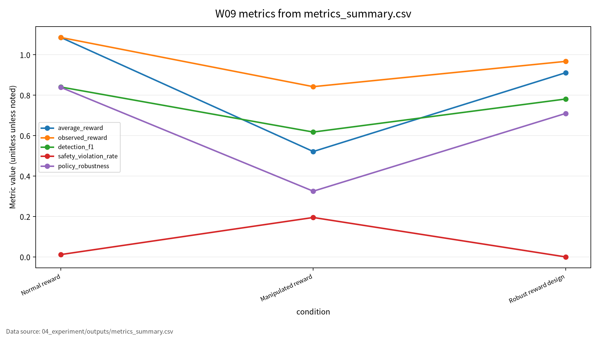

# W09 DRL & Cybersecurity

## 1. 핵심 메시지

DRL cyber-defense에서 reward가 흔들리면 높은 점수 뒤에 안전하지 않은 정책이 숨어 있을 수 있다.

---

## 2. 발표 질문

- DRL 에이전트는 무엇을 보고, 무엇을 선택하고, 무엇을 보상으로 받는가
- reward manipulation은 정책을 어떻게 왜곡하는가
- 안전한 자동 대응은 어떤 지표로 평가할 수 있는가

---

## 3. AI 원리 70%

| 개념 | 역할 |
|---|---|
| State | alert, 자산 중요도, 취약 여부 |
| Action | monitor, isolate, patch, escalate |
| Reward | 탐지 성공, 운영 비용, 안전 위반 |
| Policy | 상태별 대응 전략 |

---

## 4. 문헌의 역할

P01은 DRL 원리, P02는 안전중요 자동화, P03/P04는 cyber-defense 적용, P05는 DRL verification을 담당한다. P05는 강의계획서 저자명과 현재 PDF 저자명이 달라 확인 필요다.

---

## 5. 위협모형

```text
State observation -> Policy decision -> Automated response
          ^                 ^
          |                 |
   state manipulation   reward manipulation
```

보호 자산은 상태 관측값, 보상함수, 정책, 로그, 대응 action이다.

---

## 6. 실험 설계

- Synthetic toy cyber-defense state
- Tabular Q-learning
- Seed 42
- 조건: Normal reward, Manipulated reward, Robust reward design
- 지표: Average Reward, Detection F1, Safety Violation Rate, Policy Robustness

---

## 7. 실험 결과

| 조건 | Avg Reward | F1 | Safety Violation | Robustness |
|---|---:|---:|---:|---:|
| Normal | 1.085250 | 0.840206 | 0.011667 | 0.838417 |
| Manipulated | 0.521167 | 0.617512 | 0.195000 | 0.325000 |
| Robust | 0.910833 | 0.780952 | 0.000000 | 0.709583 |

---

## 8. 해석

- Manipulated reward는 observed reward와 true security objective를 분리시킨다.
- Robust reward는 safety violation을 0으로 낮췄지만 false positive 비용을 만든다.
- 따라서 F1 하나만으로 자동 대응 정책을 평가하기 어렵다.
- 이 수치는 toy protocol 결과이며 실제 IDS/IPS 성능이 아니다.

---

## 9. 기말논문 연결

DRL 기반 사이버 방어 에이전트의 보상조작 위협과 안전성 평가 프레임워크.

---

## 10. 결론

- Reward integrity를 보호해야 한다.
- Detection F1과 Safety Violation Rate를 함께 봐야 한다.
- 수치는 실행 로그와 CSV/JSON에 있을 때만 주장한다.

<!-- formula-visual-supplement:start -->
# 수식·그래프·그림 보강

- 보강 일자: 2026-06-23
- 수식은 표준 정의식 또는 검증 가능한 평가식으로만 작성했다.
- 그래프는 `04_experiment/outputs/metrics_summary.csv`의 기존 수치만 사용했다.
- 다이어그램은 AI-assisted conceptual diagram이며 사실 자료나 실험 결과처럼 해석하지 않는다.

### 핵심 수식: MDP Tuple, Return, Bellman Equation

$$
\mathcal{M}=(\mathcal{S},\mathcal{A},P,R,\gamma),
\qquad
G_t=\sum_{k=0}^{\infty}\gamma^k r_{t+k},
\qquad
V^\pi(s)=\mathbb{E}_{a\sim\pi}\left[R(s,a)+\gamma\sum_{s'}P(s'|s,a)V^\pi(s')\right]
$$

| 기호 | 의미 |
|---|---|
| `\mathcal{S},\mathcal{A}` | 상태 공간과 행동 공간 |
| `P,R` | 전이확률과 보상 함수 |
| `\gamma` | 할인율 |
| `V^\pi` | 정책 pi의 상태 가치 |

**직관적 의미:**  
DRL은 상태, 행동, 전이, 보상으로 정책을 학습한다. Bellman 식은 현재 가치가 즉시 보상과 미래 가치로 구성됨을 보여준다.

**보안 관점 해석:**  
보상이 잘못 설계되면 정책이 보안 목표와 다른 방향으로 최적화될 수 있다.

**평가 지표 연결:**  
average_reward, observed_reward, detection_f1, policy_robustness와 연결한다.

**한계와 가정:**  
toy environment 기준이며 실제 사이버 작전 자동화를 다루지 않는다.

### 핵심 수식: Reward Manipulation Proxy

$$
\Delta R=\mathbb{E}[R_{observed}-R_{intended}],
\qquad
ViolationRate=\frac{\#\{\mathrm{safety\ violating\ episodes}\}}{\#\{\mathrm{episodes}\}}
$$

| 기호 | 의미 |
|---|---|
| `\Delta R` | 관측 보상과 의도 보상의 차이 |
| `R_{observed}` | 환경에서 관측된 보상 |
| `R_{intended}` | 보안 목적에 맞는 의도 보상 |
| `ViolationRate` | 안전 위반 에피소드 비율 |

**직관적 의미:**  
Reward manipulation은 숫자 보상은 높지만 보안 목적에는 어긋나는 상황을 설명한다.

**보안 관점 해석:**  
정책 평가는 reward와 safety violation을 동시에 확인해야 한다.

**평가 지표 연결:**  
safety_violation_rate, reward_variance, perturbed_detection_f1와 연결한다.

**한계와 가정:**  
proxy metric이며 formal safety proof가 아니다.

### 표 수치 기반 그래프



그래프는 reward, detection_f1, safety_violation_rate, policy_robustness를 조건별로 함께 보여준다. 보상 점수가 좋아 보여도 safety violation이 높으면 보안 정책으로는 실패할 수 있다. 수치는 `metrics_summary.csv`에서 읽었다.

### Threat Model / Pipeline Diagram


이 다이어그램은 `MDP security evaluation flow`를 발표용으로 요약한 개념도다. 데이터 흐름, 평가 지표, 한계 표시는 `assets/figure_manifest.md`에도 기록했다.

### 확인 필요

- DRL 환경은 toy simulation이며 실제 네트워크 공격 자동화 절차를 제공하지 않는다.
- 논문별 원문 절·쪽·그림 번호는 최종 제출 전 사람 검토가 필요하다.
<!-- formula-visual-supplement:end -->
