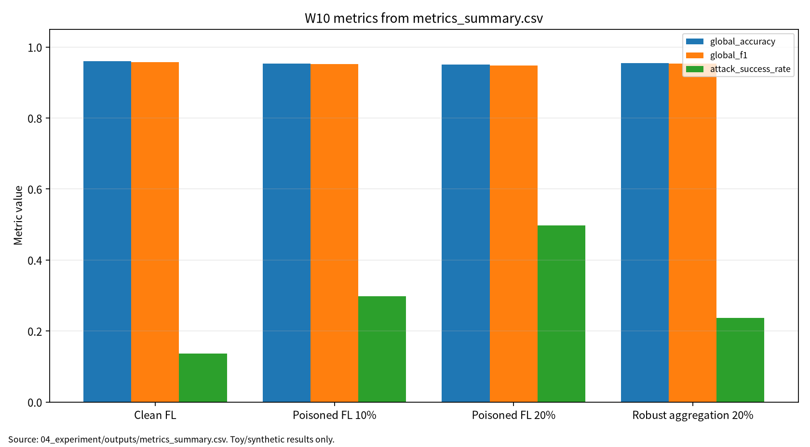

# W10 제출용 단일 보고서

## 연합학습(FL) & FL 위협·방어·정책

## 0. 메타정보

| 항목 | 내용 |
|---|---|
| 주차 | W10 |
| 보고서 제목 | 연합학습(FL) & FL 위협·방어·정책 |
| 과목 범위 | AI 보안 |
| 작성자 | 박영세 |
| 학번 | 26200122 |
| 작성일 | 2026-06-26 |
| 문서 상태 | 주차별 단일 제출용 보고서 |
| 원본 관리 파일 | `03_weekly_reports/w10_federated_learning_security/07_week_submission/w10_submission_report.md` |
| Word/PDF 제출본 권장 위치 | `03_weekly_reports/w10_federated_learning_security/07_week_submission/exports/` |
| 관련 산출물 위치 | `03_weekly_reports/w10_federated_learning_security/` |
| 안전 범위 | 실제 개인정보, 실제 FL 서비스 침해, 무단 클라이언트 접속, 실제 공격 payload, 실제 gradient inversion·membership inference 제외 |
| PDF 검토 상태 | P01~P05 로컬 PDF blob 존재 확인. 제출 본문은 DOI/URL, `paper_list.md`, 논문별 summary, 실험 보고서 기준으로 작성 |
| 제출 전 주의 | P01은 수업자료의 ACM CSUR 표기와 공식 DOI의 ACM TIST 표기가 다름. P04의 Article 번호는 추가 대조 필요 |

---

## 초록

본 보고서는 W10 주차의 연합학습 구조, FL 위협·방어, 개인정보보호 및 정책 쟁점을 하나의 제출용 보고서로 통합한다. Federated Learning은 각 client가 local data로 local update를 계산하고 server가 이를 aggregation해 global model을 갱신하는 분산 학습 방식이다. Raw data를 중앙 서버로 보내지 않는다는 장점이 있지만, local update와 aggregation 단계에서는 gradient leakage, membership inference, model poisoning, malicious client, backdoor, non-IID client drift, policy/compliance risk가 남는다. 본 보고서는 W10 논문 5편을 바탕으로 FL aggregation taxonomy, FL security/privacy, FL threats and defenses, privacy attack/policy landscape, FL backdoor attack/defense를 연결하고, synthetic federated binary classification과 toy logistic regression을 사용한 안전한 toy protocol로 global accuracy, global F1, ASR, privacy leakage proxy, mean update norm, communication bytes, aggregation rule, reproducibility evidence를 분리 기록하였다. 실험 결과는 실제 FL framework, secure aggregation, differential privacy, gradient inversion, membership inference, 실제 서비스 보안성을 의미하지 않으며 평가 구조를 설명하는 안전한 예시로 한정한다.

**키워드:** federated learning, FedAvg, robust aggregation, coordinate median, poisoning, backdoor, malicious client, privacy leakage, secure aggregation, non-IID, reproducibility

---

## 1. 한 문장 요약

W10은 FL 보안 평가가 raw data 비공유 여부만으로 충분하지 않으며, local update와 aggregation 단계의 privacy·integrity 위험을 global accuracy, global F1, ASR, privacy leakage proxy, aggregation type, communication bytes, reproducibility evidence로 함께 기록해야 함을 보여주는 주차다.

---

## 2. 학습 배경과 주차 목표

### 2.1 이번 주 주제의 위치

W10은 W01~W09의 AI 보안 평가축을 분산 학습 구조로 확장한다. W02의 poisoning, W05의 representation/backdoor, W07의 privacy leakage, W09의 보상·정책 평가가 모두 FL에서는 client update와 server aggregation 구조 안에서 다시 나타난다. FL은 개인정보를 중앙 서버에 직접 모으지 않는다는 장점이 있지만, local gradient/update, aggregation log, global model behavior가 새로운 보호 자산이 된다.

### 2.2 강의계획서상 학습목표

- Federated Learning, FedAvg, aggregation taxonomy, personalization, non-IID data 문제를 정리한다.
- FL의 gradient leakage, membership inference, poisoning, model poisoning, backdoor 위협을 분류한다.
- Secure aggregation과 robust aggregation의 차이를 설명한다.
- Malicious client rate와 aggregation rule이 clean utility와 ASR에 미치는 영향을 평가한다.
- Privacy leakage proxy와 실제 privacy attack 성공률을 구분해 기록한다.

### 2.3 이번 주 핵심 질문

1. FL은 raw data를 공유하지 않아도 왜 privacy risk가 남는가?
2. FedAvg는 malicious client update에 왜 취약할 수 있는가?
3. Robust aggregation은 clean utility와 ASR을 어떤 방향으로 바꾸는가?
4. Secure aggregation과 robust aggregation은 서로 보완적인가, 충돌하는가?
5. W10 toy 실험을 실제 FL 보안 평가 프레임워크로 확장하려면 어떤 안전 조건이 필요한가?

---

## 3. 논문 5편의 서술형 종합 요약

### 3.1 P01. Federated Learning Survey: A Multi-Level Taxonomy of Aggregation Techniques, Experimental Insights, and Future Frontiers

P01은 FL aggregation taxonomy와 실험적 관찰을 정리하는 핵심 문헌이다. FL은 여러 client가 local data를 서버로 직접 보내지 않고 local model update 또는 gradient만 전송한 뒤, server가 FedAvg와 같은 집계 방식으로 global model을 갱신한다. Aggregation은 단순 평균뿐 아니라 weighted averaging, robust aggregation, personalized aggregation, hierarchical aggregation 등으로 확장된다.

보안 관점에서 P01은 W10의 AI 원리 기반 문헌이다. Aggregation rule은 단순 최적화 절차가 아니라 보안 통제 지점이다. 악성 client update가 평균에 섞이면 global model의 integrity가 흔들릴 수 있고, non-IID data나 client drift가 있으면 정상 update와 악성 update를 구분하기 어려워진다. 다만 수업자료에는 P01이 ACM Computing Surveys로 표기되어 있으나, DOI 기준 공식 메타데이터는 ACM Transactions on Intelligent Systems and Technology이므로 제출 참고문헌은 공식 DOI 기준을 우선한다.

### 3.2 P02. A survey on security and privacy of federated learning

P02는 FL의 security/privacy 위험을 폭넓게 정리한다. FL은 raw data를 중앙 서버에 모으지 않지만, local update와 global model을 통해 information leakage가 발생할 수 있다. 공격자는 gradient inversion, membership inference, property inference, poisoning, model update manipulation, communication channel attack 등을 시도할 수 있다.

보안 관점에서 P02는 FL의 CIA/privacy 분류 근거다. Secure aggregation은 서버가 개별 client update를 직접 보지 못하게 해 confidentiality를 강화하지만, 악성 client update의 영향 자체를 줄이는 방어는 아니다. 반대로 robust aggregation은 integrity 방어에 가깝지만, privacy 보호를 자동으로 보장하지 않는다. 따라서 W10은 secure aggregation과 robust aggregation을 구분해 설명한다.

### 3.3 P03. Survey on federated learning threats: Concepts, taxonomy on attacks and defences, experimental study and challenges

P03은 FL threats and defenses taxonomy를 정리한다. 공격은 data poisoning, model poisoning, Byzantine attack, backdoor, inference attack, communication attack 등으로 나뉘고, 방어는 robust aggregation, anomaly detection, differential privacy, secure aggregation, client validation, auditing으로 나뉜다.

보안 관점에서 P03은 malicious client rate와 aggregation 방어 효과를 해석하는 기준을 제공한다. FL에서는 공격자가 server를 직접 장악하지 않아도 일부 client update를 조작해 global model behavior를 바꿀 수 있다. 따라서 malicious client index, malicious client rate, Byzantine rate, clean utility, ASR, defense overhead를 함께 기록해야 한다.

### 3.4 P04. The Federation Strikes Back: A Survey of Federated Learning Privacy Attacks, Defenses, Applications, and Policy Landscape

P04는 FL privacy attack, defense, application, policy landscape를 함께 다룬다. FL은 의료, 금융, 모바일, IoT, edge computing처럼 privacy-sensitive domain에서 자주 논의되지만, update leakage와 model output leakage가 여전히 남을 수 있다. 방어로는 secure aggregation, differential privacy, encryption, trusted execution, policy control, auditing이 사용될 수 있다.

보안 관점에서 P04는 privacy leakage proxy와 policy/compliance 평가의 근거다. 기술적 성능만으로 FL의 안전성을 주장하기 어렵고, 데이터 주체, client consent, audit log, regulatory compliance, cross-silo/cross-device deployment context가 함께 고려되어야 한다. P04의 Article 번호는 추가 대조가 필요하므로 검증 메모를 유지한다.

### 3.5 P05. Backdoor attacks and defenses in federated learning: Survey, challenges and future research directions

P05는 FL backdoor attack과 defense를 정리한다. FL backdoor는 일부 malicious client가 trigger-sensitive update를 제출해 global model이 정상 입력에서는 높은 clean accuracy를 유지하면서 trigger 조건에서는 target behavior를 보이게 만드는 공격이다. Model replacement, scaling attack, stealthy update, trigger design, client selection manipulation 등이 주요 쟁점이다.

보안 관점에서 P05는 W10 실험의 ASR 분리 평가 근거다. Clean accuracy가 유지되어도 ASR이 상승하면 FL global model은 보안적으로 실패할 수 있다. 따라서 global accuracy, global F1, ASR, malicious client rate, aggregation rule, defense effect, update norm, communication cost를 분리 기록해야 한다.

---

## 4. 논문 간 연결 관계

W10 논문 5편은 다음 흐름으로 연결된다.

```text
FL aggregation taxonomy
→ FL security/privacy 위협
→ FL attack-defense taxonomy
→ FL privacy attack·policy landscape
→ FL backdoor attack·defense 평가
```

P01은 FL aggregation과 FedAvg의 기본 구조를 제공한다. P02는 FL security/privacy 위험을 정리한다. P03은 attack/defense taxonomy를 제공하고, P04는 privacy attack과 policy landscape를 확장한다. P05는 backdoor와 ASR 평가를 특화한다. 이 다섯 문헌을 종합하면 W10의 핵심 메시지는 “FL 보안은 raw data 비공유가 아니라 update, aggregation, global behavior, policy compliance를 함께 검증하는 문제”라는 것이다.

---

## 5. AI 원리 70% 정리

FL은 각 client가 local data로 local model update를 계산하고, server가 이를 aggregation해 global model을 갱신하는 구조다. FedAvg는 client update를 가중 평균해 global model을 업데이트한다. Non-IID data에서는 client update의 방향과 크기가 client별로 달라지고, malicious client가 포함되면 평균 집계가 쉽게 왜곡될 수 있다. Robust aggregation은 coordinate median 같은 방식으로 극단적인 update의 영향을 줄이려 한다.

### 5.1 핵심 수식

FL의 전체 objective는 client별 local objective의 가중합으로 표현할 수 있다.

$$
F(w)=\sum_{k=1}^{K}\frac{n_k}{n}F_k(w)
$$

| 기호 | 의미 |
|---|---|
| $K$ | client 수 |
| $n_k$ | $k$번째 client의 sample 수 |
| $n$ | 전체 sample 수 |
| $F_k$ | $k$번째 client의 local objective |

FedAvg는 client update를 sample 수에 따라 평균한다.

$$
w_{t+1}=\sum_{k=1}^{K}\frac{n_k}{n}w_{t+1}^{(k)}
$$

Coordinate median robust aggregation은 각 좌표별 median을 사용한다.

$$
w_{t+1,j}=\mathrm{median}\left(w_{t+1,j}^{(1)},w_{t+1,j}^{(2)},\ldots,w_{t+1,j}^{(K)}\right)
$$

Malicious client rate는 전체 client 중 악성 update를 제출하는 client 비율이다.

$$
MalRate=\frac{K_{mal}}{K}
$$

Backdoor ASR은 trigger 조건에서 target behavior가 나타난 비율이다.

$$
ASR=\frac{N_{atk}}{N_{trig}}
$$

Privacy leakage proxy는 실제 privacy attack 성공률이 아니라 update 노출 위험의 대용 지표로만 기록한다.

$$
LeakProxy=\frac{1}{K}\sum_{k=1}^{K}\left\|\Delta w_k\right\|_2
$$

| 기호 | 의미 |
|---|---|
| $w_t$ | round $t$의 global model |
| $w_{t+1}^{(k)}$ | $k$번째 client의 local update 결과 |
| $K_{mal}$ | malicious client 수 |
| $N_{trig}$ | trigger 조건 평가 sample 수 |
| $N_{atk}$ | 공격 목표 행동이 발생한 sample 수 |
| $\Delta w_k$ | $k$번째 client update vector |

### 5.2 핵심 개념과 보안 연결

| 개념 | AI 원리 | 보안 연결 |
|---|---|---|
| Federated Learning | client가 local data로 update를 학습하고 server가 global model 갱신 | raw data 비공유만으로 privacy가 자동 보장되지는 않음 |
| FedAvg | client update를 평균해 global model 갱신 | 악성 update가 평균에 섞이면 model integrity 흔들림 |
| Non-IID client drift | client별 data distribution 차이 | 정상 drift와 악성 update 구분 어려움 |
| Secure aggregation | 서버가 개별 update를 보지 못하게 함 | confidentiality 강화 |
| Robust aggregation | 악성 또는 이상 update 영향 감소 | integrity 강화 |
| FL backdoor | malicious client가 trigger behavior를 global model에 주입 | clean accuracy와 ASR 분리 필요 |

---

## 6. 보안 이슈 30% 정리

FL은 raw data를 중앙 서버로 보내지 않지만 poisoning, inference attack, privacy leakage와 같은 보안·프라이버시 위험이 남는다. Secure aggregation은 서버가 개별 update를 보지 못하게 해 confidentiality를 강화하고, robust aggregation은 악성 또는 이상 update의 영향을 줄여 integrity를 강화한다. W10은 실제 공격 절차를 다루지 않고 synthetic toy 조건에서 평가표 형식을 검증한다.

| 보안 속성 | W10에서의 의미 | 대표 위협 | 평가 지표 |
|---|---|---|---|
| Confidentiality | local data와 client update의 민감정보 노출 | gradient leakage, membership inference | privacy leakage proxy |
| Integrity | malicious client update로 global model 왜곡 | poisoning, backdoor, model replacement | ASR, global F1 drop |
| Availability | 방어로 학습·통신 비용 증가 | client drop, communication overhead | communication bytes |
| Accountability | client update와 aggregation log 추적 필요 | provenance gap, audit failure | update provenance, run log |
| Robustness | non-IID와 malicious update 조건에서도 성능 유지 | client drift, Byzantine update | aggregation rule별 비교 |

---

## 7. Research Track 분석

### 7.1 연구문제

- RQ1. Malicious client 비율과 aggregation rule은 clean utility와 ASR에 어떤 영향을 주는가?
- RQ2. 20% malicious client 조건에서 FedAvg와 coordinate median의 ASR은 어떻게 달라지는가?
- RQ3. Privacy leakage proxy와 실제 privacy attack 성공률은 어떻게 구분해 보고해야 하는가?
- RQ4. Secure aggregation과 robust aggregation은 FL security/privacy 평가에서 어떤 상호보완 또는 충돌 관계를 가지는가?

### 7.2 위협모형

| 항목 | 내용 |
|---|---|
| 보호 자산 | client data, local update, global model, aggregation result, client provenance, training log |
| 공격자 목표 | malicious update 제출, backdoor behavior 주입, global model integrity 훼손, privacy leakage 유도 |
| 공격자 지식 | aggregation rule 일부 지식, global model 관찰, client participation pattern 추정 |
| 공격자 능력 | 일부 client 장악, poisoned update 제출, trigger-sensitive update 제출, update norm 조작 |
| 공격 경로 | local training → local update → aggregation server → global model → clean/trigger evaluation |
| 방어자 능력 | robust aggregation, secure aggregation, update auditing, anomaly detection, DP, logging |
| 제외 범위 | 실제 개인정보, 실제 FL 서비스 침해, 무단 client 접속, gradient inversion 실제 구현, membership inference 실제 공격 |

### 7.3 평가축

| 평가축 | 질문 | 대표 지표 또는 증거 |
|---|---|---|
| Global utility | 정상 test set 성능이 유지되는가 | global accuracy, global F1 |
| Backdoor behavior | trigger 조건 target behavior가 나타나는가 | ASR |
| Privacy exposure | update 노출 위험이 커지는가 | privacy leakage proxy |
| Update stability | client update 크기와 이상성이 커지는가 | mean update norm |
| Aggregation robustness | aggregation rule이 ASR을 낮추는가 | FedAvg vs coordinate median |
| Communication cost | 통신량이 얼마나 발생하는가 | communication bytes |
| Reproducibility evidence | 동일 결과를 다시 만들 수 있는가 | seed, config, CSV, JSON, run log |

### 7.4 재현성

재현성을 위해 seed, client 수, client별 sample 수, non-IID skew, malicious client rate, aggregation rule, round 수, local epoch, model setting, CSV/JSON/Markdown log를 보존한다. W10 실습은 synthetic federated binary classification을 사용하고 실제 client data나 실제 FL service에 접속하지 않는다.

---

## 8. 실습 보고서 및 그래프 수치 검증

본 실습은 실제 FL framework, 실제 클라이언트 데이터, 실제 privacy attack을 재현하는 것이 아니라 W10의 핵심인 FL 보안 평가축을 안전하게 설명하기 위한 최소 toy protocol이다. Synthetic federated binary classification 기반 toy 실험과 toy logistic regression을 사용해 clean FedAvg, poisoned FedAvg 10%, poisoned FedAvg 20%, coordinate median robust aggregation 20% 조건을 분리하였다.

### 8.1 실습 설계

| 항목 | 내용 |
|---|---|
| Dataset | Synthetic federated binary classification |
| Clients | 10 |
| Samples per client | 80 |
| Test samples | 600 |
| Non-IID skew | 0.70 |
| Model | Toy logistic regression |
| Rounds | 25 |
| Local epochs | 3 |
| Aggregation | FedAvg, coordinate median |
| Seed | 42 |
| Outputs | `metrics_summary.csv`, `results.json`, `run_log.md` |

### 8.2 실습 결과 수치

| 조건 | Malicious Client Rate | Aggregation | Global Accuracy | Global F1 | ASR | Privacy Leakage Proxy | Mean Update Norm | Communication Bytes | 해석 |
|---|---:|---|---:|---:|---:|---:|---:|---:|---|
| Clean FL | 0% | fedavg | 0.960000 | 0.958042 | 0.136076 | 0.442597 | 0.637927 | 12000 | 악성 client 없는 기준 FedAvg 조건 |
| Poisoned FL 10% | 10% | fedavg | 0.953333 | 0.951557 | 0.297468 | 0.428377 | 0.839220 | 12000 | clean 성능은 유지되지만 ASR 상승 |
| Poisoned FL 20% | 20% | fedavg | 0.950000 | 0.948630 | 0.496835 | 0.486591 | 1.024448 | 12000 | 악성 client 비율 증가에 따라 ASR 크게 상승 |
| Robust aggregation 20% | 20% | coordinate_median | 0.955000 | 0.953368 | 0.237342 | 0.439875 | 0.929979 | 12000 | 같은 20% 조건에서 coordinate median이 ASR을 낮춤 |

20% poisoned FedAvg는 global accuracy 0.950000을 유지했지만 ASR 0.496835로 상승했다. Coordinate median은 같은 20% 조건에서 ASR을 0.237342로 낮췄다. 이 결과는 실제 FL 제품의 공격 성공률이나 운영 방어 성능 보증이 아니다. Privacy Leakage Proxy는 실제 gradient inversion 성공률이 아니라 update norm 기반 대용 지표다.

### 8.3 그래프 수치 검증

현재 제출 보고서의 그래프는 `assets/w10_metric_chart.png`를 참조한다. 확인 가능한 SVG 그래프에는 `global_accuracy`, `global_f1`, `attack_success_rate`, `privacy_leakage_proxy`, `mean_update_norm` 다섯 series가 표시되어 있다. Communication bytes는 표에는 포함하지만 현재 그래프 series에는 포함되어 있지 않다.

| 조건 | 그래프 Global Acc. | 표 Global Acc. | 그래프 Global F1 | 표 Global F1 | 그래프 ASR | 표 ASR | 그래프 Privacy Proxy | 표 Privacy Proxy | 그래프 Mean Update Norm | 표 Mean Update Norm | 확인 결과 |
|---|---:|---:|---:|---:|---:|---:|---:|---:|---:|---:|---|
| Clean FL | 0.960000 | 0.960000 | 0.958042 | 0.958042 | 0.136076 | 0.136076 | 0.442597 | 0.442597 | 0.637927 | 0.637927 | 일치 |
| Poisoned FL 10% | 0.953333 | 0.953333 | 0.951557 | 0.951557 | 0.297468 | 0.297468 | 0.428377 | 0.428377 | 0.839220 | 0.839220 | 일치 |
| Poisoned FL 20% | 0.950000 | 0.950000 | 0.948630 | 0.948630 | 0.496835 | 0.496835 | 0.486591 | 0.486591 | 1.024448 | 1.024448 | 일치 |
| Robust aggregation 20% | 0.955000 | 0.955000 | 0.953368 | 0.953368 | 0.237342 | 0.237342 | 0.439875 | 0.439875 | 0.929979 | 0.929979 | 일치 |

<!-- submission-metric-chart:start -->
**그림 1. W10 metrics summary chart**



출처: `04_experiment/outputs/metrics_summary.csv`. 이 그래프는 공개 toy/synthetic 산출물 기반이며 실제 공격 성능이나 운영 환경 성능으로 일반화하지 않는다. 현재 그래프는 global_accuracy, global_f1, attack_success_rate, privacy_leakage_proxy, mean_update_norm을 시각화한다.
<!-- submission-metric-chart:end -->

---

## 9. 기말논문 연결

W10은 기말논문에서 분산 AI 학습의 보안 평가 프레임워크를 설명하는 보조 근거로 활용할 수 있다. 특히 clean accuracy, ASR, privacy leakage, reproducibility를 함께 기록하는 평가표가 W11 differential privacy/membership inference, W14 MLOps supply chain과 연결된다.

| 기말논문 장 | W10 반영 내용 |
|---|---|
| 1장 서론 | FL이 raw data 비공유만으로 안전하지 않다는 문제의식 |
| 2장 관련연구 | FL aggregation, security/privacy, threats/defenses, privacy policy, backdoor 문헌 정리 |
| 3장 위협모형 | client data, local update, aggregation result, global model 보호 자산 정의 |
| 4장 연구방법 | global accuracy, global F1, ASR, privacy leakage proxy, update norm 설계 |
| 5장 분석 | malicious client rate와 aggregation rule별 toy result 비교 |
| 6장 결론 | FL 보안은 privacy, integrity, robustness, reproducibility를 함께 관리해야 함 |

---

## 10. AI 도구 활용 기록

AI 도구는 문헌 요약, 코드 점검, 문장 구조화, 그래프 생성 보조에 사용하였다. 모든 DOI/URL, 실험 수치, 본문 인용, 결론은 작성자가 outputs 파일과 로컬 참고문헌 검증표를 대조하여 검증한다.

| 항목 | 내용 |
|---|---|
| 사용 도구명 | Codex, ChatGPT 계열 도구 |
| 사용 목적 | 문헌 요약 정리, 보고서 구조화, 안전한 toy/synthetic 실험 결과 표기 점검, 그래프 생성 보조, 제출 전 체크리스트 정리 |
| AI 산출물 반영 위치 | `07_week_submission/w10_submission_report.md`, `07_week_submission/assets/w10_metric_chart.png`, `05_ai_worklog/ai_disclosure_draft.md` |
| 본인 수정 내용 | 주차별 문헌 상태 확인, 실험 수치와 outputs 대조, 안전 범위와 한계 문장 확인, 최종 제출 전 미확정 문헌 분리 |
| 사실관계 검증 방법 | `01_papers/paper_list.md`, `01_papers/doi_check.md`, 강의계획서 문헌표 대조 |
| 실험결과 검증 방법 | `04_experiment/experiment_report.md`, `04_experiment/outputs/metrics_summary.csv`, `results.json`, `run_log.md`의 수치와 보고서 표기 대조 |
| 최종 책임 확인 | AI 산출물은 초안 보조이며 최종 제출자는 원고 내용, 인용, 실험결과, 연구윤리 책임을 확인한다. |

---

## 11. 제출 전 자기 점검표

| 점검 항목 | 상태 | 비고 |
|---|---|---|
| 메타정보 작성 | 완료 | 작성일 2026-06-26 반영 |
| 초록 및 키워드 작성 | 완료 |  |
| AI 원리 70% 정리 | 완료 | 핵심 수식 추가 |
| 보안 이슈 30% 정리 | 완료 |  |
| 논문 5편 서술형 요약 | 완료 |  |
| 논문 간 연결 관계 작성 | 완료 |  |
| Research Track 5요소 작성 | 완료 | 연구문제, 위협모형, 평가방법, 재현성, 한계 |
| P01~P05 PDF blob 확인 | 완료 | GitHub 파일 존재 확인. 원문 PDF 저작권/배포 정책 별도 검토 필요 |
| P01~P05 DOI/URL 검증 | 완료 / 확인 필요 | P01/P04 표기 추가 대조 필요 |
| P01 공식 venue 표기 | 확인 필요 | DOI 기준 ACM TIST, 수업자료는 CSUR 표기 |
| P04 Article 번호 | 확인 필요 | DOI 확인, Article 번호 추가 대조 필요 |
| 실험 outputs 파일 존재 확인 | 완료 | 실험 보고서 기준 CSV/JSON/run_log 존재 |
| 실험 결과와 보고서 수치 일치 | 완료 | 실험 보고서 수치 기준 반영 |
| 그래프 수치 확인 | 완료 | global accuracy/F1, ASR, privacy proxy, update norm 기준 표와 일치 |
| AI 활용 고지 작성 | 완료 |  |
| DOCX/PDF 제출본 생성 | 필요 | `07_week_submission/exports/` 권장 |
| 최종 사람이 검토할 항목 표시 | 완료 | P01 venue, P04 Article 번호, PDF 보관 정책, Word/PDF 렌더링 |

---

## 12. 참고문헌 검증표

| 번호 | 참고문헌 | DOI/URL | 상태 | 비고 |
|---:|---|---|---|---|
| [1] | Meriem Arbaoui et al., “Federated Learning Survey: A Multi-Level Taxonomy of Aggregation Techniques, Experimental Insights, and Future Frontiers,” ACM Transactions on Intelligent Systems and Technology, 2024 | `https://doi.org/10.1145/3678182` | 공식 DOI 확인 | 수업자료 CSUR 표기와 공식 TIST 표기 차이 |
| [2] | Viraaji Mothukuri et al., “A survey on security and privacy of federated learning,” Future Generation Computer Systems, 2021 | `https://doi.org/10.1016/j.future.2020.10.007` | 공식 DOI 확인 |  |
| [3] | Nuria Rodriguez-Barroso et al., “Survey on federated learning threats: Concepts, taxonomy on attacks and defences, experimental study and challenges,” Information Fusion, 2023 | `https://doi.org/10.1016/j.inffus.2022.09.011`; arXiv `https://arxiv.org/abs/2201.08135` | 공식 DOI 확인 | arXiv와 출판본 제목 실질 동일 |
| [4] | Joshua C. Zhao et al., “The Federation Strikes Back: A Survey of Federated Learning Privacy Attacks, Defenses, Applications, and Policy Landscape,” ACM Computing Surveys, 2025 | `https://doi.org/10.1145/3724113` | 공식 DOI 확인 | Article 번호 추가 확인 필요 |
| [5] | Thuy Dung Nguyen et al., “Backdoor attacks and defenses in federated learning: Survey, challenges and future research directions,” Engineering Applications of Artificial Intelligence, 2024 | `https://doi.org/10.1016/j.engappai.2023.107166`; arXiv `https://arxiv.org/abs/2303.02213` | 공식 DOI 확인 | arXiv와 출판본 제목 실질 동일 |

---

## 13. 부록 A. KCI 논문 형식 전환 아이디어

### A.1 제목 후보

| 번호 | 국문 제목 후보 | 영문 제목 후보 | 대상 시스템 | 보안 위협 | 연구방법 | 예상 기여 |
|---:|---|---|---|---|---|---|
| 1 | 연합학습 환경에서 악성 클라이언트 비율과 집계 방식이 Backdoor ASR에 미치는 영향 분석 | An Analysis of the Impact of Malicious Client Rate and Aggregation Rule on Backdoor ASR in Federated Learning | FL 시스템 | malicious client, backdoor, poisoned update | 문헌분석 + synthetic FL 실험 | clean accuracy와 ASR 분리 평가 |
| 2 | 연합학습 보안 평가를 위한 Utility·ASR·Privacy Leakage·재현성 통합 프레임워크 연구 | A Unified Evaluation Framework for Utility, ASR, Privacy Leakage, and Reproducibility in Federated Learning Security | FL 기반 분산 학습 | gradient leakage, poisoning, backdoor | toy experiment + 체크리스트 | 다중지표 평가표 |
| 3 | FedAvg와 Coordinate Median 기반 연합학습 Robust Aggregation의 보안성 비교 연구 | A Comparative Study of FedAvg and Coordinate Median Robust Aggregation in Federated Learning Security | FL aggregation | model poisoning, backdoor | synthetic logistic regression | aggregation rule별 ASR 비교 |

추천 제목은 “연합학습 환경에서 악성 클라이언트 비율과 집계 방식이 Backdoor ASR에 미치는 영향 분석”이다. 연구문제는 malicious client rate와 aggregation rule이 clean utility, ASR, privacy leakage proxy에 미치는 영향으로 구성한다.

### A.2 연구문제

- RQ1. Malicious client rate 증가가 global accuracy와 ASR에 미치는 영향은 무엇인가?
- RQ2. Coordinate median은 FedAvg 대비 ASR을 낮추는가?
- RQ3. Privacy leakage proxy와 실제 privacy attack 평가는 어떻게 구분되어야 하는가?

---

## 14. 부록 B. SCI 논문 형식 전환 아이디어

SCI 제목 후보는 “A Multi-Metric Evaluation Framework for Backdoor Robustness and Privacy Exposure in Federated Learning Under Malicious Client Participation”이다.

Structured abstract는 Background, Problem, Method, Results, Contribution, Implications로 구성한다. 결과 문장은 W10 toy evaluation이 20% poisoned FedAvg에서 ASR 0.496835, coordinate median 20%에서 ASR 0.237342를 기록했다는 수준으로 제한한다. 실제 FL 제품 보안성이나 실제 privacy attack 성공률로 일반화하지 않는다.

| 연구축 | 대표 논문 | 역할 |
|---|---|---|
| FL aggregation taxonomy | Arbaoui et al. | FedAvg, aggregation, personalization, heterogeneity |
| FL security and privacy | Mothukuri et al. | poisoning, inference, privacy risk taxonomy |
| FL threats and defenses | Rodriguez-Barroso et al. | attack-defense mapping and experimental challenges |
| FL privacy and policy | Zhao et al. | privacy attacks, defenses, applications, policy landscape |
| FL backdoor attacks | Nguyen et al. | backdoor ASR, malicious clients, defense challenges |

---

## 15. 부록 C. 제출 파일 위치와 변환 권장

| 파일 | 설명 |
|---|---|
| `07_week_submission/w10_submission_report.md` | 본 제출용 보고서 원본 |
| `07_week_submission/assets/w10_metric_chart.png` | 제출 보고서 그래프 |
| `04_experiment/experiment_report.md` | 실험 근거 보고서 |
| `04_experiment/outputs/` | 실험 결과 근거 파일 위치 |
| `05_ai_worklog/ai_disclosure_draft.md` | AI 활용 고지 근거 |

Word 제출본은 다음 위치에 생성해 관리한다.

```text
03_weekly_reports/w10_federated_learning_security/07_week_submission/exports/w10_submission_report.docx
```

PDF 제출본은 Word에서 최종 육안 검수 후 다음 위치에 저장한다.

```text
03_weekly_reports/w10_federated_learning_security/07_week_submission/exports/w10_submission_report.pdf
```

수식은 GitHub와 Word 변환을 모두 고려하여 Markdown 표 안에 넣지 않고, `$$...$$` block math로 유지한다.
