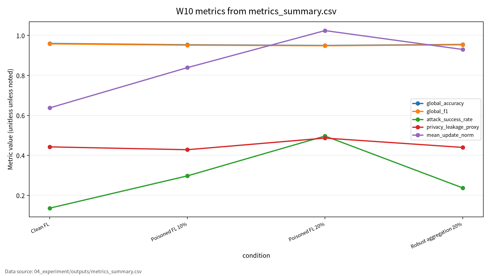
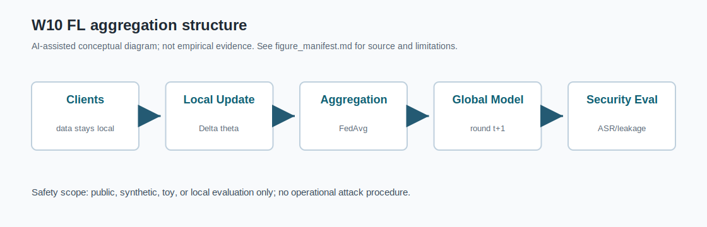

# W10 연합학습(FL) & FL 위협·방어·정책

---

## 1. 핵심 메시지

FL은 데이터를 중앙으로 모으지 않지만, update와 aggregation은 여전히 보안 평가 대상이다.

---

## 2. FL 원리

- Client: local data로 update 계산
- Server: update 수집과 global model 갱신
- Aggregation: FedAvg, coordinate median 등
- 핵심 trade-off: utility, privacy, robustness, communication cost

---

## 3. 위협모형

| 자산 | 위협 |
|---|---|
| local update | gradient leakage, membership inference |
| global model | poisoning, backdoor |
| aggregation result | malicious/byzantine client 영향 |
| training log | 재현성·책임성 근거 |

---

## 4. 논문 패킷 역할

P01은 aggregation taxonomy, P02/P03은 security/privacy taxonomy, P04는 privacy와 policy, P05는 backdoor와 ASR 평가를 담당한다.

---

## 5. Toy 실험 설계

- Synthetic binary classification
- 10 clients, client별 80 samples
- 25 FL rounds, seed 42
- 조건: Clean, poisoned 10%, poisoned 20%, robust aggregation 20%

---

## 6. 실험 결과

| 조건 | Acc. | F1 | ASR | Privacy |
|---|---:|---:|---:|---:|
| Clean FL | 0.960000 | 0.958042 | 0.136076 | 0.442597 |
| Poisoned 10% | 0.953333 | 0.951557 | 0.297468 | 0.428377 |
| Poisoned 20% | 0.950000 | 0.948630 | 0.496835 | 0.486591 |
| Robust 20% | 0.955000 | 0.953368 | 0.237342 | 0.439875 |

---

## 7. 해석

20% poisoned FedAvg는 clean accuracy를 크게 떨어뜨리지 않지만 ASR을 크게 올렸다.

Coordinate median은 ASR을 낮췄지만 완전히 제거하지는 못했다.

---

## 8. 기말논문 연결

W10는 utility, ASR, privacy leakage proxy, reproducibility를 함께 기록하는 AI 보안 평가표의 근거가 된다.

---

## 9. 결론

FL 보안 평가는 "데이터를 보내지 않는다"는 구조 설명을 넘어 update, aggregation, attack success, 로그 재현성을 함께 검토해야 한다.

<!-- formula-visual-supplement:start -->
# 수식·그래프·그림 보강

- 보강 일자: 2026-06-23
- 수식은 표준 정의식 또는 검증 가능한 평가식으로만 작성했다.
- 그래프는 `04_experiment/outputs/metrics_summary.csv`의 기존 수치만 사용했다.
- 다이어그램은 AI-assisted conceptual diagram이며 사실 자료나 실험 결과처럼 해석하지 않는다.

### 핵심 수식: FedAvg Aggregation과 Client Update

$$
\theta_{t+1}^{(k)}=\theta_t-\eta\nabla \mathcal{L}_k(\theta_t),
\qquad
\theta_{t+1}=\sum_{k=1}^{K}\frac{n_k}{n}\theta_{t+1}^{(k)}
$$

| 기호 | 의미 |
|---|---|
| `\theta_t` | round t의 글로벌 모델 |
| `\mathcal{L}_k` | client k의 local objective |
| `n_k/n` | client 데이터 비중 |
| `K` | client 수 |

**직관적 의미:**  
각 client는 local update를 만들고 server는 데이터 비중으로 평균한다.

**보안 관점 해석:**  
악성 client update가 aggregation에 들어오면 global model과 backdoor 성능이 바뀔 수 있다.

**평가 지표 연결:**  
global_accuracy, global_f1, attack_success_rate, malicious_client_rate와 연결한다.

**한계와 가정:**  
toy FL setting이며 실제 client 침해 절차가 아니다.

### 핵심 수식: Update Norm Leakage/Poisoning Proxy

$$
\rho_k=\lVert \Delta\theta_k\rVert_2,
\qquad
ASR=\frac{1}{m}\sum_{j=1}^{m}\mathbf{1}[f_{\theta}(T(x_j))=y^{target}]
$$

| 기호 | 의미 |
|---|---|
| `\rho_k` | client update norm proxy |
| `\Delta\theta_k` | client k의 모델 변화량 |
| `T(x)` | toy trigger 변환 |
| `ASR` | 조건부 실패율 |

**직관적 의미:**  
Update norm은 client update 이상 징후를 보는 단순 proxy다. ASR은 poisoning/backdoor 조건 실패를 별도로 본다.

**보안 관점 해석:**  
업데이트 통계와 global 성능을 함께 보아야 은닉형 공격을 놓치지 않는다.

**평가 지표 연결:**  
mean_update_norm, privacy_leakage_proxy, attack_success_rate와 연결한다.

**한계와 가정:**  
formal privacy leakage guarantee가 아니라 toy proxy다.

### 표 수치 기반 그래프

그래프는 global_accuracy, global_f1, ASR, privacy_leakage_proxy, mean_update_norm을 조건별로 보여준다. FL에서는 중앙 성능만이 아니라 malicious client rate, update norm, leakage proxy를 함께 기록해야 한다. CSV에 없는 client-level raw data는 만들지 않았다.

### Threat Model / Pipeline Diagram

이 다이어그램은 `FL aggregation structure`를 발표용으로 요약한 개념도다. 데이터 흐름, 평가 지표, 한계 표시는 `assets/figure_manifest.md`에도 기록했다.

### 확인 필요

- privacy_leakage_proxy는 실제 gradient inversion 성공률이 아니며 proxy로만 해석한다.
- 논문별 원문 절·쪽·그림 번호는 최종 제출 전 사람 검토가 필요하다.
<!-- formula-visual-supplement:end -->
