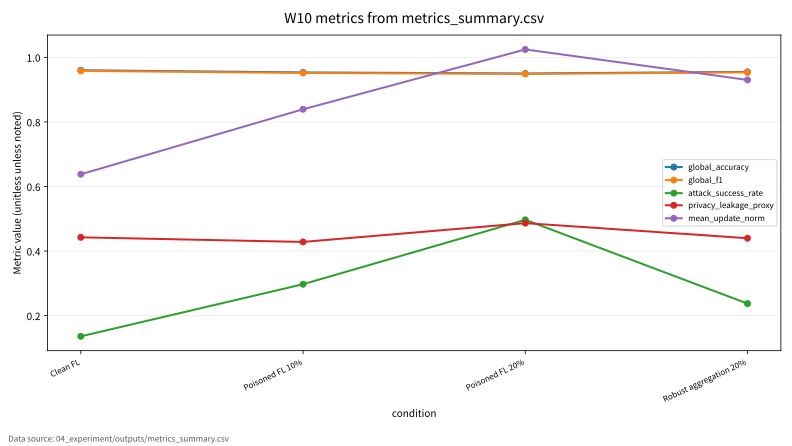

# W10 Federated Learning 보안

Research Question: Federated Learning 보안에서 성능 지표와 보안 지표를 어떻게 분리해 평가할 수 있는가?

---

## Core Formula

### FedAvg Aggregation과 Client Update

$$
\theta_{t+1}^{(k)}=\theta_t-\eta\nabla \mathcal{L}_k(\theta_t),
\qquad
\theta_{t+1}=\sum_{k=1}^{K}\frac{n_k}{n}\theta_{t+1}^{(k)}
$$

| 기호 | 의미 |
|---|---|
| `\theta_t` | round t의 글로벌 모델 |
| `\mathcal{L}_k` | client k의 local objective |
| `n_k/n` | client 데이터 비중 |
| `K` | client 수 |

- 직관적 의미: 각 client는 local update를 만들고 server는 데이터 비중으로 평균한다.
- 보안적 의미: 악성 client update가 aggregation에 들어오면 global model과 backdoor 성능이 바뀔 수 있다.
- 평가 지표 연결: global_accuracy, global_f1, attack_success_rate, malicious_client_rate와 연결한다.
- 한계: toy FL setting이며 실제 client 침해 절차가 아니다.

---

## Threat Model

- Diagram: FL aggregation structure
- Stages: Clients, Local Update, Aggregation, Global Model, Security Eval
- 안전 범위: public, synthetic, toy, local evaluation

---

## Evaluation Protocol

- Metrics: global_accuracy, global_f1, attack_success_rate, privacy_leakage_proxy, mean_update_norm
- 데이터 출처: `04_experiment/outputs/metrics_summary.csv`

| condition | global_accuracy | global_f1 | attack_success_rate | privacy_leakage_proxy | mean_update_norm |
| --- | --- | --- | --- | --- | --- |
| Clean FL | 0.96 | 0.958 | 0.136 | 0.443 | 0.638 |
| Poisoned FL 10% | 0.953 | 0.952 | 0.297 | 0.428 | 0.839 |
| Poisoned FL 20% | 0.95 | 0.949 | 0.497 | 0.487 | 1.024 |
| Robust aggregation 20% | 0.955 | 0.953 | 0.237 | 0.44 | 0.93 |

---

## Figure-first Result

그래프는 global_accuracy, global_f1, ASR, privacy_leakage_proxy, mean_update_norm을 조건별로 보여준다. FL에서는 중앙 성능만이 아니라 malicious client rate, update norm, leakage proxy를 함께 기록해야 한다. CSV에 없는 client-level raw data는 만들지 않았다.

---

## Paper Map

| ID | 논문 역할 | 발표에서 쓰는 위치 | 기말논문 연결 |
|---|---|---|---|
| P01 | 핵심 이론 | Background / Core Formula | Federated Learning 보안의 관련연구 뼈대 |
| P02 | 위협 분류 | Threat Model | 공격자·방어자·보호자산 정의 |
| P03 | 평가 지표 | Evaluation Protocol | 정량 지표와 로그 근거 연결 |
| P04 | 공격·방어 사례 | Security Implication | 보안적 함의와 방어 한계 |
| P05 | 재현성·정책 근거 | Limitation | 확인 필요 항목과 제출 전 검증 |

---

## Limitation

- privacy_leakage_proxy는 실제 gradient inversion 성공률이 아니며 proxy로만 해석한다.
- 원문 DOI/URL과 formal guarantee는 최종 제출 전 확인 필요.
- 실제 운영 시스템 악용 절차나 무단 API 질의 절차는 포함하지 않음.

---

## Final Takeaway

W10의 핵심은 `global_accuracy, global_f1, attack_success_rate, privacy_leakage_proxy, mean_update_norm`를 성능·보안·재현성 근거로 분리해 기말논문의 평가방법에 연결하는 것이다.
