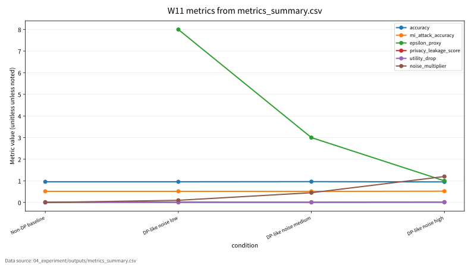

# W11 차등프라이버시(DP) & 멤버십 추론 공격·방어 통합보고서

## 0. 메타정보

| 항목 | 내용 |
|---|---|
| 주차 | W11 |
| 주제 | 차등프라이버시(DP) & 멤버십 추론 공격·방어 |
| 문서 상태 | 제출용 최종 초안, 사람 검토 필요 |
| 실험 상태 | 2026-06-22 실행 완료, 2026-06-23 로컬/Docker 재검증 |
| 안전 범위 | synthetic binary classification 기반 toy 실험, 실제 개인정보 없음 |
| 핵심 주의 | `epsilon_proxy`는 formal DP accountant 값이 아님 |

## 1. 한 문장 요약

W11은 DP를 적용했다는 선언보다 epsilon/accounting, utility, membership inference risk, leakage score, 재현성 증거를 함께 제시해야 privacy claim을 검증할 수 있음을 정리한다[1][2][4][5].

## 2. 학습 배경과 주차 목표

### 2.1 이번 주 주제의 위치

W11은 W10의 연합학습 privacy leakage 논의를 차등프라이버시와 membership inference 평가로 확장하는 주차다. W10에서는 FL의 local update와 aggregation이 privacy와 integrity 위험을 남긴다는 점을 다루었다. W11은 모델 학습 과정과 모델 출력에서 개별 레코드의 포함 여부가 노출될 수 있는지, 그리고 DP 또는 DP-like 방어를 주장할 때 어떤 증거가 필요한지를 다룬다. 핵심은 DP를 “적용했다”는 선언이 아니라 epsilon/delta 또는 accountant, utility, MI attack risk, leakage score, reproducibility evidence를 함께 검증해야 한다는 점이다.

### 2.2 강의계획서상 학습목표

- Differential Privacy의 epsilon/delta 의미와 privacy budget을 정리한다.
- DP-SGD의 gradient clipping, noise injection, privacy accounting 구조를 이해한다.
- Membership inference attack과 defense taxonomy를 정리한다.
- Utility, MI attack accuracy, privacy leakage score, epsilon/accounting, reproducibility evidence를 통합한 평가 프로토콜을 설계한다.

### 2.3 이번 주 핵심 질문

1. DP 보장을 주장할 때 epsilon만 제시하면 충분한가?
2. DP-like noise와 formal DP-SGD의 차이는 무엇인가?
3. Membership inference risk는 confidence score, overfitting, train/test gap과 어떻게 연결되는가?
4. Utility drop과 privacy leakage score는 어떤 trade-off를 만드는가?
5. W11의 synthetic toy 실험을 KCI 또는 SCI 논문 주제로 발전시키려면 어떤 연구문제가 적절한가?

## 3. AI 원리 70% 정리

DP는 인접 데이터셋의 출력 분포 차이를 제한하여 개별 레코드의 영향력을 줄이는 privacy 보장 개념이다[1]. 중앙집중형 deep learning에서 DP-SGD는 clipping, noise injection, accounting을 함께 요구한다[2]. Deep learning에서 DP 적용 위치는 sample-level, client-level, update-level에 따라 달라질 수 있다[3].

| 표 1. W11 핵심 개념과 보안 연결 | AI 원리 | 보안 연결 |
|---|---|---|
| Differential Privacy | 인접 데이터셋 간 출력 분포 차이 제한 | 개별 레코드 노출 가능성 축소 |
| Privacy Budget | epsilon/delta 또는 accountant 기반 보호 강도 | 큰 epsilon, composition 누락은 claim 약화 |
| DP-SGD | gradient clipping과 noise injection | 학습 단계 leakage 완화, utility drop 발생 가능 |
| Membership Inference | 학습 포함 여부를 추론하는 privacy attack | 모델 출력 confidence/loss가 공격 신호가 될 수 있음 |
| Privacy Accounting | 반복 학습과 composition의 privacy loss 계산 | `epsilon_proxy`와 formal epsilon 구분 필요 |

## 4. 보안 이슈 30% 정리

Membership inference attack은 모델 출력이나 confidence score로 학습 데이터 포함 여부를 추론한다[4]. Membership inference 방어는 privacy risk를 낮출 수 있지만 utility drop과 calibration 변화를 함께 고려해야 한다[5].

보호 자산은 원본 데이터뿐 아니라 학습 포함 여부, confidence score, loss signal, model output, evaluation log이다. 제외 범위는 실제 개인정보 데이터 사용, 실제 개인 대상 membership inference, 운영 모델/API 무단 질의, 실제 서비스 privacy probing이다. 본 보고서는 공격 절차를 악용 가능한 단계별 지침으로 상세화하지 않는다.

## 5. 논문 5편 요약

| 표 2. 관련 문헌 5편 요약 | 핵심 역할 | 검증 상태 |
|---|---|---|
| P01 Blanco-Justicia et al.[1] | DP misuse, epsilon 해석, reporting 책임 | DOI `10.1145/3547139` 확인, 로컬 PDF는 arXiv 판 |
| P02 Demelius et al.[2] | centralized DP-DL, auditing, privacy-utility trade-off | DOI `10.1145/3712000` 확인, 강의자료 저자/권호 표기 대조 필요 |
| P03 Pan et al.[3] | deep learning에서 DP 적용 위치와 보호 대상 | DOI `10.1016/j.neucom.2024.127663` 확인, 로컬 PDF는 Fu et al. 대체 PDF |
| P04 Hu et al.[4] | MI attack taxonomy, confidence/loss/output signal | DOI `10.1145/3523273` 확인 |
| P05 Hu/Li Hu et al.[5] | MI defense taxonomy, utility-privacy trade-off | DOI `10.1145/3620667` 확인, 로컬 PDF는 Bai et al. 대체 PDF, 강의자료 저자 표기 대조 필요 |

P03과 P05는 지정 논문과 현재 로컬 PDF가 일치하지 않는다. P03 로컬 PDF는 Fu et al.의 DP-FL systematic review이고, P05 로컬 PDF는 Bai et al.의 FL-MIA survey이다. 두 대체 PDF는 W10-FL과의 연결을 설명하는 보조 문헌으로만 사용하고, 지정 논문처럼 확정 인용하지 않는다.

## 6. 논문 5편 비교표

| 논문 | 연구문제 | 핵심 방법 | 데이터/실험 | AI 원리 기여 | 보안 위협 연결 | 평가 지표 | 한계 | 내 논문 활용 |
|---|---|---|---|---|---|---|---|---|
| P01 | DP가 ML에서 오용될 때 어떤 privacy claim 문제가 생기는가 | 비판적 문헌검토 | ML privacy claim 사례 | epsilon/delta 해석, reporting 책임 | 큰 epsilon, accountant 누락 | budget, utility, reporting completeness | 로컬 PDF는 arXiv 판 | DP reporting checklist |
| P02 | 중앙집중형 DP-DL의 최신 연구축은 무엇인가 | systematic survey | DP-DL 문헌 분류 | DP-SGD, clipping, noise, accountant | privacy leakage, auditing failure | accuracy, auditing, utility trade-off | 강의 표기 대조 필요 | 평가 프로토콜 상위 분류 |
| P03 | DP 적용 위치와 보호 대상은 어떻게 달라지는가 | 지정 논문과 대체 PDF 분리 | Neurocomputing 지정 논문, DP-FL 대체 PDF | sample/client/update level 비교 | FL update leakage | epsilon/accounting, utility | 원문 PDF 미확보 | W10-FL 연결, 대체 PDF 인용 주의 |
| P04 | MI 공격은 어떤 조건에서 privacy breach가 되는가 | taxonomy survey | confidence/loss/output 공격 문헌 | MI signal 분류 | membership inference, overfitting | MI accuracy, TPR/FPR, confidence gap | 최신 LLM/FL 특화 공격 추가 필요 | threat model 핵심 근거 |
| P05 | MI 방어는 어떤 trade-off를 만드는가 | defense taxonomy | ACM 지정 논문, FL-MIA 대체 PDF | output restriction, regularization, DP | output leakage, FL update leakage | clean accuracy, MI risk, utility drop | 원문 PDF 미확보, 저자 표기 대조 필요 | 방어 평가표 |

## 7. Research Track 분석

| 표 3. W11 Research Track 요약 | 내용 |
|---|---|
| 연구문제 | privacy claim 검증을 위해 accuracy, MI risk, leakage, accounting, reproducibility를 어떻게 함께 보고할 것인가 |
| 위협모형 | black-box output observer, gray-box evaluator, API user, internal auditor |
| 평가방법 | synthetic split에서 utility와 MI proxy를 분리 기록 |
| 재현성 | seed, config, CSV, JSON, run log, DOI 검증표 보존 |
| 오픈문제 | formal DP-SGD accountant, 실제 benchmark, 반복 실험, P03/P05 원문 확보 |

그림 1. DP와 Membership Inference 평가 흐름

```text
Synthetic Train/Test Data
        ↓
Toy Logistic Regression
        ↓
Non-DP / DP-like Noise Conditions
        ↓
Model Output Confidence
        ↓
Membership Inference Proxy
        ↓
Metrics
Accuracy, Train Accuracy, MI Attack Accuracy, Leakage Score, Utility Drop
        ↓
Privacy Claim Check
epsilon/accounting, noise setting, limitations, reproducibility evidence
```

## 8. 실습 보고서

본 실습은 실제 개인정보나 실제 운영 모델을 대상으로 한 membership inference 공격 재현이 아니라 W11의 핵심인 privacy claim 평가축을 안전하게 설명하기 위한 최소 toy protocol이다. 따라서 synthetic binary classification 기반 안전 toy 실험과 toy logistic regression을 사용하되, 평가 구조는 이후 formal DP-SGD, privacy accountant, membership inference benchmark에도 확장 가능하도록 accuracy, train accuracy, MI attack accuracy, privacy leakage score, utility drop, epsilon/accounting, reproducibility evidence로 분리하였다.

| 표 4. W11 실습 설계 | 내용 |
|---|---|
| Dataset | Synthetic binary classification |
| Train/Test samples | 320 / 320 |
| Features | 3 |
| Model | Toy logistic regression |
| Conditions | Non-DP baseline, DP-like noise low/medium/high |
| Noise multipliers | 0.00, 0.10, 0.45, 1.20 |
| MI evaluation | Confidence-threshold proxy |
| Output files | `metrics_summary.csv`, `results.json`, `run_log.md` |

| 표 5. W11 실습 결과 | Accuracy | Train Accuracy | MI Attack Accuracy | Epsilon Proxy | Utility Drop | Privacy Leakage Score | Noise Multiplier |
|---|---:|---:|---:|---:|---:|---:|---:|
| Non-DP baseline | 0.956250 | 0.965625 | 0.515625 | 해당 없음 | 0.000000 | 0.014833 | 0.000000 |
| DP-like noise low | 0.956250 | 0.965625 | 0.515625 | 8.000000 | 0.000000 | 0.014494 | 0.100000 |
| DP-like noise medium | 0.962500 | 0.965625 | 0.512500 | 3.000000 | 0.000000 | 0.011769 | 0.450000 |
| DP-like noise high | 0.950000 | 0.962500 | 0.521875 | 1.000000 | 0.006250 | 0.016482 | 1.200000 |

이 결과는 synthetic binary classification 기반 toy 실험의 평가 형식 검증용 수치이며, 실제 개인정보 보호 수준, 실제 운영 모델의 membership inference 위험, 실제 DP-SGD 보장, formal privacy accounting 결과로 일반화하지 않는다.

## 9. AI 도구 활용 기록

AI는 문헌 요약 보강, DOI/URL 검증 보조, 대체 PDF 표시, synthetic DP/MI 실험 코드 작성, 발표자료 작성, KCI/SCI 섹션 보완에 사용되었다. 최종 제출자는 원고의 내용, 인용, 실험결과, 연구윤리 책임을 확인해야 한다. 상세 고지는 `05_ai_worklog/ai_disclosure_draft.md`에 둔다.

## 10. 토론 질문

1. formal accountant 없이 `epsilon_proxy`를 쓰는 경우 어떤 표현까지 허용되는가?
2. MI Attack Accuracy가 0.5 근처라도 leakage score를 별도로 봐야 하는 이유는 무엇인가?
3. DP-SGD, output restriction, calibration, regularization 중 어떤 방어가 어떤 위협모형에 적합한가?
4. P03/P05처럼 지정 논문과 로컬 PDF가 다를 때 수업 제출물에서 어떻게 표시해야 하는가?

## 11. 기말논문 연결

기말논문 주제 후보는 “AI 보안 연구에서 Privacy Claim 검증을 위한 다중지표 평가 프레임워크”이다. W11의 contribution은 단일 epsilon 또는 단일 accuracy가 아니라 utility, MI risk, leakage score, privacy accounting, noise setting, reproducibility evidence를 함께 보고하는 구조다.

## 12. KCI 논문 형식 전환

### 12.1 KCI형 제목 후보

| 표 6. KCI 논문 제목 후보 | 국문 제목 후보 | 영문 제목 후보 | 대상 시스템 | 보안 위협 | 연구방법 | 예상 기여 |
|---:|---|---|---|---|---|---|
| 1 | AI 보안 연구에서 Privacy Claim 검증을 위한 다중지표 평가 프레임워크 연구 | A Multi-Metric Evaluation Framework for Verifying Privacy Claims in AI Security Research | ML/DL 학습 시스템 | Membership inference, DP misuse | 문헌분석 + synthetic MI 실험 | DP reporting checklist |
| 2 | 차등프라이버시 기반 학습에서 Utility와 Membership Inference 위험의 Trade-off 분석 | An Analysis of the Trade-off Between Utility and Membership Inference Risk in Differential Privacy-Based Learning | DP-like ML 모델 | privacy leakage, utility degradation | toy logistic regression | utility-risk 동시 평가 |
| 3 | Membership Inference 방어 평가를 위한 Accuracy·Leakage·Accounting 통합 보고체계 연구 | An Integrated Reporting Framework of Accuracy, Leakage, and Accounting for Membership Inference Defense Evaluation | privacy-preserving ML | MI attack, incomplete accounting | 문헌분석 + 체크리스트 | 재현성 중심 privacy claim 검증 |

### 12.2 추천 최종 제목

- 국문: AI 보안 연구에서 Privacy Claim 검증을 위한 다중지표 평가 프레임워크 연구
- 영문: A Multi-Metric Evaluation Framework for Verifying Privacy Claims in AI Security Research

### 12.3 국문초록 초안

본 연구는 AI 보안 연구에서 차등프라이버시 및 membership inference 방어를 주장할 때 필요한 privacy claim 검증 프레임워크를 제안한다. DP misuse, centralized DP-DL, differential privacy in deep learning, membership inference attack, membership inference defense 관련 선행연구를 비교하고, accuracy, train accuracy, MI attack accuracy, privacy leakage score, utility drop, epsilon/accounting, reproducibility evidence의 평가축을 도출한다. 또한 실제 개인정보나 운영 모델을 사용하지 않고 synthetic binary classification과 toy logistic regression을 활용하여 non-DP baseline, DP-like noise low/medium/high 조건을 비교한다. 본 연구는 `epsilon_proxy`가 정식 DP accountant 값이 아니며 실제 DP 보장으로 해석할 수 없음을 명확히 하면서, privacy claim을 검증하기 위한 최소 보고항목과 재현성 구조를 제시하는 데 목적이 있다.

### 12.4 영문초록 초안

This study proposes a multi-metric framework for verifying privacy claims in AI security research involving differential privacy and membership inference defenses. By reviewing studies on DP misuse, centralized DP in deep learning, differential privacy in deep learning, membership inference attacks, and membership inference defenses, this report derives evaluation axes including accuracy, train accuracy, membership inference attack accuracy, privacy leakage score, utility drop, epsilon/accounting, and reproducibility evidence. A safe toy experiment using synthetic binary classification and toy logistic regression is used to compare non-DP baseline and DP-like noise conditions. The goal is not to claim formal DP guarantees, but to demonstrate a reproducible reporting structure for privacy-claim evaluation.

### 12.5 키워드

| 구분 | 키워드 |
|---|---|
| 국문 | 차등프라이버시, DP-SGD, 멤버십 추론, Privacy Claim, Utility-Privacy Trade-off, 재현성 |
| 영문 | Differential Privacy, DP-SGD, Membership Inference, Privacy Claim, Utility-Privacy Trade-off, Reproducibility |

### 12.6 연구문제

- RQ1. DP 또는 DP-like 방어를 주장할 때 accuracy, MI attack accuracy, leakage score, accounting 중 어떤 항목을 최소 보고해야 하는가?
- RQ2. DP-like noise 강도 변화는 utility drop과 privacy leakage score에 어떤 영향을 주는가?
- RQ3. Formal privacy accountant 없이 `epsilon_proxy`를 사용할 때 어떤 연구윤리적 한계가 발생하는가?

### 12.7 연구방법

문헌분석으로 W11 논문 5편을 DP misuse, DP-DL, DP deep learning, MI attack, MI defense 축으로 비교한다. 위협모형은 학습 데이터 포함 여부, confidence score, model output, evaluation log를 보호 자산으로 설정한다. 모의실험은 synthetic binary classification 기반 toy logistic regression을 사용하며, non-DP baseline과 DP-like noise 조건을 accuracy, train accuracy, MI attack accuracy, epsilon proxy, utility drop, privacy leakage score, noise multiplier, reproducibility evidence로 비교한다.

### 12.8 보안적 함의

Confidentiality 관점에서 membership inference는 학습 데이터 포함 여부를 노출할 수 있다. Privacy 관점에서 confidence gap과 overfitting은 privacy leakage 신호가 될 수 있다. Integrity 관점에서 잘못된 DP claim은 연구 결과와 보안 주장을 왜곡한다. Availability 관점에서 과도한 noise는 utility degradation을 유발할 수 있다. Accountability와 reproducibility를 위해 DOI, config, seed, outputs, AI 활용 고지를 보존해야 한다.

### 12.9 KCI 제출 가능성 점검표

| 점검 항목 | 상태 |
|---|---|
| 국문·영문 제목 후보 작성 | 완료 |
| 국문초록 초안 작성 | 완료 |
| 영문초록 초안 작성 | 완료 |
| 키워드 작성 | 완료 |
| 연구문제 작성 | 완료 |
| 연구방법 작성 | 완료 |
| 표 1개 이상 포함 | 완료 |
| 그림 1개 이상 포함 | 완료 |
| 국내 참고문헌 3편 이상 | 확인 필요 |
| 해외 참고문헌 5편 이상 | W11 기준 완료, P03/P05 원문 확보 필요 |
| AI 활용 고지 | 보완 완료, 사람 검토 필요 |
| 실험 outputs 파일 존재 | 완료 |
| epsilon_proxy 한계 명시 | 완료 |

## 13. SCI 논문 형식 전환

### 13.1 SCI 제목 후보

A Multi-Metric Framework for Verifying Privacy Claims Against Membership Inference Risk in Differentially Private Machine Learning

### 13.2 Structured Abstract

#### Background

Differential privacy is widely used to limit individual record exposure in machine learning, but privacy claims can be misleading when epsilon values, accounting assumptions, utility loss, and attack evaluations are not reported together.

#### Problem

Many studies state that DP or DP-like mechanisms are applied, but do not consistently report formal privacy accounting, membership inference risk, confidence leakage, utility degradation, and reproducibility evidence.

#### Method

This study synthesizes five representative studies on DP misuse, centralized DP in deep learning, DP in deep learning, membership inference attacks, and membership inference defenses. A safe synthetic toy experiment is used to compare non-DP baseline and DP-like noise conditions with a toy logistic regression model.

#### Results

The W11 toy experiment shows that medium DP-like noise reduces the privacy leakage proxy in the synthetic setting, while high noise causes utility drop and does not monotonically reduce MI attack accuracy. These results should not be interpreted as formal DP guarantees.

#### Contribution

The main contribution is a multi-metric reporting framework that separates accuracy, train accuracy, membership inference attack accuracy, privacy leakage score, utility drop, epsilon/accounting, noise multiplier, and reproducibility evidence.

#### Implications

The framework can be extended to formal DP-SGD experiments, privacy accounting, membership inference benchmark evaluation, federated privacy analysis, and reproducible privacy-claim auditing.

### 13.3 Introduction 구성

- DP와 privacy-preserving ML의 필요성
- DP misuse와 incomplete privacy claim 문제
- Membership inference attack의 threat model
- Utility-privacy trade-off
- Formal accounting과 reproducibility evidence의 중요성
- 본 연구의 contribution

### 13.4 Related Work 축

| 표 7. SCI Related Work 축 | 대표 논문 | 역할 |
|---|---|---|
| DP misuse and reporting | Blanco-Justicia et al.[1] | DP claim misuse, epsilon interpretation, reporting responsibility |
| Centralized DP-DL | Demelius et al.[2] | DP-SGD, privacy auditing, utility-privacy improvement |
| DP in deep learning | Pan et al.[3] | DP deep learning literature, 지정 논문 원문 확보 필요 |
| Membership inference attacks | Hu et al.[4] | MI attack taxonomy, confidence/loss/output attack signal |
| Membership inference defenses | Hu/Li Hu et al.[5] | MI defense taxonomy, utility-privacy trade-off, 지정 논문 원문 확보 필요 |

### 13.5 Threat Model

Target system은 민감 레코드를 포함할 수 있는 ML/DL 모델이다. Protected assets는 training data membership, confidence scores, model outputs, evaluation logs이다. Adversary knowledge는 black-box output observer, gray-box evaluator, API user, internal auditor로 구분한다. Attack success condition은 member/non-member status가 random baseline 이상으로 구분되는 것이다. Excluded scope는 real personal data, real-person membership inference, production API probing, unauthorized model testing이다.

### 13.6 Methodology

방법론은 literature matrix construction, DP/MI threat model design, synthetic binary classification experiment, toy logistic regression training, non-DP baseline evaluation, DP-like noise low/medium/high evaluation, confidence-threshold MI proxy evaluation, privacy leakage score calculation, reproducibility evidence collection으로 구성한다.

### 13.7 Experimental Setup

| Item | Description |
|---|---|
| Dataset | Synthetic binary classification |
| Train samples | 320 |
| Test samples | 320 |
| Features | 3 |
| Model | Toy logistic regression |
| Conditions | Non-DP baseline, DP-like noise low, medium, high |
| Noise multipliers | 0.00, 0.10, 0.45, 1.20 |
| Epsilon values | Proxy only, not formal accounting |
| MI evaluation | Confidence-threshold proxy |
| Metrics | Accuracy, train accuracy, MI attack accuracy, epsilon proxy, utility drop, privacy leakage score |
| Seed | 42 |
| Output files | metrics_summary.csv, results.json, run_log.md |

### 13.8 Results

outputs 기준 결과는 표 5와 같다. Medium DP-like noise 조건은 leakage proxy 0.011769로 가장 낮았고, high noise 조건은 utility drop 0.006250이 발생했으며 MI attack accuracy는 0.521875로 단조롭게 감소하지 않았다.

### 13.9 Discussion

DP-like noise는 formal differential privacy guarantee가 아니다. `epsilon_proxy`는 정식 privacy accountant 산출값이 아니다. MI attack accuracy가 낮아도 confidence leakage score를 함께 봐야 한다. Noise를 키운다고 항상 MI risk proxy가 단조롭게 감소하지 않을 수 있다. Utility drop과 privacy leakage score를 함께 기록해야 한다. Synthetic toy 결과는 실제 개인정보 보호 수준을 의미하지 않는다.

### 13.10 Limitations and Threats to Validity

Internal validity: toy logistic regression은 실제 deep learning model 또는 DP-SGD dynamics를 대표하지 않는다. External validity: synthetic data는 실제 민감 데이터, class imbalance, long-tail records, overfitting risk를 대표하지 않는다. Construct validity: MI attack accuracy는 confidence-threshold proxy이며 실제 공격 성능이 아니다. Privacy validity: epsilon proxy는 formal DP accountant가 아니며 privacy guarantee로 해석할 수 없다. Literature validity: P03/P05는 로컬 PDF가 지정 논문과 불일치하므로 원문 확보가 필요하다. Reproducibility: outputs 파일과 보고서 수치의 일치가 필요하다.

### 13.11 Conclusion

W11은 AI 보안 연구에서 privacy claim을 검증하기 위해 단일 epsilon 또는 단일 accuracy가 아니라 utility, MI risk, leakage score, privacy accounting, noise setting, reproducibility evidence를 함께 기록해야 함을 보인다. 이 구조는 formal DP-SGD, FL privacy, RAG privacy governance, MLOps audit logging으로 확장될 수 있다.

## 14. 발표용 요약

- 핵심 메시지: DP claim은 epsilon 하나로 충분하지 않고, utility와 MI risk를 함께 보고해야 한다.
- 실험 메시지: medium noise는 toy leakage proxy가 가장 낮았지만, high noise는 utility drop이 생기고 MI proxy가 단조 개선되지 않았다.
- 주의 메시지: `epsilon_proxy`는 실제 epsilon이나 formal DP guarantee가 아니다.
- 문헌 메시지: P03/P05는 대체 PDF 상태이므로 원문 확보 전까지 부분 검증으로 표시한다.

## 15. 참고문헌 검증표

| 번호 | 참고문헌 | DOI/URL | 상태 |
|---|---|---|---|
| [1] | Alberto Blanco-Justicia, David Sanchez, Josep Domingo-Ferrer, Krishnamurty Muralidhar, A Critical Review on the Use (and Misuse) of Differential Privacy in Machine Learning, ACM Computing Surveys 55(8), pp. 1-16. | `https://doi.org/10.1145/3547139`; arXiv `2206.04621` | DOI 확인 |
| [2] | Lea Demelius, Roman Kern, Andreas Trugler, Recent Advances of Differential Privacy in Centralized Deep Learning: A Systematic Survey, ACM Computing Surveys 57(6), pp. 1-28. | `https://doi.org/10.1145/3712000`; arXiv `2309.16398` | DOI 확인, 강의자료 저자/권호 표기 대조 필요 |
| [3] | Ke Pan et al., Differential privacy in deep learning: A literature survey, Neurocomputing 589, Article 127663. 강의자료의 Pan 저자명 표기는 최종 확인 필요. | `https://doi.org/10.1016/j.neucom.2024.127663` | DOI 확인, 지정 논문 원문 확인 필요, 로컬 PDF 대체 상태 |
| [4] | Hongsheng Hu, Zoran Salcic, Lichao Sun, Gillian Dobbie, Philip S. Yu, Xuyun Zhang, Membership Inference Attacks on Machine Learning: A Survey, ACM Computing Surveys 54(11s), pp. 1-37. | `https://doi.org/10.1145/3523273`; arXiv `2103.07853` | DOI 확인 |
| [5] | Li Hu et al., Defenses to Membership Inference Attacks: A Survey, ACM Computing Surveys 56(4), pp. 1-34. 강의자료의 Hongsheng Hu 표기는 최종 확인 필요. | `https://doi.org/10.1145/3620667` | DOI 확인, 지정 논문 원문 확인 필요, 로컬 PDF 대체 상태 |

## 16. 자기 점검표

| 점검 항목 | 상태 | 비고 |
|---|---|---|
| 1장 한 문장 요약 작성 | 완료 |  |
| 2장 학습 배경과 주차 목표 작성 | 완료 |  |
| AI 원리 70% 정리 | 완료 |  |
| 보안 이슈 30% 정리 | 완료 |  |
| 논문 5편 요약 | 완료 | P03/P05 대체 PDF 상태 반영 |
| Research Track 5요소 작성 | 완료 | 연구문제, 위협모형, 평가방법, 재현성, 오픈문제 |
| P01 공식 ACM DOI 검증 | 완료 | `10.1145/3547139` |
| P02 공식 ACM DOI 검증 | 완료 / 확인 필요 | `10.1145/3712000`, 강의자료 표기 대조 필요 |
| P03 지정 논문 원문 확보 | 확인 필요 | 현재 대체 PDF |
| P04 공식 ACM DOI 검증 | 완료 | `10.1145/3523273` |
| P05 지정 논문 원문 확보 | 확인 필요 | 현재 대체 PDF |
| 실험 outputs 파일 존재 확인 | 완료 | CSV/JSON/run log 존재 |
| 실험 결과와 보고서 수치 일치 | 완료 | outputs 기준 |
| epsilon_proxy 한계 명시 | 완료 | formal accountant 아님 |
| KCI 논문 형식 전환 작성 | 완료 | 초안 |
| SCI 논문 형식 전환 작성 | 완료 | 초안 |
| 본문 인용과 참고문헌 대응 | 완료 / 확인 필요 | P03/P05 원문 확보 필요 |
| 표·그림 번호 정리 | 완료 | 표 1-7, 그림 1 |
| AI 활용 고지 작성 | 완료 | 사람 검토 필요 |
| PDF 저작권 위험 점검 | 완료 / 조치 필요 | PDF 5개 Git 추적 중, 삭제는 미수행 |
| 최종 사람이 검토할 항목 표시 | 완료 | 최종 제출 확정 아님 |

<!-- formula-visual-supplement:start -->
## 수식·그래프·그림 보강

- 보강 일자: 2026-06-23
- 수식은 표준 정의식 또는 검증 가능한 평가식으로만 작성했다.
- 그래프는 `04_experiment/outputs/metrics_summary.csv`의 기존 수치만 사용했다.
- 다이어그램은 AI-assisted conceptual diagram이며 사실 자료나 실험 결과처럼 해석하지 않는다.

### 핵심 수식: Differential Privacy Definition

$$
\Pr[M(D)\in S]\le e^{\varepsilon}\Pr[M(D')\in S]+\delta
$$

| 기호 | 의미 |
|---|---|
| `M` | 무작위 알고리즘 또는 학습 절차 |
| `D,D'` | 한 레코드만 다른 adjacent datasets |
| `S` | 가능한 출력 사건 |
| `\varepsilon,\delta` | DP privacy parameters |

**직관적 의미:**  
DP는 한 개인 레코드의 포함 여부가 출력 분포를 크게 바꾸지 않도록 제한하는 표준 정의다.

**보안 관점 해석:**  
Membership inference 위험을 줄이려는 privacy claim은 이 정의와 accountant 근거가 있어야 한다.

**평가 지표 연결:**  
epsilon, delta, privacy_leakage_score, mi_attack_accuracy와 연결한다.

**한계와 가정:**  
현재 CSV의 `epsilon_proxy`는 formal accountant 결과가 아니므로 보증값으로 쓰지 않는다.

### 핵심 수식: DP-SGD Clipping/Noise와 MI Advantage

$$
\bar{g}_i=\frac{g_i}{\max(1,\lVert g_i\rVert_2/C)},
\qquad
\tilde{g}=\frac{1}{B}\left(\sum_{i=1}^{B}\bar{g}_i+\mathcal{N}(0,\sigma^2C^2I)\right),
\qquad
Adv_{MI}=TPR-FPR
$$

| 기호 | 의미 |
|---|---|
| `g_i,\bar{g}_i` | 개별 gradient와 clipping 후 gradient |
| `C` | clipping norm |
| `\sigma` | noise multiplier |
| `Adv_{MI}` | membership inference advantage |

**직관적 의미:**  
DP-SGD는 gradient 크기를 제한하고 noise를 더해 개별 레코드 영향을 줄인다. MI advantage는 멤버와 비멤버를 구분하는 공격자의 이득을 요약한다.

**보안 관점 해석:**  
프라이버시 방어는 utility drop과 leakage 감소를 함께 보고해야 한다.

**평가 지표 연결:**  
accuracy, utility_drop, privacy_leakage_score, mi_attack_accuracy, noise_multiplier와 연결한다.

**한계와 가정:**  
표준식 설명이며 이 실습은 정식 DP accountant를 실행하지 않은 toy evaluation이다.

### 표 수치 기반 그래프



그래프는 accuracy, MI attack accuracy, epsilon_proxy, leakage score, utility_drop, noise_multiplier를 조건별로 비교한다. `epsilon_proxy`는 formal DP accountant 결과가 아니므로 privacy guarantee로 읽으면 안 된다. 수치는 W11 outputs의 toy 결과 그대로다.

### Threat Model / Pipeline Diagram


이 다이어그램은 `DP-SGD and MI audit flow`를 발표용으로 요약한 개념도다. 데이터 흐름, 평가 지표, 한계 표시는 `../../09_presentation/assets/figure_manifest.md`에도 기록했다.

### 확인 필요

- `epsilon_proxy`는 formal DP accountant 값이 아니며 formal DP guarantee로 쓰지 않는다.
- 논문별 원문 절·쪽·그림 번호는 최종 제출 전 사람 검토가 필요하다.
<!-- formula-visual-supplement:end -->
