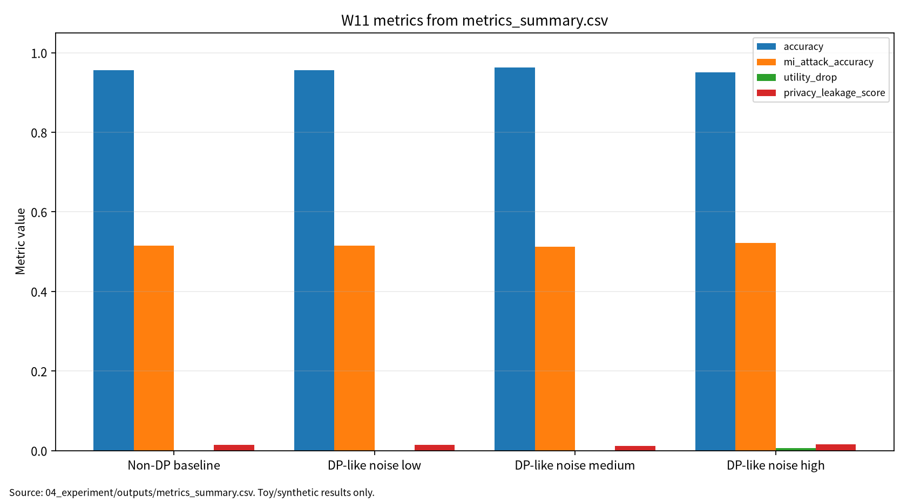

# W11 제출용 보고서

## 초록

본 보고서는 차등프라이버시(DP)와 membership inference 공격·방어를 AI 원리와 보안 평가 관점에서 통합 정리한다. DP는 개별 레코드의 영향을 제한하는 강력한 privacy 개념이지만, 실제 ML/DL 연구에서 epsilon, accounting, utility, attack risk가 함께 보고되지 않으면 privacy claim이 과장될 수 있다. 이에 W11 문헌 5편을 DP misuse, centralized DP-DL, DP deep learning, MI attack, MI defense 축으로 비교하고, 실제 개인정보 없이 synthetic binary classification 기반 안전 toy 실험으로 accuracy, train accuracy, MI attack accuracy, privacy leakage score, utility drop, epsilon/accounting, reproducibility evidence를 분리 기록하였다. 단, `epsilon_proxy`는 formal DP accountant 값이 아니며 실제 DP 보장으로 해석하지 않는다.

## 0. 메타정보

| 항목 | 내용 |
|---|---|
| 주차 | W11 |
| 주제 | 차등프라이버시(DP) & 멤버십 추론 공격·방어 |
| 제출 상태 | 제출용 보고서, 작성자 확인 필요 |
| 실험 상태 | outputs 존재, 로컬/Docker 실행 확인 |
| 안전 범위 | synthetic binary classification 기반 안전 toy 실험 |

| 문서 상태 | 제출용 보고서 |
| 학번 | 26200122 |
| 보완일 | 2026-06-23 |
## 1. 한 문장 요약

DP와 membership inference 방어는 적용 여부만으로 privacy claim이 성립하지 않으며, epsilon/accounting, utility, MI risk, leakage score, 재현성 증거를 함께 보고해야 한다[1][2][4][5].

## 2. 학습 배경과 주차 목표

W11은 W10의 연합학습 privacy leakage 논의를 DP와 membership inference 평가로 확장한다. 이번 주 목표는 epsilon/delta, DP-SGD, privacy accounting, MI attack/defense taxonomy를 정리하고, 안전한 synthetic toy protocol로 utility와 privacy risk proxy를 분리해 보고하는 것이다.

## 3. AI 원리 70% 정리

DP는 인접 데이터셋의 출력 분포 차이를 제한하여 개별 레코드의 영향력을 줄이는 privacy 보장 개념이다[1]. 중앙집중형 deep learning에서 DP-SGD는 gradient clipping, noise injection, privacy accounting을 함께 요구한다[2]. Deep learning에서 DP 적용 위치는 sample-level, client-level, update-level에 따라 달라질 수 있다[3].

| 표 1. W11 핵심 개념과 보안 연결 | 설명 |
|---|---|
| Differential Privacy | 개별 레코드 포함 여부가 출력에 주는 영향을 제한한다. |
| DP-SGD | clipping과 noise를 사용하지만 accountant 없이는 formal 보장을 말할 수 없다. |
| Membership Inference | 모델 출력이나 confidence score로 학습 포함 여부를 추론한다. |
| Privacy Claim | epsilon, utility, leakage, 재현성을 함께 보고해야 검증 가능하다. |

## 4. 보안 이슈 30% 정리

Membership inference attack은 모델 출력이나 confidence score로 학습 데이터 포함 여부를 추론한다[4]. Membership inference 방어는 privacy risk를 낮출 수 있지만 utility drop과 calibration 변화를 함께 고려해야 한다[5]. 본 보고서는 실제 개인정보, 실제 개인 대상 membership inference, 운영 모델/API 무단 질의, 실제 서비스 privacy probing을 포함하지 않는다.

## 5. 논문 5편 요약

| 표 2. 관련 문헌 5편 요약 | 핵심 역할 | 검증 상태 |
|---|---|---|
| P01 Blanco-Justicia et al.[1] | DP misuse와 reporting 책임 | DOI `10.1145/3547139` 확인 |
| P02 Demelius et al.[2] | centralized DP-DL와 privacy auditing | DOI `10.1145/3712000` 확인, 강의자료 표기 대조 필요 |
| P03 Pan et al.[3] | DP deep learning survey | DOI `10.1016/j.neucom.2024.127663` 확인, 로컬 PDF 대체 상태 |
| P04 Hu et al.[4] | MI attack taxonomy | DOI `10.1145/3523273` 확인 |
| P05 Hu/Li Hu et al.[5] | MI defense taxonomy | DOI `10.1145/3620667` 확인, 로컬 PDF 대체 상태 및 저자 표기 대조 필요 |

P03은 지정 논문과 로컬 PDF가 불일치한다. 현재 로컬 PDF는 Fu et al.의 DP-FL systematic review이므로, 최종 제출 전 지정 논문 원문 PDF 또는 공식 출판 페이지를 확보해야 한다. P05도 지정 논문과 로컬 PDF가 불일치하며, 현재 로컬 PDF는 Bai et al.의 FL-MIA survey이다.

## 6. 논문 5편 비교표

| 논문 | 차별성 | 내 논문 활용 |
|---|---|---|
| P01 | DP claim 오용과 reporting 책임을 비판적으로 제시 | DP reporting checklist |
| P02 | centralized DP-DL의 auditing, DP-SGD, utility-privacy trade-off 분류 | 평가 프로토콜 상위 분류 |
| P03 | deep learning DP와 FL 대체 문헌을 분리해야 함 | W10-FL 연결, 대체 문헌 원문 인용 주의 |
| P04 | MI attack의 threat model과 signal taxonomy 제공 | W11 위협모형 핵심 근거 |
| P05 | MI 방어와 utility-privacy trade-off 정리 | 방어 평가표, 원문 확보 필요 |

## 7. Research Track 분석

| 표 3. W11 Research Track 요약 | 내용 |
|---|---|
| 연구문제 | privacy claim 검증을 위한 다중지표 보고체계 |
| 위협모형 | black-box output observer, gray-box evaluator, internal auditor |
| 평가방법 | synthetic split 기반 utility와 MI proxy 분리 |
| 재현성 | seed, config, CSV, JSON, run log 보존 |
| 오픈문제 | formal DP-SGD accountant, P03/P05 원문 확보, 반복 실험 |

그림 1. DP와 Membership Inference 평가 흐름

```text
Synthetic Train/Test Data
        ↓
Toy Logistic Regression
        ↓
Non-DP / DP-like Noise Conditions
        ↓
Model Output Confidence
        ↓
Membership Inference Proxy
        ↓
Metrics
Accuracy, Train Accuracy, MI Attack Accuracy, Leakage Score, Utility Drop
        ↓
Privacy Claim Check
epsilon/accounting, noise setting, limitations, reproducibility evidence
```

## 8. 실습 보고서

본 실습은 실제 개인정보나 실제 운영 모델을 대상으로 한 membership inference 공격 재현이 아니라 W11의 핵심인 privacy claim 평가축을 안전하게 설명하기 위한 최소 toy protocol이다. 따라서 synthetic binary classification과 toy logistic regression을 사용하되, 평가 구조는 이후 formal DP-SGD, privacy accountant, membership inference benchmark에도 확장 가능하도록 accuracy, train accuracy, MI attack accuracy, privacy leakage score, utility drop, epsilon/accounting, reproducibility evidence로 분리하였다.

| 표 4. W11 실습 설계 | 내용 |
|---|---|
| Dataset | Synthetic binary classification |
| Model | Toy logistic regression |
| Conditions | Non-DP baseline, DP-like noise low/medium/high |
| Output files | `metrics_summary.csv`, `results.json`, `run_log.md` |

| 표 5. W11 실습 결과 | Accuracy | Train Accuracy | MI Attack Accuracy | Epsilon Proxy | Utility Drop | Privacy Leakage Score |
|---|---:|---:|---:|---:|---:|---:|
| Non-DP baseline | 0.956250 | 0.965625 | 0.515625 | 해당 없음 | 0.000000 | 0.014833 |
| DP-like noise low | 0.956250 | 0.965625 | 0.515625 | 8.000000 | 0.000000 | 0.014494 |
| DP-like noise medium | 0.962500 | 0.965625 | 0.512500 | 3.000000 | 0.000000 | 0.011769 |
| DP-like noise high | 0.950000 | 0.962500 | 0.521875 | 1.000000 | 0.006250 | 0.016482 |

이 결과는 synthetic binary classification 기반 toy 실험의 평가 형식 검증용 수치이며, 실제 개인정보 보호 수준, 실제 운영 모델의 membership inference 위험, 실제 DP-SGD 보장, formal privacy accounting 결과로 일반화하지 않는다. `epsilon_proxy`는 정식 privacy accountant 산출값이 아니고, `noise_multiplier`는 toy gradient noise scale이다.

<!-- submission-metric-chart:start -->
**그림 7. W11 metrics summary chart**



출처: `04_experiment/outputs/metrics_summary.csv`. 이 그래프는 공개 toy/synthetic 산출물 기반이며 실제 공격 성능이나 운영 환경 성능으로 일반화하지 않는다.
<!-- submission-metric-chart:end -->

## 9. AI 도구 활용 기록

AI 도구는 문헌 요약, 코드 점검, 문장 구조화, 그래프 생성 보조에 사용하였다. 모든 DOI/URL, 실험 수치, 본문 인용, 결론은 작성자가 outputs 파일과 로컬 참고문헌 검증표를 대조하여 검증한다.

**표. W11 AI 도구 활용 및 검증 기록**

| 항목 | 내용 |
|---|---|
| 사용 도구명 | Codex, ChatGPT 계열 도구 |
| 사용 일자 | 2026-06-23 |
| 사용 목적 | 문헌 요약 정리, 보고서 구조화, 안전한 toy/synthetic 실험 결과 표기 점검, 그래프 생성 보조, 제출 전 체크리스트 정리 |
| 주요 프롬프트 요약 | 주차별 제출 보고서 보완, 참고문헌 검증표 정리, metrics_summary.csv 기반 그래프 생성, AI 활용 고지 작성 |
| AI 산출물 반영 위치 | `07_week_submission/w11_submission_report.md`, `07_week_submission/assets/w11_metric_chart.png`, `05_ai_worklog/ai_disclosure_draft.md` |
| 본인 수정 내용 | 주차별 문헌 상태 확인, 실험 수치와 outputs 대조, 안전 범위와 한계 문장 확인, 최종 제출 전 미확정 문헌 분리 |
| 사실관계 검증 방법 | `01_papers/paper_list.md`, `01_papers/doi_check.md`, `05_references/doi_index.md`, 강의계획서 문헌표 대조 |
| 참고문헌 검증 방법 | 제목, 저자, 연도, 학술지/학회, DOI/URL, 본문 인용번호와 참고문헌 목록 대응 확인 |
| 실험결과 검증 방법 | `04_experiment/outputs/metrics_summary.csv`, `results.json`, `run_log.md`의 수치와 보고서 표기 대조 |
| 최종 책임 확인 | AI 산출물은 초안 보조이며 최종 제출자는 원고 내용, 인용, 실험결과, 연구윤리 책임을 확인한다. |

## 10. 토론 질문

1. formal accountant 없이 `epsilon_proxy`를 사용할 때 어떤 연구윤리적 한계가 있는가?
2. MI Attack Accuracy와 Privacy Leakage Score를 함께 봐야 하는 이유는 무엇인가?
3. 대체 문헌 원문를 사용한 주차 보고서에서 인용과 참고문헌을 어떻게 분리해야 하는가?

## 11. 기말논문 연결

기말논문 주제는 “AI 보안 연구에서 Privacy Claim 검증을 위한 다중지표 평가 프레임워크”로 발전 가능하다. 핵심 기여는 accuracy, train accuracy, MI attack accuracy, privacy leakage score, utility drop, epsilon/accounting, reproducibility evidence를 분리 보고하는 구조이다.

## 12. KCI 논문 형식 전환

| 표 6. KCI 논문 제목 후보 | 국문 제목 후보 | 영문 제목 후보 | 예상 기여 |
|---:|---|---|---|
| 1 | AI 보안 연구에서 Privacy Claim 검증을 위한 다중지표 평가 프레임워크 연구 | A Multi-Metric Evaluation Framework for Verifying Privacy Claims in AI Security Research | DP reporting checklist |
| 2 | 차등프라이버시 기반 학습에서 Utility와 Membership Inference 위험의 Trade-off 분석 | An Analysis of the Trade-off Between Utility and Membership Inference Risk in Differential Privacy-Based Learning | utility-risk 동시 평가 |
| 3 | Membership Inference 방어 평가를 위한 Accuracy·Leakage·Accounting 통합 보고체계 연구 | An Integrated Reporting Framework of Accuracy, Leakage, and Accounting for Membership Inference Defense Evaluation | 재현성 중심 claim 검증 |

추천 제목은 “AI 보안 연구에서 Privacy Claim 검증을 위한 다중지표 평가 프레임워크 연구”이다. 국문초록은 DP misuse, DP-DL, MI attack/defense 문헌을 비교하고 synthetic toy 실험으로 privacy claim 검증 항목을 제안하는 방향으로 구성한다. KCI 제출 가능성은 국내 참고문헌 3편 이상과 그림 보완은 assets manifest 기준으로 완료했으며 국내 참고문헌 검토가 추가로 필요하다.

## 13. SCI 논문 형식 전환

SCI 제목 후보는 “A Multi-Metric Framework for Verifying Privacy Claims Against Membership Inference Risk in Differentially Private Machine Learning”이다. Background는 DP claim의 불완전성, Problem은 accounting·MI risk·utility·reproducibility 동시 보고 부족, Method는 5편 문헌 matrix와 synthetic toy experiment, Results는 medium noise의 leakage proxy 감소와 high noise의 utility drop, Contribution은 다중지표 reporting framework로 구성한다.

| 표 7. SCI Related Work 축 | 대표 논문 | 역할 |
|---|---|---|
| DP misuse and reporting | Blanco-Justicia et al.[1] | DP claim misuse |
| Centralized DP-DL | Demelius et al.[2] | DP-SGD, privacy auditing |
| DP in deep learning | Pan et al.[3] | 지정 논문 원문 확보 필요 |
| Membership inference attacks | Hu et al.[4] | MI attack taxonomy |
| Membership inference defenses | Hu/Li Hu et al.[5] | MI defense taxonomy, 원문 확보 필요 |

## 14. 발표용 요약

- DP claim은 epsilon 하나로 충분하지 않다.
- `epsilon_proxy`는 실제 epsilon 또는 formal DP guarantee가 아니다.
- W11 toy 실험은 outputs 기준으로 medium noise leakage proxy가 가장 낮았지만, high noise에서 MI proxy는 단조 개선되지 않았다.
- P03/P05는 대체 문헌 원문 상태이므로 최종 제출 전 원문 확보가 필요하다.

## 15. 참고문헌 검증표

| 번호 | 참고문헌 | DOI/URL | 상태 |
|---|---|---|---|
| [1] | Blanco-Justicia et al., A Critical Review on the Use (and Misuse) of Differential Privacy in Machine Learning. | `https://doi.org/10.1145/3547139` | DOI 확인 |
| [2] | Demelius et al., Recent Advances of Differential Privacy in Centralized Deep Learning. | `https://doi.org/10.1145/3712000` | DOI 확인, 강의 표기 대조 필요 |
| [3] | Pan et al., Differential Privacy in Deep Learning: A Literature Survey. 단, 현재 로컬 PDF 대체 상태. | `https://doi.org/10.1016/j.neucom.2024.127663` | DOI 확인, 지정 논문 원문 확인 필요 |
| [4] | Hu et al., Membership Inference Attacks on Machine Learning: A Survey. | `https://doi.org/10.1145/3523273` | DOI 확인 |
| [5] | Hu/Li Hu et al., Defenses to Membership Inference Attacks: A Survey. 단, 현재 로컬 PDF 대체 상태. | `https://doi.org/10.1145/3620667` | DOI 확인, 지정 논문 원문 확인 필요 |

## 16. 자기 점검표

| 점검 항목 | 상태 | 비고 |
|---|---|---|
| 1장 한 문장 요약 작성 | 완료 |  |
| 2장 학습 배경과 주차 목표 작성 | 완료 |  |
| AI 원리 70% 정리 | 완료 |  |
| 보안 이슈 30% 정리 | 완료 |  |
| 논문 5편 요약 | 완료 |  |
| 논문 5편 비교표 보완 | 완료 / 확인 필요 | P03/P05 대체 문헌 원문 상태 반영 |
| Research Track 5요소 작성 | 완료 | 연구문제, 위협모형, 평가방법, 재현성, 오픈문제 |
| P01 공식 ACM DOI 검증 | 완료 | `10.1145/3547139` |
| P02 공식 ACM DOI 검증 | 완료 / 확인 필요 | 강의자료 표기 대조 필요 |
| P03 지정 논문 원문 확보 | 확인 필요 | 현재 대체 문헌 원문 |
| P04 공식 ACM DOI 검증 | 완료 | `10.1145/3523273` |
| P05 지정 논문 원문 확보 | 확인 필요 | 현재 대체 문헌 원문 |
| 실험 outputs 파일 존재 확인 | 완료 |  |
| 실험 결과와 보고서 수치 일치 | 완료 | outputs 기준 |
| epsilon_proxy 한계 명시 | 완료 | formal accountant 아님 |
| KCI 논문 형식 전환 작성 | 완료 | 요약형 |
| SCI 논문 형식 전환 작성 | 완료 | 요약형 |
| 본문 인용과 참고문헌 대응 | 완료 / 확인 필요 | P03/P05 원문 확보 필요 |
| 표·그림 번호 정리 | 완료 | 표 1-7, 그림 1 |
| AI 활용 고지 작성 | 완료 | 작성자 확인 필요 |
| PDF 저작권 위험 점검 | 완료 / 조치 필요 | PDF 원문 Git 추적 해제 완료(로컬 파일 보존) |
| 최종 사람이 검토할 항목 표시 | 완료 | 제출 전 작성자 확인 항목 있음 |
