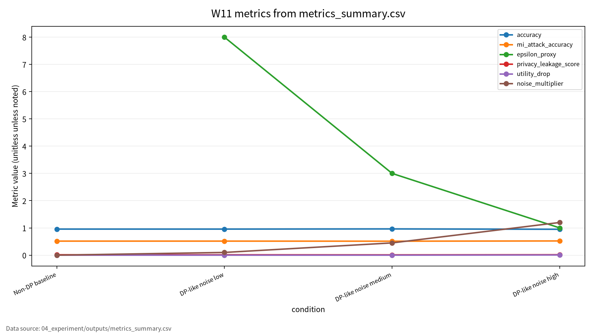
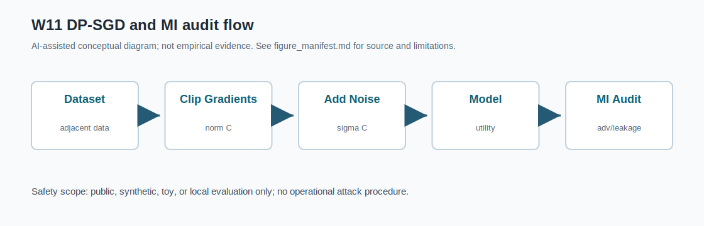

# W11 차등프라이버시(DP) & 멤버십 추론 공격·방어

## 발표 핵심

DP 보장은 선언이 아니라 accounting, utility, MI risk, leakage, 재현성 로그로 검증해야 한다.

---

# 1. 왜 중요한가

- 학습 데이터 포함 여부 자체가 민감정보가 될 수 있다.
- DP를 적용했다고 해도 accountant와 평가 로그가 없으면 보장 해석이 어렵다.
- Accuracy만 보면 privacy leakage를 놓친다.

---

# 2. 발표 로드맵

1. AI 원리
2. 보안 이슈
3. 논문 5편의 역할
4. 위협모형과 평가방법
5. synthetic toy 실험
6. 기말논문 연결

---

# 3. AI 원리 70%

- Differential Privacy: 인접 데이터셋의 출력 분포 차이 제한
- DP-SGD: gradient clipping + noise injection + privacy accounting
- Privacy budget: epsilon/delta와 utility의 trade-off

---

# 4. 보안 이슈 30%

| 위협 | 공격자 가정 | 대표 지표 |
|---|---|---|
| Membership inference | confidence/loss 관찰 | MI Attack Accuracy |
| Privacy leakage | member/non-member 신호 차이 | Leakage Score |
| DP misuse | accountant 누락 | Reference/config check |

---

# 5. 논문 5편의 역할

| ID | 중심 역할 | 발표 활용 |
|---|---|---|
| P01 | DP misuse | reporting 책임 |
| P02 | DP-DL survey | auditing/evaluation |
| P03 | DP 적용 위치 | DL/FL 연결 |
| P04 | MI taxonomy | 위협모형 |
| P05 | MI defense | trade-off |

P03/P05는 로컬 PDF가 지정 논문과 다른 대체 문헌이므로 최종 인용 전 원문 확보가 필요하다.

---

# 6. 위협모형

| 항목 | 내용 |
|---|---|
| 보호 자산 | membership information, confidence score, output, log |
| 공격자 | 외부 질의자, 모델 사용자, 내부 평가자 |
| 공격 경로 | API output, confidence, evaluation log |
| 제외 범위 | 실제 개인정보, 실제 개인 대상 추론, 무단 API |

---

# 7. 평가 프로토콜

| 평가 항목 | 지표 | 기록 방법 |
|---|---|---|
| Utility | Accuracy, Utility Drop | CSV/JSON/log |
| Membership risk | MI Attack Accuracy | synthetic split |
| Leakage | Privacy Leakage Score | confidence gap |
| Reproducibility | seed, config, outputs | run log |

---

# 8. 실험 설계

- Synthetic binary classification
- Toy logistic regression
- Non-DP baseline vs DP-like noise low/medium/high
- `epsilon_proxy`는 정식 DP accountant 값이 아님
- `noise_multiplier`는 toy gradient noise scale이며 formal DP-SGD accountant 값이 아님

---

# 9. 결과

| 조건 | Accuracy | MI Acc. | Eps. proxy | Leakage |
|---|---:|---:|---:|---:|
| Non-DP | 0.956250 | 0.515625 | 해당 없음 | 0.014833 |
| Low | 0.956250 | 0.515625 | 8.000000 | 0.014494 |
| Medium | 0.962500 | 0.512500 | 3.000000 | 0.011769 |
| High | 0.950000 | 0.521875 | 1.000000 | 0.016482 |

---

# 10. 해석

- Medium noise에서 leakage proxy가 가장 낮았다.
- High noise는 utility drop이 생겼지만 MI risk가 단조롭게 낮아지지는 않았다.
- DP claim은 accountant와 반복 평가 없이는 확정할 수 없다.

---

# 11. 기말논문 연결

| 기말논문 장 | 연결 내용 |
|---|---|
| 관련연구 | DP misuse, DP-DL, MI survey |
| 위협모형 | membership information 보호 |
| 평가방법 | utility + MI risk + leakage + logs |
| 보안적 함의 | privacy claim accountability |

---

# 12. 결론

- DP는 구현 설정과 accounting까지 함께 보고해야 한다.
- MI 위험은 별도 보안 지표로 평가해야 한다.
- 수치는 `outputs/` 로그가 있을 때만 주장한다.

<!-- formula-visual-supplement:start -->
# 수식·그래프·그림 보강

- 보강 일자: 2026-06-23
- 수식은 표준 정의식 또는 검증 가능한 평가식으로만 작성했다.
- 그래프는 `04_experiment/outputs/metrics_summary.csv`의 기존 수치만 사용했다.
- 다이어그램은 AI-assisted conceptual diagram이며 사실 자료나 실험 결과처럼 해석하지 않는다.

### 핵심 수식: Differential Privacy Definition

$$
\Pr[M(D)\in S]\le e^{\varepsilon}\Pr[M(D')\in S]+\delta
$$

| 기호 | 의미 |
|---|---|
| `M` | 무작위 알고리즘 또는 학습 절차 |
| `D,D'` | 한 레코드만 다른 adjacent datasets |
| `S` | 가능한 출력 사건 |
| `\varepsilon,\delta` | DP privacy parameters |

**직관적 의미:**  
DP는 한 개인 레코드의 포함 여부가 출력 분포를 크게 바꾸지 않도록 제한하는 표준 정의다.

**보안 관점 해석:**  
Membership inference 위험을 줄이려는 privacy claim은 이 정의와 accountant 근거가 있어야 한다.

**평가 지표 연결:**  
epsilon, delta, privacy_leakage_score, mi_attack_accuracy와 연결한다.

**한계와 가정:**  
현재 CSV의 `epsilon_proxy`는 formal accountant 결과가 아니므로 보증값으로 쓰지 않는다.

### 핵심 수식: DP-SGD Clipping/Noise와 MI Advantage

$$
\bar{g}_i=\frac{g_i}{\max(1,\lVert g_i\rVert_2/C)},
\qquad
\tilde{g}=\frac{1}{B}\left(\sum_{i=1}^{B}\bar{g}_i+\mathcal{N}(0,\sigma^2C^2I)\right),
\qquad
Adv_{MI}=TPR-FPR
$$

| 기호 | 의미 |
|---|---|
| `g_i,\bar{g}_i` | 개별 gradient와 clipping 후 gradient |
| `C` | clipping norm |
| `\sigma` | noise multiplier |
| `Adv_{MI}` | membership inference advantage |

**직관적 의미:**  
DP-SGD는 gradient 크기를 제한하고 noise를 더해 개별 레코드 영향을 줄인다. MI advantage는 멤버와 비멤버를 구분하는 공격자의 이득을 요약한다.

**보안 관점 해석:**  
프라이버시 방어는 utility drop과 leakage 감소를 함께 보고해야 한다.

**평가 지표 연결:**  
accuracy, utility_drop, privacy_leakage_score, mi_attack_accuracy, noise_multiplier와 연결한다.

**한계와 가정:**  
표준식 설명이며 이 실습은 정식 DP accountant를 실행하지 않은 toy evaluation이다.

### 표 수치 기반 그래프

그래프는 accuracy, MI attack accuracy, epsilon_proxy, leakage score, utility_drop, noise_multiplier를 조건별로 비교한다. `epsilon_proxy`는 formal DP accountant 결과가 아니므로 privacy guarantee로 읽으면 안 된다. 수치는 W11 outputs의 toy 결과 그대로다.

### Threat Model / Pipeline Diagram

이 다이어그램은 `DP-SGD and MI audit flow`를 발표용으로 요약한 개념도다. 데이터 흐름, 평가 지표, 한계 표시는 `assets/figure_manifest.md`에도 기록했다.

### 확인 필요

- `epsilon_proxy`는 formal DP accountant 값이 아니며 formal DP guarantee로 쓰지 않는다.
- 논문별 원문 절·쪽·그림 번호는 최종 제출 전 사람 검토가 필요하다.
<!-- formula-visual-supplement:end -->
