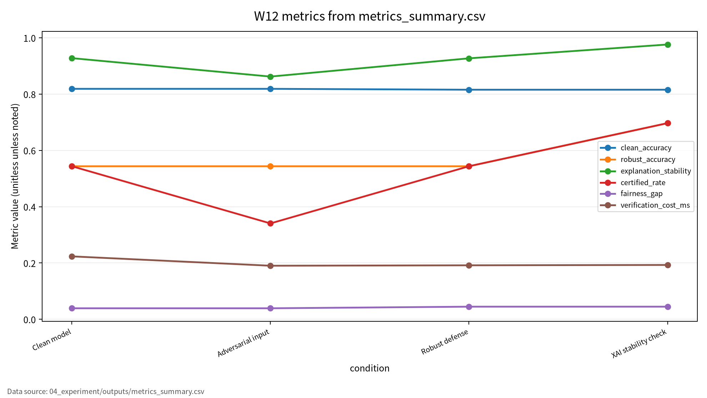
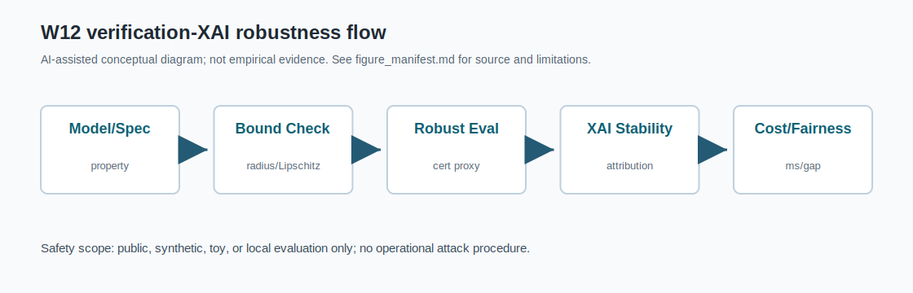

# W12 신경망 검증·정형방법 & 대적방어·XAI·강건성 트레이드오프 통합보고서

## 0. 메타정보

| 항목 | 내용 |
|---|---|
| 주차 | W12 |
| 주제 | 신경망 검증·정형방법 & 대적방어·XAI·강건성 트레이드오프 |
| 작성일 | 2026-06-22 |
| 보완일 | 2026-06-23 |
| 문서 상태 | 제출용 최종 초안. 최종 제출 확정 아님 |
| 실험 근거 | `04_experiment/outputs/metrics_summary.csv`, `results.json`, `run_log.md` |
| 문헌 상태 | DOI/URL 부분 검증. SUBSTITUTE PDF 다수 존재 |

## 1. 한 문장 요약

W12는 신경망 검증과 정형방법을 AI 원리로 이해하고, 대적 강건성·XAI 설명 안정성·정확도·공정성 사이의 trade-off를 clean accuracy, robust accuracy, explanation stability, certified rate, fairness gap, verification cost로 함께 보고하는 주차이다.

## 2. 학습 배경과 주차 목표

### 2.1 이번 주 주제의 위치

W12는 W01~W11에서 다룬 AI 보안 평가축을 신경망 검증, 정형방법, XAI 설명 안정성, 강건성-정확도-공정성 trade-off로 확장하는 주차다. W11까지는 privacy claim과 membership inference를 다루었다면, W12는 모델이 특정 입력 perturbation 범위에서 명세를 만족하는지, 설명 결과가 안정적인지, 강건성 개선이 accuracy나 fairness에 어떤 비용을 만드는지 평가한다. 핵심은 "모델이 맞았는가"뿐 아니라 "작은 변화에도 예측과 설명이 안정적인가", "보증 가능한 범위는 어디까지인가", "검증 비용은 감당 가능한가"를 함께 기록하는 것이다.

### 2.2 강의계획서상 학습목표

- Neural network verification, abstraction, formal methods, robustness proof의 기본 개념을 정리한다.
- Empirical robustness와 certified robustness를 구분한다.
- XAI explanation stability와 adversarial XAI 공격면을 이해한다.
- Robustness, accuracy, fairness trade-off를 다중지표로 보고하는 평가 프로토콜을 설계한다.

### 2.3 이번 주 핵심 질문

1. 경험적 robust accuracy와 formal certified robustness는 어떻게 다른가?
2. Abstraction method와 bound propagation은 왜 필요한가?
3. XAI 설명이 안정적이지 않으면 accountability에 어떤 문제가 생기는가?
4. Robust defense는 accuracy, certified rate, fairness gap에 어떤 trade-off를 만드는가?
5. W12의 synthetic toy 실험을 KCI 또는 SCI 논문 주제로 발전시키려면 어떤 연구문제가 적절한가?

## 3. AI 원리 70% 정리

신경망 검증은 특정 입력 영역에서 모델 출력이 명세를 만족하는지 확인하는 절차이며, abstraction은 검증 가능성을 높이기 위한 핵심 접근이다[1]. 대적공격과 방어 연구는 clean accuracy와 robust accuracy를 분리해 평가해야 함을 보여준다[2]. XAI 설명도 대적 조작의 대상이 될 수 있으므로 explanation stability를 별도 지표로 보고해야 한다[3]. Lipschitz regularization은 입력 변화가 출력 변화로 증폭되는 정도를 제한하려는 강건성 접근이다[4]. Robustness, accuracy, fairness는 동시에 최적화되기 어려우므로 다중지표 평가가 필요하다[5].

표 1. W12 핵심 개념과 보안 연결

| 개념 | AI 원리 | 보안 연결 |
|---|---|---|
| Neural network verification | 입력 영역에서 명세 만족 여부 확인 | unverified robustness claim 방지 |
| Abstraction | 복잡한 계산을 검증 가능한 형태로 근사 | verification scalability 완화 |
| Empirical robustness | 공격/테스트 조건에서 관측한 성능 | weak attack 평가 위험 |
| Certified robustness | 명세와 bound 기반 보증 | 안전성 주장 근거 |
| XAI stability | 입력 변화 전후 설명 일관성 | misleading explanation 방지 |
| Fairness gap | group별 성능 차이 | robustness-fairness trade-off 점검 |

## 4. 보안 이슈 30% 정리

W12의 보안 이슈는 prediction integrity, explanation accountability, verification availability, fairness impact로 나뉜다. Adversarial input은 예측을 왜곡할 수 있고, explanation manipulation은 사람이 모델 판단을 잘못 해석하게 만들 수 있다. 검증 비용이 커지면 검증이 생략될 수 있으며, robustness 개선이 fairness gap을 키울 수 있다.

그림 1. 신경망 검증·XAI 안정성·강건성 평가 흐름

```text
Synthetic Input Data
        ↓
Toy Logistic Classifier
        ↓
Clean Evaluation ──> Clean Accuracy
        ↓
Perturbation Proxy ──> Robust Accuracy
        ↓
Bound Proxy ──> Certified Rate
        ↓
Attribution Comparison ──> Explanation Stability
        ↓
Group Evaluation ──> Fairness Gap
        ↓
Reproducibility Evidence ──> seed, config, outputs, run_log
```

## 5. 논문 5편 요약

표 2. 관련 문헌 5편 요약

| 번호 | 지정 문헌 | 공식 DOI/URL 검증 상태 | 로컬 PDF 상태 | W12 활용 |
|---|---|---|---|---|
| [1] P01 | Boudardara et al., A Review of Abstraction Methods Toward Verifying Neural Networks | DOI `10.1145/3617508` 부분 검증. 매체 정보 강의 표기와 충돌 | Meng et al. 2022 SUBSTITUTE | abstraction 기반 verification 배경 |
| [2] P02 | Zhou et al., Adversarial Attacks and Defenses in Deep Learning | 후보 DOI `10.1145/3547330` 부분 검증. Sen/Shuai 및 subtitle 확인 필요 | Kui Ren et al. 2020 PDF, 지정 논문과 불일치 | attack/defense taxonomy |
| [3] P03 | Vadillo et al., adversarial XAI review | DOI `10.1002/widm.1567` 부분 검증. published title 차이 존재 | Baniecki/Biecek SUBSTITUTE | explanation manipulation |
| [4] P04 | Pérez et al., Lipschitz regularization survey | 지정 DOI 확인 필요. 유사 DOI `10.1145/3648351`은 저자/제목 불일치 | Finlay et al. SUBSTITUTE | Lipschitz robustness |
| [5] P05 | Cheng et al., triangular trade-off | 지정 DOI 확인 필요. 유사 DOI `10.1145/3645088`은 저자/제목/연도 불일치 | Singh et al. SUBSTITUTE | robustness-accuracy-fairness |

## 6. 논문 5편 비교표

| 논문 | 연구문제 | 핵심 방법 | AI 원리 기여 | 보안 위협 연결 | 평가 지표 | 한계 | 내 논문 활용 |
|---|---|---|---|---|---|---|---|
| P01 | abstraction method의 검증 역할 | abstraction, reachability, bound propagation | formal verification과 empirical evaluation 구분 | robust claim 과장 | certified robustness, verification cost | SUBSTITUTE PDF, 매체 정보 충돌 | formal-bound 배경 |
| P02 | attack/defense 분류 | adversarial taxonomy | perturbation budget, robust training | prediction integrity | clean/robust accuracy, ASR | 로컬 PDF 불일치 | 공격·방어 평가축 |
| P03 | 설명 조작 취약성 | adversarial XAI taxonomy | attribution stability | misleading explanation | explanation stability | SUBSTITUTE PDF | accountability 지표 |
| P04 | Lipschitz와 robustness | Lipschitz bound, regularization | margin, certified radius | robustness overclaim | robust accuracy, certified rate | 지정 DOI 미확인 | toy proxy 배경 |
| P05 | robustness-accuracy-fairness trade-off | triangular trade-off | multi-objective evaluation | fairness degradation | fairness gap | 지정 DOI 미확인 | multi-metric 평가표 |

W12의 핵심 연결부는 clean accuracy, robust accuracy, explanation stability, certified rate, fairness gap, verification cost를 함께 보고하는 것이다. `certified rate`는 현재 toy 선형 모델의 bound proxy이며 실제 DNN formal verification certificate가 아니다. `SUBSTITUTE` PDF는 지정 논문과 구분하여 관리한다.

## 7. Research Track 분석

표 3. W12 Research Track 요약

| 항목 | 내용 |
|---|---|
| 연구문제 | AI 보안 평가에서 verification, robustness, XAI stability, fairness를 어떻게 통합 보고할 것인가 |
| 대상 시스템 | deep learning classifier, XAI explanation module, neural network verification pipeline |
| 보호 자산 | model prediction, robustness certificate, explanation output, fairness metric, verification log |
| 위협 | adversarial input, explanation manipulation, verification setting manipulation, fairness degradation |
| 평가 지표 | Clean Accuracy, Robust Accuracy, Explanation Stability, Certified Rate, Fairness Gap, Verification Cost |
| 제외 범위 | actual safety-critical system attack, production model compromise, personal data evaluation, unauthorized probing |

## 8. 실습 보고서

표 4. W12 실습 설계

| 항목 | Description |
|---|---|
| Dataset | Synthetic binary classification |
| Train samples | 420 |
| Test samples | 320 |
| Features | 4 |
| Model | Toy logistic classifier |
| Perturbation | L-infinity epsilon proxy |
| Epsilon | 0.35 |
| Conditions | Clean model, adversarial input, robust defense, XAI stability check |
| Seed | 42 |
| Output files | `metrics_summary.csv`, `results.json`, `run_log.md` |

표 5. W12 실습 결과

| 조건 | Clean Accuracy | Robust Accuracy | Explanation Stability | Certified Rate | Fairness Gap | Verification Cost ms |
|---|---:|---:|---:|---:|---:|---:|
| Clean model | 0.818750 | 0.543750 | 0.927782 | 0.543750 | 0.039141 | 0.223524 |
| Adversarial input | 0.818750 | 0.543750 | 0.862321 | 0.340625 | 0.039141 | 0.190324 |
| Robust defense | 0.815625 | 0.543750 | 0.927152 | 0.543750 | 0.044823 | 0.191790 |
| XAI stability check | 0.815625 | 0.696875 | 0.976252 | 0.696875 | 0.044823 | 0.193048 |

이 결과는 synthetic binary classification 기반 toy 실험의 평가 형식 검증용 수치이며, 실제 대규모 DNN formal verification, 실제 안전중요 시스템 보증, 실제 운영 모델의 강건성 또는 XAI 안정성으로 일반화하지 않는다. `adversarial_features()`는 실제 PGD/FGSM 구현이 아니라 선형 가중치 부호 기반 toy perturbation proxy다.

## 9. AI 도구 활용 기록

Codex와 ChatGPT를 사용해 W12 폴더 점검, DOI/URL 검증 보조, SUBSTITUTE PDF 표시, synthetic robustness/XAI 실험 코드 작성, 보고서·발표자료·KCI/SCI 섹션 보완을 수행했다. AI 산출물은 초안이며, 최종 제출자는 DOI, 저자, 학술지, 실험 수치, PDF 저작권 상태를 직접 확인해야 한다.

## 10. 토론 질문

1. Empirical robust accuracy가 충분히 높아도 formal verification이 필요한 이유는 무엇인가?
2. XAI 설명이 안정적이지 않은 모델을 책임성 있는 모델이라고 말할 수 있는가?
3. Robust defense가 fairness gap을 키울 때 어떤 지표를 우선해야 하는가?
4. Verification cost가 큰 모델에서 risk-based partial verification을 허용할 수 있는가?

## 11. 기말논문 연결

W12는 기말논문의 관련연구, 위협모형, 평가방법, 보안적 함의에 연결된다. 추천 주제는 "AI 보안 평가에서 강건성·설명안정성·공정성·재현성을 통합한 다중지표 프레임워크 연구"다.

## 12. KCI 논문 형식 전환

### 12.1 KCI형 제목 후보

표 6. KCI 논문 제목 후보

| 번호 | 국문 제목 후보 | 영문 제목 후보 | 대상 시스템 | 보안 위협 | 연구방법 | 예상 기여 |
|---:|---|---|---|---|---|---|
| 1 | AI 보안 평가에서 강건성·설명안정성·공정성·재현성을 통합한 다중지표 프레임워크 연구 | A Multi-Metric Framework Integrating Robustness, Explanation Stability, Fairness, and Reproducibility in AI Security Evaluation | 딥러닝 분류 모델, XAI 시스템 | adversarial input, explanation manipulation | 문헌분석 + synthetic toy 실험 | 다중지표 평가표 |
| 2 | 신경망 검증과 XAI 안정성 평가를 결합한 보안성 검증 프로토콜 연구 | A Security Verification Protocol Combining Neural Network Verification and XAI Stability Evaluation | neural network + XAI pipeline | misleading explanation, robustness overclaim | toy verification proxy + 체크리스트 | certified rate와 XAI stability 동시 평가 |
| 3 | Robustness, Accuracy, Fairness Trade-off를 고려한 AI 모델 보안 평가체계 연구 | An AI Model Security Evaluation Framework Considering the Trade-off Between Robustness, Accuracy, and Fairness | AI 분류 모델 | adversarial robustness, fairness degradation | 문헌분석 + 실험표 | trade-off 중심 보안 평가 |

### 12.2 추천 최종 제목

- 국문: AI 보안 평가에서 강건성·설명안정성·공정성·재현성을 통합한 다중지표 프레임워크 연구
- 영문: A Multi-Metric Framework Integrating Robustness, Explanation Stability, Fairness, and Reproducibility in AI Security Evaluation

### 12.3 국문초록 초안

본 연구는 AI 보안 평가에서 신경망 검증, 대적 강건성, XAI 설명 안정성, 공정성, 재현성을 통합적으로 보고하기 위한 다중지표 프레임워크를 제안한다. Neural network verification, adversarial attack and defense, adversarial XAI, Lipschitz robustness, robustness-accuracy-fairness trade-off 관련 선행연구를 비교하고, clean accuracy, robust accuracy, explanation stability, certified rate, fairness gap, verification cost, reproducibility evidence의 평가축을 도출한다. 또한 실제 안전중요 시스템이나 개인정보를 사용하지 않고 synthetic binary classification과 toy logistic classifier를 활용하여 clean model, adversarial input, robust defense, XAI stability check 조건을 비교한다. 본 연구는 certified rate가 toy 선형 모델의 bound proxy일 뿐 대규모 DNN formal verification 보장이 아님을 명확히 하면서, AI 보안 평가에서 단일 accuracy가 아닌 다중지표 보고가 필요함을 보인다.

### 12.4 영문초록 초안

This study proposes a multi-metric framework for reporting neural network verification, adversarial robustness, XAI explanation stability, fairness, and reproducibility in AI security evaluation. By reviewing studies on neural network verification, adversarial attacks and defenses, adversarial XAI, Lipschitz robustness, and the robustness-accuracy-fairness trade-off, this report derives evaluation axes including clean accuracy, robust accuracy, explanation stability, certified rate, fairness gap, verification cost, and reproducibility evidence. A safe toy experiment using synthetic binary classification and a toy logistic classifier is used to compare clean model, adversarial input, robust defense, and XAI stability check conditions. The goal is not to claim formal verification for large-scale DNNs, but to demonstrate a reproducible multi-metric reporting structure for AI security evaluation.

### 12.5 키워드

| 구분 | 키워드 |
|---|---|
| 국문 | 신경망 검증, 정형방법, 대적 강건성, XAI 안정성, Certified Robustness, Fairness Gap |
| 영문 | Neural Network Verification, Formal Methods, Adversarial Robustness, XAI Stability, Certified Robustness, Fairness Gap |

### 12.6 연구문제

- RQ1. AI 보안 평가에서 clean accuracy, robust accuracy, certified rate, explanation stability를 함께 보고해야 하는 이유는 무엇인가?
- RQ2. Robust defense 조건은 clean accuracy, robust accuracy, certified rate, fairness gap에 어떤 trade-off를 만드는가?
- RQ3. XAI stability check는 모델의 accountability 평가에 어떤 추가 정보를 제공하는가?

### 12.7 연구방법

문헌분석으로 W12 논문 5편을 verification, adversarial defense, adversarial XAI, Lipschitz robustness, triangular trade-off 축으로 비교한다. 위협모형은 모델 예측, robustness certificate, XAI 설명 결과, fairness metric, verification log를 보호 자산으로 설정한다. 모의실험은 synthetic binary classification 기반 toy logistic classifier를 사용하고, clean model, adversarial input, robust defense, XAI stability check를 비교한다.

### 12.8 보안적 함의

Integrity, accountability, safety, fairness, availability, reproducibility 관점에서 다중지표 보고가 필요하다. 특히 robust defense가 group accuracy gap을 키울 수 있으므로 fairness gap을 함께 기록해야 한다.

### 12.9 KCI 제출 가능성 점검표

| 점검 항목 | 상태 |
|---|---|
| 국문·영문 제목 후보 작성 | 완료 |
| 국문초록 초안 작성 | 완료 |
| 영문초록 초안 작성 | 완료 |
| 키워드 작성 | 완료 |
| 연구문제 작성 | 완료 |
| 연구방법 작성 | 완료 |
| 표 1개 이상 포함 | 완료 |
| 그림 1개 이상 포함 | 완료 |
| 국내 참고문헌 3편 이상 | 확인 필요 |
| 해외 참고문헌 5편 이상 | W12 기준 완료, 단 DOI/원문 대조 필요 |

## 13. SCI 논문 형식 전환

### 13.1 SCI 제목 후보

A Multi-Metric Evaluation Framework for Neural Network Verification, XAI Stability, Robustness, Fairness, and Reproducibility

### 13.2 Structured Abstract

#### Background

Neural network verification, adversarial robustness, and explainable AI are critical components of trustworthy AI security evaluation. However, clean accuracy alone cannot capture robustness, explanation stability, fairness, or verification cost.

#### Problem

Existing evaluations often separate empirical robustness, certified robustness, XAI stability, fairness, and reproducibility evidence. This makes it difficult to assess whether a model is both accurate and security-relevant under perturbation and explanation manipulation risks.

#### Method

This study synthesizes five representative studies on neural network verification, adversarial attacks and defenses, adversarial XAI, Lipschitz robustness, and the robustness-accuracy-fairness trade-off. A safe toy experiment is used to compare clean model, adversarial input, robust defense, and XAI stability check conditions.

#### Results

The W12 toy experiment records clean accuracy, robust accuracy, explanation stability, certified rate, fairness gap, and verification cost. The certified rate is a linear bound proxy in the toy setting and should not be interpreted as formal verification for large-scale DNNs.

#### Contribution

The main contribution is a multi-metric reporting structure that integrates clean accuracy, robust accuracy, explanation stability, certified rate, fairness gap, verification cost, and reproducibility evidence.

#### Implications

The framework can be extended to formal verification tools, certified defense evaluation, adversarial XAI benchmarks, fairness-aware robustness evaluation, and risk-based AI assurance workflows.

### 13.3 Introduction 구성

- AI security evaluation에서 accuracy 중심 평가의 한계
- empirical robustness와 certified robustness의 차이
- neural network verification과 abstraction method의 필요성
- XAI stability와 accountability 문제
- robustness-accuracy-fairness trade-off
- 본 연구의 contribution

### 13.4 Related Work 축

표 7. SCI Related Work 축

| 연구축 | 대표 논문 | 역할 |
|---|---|---|
| Neural network verification | Boudardara et al. 또는 현재 P01 지정 논문 | abstraction, reachability, formal verification |
| Adversarial attacks and defenses | Zhou et al. 또는 현재 P02 지정 논문 | adversarial attack/defense taxonomy |
| Adversarial XAI | Vadillo et al. 또는 현재 P03 지정 논문 | explanation manipulation, attribution robustness |
| Lipschitz robustness | Pérez et al. 또는 현재 P04 지정 논문 | Lipschitz regularization, certified robustness |
| Robustness-accuracy-fairness trade-off | Cheng et al. 또는 현재 P05 지정 논문 | multi-objective robustness/fairness evaluation |

### 13.5 Threat Model

Target system은 deep learning classifier, XAI explanation module, neural network verification pipeline이다. Protected assets는 model prediction, robustness certificate, explanation output, fairness metric, verification log다. Adversary capability는 input perturbation, explanation manipulation, evaluation setting manipulation으로 제한하여 논의한다. Excluded scope는 actual safety-critical system attack, production model compromise, personal data evaluation, operational adversarial testing이다.

### 13.6 Methodology

Literature matrix construction, Verification/XAI threat model design, Synthetic binary classification experiment, Toy logistic classifier training, Adversarial perturbation proxy evaluation, Robust defense proxy evaluation, Explanation stability measurement, Certified rate proxy calculation, Fairness gap and verification cost reporting, Reproducibility evidence collection으로 구성한다.

### 13.7 Experimental Setup

표 4의 W12 실습 설계를 SCI 실험 설정 표로 확장한다.

### 13.8 Results

표 5의 outputs 기준 수치를 사용한다. outputs 파일이 없을 경우 결과는 `확인 필요`로 바꾸지만, 현재 세 파일은 존재하고 로컬 재실행에 성공했다.

### 13.9 Discussion

Clean accuracy는 robustness나 safety guarantee를 의미하지 않는다. Robust accuracy와 certified rate는 구분해야 한다. Certified rate는 현재 toy 선형 모델의 proxy이며 formal DNN verification이 아니다. XAI stability는 model accountability 평가에 필요하다. Robust defense가 fairness gap을 키울 수 있으므로 fairness metric을 함께 보고해야 한다. Verification cost는 실제 운영 가능성과 연결된다. SUBSTITUTE PDF 상태인 문헌은 지정 논문처럼 인용하면 안 된다.

### 13.10 Limitations and Threats to Validity

Internal validity: toy logistic classifier는 deep neural network verification dynamics를 대표하지 않는다. External validity: synthetic data는 실제 이미지, 텍스트, 의료, 자율주행 등 안전중요 데이터를 대표하지 않는다. Construct validity: adversarial input과 certified rate는 linear proxy이며 실제 PGD/IBP/MILP verification 결과가 아니다. Literature validity: P01~P05의 지정 표기와 로컬 PDF/공식 DOI 후보 사이 불일치가 있다.

### 13.11 Conclusion

W12는 AI 보안 평가에서 clean accuracy 하나로는 충분하지 않으며, robust accuracy, certified rate, explanation stability, fairness gap, verification cost, reproducibility evidence를 함께 기록해야 함을 보인다.

## 14. 발표용 요약

발표 핵심 메시지는 "안전한 AI 평가는 정확도 하나가 아니라 강건성, 설명 안정성, 공정성, 검증 비용, 재현성을 함께 보고해야 한다"이다. 발표자료는 `09_presentation/`에 있으며 표 5와 같은 outputs 수치를 사용한다.

## 15. 참고문헌 검증표

| 번호 | 참고문헌 | DOI/URL | 상태 | 주의 |
|---|---|---|---|---|
| [1] | Boudardara et al., A Review of Abstraction Methods Toward Verifying Neural Networks | `10.1145/3617508` | 부분 검증 | 로컬 PDF 대체 상태, 매체 정보 충돌 |
| [2] | Zhou et al., Adversarial Attacks and Defenses in Deep Learning | 후보 `10.1145/3547330` | 부분 검증 | 로컬 Ren PDF와 불일치 |
| [3] | Vadillo et al., adversarial XAI review | `10.1002/widm.1567` | 부분 검증 | published title 차이, 로컬 PDF 대체 상태 |
| [4] | Pérez et al., Lipschitz regularization survey | 확인 필요 | 미확정 | 유사 DOI를 지정 논문 DOI로 확정 금지 |
| [5] | Cheng et al., triangular trade-off | 확인 필요 | 미확정 | 유사 DOI를 지정 논문 DOI로 확정 금지 |

PDF 저작권 점검: `01_papers/pdf/`의 PDF 5개는 `git ls-files` 기준 이미 추적 중이다. public GitHub 저장소에는 출판사 PDF 원문 대신 DOI/URL, 서지정보, 요약만 남기는 편이 안전하다. 삭제는 사용자 승인 후 처리한다.

## 16. 자기 점검표

| 점검 항목 | 상태 | 비고 |
|---|---|---|
| 1장 한 문장 요약 작성 | 완료 |  |
| 2장 학습 배경과 주차 목표 작성 | 완료 |  |
| AI 원리 70% 정리 | 완료 |  |
| 보안 이슈 30% 정리 | 완료 |  |
| 논문 5편 요약 | 완료 / 확인 필요 | 원문 세부 대조 필요 |
| 논문 5편 비교표 보완 | 완료 / 확인 필요 | SUBSTITUTE PDF 상태 반영 |
| Research Track 5요소 작성 | 완료 | 연구문제, 위협모형, 평가방법, 재현성, 오픈문제 |
| P01 지정 논문 원문 확보 | 확인 필요 | 현재 SUBSTITUTE PDF |
| P02 동일 여부 검증 | 확인 필요 | 로컬 PDF 저자/연도 대조 |
| P03 지정 논문 원문 확보 | 확인 필요 | 현재 SUBSTITUTE PDF |
| P04 지정 논문 원문 확보 | 확인 필요 | 현재 SUBSTITUTE PDF |
| P05 지정 논문 원문 확보 | 확인 필요 | 현재 SUBSTITUTE PDF |
| P01~P05 DOI/URL 검증 | 부분 완료 / 확인 필요 | 공식 후보와 강의 표기 충돌 |
| 실험 outputs 파일 존재 확인 | 완료 |  |
| 실험 결과와 보고서 수치 일치 | 완료 | outputs 기준 |
| certified rate proxy 한계 명시 | 완료 | formal verification 아님 |
| KCI 논문 형식 전환 작성 | 완료 |  |
| SCI 논문 형식 전환 작성 | 완료 |  |
| 본문 인용과 참고문헌 대응 | 완료 / 확인 필요 | 원문 최종 대조 필요 |
| 표·그림 번호 정리 | 완료 | 표 1~7, 그림 1 |
| AI 활용 고지 작성 | 완료 |  |
| PDF 저작권 위험 점검 | 완료 / 조치 필요 | 추적 중인 PDF 삭제 여부 결정 필요 |
| 최종 사람이 검토할 항목 표시 | 완료 |  |

<!-- formula-visual-supplement:start -->
## 수식·그래프·그림 보강

- 보강 일자: 2026-06-23
- 수식은 표준 정의식 또는 검증 가능한 평가식으로만 작성했다.
- 그래프는 `04_experiment/outputs/metrics_summary.csv`의 기존 수치만 사용했다.
- 다이어그램은 AI-assisted conceptual diagram이며 사실 자료나 실험 결과처럼 해석하지 않는다.

### 핵심 수식: Robustness Objective와 Certified Radius

$$
\min_\theta \mathbb{E}_{(x,y)}\left[\max_{\lVert \delta\rVert\le \epsilon}\ell(f_\theta(x+\delta),y)\right],
\qquad
\forall \delta:\lVert\delta\rVert\le r,\ f(x+\delta)=f(x)
$$

| 기호 | 의미 |
|---|---|
| `\epsilon` | 학습 또는 평가 교란 반경 |
| `r` | certified radius |
| `\delta` | 입력 교란 |
| `\ell` | 손실 함수 |

**직관적 의미:**  
강건 학습은 허용 교란 안에서 최악의 손실을 낮추려는 목표로 표현된다. Certified radius는 주어진 반경 안에서 예측이 바뀌지 않음을 보장하려는 개념이다.

**보안 관점 해석:**  
보안 주장에는 empirical robustness와 formal certificate를 구분해야 한다.

**평가 지표 연결:**  
robust_accuracy, certified_rate, mean_bound_margin, verification_cost_ms와 연결한다.

**한계와 가정:**  
현재 실습의 certified_rate는 formal verification인지 toy proxy인지 최종 검토가 필요하다.

### 핵심 수식: Explanation Stability, Fairness Gap, Verification Cost

$$
Stability=sim(A(x),A(x')),
\qquad
FairGap=\left|\Pr(\hat{y}=1|G=0)-\Pr(\hat{y}=1|G=1)\right|,
\qquad
Cost=\frac{1}{n}\sum_{i=1}^{n}t_i
$$

| 기호 | 의미 |
|---|---|
| `A(x)` | 입력 x에 대한 explanation/attribution |
| `sim` | 설명 간 유사도 |
| `G` | 민감 또는 비교 그룹 변수 |
| `t_i` | verification runtime |

**직관적 의미:**  
설명이 안정적이어야 방어 분석의 근거로 사용할 수 있다. 공정성 gap과 verification cost는 강건성 외의 배포 제약을 나타낸다.

**보안 관점 해석:**  
보안 검증은 robust accuracy 하나가 아니라 explanation stability와 fairness/cost를 함께 본다.

**평가 지표 연결:**  
explanation_stability, fairness_gap, verification_cost_ms와 연결한다.

**한계와 가정:**  
toy binary classification 설정이며 formal proof로 일반화하지 않는다.

### 표 수치 기반 그래프



그래프는 clean_accuracy, robust_accuracy, explanation_stability, certified_rate, fairness_gap, verification_cost_ms를 조건별로 표시한다. certified_rate가 toy proxy인지 formal verification 결과인지 문서에서 명확히 구분해야 한다. 모든 값은 W12 output CSV에서 읽었다.

### Threat Model / Pipeline Diagram



이 다이어그램은 `verification-XAI robustness flow`를 발표용으로 요약한 개념도다. 데이터 흐름, 평가 지표, 한계 표시는 `../../09_presentation/assets/figure_manifest.md`에도 기록했다.

### 확인 필요

- `certified_rate`는 toy proxy 또는 제한 실험인지 formal verification인지 최종 원문 확인이 필요하다.
- 논문별 원문 절·쪽·그림 번호는 최종 제출 전 사람 검토가 필요하다.
<!-- formula-visual-supplement:end -->
