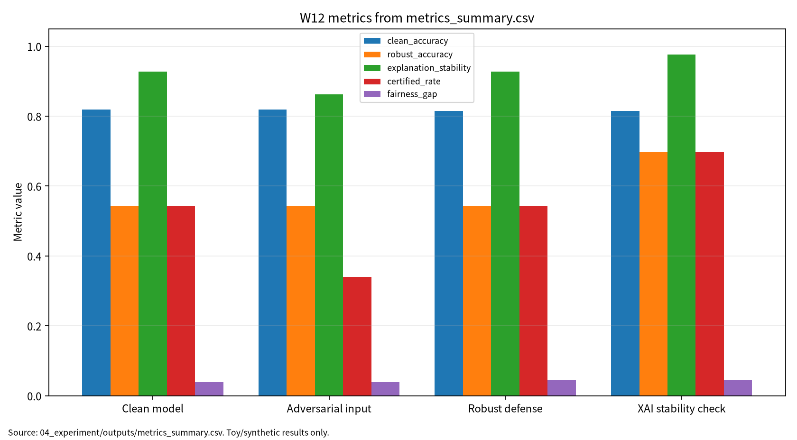

# W12 제출용 보고서

## 0. 메타정보

| 항목 | 내용 |
|---|---|
| 주차 | W12 |
| 작성자 | 박영세 |
| 학번 | 26200122 |
| 보고서 제목 | 신경망 검증·정형방법 & 대적방어·XAI·강건성 트레이드오프 |
| 과목 범위 | AI 보안 |
| 작성일 | 2026-06-22 |
| 보완일 | 2026-06-23 |
| 문서 상태 | 제출용 보고서 |
| 관련 산출물 위치 | `03_weekly_reports/w12_nn_verification_xai/` |
| 실험 근거 | `04_experiment/outputs/run_log.md`, `metrics_summary.csv`, `results.json` |

## 초록

본 보고서는 신경망 검증, abstraction, formal methods, robustness certificate를 AI 원리 관점에서 정리하고, 대적방어, XAI 공격면, robustness-accuracy-fairness trade-off를 보안 관점에서 분석한다. 문헌 5편은 verification abstraction, adversarial attack/defense, adversarial XAI, Lipschitz robustness, triangular trade-off를 담당한다. 실습은 실제 시스템이나 개인정보 없이 synthetic binary classification 기반 안전 toy 실험으로 수행했으며, clean accuracy, robust accuracy, explanation stability, certified rate, fairness gap, verification cost를 함께 기록했다. 단, certified rate는 toy 선형 모델의 bound proxy이므로 대규모 DNN의 완전한 formal verification 결과로 해석하지 않는다.

**키워드:** neural network verification, formal methods, adversarial robustness, XAI stability, certified robustness, fairness gap, reproducibility
## 1. 한 문장 요약

W12는 정확도 중심 평가에서 벗어나 신경망 검증, 대적 강건성, XAI 설명 안정성, 공정성, 검증 비용을 함께 보고하는 AI 보안 평가 주차이다.

## 2. 학습 배경과 주차 목표

딥러닝 모델은 clean test data에서 높은 성능을 보이더라도 작은 입력 변화, 설명 조작, 검증 비용, 집단별 성능 차이에 취약할 수 있다. W12의 목표는 formal verification과 empirical robustness의 차이를 이해하고, 실제 공격을 수행하지 않는 안전한 toy setting에서 다중지표 보고 구조를 만드는 것이다.

## 3. AI 원리 70% 정리

| 표 1. AI 원리 | 설명 | W12 연결 |
|---|---|---|
| Neural network verification | 입력 범위에서 모델 출력이 명세를 만족하는지 확인 | robust/certified evaluation |
| Abstraction | 복잡한 계산을 검증 가능한 형태로 근사 | P01 verification survey |
| Robustness certificate | perturbation 범위에서 예측 안정성을 보증하려는 근거 | certified rate proxy와 구분 |
| Lipschitz regularization | 입력 변화가 출력 변화로 증폭되는 정도를 제한 | P04와 toy bound 해석 |
| XAI stability | 입력 변화 전후 설명 결과의 일관성 | explanation manipulation 대응 |

## 4. 보안 이슈 30% 정리

| 표 2. 보안 관점 | 관련 위협 | W12 평가 연결 |
|---|---|---|
| Confidentiality | explanation leakage | 설명이 민감 feature 의존성을 드러낼 수 있음 |
| Integrity | adversarial input, explanation manipulation | robust accuracy, explanation stability |
| Availability | verification scalability failure | verification cost |
| Safety | unverified robust behavior | certified rate와 제외 범위 명시 |
| Accountability | misleading explanation | XAI stability와 human review |
| Fairness | group별 성능 차이 | fairness gap |

## 5. 논문 5편 요약

| 표 3. 문헌 역할 | 문헌 | DOI/URL 상태 | 활용 |
|---|---|---|---|
| P01 | A Review of Abstraction Methods Toward Verifying Neural Networks [1] | 부분 검증, 로컬 PDF는 `대체문헌` | abstraction 기반 verification 분류 |
| P02 | Adversarial Attacks and Defenses in Deep Learning [2] | 부분 검증, 로컬 PDF명 대조 필요 | 공격·방어 taxonomy |
| P03 | Adversarial Attacks in Explainable Machine Learning [3] | 부분 검증, 로컬 PDF는 `대체문헌` | XAI 공격면 |
| P04 | Adversarial Robustness of Neural Networks from Lipschitz Regularization [4] | 확인 필요, 유사 DOI만 확인 | Lipschitz robustness |
| P05 | The Triangular Trade-off between Robustness, Accuracy, and Fairness [5] | 확인 필요, 유사 DOI만 확인 | 강건성·정확도·공정성 trade-off |

P01, P03, P04, P05는 지정 논문과 로컬 PDF가 불일치하거나 `대체문헌` 파일이므로 최종 제출 전 원문 PDF 또는 공식 출판 페이지를 사람이 재확인해야 한다. 공개 GitHub 저장소에 상용 학술 PDF를 그대로 포함하면 저작권 위험이 있으므로, 제출 전 PDF 공개 범위를 별도로 점검한다.

## 6. 논문 5편 비교표

| 표 4. 비교축 | P01 | P02 | P03 | P04 | P05 |
|---|---|---|---|---|---|
| 연구문제 | verification abstraction | attack/defense taxonomy | adversarial XAI | Lipschitz robustness | robustness-accuracy-fairness |
| 핵심 방법 | abstraction, reachability | adversarial examples | explanation attack | bound, regularization | trade-off survey |
| 보안 연결 | 보증 과장 방지 | 예측 무결성 | 설명 조작 | certified/empirical 구분 | 공정성 영향 |
| 내 논문 활용 | 평가축 설계 | 위협 분류 | XAI stability | certified rate 한계 | 다중지표 보고 |

## 7. Research Track 분석

| 표 5. 연구 설계 | 내용 |
|---|---|
| 연구문제 | 신경망 검증, XAI 안정성, robustness-accuracy-fairness trade-off를 어떻게 하나의 보안 평가표로 보고할 것인가 |
| 대상 시스템 | 딥러닝 분류 모델, XAI 설명 시스템, verification pipeline |
| 보호 자산 | 모델 예측, 강건성 보증, 설명 결과, 공정성 지표, 안전 판단 |
| 위협 | adversarial input, explanation manipulation, verification scalability failure |
| 평가 지표 | Clean Accuracy, Robust Accuracy, Explanation Stability, Certified Rate, Fairness Gap, Verification Cost |
| 재현성 | seed 42, config, script, CSV/JSON/run log 보존 |
| 제외 범위 | 실제 안전중요 시스템 공격, 운영 모델 침해, 개인정보 기반 평가 |

그림 1. W12 평가 흐름: literature review -> threat model -> synthetic binary classification toy experiment -> multi-metric report -> final paper bridge.

## 8. 실습 보고서

실습 코드는 `04_experiment/src/run_experiment.py`에 작성했다. 실행 명령은 `python3 src/run_experiment.py --config configs/config.yaml`이며 결과는 `04_experiment/outputs/`에 저장했다.

| 표 6. 실험 결과 | Clean Accuracy | Robust Accuracy | Explanation Stability | Certified Rate | Fairness Gap | Verification Cost ms |
|---|---:|---:|---:|---:|---:|---:|
| Clean model | 0.818750 | 0.543750 | 0.927782 | 0.543750 | 0.039141 | 0.223524 |
| Adversarial input | 0.818750 | 0.543750 | 0.862321 | 0.340625 | 0.039141 | 0.190324 |
| Robust defense | 0.815625 | 0.543750 | 0.927152 | 0.543750 | 0.044823 | 0.191790 |
| XAI stability check | 0.815625 | 0.696875 | 0.976252 | 0.696875 | 0.044823 | 0.193048 |

이 결과는 synthetic binary classification 기반 안전 toy 실험이다. `toy_logistic_classifier`는 W12의 평가축을 작게 재현하기 위해 선택했으며 실제 대규모 DNN formal verification이나 안전중요 시스템 평가를 대표하지 않는다. `certified_rate`는 선형 모델 margin bound proxy이며 formal verifier가 발급한 certificate가 아니다.

<!-- submission-metric-chart:start -->
**그림 7. W12 metrics summary chart**

출처: `04_experiment/outputs/metrics_summary.csv`. 이 그래프는 공개 toy/synthetic 산출물 기반이며 실제 공격 성능이나 운영 환경 성능으로 일반화하지 않는다.
<!-- submission-metric-chart:end -->

## 9. AI 도구 활용 기록

AI 도구는 문헌 요약, 코드 점검, 문장 구조화, 그래프 생성 보조에 사용하였다. 모든 DOI/URL, 실험 수치, 본문 인용, 결론은 작성자가 outputs 파일과 로컬 참고문헌 검증표를 대조하여 검증한다.

**표. W12 AI 도구 활용 및 검증 기록**

| 항목 | 내용 |
|---|---|
| 사용 도구명 | Codex, ChatGPT 계열 도구 |
| 사용 일자 | 2026-06-23 |
| 사용 목적 | 문헌 요약 정리, 보고서 구조화, 안전한 toy/synthetic 실험 결과 표기 점검, 그래프 생성 보조, 제출 전 체크리스트 정리 |
| 주요 프롬프트 요약 | 주차별 제출 보고서 보완, 참고문헌 검증표 정리, metrics_summary.csv 기반 그래프 생성, AI 활용 고지 작성 |
| AI 산출물 반영 위치 | `07_week_submission/w12_submission_report.md`, `07_week_submission/assets/w12_metric_chart.png`, `05_ai_worklog/ai_disclosure_draft.md` |
| 본인 수정 내용 | 주차별 문헌 상태 확인, 실험 수치와 outputs 대조, 안전 범위와 한계 문장 확인, 최종 제출 전 미확정 문헌 분리 |
| 사실관계 검증 방법 | `01_papers/paper_list.md`, `01_papers/doi_check.md`, `05_references/doi_index.md`, 강의계획서 문헌표 대조 |
| 참고문헌 검증 방법 | 제목, 저자, 연도, 학술지/학회, DOI/URL, 본문 인용번호와 참고문헌 목록 대응 확인 |
| 실험결과 검증 방법 | `04_experiment/outputs/metrics_summary.csv`, `results.json`, `run_log.md`의 수치와 보고서 표기 대조 |
| 최종 책임 확인 | AI 산출물은 초안 보조이며 최종 제출자는 원고 내용, 인용, 실험결과, 연구윤리 책임을 확인한다. |

## 10. 토론 질문

1. Clean accuracy가 높아도 robust accuracy가 낮다면 모델 안전성은 어떻게 보고해야 하는가?
2. Certified rate와 empirical robust accuracy를 같은 표에 둘 때 어떤 경고가 필요한가?
3. Explanation stability가 높은 모델을 곧바로 안전하다고 말할 수 있는가?
4. Robust defense가 fairness gap을 키울 수 있다면 평가 프로토콜은 어떻게 바뀌어야 하는가?

## 11. 기말논문 연결

추천 주제는 "강건성·설명안정성·공정성·재현성을 함께 보고하는 AI 보안 평가 프레임워크"이다. W12의 기여 후보는 verification/XAI/trade-off 문헌 비교표, multi-metric evaluation protocol, synthetic toy 실행 로그 기반 재현성 구조이다.

## 12. KCI 논문 형식 전환

| 항목 | 초안 |
|---|---|
| 국문 제목 | 신경망 검증과 XAI 안정성을 고려한 AI 보안 다중지표 평가 프레임워크 |
| 연구문제 | AI 보안 평가에서 강건성, 설명안정성, 공정성, 재현성을 함께 보고하는 방법 |
| 방법 | 선행연구 비교, 위협모형 정리, synthetic toy 실험, 체크리스트 설계 |
| 기여 | 정확도 중심 보고의 한계를 보완하는 평가표와 재현성 절차 |
| 한계 | DOI/PDF 최종 확인 필요, toy proxy 결과, 실제 DNN 검증 아님 |

## 13. SCI 논문 형식 전환

| 항목 | Draft |
|---|---|
| English title | A Multi-Metric Security Evaluation Framework for Neural Network Verification and XAI Stability |
| Research question | How can AI security reports jointly represent robustness, explanation stability, fairness, and reproducibility? |
| Method | Literature synthesis, threat modeling, synthetic toy experiment, reproducibility checklist |
| Contribution | A reporting framework separating clean accuracy, robust accuracy, certified proxy, explanation stability, fairness gap, and cost |
| Limitation | The certified rate is a toy linear-bound proxy, not a formal certificate for large-scale DNNs |

## 14. 발표용 요약

발표 핵심 메시지는 "안전한 AI 평가는 정확도 하나가 아니라 강건성, 설명 안정성, 공정성, 검증 비용, 재현성을 함께 보고해야 한다"이다. 발표자료는 `09_presentation/`에 있으며, 슬라이드와 발표 보고서 모두 최신 `outputs/` 수치를 반영한다.

## 15. 참고문헌 검증표

| 표 7. 참고문헌 | DOI/URL 확인 | PDF 상태 | 제출 전 조치 |
|---|---|---|---|
| [1] Boudardara et al. | `10.1145/3617508` 후보. 제목/저자는 일치하나 매체 표기 충돌 | 로컬 PDF는 Meng et al. 대체 문헌 | 공식 페이지 재확인 |
| [2] Zhou et al. | `10.1145/3547330` 후보. 강의 표기와 저자/권호 차이 | 로컬 PDF는 Ren et al. 2020 | 원문 PDF 대조 |
| [3] Vadillo et al. | `10.1002/widm.1567` 후보. 제목 세부 차이 | 로컬 PDF는 Baniecki/Biecek 대체 문헌 | 공식 페이지 재확인 |
| [4] Pérez et al. | 완전 일치 DOI 미확인. `10.1145/3648351`은 유사 주제 후보 | 로컬 PDF는 Finlay et al. 대체 문헌 | DOI 확정 전 인용 주의 |
| [5] Cheng et al. | 완전 일치 DOI 미확인. `10.1145/3645088`은 유사 주제 후보 | 로컬 PDF는 Singh et al. 대체 문헌 | DOI 확정 전 인용 주의 |

## 16. 자기 점검표

| 점검 항목 | 상태 | 비고 |
|---|---|---|
| 16장 구조 | 완료 | 0~16 섹션 포함 |
| AI 원리 70% / 보안 이슈 30% | 완료 | 표 1, 표 2 |
| 논문 5편 요약 및 비교 | 완료 | DOI/PDF 불일치 표시 |
| Research Track | 완료 | 연구문제, 위협, 지표 포함 |
| 실험 코드와 출력 | 완료 | `outputs/` 수치 반영 |
| certified rate proxy 한계 | 완료 | formal DNN verification 아님 |
| KCI/SCI 전환 | 완료 | 12장, 13장 |
| AI 활용 고지 | 완료 | 9장 |
| 공개 PDF 저작권 위험 | 확인 필요 | tracked PDF 공개 전 별도 점검 |
| 최종 제출 확정 여부 | 미확정 | 사람 검토 후 확정 |
