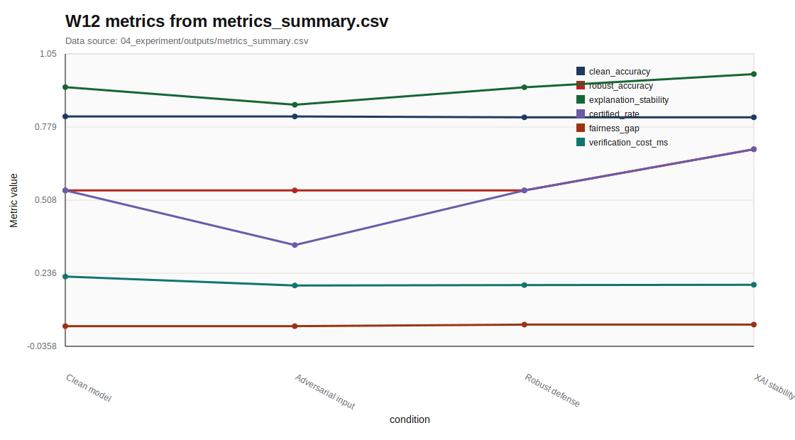

# W12 Neural Network Verification & XAI

Research Question: Neural Network Verification & XAI에서 성능 지표와 보안 지표를 어떻게 분리해 평가할 수 있는가?

---

## Core Formula

### Robustness Objective와 Certified Radius

$$
\min_\theta \mathbb{E}_{(x,y)}\left[\max_{\lVert \delta\rVert\le \epsilon}\ell(f_\theta(x+\delta),y)\right],
\qquad
\forall \delta:\lVert\delta\rVert\le r,\ f(x+\delta)=f(x)
$$

| 기호 | 의미 |
|---|---|
| `\epsilon` | 학습 또는 평가 교란 반경 |
| `r` | certified radius |
| `\delta` | 입력 교란 |
| `\ell` | 손실 함수 |

- 직관적 의미: 강건 학습은 허용 교란 안에서 최악의 손실을 낮추려는 목표로 표현된다. Certified radius는 주어진 반경 안에서 예측이 바뀌지 않음을 보장하려는 개념이다.
- 보안적 의미: 보안 주장에는 empirical robustness와 formal certificate를 구분해야 한다.
- 평가 지표 연결: robust_accuracy, certified_rate, mean_bound_margin, verification_cost_ms와 연결한다.
- 한계: 현재 실습의 certified_rate는 formal verification인지 toy proxy인지 최종 검토가 필요하다.

---

## Threat Model

- Diagram: verification-XAI robustness flow
- Stages: Model/Spec, Bound Check, Robust Eval, XAI Stability, Cost/Fairness
- 안전 범위: public, synthetic, toy, local evaluation

---

## Evaluation Protocol

- Metrics: clean_accuracy, robust_accuracy, explanation_stability, certified_rate, fairness_gap
- 데이터 출처: `04_experiment/outputs/metrics_summary.csv`

| condition | clean_accuracy | robust_accuracy | explanation_stability | certified_rate | fairness_gap |
| --- | --- | --- | --- | --- | --- |
| Clean model | 0.819 | 0.544 | 0.928 | 0.544 | 0.039 |
| Adversarial input | 0.819 | 0.544 | 0.862 | 0.341 | 0.039 |
| Robust defense | 0.816 | 0.544 | 0.927 | 0.544 | 0.045 |
| XAI stability check | 0.816 | 0.697 | 0.976 | 0.697 | 0.045 |

---

## Figure-first Result

그래프는 clean_accuracy, robust_accuracy, explanation_stability, certified_rate, fairness_gap, verification_cost_ms를 조건별로 표시한다. certified_rate가 toy proxy인지 formal verification 결과인지 문서에서 명확히 구분해야 한다. 모든 값은 W12 output CSV에서 읽었다.

---

## Paper Map

| ID | 논문 역할 | 발표에서 쓰는 위치 | 기말논문 연결 |
|---|---|---|---|
| P01 | 핵심 이론 | Background / Core Formula | Neural Network Verification & XAI의 관련연구 뼈대 |
| P02 | 위협 분류 | Threat Model | 공격자·방어자·보호자산 정의 |
| P03 | 평가 지표 | Evaluation Protocol | 정량 지표와 로그 근거 연결 |
| P04 | 공격·방어 사례 | Security Implication | 보안적 함의와 방어 한계 |
| P05 | 재현성·정책 근거 | Limitation | 확인 필요 항목과 제출 전 검증 |

---

## Limitation

- `certified_rate`는 toy proxy 또는 제한 실험인지 formal verification인지 최종 원문 확인이 필요하다.
- 원문 DOI/URL과 formal guarantee는 최종 제출 전 확인 필요.
- 실제 운영 시스템 악용 절차나 무단 API 질의 절차는 포함하지 않음.

---

## Final Takeaway

W12의 핵심은 `clean_accuracy, robust_accuracy, explanation_stability, certified_rate, fairness_gap`를 성능·보안·재현성 근거로 분리해 기말논문의 평가방법에 연결하는 것이다.
