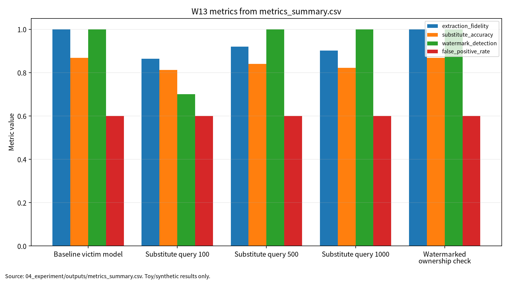

# W13 제출용 보고서

## 0. 메타정보

| 항목 | 내용 |
|---|---|
| 주차 | W13 |
| 작성자 | 박영세 |
| 학번 | 26200122 |
| 보고서 제목 | 모델 지식재산(IP)·모델 도난·모델 추출 위협 |
| 작성일 | 2026-06-23 |
| 보완일 | 2026-06-23 |
| 문서 상태 | 제출용 보고서 |
| 관련 산출물 | `03_weekly_reports/w13_model_stealing_watermarking/` |
| 실험 근거 | `04_experiment/outputs/metrics_summary.csv`, `results.json`, `run_log.md` |
## 1. 한 문장 요약

모델 추출 위험은 query budget과 extraction fidelity로, 워터마크 기반 소유권 검증은 watermark detection과 false positive rate를 함께 보아야 한다.

## 2. 학습 배경과 주차 목표

W13은 W01~W12에서 다룬 AI 보안 평가축을 모델 지식재산, 모델 도난, 모델 추출, 워터마킹, 핑거프린팅 문제로 확장하는 주차다. W12가 모델의 강건성·설명안정성·공정성을 다뤘다면, W13은 모델 자체가 경제적·기술적 자산이며, 공개 API의 query-response 정보만으로도 모델 행동이 모방될 수 있다는 점을 다룬다[1]. 또한 워터마킹은 소유권 검증 수단이 될 수 있지만, detection rate뿐 아니라 false positive, utility, robustness, query budget, 재현성을 함께 보고해야 한다[2][3][4].

학습목표는 model IP, model stealing, model extraction의 개념 정리, watermarking/fingerprinting 평가항목 이해, query budget과 extraction fidelity 관계 설명, detection과 FPR 동시 기록 필요성 설명, 모델 추출 이후 소유권 검증 프로토콜 설계다.

## 3. AI 원리 70% 정리

모델 IP는 파라미터와 구조뿐 아니라 학습 데이터, 출력 행동, 생성물 출처까지 포함한다. 모델 추출은 공개 API의 query-response 정보를 이용해 대체 문헌 model을 학습하거나 원 모델 행동을 근사하는 과정이다. 워터마킹과 핑거프린팅은 추출 이후에도 소유권 또는 출처를 검증하기 위한 기술이지만, utility와 false positive를 함께 관리해야 한다.

표 1. W13 핵심 개념과 보안 연결

| 개념 | 의미 | 보안 연결 |
|---|---|---|
| Model IP | 모델 행동과 생성물 출처까지 포함한 지식재산 | 도난·복제 위험 |
| Model extraction | query-response 쌍으로 모델 행동을 모방 | fidelity, query budget |
| Watermarking | 모델/생성물에 소유권 신호 삽입 | detection, FPR |
| Fingerprinting | 고유 행동으로 모델을 식별 | copy detection |

## 4. 보안 이슈 30% 정리

모델 도난과 모델 추출은 query-response 정보를 통해 모델 행동이나 결정경계를 모방하려는 공격군으로 분류된다[1]. Watermarking과 fingerprinting은 모델 또는 생성물에 소유권 검증 신호를 남기는 접근이지만 detection rate와 false positive를 함께 봐야 한다[2]. DNN watermarking 연구는 fidelity, robustness, capacity 사이의 trade-off를 핵심 요구조건으로 다룬다[3]. ModelShield는 모델 추출 이후에도 소유권 신호를 검출하기 위한 방어 접근을 제시한다[4]. 생성모형 보안 문헌은 모델 IP와 생성물 provenance, privacy/security risk가 함께 관리되어야 함을 보여준다[5].

| 관점 | 위협 | W13 평가 연결 |
|---|---|---|
| Confidentiality | model behavior leakage | extraction fidelity |
| Integrity | watermark removal/forgery | watermark detection |
| Availability | API query abuse | query budget |
| Accountability | ownership verification failure | false positive rate |

## 5. 논문 5편 요약

표 2. 관련 문헌 5편 요약

| ID | 문헌 | DOI/URL 상태 | 활용 |
|---|---|---|---|
| P01 | Oliynyk et al., I Know What You Trained Last Summer | DOI `10.1145/3595292` 확인 | model stealing/extraction taxonomy |
| P02 | 지정 Ye et al. / 로컬 Liang et al. LLM watermarking survey | 로컬은 arXiv:2409.00089v1, 지정 원문 확보 필요 | 보조 배경, 지정 논문처럼 인용 금지 |
| P03 | Li, Wang, Barni, DNN watermarking survey | DOI `10.1016/j.neucom.2021.07.051` 확인, 강의계획서 표기 차이 | DNN watermarking trade-off |
| P04 | Pang et al., ModelShield | DOI `10.1109/TIFS.2025.3530691` 확인 | extraction 이후 ownership check |
| P05 | 지정 후보 Chenhan Zhang et al. / 로컬 Cai et al. | DOI `10.1145/3615336` 후보 확인, 로컬 대체 문헌 원문 | 생성모형 보조 배경 |

## 6. 논문 5편 비교표

P01은 model stealing/extraction taxonomy 문헌이다. P02는 현재 LLM watermarking 대체 문헌이며, 지정 논문과 분리해야 한다. P03은 DNN watermarking 요구조건과 trade-off 문헌이다. P04는 extraction 이후 ownership check를 다루는 직접 관련 문헌이다. P05는 현재 GAN privacy/security 대체 문헌이며, 지정 논문과 분리해야 한다.

W13의 핵심 연결부는 query budget, extraction fidelity, 대체 문헌 accuracy, watermark detection, false positive rate, utility accuracy를 함께 보고하는 것이다. watermark detection이 높아도 false positive가 높으면 소유권 검증 신뢰도가 낮다. W13 toy 실험은 실제 API 공격이나 상용 모델 탈취가 아니라 synthetic query-response evaluation이다.

## 7. Research Track 분석

표 3. W13 Research Track 요약

| 항목 | 내용 |
|---|---|
| 연구문제 | query-response 기반 모델 추출 위험과 워터마크 소유권 검증 신뢰성을 어떻게 함께 평가할 것인가 |
| 대상 시스템 | 공개 API 또는 제한 인터페이스 ML/LLM/생성모형 서비스 |
| 보호 자산 | 모델 파라미터, 출력 행동, 결정경계, 워터마크, fingerprint, 생성물 출처, API 로그 |
| 평가 지표 | extraction fidelity, 대체 문헌 accuracy, query budget, watermark detection, FPR, utility accuracy |
| 제외 범위 | 실제 상용 API 공격, 무단 대량 질의, 실제 모델 탈취, 개인정보 기반 평가 |

그림 1. 모델 추출 및 워터마크 기반 소유권 검증 평가 흐름

```text
Victim Model / Public API -> Query-Response Collection -> Substitute Model Training
-> Extraction Evaluation(fidelity, accuracy, query budget)
-> Watermark / Trigger-Set Check(detection, FPR, utility)
-> Ownership Verification Report(seed, config, outputs, run_log, controls)
```

## 8. 실습 보고서

본 실습은 실제 상용 API나 실제 LLM을 대상으로 한 모델 추출 공격 재현이 아니라 W13의 핵심인 모델 IP 보안 평가축을 안전하게 설명하기 위한 최소 toy protocol이다. 따라서 synthetic binary classification과 toy logistic victim model, query-response 1NN 대체 문헌 model을 사용하되, 평가 구조는 이후 실제 model stealing, API abuse monitoring, model watermarking ownership verification에도 확장 가능하도록 query budget, extraction fidelity, 대체 문헌 accuracy, watermark detection, false positive rate, utility accuracy, reproducibility evidence로 분리하였다.

표 4. W13 실습 설계

| 항목 | 설정 |
|---|---|
| Dataset | Synthetic binary classification |
| Victim model | Toy logistic classifier with watermark trigger set |
| Substitute model | Query-response 1-nearest-neighbor classifier |
| Query budgets | 100, 500, 1000 |
| Seed | 42 |
| Outputs | `metrics_summary.csv`, `results.json`, `run_log.md` |

표 5. W13 실습 결과

| 조건 | Query Budget | Extraction Fidelity | Substitute Accuracy | Watermark Detection | False Positive Rate | Utility Accuracy |
|---|---:|---:|---:|---:|---:|---:|
| Baseline victim model | 0 | 1.000000 | 0.868000 | 1.000000 | 0.600000 | 0.868000 |
| Substitute query 100 | 100 | 0.864000 | 0.812000 | 0.700000 | 0.600000 |  |
| Substitute query 500 | 500 | 0.920000 | 0.840000 | 1.000000 | 0.600000 |  |
| Substitute query 1000 | 1000 | 0.902000 | 0.822000 | 1.000000 | 0.600000 |  |
| Watermarked ownership check | 0 | 1.000000 | 0.868000 | 1.000000 | 0.600000 | 0.868000 |

본 실험에서 watermark detection은 일부 조건에서 1.000000으로 나타났지만, false positive proxy도 0.600000으로 높게 나타났다. 이는 trigger-set 기반 소유권 검증이 detection rate만으로는 충분하지 않으며, clean control model, unrelated model, random trigger set, 복수 seed, 통계적 유의성 검정이 함께 필요함을 의미한다. 따라서 본 결과는 “소유권 검증 성공”이 아니라 “소유권 검증에는 detection rate와 false positive rate를 함께 기록해야 한다”는 교육용 근거로 해석한다.

표 6. False Positive 기반 ownership 검증 한계

| 검증 항목 | 단독 해석 위험 | 보완 지표 |
|---|---|---|
| Watermark Detection | 높으면 소유권 증거처럼 보일 수 있음 | FPR, FNR, p-value, 대조군 |
| False Positive Rate | 높으면 무관 모델도 소유 모델처럼 판단될 수 있음 | unrelated model control, random trigger control |
| Extraction Fidelity | 높으면 추출 위험을 보여주지만 ownership 증거는 아님 | query budget, utility, trigger inheritance |
| Utility Accuracy | 워터마크 삽입이 모델 성능을 해치지 않는지 확인 | clean accuracy, task score |
| Query Budget | 공격 비용과 위험 노출 범위 | rate limit, monitoring, logging |

이 결과는 synthetic binary classification 기반 toy 실험의 평가 형식 검증용 수치이며, 실제 상용 API, 실제 LLM, 실제 모델 탈취, 무단 대량 질의, 개인정보 기반 모델 추출 또는 소유권 분쟁 증거로 일반화하지 않는다.

<!-- submission-metric-chart:start -->
**그림 7. W13 metrics summary chart**



출처: `04_experiment/outputs/metrics_summary.csv`. 이 그래프는 공개 toy/synthetic 산출물 기반이며 실제 공격 성능이나 운영 환경 성능으로 일반화하지 않는다.
<!-- submission-metric-chart:end -->

## 9. AI 도구 활용 기록

AI 도구는 문헌 요약, 코드 점검, 문장 구조화, 그래프 생성 보조에 사용하였다. 모든 DOI/URL, 실험 수치, 본문 인용, 결론은 작성자가 outputs 파일과 로컬 참고문헌 검증표를 대조하여 검증한다.

**표. W13 AI 도구 활용 및 검증 기록**

| 항목 | 내용 |
|---|---|
| 사용 도구명 | Codex, ChatGPT 계열 도구 |
| 사용 일자 | 2026-06-23 |
| 사용 목적 | 문헌 요약 정리, 보고서 구조화, 안전한 toy/synthetic 실험 결과 표기 점검, 그래프 생성 보조, 제출 전 체크리스트 정리 |
| 주요 프롬프트 요약 | 주차별 제출 보고서 보완, 참고문헌 검증표 정리, metrics_summary.csv 기반 그래프 생성, AI 활용 고지 작성 |
| AI 산출물 반영 위치 | `07_week_submission/w13_submission_report.md`, `07_week_submission/assets/w13_metric_chart.png`, `05_ai_worklog/ai_disclosure_draft.md` |
| 본인 수정 내용 | 주차별 문헌 상태 확인, 실험 수치와 outputs 대조, 안전 범위와 한계 문장 확인, 최종 제출 전 미확정 문헌 분리 |
| 사실관계 검증 방법 | `01_papers/paper_list.md`, `01_papers/doi_check.md`, `05_references/doi_index.md`, 강의계획서 문헌표 대조 |
| 참고문헌 검증 방법 | 제목, 저자, 연도, 학술지/학회, DOI/URL, 본문 인용번호와 참고문헌 목록 대응 확인 |
| 실험결과 검증 방법 | `04_experiment/outputs/metrics_summary.csv`, `results.json`, `run_log.md`의 수치와 보고서 표기 대조 |
| 최종 책임 확인 | AI 산출물은 초안 보조이며 최종 제출자는 원고 내용, 인용, 실험결과, 연구윤리 책임을 확인한다. |

## 10. 토론 질문

1. Detection이 1.000000이어도 FPR이 0.600000이면 소유권 검증 기준은 어떻게 설정해야 하는가?
2. Query budget을 보고할 때 공격 재현성과 악용 방지 사이의 균형은 어디에 둘 것인가?
3. P02/P05처럼 대체 문헌 원문가 있을 때 최종 참고문헌 검증표에는 무엇을 남겨야 하는가?

## 11. 기말논문 연결

추천 주제는 “모델 추출 이후 소유권 검증을 위한 다중지표 평가 프레임워크 연구”이다. 핵심 기여는 query budget, extraction fidelity, 대체 문헌 accuracy, watermark detection, false positive rate, utility accuracy, reproducibility evidence를 같은 표에서 보고하는 구조다.

## 12. KCI 논문 형식 전환

표 7. KCI 논문 제목 후보

| 번호 | 국문 제목 후보 | 영문 제목 후보 | 대상 시스템 | 보안 위협 | 연구방법 | 예상 기여 |
|---:|---|---|---|---|---|---|
| 1 | 모델 추출 이후 소유권 검증을 위한 다중지표 평가 프레임워크 연구 | A Multi-Metric Evaluation Framework for Ownership Verification After Model Extraction | ML/LLM API 모델 | model extraction, watermark forgery | 문헌분석 + synthetic toy 실험 | fidelity·detection·FPR 통합 평가표 |
| 2 | Query Budget이 모델 추출 유사도와 워터마크 검출률에 미치는 영향 분석 | An Analysis of the Impact of Query Budget on Model Extraction Fidelity and Watermark Detection | 공개 API 기반 모델 | query-response extraction | toy 대체 문헌 model 실험 | query budget 기반 위험 평가 |
| 3 | 모델 워터마킹 기반 소유권 검증에서 False Positive Rate의 영향 연구 | A Study on the Impact of False Positive Rate in Model Watermark-Based Ownership Verification | watermarked ML model | false ownership claim, watermark forgery | trigger-set toy evaluation | FPR 중심 ownership 검증 한계 분석 |

추천 최종 제목은 “모델 추출 이후 소유권 검증을 위한 다중지표 평가 프레임워크 연구”이다. 국문초록은 모델 IP 보호와 소유권 검증을 위해 query budget, extraction fidelity, 대체 문헌 accuracy, watermark detection, FPR, utility accuracy, reproducibility evidence를 통합하는 평가 프레임워크를 제안하는 방향으로 구성한다.

## 13. SCI 논문 형식 전환

SCI 제목 후보는 “A Multi-Metric Evaluation Framework for Model Extraction Risk and Watermark-Based Ownership Verification”이다. Structured Abstract는 Background, Problem, Method, Results, Contribution, Implications로 구성한다.

표 8. SCI Related Work 축

| 연구축 | 대표 논문 | 역할 |
|---|---|---|
| Model stealing taxonomy | Oliynyk et al. | model stealing/extraction 공격·방어 분류 |
| Watermarking/fingerprinting | Ye et al. 또는 현재 P02 지정 논문 | deep learning model watermarking/fingerprinting, 원문 확보 필요 |
| DNN watermarking | Li, Wang, Barni 또는 현재 P03 | fidelity, robustness, capacity, ownership verification |
| ModelShield | Pang et al. | extraction 이후 adaptive robust watermark 검증 |
| GAN attack/defense 또는 private/security GAN | Zhang et al. 또는 현재 P05 지정 논문 | 생성모형 IP·privacy·misuse 보조 배경 |

Discussion의 핵심은 false positive proxy 0.600000이 trigger-set evidence를 약하게 만들며, unrelated model control, random trigger control, multiple seeds, statistical testing이 필요하다는 점이다.

## 14. 발표용 요약

발표 메시지는 세 문장이다. 첫째, API 뒤의 모델도 query-response 정보로 행동이 모방될 수 있다. 둘째, watermark detection이 높아도 false positive가 높으면 소유권 증거는 약하다. 셋째, 모델 IP 보호는 fidelity, detection, FPR, utility, query budget, reproducibility를 함께 보고하는 평가 문제다.

## 15. 참고문헌 검증표

| 번호 | 참고문헌 | DOI/URL | 상태 |
|---|---|---|---|
| [1] | Oliynyk et al., I Know What You Trained Last Summer | `10.1145/3595292` | 확인 완료 |
| [2] | Ye et al., A Survey of Watermarking and Fingerprinting Techniques for Deep Learning Models | 확인 필요 | 현재 P02는 대체 문헌 원문 |
| [3] | Li, Wang, Barni, A survey of Deep Neural Network watermarking techniques | `10.1016/j.neucom.2021.07.051` | DOI 확인, 강의계획서 표기 차이 확인 필요 |
| [4] | Pang et al., ModelShield | `10.1109/TIFS.2025.3530691` | 확인 완료 |
| [5] | Zhang et al., Generative Adversarial Networks: A Survey on Attack and Defense Perspective / 로컬 Cai et al. 대체 문헌 | `10.1145/3615336` 후보 확인 | 로컬 PDF 불일치 |

PDF 원문은 로컬 파일로 보존하되 Git 추적은 해제했다. 공개 GitHub 저장소에는 원칙적으로 PDF 원문 대신 DOI/URL, 서지정보, 요약만 남기는 정책을 적용한다.

## 16. 자기 점검표

| 점검 항목 | 상태 | 비고 |
|---|---|---|
| 1장 한 문장 요약 작성 | 완료 |  |
| 2장 학습 배경과 주차 목표 작성 | 완료 |  |
| AI 원리 70% 정리 | 완료 |  |
| 보안 이슈 30% 정리 | 완료 |  |
| 논문 5편 요약 | 완료 / 확인 필요 | DOI/원문 세부 대조 필요 |
| 논문 5편 비교표 보완 | 완료 / 확인 필요 | P02/P05 대체 문헌 원문 상태 반영 |
| Research Track 5요소 작성 | 완료 | 연구문제, 위협모형, 평가방법, 재현성, 오픈문제 |
| P01 공식 DOI 검증 | 완료 | PDF DOI 10.1145/3595292 대조 |
| P02 지정 논문 원문 확보 | 확인 필요 | 현재 대체 문헌 원문 |
| P03 DOI/URL 검증 | 완료 / 확인 필요 | DOI 확인, 저자명/제목 차이 확인 필요 |
| P04 IEEE TIFS DOI 검증 | 완료 | arXiv/출판판 대조 |
| P05 지정 논문 원문 확보 | 확인 필요 | 현재 대체 문헌 원문 |
| 실험 outputs 파일 존재 확인 | 완료 |  |
| 실험 결과와 보고서 수치 일치 | 완료 |  |
| false positive 해석 보완 | 완료 | 0.600000 한계 명시 |
| KCI 논문 형식 전환 작성 | 완료 |  |
| SCI 논문 형식 전환 작성 | 완료 |  |
| 본문 인용과 참고문헌 대응 | 완료 / 확인 필요 | P02/P05 원문 확인 필요 |
| 표·그림 번호 정리 | 완료 |  |
| AI 활용 고지 작성 | 완료 |  |
| PDF 저작권 위험 점검 | 완료 / 조치 필요 |  |
| 최종 사람이 검토할 항목 표시 | 완료 | 제출 확정 아님 |

<!-- AUTO-WEEKLY-AI-DISCLOSURE-NOTE:start -->
## AI 활용 고지 확인

본 주차 보고서에서 생성형 AI는 영어 논문 요약 초안, 수식 설명, 표 구조화, 문장 교정에 사용하였다. 최종 인용, 수치, 실험 결과, 보안적 해석은 작성자가 직접 검토하였다.
<!-- AUTO-WEEKLY-AI-DISCLOSURE-NOTE:end -->
