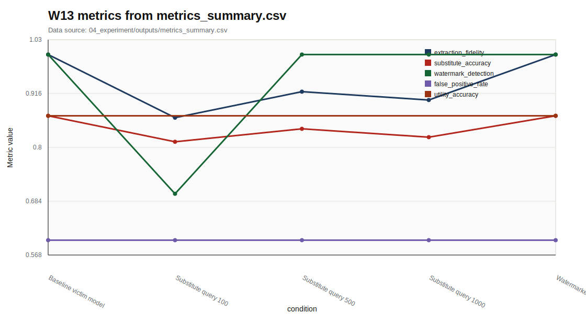

# W13 Model Stealing & Watermarking

Research Question: Model Stealing & Watermarking에서 성능 지표와 보안 지표를 어떻게 분리해 평가할 수 있는가?

---

## Core Formula

### Model Extraction Query Objective

$$
\min_{\hat{\theta}}\frac{1}{|Q|}\sum_{x\in Q}\ell(f_{\hat{\theta}}(x), f_{\theta^\star}(x))
$$

| 기호 | 의미 |
|---|---|
| `f_{\theta^\star}` | target model |
| `f_{\hat{\theta}}` | substitute model |
| `Q` | 허용된 toy query set |
| `\ell` | target output과 substitute output 차이 |

- 직관적 의미: Extraction 평가는 query로 얻은 출력에 substitute model을 얼마나 맞추는지 보는 문제로 표현할 수 있다.
- 보안적 의미: 보안 관점에서는 query budget, fidelity, watermark detection을 함께 본다.
- 평가 지표 연결: extraction_fidelity, substitute_accuracy, query_budget와 연결한다.
- 한계: 허가된 toy setting 설명이며 무단 API 수집 절차가 아니다.

---

## Threat Model

- Diagram: model extraction and watermark audit flow
- Stages: Query Budget, Substitute, Fidelity Eval, Watermark Test, FP/FN Review
- 안전 범위: public, synthetic, toy, local evaluation

---

## Evaluation Protocol

- Metrics: extraction_fidelity, substitute_accuracy, watermark_detection, false_positive_rate, utility_accuracy
- 데이터 출처: `04_experiment/outputs/metrics_summary.csv`

| condition | extraction_fidelity | substitute_accuracy | watermark_detection | false_positive_rate | utility_accuracy |
| --- | --- | --- | --- | --- | --- |
| Baseline victim model | 1 | 0.868 | 1 | 0.6 | 0.868 |
| Substitute query 100 | 0.864 | 0.812 | 0.7 | 0.6 |  |
| Substitute query 500 | 0.92 | 0.84 | 1 | 0.6 |  |
| Substitute query 1000 | 0.902 | 0.822 | 1 | 0.6 |  |
| Watermarked ownership check | 1 | 0.868 | 1 | 0.6 | 0.868 |

---

## Figure-first Result

그래프는 extraction_fidelity, substitute_accuracy, watermark_detection, false_positive_rate, utility_accuracy를 조건별로 비교한다. Watermark detection은 utility loss와 false positive risk를 함께 보아야 한다. 수치는 output CSV 그대로다.

---

## Paper Map

| ID | 논문 역할 | 발표에서 쓰는 위치 | 기말논문 연결 |
|---|---|---|---|
| P01 | 핵심 이론 | Background / Core Formula | Model Stealing & Watermarking의 관련연구 뼈대 |
| P02 | 위협 분류 | Threat Model | 공격자·방어자·보호자산 정의 |
| P03 | 평가 지표 | Evaluation Protocol | 정량 지표와 로그 근거 연결 |
| P04 | 공격·방어 사례 | Security Implication | 보안적 함의와 방어 한계 |
| P05 | 재현성·정책 근거 | Limitation | 확인 필요 항목과 제출 전 검증 |

---

## Limitation

- model extraction은 방어 평가 관점의 toy query objective로만 설명한다.
- 원문 DOI/URL과 formal guarantee는 최종 제출 전 확인 필요.
- 실제 운영 시스템 악용 절차나 무단 API 질의 절차는 포함하지 않음.

---

## Final Takeaway

W13의 핵심은 `extraction_fidelity, substitute_accuracy, watermark_detection, false_positive_rate, utility_accuracy`를 성능·보안·재현성 근거로 분리해 기말논문의 평가방법에 연결하는 것이다.
