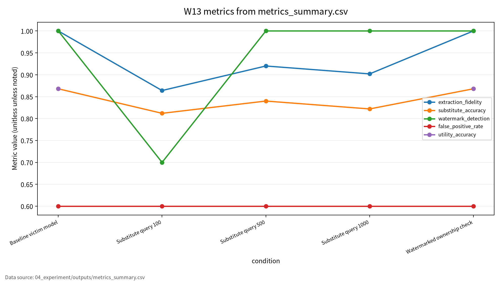
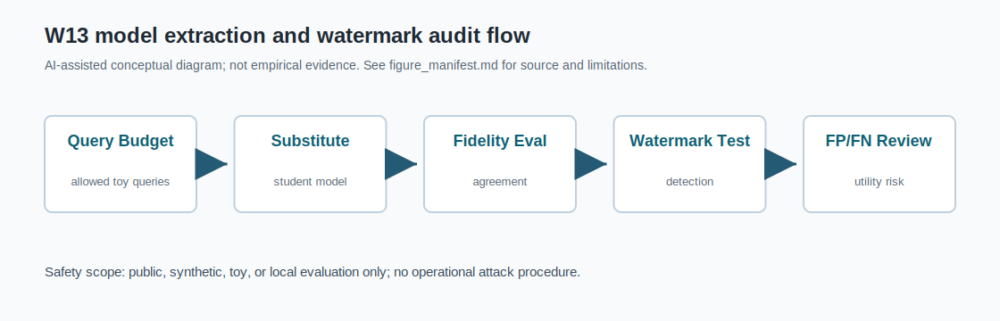

# W13 모델 지식재산·모델 도난·모델 추출 위협

모델 추출 위험은 fidelity로, 소유권 검증은 detection과 false positive를 함께 본다.

---

## 오늘의 질문

- API 뒤에 있는 모델도 훔쳐질 수 있는가?
- query-response만으로 얼마나 비슷한 모델을 만들 수 있는가?
- 워터마크 검출률이 높으면 소유권 증거로 충분한가?

---

## 문헌 5편의 상태

| 문헌 | 역할 | 검증 상태 |
|---|---|---|
| P01 | model stealing taxonomy | DOI `10.1145/3595292` 확인 |
| P02 | watermarking/fingerprinting | 현재 LLM watermarking SUBSTITUTE |
| P03 | DNN watermarking trade-off | DOI `10.1016/j.neucom.2021.07.051` 확인, 표기 차이 |
| P04 | ModelShield | DOI `10.1109/TIFS.2025.3530691` 확인 |
| P05 | GAN attack/defense | 현재 GAN privacy/security SUBSTITUTE |

---

## AI 원리 70%

- Model IP는 파라미터, 행동, 생성물 출처를 포함한다.
- Model extraction은 query-response로 substitute model을 학습한다.
- Fidelity는 victim과 substitute의 출력 일치율이다.
- Watermark/fingerprint는 소유권 검증 신호다.

---

## 보안 이슈 30%

- Confidentiality: 모델 행동 유출
- Integrity: 워터마크 제거·위조
- Availability: query abuse
- Accountability: false positive/false negative

---

## Toy 실험 설계

| 항목 | 설정 |
|---|---|
| 데이터 | synthetic binary classification |
| Victim | toy logistic classifier |
| Substitute | query-response 1NN classifier |
| Query budgets | 100, 500, 1000 |
| Watermark | 20개 trigger-set signature |

---

## 실험 결과

| 조건 | Fidelity | Accuracy | Detection | FPR |
|---|---:|---:|---:|---:|
| Query 100 | 0.864000 | 0.812000 | 0.700000 | 0.600000 |
| Query 500 | 0.920000 | 0.840000 | 1.000000 | 0.600000 |
| Query 1000 | 0.902000 | 0.822000 | 1.000000 | 0.600000 |

Baseline victim utility accuracy: 0.868000

---

## False Positive 해석

- detection이 1.000000이어도 FPR이 0.600000이면 소유권 증거가 약하다.
- clean control, unrelated model, random trigger, multiple seeds가 필요하다.
- 본 결과는 “소유권 검증 성공”이 아니라 “FPR을 함께 기록해야 한다”는 교육용 근거다.

---

## 안전 범위

- 실제 API 공격 아님
- 실제 LLM 또는 상용 모델 탈취 아님
- 무단 대량 질의 없음
- 개인정보 기반 평가 없음

---

## 기말논문 연결

- 모델 추출 이후 소유권 검증을 위한 다중지표 평가 프레임워크
- 지표: fidelity, query cost, detection, FPR, utility, reproducibility
- W14/W15와 연결해 운영 로그와 연구윤리까지 확장

---

## 결론

모델 IP 보호 평가는 공격 성공률 하나로 끝나지 않는다.  
fidelity, detection, false positive, utility, 재현성을 함께 보고해야 한다.

<!-- formula-visual-supplement:start -->
# 수식·그래프·그림 보강

- 보강 일자: 2026-06-23
- 수식은 표준 정의식 또는 검증 가능한 평가식으로만 작성했다.
- 그래프는 `04_experiment/outputs/metrics_summary.csv`의 기존 수치만 사용했다.
- 다이어그램은 AI-assisted conceptual diagram이며 사실 자료나 실험 결과처럼 해석하지 않는다.

### 핵심 수식: Model Extraction Query Objective

$$
\min_{\hat{\theta}}\frac{1}{|Q|}\sum_{x\in Q}\ell(f_{\hat{\theta}}(x), f_{\theta^\star}(x))
$$

| 기호 | 의미 |
|---|---|
| `f_{\theta^\star}` | target model |
| `f_{\hat{\theta}}` | substitute model |
| `Q` | 허용된 toy query set |
| `\ell` | target output과 substitute output 차이 |

**직관적 의미:**  
Extraction 평가는 query로 얻은 출력에 substitute model을 얼마나 맞추는지 보는 문제로 표현할 수 있다.

**보안 관점 해석:**  
보안 관점에서는 query budget, fidelity, watermark detection을 함께 본다.

**평가 지표 연결:**  
extraction_fidelity, substitute_accuracy, query_budget와 연결한다.

**한계와 가정:**  
허가된 toy setting 설명이며 무단 API 수집 절차가 아니다.

### 핵심 수식: Watermark Detection Rate, FPR/FNR, Utility Loss

$$
TPR=\frac{TP}{TP+FN},
\qquad
FPR=\frac{FP}{FP+TN},
\qquad
\Delta U=U_{base}-U_{protected}
$$

| 기호 | 의미 |
|---|---|
| `TP,FP,TN,FN` | 탐지 혼동행렬 항목 |
| `TPR` | watermark detection rate |
| `FPR` | false positive rate |
| `\Delta U` | 보호 적용 후 utility loss |

**직관적 의미:**  
Watermark는 탐지만 높으면 충분하지 않고 false positive와 utility 손실을 함께 봐야 한다.

**보안 관점 해석:**  
오탐이 높으면 정상 모델을 잘못 침해로 판단할 위험이 있다.

**평가 지표 연결:**  
watermark_detection, false_positive_rate, utility_accuracy와 연결한다.

**한계와 가정:**  
toy watermark audit이며 법적 소유권 판단을 자동화하지 않는다.

### 표 수치 기반 그래프

그래프는 extraction_fidelity, substitute_accuracy, watermark_detection, false_positive_rate, utility_accuracy를 조건별로 비교한다. Watermark detection은 utility loss와 false positive risk를 함께 보아야 한다. 수치는 output CSV 그대로다.

### Threat Model / Pipeline Diagram

이 다이어그램은 `model extraction and watermark audit flow`를 발표용으로 요약한 개념도다. 데이터 흐름, 평가 지표, 한계 표시는 `assets/figure_manifest.md`에도 기록했다.

### 확인 필요

- model extraction은 방어 평가 관점의 toy query objective로만 설명한다.
- 논문별 원문 절·쪽·그림 번호는 최종 제출 전 사람 검토가 필요하다.
<!-- formula-visual-supplement:end -->
