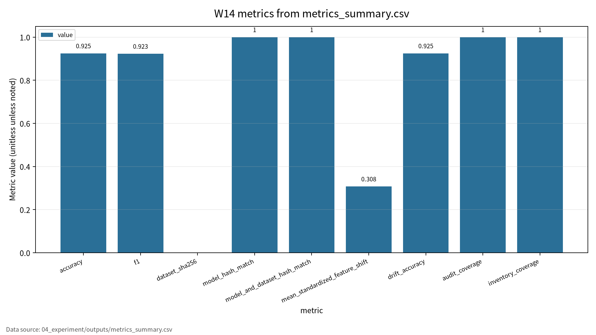
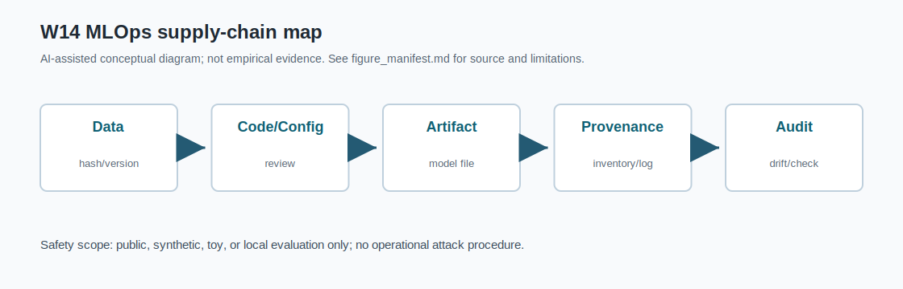

# W14 MLOps/DevOps·데이터/모델 파이프라인·공급망 보안 통합보고서

## 0. 메타정보

| 항목 | 내용 |
|---|---|
| 주차 | W14 |
| 주제 | MLOps/DevOps·데이터/모델 파이프라인·공급망 보안 |
| 문서 상태 | 제출용 최종 초안 |
| 작성일 | 2026-06-23 |
| 실험 실행일 | 2026-06-22 |
| 실험 근거 | `04_experiment/outputs/run_log.md`, `metrics_summary.csv`, `results.json` |
| 주의 | 최종 제출 확정 전 사람이 참고문헌, PDF 저작권, 수치, 인용을 재검토해야 함 |

## 1. 한 문장 요약

W14는 ML 모델을 연구실 결과가 아니라 운영 파이프라인의 산출물로 보고, dataset hash, config hash, model hash, drift score, audit coverage, artifact inventory, re-run consistency를 함께 남겨야 운영형 AI 시스템의 공급망 보안과 재현성을 설명할 수 있음을 정리한다[1][2].

## 2. 학습 배경과 주차 목표

### 2.1 이번 주 주제의 위치

W14는 W01~W13에서 다룬 AI 모델 단위의 보안 평가를 운영형 AI 시스템과 공급망 보안으로 확장하는 주차다. W13이 모델 IP와 모델 추출을 다루었다면, W14는 모델이 실제 서비스가 되기 위해 거치는 데이터 수집, feature engineering, 학습 코드, config, model registry, deployment, monitoring, rollback, audit log 전 과정을 다룬다. 핵심은 AI 보안이 모델 성능만으로 설명되지 않으며, dataset hash, config hash, model hash, drift score, audit coverage, artifact inventory 같은 evidence set이 함께 필요하다는 점이다.

### 2.2 강의계획서상 학습목표

- MLOps/DevOps, data/model pipeline, monitoring, drift detection의 기본 구조를 정리한다.
- ML supply chain, data pipeline poisoning, model artifact tampering, deployment/update/logging attack surface를 분류한다.
- 연구용 ML 실험과 운영형 ML 시스템 사이의 보안·재현성 격차를 설명한다.
- AI BOM/ML artifact inventory와 audit evidence set을 설계한다.
- Drift monitoring, rollback, human review, artifact verification의 관계를 이해한다.

### 2.3 이번 주 핵심 질문

1. 연구용 ML 실험을 운영형 AI 시스템으로 배포할 때 어떤 보안 자산이 추가되는가?
2. Dataset hash, config hash, model hash는 각각 어떤 보안 통제에 대응하는가?
3. Drift score가 threshold를 넘으면 어떤 human review 또는 rollback 절차가 필요한가?
4. AI BOM/ML artifact inventory에는 어떤 항목이 최소로 포함되어야 하는가?
5. W14의 synthetic toy pipeline을 KCI 또는 SCI 논문 주제로 발전시키려면 어떤 연구문제가 적절한가?

## 3. AI 원리 70% 정리

MLOps는 ML, software engineering, data engineering, operations를 연결하는 생명주기 관리 방식이다. DevOps가 코드의 빌드와 배포 자동화에 초점을 둔다면, MLOps는 데이터와 모델이 계속 바뀐다는 특성 때문에 dataset version, feature pipeline, model registry, experiment tracking, drift monitoring, rollback, governance를 추가로 요구한다[1]. Production ML deployment 연구는 연구용 모델과 실제 운영 workflow 사이의 반복적인 격차를 보여준다[2]. AIOps 연구는 telemetry 기반 anomaly detection, incident response, root-cause analysis가 운영형 AI 관리에 필요함을 보여준다[3].

표 1. W14 핵심 개념과 보안 연결

| 개념 | W14에서의 의미 | 보안 연결 |
|---|---|---|
| MLOps lifecycle | 데이터 준비, 학습, 검증, artifact 등록, 배포, monitoring, 재학습의 반복 구조 | lifecycle 단계별 보호 자산 정의 |
| Data/model pipeline | 데이터와 모델 산출물이 어떤 config, seed, code, 환경에서 만들어졌는지 추적 | provenance, reproducibility |
| Model registry | 모델 artifact와 metadata를 등록·배포하는 지점 | artifact tampering, access control |
| Monitoring/drift | 운영 입력과 출력 분포가 기준과 달라졌는지 감시 | drift 미탐지, rollback 판단 |
| AIOps | 운영 telemetry를 이용해 incident detection, failure prediction, RCA, response를 보조 | 로그 보호, incident response |
| Edge deployment | AI가 cloud 밖 edge node/device로 확장되는 배포 형태 | 분산 update, edge artifact drift |

Edge AI deployment는 latency, bandwidth, device resource, distributed update 문제를 추가한다[4]. Deep learning for software engineering 연구는 AI가 개발 pipeline 내부로 들어오면서 software supply chain과 ML supply chain이 결합됨을 보여준다[5].

## 4. 보안 이슈 30% 정리

W14의 보안 이슈는 공격 절차 재현이 아니라 운영 파이프라인의 보호 자산과 통제항목 정의다. 핵심 위협은 데이터 파이프라인 오염, 모델 artifact 변조, 의존성 취약점, 무단 update, drift 미탐지, 로그 누락 또는 로그 노출이다.

그림 1. MLOps 공급망 보안 evidence flow

```text
Dataset / Feature Pipeline
        |
        v
Training Code + Config + Seed
        |
        v
Model Artifact
        |
        v
Registry / Deployment
        |
        v
Monitoring / Drift Detection
        |
        v
Audit Log / Artifact Inventory
        |
        v
Evidence Set
Dataset Hash, Config Hash, Model Hash, Drift Score,
Audit Coverage, Inventory Coverage, Re-run Consistency
```

## 5. 논문 5편 요약

표 2. 관련 문헌 5편 요약

| ID | 논문 | 핵심 역할 | DOI/URL 검증 상태 |
|---|---|---|---|
| P01 | Eken et al., `A Multivocal Review of MLOps Practices, Challenges and Open Issues` | MLOps practice, lifecycle, governance, artifact management | 부분 확인. 수업자료 제목/저자명과 DOI 기준 제목/저자명 차이 |
| P02 | Paleyes et al., `Challenges in Deploying Machine Learning: A Survey of Case Studies` | 연구용 모델과 production deployment workflow의 격차 설명 | 확인. 단 Article 번호 ACM 페이지 재확인 필요 |
| P03 | Diaz-de-Arcaya et al., MLOps/AIOps systematic survey | monitoring, incident response, AIOps taxonomy 연결 | 부분 확인. 수업자료 제목과 DOI 메타데이터 제목 차이, 로컬 PDF 대체 |
| P04 | Chen and Ran, `Deep Learning With Edge Computing: A Review` | edge deployment의 latency, privacy, resource, update 제약 설명 | DOI/권호/페이지 확인, 로컬 PDF 대체 |
| P05 | Yang, Xia, Lo, Grundy, `A Survey on Deep Learning for Software Engineering` | AI-assisted software engineering과 DevOps/MLOps pipeline 연결 | 부분 확인. 수업자료의 Xiang Chen 표기 확인 필요 |

P03/P04/P05는 로컬 PDF가 대체문헌이므로 지정 논문처럼 인용하지 않는다. P01도 수업자료의 `Bayram Eken` 표기와 DOI/arXiv/로컬 PDF의 `Beyza Eken` 표기가 다르므로 최종 참고문헌에서 재확인한다.

## 6. 논문 5편 비교표

P01은 MLOps lifecycle과 governance 구조 문헌이다. P02는 production deployment challenge 문헌이다. P03은 AIOps, monitoring, incident response 문헌이다. P04는 edge deployment와 분산 artifact/update 관리 문헌이다. P05는 software engineering pipeline 내부의 DL/AI 활용 문헌이다.

| 논문 | 차별성 | 내 논문 활용 |
|---|---|---|
| P01 | MLOps practice와 adoption challenge를 lifecycle/governance 관점에서 통합 | MLOps 보안통제 프레임워크의 상위 구조 |
| P02 | production ML deployment workflow에서 반복되는 현실적 난점 제시 | 연구용/운영용 ML 격차 설명 |
| P03 | AIOps telemetry, incident detection, RCA, response를 운영 감시 관점으로 연결 | monitoring, incident response, auditability 근거 |
| P04 | cloud-edge-device 제약과 분산 update 문제를 보여줌 | edge 배포 환경의 공급망 통제 필요성 |
| P05 | AI-assisted SE가 software pipeline과 ML pipeline을 결합시키는 지점 제시 | AI 개발 자동화 도구의 감사·재현성 요구 |

W14의 핵심 연결부는 `data/model/config/log/artifact` traceability와 AI BOM/ML artifact inventory다. W14 toy 실험은 실제 registry, CI/CD, Kubernetes, package scanner, production telemetry를 구현하지 않은 local synthetic pipeline이다.

## 7. Research Track 분석

표 3. W14 Research Track 요약

| 항목 | 내용 |
|---|---|
| 연구문제 | MLOps 파이프라인에서 보안 위협을 어떻게 분류하고, 어떤 evidence로 재현성과 책임성을 보장할 것인가 |
| 대상 시스템 | MLOps 기반 ML 서비스 파이프라인 |
| 보호 자산 | dataset, feature pipeline, training code, config, seed, model artifact, registry, deployment setting, logs, monitoring telemetry |
| 공격자 | insider, external attacker, supply-chain attacker, malicious package provider, misconfigured operator |
| 공격 능력 | dataset poisoning, artifact tampering, dependency compromise, unauthorized update, log manipulation, drift concealment |
| 방어/점검 | dataset hash, config hash, model hash, artifact inventory, audit log, drift monitoring, human approval, rollback plan |
| 제외 범위 | 실제 운영 서비스 침해, 개인정보 사용, 악성 패키지 배포, 무단 시스템 접근 |

## 8. 실습 보고서

표 4. W14 실습 설계

| Item | Description |
|---|---|
| Dataset | Synthetic MLOps binary classification |
| Train/Test samples | 320 / 160 |
| Feature count | 5 |
| Model | Toy logistic regression |
| Drift shift | 0.60 |
| Drift threshold | 0.25 |
| Seed | 42 |
| Output files | metrics_summary.csv, results.json, run_log.md, model_artifact.json, artifact_inventory.json, audit_log.jsonl |

표 5. W14 실습 결과

| 점검 항목 | 측정 지표 | 결과 | 보안 의미 |
|---|---|---:|---|
| Baseline model | Accuracy | 0.925000 | 정상 조건 기준 성능 |
| Baseline model | F1 | 0.923077 | 정상 조건 분류 균형 |
| Data versioning | Dataset hash | `sha256:b9e597bccdbde442` | 데이터 무결성 기준점 |
| Model artifact verification | Model hash match | true | 모델 아티팩트 변조 탐지 기준 |
| Re-run consistency | Model/data hash match | true | 동일 config/seed 재실행 가능성 |
| Drift monitoring | Mean standardized feature shift | 0.307626 | 입력 분포 변화 감시 |
| Drifted model | Accuracy under drift | 0.925000 | 분포 변화 조건 성능 |
| Log audit | Audit coverage | 1.000000 | toy 필수 로그 필드 보존률 |
| Artifact inventory | Inventory coverage | 1.000000 | toy AI BOM/ML artifact inventory 최소 항목 충족률 |

### Drift score 해석 보완

본 실험의 drift score는 synthetic 기준 데이터와 drifted 데이터의 평균 표준화 feature shift이다. 이 값은 실제 운영 장애나 공격 성공률을 의미하지 않는다. 다만 drift score가 threshold 0.25를 초과하면 운영형 AI 시스템에서 human review, rollback 검토, 추가 데이터 검증, model performance 재평가가 필요하다는 감시 신호로 해석한다.

표 6. MLOps Evidence Set 해석

| Evidence 항목 | 의미 | 보안 연결 | 한계 |
|---|---|---|---|
| Dataset hash | 데이터 버전의 무결성 기준점 | 데이터 오염·변조 탐지 | 데이터 품질 자체를 보장하지는 않음 |
| Config hash | 실험·학습 설정의 재현성 기준점 | 설정 변조 탐지 | 외부 의존성 버전까지 포함 필요 |
| Model hash | 모델 artifact 변경 탐지 | 모델 변조 탐지 | 모델 행동 의미를 설명하지는 않음 |
| Drift score | 운영 입력 분포 변화 감시 | drift 미탐지 방지 | 원인 분석·대응 결정은 별도 필요 |
| Audit coverage | 필수 로그 필드 보존률 | 책임추적성 | 로그 품질·진실성을 보장하지는 않음 |
| Inventory coverage | AI BOM/ML artifact inventory 최소 항목 충족률 | 공급망 가시성 | SBOM, license, vulnerability scan 확장 필요 |

표 7. AI BOM / ML Artifact Inventory 확장 항목

| 범주 | 필수 항목 | W14 toy 실험 반영 | 운영 확장 필요 |
|---|---|---|---|
| Dataset | dataset name, version, hash, source, license, personal data flag | 일부 반영 | data card, lineage, consent, retention |
| Feature pipeline | feature code version, transformation hash | 미반영 | feature store lineage |
| Training code | git commit, source hash, environment | 일부 반영 필요 | signed build, branch protection |
| Config | config hash, hyperparameters, seed | 반영 | config approval workflow |
| Model artifact | model hash, model type, metric, registry path | 반영 | model card, signature, registry ACL |
| Dependency | package list, container image digest | 미반영 | SBOM, vulnerability scan |
| Deployment | deployment version, endpoint, rollout policy | 미반영 | canary, rollback, approval gate |
| Monitoring | drift score, threshold, telemetry schema | 일부 반영 | alerting, incident response |
| Audit | run log, audit log, approval record | 일부 반영 | immutable log, access log |

이 결과는 synthetic MLOps toy pipeline 기반 평가 형식 검증용 수치이며, 실제 model registry, CI/CD, Kubernetes, package vulnerability scanner, production telemetry, 실제 기업 공급망 보안 수준으로 일반화하지 않는다.

## 9. AI 도구 활용 기록

Codex를 사용해 공통 지침 확인, W14 프롬프트 적용, 로컬 PDF 첫 페이지 대조, DOI 메타데이터 조회 보조, synthetic toy pipeline 코드 점검과 실행, 보고서·제출본·발표자료 보완을 수행했다. AI 산출물은 초안이며 최종 내용, 인용, 실험결과, 연구윤리 책임은 제출자에게 있다.

## 10. 토론 질문

1. AI BOM/ML artifact inventory에는 dataset, model, config, log 외에 어떤 항목이 반드시 들어가야 하는가?
2. Drift score가 threshold를 넘었을 때 자동 rollback과 human review 중 무엇을 우선해야 하는가?
3. Audit coverage 1.000000이 실제 감사 완전성을 의미하지 않는다면, 운영 환경에서는 어떤 추가 로그 품질 지표가 필요한가?
4. P03/P04/P05처럼 로컬 PDF가 대체문헌일 때 보고서 인용은 어디까지 허용되는가?

## 11. 기말논문 연결

W14는 기말 논문의 관련연구, 연구방법, 분석/실험, 보안적 함의 장에 반영할 수 있다. 특히 "운영형 AI 시스템 보안을 위한 최소 evidence set"으로 dataset hash, model hash, config hash, drift score, audit coverage, artifact inventory를 제안하는 근거가 된다.

## 12. KCI 논문 형식 전환

표 8. KCI 논문 제목 후보

| 번호 | 국문 제목 후보 | 영문 제목 후보 | 대상 시스템 | 보안 위협 | 연구방법 | 예상 기여 |
|---:|---|---|---|---|---|---|
| 1 | 운영형 AI 시스템 보안을 위한 MLOps Evidence Set 평가 프레임워크 연구 | An Evaluation Framework of MLOps Evidence Sets for Operational AI System Security | MLOps 기반 AI 서비스 | artifact tampering, drift, audit gap | 문헌분석 + synthetic pipeline 실험 | evidence set 평가표 |
| 2 | AI 공급망 보안에서 Dataset·Config·Model Hash와 Audit Log의 역할 분석 | An Analysis of Dataset, Config, Model Hashes and Audit Logs in AI Supply Chain Security | ML pipeline | data poisoning, model tampering | toy pipeline + 체크리스트 | hash/audit 기반 통제 |
| 3 | AI BOM 기반 MLOps 공급망 보안과 재현성 평가체계 연구 | A Study on AI BOM-Based MLOps Supply Chain Security and Reproducibility Evaluation | AI BOM/ML artifact inventory | dependency risk, model update risk | 문헌분석 + inventory 설계 | AI BOM 최소 항목 제안 |

추천 최종 제목은 `운영형 AI 시스템 보안을 위한 MLOps Evidence Set 평가 프레임워크 연구`다. 본 연구는 운영형 AI 시스템의 보안성과 재현성을 평가하기 위한 MLOps evidence set 프레임워크를 제안한다. 실제 개인정보나 운영 서비스를 사용하지 않고 synthetic MLOps toy pipeline을 구성하여 toy logistic regression 모델의 baseline accuracy, F1, drift score, audit coverage, inventory coverage를 기록한다. 본 연구는 실제 기업 공급망 보안 수준을 주장하지 않고, 운영형 AI 시스템에서 최소한으로 남겨야 할 evidence set과 AI BOM/ML artifact inventory 구조를 제시하는 데 목적이 있다.

연구문제는 RQ1 운영형 AI 시스템 보안 평가를 위해 최소한 어떤 evidence set이 필요한가, RQ2 dataset/config/model hash는 데이터 오염과 모델 변조 탐지에 어떤 역할을 하는가, RQ3 drift score와 audit coverage는 운영 중 모델 위험 감시에 어떤 정보를 제공하는가, RQ4 AI BOM/ML artifact inventory를 실제 MLOps governance에 적용하려면 어떤 항목을 확장해야 하는가로 정리한다.

## 13. SCI 논문 형식 전환

SCI 제목 후보는 `An Evidence-Set Framework for MLOps Supply-Chain Security and Reproducibility in Operational AI Systems`다.

### 13.1 Structured Abstract

Background: Operational AI systems depend on data pipelines, training code, configurations, model artifacts, registries, deployment settings, monitoring telemetry, and audit logs. Security evaluation must therefore extend beyond model accuracy.

Problem: Many AI security evaluations focus on model performance but underreport artifact integrity, configuration traceability, drift monitoring, audit completeness, and AI BOM coverage. This weakens reproducibility and supply-chain assurance.

Method: This study synthesizes five representative studies on MLOps practices, ML deployment challenges, MLOps/AIOps taxonomy, edge deployment, and deep learning for software engineering. A safe synthetic toy pipeline is used to record dataset hash, config hash, model hash, drift score, audit coverage, inventory coverage, and re-run consistency.

Results: The W14 toy pipeline records baseline accuracy 0.925000, F1 0.923077, dataset/model/config hashes, drift score 0.307626, audit coverage 1.000000, inventory coverage 1.000000, and re-run consistency true. These results should not be interpreted as enterprise-level MLOps security, but as an example of evidence-set reporting.

Contribution: The main contribution is a multi-evidence reporting structure that integrates model utility, artifact integrity, drift monitoring, auditability, inventory coverage, and reproducibility evidence.

Implications: The framework can be extended to AI BOM, SBOM, model registry governance, CI/CD security, Kubernetes deployment, package vulnerability scanning, edge AI updates, and MLOps assurance cases.

표 9. SCI Related Work 축

| 연구축 | 대표 논문 | 역할 |
|---|---|---|
| MLOps practices | Eken et al. | MLOps lifecycle, practice, challenge, governance |
| ML deployment challenges | Paleyes et al. | production deployment workflow and case-study challenges |
| MLOps/AIOps taxonomy | Diaz-de-Arcaya et al. | monitoring, incident response, AIOps taxonomy |
| Edge deployment | Chen and Ran | cloud-edge-device constraints and distributed updates |
| Deep learning for software engineering | Yang, Xia, Lo, Grundy | AI-assisted SE and DevOps/MLOps pipeline impact |

Limitations and threats to validity는 toy logistic regression과 synthetic data, real registry/CI/CD/Kubernetes/package scanner/telemetry 미구현, simplified drift score와 evidence coverage proxy, P03/P04/P05의 로컬 SUBSTITUTE PDF 상태, outputs와 보고서 수치 정합성 유지 필요로 정리한다.

## 14. 발표용 요약

발표 핵심 메시지는 "운영형 AI 시스템 보안은 accuracy가 아니라 evidence set을 요구한다"이다. 발표자료는 `09_presentation/`에 있으며, `presentation_slides.md`, `presentation_slides.html`, `presentation_report.md`, `speaker_notes.md`, `qna.md`, `one_page_handout.md`가 포함된다. 발표에서는 P03/P04/P05의 SUBSTITUTE PDF 상태와 drift score 해석 한계를 반드시 언급한다.

## 15. 참고문헌 검증표

| 번호 | 참고문헌 | DOI/URL | 상태 | 남은 검토 사항 |
|---|---|---|---|---|
| [1] | Beyza Eken et al., `A Multivocal Review of MLOps Practices, Challenges and Open Issues` | https://doi.org/10.1145/3747346, https://arxiv.org/abs/2406.09737 | 부분 확인 | 수업자료 제목/저자명 차이, ACM Article 번호 확인 필요 |
| [2] | Andrei Paleyes, Raoul-Gabriel Urma, Neil D. Lawrence, `Challenges in Deploying Machine Learning: A Survey of Case Studies` | https://doi.org/10.1145/3533378 | 확인 | ACM Article 번호 확인 필요 |
| [3] | Diaz-de-Arcaya et al., MLOps/AIOps systematic survey | https://doi.org/10.1145/3625289 | 부분 확인 | 수업자료 제목과 DOI 메타데이터 제목 차이, 로컬 PDF 대체 상태 |
| [4] | Jiasi Chen, Xukan Ran, `Deep Learning With Edge Computing: A Review` | https://doi.org/10.1109/JPROC.2019.2921977 | 확인 | 로컬 PDF 대체 상태, 지정 원문 PDF 확보 필요 |
| [5] | Yanming Yang, Xin Xia, David Lo, John Grundy, `A Survey on Deep Learning for Software Engineering` | https://doi.org/10.1145/3505243 | 부분 확인 | 수업자료의 Xiang Chen 표기 확인 필요 |

PDF 보관 정책 점검 결과, `01_papers/pdf/`의 PDF 5개는 이미 Git 추적 중이다. `.gitignore`에는 PDF 제외 규칙이 있으나 이미 추적된 파일에는 적용되지 않는다. public GitHub 저장소에는 출판사 PDF 원문 대신 DOI/URL, 서지정보, 요약만 남기는 것이 바람직하므로, 해당 PDF는 삭제 필요 항목으로 보고한다. 단, 사용자 명시 승인 없이 삭제하지 않는다.

## 16. 자기 점검표

| 점검 항목 | 상태 | 비고 |
|---|---|---|
| 1장 한 문장 요약 작성 | 완료 |  |
| 2장 학습 배경과 주차 목표 작성 | 완료 |  |
| AI 원리 70% 정리 | 완료 |  |
| 보안 이슈 30% 정리 | 완료 |  |
| 논문 5편 요약 | 완료 / 확인 필요 | P01, P03, P05 서지 차이 확인 필요 |
| 논문 5편 비교표 보완 | 완료 / 확인 필요 | 대체 PDF 상태 반영 |
| Research Track 5요소 작성 | 완료 | 연구문제, 위협모형, 평가방법, 재현성, 오픈문제 |
| P01 공식 제목/저자명 검증 | 완료 / 확인 필요 | DOI 10.1145/3747346 대조, 수업자료 표기 차이 |
| P02 DOI/URL 검증 | 완료 | Article 번호 재확인 필요 |
| P03 지정 논문 원문 확보 | 확인 필요 | 현재 대체 PDF |
| P04 지정 논문 원문 확보 | 확인 필요 | 현재 대체 PDF |
| P05 지정 논문 원문/저자 표기 | 확인 필요 | 수업자료 Xiang Chen 표기와 DOI 불일치 |
| 실험 outputs 파일 존재 확인 | 완료 | 6개 output 파일 |
| 실험 결과와 보고서 수치 일치 | 완료 | outputs 기준 |
| drift score 해석 보완 | 완료 | 공격 성공률 아님 |
| AI BOM 확장표 추가 | 완료 | 운영 확장 항목 포함 |
| KCI 논문 형식 전환 작성 | 완료 |  |
| SCI 논문 형식 전환 작성 | 완료 |  |
| 본문 인용과 참고문헌 대응 | 완료 / 확인 필요 | [1]-[5] 대응, 서지 차이 표시 |
| 표·그림 번호 정리 | 완료 | 표 1-9, 그림 1 |
| AI 활용 고지 작성 | 완료 | `05_ai_worklog/ai_disclosure_draft.md` |
| PDF 저작권 위험 점검 | 완료 / 조치 필요 | PDF 5개 Git 추적 중, 삭제는 승인 필요 |
| 최종 사람이 검토할 항목 표시 | 완료 | 제출 확정 전 재검토 필요 |

<!-- formula-visual-supplement:start -->
## 수식·그래프·그림 보강

- 보강 일자: 2026-06-23
- 수식은 표준 정의식 또는 검증 가능한 평가식으로만 작성했다.
- 그래프는 `04_experiment/outputs/metrics_summary.csv`의 기존 수치만 사용했다.
- 다이어그램은 AI-assisted conceptual diagram이며 사실 자료나 실험 결과처럼 해석하지 않는다.

### 핵심 수식: Artifact Integrity Check

$$
pass(a)=\mathbf{1}[H(a)=H_{ref}(a)]
$$

| 기호 | 의미 |
|---|---|
| `a` | artifact |
| `H` | hash function |
| `H_{ref}` | 기준 hash |
| `pass(a)` | 무결성 확인 결과 |

**직관적 의미:**  
공급망 보안은 artifact가 기준 hash와 일치하는지 확인하는 것에서 시작한다.

**보안 관점 해석:**  
데이터, 모델, config의 변경 여부를 추적해야 재현성과 책임성이 유지된다.

**평가 지표 연결:**  
model_hash_match, dataset_sha256, inventory_coverage와 연결한다.

**한계와 가정:**  
hash 검증은 무결성 근거이지 모델 안전성 전체 보증이 아니다.

### 핵심 수식: Drift와 Audit Coverage

$$
d=\lVert \mu_{new}-\mu_{train}\rVert_2,
\qquad
Coverage=\frac{|\{\mathrm{required\ logs\ present}\}|}{|\{\mathrm{required\ logs}\}|}
$$

| 기호 | 의미 |
|---|---|
| `d` | 분포 이동 proxy |
| `\mu_{new}` | 새 입력 평균 특징 |
| `\mu_{train}` | 훈련 기준 평균 특징 |
| `Coverage` | 필수 로그 보존률 |

**직관적 의미:**  
Drift는 배포 후 입력 분포 변화를 감시하는 간단한 proxy다. Audit coverage는 최소 증거가 남아 있는지를 본다.

**보안 관점 해석:**  
공급망 공격은 성능보다 provenance와 audit evidence 부족에서 먼저 드러날 수 있다.

**평가 지표 연결:**  
mean_standardized_feature_shift, audit_coverage, inventory_coverage와 연결한다.

**한계와 가정:**  
toy MLOps inventory이며 실제 조직의 완전한 SBOM/AI BOM은 별도 검토가 필요하다.

### 표 수치 기반 그래프



그래프는 numeric value로 변환 가능한 MLOps 점검 항목만 표시한다. Hash 문자열이나 boolean pass는 그래프에서 제외하고 manifest와 로그 근거로 남겼다. 값은 `metrics_summary.csv`에서만 읽었다.

### Threat Model / Pipeline Diagram



이 다이어그램은 `MLOps supply-chain map`를 발표용으로 요약한 개념도다. 데이터 흐름, 평가 지표, 한계 표시는 `../../09_presentation/assets/figure_manifest.md`에도 기록했다.

### 확인 필요

- hash/pass 항목은 시각화에서 제외했으며 원본 CSV와 artifact inventory를 함께 확인해야 한다.
- 논문별 원문 절·쪽·그림 번호는 최종 제출 전 사람 검토가 필요하다.
<!-- formula-visual-supplement:end -->
