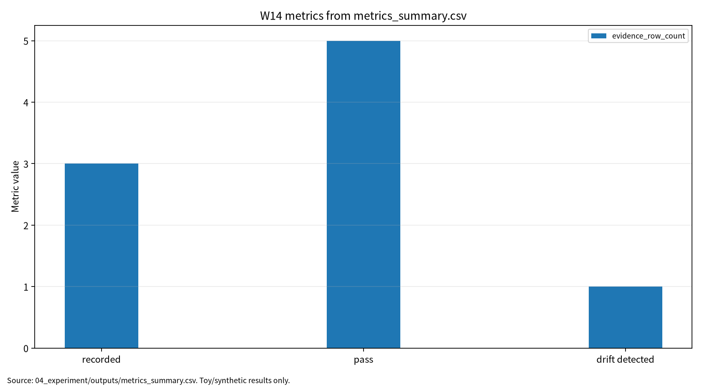

# W14 제출용 단일 보고서

## MLOps/DevOps·데이터/모델 파이프라인·공급망 보안

## 0. 메타정보

| 항목 | 내용 |
|---|---|
| 주차 | W14 |
| 보고서 제목 | MLOps/DevOps·데이터/모델 파이프라인·공급망 보안 |
| 과목 범위 | AI 보안 |
| 작성자 | 박영세 |
| 학번 | 26200122 |
| 작성일 | 2026-06-26 |
| 문서 상태 | 주차별 단일 제출용 보고서 |
| 원본 관리 파일 | `03_weekly_reports/w14_mlops_supply_chain/07_week_submission/w14_submission_report.md` |
| Word/PDF 제출본 권장 위치 | `03_weekly_reports/w14_mlops_supply_chain/07_week_submission/exports/` |
| 관련 산출물 위치 | `03_weekly_reports/w14_mlops_supply_chain/` |
| 안전 범위 | 실제 운영 서비스 침해, 개인정보 사용, 악성 패키지 배포, 무단 시스템 접근, 실제 공급망 공격 절차 제외 |
| PDF 검토 상태 | P01~P05 로컬 PDF blob 존재 확인. 제출 본문은 공식 DOI/URL, `paper_list.md`, `download_source.md`, 논문별 summary, 실험 보고서 기준으로 작성 |
| 제출 전 주의 | P01/P03/P04/P05는 수업자료 표기와 DOI 또는 로컬 PDF 상태에 차이가 있다. P03/P04는 로컬 PDF가 관련 보조 문헌 상태이므로 최종 제출 전 지정 논문 원문 또는 공식 출판 페이지 재확인 필요 |

---

## 초록

본 보고서는 W14 주차의 MLOps/DevOps, 데이터·모델 파이프라인, AI 공급망 보안, 운영 모니터링, 감사 가능성을 하나의 제출용 보고서로 통합한다. 운영형 AI 시스템은 모델 accuracy만으로 안전성을 주장할 수 없고, dataset hash, config hash, model hash, artifact inventory, audit log, drift score, rollback evidence, reproducibility evidence가 함께 남아야 한다. 본 보고서는 W14 논문 5편을 바탕으로 MLOps practice/governance, ML deployment challenge, MLOps/AIOps monitoring, edge deployment, deep learning for software engineering을 연결하고, synthetic MLOps toy pipeline과 toy logistic regression을 사용한 안전한 toy protocol로 baseline accuracy, F1, dataset hash, model hash match, re-run consistency, drift score, drift accuracy, audit coverage, inventory coverage를 분리 기록하였다. 실험 결과는 실제 기업 공급망 보안 보증이나 production MLOps 성숙도 평가가 아니라 evidence set 보고 구조를 설명하기 위한 안전한 예시로 한정한다.

**키워드:** MLOps, DevOps, ML supply chain, AI BOM, artifact integrity, drift monitoring, audit log, model registry, reproducibility, evidence set

---

## 1. 한 문장 요약

W14는 운영형 AI 시스템 보안이 모델 accuracy가 아니라 dataset, config, model artifact, drift, audit log, inventory, reproducibility를 함께 증명하는 evidence set 문제임을 보여주는 주차다.

---

## 2. 학습 배경과 주차 목표

### 2.1 이번 주 주제의 위치

W14는 W01~W13의 모델 단위 AI 보안 평가를 운영형 AI 시스템과 공급망 보안으로 확장한다. 모델이 실제 서비스가 되려면 데이터 수집, feature engineering, 학습 코드, config, model registry, deployment, monitoring, rollback, audit log 전 과정이 연결된다. 따라서 AI 보안은 단일 모델 파일의 정확도 검증이 아니라 데이터·코드·설정·모델·배포·모니터링 산출물의 무결성 및 재현성 검증으로 확장된다.

### 2.2 강의계획서상 학습목표

- MLOps lifecycle, model registry, deployment, monitoring, retraining workflow를 이해한다.
- ML deployment에서 발생하는 data quality, drift, operational gap, rollback 문제를 정리한다.
- AIOps telemetry, incident response, root-cause analysis를 MLOps 보안과 연결한다.
- Edge AI deployment에서 device/update integrity, latency, distributed update 위험을 정리한다.
- AI BOM/ML artifact inventory와 audit evidence set을 설계한다.

### 2.3 이번 주 핵심 질문

1. 운영형 AI 시스템에서 accuracy만으로 보안성과 재현성을 주장할 수 없는 이유는 무엇인가?
2. Dataset hash, config hash, model hash는 각각 어떤 공급망 위험을 줄이는가?
3. Drift score가 threshold를 초과하면 자동 rollback과 human review 중 무엇을 우선해야 하는가?
4. Audit coverage와 inventory coverage는 실제 운영 보증으로 확장하려면 어떤 추가 통제가 필요한가?
5. AI BOM/ML artifact inventory에는 dataset, model, config 외에 어떤 항목이 포함되어야 하는가?

---

## 3. 논문 5편의 서술형 종합 요약

### 3.1 P01. A Multivocal Review of MLOps Practices, Challenges and Open Issues

P01은 MLOps practice, challenge, open issue, governance를 정리하는 핵심 문헌이다. MLOps는 데이터 준비, 학습, 검증, 배포, 모니터링, 재학습을 하나의 반복 가능한 pipeline으로 관리하는 접근이다. 연구용 모델이 실제 서비스로 전환되려면 데이터 버전, 코드 버전, config, 실험 로그, model registry, deployment policy, monitoring signal이 연결되어야 한다.

보안 관점에서 P01은 W14의 상위 구조다. MLOps는 단순 자동화가 아니라 provenance, auditability, reproducibility, rollback, ownership, governance를 요구한다. Dataset hash와 model hash는 artifact tampering을 줄이는 기준점이고, config hash와 run log는 재현성 증거다. 다만 수업자료에는 Bayram Eken 및 긴 제목으로 표기되어 있으나 DOI 기준 공식 출판정보는 Beyza Eken et al.의 ACM CSUR 논문이므로 공식 DOI 기준 서지를 우선한다.

### 3.2 P02. Challenges in Deploying Machine Learning: A Survey of Case Studies

P02는 machine learning deployment의 실제 어려움을 case-study 관점에서 정리한다. 연구 환경에서는 높은 test accuracy가 중요하지만 운영 환경에서는 data pipeline, stakeholder requirement, integration, monitoring, maintenance, performance drift, failure recovery, human process가 함께 작동해야 한다. 운영 배포에서는 모델의 예측 성능뿐 아니라 시스템 신뢰성, 데이터 품질, 사용자 피드백, 장애 대응 절차가 중요하다.

보안 관점에서 P02는 production ML과 research ML 사이의 격차를 보여준다. 운영형 AI는 학습이 끝난 모델을 배포하는 것으로 끝나지 않는다. 배포 후 drift, feature schema mismatch, dependency change, model artifact mismatch, silent failure가 발생할 수 있으므로, drift monitoring, audit log, rollback plan, re-run consistency가 필수다.

### 3.3 P03. A Joint Study of the Challenges, Opportunities, and Roadmap of MLOps and AIOps: A Systematic Survey

P03은 MLOps와 AIOps의 접점을 정리하는 공식 DOI 기준 문헌이다. MLOps는 ML lifecycle 운영을 다루고, AIOps는 로그·메트릭·trace 같은 telemetry를 사용해 anomaly detection, incident response, root-cause analysis, capacity management를 지원한다. 운영형 AI 시스템에서는 모델 성능 저하와 시스템 장애가 함께 나타날 수 있으므로 monitoring과 incident response가 결합되어야 한다.

보안 관점에서 P03은 auditability와 monitoring telemetry의 근거다. Drift score, performance metric, alert quality, incident log, rollback decision은 보안 evidence set의 일부가 된다. 다만 현재 로컬 PDF는 Cheng et al.의 AIOps cloud survey 관련 보조 문헌이므로, 최종 제출 전 Diaz-de-Arcaya 계열 공식 원문 또는 출판사 페이지를 확인해야 한다.

### 3.4 P04. Deep Learning With Edge Computing: A Review

P04는 edge computing과 deep learning의 결합을 정리하는 공식 DOI 기준 문헌이다. Edge deployment는 cloud-only deployment와 달리 latency, bandwidth, device resource, privacy, intermittent connectivity, distributed update, device heterogeneity 문제를 가진다. 모델이 edge device에 배포되면 update integrity와 device trust가 중요한 공급망 통제점이 된다.

보안 관점에서 P04는 W14의 edge supply chain 확장 축이다. Edge 환경에서는 모델 artifact가 여러 장치에 복제되고, update channel이 공격면이 되며, local telemetry와 중앙 registry의 동기화가 어려워질 수 있다. 따라서 signed model artifact, secure update channel, device inventory, rollout policy, rollback evidence가 필요하다. 현재 로컬 PDF는 Zhou et al. Edge Intelligence 관련 보조 문헌이므로 공식 Chen/Ran 원문 확인이 필요하다.

### 3.5 P05. A Survey on Deep Learning for Software Engineering

P05는 deep learning이 software engineering workflow에 적용되는 영역을 정리하는 문헌이다. AI는 code completion, bug detection, test generation, program repair, requirements analysis, documentation, repository mining 등 개발 pipeline 내부로 들어오고 있다. 이는 software supply chain과 ML supply chain이 결합된다는 뜻이다.

보안 관점에서 P05는 AI-assisted software engineering과 MLOps supply chain의 연결 근거다. 학습 코드, 자동 생성 코드, CI/CD configuration, dependency, container image, model artifact가 하나의 pipeline에서 만들어지기 때문에 build provenance, signed artifact, vulnerability scan, branch protection, approval workflow가 필요하다. 수업자료의 Xiang Chen 표기와 DOI 기준 Yang/Xia/Lo/Grundy 서지가 다르므로 최종 제출 전 재확인이 필요하다.

---

## 4. 논문 간 연결 관계

W14 논문 5편은 다음 흐름으로 연결된다.

```text
MLOps practice와 lifecycle governance
→ ML deployment challenge와 운영 격차
→ MLOps/AIOps monitoring과 incident response
→ Edge deployment와 distributed update risk
→ AI-assisted software engineering과 supply chain 결합
```

P01은 MLOps practice와 governance 구조를 제공한다. P02는 ML deployment의 운영 난점을 정리한다. P03은 MLOps와 AIOps의 monitoring 및 incident response 연결을 제공한다. P04는 edge deployment와 distributed artifact update 문제를 확장한다. P05는 software engineering pipeline과 AI pipeline이 결합될 때의 supply chain 위험을 설명한다. 이 다섯 문헌을 종합하면 W14의 핵심 메시지는 “운영형 AI 보안은 모델 하나가 아니라 evidence set으로 검증되는 pipeline 보안”이라는 것이다.

---

## 5. AI 원리 70% 정리

MLOps는 데이터, 코드, 설정, 모델, 배포, 모니터링을 연결하는 운영형 ML lifecycle이다. Production ML에서는 동일한 코드와 동일한 seed로 재실행해도 외부 데이터, dependency, platform, feature pipeline이 바뀌면 결과가 달라질 수 있다. 따라서 reproducibility와 accountability를 위해 hash, version, inventory, log, drift threshold를 관리해야 한다.

### 5.1 핵심 수식

Dataset hash는 canonical dataset representation에 대한 digest로 표현할 수 있다.

$$
H_D=SHA256(D_{canon})
$$

Config hash는 실행 설정 전체의 digest다.

$$
H_C=SHA256(C_{canon})
$$

Model hash는 모델 artifact payload의 digest다.

$$
H_M=SHA256(M_{artifact})
$$

Drift score는 기준 데이터와 운영 데이터의 평균 표준화 feature shift로 기록할 수 있다.

$$
DriftScore=\frac{1}{p}\sum_{j=1}^{p}\left|\frac{\mu_{prod,j}-\mu_{base,j}}{\sigma_{base,j}+\epsilon}\right|
$$

Audit coverage는 필수 감사 필드 중 기록된 필드의 비율이다.

$$
AuditCoverage=\frac{N_{logged}}{N_{required}}
$$

Inventory coverage는 AI BOM/ML artifact inventory 최소 항목 중 채워진 항목 비율이다.

$$
InventoryCoverage=\frac{N_{filled}}{N_{inventory}}
$$

| 기호 | 의미 |
|---|---|
| $D_{canon}$ | canonical dataset representation |
| $C_{canon}$ | canonical config representation |
| $M_{artifact}$ | model artifact payload |
| $p$ | feature 수 |
| $\mu_{prod,j}$ | 운영 또는 drifted data의 $j$번째 feature 평균 |
| $\mu_{base,j}$ | 기준 data의 $j$번째 feature 평균 |
| $\sigma_{base,j}$ | 기준 data의 $j$번째 feature 표준편차 |
| $N_{logged}$ | 기록된 필수 감사 필드 수 |
| $N_{required}$ | 필수 감사 필드 수 |

### 5.2 핵심 개념과 보안 연결

| 개념 | 요점 | 보안 연결 |
|---|---|---|
| MLOps lifecycle | 데이터 준비, 학습, 검증, 배포, 모니터링, 재학습 | 단계별 보호 자산과 승인 절차 |
| Data/model pipeline | 데이터와 모델 산출물의 출처·버전·config 추적 | provenance, reproducibility |
| Monitoring/drift | 운영 입력 분포 변화 감시 | drift 미탐지와 human review |
| AIOps | 로그와 metric 기반 incident detection/RCA | auditability, incident response |
| Edge deployment | 분산 배포와 update 관리 | artifact tampering, device integrity |
| AI BOM | AI artifact inventory와 dependency visibility | supply chain 가시성 |

---

## 6. 보안 이슈 30% 정리

W14의 보안 이슈는 실제 공격 절차 재현이 아니라 운영 파이프라인의 보호 자산과 통제항목 정의다. 핵심 위협은 data pipeline poisoning, model artifact tampering, dependency risk, unsafe update, log leakage, drift 미탐지, audit trail 부재다. 운영형 AI 시스템에서는 모델 성능보다 evidence set이 더 중요할 때가 있다. 성능이 같아도 dataset hash, config hash, model hash, audit log가 없으면 재현성과 책임 추적성이 부족하다.

| 보안 속성 | W14에서의 의미 | 대표 위협 | 평가 지표 또는 증거 |
|---|---|---|---|
| Integrity | 데이터·설정·모델 artifact 무결성 | data poisoning, model tampering | dataset/config/model hash |
| Availability | 배포 장애와 rollback 실패 | unsafe update, drift 미탐지 | drift score, rollback plan |
| Confidentiality | 로그와 telemetry의 민감정보 노출 | log leakage, telemetry misuse | log schema, data minimization |
| Accountability | 누가 어떤 artifact를 배포했는지 추적 | audit gap, inventory gap | audit coverage, inventory coverage |
| Supply chain | dependency와 container/image 위험 | malicious package, unsigned artifact | SBOM, AI BOM, signed build |

---

## 7. Research Track 분석

### 7.1 연구문제

- RQ1. MLOps 파이프라인에서 보안 위협을 어떻게 분류하고 어떤 evidence로 재현성과 책임성을 보장할 것인가?
- RQ2. Dataset hash, config hash, model hash는 각각 어떤 artifact tampering 위험을 줄이는가?
- RQ3. Drift score와 audit coverage는 운영 감시 지표로 어떻게 해석되어야 하는가?
- RQ4. AI BOM/ML artifact inventory는 어떤 최소 항목을 가져야 하는가?

### 7.2 위협모형

| 항목 | 내용 |
|---|---|
| 보호 자산 | dataset, feature pipeline, training code, config, seed, model artifact, registry, deployment setting, logs, monitoring telemetry |
| 공격자 목표 | data poisoning, artifact tampering, dependency compromise, unsafe update, log manipulation, drift 미탐지 유도 |
| 공격자 지식 | pipeline 구조 일부, artifact 저장 위치, deployment workflow, monitoring threshold 추정 가능성 |
| 공격자 능력 | artifact 교체, config 변조, dependency 삽입, telemetry 왜곡, 불완전 audit log 유도 |
| 공격 경로 | data/code/config → training → artifact → registry/deployment → monitoring/audit → evidence gap |
| 방어자 능력 | dataset hash, config hash, model hash, signed artifact, artifact inventory, audit log, drift monitoring, approval gate |
| 제외 범위 | 실제 운영 서비스 침해, 개인정보 사용, 악성 패키지 배포, 무단 시스템 접근 |

### 7.3 평가축

| 평가축 | 질문 | 대표 지표 또는 증거 |
|---|---|---|
| Model utility | 기준 성능이 기록되는가 | accuracy, F1 |
| Data integrity | 데이터 버전 기준점이 있는가 | dataset hash |
| Artifact integrity | 모델 artifact 변조를 감지할 수 있는가 | model hash match |
| Re-run consistency | 같은 config/seed로 재현 가능한가 | model/data hash match |
| Drift monitoring | 입력 분포 변화가 감지되는가 | mean standardized feature shift |
| Auditability | 필수 로그 필드가 남는가 | audit coverage |
| Inventory visibility | AI BOM 최소 항목이 채워졌는가 | inventory coverage |

### 7.4 재현성

재현성을 위해 seed, dataset generation rule, config, dataset hash, config hash, model hash, model artifact, inventory, audit log, drift threshold, CSV/JSON/Markdown log를 보존한다. W14 실습은 synthetic data만 사용하며, 실제 운영 시스템이나 개인정보를 사용하지 않는다.

---

## 8. 실습 보고서 및 그래프 수치 검증

본 실습은 MLOps 보안통제의 최소 evidence 구조를 보여주는 toy pipeline이다. 실제 model registry, CI/CD, package vulnerability scanner, Kubernetes deployment, production telemetry는 구현하지 않았다. Synthetic MLOps binary classification과 toy logistic regression을 사용해 dataset/model/config hash, drift score, audit coverage, inventory coverage를 확인했다.

### 8.1 실습 설계

| 항목 | 내용 |
|---|---|
| Dataset | Synthetic MLOps binary classification |
| Train/Test samples | 320 / 160 |
| Feature count | 5 |
| Model | Toy logistic regression |
| Drift shift / threshold | 0.60 / 0.25 |
| Seed | 42 |
| Output files | `metrics_summary.csv`, `results.json`, `run_log.md`, `model_artifact.json`, `artifact_inventory.json`, `audit_log.jsonl` |

### 8.2 실습 결과 수치

| 점검 항목 | 측정 지표 | 결과 | 보안 의미 |
|---|---|---:|---|
| Baseline model | Accuracy | 0.925000 | 정상 조건 기준 성능 |
| Baseline model | F1 | 0.923077 | 정상 조건 분류 균형 |
| Data versioning | Dataset hash | `sha256:b9e597bccdbde442` | 데이터 무결성 기준점 |
| Model artifact verification | Model hash match | true | 모델 아티팩트 변조 탐지 기준 |
| Re-run consistency | Model/data hash match | true | 동일 config/seed 재실행 가능성 |
| Drift monitoring | Mean standardized feature shift | 0.307626 | 입력 분포 변화 감시 |
| Drifted model | Accuracy under drift | 0.925000 | 분포 변화 조건 성능 |
| Log audit | Audit coverage | 1.000000 | toy 필수 로그 필드 보존률 |
| Artifact inventory | Inventory coverage | 1.000000 | toy AI BOM/ML artifact inventory 최소 항목 충족률 |

본 실험의 drift score는 synthetic 기준 데이터와 drifted 데이터의 평균 표준화 feature shift다. 이 값은 실제 운영 장애나 공격 성공률을 의미하지 않는다. 다만 threshold 0.25를 초과했으므로 toy pipeline에서는 human review, rollback 검토, 추가 데이터 검증, model performance 재평가가 필요한 감시 신호로 해석한다.

### 8.3 그래프 수치 검증

현재 제출 보고서의 그래프는 `assets/w14_metric_chart.png`를 참조한다. 확인 가능한 SVG 그래프에는 단일 series `value`가 표시되며, x축에는 `accuracy`, `f1`, `dataset_sha256`, `model_hash_match`, `model_and_dataset_hash_match`, `mean_standardized_feature_shift`, `drift_accuracy`, `audit_coverage`, `inventory_coverage`가 배치되어 있다. `dataset_sha256`은 문자열 hash이므로 그래프에는 수치 series로 표시되지 않고 x축 label로만 남는다.

| 측정 지표 | 그래프 값 | 보고서 값 | 확인 결과 |
|---|---:|---:|---|
| Accuracy | 0.925000 | 0.925000 | 일치 |
| F1 | 0.923077 | 0.923077 | 일치 |
| Model hash match | 1.000000 | true | 일치 |
| Model/data hash match | 1.000000 | true | 일치 |
| Mean standardized feature shift | 0.307626 | 0.307626 | 일치 |
| Drift accuracy | 0.925000 | 0.925000 | 일치 |
| Audit coverage | 1.000000 | 1.000000 | 일치 |
| Inventory coverage | 1.000000 | 1.000000 | 일치 |

<!-- submission-metric-chart:start -->
**그림 1. W14 metrics summary chart**



출처: `04_experiment/outputs/metrics_summary.csv`. 이 그래프는 공개 toy/synthetic 산출물 기반이며 실제 공격 성능이나 운영 환경 성능으로 일반화하지 않는다. 현재 그래프는 evidence metric의 value series를 시각화한다.
<!-- submission-metric-chart:end -->

### 8.4 MLOps Evidence Set 해석

| Evidence 항목 | 의미 | 보안 연결 | 한계 |
|---|---|---|---|
| Dataset hash | 데이터 버전의 무결성 기준점 | 데이터 오염·변조 탐지 | 데이터 품질 자체를 보장하지 않음 |
| Config hash | 실험·학습 설정의 재현성 기준점 | 설정 변조 탐지 | 외부 의존성 버전까지 포함 필요 |
| Model hash | 모델 artifact 변경 탐지 | 모델 변조 탐지 | 모델 행동 의미를 설명하지 않음 |
| Drift score | 운영 입력 분포 변화 감시 | drift 미탐지 방지 | 원인 분석·대응 결정은 별도 필요 |
| Audit coverage | 필수 로그 필드 보존률 | 책임추적성 | 로그 품질·진실성을 보장하지 않음 |
| Inventory coverage | AI BOM/ML artifact inventory 최소 항목 충족률 | 공급망 가시성 | SBOM, license, vulnerability scan 확장 필요 |

### 8.5 AI BOM / ML Artifact Inventory 확장 항목

| 범주 | 필수 항목 | W14 toy 실험 반영 | 운영 확장 필요 |
|---|---|---|---|
| Dataset | name, version, hash, source, license, personal data flag | 일부 반영 | data card, lineage, consent, retention |
| Feature pipeline | feature code version, transformation hash | 미반영 | feature store lineage |
| Training code | git commit, source hash, environment | 일부 반영 필요 | signed build, branch protection |
| Config | config hash, hyperparameters, seed | 반영 | config approval workflow |
| Model artifact | model hash, model type, metric, registry path | 반영 | model card, signature, registry ACL |
| Dependency | package list, container image digest | 미반영 | SBOM, vulnerability scan |
| Deployment | deployment version, endpoint, rollout policy | 미반영 | canary, rollback, approval gate |
| Monitoring | drift score, threshold, telemetry schema | 일부 반영 | alerting, incident response |
| Audit | run log, audit log, approval record | 일부 반영 | immutable log, access log |

---

## 9. 기말논문 연결

W14는 기말논문에서 운영형 AI 시스템의 보안·재현성 보증을 위한 evidence set으로 활용할 수 있다. Dataset hash, model hash, config hash, drift score, audit coverage, artifact inventory를 최소 지표로 제안한다.

| 기말논문 장 | W14 반영 내용 |
|---|---|
| 1장 서론 | 운영형 AI 시스템 보안이 모델 성능이 아니라 evidence set 문제라는 문제의식 |
| 2장 관련연구 | MLOps, ML deployment, AIOps, edge deployment, AI-assisted software engineering 문헌 정리 |
| 3장 위협모형 | dataset, config, model artifact, registry, log, telemetry 보호 자산 정의 |
| 4장 연구방법 | hash, drift, audit, inventory coverage 기반 evidence set 설계 |
| 5장 분석 | synthetic MLOps pipeline 결과와 evidence item 해석 |
| 6장 결론 | AI 공급망 보안은 artifact integrity와 auditability를 함께 관리해야 함 |

---

## 10. AI 도구 활용 기록

AI 도구는 문헌 요약, 코드 점검, 문장 구조화, 그래프 생성 보조에 사용하였다. 모든 DOI/URL, 실험 수치, 본문 인용, 결론은 작성자가 outputs 파일과 로컬 참고문헌 검증표를 대조하여 검증한다.

| 항목 | 내용 |
|---|---|
| 사용 도구명 | Codex, ChatGPT 계열 도구 |
| 사용 목적 | 문헌 요약 정리, 보고서 구조화, 안전한 toy/synthetic 실험 결과 표기 점검, 그래프 생성 보조, 제출 전 체크리스트 정리 |
| AI 산출물 반영 위치 | `07_week_submission/w14_submission_report.md`, `07_week_submission/assets/w14_metric_chart.png`, `05_ai_worklog/ai_disclosure_draft.md` |
| 본인 수정 내용 | 주차별 문헌 상태 확인, 실험 수치와 outputs 대조, 안전 범위와 한계 문장 확인, 최종 제출 전 미확정 문헌 분리 |
| 사실관계 검증 방법 | `01_papers/paper_list.md`, `01_papers/doi_check.md`, 강의계획서 문헌표 대조 |
| 실험결과 검증 방법 | `04_experiment/experiment_report.md`, `04_experiment/outputs/metrics_summary.csv`, `results.json`, `run_log.md`의 수치와 보고서 표기 대조 |
| 최종 책임 확인 | AI 산출물은 초안 보조이며 최종 제출자는 원고 내용, 인용, 실험결과, 연구윤리 책임을 확인한다. |

---

## 11. 제출 전 자기 점검표

| 점검 항목 | 상태 | 비고 |
|---|---|---|
| 메타정보 작성 | 완료 | 작성일 2026-06-26 반영 |
| 초록 및 키워드 작성 | 완료 |  |
| AI 원리 70% 정리 | 완료 | 핵심 수식 추가 |
| 보안 이슈 30% 정리 | 완료 |  |
| 논문 5편 서술형 요약 | 완료 |  |
| 논문 간 연결 관계 작성 | 완료 |  |
| Research Track 5요소 작성 | 완료 | 연구문제, 위협모형, 평가방법, 재현성, 한계 |
| P01~P05 PDF blob 확인 | 완료 | GitHub 파일 존재 확인. 원문 PDF 저작권/배포 정책 별도 검토 필요 |
| P01 공식 제목/저자명 검증 | 완료 / 확인 필요 | 수업자료 표기 차이 |
| P02 DOI/URL 검증 | 완료 | Article 번호 재확인 필요 |
| P03 지정 논문 원문 확보 | 확인 필요 | 현재 로컬 PDF는 관련 보조 문헌 |
| P04 지정 논문 원문 확보 | 확인 필요 | 현재 로컬 PDF는 관련 보조 문헌 |
| P05 지정 논문 원문/저자 표기 | 확인 필요 | Xiang Chen 표기 차이 |
| 실험 outputs 파일 존재 확인 | 완료 | 6개 output 파일 |
| 실험 결과와 보고서 수치 일치 | 완료 | 실험 보고서 수치 기준 반영 |
| 그래프 수치 확인 | 완료 | evidence metric value series 기준 표와 일치 |
| drift score 해석 보완 | 완료 | 공격 성공률 또는 장애 확률 아님 |
| AI BOM 확장표 추가 | 완료 | 운영 확장 항목 포함 |
| AI 활용 고지 작성 | 완료 |  |
| DOCX/PDF 제출본 생성 | 필요 | `07_week_submission/exports/` 권장 |
| 최종 사람이 검토할 항목 표시 | 완료 | P01/P03/P04/P05 표기, PDF 보관 정책, Word/PDF 렌더링 |

---

## 12. 참고문헌 검증표

| 번호 | 참고문헌 | DOI/URL | 상태 | 비고 |
|---:|---|---|---|---|
| [1] | Beyza Eken et al., “A Multivocal Review of MLOps Practices, Challenges and Open Issues,” ACM Computing Surveys, 2025/2026 | `https://doi.org/10.1145/3747346`; arXiv `https://arxiv.org/abs/2406.09737` | 공식 DOI 확인 | 수업자료 Bayram Eken 및 긴 제목 표기 차이, Article 번호 확인 필요 |
| [2] | Andrei Paleyes, Raoul-Gabriel Urma, Neil D. Lawrence, “Challenges in Deploying Machine Learning: A Survey of Case Studies,” ACM Computing Surveys, 2022/2023 | `https://doi.org/10.1145/3533378`; arXiv `https://arxiv.org/abs/2011.09926` | 공식 DOI 확인 | Article 번호 추가 확인 필요 |
| [3] | Josu Diaz-de-Arcaya et al., “A Joint Study of the Challenges, Opportunities, and Roadmap of MLOps and AIOps: A Systematic Survey,” ACM Computing Surveys, 2023/2024 | `https://doi.org/10.1145/3625289` | 공식 DOI 확인 | 현재 로컬 PDF는 Cheng et al. AIOps 관련 보조 문헌 |
| [4] | Jiasi Chen, Xukan Ran, “Deep Learning With Edge Computing: A Review,” Proceedings of the IEEE, 2019 | `https://doi.org/10.1109/JPROC.2019.2921977` | 공식 DOI 확인 | 현재 로컬 PDF는 Zhou et al. Edge Intelligence 관련 보조 문헌 |
| [5] | Yanming Yang, Xin Xia, David Lo, John Grundy, “A Survey on Deep Learning for Software Engineering,” ACM Computing Surveys, 2022 | `https://doi.org/10.1145/3505243`; arXiv `https://arxiv.org/abs/2011.14597` | 공식 DOI 확인 | 수업자료 Xiang Chen 표기 확인 필요 |

---

## 13. 부록 A. KCI 논문 형식 전환 아이디어

### A.1 제목 후보

| 번호 | 국문 제목 후보 | 영문 제목 후보 | 대상 시스템 | 보안 위협 | 연구방법 | 예상 기여 |
|---:|---|---|---|---|---|---|
| 1 | 운영형 AI 시스템 보안을 위한 MLOps Evidence Set 평가 프레임워크 연구 | An Evaluation Framework of MLOps Evidence Sets for Operational AI System Security | MLOps 기반 AI 서비스 | artifact tampering, drift, audit gap | 문헌분석 + synthetic pipeline 실험 | evidence set 평가표 |
| 2 | AI 공급망 보안에서 Dataset·Config·Model Hash와 Audit Log의 역할 분석 | An Analysis of Dataset, Config, Model Hashes and Audit Logs in AI Supply Chain Security | ML pipeline | data poisoning, model tampering | toy pipeline + 체크리스트 | hash/audit 기반 통제 |
| 3 | AI BOM 기반 MLOps 공급망 보안과 재현성 평가체계 연구 | A Study on AI BOM-Based MLOps Supply Chain Security and Reproducibility Evaluation | AI BOM/ML artifact inventory | dependency risk, model update risk | 문헌분석 + inventory 설계 | AI BOM 최소 항목 제안 |

추천 제목은 “운영형 AI 시스템 보안을 위한 MLOps Evidence Set 평가 프레임워크 연구”이다. 연구문제는 evidence set 최소 구성, dataset/config/model hash의 역할, drift score와 audit coverage의 운영 감시 의미, AI BOM/ML artifact inventory 확장 항목으로 구성한다.

### A.2 연구문제

- RQ1. 운영형 AI 시스템 보안을 위해 필요한 최소 evidence set은 무엇인가?
- RQ2. Dataset/config/model hash와 audit log는 MLOps 공급망 보안에서 어떤 역할을 하는가?
- RQ3. Drift score와 inventory coverage를 실제 운영 보증으로 확장하려면 어떤 추가 통제가 필요한가?

---

## 14. 부록 B. SCI 논문 형식 전환 아이디어

SCI 제목 후보는 “An Evidence-Set Framework for MLOps Supply-Chain Security and Reproducibility in Operational AI Systems”이다.

Structured abstract는 Background, Problem, Method, Results, Contribution, Implications로 구성한다. 결과 문장은 W14 toy pipeline이 accuracy 0.925000, F1 0.923077, drift score 0.307626, audit coverage 1.000000, inventory coverage 1.000000을 기록했다는 수준으로 제한한다. 실제 model registry, CI/CD, Kubernetes, package vulnerability scanner, production telemetry, 실제 기업 공급망 보안 수준으로 일반화하지 않는다.

| 연구축 | 대표 논문 | 역할 |
|---|---|---|
| MLOps practices | Eken et al. | MLOps lifecycle, practice, challenge, governance |
| ML deployment challenges | Paleyes et al. | production deployment workflow and case-study challenges |
| MLOps/AIOps taxonomy | Diaz-de-Arcaya et al. | monitoring, incident response, AIOps taxonomy |
| Edge deployment | Chen and Ran | cloud-edge-device constraints and distributed updates |
| Deep learning for software engineering | Yang, Xia, Lo, Grundy | AI-assisted SE and DevOps/MLOps pipeline impact |

---

## 15. 부록 C. 제출 파일 위치와 변환 권장

| 파일 | 설명 |
|---|---|
| `07_week_submission/w14_submission_report.md` | 본 제출용 보고서 원본 |
| `07_week_submission/assets/w14_metric_chart.png` | 제출 보고서 그래프 |
| `04_experiment/experiment_report.md` | 실험 근거 보고서 |
| `04_experiment/outputs/` | 실험 결과 근거 파일 위치 |
| `05_ai_worklog/ai_disclosure_draft.md` | AI 활용 고지 근거 |

Word 제출본은 다음 위치에 생성해 관리한다.

```text
03_weekly_reports/w14_mlops_supply_chain/07_week_submission/exports/w14_submission_report.docx
```

PDF 제출본은 Word에서 최종 육안 검수 후 다음 위치에 저장한다.

```text
03_weekly_reports/w14_mlops_supply_chain/07_week_submission/exports/w14_submission_report.pdf
```

수식은 GitHub와 Word 변환을 모두 고려하여 Markdown 표 안에 넣지 않고, `$$...$$` block math로 유지한다.
