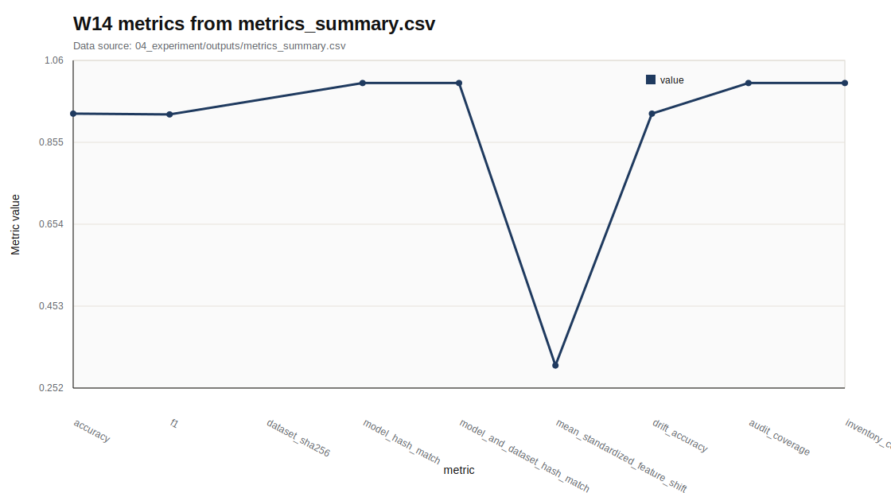

# W14 MLOps Supply Chain Security

Research Question: MLOps Supply Chain Security에서 성능 지표와 보안 지표를 어떻게 분리해 평가할 수 있는가?

---

## Core Formula

### Artifact Integrity Check

$$
pass(a)=\mathbf{1}[H(a)=H_{ref}(a)]
$$

| 기호 | 의미 |
|---|---|
| `a` | artifact |
| `H` | hash function |
| `H_{ref}` | 기준 hash |
| `pass(a)` | 무결성 확인 결과 |

- 직관적 의미: 공급망 보안은 artifact가 기준 hash와 일치하는지 확인하는 것에서 시작한다.
- 보안적 의미: 데이터, 모델, config의 변경 여부를 추적해야 재현성과 책임성이 유지된다.
- 평가 지표 연결: model_hash_match, dataset_sha256, inventory_coverage와 연결한다.
- 한계: hash 검증은 무결성 근거이지 모델 안전성 전체 보증이 아니다.

---

## Threat Model

- Diagram: MLOps supply-chain map
- Stages: Data, Code/Config, Artifact, Provenance, Audit
- 안전 범위: public, synthetic, toy, local evaluation

---

## Evaluation Protocol

- Metrics: value
- 데이터 출처: `04_experiment/outputs/metrics_summary.csv`

| metric | value | status |
| --- | --- | --- |
| accuracy | 0.925 | recorded |
| f1 | 0.923 | recorded |
| dataset_sha256 | sha256:b9e597bccdbde442 | pass |
| model_hash_match | true | pass |
| model_and_dataset_hash_match | true | pass |

---

## Figure-first Result

그래프는 numeric value로 변환 가능한 MLOps 점검 항목만 표시한다. Hash 문자열이나 boolean pass는 그래프에서 제외하고 manifest와 로그 근거로 남겼다. 값은 `metrics_summary.csv`에서만 읽었다.

---

## Paper Map

| ID | 논문 역할 | 발표에서 쓰는 위치 | 기말논문 연결 |
|---|---|---|---|
| P01 | 핵심 이론 | Background / Core Formula | MLOps Supply Chain Security의 관련연구 뼈대 |
| P02 | 위협 분류 | Threat Model | 공격자·방어자·보호자산 정의 |
| P03 | 평가 지표 | Evaluation Protocol | 정량 지표와 로그 근거 연결 |
| P04 | 공격·방어 사례 | Security Implication | 보안적 함의와 방어 한계 |
| P05 | 재현성·정책 근거 | Limitation | 확인 필요 항목과 제출 전 검증 |

---

## Limitation

- hash/pass 항목은 시각화에서 제외했으며 원본 CSV와 artifact inventory를 함께 확인해야 한다.
- 원문 DOI/URL과 formal guarantee는 최종 제출 전 확인 필요.
- 실제 운영 시스템 악용 절차나 무단 API 질의 절차는 포함하지 않음.

---

## Final Takeaway

W14의 핵심은 `value`를 성능·보안·재현성 근거로 분리해 기말논문의 평가방법에 연결하는 것이다.
