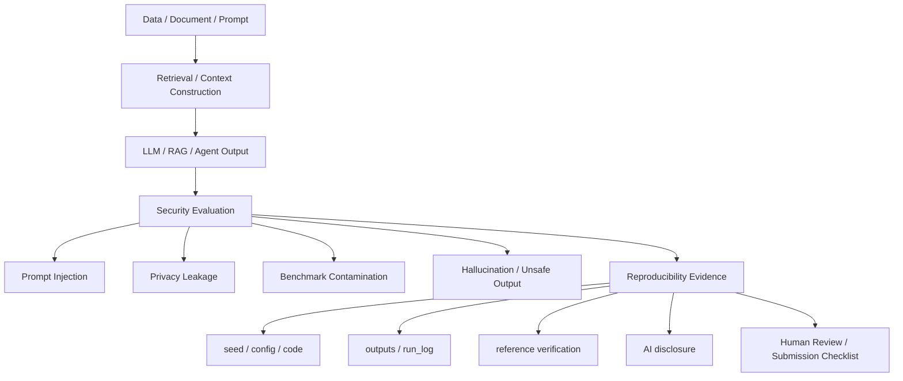

# W15 연구평가·재현성·설명가능성(XAI)·논문 구성 통합보고서

## 0. 메타정보

| 항목 | 내용 |
|---|---|
| 주차 | W15 |
| 주제 | 연구평가·재현성·설명가능성(XAI)·논문 구성 |
| 실습 성격 | local repository metadata 기반 재현성·제출 준비 감사 |
| 기준 산출물 | `04_experiment/outputs/metrics_summary.csv`, `results.json`, `run_log.md` |
| 문서 상태 | 사람이 최종 검토할 제출용 최종 초안 |

## 1. 한 문장 요약

W15는 LLM 평가, ML lifecycle assurance, XAI, concept-based explanation을 바탕으로 성능 주장, 참고문헌 검증, 실험 로그, AI 활용 고지, 기여와 한계를 하나의 evidence chain으로 묶는 주차다.

## 2. 학습 배경과 주차 목표

### 2.1 이번 주 주제의 위치

W15는 W01-W14의 모든 학습·실습·문헌검토를 기말논문 제출 가능한 evidence chain으로 정리하는 마무리 주차다. W01-W14가 AI 원리, 공격·방어, privacy, RAG, FL, DRL, MLOps, 모델 IP를 각각 다루었다면, W15는 성능 주장, 실험 로그, 참고문헌 검증, AI 활용 고지, 기여와 한계, 표와 그림, KCI 논문 형식을 하나로 연결한다.

### 2.2 강의계획서상 학습목표

- LLM evaluation, benchmark contamination, XAI, concept-based explanation, ML lifecycle assurance를 정리한다.
- AI 보안 논문에서 성능 주장, 보안 주장, 참고문헌, 실험 로그가 서로 대응되어야 함을 이해한다.
- 기말논문 제출을 위한 표, 그림, 참고문헌 검증표, AI 활용 고지서를 점검한다.
- 주차별 보고서 2개 이상을 기말논문에 반영한다.
- KCI 형식의 국내 학술지 모의투고 논문 구조로 전환한다.

### 2.3 이번 주 핵심 질문

1. AI 보안 연구에서 성능 주장과 실험 evidence는 어떻게 연결되어야 하는가?
2. 참고문헌 DOI/URL 검증은 왜 연구윤리와 직접 연결되는가?
3. AI 활용 고지는 어떤 수준까지 구체적으로 작성해야 하는가?
4. 기말논문에서 표 1개, 그림 1개, 국내 논문 3편, 해외 논문 5편 조건은 충족되었는가?
5. W01-W15를 종합할 때 최종 contribution은 무엇인가?

## 3. AI 원리 70% 정리

표 1. W15 핵심 개념과 보안 연결

| 개념 | 핵심 의미 | 보안 연결 |
|---|---|---|
| LLM evaluation | 무엇을, 어디서, 어떻게 평가할지 분리 | benchmark contamination, hidden test leakage |
| Reproducibility | 같은 config, seed, code, outputs로 결과 검토 가능 | 재현성 실패, 결과 과장 방지 |
| ML lifecycle assurance | data/model/verification/deployment 단계별 evidence chain | 안전 주장과 검증 증거 대응 |
| XAI | 모델 판단 근거를 사람이 이해하도록 설명 | explanation leakage, misleading explanation |
| Concept-based XAI | 사람이 이해 가능한 concept 단위 설명 | concept leakage, human evaluation 비용 |

## 4. 보안 이슈 30% 정리

| 이슈 | 보안 의미 | 점검 방법 |
|---|---|---|
| Benchmark contamination | 평가 무결성 훼손 | benchmark provenance, 중복·노출 확인 |
| Hidden test leakage | 평가셋 기밀성 훼손 | 접근 통제, 로그 보존 |
| Fabricated citation | 연구윤리 훼손 | DOI/URL/원문 PDF 대조 |
| Missing AI disclosure | 책임 추적 실패 | AI 활용 고지와 human review |
| Explanation leakage | 모델·데이터 단서 노출 | 설명 공개 범위 제한 |

## 5. 논문 5편 요약

표 2. 관련 문헌 5편 요약

| ID | 논문 | 공식 DOI/URL | 검증 상태 | 기말논문 활용 |
|---|---|---|---|---|
| P01 | A Survey on Evaluation of Large Language Models | `10.1145/3641289` | 확인. ACM TIST 15(3), Article 39 | LLM/RAG 평가축, benchmark contamination |
| P02 | Assuring the Machine Learning Lifecycle | `10.1145/3453444` | 확인. ACM CSUR 54(5), Article 111 | config, seed, log, output evidence chain |
| P03 | Explainable AI: Core Ideas, Techniques, and Solutions | `10.1145/3561048` | 부분 확인. 로컬 PDF는 Mersha et al. 관련 보조 문헌 | XAI 평가 기준, 원문 확인 필요 사례 |
| P04 | Explainable Artificial Intelligence (XAI) | `10.1016/j.inffus.2019.12.012` | 확인. Information Fusion 58, 82-115 | Responsible XAI, privacy/accountability |
| P05 | Concept-based Explainable Artificial Intelligence: A Survey | `10.1145/3774643`, arXiv `2312.12936` | 확인. 권호/issue 최종 확인 필요 | concept-based explanation, human evaluation |

## 6. 논문 5편 비교표

P01은 평가 설계와 benchmark contamination 근거이고, P02는 lifecycle assurance와 evidence chain 근거다. P03은 DOI metadata와 로컬 PDF가 분리된 검증 사례이므로 관련 논문 PDF를 지정 논문처럼 인용하지 않는다. P04는 XAI taxonomy와 Responsible AI 근거이며, P05는 concept-based XAI와 human-evaluable explanation 근거다.

## 7. Research Track 분석

표 3. W15 Research Track 요약

| 항목 | 내용 |
|---|---|
| 연구문제 | LLM/RAG 생명주기에서 prompt injection, benchmark contamination, privacy leakage가 발생하는 단계와 최소 평가항목 정의 |
| 보호 자산 | benchmark, hidden test, model version, prompt/template, retrieval context, explanation output, reference list, AI worklog |
| 평가 지표 | reference verification rate, reproducibility evidence coverage, AI disclosure completeness, explanation stability, limitation coverage |
| 제외 범위 | 실제 개인정보, 실제 서비스 침해, 무단 API 공격, 실제 benchmark 오염 실험 |

## 8. 실습 보고서

표 4. W15 감사 결과

| 점검 항목 | 결과 | 상태 |
|---|---:|---|
| W15 필수 산출물 | 47/47 | complete |
| 기말논문 연결 파일 | 9/9 | complete |
| 로컬 PDF | 5 | complete |
| DOI 확인 | 4 | complete |
| DOI 부분 확인 | 1 | partial |
| DOI 미검증 | 0 | complete |
| 가중 참고문헌 검증률 | 0.90 | partial |
| AI 활용 고지 완성도 | 11/11 | complete |

이 결과는 로컬 산출물 존재 여부, DOI/URL 검증 상태, AI 활용 고지 완성도, 제출/발표 패키지 준비 상태를 확인하는 감사 결과이며, LLM 또는 XAI 모델의 성능, 실제 benchmark contamination 측정, 실제 보안 공격 실험으로 일반화하지 않는다.

## 9. AI 도구 활용 기록

표 6. AI 활용 고지 요약표

| 항목 | 내용 |
|---|---|
| 사용 도구 | Codex, ChatGPT 계열 도구 |
| 사용 목적 | 문헌 요약, DOI/URL 검증 보조, 실험 코드 작성, 보고서 구조화, 기말논문 초안 작성, 발표자료 작성 |
| 검증 방법 | DOI/URL/출판사 페이지/로컬 PDF/실행 로그 대조 |
| 사용하지 않은 것 | 허위 인용 생성, 실제 공격 실행, 개인정보 사용, 결과 조작 |
| 최종 책임 | 최종 제출자는 원고 내용, 인용, 실험결과, 연구윤리 책임을 확인한다. |

## 10. 토론 질문

1. benchmark contamination을 소규모 연구에서 어느 수준까지 검증해야 하는가?
2. XAI 설명은 신뢰성 증거인가, 모델·데이터 누수 위험인가?
3. AI 활용 고지와 참고문헌 검증을 평가 루브릭에 정량 항목으로 넣을 수 있는가?

## 11. 기말논문 연결

기말논문 추천 제목은 `LLM/RAG 기반 AI 시스템의 생명주기별 보안 위협과 재현성 중심 평가 프레임워크 연구`다. W15는 연구방법, 평가방법, 보안적 함의, 부록의 참고문헌 검증표와 AI 활용 고지서에 직접 연결된다.

그림 1. LLM/RAG 기반 AI 보안 평가 프레임워크

## 12. KCI 기말논문 형식 전환

표 7. KCI 기말논문 제목 후보

| 번호 | 국문 제목 후보 | 영문 제목 후보 | 핵심 대상 | 연구방법 | 예상 기여 |
|---:|---|---|---|---|---|
| 1 | LLM/RAG 기반 AI 시스템의 생명주기별 보안 위협과 재현성 중심 평가 프레임워크 연구 | A Lifecycle-Based Security Threat and Reproducibility-Centered Evaluation Framework for LLM/RAG-Based AI Systems | LLM/RAG 보안 평가 | 문헌분석 + 주차별 toy evidence 종합 | 생명주기 기반 평가표 |
| 2 | AI 보안 연구의 재현성을 위한 참고문헌·실험로그·AI 활용 고지 통합 체크리스트 연구 | An Integrated Checklist of Reference Verification, Experiment Logs, and AI Disclosure for Reproducible AI Security Research | AI 보안 논문 작성 절차 | 문헌분석 + 제출 감사 | 연구윤리·재현성 체크리스트 |
| 3 | 생성형 AI 보안 평가에서 Prompt Injection, Privacy Leakage, Benchmark Contamination의 통합 분석 | An Integrated Analysis of Prompt Injection, Privacy Leakage, and Benchmark Contamination in Generative AI Security Evaluation | 생성형 AI 보안 위협 | 문헌분석 + 평가 프로토콜 | 위협-평가-재현성 연결 |

추천 제목은 1번이다. 국문초록은 LLM/RAG 기반 AI 시스템의 데이터, 평가, 프롬프트, 검색, 출력, 로그 생명주기에서 발생할 수 있는 보안 위협을 분석하고, 재현성 중심의 평가 프레임워크를 제안하는 방향으로 작성한다.

## 13. SCI 확장 가능성

### 13.1 SCI 제목 후보

A Reproducibility-Centered Lifecycle Evaluation Framework for Security Threats in LLM/RAG-Based AI Systems

표 8. SCI 확장 가능성 점검표

| 항목 | 현재 상태 | SCI 확장 보완 |
|---|---|---|
| 실제 benchmark 검증 | 없음 | 공개 benchmark contamination audit 추가 |
| 실제 RAG 실험 | toy 수준 | 공개 문서 기반 RAG 실험 추가 |
| privacy leakage 평가 | 주차별 toy evidence | 표준 MI/PII leakage benchmark 추가 |
| XAI stability 평가 | 문헌 중심 | 실제 explanation stability metric 실험 추가 |
| 통계 검정 | 부족 | 반복 seed, confidence interval, ablation 추가 |
| 외부 검증 | 없음 | 공개 코드와 artifact release 필요 |

## 14. 발표용 요약

발표 핵심은 “평가와 설명은 결과가 아니라 증거이며, 증거는 DOI, config, seed, log, output, AI disclosure와 함께 남을 때 신뢰할 수 있다”이다. 발표자료는 `09_presentation/`에 있으며 수치는 outputs 기준으로 통일한다.

## 15. 참고문헌 검증표

표 5. 참고문헌 검증표

| 인용번호 | 문헌 | 상태 | 비고 |
|---:|---|---|---|
| [1] | Chang et al., A Survey on Evaluation of Large Language Models | 확인 | DOI `10.1145/3641289` |
| [2] | Ashmore et al., Assuring the Machine Learning Lifecycle | 확인 | DOI `10.1145/3453444` |
| [3] | Dwivedi et al., Explainable AI: Core Ideas, Techniques, and Solutions | 부분 확인 | DOI `10.1145/3561048`; 지정 논문 원문 확인 필요 |
| [4] | Arrieta et al., Explainable Artificial Intelligence (XAI) | 확인 | DOI `10.1016/j.inffus.2019.12.012` |
| [5] | Poeta et al., Concept-based Explainable Artificial Intelligence | 확인 | DOI `10.1145/3774643`; 권호/issue 최종 확인 필요 |

## 16. 자기 점검표

| 점검 항목 | 상태 | 비고 |
|---|---|---|
| W15 필수 산출물 47개 확인 | 완료 | outputs 기준 |
| 기말논문 연결 파일 9개 확인 | 완료 | `04_final_paper/` 기준 |
| 국내 논문 3편 이상 포함 | 확인 필요 | KCI/DBpia/RISS 실제 검색 필요 |
| 해외 논문 5편 이상 포함 | 부분 완료 | P03 원문 PDF 확보 필요 |
| 표 1개 이상 삽입 | 완료 | 기말논문 본문 표 1 |
| 그림 1개 이상 삽입 | 완료 | Mermaid 그림 1 |
| AI 활용 고지서 작성 | 완료 | 11/11 |
| 참고문헌 검증표 작성 | 완료 | P03 부분 확인 표시 |
| public GitHub PDF 저작권 위험 | 확인 필요 | PDF 원문은 이미 git 추적 중, 사용자 승인 없이 삭제하지 않음 |

<!-- formula-visual-supplement:start -->
## 수식·그래프·그림 보강

- 보강 일자: 2026-06-23
- 수식은 표준 정의식 또는 검증 가능한 평가식으로만 작성했다.
- 그래프는 `04_experiment/outputs/metrics_summary.csv`의 기존 수치만 사용했다.
- 다이어그램은 AI-assisted conceptual diagram이며 사실 자료나 실험 결과처럼 해석하지 않는다.

### 핵심 수식: Reproducibility Completion Rate

$$
RepRate=\frac{\#\{\mathrm{required\ artifacts\ present}\}}{\#\{\mathrm{required\ artifacts}\}}
$$

| 기호 | 의미 |
|---|---|
| `RepRate` | 필수 산출물 보존 비율 |
| `required artifacts` | 실험 재현에 필요한 파일 집합 |
| `\#` | 개수 |
| `present` | 로컬 저장소에 존재 |

**직관적 의미:**  
재현성은 필요한 파일과 증거가 실제로 남아 있는지에서 출발한다.

**보안 관점 해석:**  
논문 주장에는 config, seed, DOI 검증, AI disclosure가 연결되어야 한다.

**평가 지표 연결:**  
w15_required_files, config_present, seed_recorded와 연결한다.

**한계와 가정:**  
local artifact completeness proxy이며 논문 품질 전체를 보증하지 않는다.

### 핵심 수식: Reference Verification와 Explanation Consistency Proxy

$$
V_{ref}=\frac{N_{confirmed}+0.5N_{partial}}{N_{total}},
\qquad
Consist=sim(A_r(x),A_{r'}(x))
$$

| 기호 | 의미 |
|---|---|
| `V_{ref}` | 로컬 참고문헌 검증률 proxy |
| `N_{confirmed}` | DOI 확인 완료 수 |
| `N_{partial}` | 부분 확인 수 |
| `A_r(x)` | run r의 explanation |
| `Consist` | 설명 일관성 proxy |

**직관적 의미:**  
참고문헌 검증률은 인용 근거의 신뢰도를 관리하는 local rubric이다. Explanation consistency는 반복 실행 간 설명이 얼마나 비슷한지 보는 proxy다.

**보안 관점 해석:**  
재현성과 XAI는 실험값 재현, 근거 문헌, 설명 안정성을 함께 요구한다.

**평가 지표 연결:**  
weighted_reference_verification_rate, ai_disclosure_completeness, seed_recorded와 연결한다.

**한계와 가정:**  
V_ref는 저장소 local scoring이며 외부 학술 검증을 대체하지 않는다.

### 표 수치 기반 그래프

그래프는 numeric 또는 ratio로 변환 가능한 reproducibility evidence만 표시한다. `47/47`, `9/9`, `11/11` 같은 비율은 1.0으로 환산해 completeness proxy로만 그렸다. 원문 DOI 세부 검증과 citation 형식은 별도 사람 검토가 필요하다.

### Threat Model / Pipeline Diagram

이 다이어그램은 `reproducibility workflow`를 발표용으로 요약한 개념도다. 데이터 흐름, 평가 지표, 한계 표시는 `../../09_presentation/assets/figure_manifest.md`에도 기록했다.

### 확인 필요

- 비율 변환 값은 local completeness proxy이며 학술적 품질 보증 점수가 아니다.
- 논문별 원문 절·쪽·그림 번호는 최종 제출 전 사람 검토가 필요하다.
<!-- formula-visual-supplement:end -->

<!-- AUTO-WEEKLY-AI-DISCLOSURE-NOTE:start -->
## AI 활용 고지 확인

본 주차 보고서에서 생성형 AI는 영어 논문 요약 초안, 수식 설명, 표 구조화, 문장 교정에 사용하였다. 최종 인용, 수치, 실험 결과, 보안적 해석은 작성자가 직접 검토하였다.
<!-- AUTO-WEEKLY-AI-DISCLOSURE-NOTE:end -->
