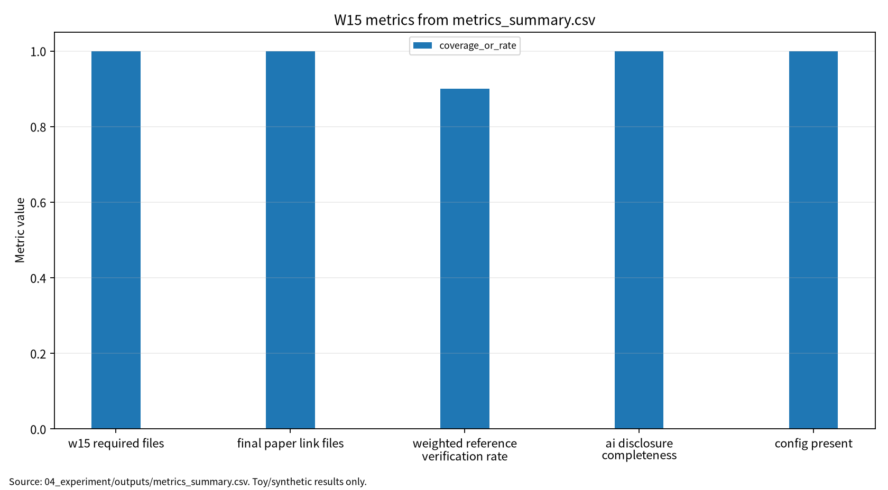

# W15 제출용 단일 보고서

## 연구평가·재현성·설명가능성(XAI)·논문 구성

## 0. 메타정보

| 항목 | 내용 |
|---|---|
| 주차 | W15 |
| 보고서 제목 | 연구평가·재현성·설명가능성(XAI)·논문 구성 |
| 과목 범위 | AI 보안 |
| 작성자 | 박영세 |
| 학번 | 26200122 |
| 작성일 | 2026-06-26 |
| 문서 상태 | 주차별 단일 제출용 보고서 |
| 원본 관리 파일 | `03_weekly_reports/w15_reproducibility_xai_paper/07_week_submission/w15_submission_report.md` |
| Word/PDF 제출본 권장 위치 | `03_weekly_reports/w15_reproducibility_xai_paper/07_week_submission/exports/` |
| 관련 산출물 위치 | `03_weekly_reports/w15_reproducibility_xai_paper/` |
| 안전 범위 | 실제 개인정보, 실제 서비스 침해, 무단 API 공격, 실제 benchmark 오염 실험, 실제 XAI 공격 실험 제외 |
| PDF 검토 상태 | P01~P05 로컬 PDF blob 존재 확인. 제출 본문은 공식 DOI/URL, `paper_list.md`, 논문별 summary, 실험 보고서 기준으로 작성 |
| 제출 전 주의 | P03 로컬 PDF는 지정 논문과 다른 관련 보조 문헌 상태다. P05는 DOI 확인 상태이나 권호/issue는 최종 제출 전 ACM 페이지에서 재확인 필요 |

---

## 초록

본 보고서는 W15 주차의 연구평가, 재현성, 설명가능성(XAI), 논문 구성, 제출 전 감사 절차를 하나의 제출용 보고서로 통합한다. AI 보안 연구는 모델 성능 수치만으로 신뢰성을 확보할 수 없고, 참고문헌 DOI/URL 검증, benchmark contamination 가능성, hidden test leakage, 실행 config, seed, output log, AI 활용 고지, 표·그림·기말논문 연결 파일을 함께 관리해야 한다. 본 보고서는 W15 논문 5편을 바탕으로 LLM evaluation, ML lifecycle assurance, XAI core ideas, responsible XAI taxonomy, concept-based XAI를 연결하고, 실제 모델 학습이나 공격 재현 없이 local repository metadata를 사용한 안전한 감사 프로토콜로 W15 필수 산출물 47/47, 기말논문 연결 파일 9/9, local PDF 5개, DOI 확인 4건, DOI 부분 확인 1건, 가중 참고문헌 검증률 0.90, AI 활용 고지 완성도 11/11, seed 기록 42를 확인하였다. 이 결과는 LLM 또는 XAI 모델의 성능이 아니라 제출 준비 상태와 evidence chain의 완성도를 설명하는 감사 결과로 한정한다.

**키워드:** research evaluation, reproducibility, XAI, AI disclosure, citation verification, benchmark contamination, evidence chain, lifecycle assurance, final paper readiness

---

## 1. 한 문장 요약

W15는 AI 보안 연구의 성능 주장, 참고문헌 검증, 실행 로그, AI 활용 고지, 기말논문 표·그림을 제출 가능한 evidence chain으로 묶는 감사 주차다.

---

## 2. 학습 배경과 주차 목표

### 2.1 이번 주 주제의 위치

W15는 W01~W14에서 만든 논문 요약, 실험 보고서, 그래프, AI 활용 고지, 기말논문 연결 자료를 제출 가능한 연구 패키지로 통합하는 마무리 주차다. 앞선 주차들이 개별 AI 보안 주제의 실험·위협모형·평가 지표를 다루었다면, W15는 그 산출물들이 실제 논문 제출 관점에서 검증 가능한지 확인한다. 핵심은 “좋은 주장”이 아니라 “검증 가능한 증거”다.

### 2.2 강의계획서상 학습목표

- LLM evaluation과 benchmark contamination 문제를 이해한다.
- ML lifecycle assurance에서 요구되는 evidence chain을 정리한다.
- XAI의 fidelity, stability, user trust, accountability를 연구평가와 연결한다.
- Concept-based XAI가 human evaluation과 concept leakage 사이에서 갖는 trade-off를 정리한다.
- 기말논문 제출 전 DOI/URL, 실행 로그, AI 활용 고지, 표·그림, 주차별 반영 상태를 점검한다.

### 2.3 이번 주 핵심 질문

1. AI 보안 연구에서 성능 수치와 재현성 증거는 어떻게 연결되어야 하는가?
2. Benchmark contamination과 hidden test leakage는 소규모 수업 과제에서 어떻게 안전하게 점검할 수 있는가?
3. XAI 설명은 보안 증거인가, 아니면 새로운 정보노출 공격면인가?
4. AI 활용 고지와 참고문헌 검증을 평가 루브릭에 넣을 수 있는가?
5. 기말논문 제출본에 필요한 최소 evidence chain은 무엇인가?

---

## 3. 논문 5편의 서술형 종합 요약

### 3.1 P01. A Survey on Evaluation of Large Language Models

P01은 LLM evaluation의 기본 축을 정리하는 문헌이다. LLM 평가는 단일 benchmark score가 아니라 task coverage, reasoning, knowledge, robustness, safety, hallucination, fairness, privacy, human evaluation, benchmark contamination을 함께 고려해야 한다. 동일 모델이라도 prompt format, decoding setting, benchmark 출처, 평가 반복 여부에 따라 결과가 달라질 수 있다.

보안 관점에서 P01은 W15의 평가 오염 점검 근거다. Benchmark contamination, hidden test leakage, repeated querying, prompt leakage가 있으면 평가 수치가 실제 일반화 성능을 과장할 수 있다. 따라서 기말논문에서는 평가 데이터 출처, 평가 방식, 제한 조건, 산출물 보관 위치를 함께 기록해야 한다.

### 3.2 P02. Assuring the Machine Learning Lifecycle: Desiderata, Methods, and Challenges

P02는 ML lifecycle assurance를 다루는 핵심 문헌이다. ML 시스템은 데이터 수집, 학습, 검증, 배포, 모니터링, 유지보수 단계가 연결된 생명주기형 시스템이다. Assurance는 단순 model accuracy 검증이 아니라 requirement, data, model, test, deployment, monitoring, governance evidence를 함께 요구한다.

보안 관점에서 P02는 W15의 evidence chain 근거다. AI 보안 연구에서 config, seed, data provenance, output log, model artifact, AI disclosure, citation verification은 모두 assurance evidence가 된다. 제출용 보고서는 단순 요약물이 아니라 연구 주장과 증거가 연결된 audit trail을 포함해야 한다.

### 3.3 P03. Explainable AI: Core Ideas, Techniques, and Solutions

P03은 XAI의 core idea, technique, solution을 정리하는 공식 DOI 기준 문헌이다. XAI는 black-box 모델의 판단 근거를 사람이 이해할 수 있는 형태로 제공하려는 접근이며, feature attribution, surrogate model, example-based explanation, rule extraction, concept explanation 등 다양한 기법을 포함한다.

보안 관점에서 P03은 설명가능성이 곧 안전성을 의미하지 않는다는 점을 보여준다. Explanation fidelity, stability, human interpretability, privacy leakage, explanation manipulation 가능성을 함께 보아야 한다. 단, 현재 로컬 PDF는 Mersha et al. 관련 보조 문헌이므로 최종 제출 전 지정 논문 원문 또는 공식 페이지를 재확인해야 한다.

### 3.4 P04. Explainable Artificial Intelligence (XAI): Concepts, Taxonomies, Opportunities and Challenges toward Responsible AI

P04는 responsible AI 관점에서 XAI의 개념, taxonomy, opportunity, challenge를 정리한다. XAI는 transparency와 trust를 높이는 도구이지만, 동시에 privacy, fairness, accountability, usability, domain expert interpretation과 연결된다. 설명이 제공된다고 해서 모델이 공정하거나 안전하거나 책임 있게 운영된다는 뜻은 아니다.

보안 관점에서 P04는 W15의 AI 활용 고지 및 human review 근거다. 설명가능성은 최종 판단을 대체하지 않고 사람이 검토할 수 있는 evidence를 제공해야 한다. 따라서 논문에는 설명의 목적, 사용 대상, 한계, 오용 가능성, 책임 소재를 함께 기록해야 한다.

### 3.5 P05. Concept-based Explainable Artificial Intelligence: A Survey

P05는 concept-based XAI를 정리하는 문헌이다. Concept-based explanation은 feature나 pixel보다 사람이 이해하기 쉬운 concept 단위로 모델의 판단 근거를 설명한다. 이는 human evaluation 가능성을 높일 수 있지만, concept definition, concept dataset, concept leakage, annotation cost, domain dependency 문제가 있다.

보안 관점에서 P05는 기말논문의 설명가능성 평가 확장 근거다. Concept 기반 설명은 의료, 보안, 법률처럼 전문가 검토가 필요한 영역에서 유용할 수 있지만, concept 자체가 민감정보나 취약한 decision shortcut을 드러낼 수 있다. P05는 DOI 확인 상태이나 최종 ACM 권호/issue 표기는 제출 전 재확인한다.

---

## 4. 논문 간 연결 관계

W15 논문 5편은 다음 흐름으로 연결된다.

```text
LLM evaluation과 benchmark contamination
→ ML lifecycle assurance와 evidence chain
→ XAI core ideas와 explanation evidence
→ Responsible XAI와 accountability
→ Concept-based XAI와 human evaluation
```

P01은 평가 오염과 LLM evaluation discipline을 제공한다. P02는 데이터·모델·배포·모니터링 전 과정의 assurance evidence를 제공한다. P03과 P04는 XAI의 기본 기법과 책임 있는 설명가능성 관점을 제공한다. P05는 concept 기반 설명을 통해 human evaluation 가능성과 concept leakage 위험을 함께 보여준다. 이 다섯 문헌을 종합하면 W15의 핵심 메시지는 “평가와 설명은 결과가 아니라 증거이며, 증거는 DOI, config, seed, log, output, AI disclosure와 함께 남을 때 신뢰할 수 있다”는 것이다.

---

## 5. AI 원리 70% 정리

AI 연구평가는 모델 성능만 측정하는 것이 아니라 evaluation protocol, benchmark provenance, hidden test protection, reproducibility evidence, explanation evidence를 함께 관리하는 과정이다. LLM evaluation은 benchmark contamination을 경계해야 하고, ML lifecycle assurance는 data/model/deployment evidence를 요구한다. XAI는 모델 판단을 설명하는 도구지만, explanation fidelity와 stability가 확보되지 않으면 오히려 misleading evidence가 될 수 있다.

### 5.1 핵심 수식

참고문헌 검증률은 확인된 DOI/URL 비율로 기록할 수 있다.

$$
RefVerifyRate=\frac{N_{verified}}{N_{refs}}
$$

가중 참고문헌 검증률은 확인, 부분 확인, 미확인을 가중치로 반영한다.

$$
WeightedRefRate=\frac{N_{ok}+0.5N_{partial}}{N_{refs}}
$$

재현성 evidence coverage는 필수 evidence 항목 중 존재하는 항목 비율이다.

$$
ReproCoverage=\frac{N_{evidence}}{N_{required}}
$$

AI 활용 고지 완성도는 필수 고지 항목 중 작성된 항목의 비율이다.

$$
DisclosureComplete=\frac{N_{filled}}{N_{disclosure}}
$$

제출 산출물 완성도는 필수 산출물 중 존재하는 파일 비율이다.

$$
ArtifactComplete=\frac{N_{files}}{N_{required\_files}}
$$

| 기호 | 의미 |
|---|---|
| $N_{verified}$ | DOI/URL이 확인된 참고문헌 수 |
| $N_{partial}$ | 부분 확인 참고문헌 수 |
| $N_{refs}$ | 전체 참고문헌 수 |
| $N_{evidence}$ | 존재하는 재현성 증거 수 |
| $N_{disclosure}$ | AI 활용 고지 필수 항목 수 |
| $N_{files}$ | 존재하는 필수 산출물 수 |

### 5.2 핵심 개념과 보안 연결

| 구분 | 핵심 내용 | 보안 연결 |
|---|---|---|
| LLM evaluation | 평가 대상, benchmark, 평가 방식을 분리 | benchmark contamination, hidden test leakage |
| ML lifecycle assurance | 데이터, 모델, 검증, 배포 evidence chain | reproducibility, auditability |
| XAI | explanation fidelity, stability, user trust | explanation leakage, misleading explanation |
| Responsible XAI | transparency, privacy, fairness, accountability | human review, 책임 소재 |
| Concept-based XAI | concept 단위 설명과 human evaluation | concept leakage, annotation cost |

---

## 6. 보안 이슈 30% 정리

W15의 보안 이슈는 모델 공격 재현이 아니라 연구 제출물의 신뢰성 관리다. Benchmark contamination, hidden test leakage, fabricated citation, explanation leakage, missing AI disclosure는 논문 자체의 신뢰성을 낮추는 위험이다. 따라서 제출 전에는 DOI/URL 검증, 산출물 존재 여부, 실행 로그, AI 활용 고지, 표·그림, 한계 문장이 함께 검토되어야 한다.

| 이슈 | 위험 | 제출 전 점검 |
|---|---|---|
| Benchmark contamination | 평가 수치 과장 | 평가셋 출처와 노출 가능성 명시 |
| Hidden test leakage | 반복 질의로 평가 무효화 | hidden test 보호와 반복 질의 위험 명시 |
| Fabricated citation | 존재하지 않거나 다른 논문 인용 | DOI/URL/로컬 PDF 검증표 작성 |
| Explanation leakage | 설명이 민감 feature나 shortcut 노출 | XAI 공개 범위와 human review 필요 |
| Missing AI disclosure | 연구윤리 불명확 | AI 활용 고지서 작성 |
| Evidence gap | 재현 불가능한 주장 | config, seed, output, run log 보존 |

---

## 7. Research Track 분석

### 7.1 연구문제

- RQ1. LLM/RAG 생명주기에서 prompt injection, benchmark contamination, privacy leakage가 발생하는 단계와 최소 평가항목은 무엇인가?
- RQ2. 기말논문 제출 전 참고문헌 검증률, 재현성 evidence coverage, AI disclosure completeness를 어떻게 산출할 것인가?
- RQ3. XAI 설명을 보안 evidence로 사용할 때 어떤 한계와 오용 가능성을 명시해야 하는가?
- RQ4. 주차별 보고서 산출물을 최종 KCI/SCI형 논문 evidence chain으로 연결하려면 어떤 표·그림·로그가 필요한가?

### 7.2 위협모형

| 항목 | 내용 |
|---|---|
| 보호 자산 | 참고문헌, DOI/URL, local PDF 상태, config, seed, output, run log, AI disclosure, final paper draft |
| 공격자 또는 오류 원인 | fabricated citation, stale metadata, benchmark leakage, missing log, AI disclosure omission, local PDF mismatch |
| 공격 또는 오류 경로 | 문헌 수집 → 요약 → 실험 로그 → 표·그림 → 기말논문 초안 → 제출본 |
| 방어자 능력 | DOI/URL 검증, PDF 상태 표시, output cross-check, AI disclosure, reproducibility checklist |
| 제외 범위 | 실제 개인정보, 실제 서비스 침해, 무단 API 공격, 실제 benchmark 오염 실험 |

### 7.3 평가축

| 평가축 | 질문 | 대표 지표 또는 증거 |
|---|---|---|
| Artifact readiness | 제출 산출물이 모두 존재하는가 | W15 required files |
| Final paper linkage | 기말논문 연결 파일이 있는가 | final paper link files |
| Reference integrity | DOI/URL이 확인되었는가 | DOI confirmed, partial, unverified |
| Weighted verification | 부분 확인을 반영한 검증률은 얼마인가 | weighted reference verification rate |
| AI disclosure | AI 활용 고지가 충분한가 | disclosure completeness |
| Reproducibility | config와 seed가 기록되었는가 | config_present, seed_recorded |

### 7.4 재현성

재현성을 위해 config, seed, run log, metrics summary, results JSON, AI disclosure draft, DOI check, final paper bridge, weekly reflection table을 보존한다. W15 감사는 로컬 repository metadata만 사용하고, 실제 개인정보나 외부 API 질의를 사용하지 않는다.

---

## 8. 실습 보고서 및 그래프 수치 검증

본 실습은 모델을 학습하거나 공격을 실행하는 실험이 아니라, 기말논문 제출 직전의 재현성·참고문헌·AI 활용 고지·발표/제출 산출물 준비 상태를 감사하는 안전한 로컬 점검이다. 결과는 산출물 존재 여부와 검증 상태만 나타내며, LLM 또는 XAI 모델의 성능을 주장하지 않는다.

### 8.1 실습 설계

| 항목 | 내용 |
|---|---|
| 데이터 | 로컬 repository metadata |
| 실행 환경 | Python 3.11, 표준 라이브러리 기반 |
| Seed | 42 |
| 산출물 | `outputs/metrics_summary.csv`, `outputs/results.json`, `outputs/run_log.md` |
| 제외 범위 | 실제 개인정보, 실제 서비스 침해, 무단 API 공격, 실제 benchmark 오염 실험 |

### 8.2 감사 결과 수치

| Category | Metric | Value | Status | 해석 |
|---|---|---:|---|---|
| artifact | w15_required_files | 47/47 | complete | W15 필수 산출물 존재 |
| artifact | final_paper_link_files | 9/9 | complete | 기말논문 연결 파일 존재 |
| paper | local_pdf_count | 5 | complete | 로컬 PDF 5개 확인 |
| reference | doi_confirmed | 4 | complete | P01/P02/P04/P05 확인 |
| reference | doi_partial | 1 | partial | P03은 로컬 PDF 차이로 부분 확인 |
| reference | doi_unverified | 0 | complete | 미검증 DOI 없음 |
| reference | weighted_reference_verification_rate | 0.90 | partial | 부분 확인을 0.5로 반영한 가중 검증률 |
| ai_disclosure | ai_disclosure_completeness | 11/11 | complete | AI 활용 고지 필수 항목 완료 |
| reproducibility | config_present | 1 | complete | config 파일 존재 |
| reproducibility | seed_recorded | 42 | complete | seed 기록 |

### 8.3 그래프 수치 검증

현재 제출 보고서의 그래프는 `assets/w15_metric_chart.png`를 참조한다. 확인 가능한 PNG 그래프 파일은 존재한다. 그래프는 `04_experiment/outputs/metrics_summary.csv` 기반으로 생성된 제출용 차트이며, W15의 경우 모델 성능 그래프가 아니라 제출 감사 항목의 수치 요약으로 해석해야 한다.

| 점검 항목 | 보고서 값 | 실험 보고서 값 | 확인 결과 |
|---|---:|---:|---|
| W15 필수 산출물 | 47/47 | 47/47 | 일치 |
| 기말논문 연결 파일 | 9/9 | 9/9 | 일치 |
| 로컬 PDF 수 | 5 | 5 | 일치 |
| DOI 확인 | 4 | 4 | 일치 |
| DOI 부분 확인 | 1 | 1 | 일치 |
| DOI 미검증 | 0 | 0 | 일치 |
| 가중 참고문헌 검증률 | 0.90 | 0.90 | 일치 |
| AI 활용 고지 완성도 | 11/11 | 11/11 | 일치 |
| config 파일 존재 | 1 | 1 | 일치 |
| 기록된 seed | 42 | 42 | 일치 |

<!-- submission-metric-chart:start -->
**그림 1. W15 metrics summary chart**



출처: `04_experiment/outputs/metrics_summary.csv`. 이 그래프는 로컬 repository metadata 기반 감사 산출물이며 실제 공격 성능, LLM/XAI 모델 성능, 운영 환경 보안 성능으로 일반화하지 않는다.
<!-- submission-metric-chart:end -->

---

## 9. 기말논문 연결

최종 주제는 “LLM/RAG 기반 AI 시스템의 생명주기별 보안 위협과 재현성 중심 평가 프레임워크 연구”다. W15는 연구방법, 평가방법, 보안적 함의, 참고문헌 검증표, AI 활용 고지서에 직접 반영된다.

| 기말논문 장 | W15 반영 내용 |
|---|---|
| 1장 서론 | 평가 신뢰성, 재현성, AI 활용 고지 필요성 제시 |
| 2장 관련연구 | LLM evaluation, ML assurance, XAI, concept-based XAI 정리 |
| 3장 위협모형 | benchmark contamination, hidden test leakage, fabricated citation, explanation leakage |
| 4장 연구방법 | 산출물 감사, DOI 검증, AI disclosure, reproducibility checklist |
| 5장 결과 | W15 required files, DOI status, disclosure completeness, seed/config 기록 |
| 6장 결론 | AI 보안 연구는 evidence chain으로 제출되어야 함 |

---

## 10. AI 도구 활용 기록

AI 도구는 문헌 요약, 코드 점검, 문장 구조화, 그래프 생성 보조에 사용하였다. 모든 DOI/URL, 실험 수치, 본문 인용, 결론은 작성자가 outputs 파일과 로컬 참고문헌 검증표를 대조하여 검증한다.

| 항목 | 내용 |
|---|---|
| 사용 도구명 | Codex, ChatGPT 계열 도구 |
| 사용 목적 | 문헌 요약 정리, 보고서 구조화, 안전한 repository metadata 감사 결과 표기 점검, 그래프 생성 보조, 제출 전 체크리스트 정리 |
| AI 산출물 반영 위치 | `07_week_submission/w15_submission_report.md`, `07_week_submission/assets/w15_metric_chart.png`, `05_ai_worklog/ai_disclosure_draft.md` |
| 본인 수정 내용 | 문헌 상태 확인, 실험 수치와 outputs 대조, 안전 범위와 한계 문장 확인, 최종 제출 전 미확정 문헌 분리 |
| 사실관계 검증 방법 | `01_papers/paper_list.md`, `01_papers/doi_check.md`, 강의계획서 문헌표 대조 |
| 실험결과 검증 방법 | `04_experiment/experiment_report.md`, `04_experiment/outputs/metrics_summary.csv`, `results.json`, `run_log.md`의 수치와 보고서 표기 대조 |
| 최종 책임 확인 | AI 산출물은 초안 보조이며 최종 제출자는 원고 내용, 인용, 실험결과, 연구윤리 책임을 확인한다. |

---

## 11. 제출 전 자기 점검표

| 점검 항목 | 상태 | 비고 |
|---|---|---|
| 메타정보 작성 | 완료 | 작성일 2026-06-26 반영 |
| 초록 및 키워드 작성 | 완료 |  |
| AI 원리 70% 정리 | 완료 | 핵심 수식 추가 |
| 보안 이슈 30% 정리 | 완료 |  |
| 논문 5편 서술형 요약 | 완료 |  |
| 논문 간 연결 관계 작성 | 완료 |  |
| Research Track 5요소 작성 | 완료 | 연구문제, 위협모형, 평가방법, 재현성, 한계 |
| P01~P05 PDF blob 확인 | 완료 | GitHub 파일 존재 확인. 원문 PDF 저작권/배포 정책 별도 검토 필요 |
| P01 DOI/URL 검증 | 완료 | ACM TIST, 강의자료 CSUR 표기 차이 유지 |
| P02 DOI/URL 검증 | 완료 | ACM CSUR |
| P03 DOI/URL 검증 | 완료 / 확인 필요 | 공식 DOI 확인, 로컬 PDF는 Mersha et al. 관련 보조 문헌 |
| P04 DOI/URL 검증 | 완료 | Information Fusion |
| P05 DOI/URL 검증 | 완료 / 확인 필요 | DOI 확인, ACM 권호/issue 최종 확인 필요 |
| 실험 outputs 파일 존재 확인 | 완료 | metrics_summary/results/run_log 존재 |
| 실험 결과와 보고서 수치 일치 | 완료 | 실험 보고서 수치 기준 반영 |
| 그래프 파일 존재 확인 | 완료 | `assets/w15_metric_chart.png` 존재 |
| AI 활용 고지 작성 | 완료 | 11/11 |
| 기말논문 연결 파일 | 완료 | 9/9 |
| DOCX/PDF 제출본 생성 | 필요 | `07_week_submission/exports/` 권장 |
| 최종 사람이 검토할 항목 표시 | 완료 | P03 원문, P05 권호/issue, PDF 보관 정책, Word/PDF 렌더링 |

---

## 12. 참고문헌 검증표

| 번호 | 참고문헌 | DOI/URL | 상태 | 비고 |
|---:|---|---|---|---|
| [1] | Yupeng Chang et al., “A Survey on Evaluation of Large Language Models,” ACM Transactions on Intelligent Systems and Technology, 2024 | `https://doi.org/10.1145/3641289` | DOI 확인 | 강의자료의 ACM CSUR 표기와 차이 |
| [2] | Rob Ashmore, Radu Calinescu, Colin Paterson, “Assuring the Machine Learning Lifecycle: Desiderata, Methods, and Challenges,” ACM Computing Surveys, 2021 | `https://doi.org/10.1145/3453444` | DOI 확인 |  |
| [3] | Rudresh Dwivedi et al., “Explainable AI: Core Ideas, Techniques, and Solutions,” ACM Computing Surveys, 2023 | `https://doi.org/10.1145/3561048` | DOI 확인 / 부분 확인 | 로컬 PDF는 Mersha et al. 관련 보조 문헌 |
| [4] | Alejandro Barredo Arrieta et al., “Explainable Artificial Intelligence (XAI): Concepts, Taxonomies, Opportunities and Challenges toward Responsible AI,” Information Fusion, 2020 | `https://doi.org/10.1016/j.inffus.2019.12.012` | DOI 확인 |  |
| [5] | Eleonora Poeta et al., “Concept-based Explainable Artificial Intelligence: A Survey,” ACM Computing Surveys, 2025 | `https://doi.org/10.1145/3774643`; arXiv `https://arxiv.org/abs/2312.12936` | DOI 확인 | 권호/issue 최종 확인 필요 |

---

## 13. 부록 A. KCI 기말논문 형식 전환 아이디어

| 항목 | 초안 |
|---|---|
| 국문 제목 | LLM/RAG 기반 AI 시스템의 생명주기별 보안 위협과 재현성 중심 평가 프레임워크 연구 |
| 영문 제목 | A Lifecycle-Based Security Threat and Reproducibility-Centered Evaluation Framework for LLM/RAG-Based AI Systems |
| 연구방법 | 문헌분석, 위협모형, W15 산출물 감사, 한계분석 |
| 핵심 지표 | 참고문헌 검증률, 재현성 evidence coverage, AI disclosure completeness, final paper linkage |
| 키워드 | LLM 보안, RAG, 재현성, 참고문헌 검증, AI 활용 고지, 벤치마크 오염 |

---

## 14. 부록 B. SCI 확장 가능성

SCI 확장을 위해서는 공개 benchmark contamination audit, 공개 문서 기반 RAG 실험, privacy leakage benchmark, XAI stability metric, 반복 seed와 confidence interval, 공개 artifact release가 필요하다. W15 수치는 제출 준비 감사 결과이므로 SCI 실증 결과로 직접 일반화하지 않는다.

| 확장 항목 | 필요 내용 |
|---|---|
| Benchmark audit | 공개 benchmark와 training data overlap 점검 |
| RAG experiment | 공개 문서 기반 prompt injection 안전 평가 |
| Privacy leakage | synthetic 또는 공개 benchmark 기반 leakage metric |
| XAI stability | explanation consistency와 user study 설계 |
| Reproducibility | Docker, seed, artifact DOI, release checklist |

---

## 15. 부록 C. 제출 파일 위치와 변환 권장

| 파일 | 설명 |
|---|---|
| `07_week_submission/w15_submission_report.md` | 본 제출용 보고서 원본 |
| `07_week_submission/assets/w15_metric_chart.png` | 제출 보고서 그래프 |
| `04_experiment/experiment_report.md` | 실험/감사 근거 보고서 |
| `04_experiment/outputs/` | 감사 결과 근거 파일 위치 |
| `05_ai_worklog/ai_disclosure_draft.md` | AI 활용 고지 근거 |

Word 제출본은 다음 위치에 생성해 관리한다.

```text
03_weekly_reports/w15_reproducibility_xai_paper/07_week_submission/exports/w15_submission_report.docx
```

PDF 제출본은 Word에서 최종 육안 검수 후 다음 위치에 저장한다.

```text
03_weekly_reports/w15_reproducibility_xai_paper/07_week_submission/exports/w15_submission_report.pdf
```

수식은 GitHub와 Word 변환을 모두 고려하여 Markdown 표 안에 넣지 않고, `$$...$$` block math로 유지한다.
