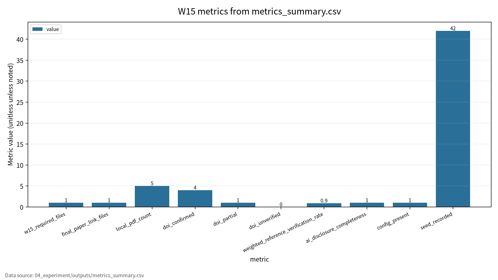
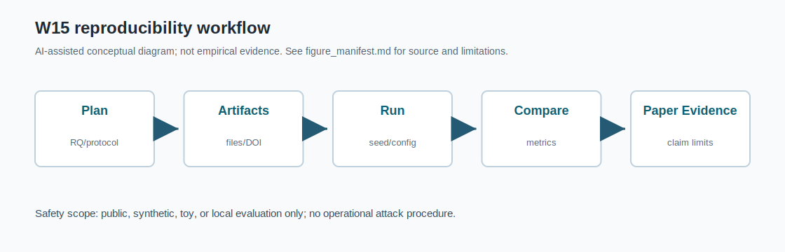

# W15 연구평가·재현성·XAI·논문 구성

AI 보안 연구의 신뢰성은 성능 수치보다 evidence chain에서 나온다.

---

## 오늘의 질문

- 평가 데이터는 오염되지 않았는가?
- 같은 조건에서 결과를 다시 확인할 수 있는가?
- XAI 설명은 믿을 만한가, 아니면 새 공격면인가?
- 참고문헌과 AI 활용 고지는 검증 가능한가?

---

## 논문 패킷 역할

| 논문 | 역할 |
|---|---|
| P01 | LLM evaluation과 benchmark contamination |
| P02 | ML lifecycle assurance와 재현성 증거 |
| P03 | XAI 핵심 문헌, 대체 PDF 검증 이슈 |
| P04 | XAI taxonomy와 Responsible AI |
| P05 | concept-based XAI와 설명 안정성 |

---

## AI 원리 70%

- Evaluation: 무엇을, 어디서, 어떻게 평가할지 정한다.
- Reproducibility: config, seed, log, outputs가 결론의 근거가 된다.
- XAI: 설명도 fidelity, stability, leakage risk를 평가해야 한다.
- Paper structure: contribution과 limitation이 연구 신뢰성을 만든다.

---

## 보안 이슈 30%

| 자산 | 위협 |
|---|---|
| Benchmark | contamination, hidden test leakage |
| Model/explanation | model leakage, explanation gaming |
| Paper | fabricated citation, unverifiable DOI |
| AI worklog | missing disclosure, 책임 추적 실패 |

---

## 로컬 감사 결과

| 항목 | 결과 |
|---|---:|
| W15 필수 산출물 | 47/47 |
| 기말논문 연결 파일 | 9/9 |
| 로컬 PDF | 5 |
| 가중 참고문헌 검증률 | 0.90 |
| AI 활용 고지 완성도 | 11/11 |

---

## 확인 필요 항목

- P03: 지정 논문 원문과 로컬 PDF 불일치
- P05: DOI 확인, 권호/issue 최종 확인 필요
- 기말논문: 국내 문헌 3편 이상 검증 필요
- public GitHub PDF 보관 정책 검토 필요

---

## 기말논문 연결

최종 주제: AI 보안 연구의 재현 가능한 생명주기 기반 평가 프레임워크

대상 위협:

- prompt injection
- benchmark contamination
- privacy leakage
- reproducibility failure

---

## 최종 Contribution

본 연구는 LLM/RAG 기반 AI 시스템의 데이터·평가·프롬프트 생명주기에서 prompt injection, benchmark contamination, privacy leakage 위협을 분석하고, 재현성 중심의 보안 평가 체크리스트를 제안한다.

---

## 결론

W15의 결론은 간단하다.

평가와 설명은 결과가 아니라 증거다. 증거는 DOI, config, seed, log, output, AI disclosure와 함께 남을 때 신뢰할 수 있다.

<!-- formula-visual-supplement:start -->
# 수식·그래프·그림 보강

- 보강 일자: 2026-06-23
- 수식은 표준 정의식 또는 검증 가능한 평가식으로만 작성했다.
- 그래프는 `04_experiment/outputs/metrics_summary.csv`의 기존 수치만 사용했다.
- 다이어그램은 AI-assisted conceptual diagram이며 사실 자료나 실험 결과처럼 해석하지 않는다.

### 핵심 수식: Reproducibility Completion Rate

$$
RepRate=\frac{\#\{\mathrm{required\ artifacts\ present}\}}{\#\{\mathrm{required\ artifacts}\}}
$$

| 기호 | 의미 |
|---|---|
| `RepRate` | 필수 산출물 보존 비율 |
| `required artifacts` | 실험 재현에 필요한 파일 집합 |
| `\#` | 개수 |
| `present` | 로컬 저장소에 존재 |

**직관적 의미:**  
재현성은 필요한 파일과 증거가 실제로 남아 있는지에서 출발한다.

**보안 관점 해석:**  
논문 주장에는 config, seed, DOI 검증, AI disclosure가 연결되어야 한다.

**평가 지표 연결:**  
w15_required_files, config_present, seed_recorded와 연결한다.

**한계와 가정:**  
local artifact completeness proxy이며 논문 품질 전체를 보증하지 않는다.

### 핵심 수식: Reference Verification와 Explanation Consistency Proxy

$$
V_{ref}=\frac{N_{confirmed}+0.5N_{partial}}{N_{total}},
\qquad
Consist=sim(A_r(x),A_{r'}(x))
$$

| 기호 | 의미 |
|---|---|
| `V_{ref}` | 로컬 참고문헌 검증률 proxy |
| `N_{confirmed}` | DOI 확인 완료 수 |
| `N_{partial}` | 부분 확인 수 |
| `A_r(x)` | run r의 explanation |
| `Consist` | 설명 일관성 proxy |

**직관적 의미:**  
참고문헌 검증률은 인용 근거의 신뢰도를 관리하는 local rubric이다. Explanation consistency는 반복 실행 간 설명이 얼마나 비슷한지 보는 proxy다.

**보안 관점 해석:**  
재현성과 XAI는 실험값 재현, 근거 문헌, 설명 안정성을 함께 요구한다.

**평가 지표 연결:**  
weighted_reference_verification_rate, ai_disclosure_completeness, seed_recorded와 연결한다.

**한계와 가정:**  
V_ref는 저장소 local scoring이며 외부 학술 검증을 대체하지 않는다.

### 표 수치 기반 그래프

그래프는 numeric 또는 ratio로 변환 가능한 reproducibility evidence만 표시한다. `47/47`, `9/9`, `11/11` 같은 비율은 1.0으로 환산해 completeness proxy로만 그렸다. 원문 DOI 세부 검증과 citation 형식은 별도 사람 검토가 필요하다.

### Threat Model / Pipeline Diagram

이 다이어그램은 `reproducibility workflow`를 발표용으로 요약한 개념도다. 데이터 흐름, 평가 지표, 한계 표시는 `assets/figure_manifest.md`에도 기록했다.

### 확인 필요

- 비율 변환 값은 local completeness proxy이며 학술적 품질 보증 점수가 아니다.
- 논문별 원문 절·쪽·그림 번호는 최종 제출 전 사람 검토가 필요하다.
<!-- formula-visual-supplement:end -->
