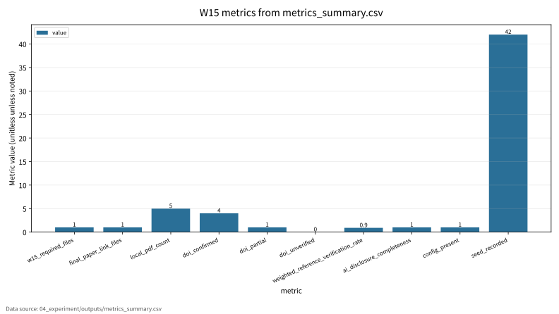

# W15 Reproducibility & XAI Paper Integration

Research Question: Reproducibility & XAI Paper Integration에서 성능 지표와 보안 지표를 어떻게 분리해 평가할 수 있는가?

---

## Core Formula

### Reproducibility Completion Rate

$$
RepRate=\frac{\#\{\mathrm{required\ artifacts\ present}\}}{\#\{\mathrm{required\ artifacts}\}}
$$

| 기호 | 의미 |
|---|---|
| `RepRate` | 필수 산출물 보존 비율 |
| `required artifacts` | 실험 재현에 필요한 파일 집합 |
| `\#` | 개수 |
| `present` | 로컬 저장소에 존재 |

- 직관적 의미: 재현성은 필요한 파일과 증거가 실제로 남아 있는지에서 출발한다.
- 보안적 의미: 논문 주장에는 config, seed, DOI 검증, AI disclosure가 연결되어야 한다.
- 평가 지표 연결: w15_required_files, config_present, seed_recorded와 연결한다.
- 한계: local artifact completeness proxy이며 논문 품질 전체를 보증하지 않는다.

---

## Threat Model

- Diagram: reproducibility workflow
- Stages: Plan, Artifacts, Run, Compare, Paper Evidence
- 안전 범위: public, synthetic, toy, local evaluation

---

## Evaluation Protocol

- Metrics: value
- 데이터 출처: `04_experiment/outputs/metrics_summary.csv`

| metric | value | status |
| --- | --- | --- |
| w15_required_files | 47/47 | complete |
| final_paper_link_files | 9/9 | complete |
| local_pdf_count | 5 | complete |
| doi_confirmed | 4 | complete |
| doi_partial | 1 | partial |

---

## Figure-first Result

그래프는 numeric 또는 ratio로 변환 가능한 reproducibility evidence만 표시한다. `47/47`, `9/9`, `11/11` 같은 비율은 1.0으로 환산해 completeness proxy로만 그렸다. 원문 DOI 세부 검증과 citation 형식은 별도 사람 검토가 필요하다.

---

## Paper Map

| ID | 논문 역할 | 발표에서 쓰는 위치 | 기말논문 연결 |
|---|---|---|---|
| P01 | 핵심 이론 | Background / Core Formula | Reproducibility & XAI Paper Integration의 관련연구 뼈대 |
| P02 | 위협 분류 | Threat Model | 공격자·방어자·보호자산 정의 |
| P03 | 평가 지표 | Evaluation Protocol | 정량 지표와 로그 근거 연결 |
| P04 | 공격·방어 사례 | Security Implication | 보안적 함의와 방어 한계 |
| P05 | 재현성·정책 근거 | Limitation | 확인 필요 항목과 제출 전 검증 |

---

## Limitation

- 비율 변환 값은 local completeness proxy이며 학술적 품질 보증 점수가 아니다.
- 원문 DOI/URL과 formal guarantee는 최종 제출 전 확인 필요.
- 실제 운영 시스템 악용 절차나 무단 API 질의 절차는 포함하지 않음.

---

## Final Takeaway

W15의 핵심은 `value`를 성능·보안·재현성 근거로 분리해 기말논문의 평가방법에 연결하는 것이다.
