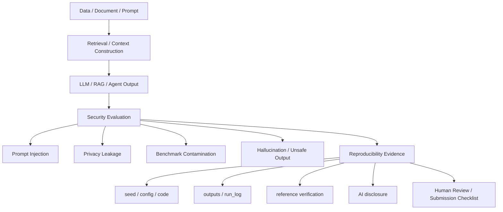

# 기말 모의투고 논문 초안

## 제목

국문 제목: AI 보안 연구의 재현 가능한 생명주기 기반 평가 프레임워크: LLM·RAG·프라이버시 위협 중심

영문 제목: A Reproducible Lifecycle-Based Evaluation Framework for AI Security: Focusing on LLM, RAG, and Privacy Threats

---

## 국문초록

본 연구는 AI 보안 세미나 W01-W15 final 보고서를 생명주기 관점에서 재점검하고, 그중 LLM/RAG 기반 AI 시스템에서 발생할 수 있는 프롬프트 인젝션, 평가오염, 프라이버시 누수, 재현성 실패를 핵심 사례로 정리한다. 기존 문헌은 개별 위협과 방어를 폭넓게 분류하지만, 연구 보고서 작성 단계에서 성능·보안성·프라이버시·재현성·AI 활용 고지를 함께 점검하는 절차는 분산되어 있다. 이에 본 연구는 W01-W15의 공통 이론과 수식·평가지표를 배경으로 삼고, W07, W08, W11, W14, W15를 핵심 축으로 하여 위협모형, 평가항목, 참고문헌 검증표, AI 활용 고지서로 구성된 재현 가능한 평가 프레임워크를 제안한다.

---

## 영문초록

This study proposes a reproducible lifecycle-based evaluation framework for AI security by auditing all W01-W15 final weekly reports and then focusing on LLM and RAG systems as core cases. It organizes prompt injection, benchmark contamination, privacy leakage, and reproducibility failures across the AI lifecycle. Existing surveys provide useful taxonomies of attacks and defenses, but the connection between threat classification, evaluation metrics, reproducibility records, reference verification, and AI disclosure is often left fragmented. Based on the common theories, formulas, and metrics from W01-W15, with deeper use of weekly reports on LLM security, RAG prompt injection, privacy attacks, MLOps supply-chain risks, and research reproducibility, this study derives a threat model, evaluation criteria, a reference verification table, and an AI disclosure checklist. The framework emphasizes utility, attack impact, privacy leakage, robustness, cost, auditability, and reproducibility as joint evaluation dimensions. The proposed approach is intended for safe literature-based analysis and toy evaluation settings, excluding real service compromise, personal data use, and unverified experimental claims. By connecting technical security evaluation with research ethics controls, the study aims to support small-scale AI security papers that are transparent, auditable, and suitable for domestic mock-journal submission.

---

## 키워드

국문 키워드: AI 보안, LLM, RAG, 프롬프트 인젝션, 재현성, 연구윤리

영문 키워드: AI Security, LLM, RAG, Prompt Injection, Reproducibility, Research Ethics

---

## 1. 서론

### 1.1 연구 배경

LLM과 RAG 기반 시스템은 학습데이터, 프롬프트, 검색 문서, 평가셋, 배포 파이프라인이 연결된 복합 시스템이다. 이 구조에서는 단일 모델 성능만으로 보안성을 판단하기 어렵다.

### 1.2 문제 제기

프롬프트 인젝션, benchmark contamination, privacy leakage, 재현성 실패는 서로 다른 단계에서 발생하지만 최종적으로 모델 신뢰성과 연구 결과의 무결성을 함께 훼손한다.

### 1.3 연구 목적

본 연구는 AI 보안 위협을 생명주기 관점에서 정리하고, 성능·공격 영향·프라이버시·재현성·AI 활용 고지를 함께 확인하는 평가 프레임워크를 제안한다.

### 1.4 논문 구성

2장은 관련연구, 3장은 연구문제, 4장은 연구방법과 위협모형, 5장은 분석 및 실험 설계, 6장은 보안적 함의, 7장은 결론을 제시한다.

---

## 2. 관련연구

### 2.1 국내 연구

국내 연구는 최종 제출 전 KCI, DBpia, RISS에서 AI 보안, 개인정보보호, 연구윤리 관련 문헌을 검증해 보완한다. 현재 단계에서는 허위 인용 방지를 위해 구체 제목을 확정하지 않는다.

### 2.2 해외 연구

해외 연구는 W01-W15 final 보고서의 75편 문헌을 공통 배경으로 점검하되, 기말 논문의 중심 주제와 직접 연결되는 LLM 평가, LLM 보안·프라이버시, RAG·프롬프트 인젝션, 멤버십 추론, MLOps 재현성 문헌을 심화 정리한다. 딥러닝·최적화·컴퓨터비전·Transformer·SSL·생성모형 문헌은 보안 위협이 모델 생명주기 전반에 걸쳐 발생한다는 이론 배경으로 활용한다. DRL, 연합학습, 신경망 검증, 모델 도난·워터마킹 문헌은 평가 지표의 확장성과 보안 속성별 해석을 보완한다.

논문별 핵심 수식과 알고리즘은 `04_final_paper/04_methodology_experiment/formula_metric_supplement.md`에 별도로 정리했다. 이 보충표는 원문 수식의 직접 인용이 아니라, 보고서 설명을 쉽게 하기 위한 대표 수식과 지표 정의이며, 최종 인용 전 원문 쪽/절 번호를 다시 확인한다.

### 2.3 선행연구 비교

표 1. LLM/RAG 기반 AI 시스템의 생명주기별 보안 위협과 평가 지표

| 생명주기 단계 | 보호 자산 | 주요 위협 | 평가/감사 지표 | 관련 근거 |
|---|---|---|---|---|
| Data / Document | 학습·검색 문서, 공개 데이터, synthetic data | 오염 문서, 개인정보 포함, 출처 불명 데이터 | provenance 확인, 민감정보 제거, 중복 점검 | W08, W11 |
| Retrieval / Context Construction | 검색 결과, context window, prompt template | 간접 prompt injection, context hijacking | 출처 검증률, 위험 문서 차단률, human approval 기록 | W08 |
| LLM / RAG / Agent Output | 모델 응답, tool call, agent action | unsafe output, hallucination, 정책 우회 | clean response rate, unsafe output flag, human review | W07, W08 |
| Security Evaluation | benchmark, hidden test, 평가 rubric | benchmark contamination, hidden test leakage | contamination check, reproducibility evidence coverage | W15, [1] |
| XAI / Explanation | explanation output, concept, saliency | explanation leakage, misleading explanation | fidelity, stability, concept completeness, disclosure risk | W12, W15, [3]-[5] |
| Reproducibility Evidence | config, seed, code, outputs, run log | 실행 재현 불가, 결과 과장 | config/seed/log 보존, reference verification rate | W14, W15, [2] |
| Submission / Ethics | 참고문헌, AI worklog, AI disclosure | fabricated citation, AI 활용 은폐 | DOI/URL 검증, AI 활용 고지 완성도, 최종 human review | W15 |

### 2.4 기존 연구의 한계

개별 survey는 위협과 방어를 폭넓게 다루지만, 제출 가능한 연구 프로세스에서 참고문헌 검증, 실험 재현성, AI 활용 고지를 통합하는 절차는 충분히 구체화되어 있지 않다. 또한 많은 survey가 taxonomy 중심이라 수식·지표의 직관적 의미가 보고서 작성 과정에서 생략되기 쉽다.

### 2.5 본 연구의 차별점

본 연구는 공격 절차를 상세히 제공하지 않고도 보안 평가가 가능하도록 위협모형, 평가 지표, 재현성 기록, 연구윤리 점검을 하나의 프레임워크로 묶는다. 특히 W01-W15의 주요 수식과 지표를 쉬운 설명으로 재정리해, 독자가 ASR, leakage, DP, robust accuracy, fidelity, reproducibility coverage 같은 지표를 같은 기준에서 해석할 수 있게 한다.

---

## 3. 연구문제 또는 연구가설

### 3.1 연구문제

> RQ1. LLM/RAG 기반 AI 시스템의 생명주기에서 prompt injection, benchmark contamination, privacy leakage는 각각 어느 단계에서 발생하는가?

> RQ2. AI 보안 연구에서 clean performance, attack impact, privacy leakage, reproducibility를 함께 평가하려면 어떤 공통 평가 항목이 필요한가?

> RQ3. 허위 인용, 실험결과 조작, AI 활용 은폐를 줄이기 위한 참고문헌·실험·AI 고지 체크리스트는 어떻게 구성되어야 하는가?

### 3.2 연구범위

공개 문헌과 공개 또는 synthetic data 기반 toy evaluation을 대상으로 한다. 실제 개인정보, 실제 서비스 침해, 무단 API 공격은 제외한다.

---

## 4. 연구방법

### 4.1 연구대상

LLM/RAG 기반 AI 응용과 연구용 평가 파이프라인을 중심 대상으로 한다. 단, 분석 배경은 W01-W15 final 보고서 전체로 확장해 딥러닝, 최적화, 생성모형, 강화학습, 연합학습, 프라이버시, 검증, MLOps까지의 생명주기 위협을 함께 본다.

### 4.2 위협모형

공격자는 악성 프롬프트, 오염 문서, 평가셋 누수, 민감정보 노출 유도를 통해 시스템 신뢰성을 저하시킨다.

### 4.3 분석 방법

W01-W15 final 보고서의 문헌표, 이론노트, 실험 로그, 참고문헌 검증표를 먼저 대조한다. 이후 기말 논문 주제와 직접 연결되는 W07, W08, W11, W14, W15를 핵심 축으로 삼아 위협-방어-평가 항목을 통합한다. 주차별 핵심 수식과 알고리즘은 `04_final_paper/04_methodology_experiment/formula_metric_supplement.md`의 보충표를 사용해 기호, 쉬운 의미, 보안 평가 연결을 함께 설명한다.

### 4.4 평가방법

Clean performance, attack impact, privacy leakage, utility, cost, reproducibility, human review를 공통 평가 항목으로 둔다.

### 4.5 수식 및 지표 정의

본 연구의 지표는 실제 서비스 공격 절차를 재현하기 위한 것이 아니라, 공개 데이터 또는 synthetic context 기반 toy evaluation에서 결과를 과장 없이 보고하기 위한 기준이다. 공격 성공률은 `ASR = N_success / N_trials`로 정의하며, 여기서 `N_success`는 사전에 정의한 안전 실패 조건에 도달한 사례 수, `N_trials`는 전체 모의 평가 사례 수를 의미한다. 프라이버시 누수 점수는 `Leakage = N_leak / N_sensitive_tests`로 두며, 실제 개인정보가 아닌 synthetic 민감정보 테스트에만 적용한다.

방어 절차의 효과는 `DPR = N_blocked_or_corrected / N_risky_cases`로 기록한다. 이는 위험 사례 중 human approval, context filtering, 출처 검증 등으로 차단되거나 수정된 비율이다. 방어 적용 후 기능 보존 정도는 `UR = Score_defense / Score_baseline`으로 해석하되, 동일 평가셋과 동일 rubric을 사용한 경우에만 비교한다. 제출 가능성과 연구윤리 측면에서는 `RC = N_checked_items / N_required_items`로 재현성 완성도를 기록하고, AI 활용 고지서·참고문헌 검증표·학회지 양식 출처표 같은 근거 파일의 확인 상태를 함께 점검한다.

W01-W15 논문별 대표 수식은 별도 보충표에 두고, 본문에는 연구문제와 직접 연결되는 지표만 선별해 사용한다. 예를 들어 DP 문헌은 $Pr[M(D)\in S]\le e^\epsilon Pr[M(D')\in S]+\delta$로 “한 사람의 데이터가 들어가도 결과 분포가 크게 바뀌지 않게 제한한다”는 직관을 설명하고, RAG/prompt injection 문헌은 ASR로 오염 지시 반영률을 설명한다. FedAvg, robust accuracy, extraction fidelity, watermark FPR/TPR, TCAV 같은 수식은 본문 표 또는 부록에서 필요한 경우만 인용한다.

수식은 Markdown + LaTeX math로 작성하고, 문서 변환은 Pandoc 또는 선택 학회지 양식에서 확인한다. 필요한 경우 `sympy`로 수식 변형과 계산값을 검산하고, 사용한 도구는 AI 활용 고지 또는 실험 로그에 기록한다. 원문 수식을 직접 인용하는 경우에는 논문 원문 쪽/절 번호를 최종 제출 전 확인한다.

그림 1. LLM/RAG 기반 AI 보안 평가 프레임워크

---

## 5. 분석 또는 실험

### 5.1 분석 설계

분석은 LLM/RAG 시스템의 생명주기를 데이터, 프롬프트, 검색 문서, 평가셋, 로그, 제출물 단계로 나누고 각 단계의 보호 자산과 실패 조건을 정리하는 방식으로 수행한다.

### 5.2 실험 또는 사례분석 결과

모델 성능 정량 실험은 아직 수행하지 않았으므로 accuracy, F1, attack success rate를 새 결과로 작성하지 않는다. 다만 W01-W15 final 보고서의 존재 여부와 기말 논문 반영 상태를 점검했고, 15/15 final 보고서가 존재함을 확인했다. 기존 반영표는 W07, W08, W11, W14, W15 중심이었으므로, W01-W15 전체를 공통 배경과 보조 평가축으로 확장하고 `week01_15_final_reflection_audit.md`와 `formula_metric_supplement.md`를 추가했다.

W15에서는 기말논문 제출 준비를 위한 로컬 재현성·참고문헌·AI 활용 고지 감사를 실행했으며, W15 필수 산출물 47/47, 기말논문 연결 파일 9/9, 로컬 PDF 5개, DOI 확인 4건, DOI 부분 확인 1건, DOI 미검증 0건, 가중 참고문헌 검증률 0.90, AI 활용 고지 완성도 11/11을 `04_experiment/outputs/run_log.md`에 기록했다. 이 값은 모델 성능이 아니라 제출 준비 상태를 나타내는 감사 지표다.

사례분석 결과는 LLM/RAG 보안 평가에서 입력·검색 문서·평가셋·로그가 모두 보호 자산이 된다는 점을 보여준다. 특히 RAG 문서 오염은 prompt injection과 결합되고, benchmark contamination은 평가 재현성을 훼손한다.

### 5.3 결과 해석

본 연구는 정량 결과를 새로 주장하기보다, 안전한 평가 설계와 연구윤리 체크리스트를 제시한다.

---

## 6. 보안적 함의

### 6.1 기밀성

프롬프트와 검색 문서에 포함된 민감정보가 모델 출력으로 노출될 수 있다.

### 6.2 무결성

RAG 문서 오염과 benchmark contamination은 모델 응답과 평가 결과의 무결성을 훼손한다.

### 6.3 가용성

과도한 보안 통제는 응답 지연과 비용 증가를 유발할 수 있으므로 utility와 cost를 함께 본다.

### 6.4 프라이버시

privacy leakage와 membership inference 위험은 실제 개인정보가 아닌 synthetic data로 안전하게 평가한다.

### 6.5 안전성

의료, 법률, 보안 조언처럼 안전중요 영역에서는 human approval gate가 필요하다.

### 6.6 책임성

참고문헌 검증, AI 활용 고지, 실험 로그 보존은 연구자의 최종 책임을 명확히 한다.

---

## 7. 결론

### 7.1 연구 요약

본 연구는 LLM/RAG 기반 AI 시스템의 보안 위협을 생명주기 관점에서 정리하고, 재현성 중심 평가 프레임워크를 제안한다.

### 7.2 연구 기여

1. 본 연구는 LLM/RAG 기반 AI 시스템의 데이터·평가·프롬프트 생명주기에서 prompt injection, benchmark contamination, privacy leakage 위협을 분석하고, 재현성 중심의 보안 평가 체크리스트를 제안한다.
2. 본 연구는 기존 AI 보안 survey가 위협 분류와 실험 재현성의 연결을 충분히 제공하지 못하는 한계를 보완하기 위해 clean performance, attack impact, leakage, reproducibility, human review를 포함한 통합 평가 기준을 제시한다.
3. 본 연구는 W01-W15의 논문별 핵심 수식·알고리즘을 쉬운 설명으로 정리해, ASR, leakage, DP, robust accuracy, fidelity, reproducibility coverage 같은 지표를 같은 기준에서 해석할 수 있게 한다.

### 7.3 연구 한계

본 초안은 문헌분석과 설계 중심이며, 모델 성능 실험 결과는 실행 로그와 CSV/JSON 산출물 대조 후 최종 제출 전 보완해야 한다. DOI/URL 검증도 최종 제출 전 확정한다. 현재 W15 기준 P01, P02, P04, P05는 DOI 확인, P03은 DOI metadata만 부분 확인했고 지정 논문 원문 PDF는 미확보 상태다. 수식 보충표 중 survey 문헌에 대응한 대표 수식은 원문 직접 인용이 아니므로, 최종 제출본에서 원문 수식으로 쓰려면 해당 논문의 쪽/절 번호를 추가 대조해야 한다.

### 7.4 후속 연구

후속 연구에서는 실제 공개 데이터 기반 toy RAG 평가를 수행하고, 국내 문헌 검증과 원문 수식 대조를 완료한 뒤 프레임워크의 적용 가능성을 점검한다.

---

## 참고문헌

확인된 참고문헌만 작성한다. 임의 DOI, 허위 논문, 존재하지 않는 저자명은 작성하지 않는다. 참고문헌은 `04_final_paper/06_appendices/reference_verification.md`에서 검증 상태를 관리한다.

[1] Yupeng Chang et al., "A Survey on Evaluation of Large Language Models," ACM Transactions on Intelligent Systems and Technology, 15(3), Article 39, 2024. DOI: `10.1145/3641289`.

[2] Rob Ashmore, Radu Calinescu, Colin Paterson, "Assuring the Machine Learning Lifecycle: Desiderata, Methods, and Challenges," ACM Computing Surveys, 54(5), Article 111, 2021. DOI: `10.1145/3453444`.

[3] Rudresh Dwivedi et al., "Explainable AI (XAI): Core Ideas, Techniques, and Solutions," ACM Computing Surveys, 55(9), Article 131, 2023. DOI: `10.1145/3561048`. 지정 논문 원문 확인 필요. 현재 로컬 PDF는 Mersha et al. 대체 문헌이다.

[4] Alejandro Barredo Arrieta et al., "Explainable Artificial Intelligence (XAI): Concepts, Taxonomies, Opportunities and Challenges toward Responsible AI," Information Fusion, 58, 82-115, 2020. DOI: `10.1016/j.inffus.2019.12.012`.

[5] Eleonora Poeta et al., "Concept-based Explainable Artificial Intelligence: A Survey," ACM Computing Surveys, online publication, 2025. DOI: `10.1145/3774643`. 권호/issue 최종 확인 필요.

---

## AI 활용 고지

AI 활용 내역은 `04_final_paper/06_appendices/ai_disclosure.md`에 기록한다.
